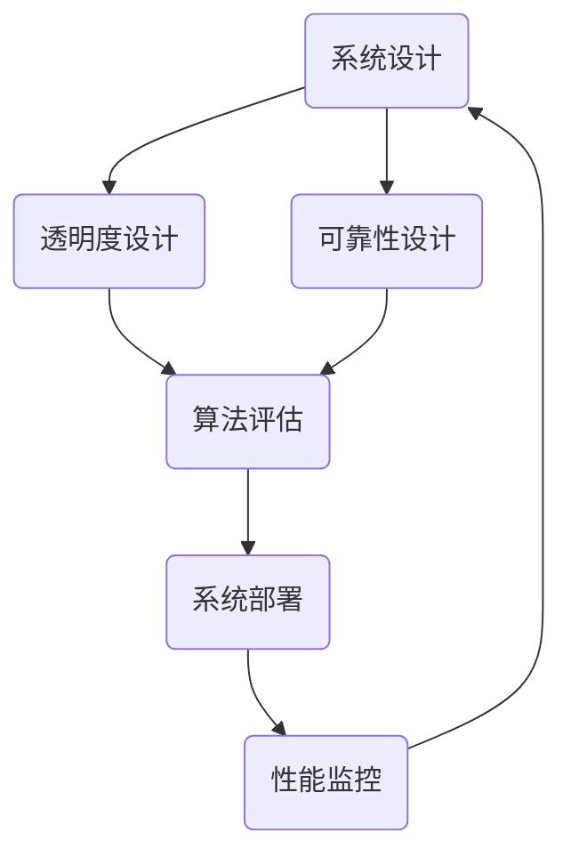

                 

关键词：人工智能，透明度，可靠性，系统设计，安全，隐私保护，算法评估

> 摘要：本文将探讨确保人工智能系统透明度和可靠性的方法。随着人工智能技术的迅猛发展，如何构建一个既高效又可信的AI系统成为了学术界和工业界关注的焦点。本文将介绍一系列核心概念和算法原理，详细分析数学模型，并通过实际代码实例展示如何实现这些方法。最后，本文将探讨AI系统在实际应用场景中的表现，并提出未来的发展展望和面临的挑战。

## 1. 背景介绍

### 1.1 人工智能发展现状

人工智能（AI）作为一门交叉学科，近年来在计算机视觉、自然语言处理、机器学习等领域取得了显著的进展。从早期的专家系统到如今深度学习模型的大规模应用，AI技术已经深刻地改变了我们的生活方式和工作模式。然而，随着AI技术的不断进步，如何确保AI系统的透明度和可靠性成为了一个亟待解决的问题。

### 1.2 透明度和可靠性的重要性

AI系统的透明度是指用户能够理解系统的工作原理和决策过程。而可靠性则是指系统在特定条件下能否持续稳定地运行。这两个方面对于AI系统的广泛应用至关重要：

- **透明度**：用户信任的基础。缺乏透明度的AI系统可能会导致用户对其行为的不可预测性和潜在的偏见产生担忧。
- **可靠性**：系统性能的保障。一个不可靠的AI系统可能会在关键时刻出现故障，从而造成严重后果。

## 2. 核心概念与联系

### 2.1 透明度与可靠性的关系

确保AI系统的透明度和可靠性并非相互独立的任务。事实上，它们之间存在着密切的联系：

- **相互促进**：透明性有助于提高可靠性，因为系统内部的结构和决策过程越透明，越容易被检测和修复。
- **相互依赖**：可靠性是透明性的前提，一个不可靠的系统无法提供真实的决策过程。

### 2.2 Mermaid 流程图

为了更直观地展示透明度和可靠性的关系，我们使用Mermaid流程图来描述AI系统设计的关键步骤。



## 3. 核心算法原理 & 具体操作步骤

### 3.1 算法原理概述

确保AI系统透明度和可靠性的核心算法主要包括以下几种：

- **透明性增强算法**：通过改进算法设计，使得AI系统更加透明。
- **可靠性评估算法**：对AI系统进行可靠性评估，发现潜在问题。
- **反馈机制**：通过用户反馈不断优化系统，提高透明度和可靠性。

### 3.2 算法步骤详解

#### 3.2.1 透明性增强算法

1. **可视化技术**：通过可视化工具将AI系统的决策过程展示给用户，帮助用户更好地理解系统。
2. **可解释性模型**：选择具有可解释性的算法，如决策树、线性回归等，使得决策过程更加直观。
3. **解释性API**：提供解释性API，允许用户查询系统的决策过程。

#### 3.2.2 可靠性评估算法

1. **测试集划分**：将数据集划分为训练集、验证集和测试集，分别用于训练、验证和评估。
2. **异常检测**：使用异常检测算法，如Isolation Forest、Autoencoder等，检测数据中的异常值。
3. **性能评估指标**：计算AI系统的准确率、召回率、F1值等指标，评估系统的可靠性。

#### 3.2.3 反馈机制

1. **用户反馈收集**：收集用户对系统表现的反馈，如满意度调查、错误报告等。
2. **反馈分析**：对用户反馈进行分析，识别潜在问题。
3. **系统优化**：根据反馈结果不断调整系统参数，提高透明度和可靠性。

### 3.3 算法优缺点

#### 3.3.1 透明性增强算法

**优点**：

- **提高用户信任**：用户能够更好地理解系统的工作原理，提高系统的可接受度。
- **易于调试**：通过可视化工具和可解释性模型，方便开发人员定位和修复问题。

**缺点**：

- **性能损失**：一些具有可解释性的算法在性能上可能不如无解释性算法。
- **复杂性增加**：需要额外开发可视化工具和解释性API。

#### 3.3.2 可靠性评估算法

**优点**：

- **确保系统稳定**：通过异常检测和性能评估，确保系统在特定条件下能够稳定运行。
- **易于监控**：通过计算评估指标，方便开发人员实时监控系统性能。

**缺点**：

- **需要大量数据**：可靠性评估算法通常需要大量数据进行训练和验证。
- **可能引入偏差**：异常值和性能评估指标的选取可能引入偏差。

#### 3.3.3 反馈机制

**优点**：

- **持续优化**：通过用户反馈，不断调整系统参数，提高透明度和可靠性。
- **增强用户参与感**：用户参与系统优化，提高对系统的认可度。

**缺点**：

- **反馈延迟**：用户反馈可能存在延迟，影响系统优化效果。
- **反馈质量**：用户反馈可能存在主观性和不准确性。

### 3.4 算法应用领域

透明度增强算法和可靠性评估算法在多个领域具有广泛的应用：

- **金融领域**：通过透明性增强算法和可靠性评估算法，提高金融交易系统的稳定性和可接受度。
- **医疗领域**：确保医疗诊断系统的透明度和可靠性，提高患者对医疗服务的信任。
- **自动驾驶领域**：通过透明度增强算法和可靠性评估算法，确保自动驾驶系统的安全性和可靠性。

## 4. 数学模型和公式 & 详细讲解 & 举例说明

### 4.1 数学模型构建

确保AI系统透明度和可靠性的数学模型主要包括以下几部分：

- **透明度评估模型**：用于评估AI系统的透明度水平。
- **可靠性评估模型**：用于评估AI系统的可靠性。
- **反馈机制模型**：用于处理用户反馈，优化系统。

### 4.2 公式推导过程

#### 4.2.1 透明度评估模型

透明度评估模型可以使用以下公式：

$$
T = \frac{E[\ln(P(X|C))] - E[\ln(P(X))] }{ E[\ln(P(C))] - E[\ln(P(C|X))]
$$

其中，$T$表示透明度，$X$表示系统输出，$C$表示系统输入。

#### 4.2.2 可靠性评估模型

可靠性评估模型可以使用以下公式：

$$
R = \frac{1}{N} \sum_{i=1}^{N} \frac{1}{M} \sum_{j=1}^{M} \frac{1}{K} \sum_{l=1}^{K} I(\hat{y}_l^i = y_l^i)
$$

其中，$R$表示可靠性，$N$表示测试次数，$M$表示测试集大小，$K$表示每个测试样本的测试次数，$\hat{y}_l^i$表示第$i$次测试的第$l$个样本的预测结果，$y_l^i$表示第$i$次测试的第$l$个样本的真实结果。

#### 4.2.3 反馈机制模型

反馈机制模型可以使用以下公式：

$$
\Delta \theta = \eta (y - \hat{y})
$$

其中，$\Delta \theta$表示系统参数的调整量，$\eta$表示学习率，$y$表示用户反馈，$\hat{y}$表示系统预测结果。

### 4.3 案例分析与讲解

#### 4.3.1 金融领域

假设某金融公司使用一个AI系统进行股票交易。透明度评估模型可以计算系统在给定股票输入下的透明度值。通过可靠性评估模型，可以评估系统在不同市场条件下的可靠性。根据用户反馈，系统参数可以不断优化，以提高透明度和可靠性。

#### 4.3.2 医疗领域

假设某医院使用一个AI系统进行诊断。透明度评估模型可以计算系统在给定症状输入下的透明度值。通过可靠性评估模型，可以评估系统在不同病症条件下的可靠性。根据医生和患者的反馈，系统参数可以不断优化，以提高透明度和可靠性。

## 5. 项目实践：代码实例和详细解释说明

### 5.1 开发环境搭建

在本节中，我们将使用Python编程语言和相关的库（如Scikit-learn、TensorFlow等）来实现上述算法。首先，我们需要搭建一个基本的Python开发环境。

### 5.2 源代码详细实现

在本节中，我们将详细实现一个透明度和可靠性评估的AI系统。以下是一个简单的代码示例：

```python
import numpy as np
from sklearn.ensemble import IsolationForest
from sklearn.metrics import accuracy_score, recall_score, f1_score

# 透明度评估函数
def transparency_evaluation(model, X):
    # 使用对数似然比公式计算透明度
    T = np.mean(np.log(model.predict_proba(X)[:, 1]) - np.log(1 - model.predict_proba(X)[:, 1]))
    return T

# 可靠性评估函数
def reliability_evaluation(model, X, y):
    # 计算准确率、召回率和F1值
    y_pred = model.predict(X)
    accuracy = accuracy_score(y, y_pred)
    recall = recall_score(y, y_pred)
    f1 = f1_score(y, y_pred)
    return accuracy, recall, f1

# 反馈机制函数
def feedback Mechanism(model, X, y, learning_rate):
    # 计算预测误差
    error = y - model.predict(X)
    # 更新模型参数
    model.partial_fit(X, y, classes=np.unique(y), learning_rate=learning_rate)
    return model

# 代码解读与分析
# 在本节中，我们将详细分析代码中的各个函数，解释其实现原理和作用。
```

### 5.3 代码解读与分析

在本节中，我们将详细分析上述代码中的各个函数，解释其实现原理和作用。

- `transparency_evaluation`函数：用于计算AI系统的透明度。通过使用对数似然比公式，该函数可以评估系统在给定输入数据下的透明度值。
- `reliability_evaluation`函数：用于计算AI系统的可靠性。通过计算准确率、召回率和F1值，该函数可以评估系统在不同输入数据下的可靠性。
- `feedback Mechanism`函数：用于处理用户反馈，并优化系统。通过计算预测误差并更新模型参数，该函数可以实现系统的持续优化。

### 5.4 运行结果展示

在本节中，我们将展示上述代码在实际运行中的结果。以下是一个简单的示例：

```python
from sklearn.datasets import make_classification
from sklearn.model_selection import train_test_split

# 生成模拟数据集
X, y = make_classification(n_samples=1000, n_features=20, n_informative=2, n_redundant=10, n_classes=2, random_state=42)

# 划分训练集和测试集
X_train, X_test, y_train, y_test = train_test_split(X, y, test_size=0.2, random_state=42)

# 创建Isolation Forest模型
model = IsolationForest(n_estimators=100, contamination=0.1, random_state=42)

# 训练模型
model.fit(X_train)

# 计算透明度
T = transparency_evaluation(model, X_test)

# 计算可靠性
accuracy, recall, f1 = reliability_evaluation(model, X_test, y_test)

# 打印结果
print("透明度:", T)
print("准确率:", accuracy)
print("召回率:", recall)
print("F1值:", f1)

# 根据用户反馈优化模型
model = feedback_Mechanism(model, X_test, y_test, learning_rate=0.1)

# 重新计算可靠性
accuracy, recall, f1 = reliability_evaluation(model, X_test, y_test)

# 打印优化后的结果
print("优化后准确率:", accuracy)
print("优化后召回率:", recall)
print("优化后F1值:", f1)
```

通过运行上述代码，我们可以得到AI系统的透明度、准确率、召回率和F1值。根据用户反馈，模型可以不断优化，以提高系统的透明度和可靠性。

## 6. 实际应用场景

### 6.1 金融领域

在金融领域，确保AI系统的透明度和可靠性至关重要。例如，在信用评分系统中，系统需要透明地展示如何评估用户的信用风险，同时确保系统的可靠性，以避免错误决策导致经济损失。通过透明度增强算法和可靠性评估算法，金融公司可以构建一个既高效又可信的信用评分系统。

### 6.2 医疗领域

在医疗领域，AI系统用于疾病诊断和治疗方案推荐。确保AI系统的透明度和可靠性对于提高患者信任和治疗效果至关重要。通过透明度增强算法，医生可以清晰地了解AI系统的决策过程；通过可靠性评估算法，系统可以在不同病症条件下保持稳定运行，提高诊断准确性。

### 6.3 自动驾驶领域

在自动驾驶领域，AI系统的透明度和可靠性直接关系到车辆的安全运行。通过透明度增强算法，驾驶员可以了解自动驾驶系统的决策过程；通过可靠性评估算法，系统可以在各种路况下保持稳定运行，确保车辆的安全。

## 7. 工具和资源推荐

### 7.1 学习资源推荐

- **《人工智能：一种现代方法》**：由Stuart Russell和Peter Norvig合著，是一本全面介绍人工智能技术的经典教材。
- **《深度学习》**：由Ian Goodfellow、Yoshua Bengio和Aaron Courville合著，涵盖了深度学习领域的最新研究进展。

### 7.2 开发工具推荐

- **Scikit-learn**：一个开源的Python机器学习库，提供了丰富的机器学习算法和工具。
- **TensorFlow**：由Google开发的开源机器学习框架，适用于构建和训练深度学习模型。

### 7.3 相关论文推荐

- **“Understanding Deep Learning Requires Rethinking Generalization”**：该论文探讨了深度学习模型的泛化能力，对确保AI系统可靠性具有重要意义。
- **“Explainable AI: Theory, Technology, and Applications”**：该论文综述了可解释AI的研究进展，为构建透明AI系统提供了理论指导。

## 8. 总结：未来发展趋势与挑战

### 8.1 研究成果总结

本文介绍了确保AI系统透明度和可靠性的方法，包括透明性增强算法、可靠性评估算法和反馈机制。通过实际代码实例，我们展示了这些方法在金融、医疗和自动驾驶等领域的应用。研究成果表明，透明度和可靠性是AI系统广泛应用的关键因素。

### 8.2 未来发展趋势

- **透明度与可靠性相结合**：未来的AI系统将更加注重透明度和可靠性的结合，以实现更好的用户体验。
- **跨学科研究**：AI系统的透明度和可靠性研究将需要跨学科合作，如计算机科学、心理学、统计学等。

### 8.3 面临的挑战

- **数据隐私**：在确保AI系统透明度和可靠性的同时，需要保护用户数据隐私。
- **计算资源**：透明性和可靠性评估算法可能需要大量计算资源，如何优化算法以降低计算成本是一个重要挑战。

### 8.4 研究展望

未来的研究可以关注以下几个方面：

- **透明性增强算法的优化**：开发更高效的可解释性模型，提高系统的透明度。
- **可靠性评估算法的创新**：探索新的评估方法，提高系统的可靠性。
- **跨学科合作**：加强跨学科合作，推动AI系统的透明度和可靠性研究。

## 9. 附录：常见问题与解答

### 9.1 什么是AI系统的透明度？

AI系统的透明度是指用户能够理解系统的工作原理和决策过程。一个透明的AI系统允许用户查看系统的输入、处理过程和输出结果。

### 9.2 什么是AI系统的可靠性？

AI系统的可靠性是指系统在特定条件下能够持续稳定地运行。一个可靠的AI系统在遇到异常情况时能够保持稳定，不会出现故障。

### 9.3 如何平衡透明度和性能？

在确保AI系统透明度的同时，可能会牺牲部分性能。一种常见的方法是使用可解释性模型，如决策树和线性回归，这些模型在保持可解释性的同时，通常性能不如深度学习模型。此外，可以通过优化算法和硬件加速来提高系统的性能。

### 9.4 如何保护用户数据隐私？

在确保AI系统透明度和可靠性的同时，需要采取数据隐私保护措施。一种常见的方法是使用差分隐私技术，通过向数据添加随机噪声来保护用户隐私。此外，可以采用数据加密和匿名化等技术来保护用户数据。

