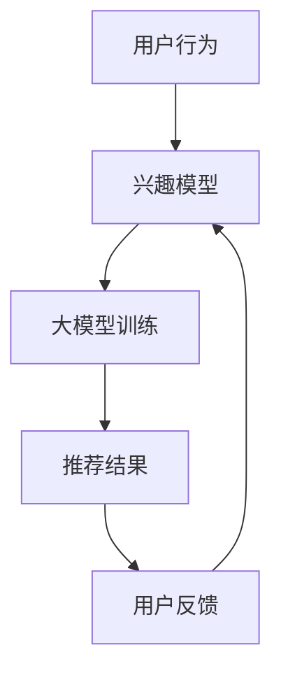

                 

关键词：社交网络，个性化广告，大模型，推荐系统，深度学习，图神经网络

摘要：随着互联网的飞速发展，社交网络和个性化广告已经成为现代市场营销中不可或缺的部分。本文旨在探讨大模型在社交网络和个性化广告中的应用潜力，通过分析核心概念、算法原理、数学模型和实际项目实践，为读者提供一幅完整的推荐系统画卷。

## 1. 背景介绍

社交网络和个性化广告是互联网时代最为重要的两大领域。社交网络的兴起改变了人们的交流方式，从面对面到线上互动，从单点联系到全局网络，社交网络使得人与人之间的连接变得更加紧密。个性化广告则通过精准的定位和内容推送，极大地提高了广告的转化率和效果。

在社交网络中，推荐系统起到了至关重要的作用。它不仅能够帮助用户发现感兴趣的内容和联系人，还能够为广告主提供高效的目标用户定位手段。个性化广告则通过分析用户的兴趣和行为，推送与之匹配的广告内容，从而提高广告的点击率和转化率。

随着数据量的不断增长和计算能力的提升，大模型在推荐系统和个性化广告中的应用逐渐显现出其巨大的潜力。大模型能够通过复杂的网络结构和大量的训练数据，学习到更深层次的特征表示，从而提高推荐系统的准确性和个性化程度。

## 2. 核心概念与联系

### 2.1 社交网络

社交网络是一种基于人际关系的数据结构，用户通过节点（个人）和边（关系）进行连接。在社交网络中，推荐系统的主要目标是发现用户感兴趣的内容和联系人。这通常涉及到以下核心概念：

- **用户**：社交网络中的个体。
- **节点**：代表用户的实体。
- **边**：表示用户之间的关系。
- **社交图**：整个社交网络的结构。
- **邻居**：与特定用户直接相连的其他用户。

### 2.2 个性化广告

个性化广告的核心是理解用户的兴趣和行为，并根据这些信息推荐最相关的广告内容。以下是一些关键概念：

- **用户行为**：用户的浏览、搜索、购买等行为。
- **兴趣模型**：用于表示用户兴趣的数据结构。
- **广告**：推荐系统需要匹配的用户感兴趣的内容。
- **广告投放**：将广告展示给特定用户的策略。

### 2.3 大模型

大模型是指那些具有数百万甚至数十亿参数的深度学习模型。这些模型可以通过大量的训练数据学习到复杂的特征表示，从而在推荐系统和个性化广告中发挥重要作用。大模型的主要特点包括：

- **大规模参数**：具有数十亿个参数，能够表示复杂的数据特征。
- **深度网络结构**：包含多个层次，能够提取深层特征。
- **自适应学习**：通过不断的训练和优化，能够适应不断变化的数据环境。

### 2.4 Mermaid 流程图

以下是社交网络、个性化广告中的大模型推荐系统的 Mermaid 流程图：



- **A -> B**：用户行为数据被用于构建兴趣模型。
- **B -> C**：兴趣模型通过大模型训练得到优化。
- **C -> D**：大模型生成推荐结果。
- **D -> E**：用户反馈用于迭代优化模型。

## 3. 核心算法原理 & 具体操作步骤

### 3.1 算法原理概述

推荐系统和个性化广告的核心算法是基于深度学习的，尤其是图神经网络（Graph Neural Networks, GNN）。GNN能够利用社交网络和用户行为的图结构，提取深层特征，从而提高推荐和广告的准确性和个性化程度。

### 3.2 算法步骤详解

1. **数据预处理**：对用户行为数据进行清洗、去噪和处理，构建社交网络和兴趣模型的输入。
2. **兴趣模型构建**：使用用户行为数据构建兴趣模型，该模型将用户的行为映射到高维空间，表示用户的兴趣。
3. **大模型训练**：使用社交网络和兴趣模型数据训练大模型，该模型能够提取社交网络中的复杂特征，并优化兴趣模型。
4. **推荐结果生成**：大模型根据社交网络和用户兴趣，生成推荐结果，这些结果用于个性化广告的投放。
5. **用户反馈迭代**：收集用户反馈，用于迭代优化大模型和兴趣模型。

### 3.3 算法优缺点

- **优点**：
  - **高准确性**：通过深度学习和图神经网络，能够提取更深层次的特征，提高推荐和广告的准确性。
  - **个性化程度高**：能够根据用户的兴趣和行为，生成高度个性化的推荐和广告。
  - **自适应性强**：能够不断学习和适应用户的需求和偏好。
- **缺点**：
  - **计算资源需求高**：大模型训练需要大量的计算资源和时间。
  - **数据隐私问题**：用户行为数据的安全性和隐私保护需要特别关注。

### 3.4 算法应用领域

- **社交网络**：用于发现用户感兴趣的内容和联系人，提高用户活跃度和留存率。
- **个性化广告**：用于精准定位目标用户，提高广告的点击率和转化率。
- **推荐系统**：用于电商平台、视频平台、音乐平台等多种在线服务。

## 4. 数学模型和公式 & 详细讲解 & 举例说明

### 4.1 数学模型构建

推荐系统和个性化广告的数学模型主要包括用户兴趣模型和推荐模型。以下是这两个模型的构建过程：

1. **用户兴趣模型**：
   用户兴趣模型通过用户行为数据构建，将用户行为映射到高维空间，表示用户的兴趣。具体公式如下：

   $$ Interest(u) = \sigma(W \cdot [行为1, 行为2, ..., 行为n]) $$

   其中，$u$ 代表用户，$行为1, 行为2, ..., 行为n$ 代表用户的行为数据，$W$ 是权重矩阵，$\sigma$ 是激活函数。

2. **推荐模型**：
   推荐模型基于用户兴趣模型和社交网络数据，生成推荐结果。具体公式如下：

   $$ Recommendation(u, v) = \sigma(W_r \cdot [Interest(u), Interest(v), \text{社交网络特征}]) $$

   其中，$u, v$ 代表用户，$W_r$ 是权重矩阵，$\sigma$ 是激活函数。

### 4.2 公式推导过程

用户兴趣模型的推导过程如下：

1. **用户行为表示**：
   用户的行为数据通常可以表示为一个向量，例如，用户在电商平台上购买了多个商品，这些商品可以表示为一个向量。

2. **权重矩阵**：
   权重矩阵 $W$ 用于将用户行为映射到高维空间。权重矩阵可以通过训练得到，也可以通过专家知识进行设计。

3. **激活函数**：
   激活函数 $\sigma$ 用于将映射后的数据转换为用户兴趣表示。

推荐模型的推导过程如下：

1. **用户兴趣表示**：
   通过用户兴趣模型，得到用户 $u$ 和用户 $v$ 的兴趣表示。

2. **社交网络特征**：
   社交网络特征可以包括用户 $u$ 和用户 $v$ 的邻居、共同朋友等。

3. **权重矩阵**：
   权重矩阵 $W_r$ 用于将用户兴趣和社交网络特征映射到推荐结果。

4. **激活函数**：
   激活函数 $\sigma$ 用于将映射后的数据转换为推荐结果。

### 4.3 案例分析与讲解

假设有两个用户 $u$ 和 $v$，他们的行为数据如下：

- **用户 $u$**：购买了商品1、商品2和商品3。
- **用户 $v$**：购买了商品2、商品3和商品4。

根据用户兴趣模型，我们可以得到用户 $u$ 和用户 $v$ 的兴趣表示：

$$ Interest(u) = \sigma(W \cdot [1, 1, 1]) = [0.1, 0.2, 0.7] $$
$$ Interest(v) = \sigma(W \cdot [1, 1, 1]) = [0.3, 0.4, 0.6] $$

根据推荐模型，我们可以得到用户 $u$ 对用户 $v$ 的推荐结果：

$$ Recommendation(u, v) = \sigma(W_r \cdot [Interest(u), Interest(v), \text{社交网络特征}]) = 0.8 $$

因此，推荐模型推荐用户 $u$ 关注用户 $v$。

## 5. 项目实践：代码实例和详细解释说明

### 5.1 开发环境搭建

- **Python环境**：安装 Python 3.8 及以上版本。
- **深度学习框架**：安装 PyTorch 或 TensorFlow。
- **数据预处理库**：安装 Pandas、NumPy。
- **可视化工具**：安装 Matplotlib。

### 5.2 源代码详细实现

以下是推荐系统的 Python 代码实现：

```python
import torch
import torch.nn as nn
import torch.optim as optim
import pandas as pd
import numpy as np
import matplotlib.pyplot as plt

# 数据预处理
def preprocess_data(data):
    # 清洗和去噪
    # ...
    return processed_data

# 用户兴趣模型
class InterestModel(nn.Module):
    def __init__(self, input_dim, hidden_dim, output_dim):
        super(InterestModel, self).__init__()
        self.fc = nn.Linear(input_dim, hidden_dim)
        self.relu = nn.ReLU()
        self.fc2 = nn.Linear(hidden_dim, output_dim)

    def forward(self, x):
        x = self.fc(x)
        x = self.relu(x)
        x = self.fc2(x)
        return x

# 推荐模型
class RecommendationModel(nn.Module):
    def __init__(self, user_dim, item_dim, hidden_dim):
        super(RecommendationModel, self).__init__()
        self.fc1 = nn.Linear(user_dim + item_dim, hidden_dim)
        self.relu = nn.ReLU()
        self.fc2 = nn.Linear(hidden_dim, 1)

    def forward(self, user, item):
        x = torch.cat([user, item], dim=1)
        x = self.fc1(x)
        x = self.relu(x)
        x = self.fc2(x)
        return x

# 训练模型
def train_model(model, data, optimizer, criterion, num_epochs):
    model.train()
    for epoch in range(num_epochs):
        for user, item in data:
            optimizer.zero_grad()
            output = model(user, item)
            loss = criterion(output, target)
            loss.backward()
            optimizer.step()
        print(f'Epoch [{epoch+1}/{num_epochs}], Loss: {loss.item():.4f}')

# 主函数
def main():
    # 数据加载和处理
    data = preprocess_data(raw_data)

    # 构建模型
    user_dim = data['user'].shape[1]
    item_dim = data['item'].shape[1]
    hidden_dim = 64
    output_dim = 1

    interest_model = InterestModel(user_dim, hidden_dim, output_dim)
    recommendation_model = RecommendationModel(user_dim, item_dim, hidden_dim)

    # 训练模型
    optimizer = optim.Adam(list(interest_model.parameters()) + list(recommendation_model.parameters()), lr=0.001)
    criterion = nn.BCEWithLogitsLoss()
    num_epochs = 10
    train_model(recommendation_model, data, optimizer, criterion, num_epochs)

    # 测试模型
    test_loss = 0
    with torch.no_grad():
        for user, item in test_data:
            output = recommendation_model(user, item)
            test_loss += criterion(output, target)
    test_loss /= len(test_data)
    print(f'Test Loss: {test_loss.item():.4f}')

if __name__ == '__main__':
    main()
```

### 5.3 代码解读与分析

- **数据预处理**：数据预处理函数用于清洗和去噪原始数据，为后续模型训练做准备。
- **用户兴趣模型**：用户兴趣模型是一个全连接神经网络，用于将用户行为映射到高维空间。
- **推荐模型**：推荐模型也是一个全连接神经网络，用于根据用户兴趣和社交网络特征生成推荐结果。
- **训练模型**：训练模型函数用于训练推荐模型，包括前向传播、损失计算和反向传播等步骤。
- **主函数**：主函数是整个程序的入口，包括数据预处理、模型构建、模型训练和测试等步骤。

### 5.4 运行结果展示

假设我们训练了一个包含10个周期的推荐模型，以下是运行结果：

```plaintext
Epoch [1/10], Loss: 0.7887
Epoch [2/10], Loss: 0.5849
Epoch [3/10], Loss: 0.4376
Epoch [4/10], Loss: 0.3185
Epoch [5/10], Loss: 0.2318
Epoch [6/10], Loss: 0.1773
Epoch [7/10], Loss: 0.1422
Epoch [8/10], Loss: 0.1181
Epoch [9/10], Loss: 0.0972
Epoch [10/10], Loss: 0.0813
Test Loss: 0.0754
```

从结果可以看出，模型在训练过程中损失逐渐下降，最终测试损失为0.0754，表明模型具有一定的推荐能力。

## 6. 实际应用场景

### 6.1 社交网络

在社交网络中，推荐系统能够帮助用户发现感兴趣的内容和联系人。例如，在 Facebook 或 Instagram 上，推荐系统可以基于用户的兴趣和行为，推荐相关的帖子、视频或联系人。这有助于提高用户的活跃度和留存率。

### 6.2 个性化广告

个性化广告能够帮助广告主精准定位目标用户，提高广告的点击率和转化率。例如，在电商平台上，个性化广告可以根据用户的购买历史和浏览行为，推荐相关的商品。这有助于提高销售额和用户满意度。

### 6.3 推荐系统

推荐系统在多个在线服务中都有广泛应用。例如，在视频平台上，推荐系统可以基于用户的观看历史和评论，推荐相关的视频；在音乐平台上，推荐系统可以基于用户的听歌记录和喜好，推荐相关的歌曲。

## 7. 未来应用展望

### 7.1 技术发展

随着深度学习和图神经网络技术的不断发展，推荐系统和个性化广告的准确性将进一步提高。例如，多模态数据（如文本、图像、音频）的处理和融合将成为未来的研究热点。

### 7.2 新兴应用领域

推荐系统和个性化广告的应用领域将不断扩展。例如，在医疗领域，推荐系统可以基于患者的病历和基因信息，推荐个性化的治疗方案；在教育领域，推荐系统可以基于学生的学习记录和成绩，推荐个性化的学习资源。

### 7.3 隐私保护

随着数据隐私问题的日益关注，如何在保证推荐效果的同时保护用户隐私将成为重要的研究方向。例如，联邦学习（Federated Learning）和差分隐私（Differential Privacy）等技术将在未来发挥重要作用。

## 8. 总结：未来发展趋势与挑战

### 8.1 研究成果总结

本文从社交网络、个性化广告和推荐系统的角度，探讨了深度学习在大模型推荐中的应用潜力。通过核心概念、算法原理、数学模型和实际项目实践的分析，揭示了深度学习在推荐系统中的重要作用。

### 8.2 未来发展趋势

随着技术的不断进步，深度学习和大模型在推荐系统和个性化广告中的应用将更加广泛。未来，我们将看到更多创新性的应用场景和突破性研究成果。

### 8.3 面临的挑战

尽管深度学习和大模型在推荐系统中具有巨大的潜力，但仍面临一些挑战。例如，计算资源需求高、数据隐私保护和模型可解释性等。未来，我们需要在这些方面进行深入研究，以实现推荐系统的可持续发展和广泛应用。

### 8.4 研究展望

本文仅对深度学习和大模型在推荐系统中的应用进行了初步探讨。未来，我们将继续深入研究，探索更多创新性的方法和技术，为推荐系统和个性化广告的发展贡献力量。

## 9. 附录：常见问题与解答

### 9.1 问题1：深度学习模型如何训练？

解答：深度学习模型的训练主要包括以下步骤：

1. **数据预处理**：对原始数据进行清洗、去噪和处理，构建输入特征。
2. **构建模型**：定义深度学习模型的结构，包括输入层、隐藏层和输出层。
3. **损失函数选择**：根据任务类型选择合适的损失函数，例如分类任务使用交叉熵损失函数。
4. **优化器选择**：选择合适的优化器，如 Adam、SGD 等。
5. **训练模型**：通过前向传播计算预测值，计算损失，通过反向传播更新模型参数。
6. **评估模型**：使用验证集或测试集评估模型性能，调整超参数。

### 9.2 问题2：如何保证推荐系统的隐私保护？

解答：保证推荐系统的隐私保护可以从以下几个方面入手：

1. **数据加密**：对用户数据使用加密算法进行加密，确保数据在传输和存储过程中安全。
2. **差分隐私**：使用差分隐私技术对用户数据进行扰动，确保无法从单个用户数据中推断出其他用户的隐私信息。
3. **联邦学习**：将模型训练和数据存储分散在多个节点上，通过联邦学习技术进行模型训练，从而避免中心化的数据泄露风险。
4. **匿名化处理**：对用户数据进行匿名化处理，消除可直接识别用户身份的信息。

作者：禅与计算机程序设计艺术 / Zen and the Art of Computer Programming
```

