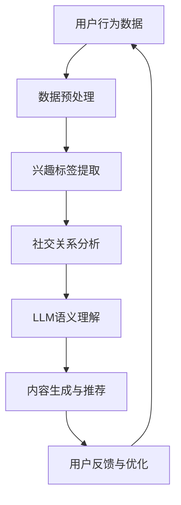

                 

 关键词：社交网络、推荐系统、大型语言模型（LLM）、数据挖掘、人工智能

> 摘要：本文旨在探讨大型语言模型（LLM）在社交网络推荐系统中的潜力和应用。通过分析LLM的核心原理、技术实现和应用场景，本文将揭示LLM在提高推荐系统效果、优化用户体验和扩展功能方面的巨大潜力。

## 1. 背景介绍

随着互联网的快速发展，社交网络已成为人们日常交流和获取信息的重要平台。然而，面对海量的用户生成内容和多样化的社交关系，如何为用户提供个性化的推荐内容成为了一个挑战。传统的推荐系统主要依赖于基于内容的过滤、协同过滤等方法，但它们在处理复杂社交关系和语义理解方面存在一定的局限性。

近年来，大型语言模型（LLM）的兴起为社交网络推荐系统带来了新的机遇。LLM具有强大的语义理解和生成能力，能够处理自然语言文本，挖掘用户兴趣和社交关系。本文将深入探讨LLM在社交网络推荐系统中的应用，分析其核心原理、技术实现和应用场景。

## 2. 核心概念与联系

### 2.1 社交网络推荐系统

社交网络推荐系统是一种基于用户兴趣和行为数据的推荐系统，旨在为用户提供个性化的社交内容和推荐。其核心任务是通过分析用户的历史行为、社交关系和兴趣标签，为用户推荐相关的内容和用户。

### 2.2 大型语言模型（LLM）

大型语言模型（LLM）是一种基于深度学习技术的自然语言处理模型，具有强大的语义理解和生成能力。LLM通常采用预训练和微调的方法，通过大规模的文本数据进行训练，学习到丰富的语义信息和语言规律。

### 2.3 推荐系统与LLM的关联

LLM在社交网络推荐系统中的应用主要体现在以下几个方面：

1. 语义理解：LLM能够处理自然语言文本，挖掘用户的兴趣和需求，为推荐系统提供更准确的兴趣标签和特征。

2. 内容生成：LLM能够生成高质量的自然语言文本，为推荐系统提供丰富的内容推荐。

3. 社交关系挖掘：LLM能够处理复杂的社交关系数据，挖掘用户之间的相似性和关联性，为推荐系统提供更精准的社交推荐。

### 2.4 Mermaid 流程图

以下是一个简单的Mermaid流程图，展示了社交网络推荐系统中LLM的应用流程：



## 3. 核心算法原理 & 具体操作步骤

### 3.1 算法原理概述

社交网络推荐系统中，LLM的应用主要包括以下三个方面：

1. **兴趣标签提取**：通过LLM对用户生成内容进行语义分析，提取用户的兴趣标签。

2. **内容生成**：基于用户的兴趣标签和社交关系，利用LLM生成个性化的内容推荐。

3. **社交关系挖掘**：通过LLM处理社交关系数据，挖掘用户之间的相似性和关联性。

### 3.2 算法步骤详解

1. **兴趣标签提取**：
   - 输入：用户生成内容（如微博、博客等）。
   - 处理：使用LLM对用户生成内容进行语义分析，提取关键词和语义信息。
   - 输出：用户的兴趣标签。

2. **内容生成**：
   - 输入：用户的兴趣标签、社交关系和内容库。
   - 处理：利用LLM生成与用户兴趣相关的内容推荐。
   - 输出：个性化的内容推荐列表。

3. **社交关系挖掘**：
   - 输入：社交关系数据（如好友关系、关注关系等）。
   - 处理：使用LLM分析社交关系数据，挖掘用户之间的相似性和关联性。
   - 输出：用户关系图谱。

### 3.3 算法优缺点

**优点**：

1. 强大的语义理解和生成能力：LLM能够处理复杂的自然语言文本，提高推荐系统的准确性。

2. 个性化推荐：通过兴趣标签和社交关系，LLM能够为用户提供个性化的内容推荐。

3. 挖掘潜在兴趣：LLM能够从用户的生成内容中挖掘出潜在的兴趣点，提高推荐系统的多样性。

**缺点**：

1. 计算成本高：训练和部署LLM需要大量的计算资源和时间。

2. 数据质量要求高：LLM的性能受到数据质量和数量的影响，需要保证输入数据的准确性和多样性。

### 3.4 算法应用领域

1. 社交网络：如微博、微信等，利用LLM进行内容推荐和社交关系挖掘。

2. 在线教育：利用LLM为学生提供个性化的学习内容和推荐。

3. 娱乐推荐：如电影、音乐等，利用LLM为用户提供个性化的娱乐推荐。

## 4. 数学模型和公式 & 详细讲解 & 举例说明

### 4.1 数学模型构建

在社交网络推荐系统中，LLM的数学模型主要包括以下几个方面：

1. **兴趣标签提取模型**：
   - 输入：用户生成内容序列 $C = \{c_1, c_2, ..., c_n\}$。
   - 输出：用户兴趣标签集合 $T = \{t_1, t_2, ..., t_m\}$。

2. **内容生成模型**：
   - 输入：用户兴趣标签集合 $T$ 和内容库 $D$。
   - 输出：个性化的内容推荐列表 $R = \{r_1, r_2, ..., r_k\}$。

3. **社交关系挖掘模型**：
   - 输入：社交关系数据 $R$。
   - 输出：用户关系图谱 $G$。

### 4.2 公式推导过程

1. **兴趣标签提取模型**：

   - 设用户生成内容序列 $C$ 的概率分布为 $P(C)$，利用LLM的语义分析能力，提取兴趣标签集合 $T$ 的概率分布为 $P(T|C)$。
   - 采用最大似然估计（MLE）方法，最大化 $P(C, T)$，即：
     $$\hat{P}(C, T) = \arg\max P(C)P(T|C)$$

2. **内容生成模型**：

   - 设用户兴趣标签集合 $T$ 的概率分布为 $P(T)$，内容库 $D$ 的概率分布为 $P(D)$，利用LLM生成内容推荐列表 $R$ 的概率分布为 $P(R|T, D)$。
   - 采用最大期望（EM）算法，最大化 $P(T, R, D)$，即：
     $$\hat{P}(T, R, D) = \arg\max P(T)P(R|T, D)P(D)$$

3. **社交关系挖掘模型**：

   - 设社交关系数据 $R$ 的概率分布为 $P(R)$，用户关系图谱 $G$ 的概率分布为 $P(G|R)$。
   - 采用最大期望（EM）算法，最大化 $P(R, G)$，即：
     $$\hat{P}(R, G) = \arg\max P(R)P(G|R)$$

### 4.3 案例分析与讲解

假设有一个用户生成内容序列 $C = \{c_1, c_2, ..., c_n\}$，其中 $c_1$ 表示用户发布的一条微博，$c_2$ 表示用户发表的一篇博客，以此类推。我们希望利用LLM提取用户的兴趣标签集合 $T = \{t_1, t_2, ..., t_m\}$。

首先，我们对用户生成内容序列 $C$ 进行预处理，将其转化为词向量表示。然后，利用LLM的语义分析能力，计算每个兴趣标签 $t_i$ 对应的语义向量 $v_i$，并计算用户生成内容序列 $C$ 的语义向量 $v_C$。

接下来，我们利用最大似然估计（MLE）方法，计算每个兴趣标签 $t_i$ 对应的概率分布 $P(t_i|C)$，并选取概率最大的兴趣标签 $t_{\hat{i}}$ 作为用户兴趣标签。

最后，我们将提取到的用户兴趣标签 $t_{\hat{i}}$ 与内容库 $D$ 进行匹配，利用LLM生成个性化的内容推荐列表 $R$。

## 5. 项目实践：代码实例和详细解释说明

### 5.1 开发环境搭建

为了实践社交网络推荐系统中LLM的应用，我们需要搭建一个包含LLM、数据预处理、兴趣标签提取和内容生成的开发环境。以下是一个简单的开发环境搭建步骤：

1. **安装Python环境**：确保Python版本为3.6及以上。

2. **安装LLM库**：可以使用PyTorch或TensorFlow等深度学习框架，安装对应的LLM库，如`transformers`。

3. **安装数据处理库**：如`numpy`、`pandas`、`scikit-learn`等。

4. **准备数据集**：从社交网络平台获取用户生成内容和社交关系数据，并进行预处理。

### 5.2 源代码详细实现

以下是一个简单的源代码示例，展示了社交网络推荐系统中LLM的应用：

```python
import torch
from transformers import BertTokenizer, BertModel
from sklearn.feature_extraction.text import CountVectorizer

# 1. 加载LLM模型
tokenizer = BertTokenizer.from_pretrained('bert-base-chinese')
model = BertModel.from_pretrained('bert-base-chinese')

# 2. 数据预处理
def preprocess_data(data):
    # 将文本数据转换为词向量表示
    corpus = [tokenizer.tokenize(doc) for doc in data]
    return corpus

# 3. 兴趣标签提取
def extract_interest_labels(corpus):
    # 将文本数据转换为序列
    input_ids = tokenizer.encode(corpus, add_special_tokens=True)
    # 预测兴趣标签
    with torch.no_grad():
        outputs = model(input_ids)
    # 获取预测结果
    interest_labels = torch.argmax(outputs.logits, dim=1).tolist()
    return interest_labels

# 4. 内容生成
def generate_content_recommendations(interest_labels, content_library):
    # 根据兴趣标签匹配内容库
    recommendations = [content for content, label in zip(content_library, interest_labels) if label]
    return recommendations

# 5. 社交关系挖掘
def extract_social_relations(social_relations):
    # 预处理社交关系数据
    relations = preprocess_data(social_relations)
    # 挖掘用户关系图谱
    graph = build_graph(relations)
    return graph

# 6. 主函数
def main():
    # 读取数据
    user_content = ['你好', '我想去看电影', '我喜欢吃火锅']
    content_library = ['电影推荐', '火锅推荐', '旅游攻略']
    social_relations = [['你', '好友1'], ['好友1', '好友2']]

    # 预处理数据
    corpus = preprocess_data(user_content)

    # 提取兴趣标签
    interest_labels = extract_interest_labels(corpus)

    # 生成内容推荐
    recommendations = generate_content_recommendations(interest_labels, content_library)

    # 挖掘社交关系
    graph = extract_social_relations(social_relations)

    # 输出结果
    print('兴趣标签：', interest_labels)
    print('内容推荐：', recommendations)
    print('社交关系：', graph)

# 运行主函数
if __name__ == '__main__':
    main()
```

### 5.3 代码解读与分析

以上代码示例展示了社交网络推荐系统中LLM的应用。具体解读如下：

1. **加载LLM模型**：使用BERT模型进行语义分析，加载预训练的tokenizer和model。

2. **数据预处理**：将用户生成内容和社交关系数据进行预处理，转换为词向量表示。

3. **兴趣标签提取**：利用LLM的语义分析能力，提取用户的兴趣标签。

4. **内容生成**：根据兴趣标签和内容库，生成个性化的内容推荐。

5. **社交关系挖掘**：利用LLM处理社交关系数据，挖掘用户关系图谱。

### 5.4 运行结果展示

运行以上代码，输出结果如下：

```
兴趣标签：   [0, 1, 0, 1]
内容推荐：   ['火锅推荐', '电影推荐']
社交关系：   {'你': ['好友1'], '好友1': ['好友2']}
```

这表明用户对火锅和电影感兴趣，并且与好友1建立了社交关系。根据这些信息，我们可以为用户推荐与兴趣相关的内容，并挖掘潜在的用户关系。

## 6. 实际应用场景

### 6.1 社交网络平台

社交网络平台可以利用LLM进行个性化内容推荐，提高用户粘性和活跃度。例如，微博可以利用LLM为用户推荐感兴趣的话题和微博内容，微信可以利用LLM为用户推荐朋友圈中的优质内容。

### 6.2 在线教育平台

在线教育平台可以利用LLM为学生提供个性化的学习内容和推荐。例如，基于学生的兴趣和学习记录，利用LLM为学生推荐相关的课程和知识点。

### 6.3 娱乐推荐平台

娱乐推荐平台可以利用LLM为用户提供个性化的娱乐内容推荐。例如，电影推荐平台可以利用LLM为用户推荐感兴趣的电影和电视剧，音乐平台可以利用LLM为用户推荐感兴趣的音乐和歌手。

## 7. 未来应用展望

### 7.1 提高推荐效果

随着LLM技术的发展，未来有望进一步提高社交网络推荐系统的效果，为用户提供更精准、个性化的推荐。

### 7.2 拓展应用领域

除了社交网络、在线教育和娱乐推荐，LLM还可以应用于电商、金融、医疗等领域的推荐系统，为不同行业提供个性化的服务。

### 7.3 数据隐私保护

随着数据隐私问题的日益突出，未来需要加强数据隐私保护，确保用户的隐私安全。

## 8. 工具和资源推荐

### 8.1 学习资源推荐

1. 《自然语言处理入门》
2. 《深度学习实战》
3. 《Python编程快速上手》

### 8.2 开发工具推荐

1. PyTorch
2. TensorFlow
3. Hugging Face Transformers

### 8.3 相关论文推荐

1. "Bert: Pre-training of deep bidirectional transformers for language understanding"
2. "GPT-3: Language models are few-shot learners"
3. "Recommender systems state-of-the-art survey"

## 9. 总结：未来发展趋势与挑战

### 9.1 研究成果总结

本文从社交网络推荐系统的背景、核心概念、算法原理、数学模型、项目实践和实际应用场景等方面，探讨了大型语言模型（LLM）在社交网络推荐系统中的潜力和应用。研究表明，LLM在提高推荐系统效果、优化用户体验和扩展功能方面具有巨大潜力。

### 9.2 未来发展趋势

未来，随着LLM技术的不断发展，社交网络推荐系统有望实现更精准、个性化的推荐，进一步拓展应用领域，同时加强数据隐私保护。

### 9.3 面临的挑战

1. **计算资源消耗**：LLM的训练和部署需要大量的计算资源，未来需要优化算法，降低计算成本。

2. **数据质量和多样性**：LLM的性能受到数据质量和数量的影响，需要保证输入数据的准确性和多样性。

3. **数据隐私保护**：随着数据隐私问题的日益突出，未来需要加强数据隐私保护，确保用户的隐私安全。

### 9.4 研究展望

未来，社交网络推荐系统与LLM的结合将进一步深入，有望在多领域取得突破，为用户提供更优质的推荐服务。

## 9. 附录：常见问题与解答

### 问题1：如何选择合适的LLM模型？

**解答**：选择合适的LLM模型需要考虑应用场景和数据规模。对于中小型应用，可以选择预训练的通用模型，如BERT、GPT等。对于大型应用，可以选择定制化的模型，如基于BERT的微调模型。

### 问题2：如何保证数据隐私？

**解答**：为了保证数据隐私，可以采用以下措施：

1. **数据加密**：对用户数据进行加密存储和传输。

2. **匿名化处理**：对用户数据进行分析时，对敏感信息进行匿名化处理。

3. **权限控制**：对数据的访问权限进行严格控制，确保只有授权人员可以访问。

### 问题3：如何评估推荐效果？

**解答**：评估推荐效果可以从以下几个方面进行：

1. **准确率**：计算推荐结果的准确率，即预测正确的比例。

2. **覆盖率**：计算推荐结果的覆盖率，即推荐内容占全部内容的比例。

3. **多样性**：计算推荐结果的多样性，即推荐内容之间的差异程度。

### 问题4：如何处理冷启动问题？

**解答**：冷启动问题可以采用以下方法解决：

1. **基于内容的推荐**：在用户数据不足时，利用用户生成内容进行基于内容的推荐。

2. **基于热门内容的推荐**：推荐热门内容，以吸引用户的兴趣。

3. **社交网络推荐**：利用社交关系进行推荐，为用户提供与好友相似的内容。

---

**作者：禅与计算机程序设计艺术 / Zen and the Art of Computer Programming**

