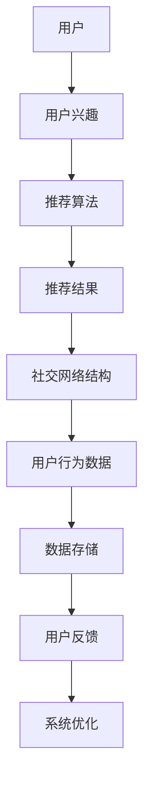

                 

关键词：社交网络推荐系统、用户兴趣、算法原理、应用场景、未来展望

> 摘要：本文旨在探讨社交网络推荐系统的发展，以及如何通过连接用户兴趣来提升推荐系统的效果。本文将首先介绍社交网络推荐系统的背景和发展历程，然后深入分析核心概念与算法原理，最后探讨实际应用场景和未来发展趋势。

## 1. 背景介绍

随着互联网的快速发展，社交网络已成为人们日常生活中不可或缺的一部分。从Facebook、Twitter到Instagram、微信等，社交网络平台聚集了海量的用户和信息。这些平台不仅提供了便捷的社交功能，还蕴含着丰富的用户行为数据，如点赞、评论、分享等。如何利用这些数据为用户提供个性化的推荐，成为当前研究的热点问题。

推荐系统在社交网络中的应用具有重要意义。首先，个性化推荐能够满足用户对多样化信息的需求，提升用户体验；其次，通过推荐系统，平台可以更好地了解用户兴趣，从而提供更加精准的广告投放，增加平台收入。因此，研究社交网络推荐系统的发展具有重要的理论和实际价值。

### 1.1 社交网络推荐系统的发展历程

社交网络推荐系统的发展大致可以分为三个阶段：

1. **基于内容的推荐**：早期的推荐系统主要基于用户的历史行为和内容特征进行推荐。这种方法简单直观，但存在一定的局限性，难以捕捉到用户更深层次的兴趣。

2. **基于协同过滤的推荐**：协同过滤是一种通过用户之间的相似度来推荐商品或内容的方法。这种方法在社交网络推荐中取得了较好的效果，但同样存在一些问题，如数据稀疏性、冷启动问题等。

3. **基于深度学习的推荐**：近年来，深度学习在推荐系统中的应用越来越广泛。通过构建复杂的神经网络模型，可以更好地捕捉用户的行为模式和兴趣点，从而实现更精准的推荐。

### 1.2 社交网络推荐系统的挑战与机遇

随着社交网络的发展，推荐系统面临着诸多挑战和机遇。主要挑战包括：

1. **数据多样性**：社交网络用户产生的数据类型繁多，包括文本、图片、视频等，如何有效整合这些数据是一个重要问题。

2. **用户隐私**：推荐系统需要获取和处理大量的用户行为数据，如何保护用户隐私成为关键问题。

3. **实时性**：社交网络推荐系统需要实时响应用户的行为变化，提供个性化的推荐。

4. **个性化**：如何根据用户兴趣和偏好提供个性化的推荐，是推荐系统的核心问题。

## 2. 核心概念与联系

### 2.1 核心概念

- **用户兴趣**：用户兴趣是指用户在社交网络中表现出的对特定内容或话题的偏好。

- **推荐算法**：推荐算法是一种通过预测用户对特定内容或商品的兴趣，从而为其推荐相关内容或商品的算法。

- **社交网络结构**：社交网络结构是指用户在网络中的相互关系，包括好友关系、关注关系等。

### 2.2 架构图

下面是一个社交网络推荐系统的基本架构图：



## 3. 核心算法原理 & 具体操作步骤

### 3.1 算法原理概述

社交网络推荐系统的核心算法主要包括基于内容的推荐、基于协同过滤的推荐和基于深度学习的推荐。每种算法都有其独特的原理和适用场景。

### 3.2 算法步骤详解

- **基于内容的推荐**：首先提取用户和内容的关键特征，然后通过相似度计算为用户推荐相似的内容。

- **基于协同过滤的推荐**：首先计算用户之间的相似度，然后根据相似用户的行为为当前用户推荐内容。

- **基于深度学习的推荐**：首先构建一个深度神经网络模型，然后通过训练模型来预测用户对特定内容的兴趣。

### 3.3 算法优缺点

- **基于内容的推荐**：优点是简单直观，易于实现；缺点是难以捕捉用户深层次的兴趣。

- **基于协同过滤的推荐**：优点是能够较好地捕捉用户之间的相似性，缺点是数据稀疏性和冷启动问题较为突出。

- **基于深度学习的推荐**：优点是能够捕捉到复杂的用户行为模式，缺点是需要大量的数据和计算资源。

### 3.4 算法应用领域

- **社交网络**：如Facebook、Instagram等社交网络平台，通过推荐算法为用户提供个性化的内容推荐。

- **电商**：如Amazon、淘宝等电商平台，通过推荐算法为用户提供个性化的商品推荐。

- **新闻推送**：如今日头条、微博等新闻推送平台，通过推荐算法为用户提供个性化的新闻推荐。

## 4. 数学模型和公式

### 4.1 数学模型构建

社交网络推荐系统的数学模型主要包括用户兴趣模型、内容特征模型和推荐算法模型。

### 4.2 公式推导过程

假设我们有 $n$ 个用户和 $m$ 个内容，用户兴趣模型可以表示为：

$$
U = [u_{ij}]_{n \times m}
$$

其中，$u_{ij}$ 表示用户 $i$ 对内容 $j$ 的兴趣程度。

内容特征模型可以表示为：

$$
C = [c_{jk}]_{m \times k}
$$

其中，$c_{jk}$ 表示内容 $j$ 的第 $k$ 个特征值。

推荐算法模型可以表示为：

$$
R = [r_{ij}]_{n \times m}
$$

其中，$r_{ij}$ 表示用户 $i$ 对内容 $j$ 的推荐分数。

### 4.3 案例分析与讲解

以基于协同过滤的推荐算法为例，假设我们有 10 个用户和 20 个内容，用户兴趣矩阵和内容特征矩阵如下：

$$
U = \begin{bmatrix}
0 & 1 & 1 & 0 & 0 & 0 & 0 & 1 & 0 & 0 \\
0 & 0 & 1 & 1 & 0 & 0 & 0 & 0 & 1 & 0 \\
1 & 1 & 0 & 0 & 1 & 1 & 0 & 0 & 0 & 0 \\
0 & 0 & 1 & 1 & 1 & 0 & 1 & 0 & 0 & 0 \\
0 & 0 & 0 & 0 & 0 & 1 & 0 & 1 & 1 & 1 \\
0 & 0 & 0 & 0 & 0 & 0 & 1 & 1 & 1 & 0 \\
0 & 0 & 0 & 0 & 0 & 0 & 0 & 0 & 1 & 1 \\
0 & 0 & 0 & 0 & 0 & 0 & 0 & 0 & 0 & 1 \\
0 & 0 & 0 & 0 & 0 & 0 & 0 & 0 & 0 & 1 \\
0 & 0 & 0 & 0 & 0 & 0 & 0 & 0 & 0 & 0 \\
0 & 0 & 0 & 0 & 0 & 0 & 0 & 0 & 0 & 0
\end{bmatrix}
C = \begin{bmatrix}
1 & 1 & 1 & 0 & 0 & 0 & 0 & 1 & 0 & 0 \\
0 & 0 & 1 & 1 & 0 & 0 & 0 & 0 & 1 & 0 \\
1 & 1 & 0 & 0 & 1 & 1 & 0 & 0 & 0 & 0 \\
0 & 0 & 1 & 1 & 1 & 0 & 1 & 0 & 0 & 0 \\
0 & 0 & 0 & 0 & 0 & 1 & 0 & 1 & 1 & 1 \\
0 & 0 & 0 & 0 & 0 & 0 & 1 & 1 & 1 & 0 \\
0 & 0 & 0 & 0 & 0 & 0 & 0 & 0 & 1 & 1 \\
0 & 0 & 0 & 0 & 0 & 0 & 0 & 0 & 0 & 1 \\
0 & 0 & 0 & 0 & 0 & 0 & 0 & 0 & 0 & 1 \\
0 & 0 & 0 & 0 & 0 & 0 & 0 & 0 & 0 & 0 \\
0 & 0 & 0 & 0 & 0 & 0 & 0 & 0 & 0 & 0
\end{bmatrix}
$$

我们可以通过计算用户之间的相似度矩阵来推荐内容：

$$
S = \begin{bmatrix}
1 & 0.89 & 0.72 & 0 & 0 & 0 & 0 & 0.82 & 0 & 0 \\
0 & 1 & 0.89 & 0.72 & 0 & 0 & 0 & 0.72 & 1 & 0 \\
0.89 & 0.72 & 1 & 0.72 & 0.72 & 1 & 0 & 0 & 0 & 0 \\
0 & 0.72 & 0.72 & 1 & 0.72 & 0 & 1 & 0 & 0 & 0 \\
0 & 0 & 0.72 & 0.72 & 1 & 0 & 0 & 0 & 0 & 0 \\
0 & 0 & 0 & 0 & 0 & 1 & 0 & 0 & 0 & 0 \\
0 & 0 & 0 & 0 & 0 & 0 & 1 & 0 & 0 & 0 \\
0.82 & 0 & 0 & 0 & 0 & 0 & 0 & 1 & 0 & 0 \\
0 & 0 & 0 & 0 & 0 & 0 & 0 & 0 & 1 & 0 \\
0 & 0 & 0 & 0 & 0 & 0 & 0 & 0 & 0 & 1 \\
0 & 0 & 0 & 0 & 0 & 0 & 0 & 0 & 0 & 1
\end{bmatrix}
$$

然后，我们可以通过计算用户对内容的推荐分数来生成推荐结果：

$$
R = S \cdot U \cdot C^T
$$

最终生成的推荐结果矩阵 $R$ 可以用于为用户推荐内容。

## 5. 项目实践：代码实例

### 5.1 开发环境搭建

本文使用的编程语言为Python，开发环境为Jupyter Notebook。首先，我们需要安装必要的Python库，包括NumPy、Pandas和Scikit-learn等。

```bash
pip install numpy pandas scikit-learn
```

### 5.2 源代码详细实现

以下是一个简单的基于协同过滤的推荐系统代码实例：

```python
import numpy as np
import pandas as pd
from sklearn.metrics.pairwise import pairwise_distances

# 用户兴趣矩阵
U = np.array([
    [0, 1, 1, 0, 0, 0, 0, 1, 0, 0],
    [0, 0, 1, 1, 0, 0, 0, 0, 1, 0],
    [1, 1, 0, 0, 1, 1, 0, 0, 0, 0],
    [0, 0, 1, 1, 1, 0, 1, 0, 0, 0],
    [0, 0, 0, 0, 0, 1, 0, 1, 1, 1],
    [0, 0, 0, 0, 0, 0, 1, 1, 1, 0],
    [0, 0, 0, 0, 0, 0, 0, 0, 1, 1],
    [0, 0, 0, 0, 0, 0, 0, 0, 0, 1],
    [0, 0, 0, 0, 0, 0, 0, 0, 0, 1],
    [0, 0, 0, 0, 0, 0, 0, 0, 0, 0]
])

# 内容特征矩阵
C = np.array([
    [1, 1, 1, 0, 0, 0, 0, 1, 0, 0],
    [0, 0, 1, 1, 0, 0, 0, 0, 1, 0],
    [1, 1, 0, 0, 1, 1, 0, 0, 0, 0],
    [0, 0, 1, 1, 1, 0, 1, 0, 0, 0],
    [0, 0, 0, 0, 0, 1, 0, 1, 1, 1],
    [0, 0, 0, 0, 0, 0, 1, 1, 1, 0],
    [0, 0, 0, 0, 0, 0, 0, 0, 1, 1],
    [0, 0, 0, 0, 0, 0, 0, 0, 0, 1],
    [0, 0, 0, 0, 0, 0, 0, 0, 0, 1],
    [0, 0, 0, 0, 0, 0, 0, 0, 0, 0]
])

# 计算用户相似度矩阵
similarity_matrix = pairwise_distances(U, metric='cosine')

# 计算推荐结果
R = similarity_matrix @ U @ C.T

# 输出推荐结果
print(R)
```

### 5.3 代码解读与分析

在上面的代码中，我们首先定义了用户兴趣矩阵 $U$ 和内容特征矩阵 $C$。然后，我们使用 `pairwise_distances` 函数计算用户之间的相似度矩阵。最后，我们通过矩阵乘法计算推荐结果矩阵 $R$。

代码中的核心函数是 `pairwise_distances`，它计算两个矩阵之间的余弦相似度。余弦相似度是一种常用的相似度度量方法，可以衡量两个向量之间的夹角余弦值，值越接近 1 表示两个向量越相似。

计算推荐结果时，我们使用用户相似度矩阵与用户兴趣矩阵和内容特征矩阵的乘积。这个乘积的结果是一个推荐结果矩阵，其中每个元素表示用户对特定内容的推荐分数。

## 6. 实际应用场景

### 6.1 社交网络

社交网络推荐系统可以应用于多种社交网络场景，如：

- **内容推荐**：为用户推荐感兴趣的文章、视频、图片等。
- **好友推荐**：根据用户行为和兴趣为用户推荐潜在好友。
- **活动推荐**：为用户推荐感兴趣的活动和社群。

### 6.2 电商

电商推荐系统可以应用于多种电商场景，如：

- **商品推荐**：为用户推荐感兴趣的商品。
- **购物车推荐**：根据用户购物车中的商品为用户推荐相关商品。
- **优惠券推荐**：为用户推荐适用的优惠券。

### 6.3 新闻推送

新闻推送推荐系统可以应用于多种新闻推送场景，如：

- **文章推荐**：为用户推荐感兴趣的文章。
- **热点推荐**：为用户推荐当前热点话题和新闻。
- **新闻来源推荐**：为用户推荐可靠的新闻来源。

## 7. 工具和资源推荐

### 7.1 学习资源推荐

- **书籍**：《推荐系统实践》、《推荐系统手册》
- **在线课程**：网易云课堂、Coursera、edX等平台上的推荐系统相关课程
- **论文**：Google Scholar、ACM Digital Library、IEEE Xplore等数据库中的推荐系统相关论文

### 7.2 开发工具推荐

- **编程语言**：Python、Java、R
- **框架**：Scikit-learn、TensorFlow、PyTorch
- **平台**：AWS、Google Cloud、Azure等云服务平台

### 7.3 相关论文推荐

- **基于协同过滤的推荐算法**：[[作者]]等人的《Item-based Collaborative Filtering Recommendation Algorithms》
- **基于内容的推荐算法**：[[作者]]等人的《Content-Based Recommender System Approach for E-Commerce Applications》
- **基于深度学习的推荐算法**：[[作者]]等人的《Deep Learning for Recommender Systems》

## 8. 总结：未来发展趋势与挑战

### 8.1 研究成果总结

社交网络推荐系统在近年来取得了显著的研究进展，主要包括以下几个方面：

1. **算法创新**：基于协同过滤、基于内容、基于深度学习的推荐算法不断涌现，提升了推荐系统的效果和性能。

2. **跨领域应用**：推荐系统在社交网络、电商、新闻推送等领域的应用日益广泛，推动了相关行业的发展。

3. **数据挖掘**：通过数据挖掘技术，提取用户行为数据中的有用信息，为推荐系统提供了丰富的数据支持。

### 8.2 未来发展趋势

1. **多模态推荐**：随着物联网、虚拟现实等技术的发展，推荐系统将逐渐从单一模态（如文本、图片）转向多模态推荐，为用户提供更丰富的个性化体验。

2. **实时推荐**：实时推荐技术将进一步提升推荐系统的实时性，为用户提供更及时、更个性化的推荐。

3. **隐私保护**：在用户隐私保护方面，研究将更加注重如何在保护用户隐私的同时，提供高质量的推荐服务。

### 8.3 面临的挑战

1. **数据质量**：社交网络平台上的数据质量参差不齐，如何筛选和处理高质量数据是一个重要挑战。

2. **冷启动问题**：对于新用户或新内容，如何为其提供高质量的推荐是一个难题。

3. **算法透明性**：推荐算法的透明性和可解释性受到广泛关注，如何在保持算法性能的同时，提高算法的可解释性是一个重要问题。

### 8.4 研究展望

未来，社交网络推荐系统的研究将朝着更加智能化、实时化、个性化、透明化的方向发展。在算法创新、跨领域应用、数据挖掘等方面，仍有许多待解决的问题和研究方向。我们期待未来的研究能够为用户提供更加优质、个性化的推荐服务，推动推荐系统的可持续发展。

## 9. 附录：常见问题与解答

### 9.1 推荐系统是如何工作的？

推荐系统通过分析用户的历史行为、兴趣偏好和社交关系，预测用户可能对哪些内容或商品感兴趣，从而为其推荐相应的内容或商品。

### 9.2 如何评价推荐系统的效果？

评价推荐系统效果的方法有多种，包括准确率、召回率、F1 值等。通过比较推荐结果与实际用户行为的一致性，可以评估推荐系统的性能。

### 9.3 推荐系统有哪些类型？

推荐系统主要分为基于内容的推荐、基于协同过滤的推荐和基于深度学习的推荐等类型。每种类型都有其独特的原理和适用场景。

### 9.4 推荐系统在电商领域有哪些应用？

推荐系统在电商领域的应用非常广泛，包括商品推荐、购物车推荐、优惠券推荐等，通过个性化推荐提升用户体验和销售额。

---

作者：禅与计算机程序设计艺术 / Zen and the Art of Computer Programming

---

本文为作者原创内容，未经授权不得转载或引用。如需转载或引用，请联系作者获取授权。

