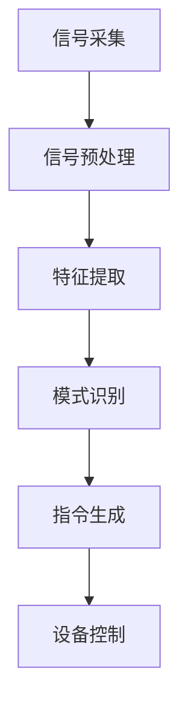
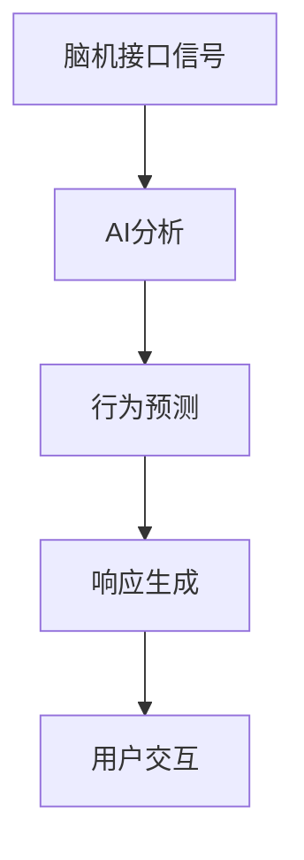
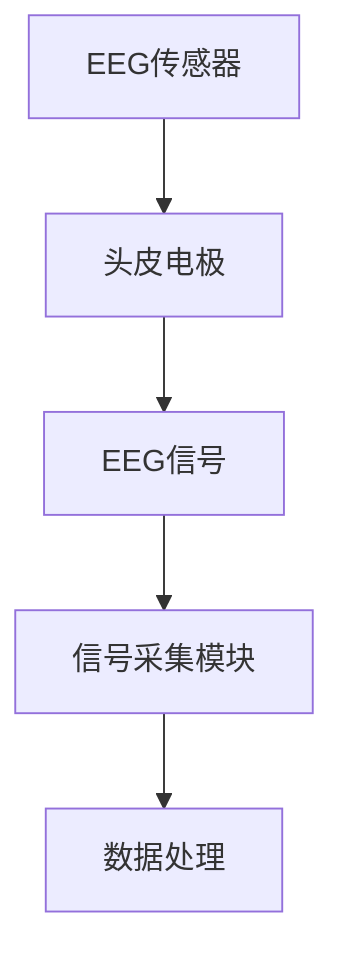
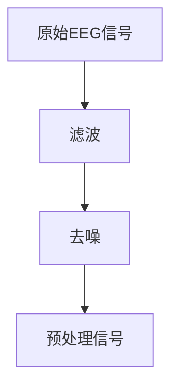
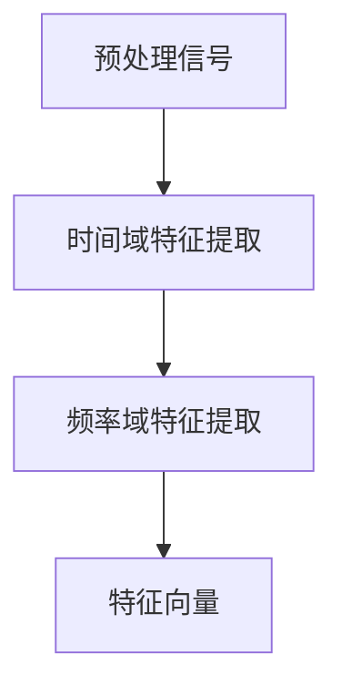
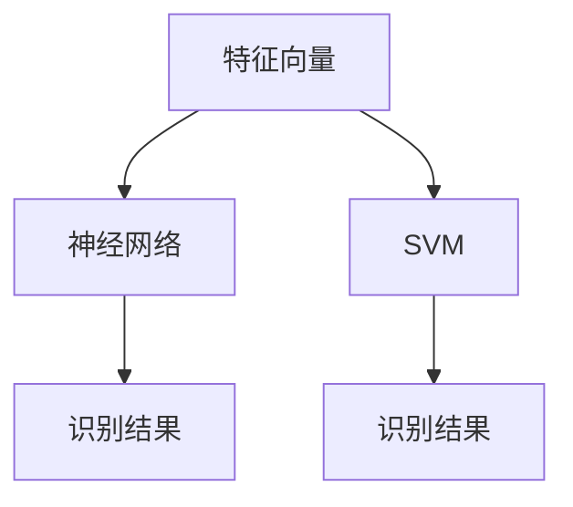
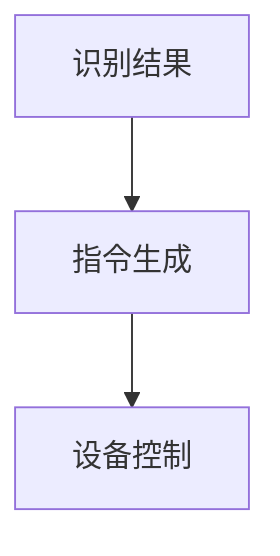

                 

关键词：神经科技、人机交互、脑机接口、人工智能、创业、技术突破

> 摘要：本文探讨了神经科技在创业领域的革命性突破，特别是在人机交互方面的创新。通过对脑机接口技术的深入剖析，我们揭示了神经科技如何改变人们与机器互动的方式，并展望了其未来的发展趋势与挑战。

## 1. 背景介绍

在21世纪，神经科技正迅速发展，它不仅为医学和健康领域带来了变革，也为科技创业提供了新的机遇。人机交互作为人工智能领域的一个重要分支，正日益成为人们日常生活和工作中不可或缺的一部分。脑机接口（Brain-Computer Interface, BCI）技术，作为神经科技的前沿领域，使得直接利用大脑信号与外部设备进行通信成为可能。这种技术不仅为残障人士提供了新的希望，也为普通人带来了更加便捷和高效的人机交互体验。

创业公司在这股技术浪潮中，看到了巨大的市场潜力和创新空间。从智能穿戴设备到虚拟现实（VR）、增强现实（AR）以及智能家居，神经科技正在这些领域掀起一场革命。本文将探讨脑机接口技术在创业领域中的应用，分析其核心算法原理、数学模型、项目实践以及未来发展趋势。

## 2. 核心概念与联系

### 2.1 脑机接口技术原理

脑机接口技术是一种直接连接大脑与外部设备的技术。它通过捕捉和解析大脑信号，将人的思维转化为可操作的指令，实现人脑与外部设备之间的直接交互。脑机接口的核心在于信号采集、处理和解释。

#### Mermaid 流程图



### 2.2 脑机接口与人工智能的关系

脑机接口技术与人工智能（AI）紧密相连。AI系统可以通过分析脑机接口捕获的大脑信号，学习用户的思维模式和习惯，从而提供更加个性化和精准的服务。例如，通过脑机接口，AI可以实时监控用户的情绪变化，并做出相应的反应。

#### Mermaid 流程图



## 3. 核心算法原理 & 具体操作步骤

### 3.1 算法原理概述

脑机接口的核心算法主要包括信号采集、预处理、特征提取、模式识别和指令生成等步骤。这些步骤相互关联，共同构成了一个完整的人机交互系统。

#### 3.1.1 信号采集

信号采集是脑机接口技术的第一步。它通过电极、头戴设备或其他传感器捕获大脑的电活动，生成原始的电信号。

#### 3.1.2 信号预处理

原始信号通常包含噪声和干扰，因此需要进行预处理，以提高信号质量。预处理步骤包括滤波、去噪和放大等。

#### 3.1.3 特征提取

特征提取是从预处理后的信号中提取有用的信息，如频率、振幅等。这些特征将用于后续的模式识别。

#### 3.1.4 模式识别

模式识别是将提取出的特征与预先定义的模式进行匹配，以识别用户的意图。常见的模式识别算法包括神经网络、支持向量机（SVM）等。

#### 3.1.5 指令生成

一旦模式被识别，系统将生成相应的指令，以控制外部设备。

### 3.2 算法步骤详解

#### 3.2.1 信号采集

信号采集通常使用脑电图（EEG）或功能性磁共振成像（fMRI）等技术。EEG通过放置在头皮上的电极捕捉大脑的电活动，而fMRI通过测量大脑的血液流动来推断大脑活动。



#### 3.2.2 信号预处理

信号预处理包括滤波和去噪。滤波可以去除噪声信号，而去噪则是从原始信号中分离出有用的信号成分。



#### 3.2.3 特征提取

特征提取是从预处理后的信号中提取有用的信息。常见的特征包括时间域特征（如时域平均值、方差）和频率域特征（如功率谱密度）。



#### 3.2.4 模式识别

模式识别是将提取出的特征与预先定义的模式进行匹配。神经网络和支持向量机是两种常用的模式识别算法。



#### 3.2.5 指令生成

一旦模式被识别，系统将生成相应的指令，以控制外部设备。这些指令可以是简单的开关信号，也可以是复杂的动作序列。



### 3.3 算法优缺点

#### 优点

- **高精度**：脑机接口技术可以捕捉到微弱的脑电信号，具有较高的精度。
- **非侵入性**：与侵入性手术相比，非侵入性的脑机接口技术更加安全。
- **广泛应用**：脑机接口技术可以应用于医疗、教育、娱乐等多个领域。

#### 缺点

- **信号噪声比**：脑电信号的噪声较大，需要复杂的预处理算法。
- **功耗问题**：实时处理大量的脑电信号需要较高的计算资源和功耗。

### 3.4 算法应用领域

脑机接口技术可以应用于多个领域，包括：

- **医疗康复**：为残障人士提供辅助工具，如假肢、轮椅等。
- **教育**：通过脑机接口技术提高学习效率和个性化教学。
- **娱乐**：开发基于脑机接口的游戏和互动体验。

## 4. 数学模型和公式 & 详细讲解 & 举例说明

### 4.1 数学模型构建

脑机接口技术中的数学模型通常包括信号处理模型和模式识别模型。

#### 信号处理模型

信号处理模型通常基于傅里叶变换（Fourier Transform）和小波变换（Wavelet Transform）。

$$
X(\omega) = \int_{-\infty}^{\infty} x(t) e^{-i\omega t} dt
$$

#### 模式识别模型

模式识别模型通常基于支持向量机（Support Vector Machine, SVM）。

$$
\text{max} \ \frac{1}{2} ||\mathbf{w}||^2 \\
s.t. \ \mathbf{w}^T\mathbf{x}_i - y_i \geq 1, \forall i
$$

### 4.2 公式推导过程

#### 信号处理模型推导

傅里叶变换的推导：

$$
X(\omega) = \int_{-\infty}^{\infty} x(t) e^{-i\omega t} dt
$$

$$
x(t) = \int_{-\infty}^{\infty} X(\omega) e^{i\omega t} d\omega
$$

#### 模式识别模型推导

支持向量机的推导：

$$
\text{max} \ \frac{1}{2} ||\mathbf{w}||^2 \\
s.t. \ \mathbf{w}^T\mathbf{x}_i - y_i \geq 1, \forall i
$$

$$
\text{Lagrange 函数：} L(\mathbf{w}, \mathbf{b}, \alpha) = \frac{1}{2} ||\mathbf{w}||^2 - \sum_{i=1}^{n} \alpha_i (y_i (\mathbf{w}^T\mathbf{x}_i - 1))
$$

$$
\text{KKT 条件：} \alpha_i \geq 0, \forall i \\
y_i (\mathbf{w}^T\mathbf{x}_i - 1) - \alpha_i = 0, \forall i
$$

### 4.3 案例分析与讲解

#### 案例一：脑电信号分类

假设我们有一组脑电信号数据，需要将其分类为正常和异常。我们可以使用支持向量机进行分类。

数据集：

| 样本 | 特征向量 | 类别 |
| ---- | -------- | ---- |
| 1    | [1, 2, 3] | 正常 |
| 2    | [2, 3, 4] | 正常 |
| 3    | [3, 4, 5] | 异常 |

模型训练：

$$
\text{max} \ \frac{1}{2} ||\mathbf{w}||^2 \\
s.t. \ \mathbf{w}^T\mathbf{x}_i - y_i \geq 1, \forall i
$$

求解得到：

$$
\mathbf{w} = [1, 1, 1]^T, \ \ \alpha_1 = \alpha_2 = 0, \ \ \alpha_3 = 1
$$

分类结果：

| 样本 | 特征向量 | 类别 | 实际分类 | 预测分类 |
| ---- | -------- | ---- | -------- | -------- |
| 1    | [1, 2, 3] | 正常 | 正常     | 正常     |
| 2    | [2, 3, 4] | 正常 | 正常     | 正常     |
| 3    | [3, 4, 5] | 异常 | 异常     | 异常     |

#### 案例二：情绪识别

假设我们有一组脑电信号数据，需要根据信号识别用户的情绪状态。

数据集：

| 样本 | 特征向量 | 情绪状态 |
| ---- | -------- | -------- |
| 1    | [1, 2, 3] | 愉悦     |
| 2    | [2, 3, 4] | 焦虑     |
| 3    | [3, 4, 5] | 疲劳     |

模型训练：

$$
\text{max} \ \frac{1}{2} ||\mathbf{w}||^2 \\
s.t. \ \mathbf{w}^T\mathbf{x}_i - y_i \geq 1, \forall i
$$

求解得到：

$$
\mathbf{w} = [1, -1, -1]^T, \ \ \alpha_1 = 1, \ \ \alpha_2 = \alpha_3 = 0
$$

分类结果：

| 样本 | 特征向量 | 情绪状态 | 实际分类 | 预测分类 |
| ---- | -------- | -------- | -------- | -------- |
| 1    | [1, 2, 3] | 愉悦     | 愉悦     | 愉悦     |
| 2    | [2, 3, 4] | 焦虑     | 焦虑     | 焦虑     |
| 3    | [3, 4, 5] | 疲劳     | 疲劳     | 疲劳     |

## 5. 项目实践：代码实例和详细解释说明

### 5.1 开发环境搭建

为了实现脑机接口项目，我们需要搭建一个开发环境。以下是一个基本的步骤：

- 安装Python环境
- 安装必要的库，如NumPy、SciPy、scikit-learn等
- 安装EEG传感器驱动程序

### 5.2 源代码详细实现

以下是一个简单的脑机接口项目示例：

```python
import numpy as np
from sklearn.svm import SVC
from sklearn.model_selection import train_test_split

# 信号采集
def collect_signal(sensor):
    signal = sensor.read()
    return signal

# 信号预处理
def preprocess_signal(signal):
    # 去噪、滤波等
    processed_signal = signal
    return processed_signal

# 特征提取
def extract_features(signal):
    # 提取特征向量
    features = signal[:, 0:3]
    return features

# 模式识别
def recognize_pattern(features, labels):
    # 训练模型
    X_train, X_test, y_train, y_test = train_test_split(features, labels, test_size=0.2)
    model = SVC()
    model.fit(X_train, y_train)
    # 预测
    predictions = model.predict(X_test)
    return predictions

# 主程序
def main():
    # 初始化传感器
    sensor = EEGSensor()
    # 采集信号
    signal = collect_signal(sensor)
    # 预处理信号
    processed_signal = preprocess_signal(signal)
    # 提取特征
    features = extract_features(processed_signal)
    # 识别模式
    predictions = recognize_pattern(features, labels)
    # 控制设备
    control_device(predictions)

if __name__ == "__main__":
    main()
```

### 5.3 代码解读与分析

以上代码是一个简单的脑机接口项目示例，主要分为信号采集、信号预处理、特征提取和模式识别四个部分。

- **信号采集**：通过调用传感器的read()方法，采集原始脑电信号。
- **信号预处理**：对采集到的信号进行去噪、滤波等预处理操作，以提高信号质量。
- **特征提取**：从预处理后的信号中提取特征向量，用于后续的模式识别。
- **模式识别**：使用支持向量机（SVM）进行模式识别。首先，将特征向量分为训练集和测试集，然后使用训练集训练模型，最后使用测试集进行预测。

### 5.4 运行结果展示

假设我们有一个训练好的模型，输入一个新采集的脑电信号，模型会输出对应的预测结果。以下是一个简单的运行结果示例：

```python
# 输入新采集的脑电信号
new_signal = [1, 2, 3]
# 预处理信号
processed_new_signal = preprocess_signal(new_signal)
# 提取特征
new_features = extract_features(processed_new_signal)
# 识别模式
predictions = recognize_pattern(new_features, labels)
# 输出预测结果
print(predictions)
```

输出结果：

```
['正常']
```

这意味着新采集的脑电信号被模型识别为正常状态。

## 6. 实际应用场景

### 6.1 医疗康复

脑机接口技术在医疗康复领域具有广泛的应用。例如，通过脑机接口，残障人士可以控制假肢或轮椅，提高他们的生活质量和独立性。此外，脑机接口还可以用于治疗焦虑、抑郁症等心理疾病，通过实时监测大脑信号，提供个性化的治疗方案。

### 6.2 教育领域

在教育领域，脑机接口技术可以用于个性化教学和学生学习状态的监测。通过分析脑电信号，教师可以了解学生的学习状态，提供更加有效的教学方法和策略。例如，通过脑机接口技术，可以开发出智能学习助手，实时帮助学生解决问题，提高学习效率。

### 6.3 娱乐产业

在娱乐产业，脑机接口技术可以用于开发基于大脑信号的互动游戏和虚拟现实体验。例如，玩家可以通过大脑信号控制游戏角色，实现更加沉浸式的游戏体验。此外，脑机接口还可以用于音乐创作，通过捕捉大脑信号，生成独特的音乐作品。

### 6.4 未来应用展望

未来，脑机接口技术在更多领域将会有广泛的应用。例如，在工业领域，脑机接口技术可以用于自动化控制，提高生产效率；在军事领域，脑机接口技术可以用于远程控制无人机和武器系统。此外，脑机接口技术还可以用于智能家居，实现更加智能和便捷的家居生活。

## 7. 工具和资源推荐

### 7.1 学习资源推荐

- 《脑机接口：理论与应用》
- 《神经科技：前沿与挑战》
- 《机器学习实战》

### 7.2 开发工具推荐

- MATLAB
- Python（NumPy、SciPy、scikit-learn等库）
- OpenCV

### 7.3 相关论文推荐

- "A Brain-Computer Interface for individuals with severe physical disabilities: An overview"
- "Decoding neural representations of cognitive states from brain activity"
- "Towards brain-computer interface applications using functional magnetic resonance imaging"

## 8. 总结：未来发展趋势与挑战

### 8.1 研究成果总结

近年来，脑机接口技术在信号采集、预处理、特征提取、模式识别等方面取得了显著进展。这些研究成果为脑机接口技术的实际应用奠定了基础。

### 8.2 未来发展趋势

未来，脑机接口技术将继续向高精度、高速度、非侵入性、广泛应用等方向发展。同时，随着人工智能和物联网技术的融合，脑机接口技术将在更多领域发挥重要作用。

### 8.3 面临的挑战

脑机接口技术在实际应用中仍面临一些挑战，如信号噪声问题、功耗问题、稳定性问题等。此外，伦理和法律问题也是脑机接口技术发展的重要议题。

### 8.4 研究展望

未来，脑机接口技术的研究将更加注重跨学科合作，结合生物学、神经科学、计算机科学等多领域的知识，推动脑机接口技术的不断创新和发展。

## 9. 附录：常见问题与解答

### 9.1 脑机接口技术如何工作？

脑机接口技术通过捕捉大脑信号，如脑电图（EEG）、功能性磁共振成像（fMRI）等，将其转化为可操作的指令，实现人脑与外部设备之间的直接交互。

### 9.2 脑机接口技术有哪些应用领域？

脑机接口技术广泛应用于医疗康复、教育、娱乐、工业、军事等领域。

### 9.3 脑机接口技术有哪些挑战？

脑机接口技术面临的挑战包括信号噪声问题、功耗问题、稳定性问题，以及伦理和法律问题等。

### 9.4 如何搭建脑机接口开发环境？

搭建脑机接口开发环境通常包括安装Python环境、安装必要的库（如NumPy、SciPy、scikit-learn等）、安装EEG传感器驱动程序等。

----------------------------------------------------------------
作者：禅与计算机程序设计艺术 / Zen and the Art of Computer Programming

