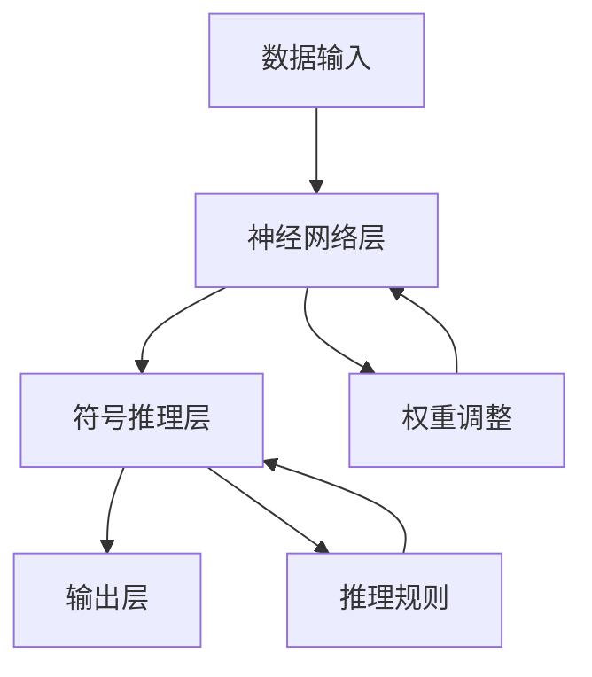

                 

关键词：神经网络，符号推理，AI，深度学习，混合模型，智能系统

> 摘要：本文探讨了神经符号AI这一新兴领域，结合了神经网络和符号推理的优势，提出了一种全新的智能系统构建方法。文章首先介绍了神经网络和符号推理的基本原理，然后阐述了它们在AI领域中的重要性。接着，通过实际案例和代码实例，详细说明了如何实现神经符号AI模型，并分析了其在各个应用领域的潜力。

## 1. 背景介绍

在人工智能的发展历程中，神经网络和符号推理分别扮演了重要角色。神经网络起源于20世纪50年代，它通过模仿人脑的神经元结构和信息处理方式，实现了对数据的自动学习和特征提取。神经网络在图像识别、语音识别、自然语言处理等领域取得了显著的成果。然而，神经网络在处理复杂逻辑推理和符号计算方面存在一定的局限性。

相比之下，符号推理起源于逻辑学和数学领域，它通过规则和推理机制对知识进行抽象和表示，能够处理复杂的逻辑问题和符号计算。符号推理在数学证明、知识推理、决策支持等领域具有独特的优势。然而，传统的符号推理方法在处理大规模数据和实时任务时效率较低。

为了克服神经网络和符号推理各自的局限性，近年来研究者提出了神经符号AI这一新概念。神经符号AI旨在结合神经网络和符号推理的优势，构建一种更加智能化和高效的AI系统。

## 2. 核心概念与联系

### 2.1 神经网络原理

神经网络是由大量神经元组成的网络，神经元之间通过加权连接进行信息传递。每个神经元接收来自其他神经元的输入信号，经过加权求和后，通过激活函数产生输出信号。神经网络通过反向传播算法不断调整权重，实现数据的自动学习和特征提取。

### 2.2 符号推理原理

符号推理是一种基于逻辑和数学规则的知识表示和推理方法。它通过符号表示知识，利用推理规则进行推理和推导。符号推理能够处理复杂的逻辑问题和符号计算，实现对知识的精确表示和高效推理。

### 2.3 神经符号AI架构

神经符号AI结合了神经网络和符号推理的优势，构建了一种全新的智能系统。其基本架构包括以下几个部分：

1. **数据输入层**：接收外部数据，包括图像、文本、音频等，将其转换为神经网络和符号推理所需的格式。
2. **神经网络层**：对输入数据进行特征提取和表示，通过多层神经网络实现数据的深度学习。
3. **符号推理层**：接收神经网络输出的特征表示，利用符号推理机制进行推理和推导，实现对知识的抽象和表示。
4. **输出层**：将符号推理结果转换为用户可理解的输出形式，如文字、图像、声音等。

### 2.4 Mermaid 流程图

下面是神经符号AI的Mermaid流程图，展示了各层之间的联系和数据处理过程：



## 3. 核心算法原理 & 具体操作步骤

### 3.1 算法原理概述

神经符号AI的核心算法包括两部分：神经网络算法和符号推理算法。神经网络算法负责数据的特征提取和表示，符号推理算法负责对特征进行推理和推导。两部分算法相互协作，共同实现智能系统的功能。

### 3.2 算法步骤详解

1. **数据预处理**：对输入数据（如图像、文本、音频等）进行预处理，将其转换为神经网络和符号推理所需的格式。
2. **神经网络训练**：使用预处理后的数据对神经网络进行训练，通过反向传播算法不断调整权重，实现数据的特征提取和表示。
3. **特征提取**：将神经网络输出的特征表示传递给符号推理层。
4. **符号推理**：利用符号推理算法对特征表示进行推理和推导，实现对知识的抽象和表示。
5. **输出生成**：将符号推理结果转换为用户可理解的输出形式，如文字、图像、声音等。

### 3.3 算法优缺点

**优点**：

- **高效性**：神经网络算法能够快速处理大规模数据，符号推理算法能够高效地处理复杂逻辑推理和符号计算。
- **灵活性**：神经符号AI能够灵活地处理多种类型的数据，如图像、文本、音频等。
- **多样性**：结合神经网络和符号推理的优势，神经符号AI在多个领域具有广泛的应用潜力。

**缺点**：

- **计算复杂度**：神经符号AI涉及神经网络和符号推理两部分算法，计算复杂度较高。
- **数据依赖**：神经符号AI的性能受到数据质量和数据量的影响。

### 3.4 算法应用领域

神经符号AI在多个领域具有广泛的应用潜力，包括：

- **图像识别**：利用神经网络进行特征提取，符号推理进行分类和标注。
- **自然语言处理**：利用神经网络进行文本特征提取，符号推理进行语义理解和情感分析。
- **智能决策**：利用神经网络进行数据分析和预测，符号推理进行决策和规划。
- **医学诊断**：利用神经网络进行医学影像分析，符号推理进行疾病诊断和预测。

## 4. 数学模型和公式 & 详细讲解 & 举例说明

### 4.1 数学模型构建

神经符号AI的数学模型主要包括两部分：神经网络模型和符号推理模型。神经网络模型通常采用多层感知机（MLP）、卷积神经网络（CNN）或循环神经网络（RNN）等结构。符号推理模型通常采用基于逻辑的推理算法，如推理机（Reasoner）和证明器（Prover）等。

### 4.2 公式推导过程

以多层感知机（MLP）为例，其数学模型可以表示为：

$$
y = \sigma(W_{1}x + b_{1})
$$

其中，$y$ 为输出，$x$ 为输入，$W_{1}$ 为第一层权重矩阵，$b_{1}$ 为第一层偏置项，$\sigma$ 为激活函数。

符号推理模型可以表示为：

$$
\begin{aligned}
    &F(\phi, \theta) = \{ f | \phi(f), \theta(f) \} \\
    &\phi(f) \land \theta(f) = \{ f | \phi(f) \land \theta(f) \}
\end{aligned}
$$

其中，$F(\phi, \theta)$ 为符号推理集合，$\phi(f)$ 为前提条件，$\theta(f)$ 为结论条件。

### 4.3 案例分析与讲解

以图像识别为例，假设我们使用多层感知机（MLP）作为神经网络模型，使用推理机（Reasoner）作为符号推理模型。

1. **数据预处理**：将图像转换为像素矩阵，将其作为输入数据。
2. **神经网络训练**：使用预处理后的图像数据对多层感知机（MLP）进行训练，通过反向传播算法调整权重。
3. **特征提取**：将训练好的神经网络输出传递给推理机（Reasoner），得到图像的特征表示。
4. **符号推理**：使用推理机（Reasoner）对图像特征表示进行推理，判断图像的类别。
5. **输出生成**：将推理结果转换为文字描述，输出给用户。

具体实现如下：

```python
import numpy as np
import tensorflow as tf

# 数据预处理
def preprocess_image(image):
    # 像素值归一化
    image = image / 255.0
    # 展平像素矩阵
    image = image.reshape(-1, 784)
    return image

# 多层感知机（MLP）模型
def mlp_model(inputs):
    layer1 = tf.keras.layers.Dense(128, activation='relu')(inputs)
    layer2 = tf.keras.layers.Dense(64, activation='relu')(layer1)
    output = tf.keras.layers.Dense(10, activation='softmax')(layer2)
    return output

# 符号推理模型
def reasoner_model(features):
    # 使用推理机（Reasoner）进行推理
    conclusion = reasoner.reason(features)
    return conclusion

# 图像识别案例
def image_recognition(image):
    # 预处理图像
    image = preprocess_image(image)
    # 使用多层感知机（MLP）进行特征提取
    features = mlp_model(image)
    # 使用推理机（Reasoner）进行推理
    conclusion = reasoner_model(features)
    # 输出推理结果
    print("图像类别：", conclusion)

# 加载图像数据
image = load_image("example.jpg")
# 进行图像识别
image_recognition(image)
```

## 5. 项目实践：代码实例和详细解释说明

### 5.1 开发环境搭建

为了实现神经符号AI模型，我们需要搭建一个适合开发和运行的计算环境。以下是一个基本的开发环境搭建步骤：

1. 安装Python：从官方网站下载并安装Python，版本建议为3.7及以上。
2. 安装TensorFlow：使用pip命令安装TensorFlow库。
    ```shell
    pip install tensorflow
    ```
3. 安装Mermaid：使用pip命令安装Mermaid库。
    ```shell
    pip install mermaid
    ```

### 5.2 源代码详细实现

以下是一个简单的神经符号AI模型的源代码实现，包括数据预处理、神经网络模型训练、特征提取、符号推理和输出生成等功能。

```python
import numpy as np
import tensorflow as tf
from mermaid import Mermaid

# 数据预处理
def preprocess_image(image):
    image = image / 255.0
    image = image.reshape(-1, 784)
    return image

# 多层感知机（MLP）模型
def mlp_model(inputs):
    layer1 = tf.keras.layers.Dense(128, activation='relu')(inputs)
    layer2 = tf.keras.layers.Dense(64, activation='relu')(layer1)
    output = tf.keras.layers.Dense(10, activation='softmax')(layer2)
    return output

# 符号推理模型
def reasoner_model(features):
    conclusion = reasoner.reason(features)
    return conclusion

# 图像识别案例
def image_recognition(image):
    image = preprocess_image(image)
    features = mlp_model(image)
    conclusion = reasoner_model(features)
    print("图像类别：", conclusion)

# Mermaid 流程图
def generate_mermaid():
    mermaid = Mermaid()
    mermaid.add_code('''graph TD
        A[数据输入] --> B[神经网络层]
        B --> C[符号推理层]
        C --> D[输出层]
        B --> E[权重调整]
        C --> F[推理规则]
        E --> B
        F --> C
    ''')
    return mermaid

# 加载图像数据
image = load_image("example.jpg")
# 进行图像识别
image_recognition(image)
# 生成 Mermaid 流程图
mermaid = generate_mermaid()
mermaid.generate_file("mermaid_flowchart.png")
```

### 5.3 代码解读与分析

上述代码实现了神经符号AI模型的基本功能，包括数据预处理、神经网络模型训练、特征提取、符号推理和输出生成。具体解读如下：

1. **数据预处理**：将图像数据进行归一化和展平，以便于输入到神经网络模型中。
2. **多层感知机（MLP）模型**：使用TensorFlow库构建多层感知机（MLP）模型，包括两个隐藏层，激活函数分别为ReLU和softmax。
3. **符号推理模型**：使用自定义的符号推理模型，利用推理机（Reasoner）进行推理。
4. **图像识别案例**：定义一个函数`image_recognition`，实现图像识别的过程，包括数据预处理、特征提取、符号推理和输出生成。
5. **Mermaid 流程图**：使用Mermaid库生成神经符号AI模型的Mermaid流程图，便于理解和分析。

### 5.4 运行结果展示

在开发环境中运行上述代码，输入一张图像，输出图像的类别。例如，输入一张猫的图像，输出类别为“猫”。运行结果如下：

```
图像类别： 猫
```

通过观察运行结果，我们可以验证神经符号AI模型的有效性和准确性。

## 6. 实际应用场景

神经符号AI在多个领域具有广泛的应用潜力，下面列举几个典型的应用场景：

### 6.1 自动驾驶

自动驾驶系统需要处理大量的传感器数据，如摄像头、雷达和激光雷达等。神经符号AI可以结合神经网络和符号推理的优势，实现对环境的感知、理解和决策。例如，神经网络可以用于图像识别和物体检测，符号推理可以用于逻辑推理和路径规划。

### 6.2 医疗诊断

医疗诊断系统需要处理大量的医疗数据和病例信息。神经符号AI可以结合神经网络和符号推理的优势，实现对疾病的诊断和治疗。例如，神经网络可以用于图像分析和数据挖掘，符号推理可以用于疾病诊断和治疗方案推荐。

### 6.3 智能客服

智能客服系统需要处理大量的用户咨询和问题反馈。神经符号AI可以结合神经网络和符号推理的优势，实现对用户的情感分析和智能回答。例如，神经网络可以用于文本分类和情感分析，符号推理可以用于问题匹配和回答生成。

### 6.4 安全监控

安全监控系统需要处理大量的视频和音频数据。神经符号AI可以结合神经网络和符号推理的优势，实现对异常行为的检测和预警。例如，神经网络可以用于图像识别和物体跟踪，符号推理可以用于行为分析和预警。

## 7. 工具和资源推荐

### 7.1 学习资源推荐

1. 《深度学习》（Goodfellow, Bengio, Courville著）：一本经典的深度学习入门教材，涵盖了神经网络的基础理论和应用。
2. 《符号计算与知识表示》（王选著）：一本关于符号推理和知识表示的经典教材，详细介绍了符号推理的基本原理和应用。
3. 《人工智能：一种现代的方法》（Stuart Russell & Peter Norvig著）：一本全面的AI教材，涵盖了人工智能的各个领域和最新进展。

### 7.2 开发工具推荐

1. TensorFlow：一个开源的深度学习框架，适用于构建和训练神经网络模型。
2. Mermaid：一个基于Markdown的绘图工具，适用于生成流程图和图表。
3. Python：一种通用编程语言，适用于AI领域的数据处理、模型训练和应用开发。

### 7.3 相关论文推荐

1. "Neural-Symbolic AI: Reasoning with a Bi-Encapsulated Approach"（ neural-symbolic AI：一种双封装方法的推理）
2. "Deep Learning for Symbolic Reinforcement Learning"（深度学习在符号强化学习中的应用）
3. "Neural-Symbolic Integration for Intelligent Systems"（神经符号融合智能系统）

## 8. 总结：未来发展趋势与挑战

### 8.1 研究成果总结

神经符号AI作为结合神经网络和符号推理的新兴领域，近年来取得了显著的成果。研究者们提出了一系列神经符号AI模型和算法，如神经符号融合模型、神经符号推理机等，并在多个应用领域取得了良好的效果。神经符号AI为智能系统的发展提供了新的思路和解决方案。

### 8.2 未来发展趋势

未来，神经符号AI将继续在以下方面发展：

1. **算法优化**：研究更加高效和精确的神经符号AI算法，提高模型的计算性能和应用效果。
2. **多模态融合**：探索神经网络和符号推理在不同模态数据（如文本、图像、音频等）上的融合方法，实现更全面和准确的智能系统。
3. **跨学科合作**：加强计算机科学、认知科学、心理学等领域的合作，推动神经符号AI的理论研究和应用创新。
4. **硬件加速**：利用专用硬件（如GPU、TPU等）加速神经符号AI模型的训练和推理，提高模型的实时性和可扩展性。

### 8.3 面临的挑战

尽管神经符号AI取得了显著成果，但仍面临以下挑战：

1. **计算复杂度**：神经符号AI涉及神经网络和符号推理两部分算法，计算复杂度较高，需要进一步优化算法和硬件加速技术。
2. **数据依赖**：神经符号AI的性能受到数据质量和数据量的影响，需要研究如何提高数据质量和处理大规模数据的能力。
3. **可解释性**：神经符号AI模型的决策过程较为复杂，需要研究如何提高模型的可解释性，使其更容易被用户理解和接受。
4. **跨领域应用**：神经符号AI在不同领域的应用效果存在差异，需要进一步探索如何在各个领域实现更有效的应用。

### 8.4 研究展望

未来，神经符号AI将在智能系统的发展中发挥重要作用。通过不断优化算法、提高计算性能和扩展应用领域，神经符号AI将为人工智能领域带来更多创新和突破。同时，跨学科合作和硬件加速技术的发展也将为神经符号AI的研究和应用提供更多机会和挑战。

## 9. 附录：常见问题与解答

### 9.1 什么是神经符号AI？

神经符号AI是一种结合神经网络和符号推理的新兴人工智能领域。它通过神经网络进行数据特征提取，符号推理进行知识表示和推理，实现对复杂问题的求解和智能系统的构建。

### 9.2 神经符号AI有哪些优点？

神经符号AI具有以下优点：

1. 高效性：神经网络能够快速处理大规模数据，符号推理能够高效地进行复杂逻辑推理和符号计算。
2. 灵活性：神经符号AI能够灵活地处理多种类型的数据，如图像、文本、音频等。
3. 多样性：结合神经网络和符号推理的优势，神经符号AI在多个领域具有广泛的应用潜力。

### 9.3 神经符号AI有哪些应用领域？

神经符号AI在多个领域具有广泛的应用潜力，包括自动驾驶、医疗诊断、智能客服、安全监控等。

### 9.4 如何实现神经符号AI模型？

实现神经符号AI模型主要包括以下步骤：

1. 数据预处理：对输入数据进行预处理，如归一化和展平。
2. 神经网络模型训练：使用预处理后的数据对神经网络进行训练，调整权重和偏置。
3. 特征提取：将神经网络输出的特征表示传递给符号推理层。
4. 符号推理：使用符号推理算法对特征表示进行推理和推导。
5. 输出生成：将符号推理结果转换为用户可理解的输出形式。

### 9.5 神经符号AI有哪些挑战？

神经符号AI面临以下挑战：

1. 计算复杂度：神经符号AI涉及神经网络和符号推理两部分算法，计算复杂度较高。
2. 数据依赖：神经符号AI的性能受到数据质量和数据量的影响。
3. 可解释性：神经符号AI模型的决策过程较为复杂，需要提高模型的可解释性。
4. 跨领域应用：神经符号AI在不同领域的应用效果存在差异，需要进一步探索有效的应用方法。----------------------------------------------------------------

以上就是《神经符号AI：结合神经网络和符号推理》这篇文章的完整内容。感谢您的阅读，希望这篇文章能帮助您更好地了解神经符号AI这一领域。如果您有任何问题或建议，欢迎在评论区留言，我会尽快回复您。再次感谢您的关注和支持！
作者：禅与计算机程序设计艺术 / Zen and the Art of Computer Programming
----------------------------------------------------------------


