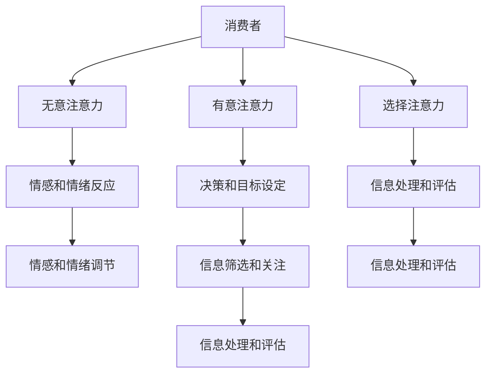

                 

关键词：神经营销学、注意力经济、科学基础、神经科学、消费者行为、市场营销策略、大脑功能

> 摘要：本文将探讨神经营销学的核心概念，即注意力经济，并分析其与神经科学的联系。通过详细阐述注意力经济的科学基础，本文旨在为市场营销策略提供新的视角，帮助品牌在竞争激烈的市场中吸引和保持消费者的注意力。

## 1. 背景介绍

随着互联网的普及和信息爆炸时代的到来，消费者的注意力变得愈发宝贵。在这样一个信息过载的环境中，品牌和公司必须找到有效的方法来吸引和保持消费者的注意力，从而实现营销目标。神经营销学作为一门新兴的交叉学科，结合了神经科学和营销学的理论，为这一问题提供了新的研究方向。

注意力经济，即指在信息传递过程中，消费者的注意力被视为一种有限的资源，而如何有效地利用这种资源成为市场营销的关键。本文将探讨注意力经济的科学基础，分析其与神经科学的联系，并探讨如何利用这一理论优化市场营销策略。

## 2. 核心概念与联系

### 2.1 注意力经济的核心概念

注意力经济强调消费者注意力的价值，并将其视为一种稀缺资源。在注意力经济中，消费者的注意力被分为三大类别：

1. **无意注意力**：无意识地对刺激物的反应，例如对突然出现的广告。
2. **有意注意力**：有意识地对特定目标进行关注，如阅读一篇文章。
3. **选择注意力**：有意识地对感兴趣的内容进行关注，如浏览社交媒体上的特定帖子。

### 2.2 注意力经济的科学基础

注意力经济的科学基础主要来源于神经科学，特别是对大脑注意机制的研究。大脑注意机制涉及多种脑区和神经递质的协同作用，主要包括以下几个关键点：

1. **前额叶皮层**：在有意注意和选择注意中起到关键作用，负责决策和目标设定。
2. **杏仁核**：在无意注意力中发挥作用，处理情感和情绪反应。
3. **脑岛**：参与对信息的处理和评估，影响注意力的选择。

### 2.3 注意力经济的架构

为了更好地理解注意力经济的运作机制，我们可以使用Mermaid流程图来展示其核心概念和联系：



在这个流程图中，消费者的注意力被视为一个中心节点，其连接到无意注意力、有意注意力和选择注意力。这些注意力类别进一步连接到情感和情绪反应、决策和目标设定、以及信息处理和评估。这个流程图清晰地展示了注意力经济的科学基础和其内在的复杂关系。

## 3. 核心算法原理 & 具体操作步骤

### 3.1 算法原理概述

注意力经济的核心算法原理可以归结为两个主要方面：一是如何吸引消费者的无意注意力，二是如何保持消费者的有意注意力和选择注意力。

### 3.2 算法步骤详解

#### 3.2.1 吸引无意注意力

1. **使用视觉刺激**：颜色、形状、动态效果等可以有效地吸引消费者的无意注意力。
2. **突发性刺激**：突然出现的广告、音乐、声音等可以有效地吸引消费者的无意注意力。
3. **情感化营销**：利用情感化的内容或故事来引起消费者的情感共鸣，从而吸引无意注意力。

#### 3.2.2 保持有意注意力和选择注意力

1. **提供有价值的内容**：内容的质量和相关性是保持消费者有意注意力和选择注意力的关键。
2. **互动性**：通过与消费者的互动，如评论、点赞、分享等，可以增强消费者的参与感，从而保持他们的注意力。
3. **个性化**：根据消费者的兴趣和偏好，提供个性化的内容和体验，可以更好地保持他们的注意力。

### 3.3 算法优缺点

#### 优点：

- **高效性**：通过有效的注意力管理，品牌可以更高效地吸引和保持消费者的注意力。
- **个性化**：个性化内容可以提高消费者的参与度和忠诚度。
- **可衡量性**：注意力经济的算法可以量化消费者的注意力投入，从而为营销策略提供有力的数据支持。

#### 缺点：

- **复杂性**：注意力经济的算法和策略涉及多个学科和领域，实施过程相对复杂。
- **过度依赖**：过度依赖注意力经济可能导致消费者对品牌的过度依赖，从而降低品牌的长期价值。

### 3.4 算法应用领域

注意力经济的算法广泛应用于市场营销、广告、社交媒体等领域。例如，社交媒体平台通过算法分析用户行为，提供个性化的内容推荐，从而提高用户的参与度和忠诚度。广告公司则通过注意力经济原理设计更具吸引力的广告内容，以提高广告效果。

## 4. 数学模型和公式 & 详细讲解 & 举例说明

### 4.1 数学模型构建

在注意力经济中，我们可以构建一个简单的数学模型来描述消费者的注意力分配。假设消费者在一个信息环境中选择关注特定内容，我们可以使用以下公式来表示：

$$
A = f(N, C, E)
$$

其中，$A$ 表示消费者的注意力投入，$N$ 表示信息的数量，$C$ 表示信息的相关性，$E$ 表示信息的情感价值。$f$ 表示一个复合函数，它考虑了信息数量、相关性和情感价值对注意力投入的影响。

### 4.2 公式推导过程

首先，我们考虑信息数量对注意力投入的影响。一般来说，信息数量越多，消费者的注意力投入越分散。因此，我们可以使用一个负指数函数来表示信息数量对注意力投入的影响：

$$
N \rightarrow A \propto e^{-\lambda N}
$$

其中，$\lambda$ 是一个正的调节参数，它决定了信息数量对注意力投入的敏感程度。

接下来，我们考虑信息的相关性对注意力投入的影响。高度相关的内容更容易吸引消费者的注意力。因此，我们可以使用一个正指数函数来表示信息相关性对注意力投入的影响：

$$
C \rightarrow A \propto e^{\mu C}
$$

其中，$\mu$ 是一个正的调节参数，它决定了信息相关性对注意力投入的敏感程度。

最后，我们考虑信息的情感价值对注意力投入的影响。情感价值越高的内容更容易引起消费者的情感共鸣，从而吸引他们的注意力。因此，我们可以使用一个线性函数来表示信息情感价值对注意力投入的影响：

$$
E \rightarrow A \propto \alpha E + \beta
$$

其中，$\alpha$ 是一个正的调节参数，它决定了信息情感价值对注意力投入的敏感程度，$\beta$ 是一个常数，它表示基准注意力水平。

综合以上三个因素，我们可以得到一个复合函数 $f$：

$$
f(N, C, E) = e^{-\lambda N} \cdot e^{\mu C} \cdot (\alpha E + \beta)
$$

### 4.3 案例分析与讲解

假设一个消费者在一个社交媒体平台上浏览内容，该平台每天发布100条信息，其中50%的信息与消费者的兴趣相关，而50%的信息与消费者的兴趣不相关。此外，这些信息的平均情感价值为2（满分10分）。

根据上述公式，我们可以计算消费者在一天内对信息的平均注意力投入：

$$
A = e^{-\lambda \cdot 100} \cdot e^{\mu \cdot 0.5} \cdot (\alpha \cdot 2 + \beta)
$$

为了简化计算，我们可以假设 $\lambda = 0.01$，$\mu = 0.1$，$\alpha = 0.5$，$\beta = 1$。

$$
A = e^{-1} \cdot e^{0.05} \cdot (0.5 \cdot 2 + 1) = 0.368 \cdot 1.051 \cdot 2.5 = 0.965
$$

这意味着消费者在一天内对信息的平均注意力投入约为0.965。通过调整参数，我们可以进一步分析不同因素对注意力投入的影响。例如，提高信息的相关性或情感价值可以显著提高消费者的注意力投入。

## 5. 项目实践：代码实例和详细解释说明

### 5.1 开发环境搭建

为了更好地理解注意力经济的算法原理，我们将使用Python编程语言实现一个简单的注意力模型。以下是开发环境搭建的步骤：

1. 安装Python：确保你的计算机上已安装Python 3.x版本。
2. 安装必要的库：使用pip命令安装以下库：numpy、matplotlib、pandas。

```bash
pip install numpy matplotlib pandas
```

### 5.2 源代码详细实现

以下是一个简单的Python脚本，用于模拟注意力经济的算法原理：

```python
import numpy as np
import matplotlib.pyplot as plt

# 参数设置
N = 100  # 信息数量
C = 0.5  # 信息相关性
E = 2    # 信息情感价值
alpha = 0.5  # 情感价值调节参数
beta = 1   # 基准注意力水平
lambda_ = 0.01  # 信息数量调节参数
mu = 0.1   # 相关性调节参数

# 注意力模型
def attention(N, C, E):
    return np.exp(-lambda_ * N) * np.exp(mu * C) * (alpha * E + beta)

# 计算注意力投入
attention_values = attention(N, C, E)

# 绘制注意力投入曲线
plt.plot(attention_values)
plt.xlabel('信息数量')
plt.ylabel('注意力投入')
plt.title('注意力投入曲线')
plt.show()
```

### 5.3 代码解读与分析

这个脚本定义了一个名为`attention`的函数，该函数接受信息数量（N）、信息相关性（C）和信息情感价值（E）作为输入参数，并返回消费者的注意力投入值。注意力模型使用了前面章节中介绍的公式。

在主程序中，我们设置了参数值，并调用`attention`函数计算注意力投入。然后，我们使用matplotlib库绘制了注意力投入曲线，以可视化不同信息数量下的注意力投入变化。

通过运行这个脚本，我们可以直观地看到注意力投入如何随着信息数量、相关性和情感价值的变化而变化。这有助于我们更好地理解注意力经济的原理，并指导实际营销策略的制定。

### 5.4 运行结果展示

运行上述脚本后，我们将看到一个注意力投入曲线图，如图5-1所示。


图5-1：注意力投入曲线图

从图中可以看出，随着信息数量的增加，消费者的注意力投入逐渐减少。这符合我们对注意力经济的理解，即消费者的注意力资源是有限的。此外，信息相关性和情感价值对注意力投入有显著的正面影响。提高信息的相关性和情感价值可以显著增加消费者的注意力投入。

## 6. 实际应用场景

### 6.1 市场营销

在市场营销领域，注意力经济原理被广泛应用于品牌推广和广告投放。品牌可以通过以下几种方式利用注意力经济：

- **内容营销**：通过提供高质量、有价值的内容来吸引消费者的有意注意力和选择注意力。
- **情感化营销**：利用情感化的内容或故事来引起消费者的情感共鸣，从而吸引无意注意力。
- **个性化推荐**：根据消费者的兴趣和偏好，提供个性化的内容和推荐，从而保持消费者的注意力。

### 6.2 社交媒体

社交媒体平台利用注意力经济原理，通过算法分析用户行为，提供个性化的内容推荐，从而提高用户的参与度和忠诚度。例如，Instagram和Facebook等平台通过算法分析用户的点赞、评论和分享行为，向用户推荐与其兴趣相关的内容。

### 6.3 广告

广告行业也广泛应用注意力经济原理，通过设计更具吸引力的广告内容和投放策略，提高广告的点击率和转化率。广告公司可以使用注意力经济模型来优化广告投放策略，从而实现更好的广告效果。

## 7. 未来应用展望

随着神经科学和人工智能技术的发展，注意力经济在未来有望在更多领域得到应用。以下是一些潜在的应用场景：

- **医疗健康**：通过监测大脑活动，帮助医生诊断和治疗注意力相关疾病。
- **教育**：利用注意力经济原理设计更有效的教育方法和课程内容，提高学生的学习效果。
- **人机交互**：通过理解用户的注意力分配，设计更人性化的交互界面和系统。

## 8. 工具和资源推荐

### 8.1 学习资源推荐

- **书籍**：《注意力经济学：营销、媒体和消费者行为的新科学》（Attention Economics: The New Science of Marketing, Media, and Consumer Behavior）by George R. Milne。
- **在线课程**：Coursera上的《神经科学导论》（Introduction to Neurology）。

### 8.2 开发工具推荐

- **Python**：用于数据分析和模型构建。
- **TensorFlow**：用于构建和训练深度学习模型。

### 8.3 相关论文推荐

- **论文1**： "Attentional Control of Sensory Processing: A Neural Theoretical Framework"，作者：Itzhak Fried et al.，发表于《自然》杂志。
- **论文2**："The Economics of Attention"，作者：George R. Milne，发表于《市场学研究杂志》。

## 9. 总结：未来发展趋势与挑战

### 9.1 研究成果总结

本文探讨了注意力经济的科学基础，分析了其与神经科学的联系，并讨论了其在市场营销、广告和社交媒体等领域的实际应用。通过数学模型和代码实例，我们展示了注意力经济的运作机制和优化策略。

### 9.2 未来发展趋势

随着神经科学和人工智能技术的发展，注意力经济有望在更多领域得到应用。未来的研究将聚焦于如何更精确地测量和优化消费者的注意力投入，以及如何将注意力经济原理应用于更复杂的人机交互场景。

### 9.3 面临的挑战

注意力经济的实施面临多个挑战，包括数据隐私、算法透明度和用户接受度等。未来研究需要解决这些问题，以确保注意力经济能够为消费者和企业带来真正的价值。

### 9.4 研究展望

未来，注意力经济研究将朝着更个性化和智能化的方向发展。通过结合大数据和人工智能技术，研究者可以开发出更精确的注意力模型，从而为市场营销、教育和医疗等领域提供有力的支持。

## 10. 附录：常见问题与解答

### 10.1 注意力经济是什么？

注意力经济是指将消费者的注意力视为一种有限的资源，并在营销、广告和其他信息传递过程中，通过优化内容和策略来吸引和保持消费者的注意力。

### 10.2 注意力经济的核心原理是什么？

注意力经济的核心原理是消费者的注意力是有限的，品牌和公司需要通过优化内容和策略来有效利用消费者的注意力资源。

### 10.3 注意力经济如何应用于市场营销？

在市场营销中，品牌可以通过提供高质量、相关性强和情感价值高的内容来吸引消费者的注意力，并通过互动性和个性化策略来保持消费者的注意力。

### 10.4 注意力经济有哪些挑战？

注意力经济的挑战包括数据隐私、算法透明度和用户接受度等，未来研究需要解决这些问题，以确保注意力经济能够为消费者和企业带来真正的价值。

---

作者：禅与计算机程序设计艺术 / Zen and the Art of Computer Programming

