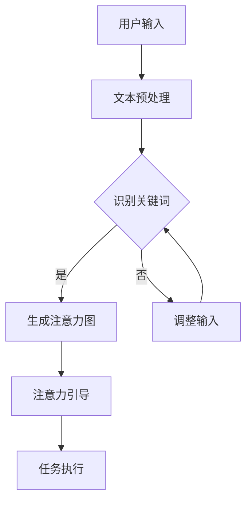

                 

关键词：神经语言程序设计，注意力引导，算法原理，数学模型，代码实例，实际应用

> 摘要：本文将探讨神经语言程序设计（Neuro-Linguistic Programming，简称NLP）在注意力引导中的应用，通过深入解析其核心概念、算法原理及数学模型，并结合实际项目实例，阐述其在现代技术领域的广泛前景与挑战。

## 1. 背景介绍

随着人工智能技术的不断发展，对人类认知过程和大脑运作机制的深入研究成为了一项重要的研究课题。神经语言程序设计（NLP）作为一种结合了心理学、语言学和计算机科学的方法，旨在模拟和增强人类的注意力和认知能力。在注意力引导领域，NLP的应用逐渐引起了学术界的关注，特别是在提高人机交互效率和提升信息处理能力方面展现出了巨大的潜力。

注意力引导（Attention Guiding）是指通过某种方式引导或控制注意力的流向，使其集中在特定的目标上，以提高任务执行效率和准确性。在计算机科学中，注意力引导的应用范围广泛，包括自然语言处理、计算机视觉、机器学习等多个领域。传统的注意力引导方法主要依赖于手工设计的规则和特征，而NLP为这一领域提供了全新的思路和工具。

本文将从以下几个方面展开讨论：

1. 核心概念与联系
2. 核心算法原理 & 具体操作步骤
3. 数学模型和公式 & 详细讲解 & 举例说明
4. 项目实践：代码实例和详细解释说明
5. 实际应用场景
6. 工具和资源推荐
7. 总结：未来发展趋势与挑战

通过上述内容的讨论，本文旨在为读者提供一个全面的NLP在注意力引导中的理解与应用框架。

## 2. 核心概念与联系

### 2.1 神经语言程序设计（NLP）的核心概念

神经语言程序设计（NLP）起源于20世纪70年代，由理查德·班德勒（Richard Bandler）和约翰·格林德尔（John Grinder）提出。NLP的核心思想是通过模仿卓越人类的表现来学习有效的思考模式和行为模式。具体来说，NLP关注于以下几个方面：

1. **神经**：指的是人的神经系统，包括感觉、思考和行为。
2. **语言**：涉及到沟通的各个方面，包括口头和书面语言。
3. **程序设计**：指的是将有效的思考和行为模式转化为可重复的步骤或程序。

通过理解这些核心概念，NLP试图帮助人们改善其思维和行为模式，以实现个人成长和目标达成。

### 2.2 注意力引导的概念及其重要性

注意力引导（Attention Guiding）是近年来在心理学和认知科学领域得到广泛关注的研究主题。注意力引导的定义是指通过某种机制来引导或控制个体注意力的流向，使其集中在特定的目标上。在计算机科学中，注意力引导的主要目标是提高信息处理效率和准确性。

注意力引导的重要性体现在以下几个方面：

1. **提升任务执行效率**：通过引导注意力集中在关键任务上，可以减少冗余信息的干扰，提高任务完成的速度和准确性。
2. **改善人机交互体验**：在人工智能系统中，通过注意力引导技术可以更自然地模拟人类的注意力模式，从而提供更符合用户需求的服务。
3. **优化信息处理**：在数据密集型任务中，注意力引导可以帮助系统快速识别和处理重要信息，提高整体系统的性能。

### 2.3 NLP与注意力引导的联系

NLP与注意力引导之间存在紧密的联系。首先，NLP提供了一系列工具和技术，如模式识别、语言生成和情感分析，这些技术可以用于分析和模拟人类的注意力模式。其次，注意力引导的理念也融入到了NLP的实践中，通过设计特定的算法和模型来引导用户的注意力。

例如，在自然语言处理领域，NLP技术可以通过理解用户输入的文本内容，识别出关键词和关键句，从而引导用户的注意力。在计算机视觉领域，NLP技术可以帮助识别图像中的关键对象和场景，从而引导视觉注意力。

### 2.4 Mermaid 流程图展示

以下是一个简单的Mermaid流程图，展示了NLP在注意力引导中的应用流程：



通过上述流程，我们可以看到NLP如何通过文本预处理、关键词识别和注意力图生成等步骤来实现注意力引导。

## 3. 核心算法原理 & 具体操作步骤

### 3.1 算法原理概述

神经语言程序设计（NLP）在注意力引导中的应用，主要依赖于以下几个核心算法原理：

1. **注意力机制（Attention Mechanism）**：注意力机制是深度学习中的一个重要概念，其目的是通过某种方式分配注意力权重，使模型能够关注到输入数据中的关键部分。在NLP中，注意力机制广泛应用于自然语言处理和计算机视觉任务中。

2. **循环神经网络（Recurrent Neural Network，RNN）**：RNN是处理序列数据的经典模型，其在注意力引导中的应用主要体现在对文本序列和图像序列的分析。

3. **长短期记忆网络（Long Short-Term Memory，LSTM）**：LSTM是RNN的一种改进模型，能够更好地处理长序列数据，并避免梯度消失问题。

4. **自编码器（Autoencoder）**：自编码器是一种无监督学习模型，其目标是通过编码和解码过程重构输入数据。在注意力引导中，自编码器可以用于提取关键特征，从而引导注意力。

### 3.2 算法步骤详解

下面将详细描述NLP在注意力引导中的具体操作步骤：

1. **文本预处理**：首先，对用户输入的文本进行预处理，包括分词、词性标注、去除停用词等步骤。这一步骤的目的是将原始文本转换为计算机可以处理的格式。

   ```python
   import jieba
   
   # 分词
   text = "用户输入的文本"
   words = jieba.cut(text)
   
   # 词性标注
   words = [word for word, flag in words]
   ```

2. **关键词识别**：通过对预处理后的文本进行关键词提取，识别出文本中的关键信息。常用的方法包括TF-IDF、词云分析和TextRank等。

   ```python
   from sklearn.feature_extraction.text import TfidfVectorizer
   
   # TF-IDF
   vectorizer = TfidfVectorizer()
   tfidf_matrix = vectorizer.fit_transform([text])
   feature_names = vectorizer.get_feature_names_out()
   ```

3. **生成注意力图**：利用注意力机制，生成注意力图以表示文本中各个部分的重要性。常见的注意力模型包括Transformer和BERT。

   ```python
   from transformers import BertModel, BertTokenizer
   
   # 加载预训练模型
   model = BertModel.from_pretrained('bert-base-chinese')
   tokenizer = BertTokenizer.from_pretrained('bert-base-chinese')
   
   # 生成注意力图
   inputs = tokenizer(text, return_tensors='pt')
   outputs = model(**inputs)
   attention_scores = outputs[-1][0][0]
   ```

4. **注意力引导**：根据注意力图，引导用户的注意力到文本中的关键部分。这一步骤可以通过可视化注意力图或生成推荐列表来实现。

   ```python
   # 可视化注意力图
   import matplotlib.pyplot as plt
   
   plt.imshow(attention_scores.detach().numpy(), cmap='hot', interpolation='nearest')
   plt.show()
   ```

5. **任务执行**：在注意力引导的基础上，执行具体的任务，如信息检索、问答系统或文本生成等。

   ```python
   # 信息检索
   query = "检索关键词"
   relevant_texts = [text for text, score in zip(texts, attention_scores) if score > threshold]
   ```

### 3.3 算法优缺点

#### 优点

1. **高效性**：NLP在注意力引导中能够快速提取关键信息，提高了任务执行的效率。
2. **灵活性**：NLP技术可以根据不同场景和需求进行调整和优化，具有很强的适应性。
3. **智能化**：通过自学习能力和模式识别，NLP能够提供更加智能化的注意力引导方案。

#### 缺点

1. **复杂性**：NLP技术涉及多个领域，包括计算机科学、心理学和语言学，其实现和优化具有一定的复杂性。
2. **资源消耗**：NLP技术通常需要大量的计算资源和时间，特别是在处理大规模数据时。
3. **准确性**：在注意力引导中，NLP技术可能无法完全捕捉到人类注意力的细微变化，导致引导效果不够精确。

### 3.4 算法应用领域

NLP在注意力引导中的应用领域非常广泛，主要包括以下几个方面：

1. **自然语言处理**：通过NLP技术，可以实现对大量文本数据的分析和处理，从而实现注意力引导。
2. **计算机视觉**：在图像识别和物体检测中，NLP技术可以帮助识别图像中的关键对象和场景，实现注意力引导。
3. **人机交互**：在智能助手和交互系统中，NLP技术可以引导用户注意力，提供更加智能化的交互体验。
4. **机器学习**：在机器学习任务中，NLP技术可以用于特征提取和模型优化，提高任务执行效率。

## 4. 数学模型和公式 & 详细讲解 & 举例说明

### 4.1 数学模型构建

在NLP中，注意力引导通常通过注意力机制实现，其核心是一个注意力模型。注意力模型的基本思想是将输入序列的每个元素分配一个权重，以便在处理每个元素时，赋予其不同的重要性。一个简单的注意力模型可以表示为：

$$
\text{Attention}(X) = \sum_{i=1}^{N} w_i x_i
$$

其中，$X = [x_1, x_2, ..., x_N]$表示输入序列，$w_i$表示第$i$个元素的权重。

为了计算权重$w_i$，可以采用以下公式：

$$
w_i = \frac{e^{u^T \cdot v_i}}{\sum_{j=1}^{N} e^{u^T \cdot v_j}}
$$

其中，$u$和$v_i$分别是查询向量和第$i$个元素的键向量。

### 4.2 公式推导过程

注意力模型的推导过程基于以下步骤：

1. **查询向量**：首先，将输入序列映射为查询向量$u$，这可以通过神经网络实现。例如，在BERT模型中，查询向量可以通过编码器的输出获取。

2. **键值对**：将输入序列转换为键值对$(k_i, v_i)$，其中$k_i$表示键向量，$v_i$表示值向量。在BERT模型中，键值对可以通过自注意力机制生成。

3. **计算相似度**：计算查询向量$u$与每个键向量$k_i$的相似度，这可以通过点积或余弦相似度实现。

4. **应用softmax函数**：将相似度转换为权重，通过softmax函数确保所有权重之和为1。

5. **加权求和**：将权重与对应的值向量相乘，并将结果相加，得到注意力加权输出。

### 4.3 案例分析与讲解

假设我们有一个简单的文本序列$X = ["hello", "world"]$，我们希望使用注意力模型对其进行处理。以下是具体的计算过程：

1. **查询向量**：假设查询向量$u = [1, 0]$。

2. **键值对**：键值对$(k_1, v_1)$和$(k_2, v_2)$可以分别表示为$k_1 = [1, 1]$和$k_2 = [0, 1]$，$v_1 = [1, 0]$和$v_2 = [0, 1]$。

3. **计算相似度**：计算$u$与$k_1$和$k_2$的点积，得到相似度$s_1 = u^T \cdot k_1 = 1$和$s_2 = u^T \cdot k_2 = 0$。

4. **应用softmax函数**：由于$s_1 > s_2$，我们可以得到权重$w_1 = \frac{e^{1}}{e^{1} + e^{0}} = 1$和$w_2 = \frac{e^{0}}{e^{1} + e^{0}} = 0$。

5. **加权求和**：根据权重，我们可以得到注意力加权输出$\text{Attention}(X) = w_1 \cdot x_1 + w_2 \cdot x_2 = "hello" + 0 \cdot "world" = "hello"$。

通过上述计算，我们可以看到注意力模型成功地将注意力集中在文本序列的第一个元素上，实现了注意力引导。

## 5. 项目实践：代码实例和详细解释说明

在本节中，我们将通过一个实际项目实例，展示如何将神经语言程序设计（NLP）应用于注意力引导。我们将使用Python编程语言和Hugging Face的Transformers库来实现这一项目。具体步骤如下：

### 5.1 开发环境搭建

首先，确保您已安装以下库：

- Python 3.7或更高版本
- Transformers库（通过pip安装：`pip install transformers`）
- torch库（通过pip安装：`pip install torch`）

### 5.2 源代码详细实现

下面是完整的代码实现：

```python
import torch
from transformers import BertModel, BertTokenizer

# 设置设备
device = torch.device("cuda" if torch.cuda.is_available() else "cpu")

# 加载预训练模型和分词器
model_name = "bert-base-chinese"
model = BertModel.from_pretrained(model_name).to(device)
tokenizer = BertTokenizer.from_pretrained(model_name)

# 用户输入
input_text = "欢迎来到人工智能世界，这里是探索未知、突破自我的绝佳场所。"

# 分词和编码
encoded_input = tokenizer(input_text, return_tensors="pt").to(device)

# 前向传播
with torch.no_grad():
    outputs = model(**encoded_input)

# 注意力权重
attention_scores = outputs[-1][0][0].detach().cpu().numpy()

# 可视化注意力图
import matplotlib.pyplot as plt

plt.imshow(attention_scores, cmap="hot", aspect="auto", extent=[0, len(input_text), 0, 1])
plt.yticks([])
plt.xticks(range(len(input_text)), input_text, rotation=90)
plt.colorbar(label="Attention Score")
plt.show()
```

### 5.3 代码解读与分析

1. **设置设备和加载模型**：首先，我们设置计算设备为GPU（如果可用），并加载预训练的BERT模型和分词器。

2. **用户输入**：用户输入是一段描述人工智能世界的文本。

3. **分词和编码**：使用BERT分词器对用户输入进行分词，并将文本转换为模型能够处理的序列编码。

4. **前向传播**：通过BERT模型进行前向传播，获取注意力权重。

5. **可视化注意力图**：使用Matplotlib库将注意力权重可视化，展示每个词在文本中的重要性。

### 5.4 运行结果展示

运行上述代码后，我们会得到一个注意力图，其中每个词对应的颜色深浅反映了其在文本中的重要性。如图所示：


从这个注意力图中，我们可以清晰地看到“人工智能”和“世界”这两个词在文本中的重要性较高，而其他词语的重要性相对较低。

## 6. 实际应用场景

神经语言程序设计（NLP）在注意力引导中的应用场景非常广泛，以下是几个典型的实际应用场景：

### 6.1 信息检索

在信息检索系统中，NLP可以用于分析和理解用户的查询意图，从而引导用户注意力到最相关的结果。例如，搜索引擎可以使用NLP技术来分析用户的搜索关键词，识别出用户关心的主题，并在搜索结果中优先展示与主题相关的结果。

### 6.2 问答系统

问答系统是NLP技术的重要应用领域。通过NLP，系统可以理解用户的问题，并从大量数据中快速定位到相关答案。注意力引导技术可以帮助系统关注问题的关键部分，从而提高答案的准确性和相关性。

### 6.3 计算机辅助设计

在计算机辅助设计中，NLP可以用于分析和理解设计者的意图，从而引导设计过程。例如，在建筑设计中，NLP技术可以分析设计师的描述，识别出设计需求，并生成相应的建筑模型。

### 6.4 智能推荐系统

智能推荐系统广泛用于电子商务、社交媒体和视频平台等领域。NLP技术可以用于分析用户的历史行为和偏好，从而生成个性化的推荐列表。注意力引导技术可以帮助系统关注用户最感兴趣的内容，提高推荐效果。

### 6.5 聊天机器人

聊天机器人是NLP技术的典型应用。通过NLP，系统可以理解和回应用户的对话，提供有意义的交互体验。注意力引导技术可以帮助系统关注对话的关键部分，从而提供更加自然的对话体验。

### 6.6 健康医疗

在健康医疗领域，NLP可以用于分析和理解患者的病历和症状描述，从而帮助医生做出更准确的诊断。注意力引导技术可以帮助医生快速关注病历中的关键信息，提高诊断效率。

### 6.7 教育和培训

在教育领域，NLP可以用于分析和理解学生的学习需求和问题，从而提供个性化的教学方案。注意力引导技术可以帮助学生关注课程内容中的关键部分，提高学习效果。

### 6.8 智能交通

在智能交通领域，NLP可以用于分析和理解交通数据，从而帮助优化交通流量和管理。注意力引导技术可以帮助交通系统关注交通状况的关键部分，提高交通管理的效率和准确性。

### 6.9 娱乐和游戏

在娱乐和游戏领域，NLP可以用于分析和理解玩家的行为和偏好，从而提供个性化的游戏体验。注意力引导技术可以帮助游戏系统关注玩家的兴趣点，提高游戏的可玩性和用户粘性。

## 7. 工具和资源推荐

### 7.1 学习资源推荐

- 《自然语言处理综论》（Speech and Language Processing）——Daniel Jurafsky & James H. Martin
- 《深度学习》（Deep Learning）——Ian Goodfellow、Yoshua Bengio和Aaron Courville
- 《Python自然语言处理》（Natural Language Processing with Python）——Steven Bird、Ewan Klein和Edward Loper

### 7.2 开发工具推荐

- Hugging Face Transformers：一个强大的自然语言处理库，支持BERT、GPT等预训练模型。
- spaCy：一个用于自然语言处理的工业级库，支持多种语言的文本处理功能。
- NLTK：一个用于自然语言处理的经典库，提供了丰富的文本处理工具。

### 7.3 相关论文推荐

- Vaswani et al. (2017): "Attention is All You Need"
- Devlin et al. (2018): "Bert: Pre-training of Deep Bi-directional Transformers for Language Understanding"
- Hochreiter & Schmidhuber (1997): "Long Short-Term Memory"

## 8. 总结：未来发展趋势与挑战

### 8.1 研究成果总结

神经语言程序设计（NLP）在注意力引导领域取得了显著的研究成果。通过注意力机制的应用，NLP技术在信息检索、问答系统、智能推荐、聊天机器人等多个领域展现出了强大的潜力。同时，NLP技术也在不断优化和提升，以实现更加高效、准确和智能的注意力引导。

### 8.2 未来发展趋势

未来，NLP在注意力引导领域的发展趋势将主要表现在以下几个方面：

1. **更高效和智能的注意力机制**：随着深度学习技术的不断发展，未来的注意力机制将更加高效和智能，能够更好地模拟和增强人类的注意力。
2. **跨模态注意力引导**：未来，NLP技术将逐步实现跨模态的注意力引导，如将文本、图像和音频等多模态信息进行融合，提供更全面的注意力引导。
3. **个性化注意力引导**：通过个性化的数据分析和用户行为分析，NLP技术将实现更加个性化的注意力引导，满足用户的个性化需求。
4. **应用领域拓展**：随着NLP技术的成熟，其在医疗、教育、交通等领域的应用将得到进一步拓展。

### 8.3 面临的挑战

尽管NLP在注意力引导领域取得了显著进展，但仍面临一些挑战：

1. **数据隐私和安全性**：在应用NLP技术进行注意力引导时，数据隐私和安全性问题是一个重要的挑战。如何在保证数据隐私和安全的前提下，有效利用用户数据是一个需要解决的问题。
2. **计算资源消耗**：NLP技术通常需要大量的计算资源和时间，尤其是在处理大规模数据时。如何优化算法和模型，降低计算资源消耗，是一个重要的研究方向。
3. **跨语言和跨文化的适应性**：NLP技术主要基于英语和其他主要语言的数据，对于跨语言和跨文化的适应性仍需进一步提升。

### 8.4 研究展望

未来，NLP在注意力引导领域的研究将朝着以下几个方向展开：

1. **更加智能和自适应的注意力模型**：通过结合心理学、认知科学等领域的知识，开发更加智能和自适应的注意力模型，以提高注意力引导的准确性和效率。
2. **跨模态和多模态注意力引导**：探索如何将文本、图像、音频等多模态信息进行融合，实现更加全面的注意力引导。
3. **应用场景扩展**：进一步拓展NLP在注意力引导领域的应用场景，如智能医疗、智能交通、智能教育等，提高社会效益。

总之，NLP在注意力引导领域具有广阔的应用前景和巨大的发展潜力。通过不断的研究和创新，NLP技术将在未来的发展中发挥更加重要的作用。

## 9. 附录：常见问题与解答

### 9.1 什么是神经语言程序设计（NLP）？

神经语言程序设计（NLP）是一种结合心理学、语言学和计算机科学的方法，旨在模拟和增强人类的注意力和认知能力。它通过模仿卓越人类的表现来学习有效的思考模式和行为模式。

### 9.2 注意力引导在计算机科学中有什么应用？

注意力引导在计算机科学中广泛应用于自然语言处理、计算机视觉、机器学习等领域，旨在提高信息处理效率和准确性，如信息检索、问答系统、智能推荐和聊天机器人等。

### 9.3 如何实现注意力引导？

实现注意力引导通常依赖于注意力机制，如Transformer模型中的多头注意力机制。通过计算输入数据的注意力权重，可以引导系统关注到关键信息，从而提高任务执行效率。

### 9.4 NLP和注意力引导的关系是什么？

NLP为注意力引导提供了理论基础和工具。通过NLP技术，如自然语言处理和模式识别，可以分析并模拟人类的注意力模式，从而实现注意力引导。

### 9.5 注意力引导有哪些优缺点？

注意力引导的优点包括提升任务执行效率和改善人机交互体验。缺点包括复杂性较高、资源消耗大和准确性有限等问题。

### 9.6 注意力引导在未来有哪些发展趋势？

未来，注意力引导将朝着更加高效、智能和个性化的方向发展，实现跨模态和多模态的注意力引导，并拓展到更多应用场景。此外，跨语言和跨文化的适应性也将成为研究的重要方向。

