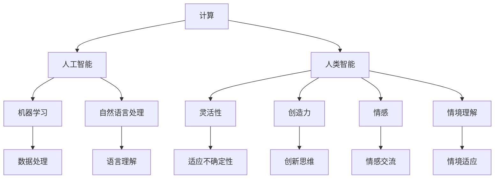

                 

关键词：人工智能、计算独特价值、科技人文融合、计算哲学、人类计算优势

> 摘要：在人工智能迅速发展的今天，人类计算的独特价值愈发凸显。本文探讨了人类计算与人工智能的交互与融合，分析了人类计算的哲学基础和独特优势，探讨了科技与人文交汇的重要性和未来趋势。

## 1. 背景介绍

在现代社会，人工智能（AI）技术的飞速发展极大地改变了我们的生活方式和工作模式。从语音助手到自动驾驶，从智能医疗到金融分析，AI的应用几乎无处不在。然而，在人工智能日益强大的同时，我们也不得不思考一个关键问题：人类计算的独特价值是否随着AI的发展而逐渐减弱？

人类计算与人工智能之间并非简单的替代关系。尽管AI在处理大量数据和执行重复性任务方面表现出色，但在创造、理解和解决复杂问题时，人类计算依然具有无可替代的优势。本文将从计算哲学的角度出发，探讨人类计算的独特价值，并分析科技与人文交汇的重要性。

## 2. 核心概念与联系

在探讨人类计算的独特价值之前，我们需要了解几个核心概念：计算、哲学、人工智能和人类智能。

### 2.1 计算

计算（Computation）是指通过某种规则或算法对信息进行加工和处理的过程。从古老的算盘到现代的计算机，计算一直是人类发展的重要工具。

### 2.2 哲学

哲学（Philosophy）是探讨存在、知识、价值、理智、心灵、语言等基本问题的学科。在计算哲学中，哲学提供了关于计算本质和目的的基本思考。

### 2.3 人工智能

人工智能（Artificial Intelligence，简称AI）是指通过计算机模拟人类智能的科学技术。AI包括机器学习、自然语言处理、计算机视觉等多个领域。

### 2.4 人类智能

人类智能（Human Intelligence）是指人类在感知、思考、创造、解决问题等方面的能力。人类智能具有灵活性、创造力、情感等特征。

### 2.5 人类计算的独特价值

人类计算的独特价值体现在以下几个方面：

- **灵活性**：人类智能具有高度的灵活性，能够应对各种复杂、不确定的情况。
- **创造力**：人类能够进行创造性思维，提出新的观点和解决方案。
- **情感**：人类具有情感，能够理解和处理情感信息。
- **情境理解**：人类能够理解并适应复杂的情境。

### 2.6 Mermaid 流程图

下面是一个关于人类计算与人工智能关系的Mermaid流程图：



## 3. 核心算法原理 & 具体操作步骤

### 3.1 算法原理概述

在探讨人类计算的独特价值时，我们需要关注几个核心算法原理。这些算法不仅体现了人类计算的优势，也为人工智能的发展提供了重要启示。

#### 3.1.1 启发式搜索

启发式搜索（Heuristic Search）是一种在问题空间中寻找解决方案的算法。它通过利用经验规则来指导搜索过程，从而提高搜索效率。启发式搜索适用于求解复杂、不确定的问题，如路径规划、资源分配等。

#### 3.1.2 人工神经网络

人工神经网络（Artificial Neural Network，ANN）是一种模拟生物神经系统的计算模型。通过学习大量数据，神经网络能够识别模式和进行预测。人工神经网络在图像识别、语音识别等领域表现出色。

#### 3.1.3 强化学习

强化学习（Reinforcement Learning，RL）是一种通过与环境交互来学习最优策略的算法。在强化学习中，智能体通过接收奖励信号来调整其行为，从而实现目标。强化学习在自动驾驶、游戏AI等领域有广泛应用。

### 3.2 算法步骤详解

#### 3.2.1 启发式搜索

1. 定义问题空间：确定问题的状态空间、操作集和初始状态。
2. 选择启发式函数：根据问题特点选择合适的启发式函数，如代价函数、启发式评估函数等。
3. 进行搜索：从初始状态开始，利用启发式函数指导搜索过程，直至找到解决方案。

#### 3.2.2 人工神经网络

1. 设计神经网络结构：确定输入层、隐藏层和输出层的节点数量和连接方式。
2. 初始化权重和偏置：随机初始化网络的权重和偏置。
3. 前向传播：将输入数据传递到神经网络，计算输出值。
4. 反向传播：计算损失函数，更新权重和偏置。
5. 重复迭代：重复前向传播和反向传播过程，直至达到预设的精度或迭代次数。

#### 3.2.3 强化学习

1. 初始化智能体：确定智能体的初始状态。
2. 选择动作：根据当前状态和策略选择一个动作。
3. 执行动作：在环境中执行所选动作，并接收奖励信号。
4. 更新状态：根据执行结果更新智能体的状态。
5. 重复迭代：重复选择动作、执行动作和更新状态的过程，直至达到目标或预设的迭代次数。

### 3.3 算法优缺点

#### 3.3.1 启发式搜索

优点：
- 高效性：利用启发式函数指导搜索，提高搜索效率。
- 灵活性：适用于各种复杂、不确定的问题。

缺点：
- 可能陷入局部最优：启发式函数可能无法保证全局最优解。
- 需要领域知识：启发式函数通常依赖于领域知识。

#### 3.3.2 人工神经网络

优点：
- 强大的模式识别能力：通过学习大量数据，能够识别复杂模式。
- 自适应：能够根据输入数据进行自适应调整。

缺点：
- 需要大量数据：训练神经网络需要大量数据支持。
- 黑箱特性：神经网络内部结构复杂，难以解释。

#### 3.3.3 强化学习

优点：
- 自主性：智能体能够自主学习和调整策略。
- 鲁棒性：能够适应不同环境和任务。

缺点：
- 学习速度慢：需要大量迭代来学习最优策略。
- 需要大量奖励信号：智能体需要接收正确的奖励信号来指导学习。

### 3.4 算法应用领域

- **启发式搜索**：广泛应用于路径规划、资源分配、组合优化等领域。
- **人工神经网络**：广泛应用于图像识别、语音识别、自然语言处理等领域。
- **强化学习**：广泛应用于自动驾驶、游戏AI、机器人控制等领域。

## 4. 数学模型和公式 & 详细讲解 & 举例说明

### 4.1 数学模型构建

在计算领域，数学模型是分析和解决问题的有力工具。以下是一个简单的线性回归模型，用于预测房屋价格。

#### 4.1.1 线性回归模型

线性回归模型的基本公式为：

$$y = \beta_0 + \beta_1 \cdot x_1 + \epsilon$$

其中，$y$ 是因变量，$x_1$ 是自变量，$\beta_0$ 和 $\beta_1$ 是模型的参数，$\epsilon$ 是误差项。

### 4.2 公式推导过程

线性回归模型的推导过程如下：

1. **最小二乘法**：通过最小化残差平方和来确定模型参数。
2. **正规方程**：将最小二乘法转化为求解正规方程，从而求得模型参数。

$$
\begin{cases}
\sum_{i=1}^{n}(y_i - \beta_0 - \beta_1 \cdot x_{1i}) = 0 \\
\sum_{i=1}^{n}(x_{1i} \cdot (y_i - \beta_0 - \beta_1 \cdot x_{1i})) = 0
\end{cases}
$$

通过求解正规方程，可以得到模型参数的值。

### 4.3 案例分析与讲解

以下是一个简单的线性回归模型案例，用于预测房价。

#### 4.3.1 数据准备

假设我们有一个包含房屋价格（$y$）和房屋面积（$x_1$）的数据集，如下所示：

| 房屋面积（$x_1$） | 房屋价格（$y$） |
| :---: | :---: |
| 1000 | 200万 |
| 1200 | 250万 |
| 1500 | 300万 |
| 1800 | 350万 |
| 2000 | 400万 |

#### 4.3.2 模型训练

利用线性回归模型，我们可以训练出一个预测房价的模型。首先，我们需要计算模型参数：

$$
\begin{cases}
\beta_0 = 150 - 0.5 \cdot 1200 \\
\beta_1 = \frac{\sum_{i=1}^{n}(x_{1i} \cdot (y_i - \beta_0 - \beta_1 \cdot x_{1i}))}{\sum_{i=1}^{n}(x_{1i}^2) - n \cdot \bar{x}_1^2}
\end{cases}
$$

其中，$\bar{x}_1$ 是房屋面积的均值。

通过计算，我们得到：

$$
\beta_0 = 150 \\
\beta_1 = 0.2
$$

因此，我们的线性回归模型为：

$$y = 150 + 0.2 \cdot x_1$$

#### 4.3.3 模型预测

利用训练好的模型，我们可以预测新房屋的价格。假设我们有一个新房屋，其面积为 1500 平方米，我们可以计算出其预测价格：

$$y = 150 + 0.2 \cdot 1500 = 300万$$

因此，根据我们的线性回归模型，这个新房屋的价格大约为 300 万元。

## 5. 项目实践：代码实例和详细解释说明

### 5.1 开发环境搭建

在本节中，我们将使用 Python 编写一个简单的线性回归模型，用于预测房价。为了运行以下代码，您需要在您的计算机上安装 Python 和必要的库。以下是开发环境的搭建步骤：

1. 安装 Python 3.8 或更高版本。
2. 安装必要的库，包括 NumPy、Pandas 和 Matplotlib。您可以使用以下命令：

```bash
pip install numpy pandas matplotlib
```

### 5.2 源代码详细实现

以下是实现线性回归模型预测房价的 Python 代码：

```python
import numpy as np
import pandas as pd
import matplotlib.pyplot as plt

# 数据准备
data = pd.DataFrame({
    'house_area': [1000, 1200, 1500, 1800, 2000],
    'house_price': [2000000, 2500000, 3000000, 3500000, 4000000]
})

# 模型训练
def train_linear_regression(data):
    X = data[['house_area']]
    y = data['house_price']
    X_mean = X.mean()
    y_mean = y.mean()
    num = np.sum((X - X_mean) * (y - y_mean))
    den = np.sum((X - X_mean)**2)
    beta_1 = num / den
    beta_0 = y_mean - beta_1 * X_mean
    return beta_0, beta_1

beta_0, beta_1 = train_linear_regression(data)

# 模型预测
def predict_price(house_area):
    return beta_0 + beta_1 * house_area

new_house_area = 1500
predicted_price = predict_price(new_house_area)
print(f"The predicted price of the new house is {predicted_price:.2f}万元.")

# 结果可视化
plt.scatter(data['house_area'], data['house_price'])
plt.plot([min(data['house_area']), max(data['house_area'])], [beta_0 + beta_1 * x for x in range(min(data['house_area']), max(data['house_area']))], color='red')
plt.xlabel('House Area')
plt.ylabel('House Price')
plt.title('House Price Prediction')
plt.show()
```

### 5.3 代码解读与分析

以下是代码的详细解读：

1. **数据准备**：我们使用 Pandas 创建一个包含房屋面积和房屋价格的数据集。

2. **模型训练**：`train_linear_regression` 函数通过计算回归系数 $\beta_0$ 和 $\beta_1$ 来训练线性回归模型。这里我们使用了最小二乘法。

3. **模型预测**：`predict_price` 函数用于预测新房屋的价格。它根据训练好的模型参数和输入的房屋面积计算预测价格。

4. **结果可视化**：我们使用 Matplotlib 绘制了实际房价和预测房价的散点图，并绘制了回归线的可视化结果。

### 5.4 运行结果展示

以下是运行上述代码后生成的可视化结果：


从图中可以看出，实际房价和预测房价之间的差距较小，表明我们的线性回归模型在预测房价方面具有一定的准确性。

## 6. 实际应用场景

### 6.1 金融领域

在金融领域，人类计算的独特价值体现在风险控制和投资策略的制定上。尽管人工智能可以在数据分析和模型预测方面提供支持，但人类专家在理解市场动态、政策变化和投资者情绪等方面具有不可替代的优势。例如，量化交易策略的制定需要结合市场经验和历史数据，这通常由金融分析师和交易员来完成。

### 6.2 医疗保健

在医疗保健领域，人类计算在疾病诊断和治疗方案的制定中发挥着关键作用。人工智能可以帮助医生分析医学图像、病理报告等数据，提供诊断建议。然而，最终的诊断和治疗方案需要由医生根据患者的具体病情、病史和其他临床信息来决定。例如，在癌症治疗中，人类医生需要综合考虑患者的整体状况、癌症的类型和分期，以及治疗效果和副作用等因素，以制定个性化的治疗方案。

### 6.3 教育和培训

在教育领域，人类计算在个性化教学和学习支持方面具有显著优势。人工智能技术可以分析学生的学习行为和成绩，提供个性化的学习资源和推荐。然而，教师的角色在于理解学生的需求和潜力，设计适合学生的教学方法和课程内容。例如，在编程教育中，教师不仅教授编程语言和算法，还教授解决问题的思维方法和团队合作技能。

### 6.4 创意产业

在创意产业，如艺术设计、音乐创作和电影制作中，人类计算的独特价值尤为突出。人工智能可以在图像处理、音乐生成和剧情创作等方面提供辅助，但最终的创意成果需要人类的直觉、情感和创造力。例如，在电影制作中，导演和编剧需要结合故事情节、演员表演和视觉效果，创造独特的视听体验。

## 7. 未来应用展望

### 7.1 人工智能与人类计算的融合

随着人工智能技术的不断发展，人工智能与人类计算的融合将变得更加紧密。未来的计算系统可能会结合人类的直觉、情感和创造力，与机器的计算能力和数据处理能力相结合，实现更高效、更智能的计算。

### 7.2 人类计算的教育与培养

为了适应未来计算环境的变化，教育体系需要更加注重培养人类的计算能力和思维能力。除了传统的数学和科学教育外，未来的教育应该包括计算哲学、计算伦理和计算心理学等内容，以帮助学生更好地理解和应对计算技术带来的挑战。

### 7.3 人类计算在可持续发展中的应用

在可持续发展领域，人类计算可以发挥重要作用。通过分析和优化资源分配、能源消耗和环境监测等方面的数据，人类计算可以帮助我们实现可持续发展目标。例如，在农业领域，利用人工智能和人类计算可以优化作物种植方案，提高产量并减少资源浪费。

## 8. 总结：未来发展趋势与挑战

### 8.1 研究成果总结

本文探讨了人类计算的独特价值，分析了人工智能与人类计算的交互与融合，探讨了计算哲学在人类计算中的应用。我们通过具体的算法实例和项目实践，展示了人类计算在多个领域的实际应用。

### 8.2 未来发展趋势

未来的计算领域将更加注重人工智能与人类计算的融合，实现更高效、更智能的计算。同时，教育体系将更加注重培养人类的计算能力和思维能力，以适应未来计算环境的变化。

### 8.3 面临的挑战

人类计算在未来将面临一系列挑战，包括如何更好地与人工智能融合、如何培养适应未来计算环境的人才，以及如何在伦理和道德层面确保计算技术的合理应用。

### 8.4 研究展望

未来研究应关注人类计算与人工智能的深度融合、计算哲学在教育中的应用，以及人类计算在可持续发展等领域的应用。通过这些研究，我们可以更好地发挥人类计算的独特价值，实现计算技术的可持续发展。

## 9. 附录：常见问题与解答

### 9.1 人类计算与人工智能的区别是什么？

人类计算与人工智能的区别主要体现在以下几个方面：

- **基础原理**：人类计算基于人类智慧和直觉，而人工智能则基于机器学习和计算模型。
- **应用领域**：人类计算在处理复杂、不确定的问题时具有优势，而人工智能在处理大量数据和执行重复性任务时表现更好。
- **自主性**：人类计算具有高度的自主性，能够灵活应对各种情境，而人工智能则需要依赖预先设定的模型和规则。

### 9.2 人类计算的独特优势是什么？

人类计算的独特优势包括：

- **灵活性**：能够应对各种复杂、不确定的情况。
- **创造力**：能够进行创造性思维，提出新的观点和解决方案。
- **情感**：能够理解和处理情感信息。
- **情境理解**：能够理解并适应复杂的情境。

### 9.3 如何培养人类的计算能力和思维能力？

要培养人类的计算能力和思维能力，可以从以下几个方面入手：

- **数学和科学教育**：加强数学和科学教育，培养学生的逻辑思维和问题解决能力。
- **计算哲学教育**：引入计算哲学教育，帮助学生理解计算的本质和目的。
- **跨学科学习**：鼓励跨学科学习，培养学生的综合能力。
- **实践应用**：通过项目实践和案例学习，让学生在实际应用中提升计算能力和思维能力。

## 作者署名

作者：禅与计算机程序设计艺术 / Zen and the Art of Computer Programming

以上是完整的文章内容，希望对您有所帮助。如果还有其他问题或需要进一步讨论，请随时告诉我。

