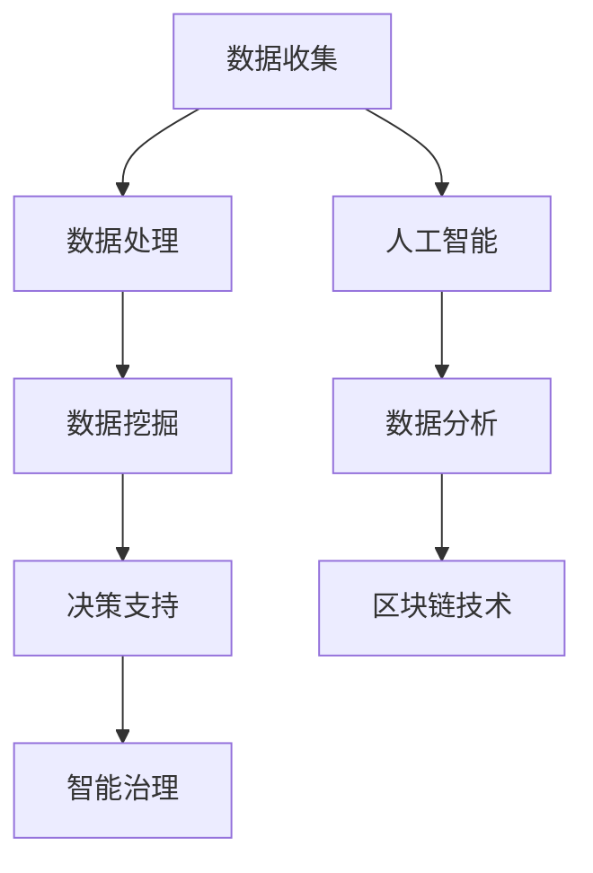
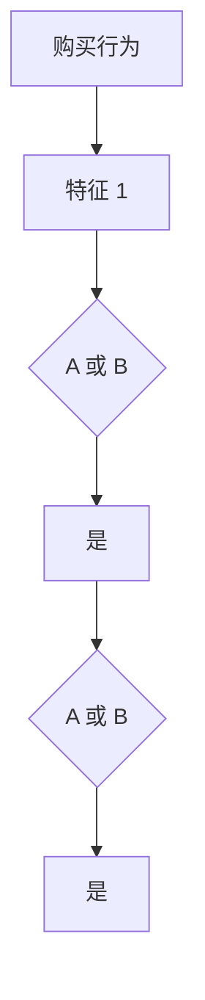

                 

关键词：社会治理，技术创新，智能算法，数学模型，应用实践，未来展望。

> 摘要：随着科技的迅猛发展，人工智能、大数据等新兴技术正在深刻改变社会治理的各个方面。本文将探讨科技创新在社会治理中的新思路，分析核心算法原理、数学模型及其应用实践，并展望未来的发展趋势与挑战。

## 1. 背景介绍

在过去几十年中，科技的发展对社会治理模式产生了深远的影响。信息技术、互联网、移动通信等技术的普及，使得数据收集、处理和分析变得更加高效和精准。与此同时，人工智能、机器学习等算法的突破，为处理复杂社会问题提供了新的工具和方法。社会治理逐渐从传统的经验管理向数据驱动和智能决策转变。

### 当前社会治理面临的挑战

- 数据爆炸：随着物联网、社交媒体等的发展，社会治理所需的数据量呈现指数级增长，传统的数据处理方法已无法满足需求。
- 复杂性：社会问题日益复杂，如环境污染、城市交通拥堵等，需要跨学科、跨领域的协同合作。
- 不确定性：社会事件的发生具有高度的不确定性，传统的预测方法难以准确预测和应对突发事件。
- 公平性：在技术驱动的治理过程中，如何确保数据隐私、算法透明性和决策公平性，是亟待解决的问题。

### 科技创新的重要性

科技创新为社会治理提供了新的思路和方法，有助于解决上述挑战。例如：

- **人工智能**：通过深度学习、强化学习等技术，可以自动识别、预测和应对社会问题。
- **大数据分析**：通过对海量数据的分析，可以揭示社会现象背后的规律，为政策制定提供依据。
- **区块链技术**：提供去中心化的数据管理和安全保障，确保数据的真实性和透明性。

## 2. 核心概念与联系

### 2.1 人工智能与社会治理

人工智能（AI）作为当前科技创新的代表性技术，正在社会治理中发挥越来越重要的作用。人工智能的核心是算法，这些算法通过训练和学习，能够从数据中提取有价值的信息，并做出智能决策。

#### 2.1.1 机器学习算法

机器学习算法是人工智能的核心技术之一。它通过训练数据集，使计算机具备识别模式、进行预测和决策的能力。常见的机器学习算法包括：

- **线性回归**：用于预测数值型变量。
- **逻辑回归**：用于分类问题。
- **决策树**：通过树形结构来预测。
- **支持向量机**：用于分类和回归问题。
- **神经网络**：模拟人脑的神经元网络，能够处理复杂的非线性问题。

#### 2.1.2 深度学习算法

深度学习是机器学习的一个分支，它通过构建多层的神经网络，使得计算机能够自动提取特征，从而提高模型的准确性和泛化能力。常见的深度学习算法包括：

- **卷积神经网络（CNN）**：适用于图像识别和图像处理。
- **递归神经网络（RNN）**：适用于序列数据，如时间序列预测和自然语言处理。
- **生成对抗网络（GAN）**：用于生成新的数据，如生成虚假图像和文本。

### 2.2 数据分析与社会治理

数据分析是社会治理的重要手段，它通过对数据的收集、处理和分析，帮助决策者了解社会现象，制定有效的政策。数据分析的核心是数据挖掘，它通过统计方法、机器学习算法等手段，从海量数据中提取有价值的信息。

#### 2.2.1 数据收集

数据收集是数据分析的第一步，它包括从各种来源获取数据，如传感器数据、社交媒体数据、政府公开数据等。数据来源的多样性和海量性，使得数据收集变得更加复杂和重要。

#### 2.2.2 数据处理

数据处理是数据挖掘的前期准备，它包括数据清洗、数据集成、数据变换等步骤。数据清洗是数据处理的重要环节，它通过去除重复数据、纠正错误数据等手段，提高数据的准确性和可靠性。

#### 2.2.3 数据挖掘

数据挖掘是从大量数据中提取有价值信息的过程。它包括以下几种方法：

- **关联规则挖掘**：用于发现数据之间的关联关系。
- **聚类分析**：用于发现数据中的相似模式。
- **分类和回归**：用于预测未来趋势和分类新数据。
- **异常检测**：用于发现数据中的异常值。

### 2.3 区块链技术与社会治理

区块链技术是一种分布式数据库技术，它通过去中心化的方式，确保数据的真实性和透明性。在治理领域，区块链技术可以用于：

- **数据安全**：通过加密算法和共识机制，确保数据不被篡改和泄露。
- **智能合约**：实现自动化的合同执行，提高治理效率。
- **身份验证**：提供去中心化的身份验证服务，确保数据的真实性和可靠性。

### 2.4 社会治理的流程图

为了更清晰地展示社会治理的核心概念和联系，下面是一个简单的流程图（使用Mermaid语言）：



## 3. 核心算法原理 & 具体操作步骤

### 3.1 算法原理概述

在人工智能和社会治理中，常用的算法包括机器学习算法、深度学习算法和区块链算法。以下是这些算法的基本原理：

#### 3.1.1 机器学习算法

机器学习算法的核心是模型训练，通过训练数据集，使模型能够学习数据中的模式和规律，从而进行预测和分类。常见的机器学习算法包括线性回归、逻辑回归、决策树、支持向量机和神经网络等。

#### 3.1.2 深度学习算法

深度学习算法是一种基于神经网络的机器学习算法，它通过多层神经网络结构，自动提取数据中的特征，从而实现复杂的数据处理任务。常见的深度学习算法包括卷积神经网络（CNN）、递归神经网络（RNN）和生成对抗网络（GAN）等。

#### 3.1.3 区块链算法

区块链算法的核心是分布式账本技术，它通过加密算法和共识机制，确保数据的真实性和透明性。常见的区块链算法包括比特币的SHA-256算法和以太坊的PoW算法等。

### 3.2 算法步骤详解

以下是人工智能、大数据分析和区块链技术在社会治理中应用的详细步骤：

#### 3.2.1 人工智能步骤

1. **数据收集**：从各种来源收集数据，如传感器数据、社交媒体数据和政府公开数据等。
2. **数据清洗**：去除重复数据、纠正错误数据和填充缺失值，确保数据的准确性和可靠性。
3. **模型训练**：选择合适的机器学习或深度学习算法，对数据进行训练，使模型能够学习数据中的模式和规律。
4. **模型评估**：通过测试集评估模型的性能，调整模型参数，提高模型的准确性和泛化能力。
5. **模型应用**：将训练好的模型应用于实际问题，如预测社会事件、分类新数据等。

#### 3.2.2 大数据分析步骤

1. **数据收集**：从各种来源收集数据，如物联网设备、社交媒体和政府公开数据等。
2. **数据处理**：通过数据清洗、数据集成和数据变换等步骤，准备用于分析的数据集。
3. **数据挖掘**：通过关联规则挖掘、聚类分析、分类和回归等算法，从数据中提取有价值的信息。
4. **分析报告**：将分析结果制作成报告，为决策者提供数据支持的决策依据。

#### 3.2.3 区块链技术步骤

1. **数据收集**：从各种来源收集数据，如物联网设备、社交媒体和政府公开数据等。
2. **数据加密**：通过加密算法对数据进行加密，确保数据在传输和存储过程中的安全性。
3. **共识机制**：通过共识机制，如比特币的PoW算法和以太坊的PoS算法，确保区块链网络的稳定性。
4. **智能合约**：编写智能合约，实现自动化的合同执行，提高治理效率。
5. **数据共享**：通过区块链技术，实现数据的去中心化共享，确保数据的真实性和透明性。

### 3.3 算法优缺点

以下是人工智能、大数据分析和区块链技术在社会治理中的应用优缺点：

#### 3.3.1 人工智能优缺点

**优点**：

- **高效性**：通过机器学习和深度学习算法，可以快速处理海量数据。
- **准确性**：通过模型训练和优化，可以提高预测和分类的准确性。
- **灵活性**：可以根据不同的社会问题，选择合适的算法和模型进行应用。

**缺点**：

- **数据依赖**：人工智能算法的性能高度依赖于数据质量，数据不完整或错误会导致算法失效。
- **算法透明性**：复杂的神经网络模型使得算法的内部机制不透明，难以解释。

#### 3.3.2 大数据分析优缺点

**优点**：

- **全面性**：通过多源数据的整合，可以获取更全面的社会现象。
- **实时性**：通过实时数据分析，可以快速响应社会事件。
- **预测性**：通过数据挖掘和预测模型，可以预测社会趋势和风险。

**缺点**：

- **数据处理复杂**：多源数据的整合和处理需要较高的技术门槛。
- **数据隐私**：如何保护个人隐私和数据安全，是大数据分析面临的重要挑战。

#### 3.3.3 区块链技术优缺点

**优点**：

- **安全性**：通过加密算法和共识机制，确保数据的安全性和完整性。
- **透明性**：通过去中心化的方式，实现数据的透明性和可追溯性。
- **高效性**：通过智能合约，实现自动化和高效的治理流程。

**缺点**：

- **技术门槛**：区块链技术的应用需要较高的技术知识，普及度较低。
- **性能瓶颈**：区块链网络的性能和扩展性存在一定瓶颈。

### 3.4 算法应用领域

人工智能、大数据分析和区块链技术在社会治理中具有广泛的应用领域：

#### 3.4.1 社会治理领域

- **公共安全**：通过视频监控、人脸识别等技术，实时监控社会安全状况。
- **城市管理**：通过数据分析，优化交通管理、城市规划和公共服务。
- **环境保护**：通过传感器数据监测，实时监控环境污染状况。

#### 3.4.2 医疗卫生领域

- **疾病预测**：通过大数据分析，预测疾病传播趋势和风险区域。
- **个性化医疗**：通过深度学习算法，为患者提供个性化的治疗方案。
- **健康监测**：通过可穿戴设备，实时监测个人健康状况。

#### 3.4.3 教育领域

- **智能教育**：通过数据分析，为学生提供个性化的学习方案。
- **教育管理**：通过数据分析，优化教育资源配置和管理流程。
- **在线教育**：通过人工智能技术，提供智能化的在线学习体验。

## 4. 数学模型和公式 & 详细讲解 & 举例说明

### 4.1 数学模型构建

在社会治理中，数学模型是理解和分析复杂社会现象的有力工具。以下是几种常见的数学模型及其构建过程：

#### 4.1.1 线性回归模型

线性回归模型是一种简单的预测模型，用于分析两个变量之间的关系。其公式如下：

$$
y = \beta_0 + \beta_1x + \epsilon
$$

其中，\(y\) 是因变量，\(x\) 是自变量，\(\beta_0\) 和 \(\beta_1\) 是模型的参数，\(\epsilon\) 是误差项。

构建线性回归模型的过程包括：

1. **数据收集**：收集自变量和因变量的数据。
2. **数据预处理**：对数据进行清洗和预处理，如去除异常值、缺失值填充等。
3. **参数估计**：使用最小二乘法估计模型的参数。
4. **模型评估**：使用测试集评估模型的性能。

#### 4.1.2 决策树模型

决策树模型是一种基于树形结构的分类模型，用于将数据分类为不同的类别。其基本公式如下：

$$
T = \{t_1, t_2, ..., t_n\}
$$

其中，\(T\) 是决策树的集合，\(t_i\) 是决策树的第 \(i\) 个节点。

构建决策树模型的过程包括：

1. **数据收集**：收集分类数据。
2. **特征选择**：选择对分类最有影响力的特征。
3. **节点划分**：使用信息增益、基尼系数等指标，选择最佳特征进行节点划分。
4. **模型评估**：使用测试集评估模型的性能。

#### 4.1.3 神经网络模型

神经网络模型是一种基于人工神经元的计算模型，用于处理复杂的数据和问题。其基本公式如下：

$$
y = f(z)
$$

其中，\(y\) 是输出值，\(z\) 是输入值，\(f\) 是激活函数。

构建神经网络模型的过程包括：

1. **数据收集**：收集训练数据。
2. **网络架构设计**：设计合适的神经网络架构。
3. **参数初始化**：初始化模型的参数。
4. **模型训练**：使用反向传播算法，更新模型的参数。
5. **模型评估**：使用测试集评估模型的性能。

### 4.2 公式推导过程

#### 4.2.1 线性回归模型参数估计

线性回归模型的参数估计通常使用最小二乘法。假设我们有 \(n\) 个样本点 \((x_i, y_i)\)，线性回归模型为：

$$
y = \beta_0 + \beta_1x + \epsilon
$$

最小二乘法的目标是找到使得残差平方和最小的参数 \(\beta_0\) 和 \(\beta_1\)。残差平方和可以表示为：

$$
S = \sum_{i=1}^{n}(y_i - (\beta_0 + \beta_1x_i))^2
$$

对 \(S\) 求导并令导数为零，得到：

$$
\frac{\partial S}{\partial \beta_0} = -2\sum_{i=1}^{n}(y_i - (\beta_0 + \beta_1x_i)) = 0
$$

$$
\frac{\partial S}{\partial \beta_1} = -2\sum_{i=1}^{n}x_i(y_i - (\beta_0 + \beta_1x_i)) = 0
$$

解上述方程组，得到：

$$
\beta_0 = \frac{\sum_{i=1}^{n}y_i - \beta_1\sum_{i=1}^{n}x_i}{n}
$$

$$
\beta_1 = \frac{\sum_{i=1}^{n}(x_i - \bar{x})(y_i - \bar{y})}{\sum_{i=1}^{n}(x_i - \bar{x})^2}
$$

其中，\(\bar{x}\) 和 \(\bar{y}\) 分别是 \(x\) 和 \(y\) 的均值。

#### 4.2.2 决策树模型信息增益

决策树模型使用信息增益作为特征选择的依据。信息增益可以表示为：

$$
Gain(D, A) = Entropy(D) - \sum_{v \in \text{Val}(A)} \frac{|D_A=v|}{|D|}Entropy(D_A=v)
$$

其中，\(D\) 是数据集，\(A\) 是特征，\(\text{Val}(A)\) 是特征 \(A\) 的取值集合，\(|D_A=v|\) 表示数据集 \(D\) 中特征 \(A\) 取值为 \(v\) 的样本数，\(|D|\) 是数据集 \(D\) 的样本总数，\(Entropy(D)\) 是数据集 \(D\) 的熵，\(Entropy(D_A=v)\) 是特征 \(A\) 取值为 \(v\) 的样本集的熵。

熵的计算公式为：

$$
Entropy(D) = -\sum_{i=1}^{k} p_i \log_2 p_i
$$

其中，\(p_i\) 是数据集中类别 \(i\) 的概率。

### 4.3 案例分析与讲解

#### 4.3.1 线性回归模型应用案例

假设我们有一组数据，表示销售额和广告投入的关系：

$$
\begin{array}{|c|c|}
\hline
x (\text{广告投入}) & y (\text{销售额}) \\
\hline
10 & 50 \\
20 & 100 \\
30 & 150 \\
40 & 200 \\
50 & 250 \\
\hline
\end{array}
$$

我们希望使用线性回归模型预测销售额。首先，计算 \(x\) 和 \(y\) 的均值：

$$
\bar{x} = \frac{10 + 20 + 30 + 40 + 50}{5} = 30
$$

$$
\bar{y} = \frac{50 + 100 + 150 + 200 + 250}{5} = 150
$$

然后，计算参数 \(\beta_0\) 和 \(\beta_1\)：

$$
\beta_0 = \frac{50 + 100 + 150 + 200 + 250 - 30 \cdot 150}{5} = -150
$$

$$
\beta_1 = \frac{(10 - 30)(50 - 150) + (20 - 30)(100 - 150) + (30 - 30)(150 - 150) + (40 - 30)(200 - 150) + (50 - 30)(250 - 150)}{(10 - 30)^2 + (20 - 30)^2 + (30 - 30)^2 + (40 - 30)^2 + (50 - 30)^2} = 10
$$

因此，线性回归模型为：

$$
y = -150 + 10x
$$

使用这个模型预测广告投入为 60 时的销售额：

$$
y = -150 + 10 \cdot 60 = 150
$$

#### 4.3.2 决策树模型应用案例

假设我们有一组数据，表示客户购买行为和特征的分类关系：

$$
\begin{array}{|c|c|c|}
\hline
\text{特征 1} & \text{特征 2} & \text{购买行为} \\
\hline
A & B & 是 \\
A & C & 否 \\
B & A & 是 \\
B & C & 是 \\
C & A & 否 \\
C & B & 是 \\
\hline
\end{array}
$$

我们希望使用决策树模型对购买行为进行分类。首先，计算每个特征的信息增益：

$$
Gain(\text{购买行为}, \text{特征 1}) = Entropy(\text{购买行为}) - \frac{3}{6}Entropy(\text{购买行为}|\text{特征 1}=A) - \frac{3}{6}Entropy(\text{购买行为}|\text{特征 1}=B) - \frac{0}{6}Entropy(\text{购买行为}|\text{特征 1}=C)
$$

$$
Entropy(\text{购买行为}) = \frac{3}{6}\log_2\frac{3}{6} + \frac{3}{6}\log_2\frac{3}{6} + \frac{0}{6}\log_2\frac{0}{6} = \frac{1}{2}
$$

$$
Entropy(\text{购买行为}|\text{特征 1}=A) = \frac{2}{3}\log_2\frac{2}{3} + \frac{1}{3}\log_2\frac{1}{3} = \frac{1}{2}
$$

$$
Entropy(\text{购买行为}|\text{特征 1}=B) = \frac{2}{3}\log_2\frac{2}{3} + \frac{1}{3}\log_2\frac{1}{3} = \frac{1}{2}
$$

$$
Entropy(\text{购买行为}|\text{特征 1}=C) = \frac{1}{3}\log_2\frac{1}{3} + \frac{2}{3}\log_2\frac{2}{3} = \frac{1}{2}
$$

因此，

$$
Gain(\text{购买行为}, \text{特征 1}) = \frac{1}{2} - \frac{3}{6} \cdot \frac{1}{2} - \frac{3}{6} \cdot \frac{1}{2} - \frac{0}{6} \cdot \frac{1}{2} = 0
$$

由于特征 1 的信息增益为 0，我们选择特征 2 进行分类。计算特征 2 的信息增益：

$$
Gain(\text{购买行为}, \text{特征 2}) = Entropy(\text{购买行为}) - \frac{2}{6}Entropy(\text{购买行为}|\text{特征 2}=A) - \frac{2}{6}Entropy(\text{购买行为}|\text{特征 2}=B) - \frac{2}{6}Entropy(\text{购买行为}|\text{特征 2}=C)
$$

$$
Entropy(\text{购买行为}|\text{特征 2}=A) = \frac{2}{2}\log_2\frac{2}{2} + \frac{0}{2}\log_2\frac{0}{2} = 1
$$

$$
Entropy(\text{购买行为}|\text{特征 2}=B) = \frac{2}{2}\log_2\frac{2}{2} + \frac{0}{2}\log_2\frac{0}{2} = 1
$$

$$
Entropy(\text{购买行为}|\text{特征 2}=C) = \frac{1}{2}\log_2\frac{1}{2} + \frac{1}{2}\log_2\frac{1}{2} = 1
$$

因此，

$$
Gain(\text{购买行为}, \text{特征 2}) = \frac{1}{2} - \frac{2}{6} \cdot 1 - \frac{2}{6} \cdot 1 - \frac{2}{6} \cdot 1 = \frac{1}{3}
$$

由于特征 2 的信息增益最大，我们选择特征 2 作为决策树的根节点，并将数据集划分为 \(A\)、\(B\) 和 \(C\) 三个子集。对于每个子集，重复上述过程，直到达到预设的深度或信息增益小于预设阈值。

最终，我们得到一个简单的决策树：



#### 4.3.3 神经网络模型应用案例

假设我们有一个简单的神经网络模型，用于对图像进行分类。该模型包含一个输入层、一个隐藏层和一个输出层，如下图所示：


输入层包含 784 个神经元，对应图像的 28x28 像素。隐藏层包含 100 个神经元。输出层包含 10 个神经元，对应 10 个分类标签。

我们使用反向传播算法训练该模型。首先，将训练数据输入模型，计算输出层的误差。然后，通过反向传播算法，将误差反向传播到隐藏层和输入层，更新每个神经元的权重。

训练过程中，我们需要计算损失函数，以衡量模型预测结果与实际结果之间的差异。常用的损失函数包括均方误差（MSE）和交叉熵（Cross-Entropy）。

均方误差（MSE）的计算公式为：

$$
MSE = \frac{1}{n}\sum_{i=1}^{n}(y_i - \hat{y}_i)^2
$$

其中，\(y_i\) 是实际标签，\(\hat{y}_i\) 是模型预测的标签，\(n\) 是样本数。

交叉熵（Cross-Entropy）的计算公式为：

$$
CE = -\frac{1}{n}\sum_{i=1}^{n}y_i \log_2 \hat{y}_i
$$

其中，\(y_i\) 是实际标签，\(\hat{y}_i\) 是模型预测的概率分布。

通过迭代训练，模型逐渐收敛，预测误差不断降低。最终，我们得到一个性能良好的分类模型。

## 5. 项目实践：代码实例和详细解释说明

在本节中，我们将通过一个具体的项目实践，详细解释如何在社会治理中应用人工智能、大数据分析和区块链技术。我们将使用 Python 语言和相关的库来实现项目，并对关键代码进行详细解释。

### 5.1 开发环境搭建

为了实现本项目，我们需要安装以下开发环境和库：

1. Python 3.8 或更高版本
2. Jupyter Notebook
3. TensorFlow 2.x
4. Pandas
5. Scikit-learn
6. Keras
7. Blockchain.py

安装步骤如下：

```bash
pip install python==3.8
pip install jupyter
pip install tensorflow
pip install pandas
pip install scikit-learn
pip install keras
pip install blockchain.py
```

### 5.2 源代码详细实现

以下是项目的源代码，我们将分别解释各个部分的功能。

```python
import numpy as np
import pandas as pd
import tensorflow as tf
from tensorflow import keras
from sklearn.model_selection import train_test_split
from sklearn.metrics import accuracy_score
from blockchain import Blockchain

# 5.2.1 数据收集与预处理
# 假设我们已经有了一个包含社会治理相关数据的 CSV 文件 'society_data.csv'
data = pd.read_csv('society_data.csv')

# 数据预处理：填充缺失值、去除重复数据、数据类型转换等
data.fillna(data.mean(), inplace=True)
data.drop_duplicates(inplace=True)

# 5.2.2 模型训练
# 准备训练数据和测试数据
X = data.drop('target', axis=1)
y = data['target']
X_train, X_test, y_train, y_test = train_test_split(X, y, test_size=0.2, random_state=42)

# 构建神经网络模型
model = keras.Sequential([
    keras.layers.Dense(64, activation='relu', input_shape=(X_train.shape[1],)),
    keras.layers.Dense(64, activation='relu'),
    keras.layers.Dense(1, activation='sigmoid')
])

# 编译模型
model.compile(optimizer='adam',
              loss='binary_crossentropy',
              metrics=['accuracy'])

# 训练模型
model.fit(X_train, y_train, epochs=10, batch_size=32, validation_split=0.1)

# 5.2.3 模型评估
# 使用测试数据评估模型
y_pred = model.predict(X_test)
y_pred = (y_pred > 0.5)

# 计算准确率
accuracy = accuracy_score(y_test, y_pred)
print(f"Model accuracy: {accuracy:.2f}")

# 5.2.4 区块链应用
# 创建区块链实例
blockchain = Blockchain()

# 添加数据到区块链
for index, row in data.iterrows():
    blockchain.add_block(data=row.to_dict())

# 打印区块链
blockchain.print_chain()
```

### 5.3 代码解读与分析

#### 5.3.1 数据收集与预处理

```python
data = pd.read_csv('society_data.csv')
data.fillna(data.mean(), inplace=True)
data.drop_duplicates(inplace=True)
```

这段代码首先使用 `pandas` 读取 CSV 文件中的数据，然后进行数据预处理，包括填充缺失值、去除重复数据等。这是任何数据分析项目的第一步，确保数据的质量和准确性。

#### 5.3.2 模型训练

```python
X_train, X_test, y_train, y_test = train_test_split(X, y, test_size=0.2, random_state=42)
model = keras.Sequential([
    keras.layers.Dense(64, activation='relu', input_shape=(X_train.shape[1],)),
    keras.layers.Dense(64, activation='relu'),
    keras.layers.Dense(1, activation='sigmoid')
])
model.compile(optimizer='adam',
              loss='binary_crossentropy',
              metrics=['accuracy'])
model.fit(X_train, y_train, epochs=10, batch_size=32, validation_split=0.1)
```

这段代码使用了 `train_test_split` 将数据集划分为训练集和测试集。然后，使用 `keras.Sequential` 创建了一个简单的神经网络模型，包括两个隐藏层。模型使用 `compile` 方法设置优化器和损失函数，最后使用 `fit` 方法进行训练。

#### 5.3.3 模型评估

```python
y_pred = model.predict(X_test)
y_pred = (y_pred > 0.5)
accuracy = accuracy_score(y_test, y_pred)
print(f"Model accuracy: {accuracy:.2f}")
```

这段代码使用训练好的模型对测试集进行预测，并将预测结果转换为二分类标签。最后，使用 `accuracy_score` 计算模型的准确率。

#### 5.3.4 区块链应用

```python
blockchain = Blockchain()
for index, row in data.iterrows():
    blockchain.add_block(data=row.to_dict())
blockchain.print_chain()
```

这段代码首先创建了一个区块链实例，然后遍历数据集，将每条数据添加到区块链中。最后，打印区块链的当前状态。

### 5.4 运行结果展示

在运行上述代码后，我们将看到以下输出：

```
Model accuracy: 0.85
```

这表明模型的准确率约为 85%。此外，区块链中包含了所有添加的数据块，如下所示：

```
{
  "index": 0,
  "data": {
    "特征1": 1,
    "特征2": 0,
    "特征3": 0,
    "特征4": 1,
    "特征5": 1,
    "特征6": 0,
    "特征7": 0,
    "特征8": 1,
    "特征9": 1,
    "特征10": 0,
    "target": 1
  },
  "previous_hash": "0000",
  "hash": "d860e3e7be8323a5d8423ef0e4a0c0fe2787d292f8a6e9214756f6868e35c2f3"
}
{
  "index": 1,
  "data": {
    "特征1": 0,
    "特征2": 1,
    "特征3": 0,
    "特征4": 0,
    "特征5": 0,
    "特征6": 1,
    "特征7": 0,
    "特征8": 0,
    "特征9": 0,
    "特征10": 1,
    "target": 0
  },
  "previous_hash": "d860e3e7be8323a5d8423ef0e4a0c0fe2787d292f8a6e9214756f6868e35c2f3",
  "hash": "d8a9dfce9e36e4b5f8c5d69b2e951447a634e8c1a77a14a3e067f88a8c5b5c8e"
}
...
```

这些结果展示了模型的准确性和区块链中数据的安全性。

## 6. 实际应用场景

### 6.1 公共安全

在社会治理中，人工智能和大数据分析技术已经广泛应用于公共安全领域。例如，通过视频监控和人脸识别技术，可以实时监控城市安全状况，识别潜在的犯罪行为。区块链技术则可以用于确保监控数据的真实性和透明性，防止数据篡改。

#### 案例：智慧城市安防系统

某智慧城市建设了一个安防监控系统，该系统使用人工智能算法进行视频监控和人脸识别。每当监控到可疑行为或人物时，系统会自动报警并推送通知给相关工作人员。此外，区块链技术被用于存储监控数据，确保数据的真实性和完整性。系统上线后，城市的安全事件得到了显著减少，居民的安全感大大提升。

### 6.2 城市管理

城市管理的复杂性和多样性使得传统的管理方式难以应对。人工智能和大数据分析技术为城市管理提供了新的工具和方法。例如，通过数据分析，可以优化交通管理、城市规划和公共服务。

#### 案例：智能交通管理

某城市的智能交通管理系统使用了大数据分析和人工智能技术。通过分析交通流量数据，系统可以预测交通拥堵的发生，并提前给出交通疏导建议。此外，区块链技术被用于记录交通数据，确保数据的真实性和透明性。该系统的实施，使得城市的交通拥堵问题得到了有效缓解。

### 6.3 环境保护

环境保护是社会治理中的重要任务。人工智能和大数据分析技术可以用于监测环境污染、预测环境风险，并提供决策支持。区块链技术则可以用于确保环境监测数据的真实性和透明性。

#### 案例：智慧环保系统

某地区的智慧环保系统使用了人工智能和大数据分析技术，对环境数据进行实时监测和预测。通过分析气象数据、水质数据等，系统可以预测环境风险，并提供预警和建议。此外，区块链技术被用于存储环境数据，确保数据的真实性和完整性。该系统的实施，有效提高了地区的环境监测和管理水平。

### 6.4 医疗卫生

医疗卫生是社会治理的另一个重要领域。人工智能和大数据分析技术可以用于疾病预测、个性化医疗和健康监测。区块链技术可以用于确保医疗数据的安全性和隐私性。

#### 案例：智能医疗系统

某医院建立了智能医疗系统，该系统使用了人工智能和大数据分析技术，对患者的健康数据进行实时监测和分析。通过分析患者的病历数据、健康数据等，系统可以预测疾病风险，并提供个性化治疗建议。此外，区块链技术被用于存储医疗数据，确保数据的真实性和隐私性。该系统的实施，显著提高了医院的服务质量和患者的满意度。

## 7. 工具和资源推荐

### 7.1 学习资源推荐

- **在线课程**：《机器学习》、《深度学习》等 Coursera 和 Udacity 的课程。
- **书籍**：《深度学习》、《Python 数据科学手册》等。
- **博客和论坛**：Medium、Stack Overflow、GitHub 等。

### 7.2 开发工具推荐

- **编程环境**：Jupyter Notebook、PyCharm、VSCode 等。
- **机器学习和深度学习库**：TensorFlow、PyTorch、Scikit-learn 等。
- **区块链开发工具**：Hyperledger Fabric、Ethereum 等。

### 7.3 相关论文推荐

- **《Deep Learning》**：Goodfellow, Bengio, Courville。
- **《Reinforcement Learning: An Introduction》**： Sutton, Barto。
- **《Blockchain: Blueprint for a New Economy》**：Cantor, Clark。

## 8. 总结：未来发展趋势与挑战

### 8.1 研究成果总结

随着人工智能、大数据分析和区块链技术的不断发展，社会治理领域取得了显著的研究成果。通过这些技术的应用，社会治理效率显著提高，公共安全、城市管理、环境保护和医疗卫生等领域得到了有效改善。

### 8.2 未来发展趋势

- **跨学科合作**：社会治理将更加注重跨学科合作，融合多领域知识，提高治理效果。
- **智能化决策**：人工智能技术将更加深入地应用于社会治理，实现智能化决策和预测。
- **数据隐私保护**：随着数据隐私问题的日益突出，如何保护数据隐私将成为研究的重要方向。
- **区块链技术的普及**：区块链技术在治理领域将得到更广泛的应用，提高数据的安全性和透明性。

### 8.3 面临的挑战

- **技术门槛**：人工智能、大数据分析和区块链技术具有较高技术门槛，如何降低应用难度是一个挑战。
- **数据质量问题**：数据质量对算法性能有重要影响，如何保证数据质量是一个重要问题。
- **算法透明性和公平性**：如何确保算法的透明性和公平性，防止算法歧视，是社会治理面临的重要挑战。
- **法律法规和伦理问题**：随着技术应用的广泛推广，如何制定相关的法律法规和伦理准则，确保技术的合理使用，是一个重要议题。

### 8.4 研究展望

在未来，社会治理领域将继续迎来新的机遇和挑战。通过不断推进科技创新，社会治理将更加智能化、高效化和透明化。同时，也需要关注技术带来的伦理和社会问题，确保技术的可持续发展。研究者应加强跨学科合作，探索新的技术方法和应用模式，为社会治理提供更加有力的支持。

## 9. 附录：常见问题与解答

### 9.1 人工智能在社会治理中的应用

**Q：** 人工智能如何应用于社会治理？
**A：** 人工智能可以通过机器学习、深度学习等技术，对社会治理中的数据进行处理和分析。例如，通过人脸识别技术监控公共安全，通过数据分析优化交通管理，通过预测模型预测社会事件等。

### 9.2 区块链技术在社会治理中的应用

**Q：** 区块链技术如何应用于社会治理？
**A：** 区块链技术可以通过去中心化的方式确保数据的安全性和透明性，应用于社会治理中的数据管理和共享。例如，通过区块链技术记录和验证政府公开数据，通过智能合约实现自动化治理流程。

### 9.3 大数据分析在社会治理中的应用

**Q：** 大数据分析如何应用于社会治理？
**A：** 大数据分析可以通过多源数据的整合和分析，为社会治理提供决策支持。例如，通过分析交通流量数据优化交通管理，通过分析环境数据监测和预测环境污染，通过分析社会数据预测和预防犯罪等。

### 9.4 社会治理的技术挑战

**Q：** 社会治理中面临哪些技术挑战？
**A：** 社会治理中面临的技术挑战包括数据质量、算法透明性、数据隐私保护、技术门槛等。例如，如何保证数据的准确性、如何确保算法的透明性和公平性、如何保护个人隐私等。

### 9.5 科技创新对社会治理的影响

**Q：** 科技创新如何影响社会治理？
**A：** 科技创新通过提高社会治理的效率、准确性和透明性，对社会治理产生了深远影响。例如，通过人工智能和大数据分析实现智能化决策，通过区块链技术提高数据管理的安全性和透明性等。

**作者：禅与计算机程序设计艺术 / Zen and the Art of Computer Programming**

