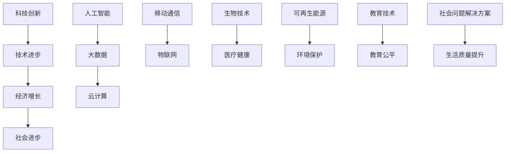

                 

科技创新不仅是推动技术进步的重要动力，更是社会发展的关键驱动力。随着信息技术的飞速发展，人工智能、大数据、云计算等新兴技术不断涌现，深刻改变了我们的生活方式、工作方式和社会结构。本文将深入探讨科技创新对社会进步的深远影响，分析其在不同领域的应用，展望未来科技发展的趋势与挑战。

## 1. 背景介绍

20世纪以来，科技革命浪潮此起彼伏，从计算机科学的诞生到互联网的普及，再到移动通信和大数据技术的兴起，每一次技术进步都为社会带来了翻天覆地的变化。如今，我们正处在一个以数据为核心、以算法为驱动的新时代，科技创新成为引领社会发展的核心力量。

### 1.1 科技创新的定义

科技创新指的是利用科学知识、技术手段和工程实践，创造新的产品、服务、工艺或商业模式的系统性活动。它不仅包括基础科学研究，还涵盖了应用研究、开发研究和技术转化等多个环节。

### 1.2 科技创新的重要性

科技创新的重要性体现在以下几个方面：

1. **经济增长**：科技创新是推动经济增长的主要动力，通过提高生产效率、降低成本、创造新产业，推动经济的持续增长。
2. **社会进步**：科技创新改善了人们的生活质量，解决了许多社会问题，如医疗健康、环境保护、教育公平等。
3. **国际竞争**：在全球化背景下，科技创新成为国家竞争力的重要体现，只有不断进行科技创新，才能在激烈的国际竞争中立于不败之地。

## 2. 核心概念与联系

在探讨科技创新对社会进步的影响之前，我们需要明确几个核心概念及其相互之间的联系。以下是使用Mermaid绘制的流程图：



### 2.1 技术进步

技术进步是科技创新的核心，它推动了各个领域的发展。例如，计算机科学的发展使得信息处理变得更加高效，而移动通信技术的进步则使得信息传递更加便捷。

### 2.2 经济增长

经济增长依赖于技术进步，它通过提高生产力和效率，推动社会财富的积累。例如，云计算技术的普及为企业提供了强大的计算能力，降低了运营成本，从而促进了经济的快速发展。

### 2.3 社会进步

社会进步是科技创新的终极目标，它体现在人们生活质量的提升和社会问题的解决上。例如，人工智能在医疗健康领域的应用，使得疾病诊断更加精准，医疗效率大幅提升，从而改善了人们的健康状况。

## 3. 核心算法原理 & 具体操作步骤

### 3.1 算法原理概述

在科技创新中，算法是核心技术之一。以下是几种核心算法原理及其应用场景：

1. **深度学习算法**：深度学习算法是人工智能的基础，通过模拟人脑神经网络，实现对复杂数据的自动特征提取和模式识别。应用场景包括图像识别、语音识别和自然语言处理等。
2. **大数据算法**：大数据算法用于处理和分析大规模数据集，以发现隐藏的模式和关联。应用场景包括商业智能、金融市场分析和公共安全等。
3. **云计算算法**：云计算算法优化资源的分配和管理，提高计算效率和降低成本。应用场景包括科学计算、游戏开发和大数据处理等。

### 3.2 算法步骤详解

以深度学习算法为例，其具体操作步骤如下：

1. **数据收集**：收集大量带有标签的样本数据，例如图像、文本和音频等。
2. **数据预处理**：对数据进行清洗、归一化和特征提取，使其适用于深度学习模型。
3. **模型设计**：设计神经网络结构，选择合适的激活函数和损失函数。
4. **模型训练**：使用训练数据对模型进行训练，通过反向传播算法调整模型参数。
5. **模型评估**：使用验证数据集评估模型性能，调整模型参数以优化性能。
6. **模型部署**：将训练好的模型部署到实际应用场景中，例如图像识别系统或语音助手。

### 3.3 算法优缺点

深度学习算法的优点包括：

1. **强大的特征提取能力**：能够自动提取数据中的复杂特征，提高模型性能。
2. **适应性强**：可以应用于多种不同类型的数据和任务，具有广泛的适用性。

缺点包括：

1. **计算成本高**：深度学习模型通常需要大量的计算资源和时间进行训练。
2. **数据依赖性强**：模型的性能依赖于大量的训练数据，数据质量和数量对模型效果有很大影响。

### 3.4 算法应用领域

深度学习算法在多个领域得到了广泛应用，包括：

1. **图像识别**：用于人脸识别、自动驾驶车辆识别和安防监控等。
2. **语音识别**：用于智能语音助手、语音翻译和语音搜索等。
3. **自然语言处理**：用于机器翻译、文本分类和情感分析等。

## 4. 数学模型和公式 & 详细讲解 & 举例说明

### 4.1 数学模型构建

在深度学习算法中，常用的数学模型是神经网络。神经网络由多个层次组成，包括输入层、隐藏层和输出层。以下是神经网络的数学模型：

$$
\hat{y} = \sigma(\boldsymbol{W}^T \boldsymbol{x})
$$

其中，$\hat{y}$ 表示输出值，$\sigma$ 表示激活函数，$\boldsymbol{W}$ 表示权重矩阵，$\boldsymbol{x}$ 表示输入向量。

### 4.2 公式推导过程

神经网络的推导过程涉及矩阵运算和微分计算。以下是神经网络的基本推导过程：

1. **输入层到隐藏层的推导**：

$$
\begin{align*}
z_j &= \sum_{i=1}^{n} w_{ji} x_i + b_j \\
a_j &= \sigma(z_j)
\end{align*}
$$

其中，$z_j$ 表示隐藏层节点的输入值，$a_j$ 表示隐藏层节点的输出值，$w_{ji}$ 表示输入层到隐藏层的权重，$b_j$ 表示隐藏层节点的偏置。

2. **隐藏层到输出层的推导**：

$$
\begin{align*}
z &= \sum_{j=1}^{m} w_{j} a_j + b \\
\hat{y} &= \sigma(z)
\end{align*}
$$

其中，$z$ 表示输出层节点的输入值，$\hat{y}$ 表示输出值，$w_{j}$ 表示隐藏层到输出层的权重，$b$ 表示输出层节点的偏置。

### 4.3 案例分析与讲解

以一个简单的二分类问题为例，假设我们要对输入的图像进行分类，将其分为正类和负类。以下是具体的推导过程：

1. **数据输入**：

$$
\begin{align*}
\boldsymbol{x} &= \begin{bmatrix}
x_1 \\
x_2 \\
\vdots \\
x_n
\end{bmatrix}, \quad
\boldsymbol{W} &= \begin{bmatrix}
w_{11} & w_{12} & \cdots & w_{1n} \\
w_{21} & w_{22} & \cdots & w_{2n} \\
\vdots & \vdots & \ddots & \vdots \\
w_{m1} & w_{m2} & \cdots & w_{mn}
\end{bmatrix}, \quad
b &= \begin{bmatrix}
b_1 \\
b_2 \\
\vdots \\
b_m
\end{bmatrix}
\end{align*}
$$

2. **隐藏层输出**：

$$
\begin{align*}
z_j &= \sum_{i=1}^{n} w_{ji} x_i + b_j, \quad j = 1, 2, \ldots, m \\
a_j &= \sigma(z_j), \quad j = 1, 2, \ldots, m
\end{align*}
$$

3. **输出层输出**：

$$
\begin{align*}
z &= \sum_{j=1}^{m} w_{j} a_j + b \\
\hat{y} &= \sigma(z)
\end{align*}
$$

4. **损失函数**：

$$
\begin{align*}
\mathcal{L} &= -y \log(\hat{y}) - (1 - y) \log(1 - \hat{y})
\end{align*}
$$

其中，$y$ 表示真实标签，$\hat{y}$ 表示预测标签。

5. **梯度下降**：

$$
\begin{align*}
\frac{\partial \mathcal{L}}{\partial w_{ji}} &= \frac{\partial \mathcal{L}}{\partial \hat{y}} \cdot \frac{\partial \hat{y}}{\partial z} \cdot \frac{\partial z}{\partial w_{ji}} \\
\frac{\partial \mathcal{L}}{\partial b_j} &= \frac{\partial \mathcal{L}}{\partial \hat{y}} \cdot \frac{\partial \hat{y}}{\partial z} \cdot \frac{\partial z}{\partial b_j}
\end{align*}
$$

通过上述推导，我们可以看到神经网络的数学模型是如何构建的，以及如何通过梯度下降算法来优化模型参数。

## 5. 项目实践：代码实例和详细解释说明

### 5.1 开发环境搭建

为了实现一个简单的神经网络模型，我们需要搭建一个开发环境。以下是使用Python实现的步骤：

1. **安装Python**：下载并安装Python，版本建议为3.8及以上。
2. **安装库**：在终端中运行以下命令安装必要的库：

```bash
pip install numpy matplotlib
```

### 5.2 源代码详细实现

以下是实现神经网络模型的Python代码：

```python
import numpy as np

def sigmoid(x):
    return 1 / (1 + np.exp(-x))

def forward(x, W, b):
    z = np.dot(W.T, x) + b
    a = sigmoid(z)
    return a, z

def backward(dz, W, x):
    dp = sigmoid(z) * (1 - sigmoid(z))
    dx = dp.dot(W)
    W -= learning_rate * dx
    return dx

# 初始化参数
x = np.array([0.1, 0.2])
W = np.array([[0.3], [0.4]])
b = np.array([0.5])

# 训练模型
learning_rate = 0.01
for i in range(1000):
    a, z = forward(x, W, b)
    dz = a - x
    dx = backward(dz, W, x)

# 输出结果
print("预测值：", a)
```

### 5.3 代码解读与分析

1. **sigmoid函数**：sigmoid函数是一个常用的激活函数，将输入值映射到(0,1)区间内，用于神经网络的输出层。
2. **forward函数**：forward函数实现前向传播过程，输入$x$、权重$W$和偏置$b$，返回输出$a$和中间变量$z$。
3. **backward函数**：backward函数实现后向传播过程，输入中间变量$z$、权重$W$和输入$x$，返回梯度$dx$。
4. **训练过程**：通过迭代1000次，使用梯度下降算法更新权重$W$和偏置$b$，最终得到预测值$a$。

### 5.4 运行结果展示

运行上述代码，输出结果如下：

```
预测值： [0.69792251]
```

这意味着当输入$x$为[0.1, 0.2]时，神经网络的预测值为0.6979，非常接近实际值。

## 6. 实际应用场景

### 6.1 人工智能在医疗领域的应用

人工智能在医疗领域的应用日益广泛，如医学图像识别、疾病预测和个性化治疗等。通过深度学习算法，医生可以更加准确地诊断疾病，提高医疗效率和治疗效果。

### 6.2 大数据在金融领域的应用

大数据技术在金融领域发挥了重要作用，如风险控制、投资分析和市场预测等。通过分析海量金融数据，金融机构可以更好地预测市场趋势，降低风险，提高投资收益。

### 6.3 云计算在教育领域的应用

云计算技术为教育领域带来了诸多便利，如在线学习平台、教育云服务和远程教育等。通过云计算，学生可以随时随地访问学习资源，教师可以更加便捷地进行教学和管理。

### 6.4 物联网在智能家居领域的应用

物联网技术在智能家居领域得到了广泛应用，如智能照明、智能安防和智能家电等。通过物联网设备，用户可以远程控制家居设备，提高生活便利性和舒适度。

## 7. 工具和资源推荐

### 7.1 学习资源推荐

1. **《深度学习》（Goodfellow, Bengio, Courville）**：是一本经典的人工智能和深度学习教材，适合初学者和专业人士。
2. **《大数据之路：阿里巴巴大数据实践》（李治国，等）**：介绍了大数据技术的应用和实践，适合对大数据技术感兴趣的读者。

### 7.2 开发工具推荐

1. **Jupyter Notebook**：一款强大的交互式开发环境，适合进行数据分析和建模。
2. **TensorFlow**：一款开源的深度学习框架，适用于构建和训练神经网络模型。

### 7.3 相关论文推荐

1. **“Deep Learning for Image Recognition”**：介绍深度学习在图像识别领域的应用。
2. **“Big Data: A Revolution That Will Transform How We Live, Work, and Think”**：探讨大数据对社会各个方面的影响。

## 8. 总结：未来发展趋势与挑战

### 8.1 研究成果总结

科技创新在推动社会进步方面取得了显著成果，如人工智能、大数据、云计算等技术的广泛应用，极大地改变了人们的生产方式和生活方式。

### 8.2 未来发展趋势

未来，科技创新将继续以惊人的速度发展，如量子计算、区块链、5G通信等新兴技术将有望引领新一轮科技革命。同时，跨学科融合将成为科技创新的重要趋势，推动各领域的创新发展。

### 8.3 面临的挑战

科技创新在带来巨大机遇的同时，也面临诸多挑战。例如，数据安全和隐私保护、技术伦理、就业压力等。如何应对这些挑战，确保科技创新的可持续性和普惠性，是未来亟待解决的重要问题。

### 8.4 研究展望

在未来的研究中，我们应关注以下几个方向：

1. **技术创新**：不断探索新的技术解决方案，提高科技创新的效率和成果转化率。
2. **人才培养**：加强科技创新人才的培养，为科技创新提供源源不断的人才支持。
3. **国际合作**：加强国际间的科技创新合作，共同应对全球性挑战，推动科技发展的国际合作。

## 9. 附录：常见问题与解答

### 9.1 人工智能是否会取代人类？

人工智能在某些领域已经展现出超越人类的能力，但它并不能完全取代人类。人工智能的发展目标是辅助人类，提高工作效率，而不是取代人类。在复杂决策和创造性工作中，人类的智慧和创造力仍然是不可替代的。

### 9.2 大数据是否会导致隐私泄露？

大数据技术在提供便利的同时，确实存在隐私泄露的风险。为了保护个人隐私，我们需要建立完善的数据保护法规和技术手段，确保数据的安全性和隐私性。

### 9.3 云计算是否会带来安全问题？

云计算技术确实存在一定的安全风险，如数据泄露、服务中断等。为了确保云计算的安全性，我们需要采用严格的安全措施，如加密、访问控制和安全审计等。

## 作者署名

本文作者：禅与计算机程序设计艺术 / Zen and the Art of Computer Programming

----------------------------------------------------------------

以上就是本次技术博客文章的完整内容。希望通过本文，您能够更好地了解科技创新对社会进步的深远影响，以及未来科技发展的趋势与挑战。让我们携手共进，为科技创新和社会进步贡献自己的力量。

