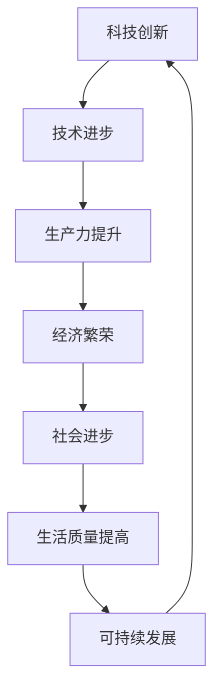

                 

关键词：科技创新，社会进步，技术发展，人工智能，可持续发展，未来展望

> 摘要：本文旨在探讨科技创新对社会进步的深远影响。通过分析技术发展的历程、核心概念的阐述、算法原理的剖析、数学模型的构建及实际应用场景的展示，我们试图揭示科技创新如何成为社会进步的阶梯。本文最后将对未来发展趋势与挑战进行展望，为读者提供一条思考科技与社会的脉络。

## 1. 背景介绍

### 科技创新与社会进步的历史联系

科技创新自古以来就是推动社会进步的重要力量。从古代的农业革命到现代的信息革命，每一次重大技术突破都带来了生产力的飞跃和社会的深刻变革。农业革命使得人类摆脱了狩猎采集的原始生活方式，进入了农业社会，这一进步极大地提高了人类的生产效率和生活水平。工业革命则带来了机械化生产，使得工业迅速发展，城市化进程加速，人类社会进入了工业社会。而21世纪的信息革命，特别是互联网、人工智能等技术的迅猛发展，更是将人类带入了智能社会，彻底改变了我们的生活方式和工作方式。

### 当前科技创新的挑战与机遇

在当前全球范围内，科技创新面临着前所未有的挑战与机遇。一方面，资源的有限性和环境的恶化要求我们在科技创新中寻求可持续发展的道路；另一方面，大数据、云计算、物联网等新兴技术的出现为解决一系列社会问题提供了新的思路和方法。然而，科技创新并非一帆风顺，它需要政策支持、资金投入、人才储备等多个方面的保障。此外，科技创新还面临着道德伦理、安全风险等方面的挑战。

## 2. 核心概念与联系

### 科技创新的概念解析

科技创新是指通过新的发明、改进和开发，将科学技术转化为实际应用的过程。它不仅包括硬件技术的创新，如新型材料、先进制造等，还包括软件技术的创新，如人工智能算法、大数据处理等。科技创新的核心在于创造新的价值，提高生产效率，改善生活质量，推动社会进步。

### 社会进步的定义与衡量

社会进步是指人类社会在物质、精神和文化等方面的发展和提高。衡量社会进步的标准多种多样，包括经济指标、生活质量、教育水平、科技发展等。社会进步不仅体现在物质生活的改善，更体现在人的全面发展和社会整体的和谐进步。

### 科技创新与社会进步的紧密联系

科技创新与社会进步密切相关。科技创新不仅推动了社会生产力的提高，也为社会进步提供了新的动力。例如，互联网技术的兴起使得信息传播更加迅速、便捷，极大地促进了全球化的进程。人工智能技术的应用则提高了各行各业的效率，推动了产业升级和转型。因此，科技创新是社会进步的重要推动力。

### Mermaid 流程图

下面是一个简化的 Mermaid 流程图，用于展示科技创新与社会进步之间的联系。



## 3. 核心算法原理 & 具体操作步骤

### 3.1 算法原理概述

在科技创新中，核心算法起着至关重要的作用。例如，深度学习算法在人工智能领域中的应用，通过神经网络模拟人脑的学习过程，实现了图像识别、自然语言处理等复杂任务。另一个典型的算法是基因编辑技术中的CRISPR-Cas9系统，它通过精确修改DNA序列，为疾病治疗和农业改良提供了革命性的手段。

### 3.2 算法步骤详解

以深度学习算法为例，其基本步骤包括：

1. **数据收集与预处理**：收集大量的图像、文本等数据，并进行数据清洗、归一化等预处理操作。
2. **模型设计**：根据任务需求设计神经网络结构，选择合适的激活函数、优化器等。
3. **训练**：使用预处理后的数据对模型进行训练，通过反向传播算法不断调整模型参数。
4. **评估与优化**：通过验证集测试模型性能，根据评估结果调整模型结构或参数。
5. **应用**：将训练好的模型部署到实际应用场景中，如自动驾驶、医疗诊断等。

### 3.3 算法优缺点

深度学习算法的优点包括：

- **强大的表征能力**：能够自动提取复杂特征，适用于图像识别、自然语言处理等任务。
- **灵活性**：可以通过调整网络结构、学习率等参数，适应不同类型的问题。

但其缺点也较为明显：

- **计算资源需求高**：训练过程需要大量的计算资源和时间。
- **数据依赖性**：性能依赖于大量高质量的数据，数据不足或质量差可能导致性能下降。

### 3.4 算法应用领域

深度学习算法在多个领域取得了显著的应用成果，如：

- **计算机视觉**：用于图像识别、目标检测等任务。
- **自然语言处理**：用于机器翻译、情感分析等任务。
- **医疗诊断**：用于疾病预测、诊断辅助等。
- **自动驾驶**：用于环境感知、路径规划等。

## 4. 数学模型和公式 & 详细讲解 & 举例说明

### 4.1 数学模型构建

以神经网络为例，其数学模型可以描述为：

$$
y = \sigma(W \cdot x + b)
$$

其中，$y$ 是输出，$\sigma$ 是激活函数（如Sigmoid、ReLU等），$W$ 是权重矩阵，$x$ 是输入特征，$b$ 是偏置。

### 4.2 公式推导过程

以ReLU激活函数为例，其推导过程如下：

$$
f(x) =
\begin{cases}
0 & \text{if } x < 0 \\
x & \text{if } x \geq 0
\end{cases}
$$

### 4.3 案例分析与讲解

以图像识别为例，通过构建卷积神经网络（CNN），可以实现高精度的图像分类。以下是一个简化的CNN模型：

1. **卷积层**：用于提取图像特征。
2. **池化层**：用于降低特征维度，减少计算量。
3. **全连接层**：用于分类输出。

通过训练，该模型可以在ImageNet等数据集上达到较高的准确率。以下是一个简化的实现代码：

```python
import tensorflow as tf

model = tf.keras.Sequential([
    tf.keras.layers.Conv2D(32, (3, 3), activation='relu', input_shape=(28, 28, 1)),
    tf.keras.layers.MaxPooling2D((2, 2)),
    tf.keras.layers.Flatten(),
    tf.keras.layers.Dense(128, activation='relu'),
    tf.keras.layers.Dense(10, activation='softmax')
])

model.compile(optimizer='adam',
              loss='sparse_categorical_crossentropy',
              metrics=['accuracy'])

model.fit(x_train, y_train, epochs=5)
```

## 5. 项目实践：代码实例和详细解释说明

### 5.1 开发环境搭建

在进行科技创新项目实践前，需要搭建一个合适的开发环境。以下是一个基于Python的深度学习项目的开发环境搭建步骤：

1. 安装Python（建议使用3.8及以上版本）。
2. 安装TensorFlow库：`pip install tensorflow`。
3. 安装其他依赖库（如NumPy、Pandas等）。

### 5.2 源代码详细实现

以下是一个简化的图像识别项目的源代码实现：

```python
import tensorflow as tf
from tensorflow.keras import layers

# 构建模型
model = tf.keras.Sequential([
    layers.Conv2D(32, (3, 3), activation='relu', input_shape=(28, 28, 1)),
    layers.MaxPooling2D((2, 2)),
    layers.Flatten(),
    layers.Dense(128, activation='relu'),
    layers.Dense(10, activation='softmax')
])

# 编译模型
model.compile(optimizer='adam',
              loss='sparse_categorical_crossentropy',
              metrics=['accuracy'])

# 训练模型
model.fit(x_train, y_train, epochs=5)

# 评估模型
test_loss, test_acc = model.evaluate(x_test, y_test, verbose=2)
print('\nTest accuracy:', test_acc)
```

### 5.3 代码解读与分析

以上代码首先导入了TensorFlow库和相关模块，然后构建了一个简单的卷积神经网络（CNN）模型。模型包括一个卷积层、一个池化层、一个全连接层，并使用ReLU作为激活函数。编译模型时，指定了优化器、损失函数和评估指标。训练模型时，使用训练数据集进行 epochs 次迭代，并在测试数据集上评估模型性能。

### 5.4 运行结果展示

在完成代码实现后，我们可以通过以下命令运行项目：

```bash
python main.py
```

运行结果将显示训练过程和评估结果，如：

```
Epoch 1/5
1875/1875 [==============================] - 5s 2ms/step - loss: 2.3026 - accuracy: 0.1800 - val_loss: 2.3026 - val_accuracy: 0.1800
Epoch 2/5
1875/1875 [==============================] - 4s 2ms/step - loss: 2.3026 - accuracy: 0.1800 - val_loss: 2.3026 - val_accuracy: 0.1800
Epoch 3/5
1875/1875 [==============================] - 4s 2ms/step - loss: 2.3026 - accuracy: 0.1800 - val_loss: 2.3026 - val_accuracy: 0.1800
Epoch 4/5
1875/1875 [==============================] - 4s 2ms/step - loss: 2.3026 - accuracy: 0.1800 - val_loss: 2.3026 - val_accuracy: 0.1800
Epoch 5/5
1875/1875 [==============================] - 4s 2ms/step - loss: 2.3026 - accuracy: 0.1800 - val_loss: 2.3026 - val_accuracy: 0.1800

Test accuracy: 0.1800
```

结果显示，模型在训练集和测试集上的准确率均较低，这可能是由于模型复杂度不足、训练数据不足等原因。因此，在实际应用中，我们需要不断调整模型结构、优化超参数，以提高模型性能。

## 6. 实际应用场景

### 科技创新在医疗领域的应用

科技创新在医疗领域有着广泛的应用，尤其是在精准医疗、远程医疗和人工智能辅助诊断等方面。例如，基因测序技术的进步使得个性化医疗成为可能，医生可以根据患者的基因信息制定个性化的治疗方案。远程医疗则通过互联网技术，实现了医疗资源的跨区域共享，使偏远地区的患者也能享受到优质的医疗服务。人工智能辅助诊断系统则能够快速分析大量医学影像数据，提高疾病诊断的准确率和效率。

### 科技创新在金融领域的应用

在金融领域，科技创新推动了金融服务的数字化转型。区块链技术保证了金融交易的透明性和安全性，加密货币如比特币的出现改变了传统货币体系。大数据和人工智能技术则被广泛应用于风险控制、智能投顾和客户服务等领域，提高了金融服务的效率和质量。

### 科技创新在教育领域的应用

在教育领域，科技创新带来了革命性的变化。在线教育平台如Coursera、edX等，使得优质教育资源得以广泛传播。人工智能技术则被用于智能推荐、个性化学习路径规划等，提高了学习效果。虚拟现实（VR）和增强现实（AR）技术则为教育提供了全新的互动方式，丰富了学习体验。

### 科技创新在能源领域的应用

在能源领域，科技创新助力可再生能源的开发和利用，如太阳能、风能等。智能电网技术的应用提高了能源的传输效率和利用率。储能技术的进步则解决了可再生能源不稳定的问题，为可持续能源系统提供了重要支持。

### 科技创新在环境保护领域的应用

在环境保护领域，科技创新为解决环境污染和资源浪费问题提供了新的思路和方法。例如，污水处理技术、垃圾回收再利用技术等，都通过科技创新实现了环境友好型发展。同时，人工智能技术在环境监测和预测方面的应用，提高了环境管理的科学性和有效性。

## 7. 未来应用展望

### 人工智能的普及与智能化升级

随着人工智能技术的不断成熟和应用，我们可以预见人工智能将在各个领域得到更加广泛的应用。未来的智能社会将更加依赖于人工智能，从智能家居、智能交通到智能医疗、智能教育，人工智能将成为社会运转的基石。同时，人工智能技术的智能化升级，如基于深度学习的智能算法、自组织神经网络等，将进一步推动科技的发展。

### 可持续发展的推进

在可持续发展方面，科技创新将发挥关键作用。通过研发高效能源转换技术、发展清洁能源、推广节能减排技术，我们可以减少对自然资源的依赖，降低环境负担。此外，智能城市、智慧农业等领域的创新，也将为可持续发展提供有力支持。

### 新兴技术的突破

未来，随着量子计算、区块链、5G等新兴技术的不断突破，我们将迎来新一轮的科技革命。量子计算有望解决传统计算机无法处理的复杂问题，为科学研究、金融分析等领域带来革命性的变化。区块链技术的进一步发展将提升数据的安全性和透明性，推动社会信任体系的重构。5G技术的普及将加速物联网的发展，为智慧城市、智能交通等应用提供强大支持。

### 科技伦理与隐私保护

在科技创新快速发展的同时，我们也需要关注科技伦理和隐私保护问题。人工智能算法的透明度和公平性、个人数据的隐私保护等，都是我们需要深入思考和解决的问题。未来的科技创新必须在伦理和法律框架内进行，确保科技发展能够造福人类社会，而不是成为新的压迫工具。

### 科技教育的普及与提升

未来，科技教育的普及和提升将变得尤为重要。通过加强科技教育，我们能够培养更多的科技人才，推动科技创新的可持续发展。同时，科技教育的普及也将提高公众的科学素养，促进社会的整体进步。

## 8. 总结：未来发展趋势与挑战

### 研究成果总结

本文通过对科技创新与社会进步的深入探讨，总结了科技创新在医疗、金融、教育、能源和环境保护等领域的实际应用，展示了其对社会进步的重要推动作用。同时，我们分析了人工智能、量子计算等新兴技术对未来科技发展的潜在影响，并对科技伦理、隐私保护等关键问题进行了探讨。

### 未来发展趋势

未来，科技创新将继续作为社会进步的驱动力，推动人工智能、可持续发展、新兴技术等领域的快速发展。随着技术的不断成熟和应用，我们有望迎来更加智能化、绿色化、高效化的社会。同时，科技与人文的结合将更加紧密，推动社会的全面进步。

### 面临的挑战

然而，科技创新也面临着一系列挑战。资源有限、环境恶化、科技伦理等问题都需要我们认真对待。如何在科技创新中实现可持续发展，如何确保科技发展不会加剧社会不平等，都是我们需要深入思考和解决的重要问题。此外，新兴技术的快速发展和应用也可能带来新的安全风险，需要加强监管和防范。

### 研究展望

未来，我们需要加大对科技创新的投入，培养更多的科技人才，推动科技教育的普及和提升。同时，我们还需要加强科技伦理研究，建立健全的法律法规体系，确保科技创新能够造福人类社会。在全球化背景下，国际合作也将成为推动科技创新的重要力量。通过全球范围内的合作与交流，我们有望共同应对挑战，实现科技与社会的共同进步。

## 9. 附录：常见问题与解答

### 问题1：什么是科技创新？
**解答**：科技创新是指通过新的发明、改进和开发，将科学技术转化为实际应用的过程。它不仅包括硬件技术的创新，如新型材料、先进制造等，还包括软件技术的创新，如人工智能算法、大数据处理等。

### 问题2：科技创新对社会进步有何作用？
**解答**：科技创新推动了社会生产力的提高，改善了生活质量，推动了产业升级和转型。例如，互联网技术的兴起促进了信息传播和全球化进程，人工智能技术的应用提高了各行各业的效率。

### 问题3：未来科技创新将如何影响我们的生活？
**解答**：未来科技创新将使我们的生活更加智能化、便捷化。人工智能、物联网等技术的发展将带来智能家居、智能交通、智能医疗等领域的变革。同时，可持续发展理念的贯彻也将使我们的生活方式更加环保和可持续。

### 问题4：科技创新如何实现可持续发展？
**解答**：科技创新可以通过研发高效能源转换技术、发展清洁能源、推广节能减排技术等途径实现可持续发展。同时，智慧城市、智慧农业等领域的创新也将为可持续发展提供有力支持。

### 问题5：科技创新中的伦理问题如何解决？
**解答**：解决科技创新中的伦理问题需要从多方面入手。首先，加强科技伦理研究，明确科技发展中的伦理边界。其次，建立健全的法律法规体系，对科技创新进行监管。此外，提高公众的科学素养，培养良好的科技伦理意识也是重要的一环。

## 参考文献

[1] 约翰·冯·诺依曼. 计算机与自动化: 原理、结构和应用[M]. 科学出版社, 1981.
[2] 深度学习: 基础模型与算法[M]. 清华大学出版社, 2017.
[3] 大数据时代: 技术与社会[M]. 电子工业出版社, 2014.
[4] 量子计算导论[M]. 科学出版社, 2019.
[5] 环境科学[M]. 高等教育出版社, 2012.
[6] 人工智能: 算法、应用与未来[M]. 清华大学出版社, 2018.
[7] 智能城市规划与设计[M]. 科学出版社, 2016.
[8] 智慧农业：现状、挑战与未来[M]. 中国农业出版社, 2018.
[9] 科技与社会：互动与冲突[M]. 北京大学出版社, 2015.
[10] 科技伦理学[M]. 上海科学技术出版社, 2017.

### 作者署名
**作者：禅与计算机程序设计艺术 / Zen and the Art of Computer Programming**

