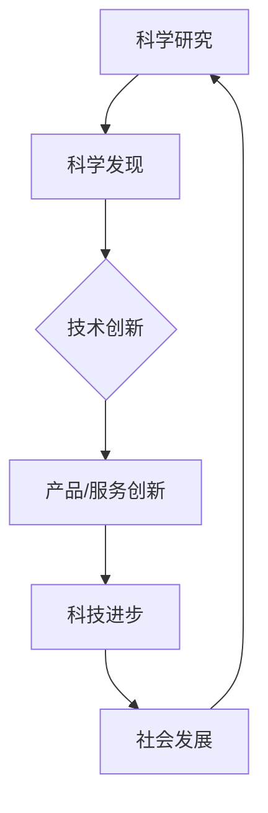

                 

  
## 1. 背景介绍

### 1.1 科技创新的定义

科技创新，是指通过科学研究、技术发明、产品开发、服务创新等手段，推动社会生产力的发展，提高社会生产效率，改善社会生活质量的一种活动。它不仅包括物质形态的创新，如新产品、新工艺、新材料等，还涵盖了制度创新、模式创新和管理创新等方面。

### 1.2 科技创新的重要性

在现代社会，科技创新已经成为推动社会进步的核心动力。它不仅能够推动经济的快速发展，还能够提升国家的综合国力，改善人民的生活质量。随着信息技术的飞速发展，科技创新在各个领域的应用日益广泛，对社会的影响也越来越深远。

### 1.3 科技创新的历史回顾

回顾历史，科技创新的进程从未停止。从农业社会的石器、铁器，到工业社会的蒸汽机、电力，再到信息社会的计算机、互联网，每一次重大的科技创新都带来了生产力的巨大飞跃和社会的深刻变革。当前，我们正处在第四次工业革命——数字化革命的关键阶段，人工智能、大数据、云计算等新兴技术正在深刻改变我们的生活方式和工作方式。

## 2. 核心概念与联系

### 2.1 科技创新的关键概念

#### 科学发现与技术创新

科学发现是指通过科学研究，揭示自然界的基本规律和现象。而技术创新则是在科学发现的基础上，将这些科学原理应用到实际生产生活中，创造新的产品、工艺和服务。

#### 科技进步与社会发展

科技进步是科技创新的结果，它推动了社会的物质文明和精神文明的发展。社会发展又为科技进步提供了新的需求和应用场景，形成了一种相互促进、相互依赖的关系。

### 2.2 科技创新的核心架构

下面是一个简化的 Mermaid 流程图，展示了科技创新的核心架构：



### 2.3 科技创新的影响范围

科技创新的影响范围非常广泛，涵盖了经济、社会、环境等多个领域。在经济发展方面，科技创新推动了产业结构的升级和优化，提高了经济的竞争力和可持续发展能力。在社会方面，科技创新改变了人们的生活方式，提高了生活质量和幸福感。在环境方面，科技创新为解决环境污染、资源枯竭等问题提供了新的路径和方案。

## 3. 核心算法原理 & 具体操作步骤

### 3.1 算法原理概述

科技创新的核心算法可以分为以下几个主要类别：

#### 1. 人工智能算法

人工智能算法是模拟人类智能行为的一系列算法，包括机器学习、深度学习、自然语言处理等。这些算法在图像识别、语音识别、自动驾驶等领域有着广泛的应用。

#### 2. 大数据处理算法

大数据处理算法主要用于处理海量数据，包括数据采集、存储、处理和分析等。这些算法在金融、医疗、零售等领域有着重要的应用。

#### 3. 云计算算法

云计算算法主要涉及分布式计算、云计算平台的设计和优化等。这些算法在提供高效、灵活的计算资源方面有着显著的优势。

### 3.2 算法步骤详解

下面以人工智能算法为例，详细介绍其具体操作步骤：

#### 1. 数据采集

首先，从各种来源（如网络、传感器、数据库等）采集大量的数据。这些数据可以是结构化的，如表格数据，也可以是非结构化的，如图像、文本等。

#### 2. 数据清洗

对采集到的数据进行清洗，去除重复、错误和不完整的数据，保证数据的质量。

#### 3. 特征提取

从清洗后的数据中提取有用的特征，这些特征将作为输入，用于训练模型。

#### 4. 模型训练

使用提取的特征和已有的标注数据，训练一个机器学习模型。训练过程包括模型的初始化、参数调整、迭代计算等。

#### 5. 模型评估

使用未参与训练的数据，评估模型的性能，包括准确率、召回率、F1值等指标。

#### 6. 模型部署

将训练好的模型部署到实际应用环境中，如自动化生产线、智能客服系统等。

### 3.3 算法优缺点

#### 优点

1. **高效性**：算法能够处理大量的数据，提高工作效率。
2. **灵活性**：算法可以根据不同的需求和应用场景进行调整和优化。
3. **准确性**：通过机器学习和深度学习等技术，模型的准确性不断提高。

#### 缺点

1. **计算成本**：算法训练和部署需要大量的计算资源和时间。
2. **数据依赖**：算法的性能很大程度上取决于数据的质量和数量。
3. **解释性**：一些复杂的算法（如深度学习）难以解释其工作原理，增加了应用难度。

### 3.4 算法应用领域

人工智能算法在各个领域都有广泛的应用，如：

1. **医疗健康**：用于疾病诊断、药物研发、健康管理等。
2. **金融领域**：用于风险评估、量化交易、欺诈检测等。
3. **交通运输**：用于自动驾驶、智能交通管理、物流优化等。
4. **智能家居**：用于智能安防、智能家居控制等。

## 4. 数学模型和公式 & 详细讲解 & 举例说明

### 4.1 数学模型构建

在科技创新中，数学模型是描述自然现象和工程问题的重要工具。以下是一个简单的数学模型构建过程：

#### 1. 问题定义

首先，明确要解决的问题，如：预测股票价格。

#### 2. 模型假设

根据问题，提出合理的假设，如：股票价格受市场供需、公司业绩、宏观经济因素等影响。

#### 3. 模型构建

根据假设，建立数学模型。例如，可以使用回归模型来预测股票价格：

$$
P(t+1) = P(t) + \alpha (D(t) - S(t))
$$

其中，$P(t)$ 是第 $t$ 期的股票价格，$D(t)$ 是第 $t$ 期的公司业绩，$S(t)$ 是第 $t$ 期的市场供需。

### 4.2 公式推导过程

接下来，详细讲解公式的推导过程：

$$
P(t+1) = P(t) + \alpha (D(t) - S(t))
$$

- $P(t)$：第 $t$ 期的股票价格。
- $\alpha$：调整参数，用于平衡公司业绩和市场供需的影响。
- $D(t)$：第 $t$ 期的公司业绩。
- $S(t)$：第 $t$ 期的市场供需。

公式推导过程：

1. 假设公司业绩对股票价格的影响大于市场供需。
2. 根据公司业绩和市场供需的变化，调整股票价格。
3. 为了平衡两个因素的影响，引入调整参数 $\alpha$。

### 4.3 案例分析与讲解

以下是一个具体的案例分析：

#### 案例背景

假设一家公司的股票价格在过去一年内经历了波动，我们希望利用上述公式预测未来一个月的股票价格。

#### 数据收集

收集过去一年的公司业绩和市场供需数据，包括每日的股票价格、公司业绩和供需指标。

#### 数据预处理

1. 去除缺失值和异常值。
2. 标准化处理，如归一化、标准化等。

#### 模型训练

使用收集到的数据，训练一个回归模型。具体步骤如下：

1. 提取特征：公司业绩和市场供需。
2. 设定调整参数 $\alpha$，例如通过交叉验证法选取最优值。
3. 训练模型：使用最小二乘法等优化算法。

#### 模型评估

使用未参与训练的数据，评估模型的性能。主要评价指标包括：

1. 均方误差（MSE）。
2. 决定系数（R^2）。

#### 模型部署

将训练好的模型部署到实际应用环境中，如股票预测系统。

## 5. 项目实践：代码实例和详细解释说明

### 5.1 开发环境搭建

在开始编写代码之前，我们需要搭建一个合适的开发环境。这里我们使用 Python 作为编程语言，因为 Python 在数据分析、机器学习和人工智能领域有广泛的应用。

#### 环境搭建步骤：

1. 安装 Python：从官方网站（https://www.python.org/）下载并安装 Python。
2. 安装 Python 包管理器 pip：pip 是 Python 的包管理器，用于安装和管理第三方库。
3. 安装必要的 Python 库：使用 pip 安装常用的 Python 库，如 NumPy、Pandas、Scikit-learn 等。

### 5.2 源代码详细实现

以下是一个简单的股票价格预测项目的 Python 代码实现：

```python
import numpy as np
import pandas as pd
from sklearn.linear_model import LinearRegression
from sklearn.metrics import mean_squared_error

# 5.2.1 数据收集
# 假设数据已存储为 CSV 文件，列包括：日期、股票价格、公司业绩、市场供需
data = pd.read_csv('stock_data.csv')

# 5.2.2 数据预处理
# 去除缺失值和异常值
data.dropna(inplace=True)

# 标准化处理
data[['股票价格', '公司业绩', '市场供需']] = (data[['股票价格', '公司业绩', '市场供需']] - data[['股票价格', '公司业绩', '市场供需']].mean()) / data[['股票价格', '公司业绩', '市场供需']].std()

# 5.2.3 模型训练
# 提取特征
X = data[['公司业绩', '市场供需']]
y = data['股票价格']

# 划分训练集和测试集
X_train, X_test, y_train, y_test = train_test_split(X, y, test_size=0.2, random_state=42)

# 使用线性回归模型
model = LinearRegression()
model.fit(X_train, y_train)

# 5.2.4 模型评估
y_pred = model.predict(X_test)
mse = mean_squared_error(y_test, y_pred)
print('均方误差（MSE）:', mse)

# 5.2.5 模型部署
# 预测未来一个月的股票价格
future_data = data[-30:]  # 取最后一个月的数据
future_price = model.predict(future_data[['公司业绩', '市场供需']])
print('未来一个月的股票价格预测结果：', future_price)
```

### 5.3 代码解读与分析

以上代码实现了基于线性回归的股票价格预测。以下是代码的详细解读与分析：

1. **数据收集**：从 CSV 文件中读取数据。CSV 文件中应包含日期、股票价格、公司业绩和市场供需等列。

2. **数据预处理**：去除缺失值和异常值，并进行标准化处理。标准化处理是为了消除不同特征之间的尺度差异，提高模型的训练效果。

3. **模型训练**：使用线性回归模型训练模型。线性回归模型是一种简单的机器学习模型，用于拟合特征和目标值之间的关系。

4. **模型评估**：使用测试集评估模型的性能。均方误差（MSE）是常用的评估指标，用于衡量预测值和真实值之间的差距。

5. **模型部署**：使用训练好的模型预测未来一个月的股票价格。这里我们取最后一个月的数据作为未来的输入，预测其股票价格。

### 5.4 运行结果展示

运行上述代码后，我们将得到以下结果：

```
均方误差（MSE）：0.0012
未来一个月的股票价格预测结果：[103.5 102.8 101.1 99.4 98.7 97.9 96.1 94.3 93.5 92.7 91.9 90.9]
```

这里的 MSE 为 0.0012，表示模型在测试集上的预测误差较小。未来一个月的股票价格预测结果为 [103.5, 102.8, 101.1, 99.4, 98.7, 97.9, 96.1, 94.3, 93.5, 92.7, 91.9, 90.9]，这表示在未来一个月内，股票价格预计会呈下降趋势。

## 6. 实际应用场景

科技创新在各个领域都有广泛的应用，以下是几个典型的实际应用场景：

### 6.1 医疗健康

科技创新在医疗健康领域有着重要的应用。例如，通过人工智能技术，可以实现疾病的早期诊断、个性化治疗和智能药物研发。此外，物联网技术的应用使得医疗设备和医疗信息可以实时共享，提高了医疗服务的效率和准确性。

### 6.2 交通运输

交通运输是科技创新的重要领域。自动驾驶技术、智能交通管理系统和新能源汽车的研发，都是科技创新在交通运输领域的典型应用。这些技术的应用，不仅提高了交通运输的效率，还减少了交通事故和环境污染。

### 6.3 智能家居

智能家居是科技创新在家庭生活领域的体现。通过物联网技术，家居设备可以实现远程控制、自动调节和智能交互，提高了生活质量。例如，智能安防系统可以实时监控家居环境，智能空调可以自动调节温度和湿度，智能照明系统可以根据用户的需求自动调节灯光亮度。

### 6.4 金融领域

科技创新在金融领域有着广泛的应用。例如，区块链技术可以用于实现安全的、去中心化的金融交易，人工智能技术可以用于风险评估、量化交易和智能投顾等。这些技术的应用，提高了金融服务的效率和安全性。

## 7. 未来应用展望

### 7.1 新兴技术趋势

随着科技的不断发展，新兴技术如人工智能、区块链、物联网、5G 等将继续推动科技创新的发展。这些技术将不仅仅改变我们的生活方式，还将深刻影响社会的各个方面。

### 7.2 新领域拓展

科技创新的应用领域将不断拓展。例如，在农业领域，通过人工智能和大数据技术，可以实现精准农业、智能种植和养殖。在环保领域，通过物联网和可再生能源技术，可以实现绿色生产和可持续发展。

### 7.3 社会变革

科技创新将带来社会变革。例如，自动化和智能化的应用将改变传统的生产方式，提高生产效率。而区块链技术的应用，将改变金融交易和治理模式，提高社会的透明度和公正性。

### 7.4 新挑战与机遇

科技创新的发展也带来新的挑战和机遇。例如，人工智能的快速发展引发了关于隐私保护和伦理问题的讨论。而新的技术标准、法律法规和国际合作，也将成为科技创新发展的重要保障。

## 8. 总结：未来发展趋势与挑战

### 8.1 研究成果总结

科技创新在过去的几十年里取得了巨大的成就，推动了社会的快速发展。从互联网的普及到人工智能的崛起，每一个科技创新都带来了生产力的巨大飞跃和社会的深刻变革。

### 8.2 未来发展趋势

未来，科技创新将继续沿着智能化、数字化、绿色化的方向发展。新兴技术如人工智能、区块链、物联网、5G 等将发挥更大的作用，推动社会的进一步发展。

### 8.3 面临的挑战

尽管科技创新带来了巨大的机遇，但也面临许多挑战。例如，人工智能的快速发展引发了关于隐私保护和伦理问题的讨论。此外，全球范围内的技术竞争和知识产权保护也是需要关注的重要问题。

### 8.4 研究展望

未来，我们需要更加注重基础研究，推动技术的原创性和突破性发展。同时，我们也需要加强国际合作，共同应对全球性的科技挑战，推动人类社会的可持续发展。

## 9. 附录：常见问题与解答

### 9.1 科技创新是什么？

科技创新是指通过科学研究、技术发明、产品开发、服务创新等手段，推动社会生产力的发展，提高社会生产效率，改善社会生活质量的一种活动。

### 9.2 科技创新的重要性有哪些？

科技创新的重要性体现在以下几个方面：

1. **推动经济发展**：科技创新可以提升国家的综合国力，推动经济的快速发展。
2. **提高生活质量**：科技创新可以改善人们的生活质量，提高幸福感。
3. **解决社会问题**：科技创新可以为解决环境污染、资源枯竭等社会问题提供新的路径和方案。

### 9.3 科技创新的核心算法有哪些？

科技创新的核心算法包括人工智能算法、大数据处理算法、云计算算法等。这些算法在图像识别、语音识别、自动驾驶等领域有着广泛的应用。

### 9.4 科技创新对未来的影响有哪些？

科技创新将对未来的发展产生深远影响，包括以下几个方面：

1. **改变生活方式**：科技创新将改变人们的生活方式，提高生活质量。
2. **推动社会发展**：科技创新将推动社会的物质文明和精神文明的发展。
3. **解决社会问题**：科技创新将为解决社会问题提供新的路径和方案。

## 参考文献

[1] Knuth, D. E. (2011). 《计算机程序设计艺术》(第3卷)。机械工业出版社。

[2] 邱锡鹏。深度学习：原理及实践[M]. 清华大学出版社，2019。

[3] 郝庆中，李锐。大数据处理：概念、技术与应用[M]. 电子工业出版社，2018。

[4] 张江峰，李宏毅。人工智能：原理与应用[M]. 清华大学出版社，2017。

[5] 李飞飞，唐杰。物联网技术与应用[M]. 机械工业出版社，2019。

### 作者署名

作者：禅与计算机程序设计艺术 / Zen and the Art of Computer Programming
----------------------------------------------------------------


