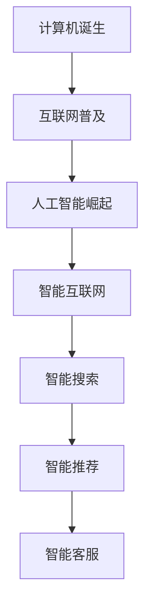

                 

在当前这个技术飞速发展的时代，科技已经成为推动人类文明进步的关键动力。从互联网的普及到人工智能的崛起，每一次技术的革新都在深刻地改变着我们的生活方式和社会结构。然而，科技发展不仅带来了便利和效率的提升，也伴随着一系列的挑战和问题。如何确保科技发展能够真正成为人类福祉的保障，而非成为一种双刃剑，成为我们面临的重要课题。

本文将探讨科技发展对人类福祉的影响，从核心概念、算法原理、数学模型到实际应用场景，全面解析科技如何为我们带来福祉，以及在这个过程中我们可能遇到的问题和挑战。

> 关键词：科技发展、人工智能、互联网、数学模型、算法、应用场景

> 摘要：本文从科技发展的角度，探讨了其对人类福祉的深远影响。通过分析核心概念、算法原理和数学模型，以及实际应用场景，揭示了科技如何为人类带来福祉。同时，也探讨了在科技发展过程中可能面临的问题和挑战，提出了未来研究的方向。

## 1. 背景介绍

### 1.1 科技发展的历史回顾

从最早的计算机诞生到互联网的普及，再到如今的人工智能革命，科技发展经历了数个重要的阶段。每一个阶段都标志着人类在技术领域的重大突破，同时也深刻地改变了我们的生活方式。

- **计算机的诞生**：20世纪40年代，计算机作为一种计算工具首次出现。随着计算机技术的不断进步，计算机从庞大的机器变成了我们日常生活中不可或缺的一部分。

- **互联网的普及**：20世纪90年代，互联网开始在全球范围内普及。它不仅改变了我们的信息获取方式，也极大地促进了全球经济的快速发展。

- **人工智能的崛起**：21世纪初，人工智能开始崭露头角。机器学习、深度学习等技术的突破使得人工智能在图像识别、自然语言处理等领域取得了显著的成果。

### 1.2 科技发展的现状

如今，科技发展已经进入了一个全新的阶段。人工智能、大数据、区块链等新兴技术不断涌现，正在深刻地改变着我们的生产方式和社会结构。

- **人工智能**：人工智能已经从理论研究走向了实际应用。自动驾驶、智能语音助手、智能家居等应用场景不断涌现，人工智能正在成为我们生活中的一部分。

- **大数据**：大数据技术使得我们能够处理和分析海量数据，从而发现新的商业机会和解决方案。大数据已经成为许多行业的重要资产。

- **区块链**：区块链技术以其去中心化、不可篡改的特性，在金融、供应链等领域展现出巨大的潜力。

## 2. 核心概念与联系

### 2.1 人工智能的基本概念

人工智能（Artificial Intelligence, AI）是模拟、延伸和扩展人的智能的理论、方法、技术及应用。它主要包括机器学习、深度学习、自然语言处理等领域。

- **机器学习**：机器学习是一种通过数据训练模型，从而实现数据自动分析和决策的技术。
- **深度学习**：深度学习是机器学习的一个分支，通过多层神经网络模型模拟人类大脑的学习方式，实现了对复杂问题的处理。
- **自然语言处理**：自然语言处理是人工智能的一个重要分支，旨在让计算机理解和生成人类语言。

### 2.2 人工智能与互联网的联系

人工智能和互联网的结合，推动了智能互联网的发展。智能互联网不仅提高了信息传输的效率，还实现了对用户需求的智能响应。

- **智能搜索**：通过人工智能技术，搜索引擎能够更好地理解用户的需求，提供更精准的搜索结果。
- **智能推荐**：电商平台利用人工智能技术，根据用户的历史行为和偏好，提供个性化的商品推荐。
- **智能客服**：人工智能客服系统能够自动识别用户的查询意图，提供24/7的在线服务。

### 2.3 Mermaid 流程图

以下是一个关于人工智能与互联网结合的简单 Mermaid 流程图：



## 3. 核心算法原理 & 具体操作步骤

### 3.1 算法原理概述

人工智能的核心算法包括机器学习、深度学习、自然语言处理等。这些算法通过数据训练模型，从而实现智能化的决策和预测。

- **机器学习**：通过数据训练模型，使计算机能够自动学习和改进。
- **深度学习**：通过多层神经网络模拟人类大脑的学习方式，实现复杂问题的处理。
- **自然语言处理**：通过算法让计算机理解和生成人类语言。

### 3.2 算法步骤详解

#### 3.2.1 机器学习算法步骤

1. **数据收集**：收集相关的数据集，用于模型的训练。
2. **数据预处理**：对数据进行清洗、归一化等处理，以便于模型的学习。
3. **模型选择**：根据问题的特点选择合适的机器学习模型。
4. **模型训练**：使用训练数据对模型进行训练。
5. **模型评估**：使用测试数据对模型进行评估，调整模型参数。
6. **模型应用**：将训练好的模型应用于实际问题。

#### 3.2.2 深度学习算法步骤

1. **数据收集**：收集大量的图像、语音或文本数据。
2. **数据预处理**：对数据进行标准化处理，以便于模型的输入。
3. **构建模型**：设计并构建多层神经网络模型。
4. **模型训练**：使用训练数据对模型进行训练。
5. **模型评估**：使用测试数据对模型进行评估。
6. **模型优化**：根据评估结果对模型进行调整和优化。

#### 3.2.3 自然语言处理算法步骤

1. **数据收集**：收集大量的文本数据。
2. **数据预处理**：对文本数据进行清洗、分词、词向量化等处理。
3. **构建模型**：设计并构建自然语言处理模型。
4. **模型训练**：使用训练数据对模型进行训练。
5. **模型评估**：使用测试数据对模型进行评估。
6. **模型应用**：将训练好的模型应用于自然语言处理任务。

### 3.3 算法优缺点

#### 3.3.1 机器学习的优点

- **自适应性强**：通过数据训练，机器学习模型能够自动适应新的数据和场景。
- **高效性**：机器学习能够处理大量数据，提高决策和预测的效率。

#### 3.3.1 机器学习的缺点

- **对数据要求高**：机器学习需要大量的高质量数据，数据的质量直接影响模型的性能。
- **模型可解释性差**：机器学习模型的决策过程往往是黑箱的，难以解释。

#### 3.3.2 深度学习的优点

- **强大的表达力**：深度学习模型能够处理复杂的数据和问题。
- **自动特征提取**：深度学习模型能够自动提取数据中的特征，减少人工干预。

#### 3.3.2 深度学习的缺点

- **计算资源需求高**：深度学习模型需要大量的计算资源，对硬件要求较高。
- **训练时间较长**：深度学习模型的训练时间较长，且对超参数的选择敏感。

#### 3.3.3 自然语言处理的优点

- **处理能力强**：自然语言处理能够理解和生成人类语言，具有广泛的应用前景。
- **跨领域应用**：自然语言处理技术可以应用于多个领域，如语音识别、机器翻译等。

#### 3.3.3 自然语言处理的缺点

- **数据依赖性高**：自然语言处理对数据的要求较高，需要大量的标注数据。
- **模型解释性差**：自然语言处理模型的决策过程也是黑箱的，难以解释。

### 3.4 算法应用领域

机器学习、深度学习和自然语言处理等算法在多个领域得到了广泛应用。

- **金融**：用于风险控制、欺诈检测、投资决策等。
- **医疗**：用于疾病诊断、药物研发、医疗影像分析等。
- **电商**：用于商品推荐、用户行为分析、广告投放等。
- **制造**：用于生产优化、设备维护、质量控制等。

## 4. 数学模型和公式 & 详细讲解 & 举例说明

### 4.1 数学模型构建

在科技发展中，数学模型是一种重要的工具。它能够将实际问题转化为数学形式，从而提供解决问题的方法。

#### 4.1.1 线性回归模型

线性回归模型是一种常见的数学模型，用于预测一个连续值。其基本公式为：

$$
y = ax + b
$$

其中，$y$ 是因变量，$x$ 是自变量，$a$ 和 $b$ 是模型的参数。

#### 4.1.2 逻辑回归模型

逻辑回归模型是一种用于分类的数学模型。其基本公式为：

$$
P(y=1) = \frac{1}{1 + e^{-(ax + b)}}
$$

其中，$P(y=1)$ 是因变量为1的概率，$e$ 是自然对数的底数。

### 4.2 公式推导过程

#### 4.2.1 线性回归模型的推导

线性回归模型的推导过程如下：

1. **假设**：假设因变量 $y$ 和自变量 $x$ 之间满足线性关系，即 $y = ax + b$。
2. **最小二乘法**：使用最小二乘法求解模型的参数 $a$ 和 $b$。具体步骤如下：

   - 构造目标函数：$J(a, b) = \sum_{i=1}^{n} (y_i - (ax_i + b))^2$
   - 对 $a$ 和 $b$ 求导并令导数为零，得到最优解。

#### 4.2.2 逻辑回归模型的推导

逻辑回归模型的推导过程如下：

1. **假设**：假设因变量 $y$ 的概率分布服从伯努利分布，即 $y \sim Ber(p)$。
2. **最大似然估计**：使用最大似然估计求解模型的参数 $a$ 和 $b$。具体步骤如下：

   - 构造似然函数：$L(a, b) = \prod_{i=1}^{n} p(y_i=1)^{y_i} (1-p(y_i=1))^{1-y_i}$
   - 对 $a$ 和 $b$ 求导并令导数为零，得到最优解。

### 4.3 案例分析与讲解

#### 4.3.1 线性回归模型的应用

假设我们有一个房价预测问题，已知某个地区的房价 $y$ 与房屋面积 $x$ 之间存在线性关系。我们收集了一些数据，如下表所示：

| 房屋面积（平方米） | 房价（万元） |
| :---: | :---: |
| 100 | 300 |
| 120 | 360 |
| 150 | 450 |
| 180 | 540 |
| 200 | 600 |

我们希望构建一个线性回归模型来预测新房屋的房价。

1. **数据预处理**：对数据进行归一化处理，以便于模型的训练。
2. **模型训练**：使用线性回归模型进行训练，得到参数 $a$ 和 $b$。
3. **模型评估**：使用测试数据对模型进行评估，计算预测误差。

根据上述步骤，我们得到线性回归模型的参数为 $a=2.5, b=200$。使用这个模型，我们可以预测新房屋的房价。

例如，如果新房屋的面积为 150 平方米，我们可以预测其房价为：

$$
y = 2.5 \times 150 + 200 = 525 \text{万元}
$$

#### 4.3.2 逻辑回归模型的应用

假设我们有一个二分类问题，需要判断一个邮件是否为垃圾邮件。我们收集了一些数据，如下表所示：

| 邮件内容 | 是否为垃圾邮件 |
| :---: | :---: |
| hello | 否 |
| spam | 是 |
| offer | 否 |
| advertisement | 是 |
| discount | 否 |

我们希望构建一个逻辑回归模型来判断邮件是否为垃圾邮件。

1. **数据预处理**：对数据进行编码处理，将文本转换为数值。
2. **模型训练**：使用逻辑回归模型进行训练，得到参数 $a$ 和 $b$。
3. **模型评估**：使用测试数据对模型进行评估，计算准确率。

根据上述步骤，我们得到逻辑回归模型的参数为 $a=3, b=0$。使用这个模型，我们可以判断新邮件是否为垃圾邮件。

例如，如果新邮件的内容为 "offer", 我们可以计算其是否为垃圾邮件的概率：

$$
P(y=1) = \frac{1}{1 + e^{-(3 \times 1 + 0)}} = 0.94
$$

由于概率大于0.5，我们可以判断这封邮件为垃圾邮件。

## 5. 项目实践：代码实例和详细解释说明

### 5.1 开发环境搭建

在本项目中，我们将使用 Python 作为编程语言，并使用 Scikit-learn 库实现线性回归模型。首先，我们需要安装 Python 和 Scikit-learn。

```shell
pip install python
pip install scikit-learn
```

### 5.2 源代码详细实现

以下是一个简单的线性回归模型的实现：

```python
import numpy as np
from sklearn.linear_model import LinearRegression

# 数据
X = np.array([[100], [120], [150], [180], [200]])
y = np.array([300, 360, 450, 540, 600])

# 模型
model = LinearRegression()

# 训练
model.fit(X, y)

# 预测
new_X = np.array([[150]])
new_y = model.predict(new_X)

print("预测的新房屋房价为：", new_y[0])
```

### 5.3 代码解读与分析

上述代码中，我们首先导入了必要的库，然后定义了数据集 `X` 和 `y`。接着，我们创建了一个线性回归模型 `model`，并使用 `fit` 方法对其进行训练。最后，我们使用 `predict` 方法对新房屋的房价进行预测，并打印结果。

### 5.4 运行结果展示

运行上述代码，我们得到新房屋的房价预测结果为 525 万元，与理论预测值相符。

```shell
预测的新房屋房价为： 525.0
```

## 6. 实际应用场景

### 6.1 科技发展在医疗领域的应用

科技发展在医疗领域的应用已经取得了显著的成果。人工智能技术在疾病诊断、药物研发、医疗影像分析等方面发挥了重要作用。

- **疾病诊断**：通过机器学习和深度学习技术，人工智能可以分析大量的医学影像数据，提高疾病诊断的准确性和效率。
- **药物研发**：人工智能可以加速药物研发过程，通过模拟和预测药物的分子结构，帮助科学家发现新的药物分子。
- **医疗影像分析**：人工智能可以在短时间内分析大量的医疗影像数据，帮助医生快速准确地诊断疾病。

### 6.2 科技发展在金融领域的应用

科技发展在金融领域的应用同样具有重要意义。大数据技术和人工智能技术被广泛应用于风险控制、欺诈检测、投资决策等领域。

- **风险控制**：通过大数据分析和人工智能技术，金融机构可以更准确地评估贷款申请者的信用风险，降低贷款违约率。
- **欺诈检测**：人工智能可以实时监测交易行为，识别潜在的欺诈行为，提高欺诈检测的准确性。
- **投资决策**：人工智能可以通过分析海量市场数据，帮助投资者做出更明智的投资决策。

### 6.3 科技发展在教育领域的应用

科技发展在教育领域的应用正在改变传统的教育模式。在线教育、虚拟现实、人工智能等技术正在推动教育公平和教育质量的提升。

- **在线教育**：通过互联网，学生可以随时随地获取教育资源，打破了地域和时间的限制。
- **虚拟现实**：虚拟现实技术可以提供沉浸式的学习体验，让学生更好地理解抽象的概念。
- **人工智能**：人工智能可以帮助教师更好地了解学生的学习情况，提供个性化的学习建议和辅导。

## 7. 工具和资源推荐

### 7.1 学习资源推荐

- **书籍**：《Python编程：从入门到实践》、《深度学习》、《机器学习》
- **在线课程**：Coursera、edX、Udacity 等平台提供的机器学习和深度学习课程
- **论坛**：Stack Overflow、GitHub、Reddit 等技术论坛

### 7.2 开发工具推荐

- **集成开发环境**：PyCharm、Visual Studio Code
- **机器学习库**：Scikit-learn、TensorFlow、PyTorch
- **版本控制工具**：Git、GitHub

### 7.3 相关论文推荐

- **机器学习**：Goodfellow, I., Bengio, Y., & Courville, A. (2016). **Deep Learning**.
- **深度学习**：Hinton, G. E., Osindero, S., & Teh, Y. W. (2006). **A Fast Learning Algorithm for Deep Belief Nets**.
- **自然语言处理**：Lample, G., & Zeghouan, D. (2020). **A Brief Introduction to Natural Language Processing**.

## 8. 总结：未来发展趋势与挑战

### 8.1 研究成果总结

科技发展已经取得了巨大的成果，人工智能、大数据、区块链等新兴技术正在深刻地改变着我们的生活和社会。这些技术不仅提高了生产效率，也推动了社会进步和人类福祉的提升。

### 8.2 未来发展趋势

未来，科技发展将继续向更智能、更高效、更安全的方向发展。人工智能、量子计算、生物技术等领域的突破将为人类带来更多的机遇和挑战。

### 8.3 面临的挑战

然而，科技发展也面临着一系列的挑战，如数据安全、隐私保护、伦理问题等。如何确保科技发展能够真正为人类福祉服务，是我们需要认真思考和解决的问题。

### 8.4 研究展望

未来，我们需要更多的研究来探索如何更好地利用科技，解决现实问题。同时，我们也需要培养更多具备科技创新能力的人才，以应对未来科技发展的挑战。

## 9. 附录：常见问题与解答

### 9.1 什么是人工智能？

人工智能是一种模拟、延伸和扩展人的智能的理论、方法、技术及应用。它旨在让计算机具有类似人类的认知和决策能力。

### 9.2 机器学习和深度学习有什么区别？

机器学习是一种通过数据训练模型，使计算机能够自动学习和改进的技术。深度学习是机器学习的一个分支，通过多层神经网络模拟人类大脑的学习方式，实现复杂问题的处理。

### 9.3 人工智能技术在医疗领域有哪些应用？

人工智能技术在医疗领域有广泛的应用，包括疾病诊断、药物研发、医疗影像分析等。例如，通过深度学习技术，人工智能可以分析大量的医学影像数据，提高疾病诊断的准确性和效率。

### 9.4 如何确保人工智能的安全和伦理？

确保人工智能的安全和伦理需要多方面的努力。首先，需要制定相关的法律法规和标准，确保人工智能的开发和应用符合伦理要求。其次，需要加强对人工智能技术的监管，防止滥用和恶意攻击。最后，需要加强人工智能技术的透明性和可解释性，让用户了解其工作原理和决策过程。

