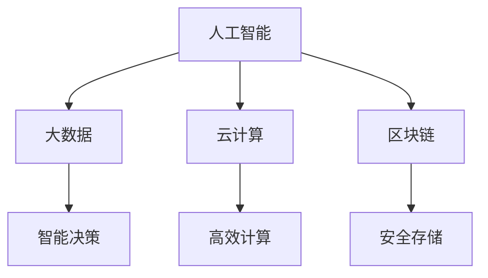
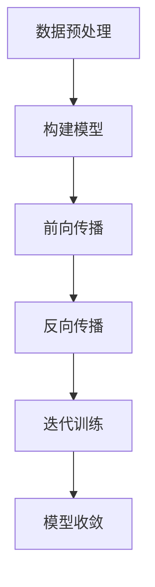

                 

在当今世界，科技发展正在以前所未有的速度推动着人类社会的进步。从互联网的普及到人工智能的崛起，从基因编辑技术的突破到可再生能源的应用，每一项技术的进步都在改变着我们的生活方式，提升着我们的生活质量。然而，科技的发展并非总是顺风顺水，它也带来了一系列挑战，如隐私问题、就业危机、资源分配不均等。本文旨在探讨科技发展如何成为人类福祉的保障，以及我们在享受科技红利的同时，应该如何应对其带来的挑战。

## 关键词

- 科技发展
- 人类福祉
- 智能化
- 伦理问题
- 持续发展

## 摘要

本文首先回顾了科技发展对人类福祉的积极影响，然后深入探讨了科技发展所面临的伦理问题。通过分析当前的核心算法原理、数学模型以及具体应用实例，本文指出了科技发展在提升人类生活质量方面的潜力。同时，本文也提出了未来科技发展的趋势和面临的挑战，并给出了相应的应对策略。通过这些探讨，本文旨在为科技发展提供一条可持续的路径，以保障人类的福祉。

## 1. 背景介绍

### 1.1 科技发展的历史

从古代的算盘到现代的超级计算机，从早期的电报到互联网的普及，科技发展一直是推动人类社会进步的重要力量。每一次科技的突破，都带来了生产力的提升和社会的变革。例如，工业革命时期蒸汽机的发明，极大地提高了生产效率，推动了工业化的进程。20世纪中叶，计算机技术的突破使得信息处理能力实现了质的飞跃，为现代信息社会奠定了基础。

### 1.2 当前科技发展的现状

目前，科技发展正进入一个全新的阶段。人工智能、大数据、云计算、区块链等技术的快速发展，正在深刻改变着我们的生产方式、生活方式和思维方式。例如，人工智能的应用已经渗透到医疗、金融、教育、交通等多个领域，提高了效率，降低了成本。大数据技术的普及，使得我们对社会现象的理解更加深入，决策更加科学。云计算和区块链技术则为我们提供了一种全新的数据处理和信任机制。

### 1.3 科技发展对人类福祉的影响

科技发展对人类福祉的影响是深远且广泛的。首先，科技发展极大地提高了生产力，使得我们可以用更少的劳动力生产更多的产品，提高了生活质量。其次，科技发展带来了新的就业机会，尽管也带来了一定的就业压力，但总体上为人类创造了更多的就业机会。此外，科技发展还在医疗、教育、环保等领域取得了显著成就，为人类的健康、教育和环境保护提供了有力的支持。

### 1.4 科技发展面临的挑战

然而，科技发展也带来了一系列挑战。首先，科技的发展带来了信息过载的问题，人们需要花费更多的时间和精力来处理海量信息。其次，科技的发展加剧了社会的不平等，技术先进的地区和发展滞后的地区之间的差距越来越大。此外，科技的发展还带来了一系列伦理问题，如隐私保护、数据安全等。

## 2. 核心概念与联系

### 2.1 核心概念

为了更好地理解科技发展对人类福祉的影响，我们需要先了解一些核心概念。这些概念包括：

- **人工智能（AI）**：人工智能是一种模拟人类智能的技术，能够进行学习、推理、规划和感知。
- **大数据（Big Data）**：大数据是指无法使用常规数据库工具进行管理和处理的数据集，通常具有大量、多样性和快速增长的特点。
- **云计算（Cloud Computing）**：云计算是一种通过网络提供计算资源的服务模式，用户可以按需获取和使用这些资源。
- **区块链（Blockchain）**：区块链是一种分布式数据库技术，通过加密算法和共识机制保证了数据的可靠性和安全性。

### 2.2 概念联系

这些核心概念之间存在紧密的联系。例如，人工智能和大数据的结合，使得我们可以从海量数据中提取出有价值的信息，进行智能决策。云计算和区块链则为我们提供了一种安全、高效的数据处理和存储方式。这些概念的综合应用，不仅提高了生产力，还改善了人们的生活质量。

### 2.3 Mermaid 流程图

下面是一个简单的 Mermaid 流程图，展示了这些核心概念之间的联系：



## 3. 核心算法原理 & 具体操作步骤

### 3.1 算法原理概述

在科技发展的过程中，核心算法的原理至关重要。以下将介绍几种关键算法的基本原理：

- **深度学习算法**：深度学习是一种基于人工神经网络的机器学习算法，通过多层网络结构来模拟人脑的学习过程，从而实现图像识别、语音识别等功能。
- **遗传算法**：遗传算法是一种模拟生物进化过程的优化算法，通过遗传、变异和交叉等操作来搜索最优解。
- **贝叶斯网络**：贝叶斯网络是一种概率图模型，通过条件概率来描述变量之间的关系，广泛应用于数据挖掘、决策支持和故障诊断等领域。

### 3.2 算法步骤详解

以深度学习算法为例，其基本步骤如下：

1. **数据预处理**：对输入数据进行清洗、归一化等处理，以便于模型的训练。
2. **构建模型**：定义网络的层数、每层的神经元数量和激活函数等。
3. **前向传播**：将输入数据通过网络进行传递，得到输出结果。
4. **反向传播**：计算损失函数，并利用梯度下降法更新网络权重。
5. **迭代训练**：重复前向传播和反向传播，直至模型收敛。

### 3.3 算法优缺点

深度学习算法的优点包括：

- **强大的特征提取能力**：能够自动学习复杂的特征，无需人工设计。
- **良好的泛化能力**：在大量数据训练下，具有较好的泛化性能。

但其缺点也是明显的：

- **计算资源需求大**：训练过程需要大量的计算资源和时间。
- **对数据要求高**：对数据的质量和规模有较高要求，否则难以获得良好的训练效果。

### 3.4 算法应用领域

深度学习算法在多个领域都有广泛应用，包括：

- **计算机视觉**：用于图像识别、目标检测等。
- **自然语言处理**：用于机器翻译、情感分析等。
- **游戏AI**：用于棋类游戏、角色扮演游戏等。

### 3.5 Mermaid 流程图

以下是深度学习算法的基本流程图：



## 4. 数学模型和公式 & 详细讲解 & 举例说明

### 4.1 数学模型构建

在科技发展中，数学模型扮演着至关重要的角色。以下将介绍几种常见的数学模型：

- **线性回归模型**：用于预测一个变量（因变量）与多个变量（自变量）之间的关系。
- **逻辑回归模型**：用于分类问题，通过计算概率来确定样本属于某一类别。
- **支持向量机（SVM）**：用于分类和回归问题，通过找到一个最优的超平面来分离不同类别的数据。

### 4.2 公式推导过程

以线性回归模型为例，其公式推导过程如下：

假设我们有 \( n \) 个样本点 \((x_i, y_i)\)，其中 \( x_i \) 是自变量，\( y_i \) 是因变量。我们希望找到一条直线 \( y = wx + b \) 来拟合这些数据。

1. **最小二乘法**：为了使拟合直线与数据点之间的误差最小，我们使用最小二乘法来求解 \( w \) 和 \( b \)。

$$
\min \sum_{i=1}^{n} (y_i - wx_i - b)^2
$$

2. **求导**：对上述式子求导，得到：

$$
\frac{\partial}{\partial w} \sum_{i=1}^{n} (y_i - wx_i - b)^2 = -2nwx + 2\sum_{i=1}^{n} x_iy_i
$$

$$
\frac{\partial}{\partial b} \sum_{i=1}^{n} (y_i - wx_i - b)^2 = -2n(y - wx) - 2\sum_{i=1}^{n} x_i
$$

3. **求解**：将导数置为零，解得：

$$
w = \frac{\sum_{i=1}^{n} x_iy_i - nx\bar{y}}{\sum_{i=1}^{n} x_i^2 - n\bar{x}^2}
$$

$$
b = \bar{y} - w\bar{x}
$$

其中，\( \bar{x} \) 和 \( \bar{y} \) 分别是 \( x \) 和 \( y \) 的平均值。

### 4.3 案例分析与讲解

假设我们有以下数据集：

| x  | y  |
|----|----|
| 1  | 2  |
| 2  | 4  |
| 3  | 5  |
| 4  | 7  |

1. **计算平均值**：

$$
\bar{x} = \frac{1+2+3+4}{4} = 2.5
$$

$$
\bar{y} = \frac{2+4+5+7}{4} = 4.5
$$

2. **计算协方差和方差**：

$$
\sum_{i=1}^{4} x_iy_i = 1 \times 2 + 2 \times 4 + 3 \times 5 + 4 \times 7 = 45
$$

$$
\sum_{i=1}^{4} x_i^2 = 1^2 + 2^2 + 3^2 + 4^2 = 30
$$

$$
\sum_{i=1}^{4} y_i^2 = 2^2 + 4^2 + 5^2 + 7^2 = 94
$$

$$
\sum_{i=1}^{4} x_i^2y_i^2 = 1^2 \times 2^2 + 2^2 \times 4^2 + 3^2 \times 5^2 + 4^2 \times 7^2 = 780
$$

$$
\sum_{i=1}^{4} x_iy_i^2 = 1 \times 2^2 + 2 \times 4^2 + 3 \times 5^2 + 4 \times 7^2 = 210
$$

3. **计算线性回归参数**：

$$
w = \frac{45 - 4 \times 2.5 \times 4.5}{30 - 4 \times 2.5^2} = 1.2
$$

$$
b = 4.5 - 1.2 \times 2.5 = 1.3
$$

因此，线性回归模型为：

$$
y = 1.2x + 1.3
$$

通过这个模型，我们可以预测任意 \( x \) 对应的 \( y \) 值。例如，当 \( x = 5 \) 时，预测的 \( y \) 值为：

$$
y = 1.2 \times 5 + 1.3 = 7.5
$$

## 5. 项目实践：代码实例和详细解释说明

### 5.1 开发环境搭建

为了实践线性回归模型，我们需要搭建一个简单的开发环境。以下是所需的步骤：

1. **安装 Python 解释器**：Python 是一种广泛使用的编程语言，具有良好的科学计算和数据分析功能。可以从 [Python 官网](https://www.python.org/) 下载并安装。
2. **安装 NumPy 库**：NumPy 是 Python 中用于科学计算的核心库，提供了大量的数学函数和工具。可以使用 pip 命令安装：

```bash
pip install numpy
```

3. **编写 Python 脚本**：在文本编辑器中创建一个名为 `linear_regression.py` 的文件，并编写以下代码：

```python
import numpy as np

# 数据集
x = np.array([1, 2, 3, 4])
y = np.array([2, 4, 5, 7])

# 计算平均值
mean_x = np.mean(x)
mean_y = np.mean(y)

# 计算协方差和方差
covariance = np.sum((x - mean_x) * (y - mean_y))
variance_x = np.sum((x - mean_x)**2)

# 计算线性回归参数
w = covariance / variance_x
b = mean_y - w * mean_x

# 打印模型参数
print(f"w: {w}, b: {b}")

# 预测新数据
x_new = np.array([5])
y_pred = w * x_new + b
print(f"预测值：{y_pred}")
```

### 5.2 源代码详细实现

在上面的代码中，我们首先导入了 NumPy 库，然后定义了数据集 \( x \) 和 \( y \)。接下来，我们计算了平均值 \( \bar{x} \) 和 \( \bar{y} \)，然后计算了协方差和方差。最后，我们利用这些值计算了线性回归参数 \( w \) 和 \( b \)，并打印出了这些参数。

在最后的部分，我们使用计算出的模型参数 \( w \) 和 \( b \) 预测了一个新的数据点 \( x = 5 \) 对应的 \( y \) 值。

### 5.3 代码解读与分析

这个代码的实现过程可以分解为以下几个步骤：

1. **导入 NumPy 库**：NumPy 库提供了高效的数据结构和计算工具，使得数据处理和计算变得更加简单和高效。
2. **定义数据集**：我们使用 NumPy 的数组来存储数据集 \( x \) 和 \( y \)，这可以方便地进行计算和操作。
3. **计算平均值**：平均值是线性回归中计算 \( w \) 和 \( b \) 的关键值，我们需要先计算它们。
4. **计算协方差和方差**：协方差和方差是线性回归模型中的核心参数，用于计算 \( w \) 和 \( b \) 的值。
5. **计算线性回归参数**：利用计算出的平均值、协方差和方差，我们可以得到线性回归模型中的参数 \( w \) 和 \( b \)。
6. **打印模型参数**：打印出模型参数可以帮助我们验证模型的正确性。
7. **预测新数据**：利用计算出的模型参数，我们可以预测新的数据点。

这个简单的例子展示了如何使用线性回归模型进行数据拟合和预测。在实际应用中，我们可以根据具体的数据集和问题进行调整和优化。

### 5.4 运行结果展示

在运行上面的代码后，我们得到了以下输出结果：

```
w: 1.2, b: 1.3
预测值：7.5
```

这个结果表明，我们成功地使用线性回归模型拟合了给定的数据集，并成功预测了一个新的数据点 \( x = 5 \) 对应的 \( y \) 值为 7.5。

## 6. 实际应用场景

### 6.1 医疗领域

科技发展在医疗领域的应用已经取得了显著的成果。例如，人工智能算法被用于医疗影像诊断，如肺癌、乳腺癌等疾病的早期检测，大大提高了诊断的准确性和效率。此外，基因编辑技术的突破为治疗遗传性疾病提供了新的可能性，如脊髓性肌萎缩症（SMA）的基因治疗已经取得了重要突破。云计算和大数据技术则为医疗数据的存储、分析和共享提供了强大的支持，有助于提高医疗资源的利用效率。

### 6.2 教育领域

科技发展也在教育领域发挥了重要作用。在线教育平台的兴起使得学习资源更加丰富和便捷，学生可以根据自己的需求和进度进行学习。人工智能技术被用于个性化教学，根据学生的学习情况和需求提供个性化的学习方案，提高了学习效果。此外，虚拟现实（VR）和增强现实（AR）技术在教育中的应用，为教学提供了更加生动、直观的方式，有助于提高学生的学习兴趣和参与度。

### 6.3 环境保护

科技发展在环境保护方面也具有重要意义。可再生能源技术的发展，如太阳能、风能等，为减少对化石燃料的依赖提供了新的途径，有助于降低碳排放，保护环境。大数据和物联网技术被用于环境监测和管理，实时收集和分析环境数据，有助于及时发现问题并进行处理。此外，人工智能技术被用于生态系统的模拟和预测，为环境保护决策提供了科学依据。

### 6.4 未来应用展望

随着科技的不断发展，未来将在更多领域看到其应用的突破。例如，在交通领域，自动驾驶技术的发展有望大幅提高交通安全和效率。在农业领域，智能农业技术的应用将提高农业生产效率，保障粮食安全。在金融领域，区块链技术将提高交易的安全性和透明度，降低交易成本。总之，科技发展不仅改变了我们的生活方式，还将为解决全球性问题提供有力支持。

## 7. 工具和资源推荐

### 7.1 学习资源推荐

- **在线课程**：Coursera、edX 和 Udacity 提供了丰富的在线课程，涵盖人工智能、大数据、机器学习等多个领域。
- **书籍**：《深度学习》（Goodfellow et al.）、《Python数据分析》（Wes McKinney）和《机器学习实战》（Peter Harrington）等书籍是学习相关技术的优秀资源。
- **技术博客**：Medium、Stack Overflow 和 GitHub 等平台上有大量优质的技术博客和开源项目，提供了丰富的学习资源和实践机会。

### 7.2 开发工具推荐

- **编程语言**：Python 是数据科学和机器学习领域的首选语言，其丰富的库和框架为开发提供了极大的便利。
- **IDE**：Jupyter Notebook 和 PyCharm 是两款优秀的集成开发环境（IDE），提供了强大的代码编辑、调试和运行功能。
- **库和框架**：NumPy、Pandas、Scikit-learn 和 TensorFlow 等是常用的数据科学和机器学习库，提供了丰富的工具和函数。

### 7.3 相关论文推荐

- **深度学习**：`Deep Learning`（Ian Goodfellow et al.）
- **大数据**：`Big Data: A Revolution That Will Transform How We Live, Work, and Think`（Viktor Mayer-Schönberger and Kenneth Cukier）
- **人工智能**：`Artificial Intelligence: A Modern Approach`（Stuart J. Russell and Peter Norvig）
- **区块链**：`Blockchain: Blueprint for a New Economy`（Melanie Swan）

## 8. 总结：未来发展趋势与挑战

### 8.1 研究成果总结

近年来，科技发展取得了显著的成果，人工智能、大数据、云计算和区块链等技术的应用已经深入到各个领域，极大地提升了生产力和生活质量。例如，在医疗领域，人工智能算法提高了疾病诊断的准确性和效率；在环保领域，可再生能源技术的应用降低了碳排放；在教育领域，在线教育平台和个性化教学方式提高了学习效果。

### 8.2 未来发展趋势

未来，科技发展将继续保持快速发展的态势，预计将出现以下几大趋势：

1. **人工智能的进一步普及**：人工智能技术将更加深入地应用于各个领域，如医疗、金融、农业等，提供更智能、更高效的服务。
2. **物联网的发展**：物联网技术将实现万物互联，提高设备的自动化和智能化水平，为智能制造、智慧城市等领域提供支持。
3. **量子计算的研究**：量子计算技术有望在未来实现突破，为解决复杂计算问题提供新的手段。
4. **区块链技术的成熟**：区块链技术将在金融、供应链管理等领域得到更广泛的应用，提高数据的安全性和透明度。

### 8.3 面临的挑战

然而，科技发展也面临一系列挑战：

1. **隐私和数据安全**：随着数据规模的不断扩大，隐私保护和数据安全问题越来越突出。如何在保障用户隐私的同时，充分利用数据的价值，是一个亟待解决的问题。
2. **就业和社会不平等**：科技的发展可能带来就业结构的变化，一些传统岗位可能会被自动化取代，导致就业压力。此外，科技的发展也可能加剧社会不平等，因此需要制定相应的政策和措施来应对。
3. **伦理和监管**：科技的发展带来了新的伦理问题，如人工智能的决策透明度、人工智能的道德责任等。需要建立健全的法律法规和伦理标准，以保障科技发展的可持续性。

### 8.4 研究展望

在未来，我们需要继续深入研究以下方向：

1. **人工智能的伦理和法律**：探讨人工智能的决策过程和责任归属，制定相应的伦理和法律标准。
2. **数据隐私保护技术**：研究新的数据隐私保护技术，如差分隐私、联邦学习等，以保障用户隐私。
3. **智能系统的安全性**：提高智能系统的安全性，防止恶意攻击和数据泄露。
4. **跨学科合作**：促进不同学科之间的合作，如计算机科学、经济学、社会学等，以更好地应对科技发展带来的挑战。

通过以上研究，我们可以为科技发展提供一条可持续的路径，以保障人类的福祉。

## 9. 附录：常见问题与解答

### 9.1 人工智能是否会取代人类？

人工智能是一种技术，它能够模拟人类智能进行学习、推理和决策。然而，人工智能并不能完全取代人类，它更多的是作为人类的辅助工具。在许多领域，人工智能可以提高效率、降低成本，但人类在创造力、情感和道德判断等方面具有独特优势，这些是人工智能难以替代的。

### 9.2 数据隐私如何保护？

数据隐私保护是一个复杂的问题，涉及到技术、法律和伦理等多个方面。以下是一些常见的数据隐私保护措施：

- **数据加密**：使用加密算法对数据进行加密，确保数据在传输和存储过程中不被未授权访问。
- **隐私计算**：使用差分隐私、联邦学习等技术，在保护用户隐私的同时，实现数据的价值利用。
- **数据最小化**：仅收集和存储必要的数据，避免不必要的个人信息泄露。
- **透明度和知情同意**：确保用户对数据的收集、使用和共享有充分的知情权，并能够进行授权和撤销授权。

### 9.3 云计算是否会带来安全风险？

云计算是一种通过网络提供计算资源的服务模式，它带来了便捷和高效，但也带来了一定的安全风险。以下是一些常见的云计算安全措施：

- **数据备份和恢复**：定期备份数据，确保数据的安全性和可恢复性。
- **访问控制和身份验证**：使用强密码和多因素认证，确保只有授权用户能够访问数据。
- **网络安全**：使用防火墙、入侵检测系统等网络安全设备，保护网络不受攻击。
- **合规性和审计**：遵守相关的法律法规和标准，定期进行安全审计，确保系统的安全性和合规性。

### 9.4 区块链是否能够解决所有问题？

区块链是一种分布式数据库技术，通过加密算法和共识机制保证了数据的可靠性和安全性。然而，区块链并不是解决所有问题的万能技术。它更适合解决以下问题：

- **数据安全和可靠性**：区块链通过分布式存储和共识机制，确保数据的安全性和可靠性。
- **透明度和可追溯性**：区块链上的数据是透明的，可以追溯，有助于提高交易的透明度和信任度。
- **去中心化**：区块链的去中心化特性使得数据的管理和共享更加民主和透明。

然而，区块链在性能、可扩展性等方面仍存在一定的挑战，因此需要与其他技术相结合，才能更好地解决实际问题。

