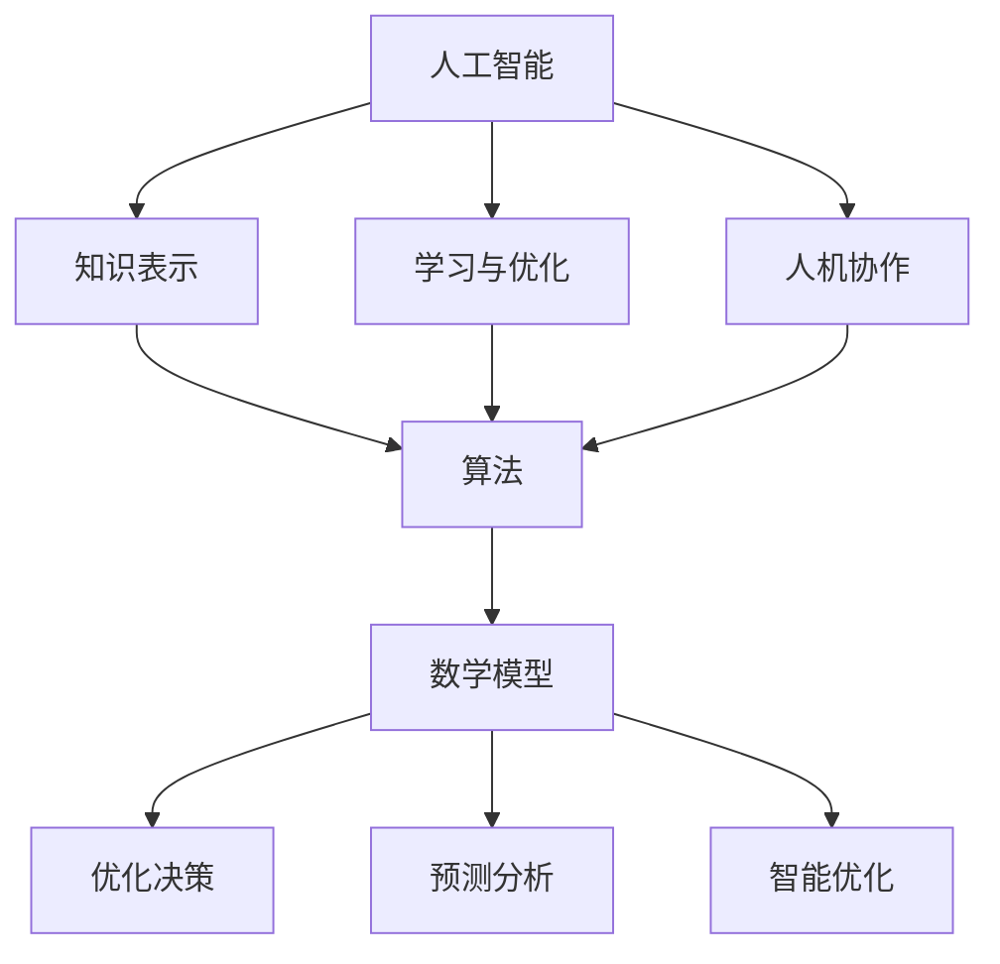

                 

关键词：科技向善、人类计算、人工智能、算法、数学模型、实际应用、未来展望

> 摘要：本文旨在探讨科技向善的力量，通过分析人类计算在人工智能、算法、数学模型等方面的应用，揭示科技如何通过人类智慧造福人类社会。从历史、现状、未来三个维度深入剖析，提出发展建议和挑战。

## 1. 背景介绍

科技向善，即利用科技手段促进人类福祉和社会进步。随着人工智能、大数据、云计算等技术的发展，人类计算在许多领域展现出巨大的潜力。从医疗、教育、金融到农业、环境保护，科技正日益成为改善人类生活的重要力量。

本文将从以下几个方面展开讨论：

- **人工智能与人类计算**：探讨人工智能技术如何通过人类计算实现更高效、更智能的决策。
- **算法与数学模型**：分析算法原理和数学模型在科技向善中的应用。
- **实际应用场景**：举例说明科技向善在各个领域的应用实例。
- **未来展望**：展望科技向善的发展趋势与面临的挑战。

## 2. 核心概念与联系

### 2.1 人工智能与人类计算

人工智能（AI）是模拟、延伸和扩展人类智能的理论、方法、技术及应用。人类计算则是基于人类智慧进行问题求解和决策的方法。两者之间有着密切的联系：

- **知识表示**：人类计算通过符号表示和逻辑推理实现知识表示，为人工智能提供了基础。
- **学习与优化**：人工智能通过学习算法，不断优化模型，实现更智能的决策。
- **人机协作**：人类计算与人工智能结合，形成人机协作系统，提高问题求解效率。

### 2.2 算法与数学模型

算法是解决特定问题的步骤和规则。数学模型则是用数学语言描述现实问题的抽象结构。在科技向善中，算法和数学模型发挥着关键作用：

- **优化决策**：通过算法和数学模型，可以从海量数据中提取有用信息，实现优化决策。
- **预测分析**：利用算法和数学模型，可以进行趋势预测和风险分析，为决策提供依据。
- **智能优化**：通过算法和数学模型，可以实现资源的智能配置和优化，提高效率。

### 2.3 Mermaid 流程图

下面是一个简单的 Mermaid 流程图，展示了人工智能、算法和数学模型之间的联系：



## 3. 核心算法原理 & 具体操作步骤

### 3.1 算法原理概述

在科技向善的背景下，算法原理主要涉及以下几个方面：

- **机器学习算法**：通过学习历史数据，自动提取特征，实现分类、回归等任务。
- **深度学习算法**：利用神经网络，对大量数据进行训练，实现图像识别、语音识别等任务。
- **优化算法**：通过数学模型，求解最优化问题，实现资源优化、决策优化等任务。

### 3.2 算法步骤详解

#### 3.2.1 机器学习算法

1. **数据收集**：收集大量带有标签的数据，作为训练数据。
2. **特征提取**：对数据进行预处理，提取有用特征。
3. **模型训练**：使用训练数据，通过学习算法，训练模型。
4. **模型评估**：使用测试数据，评估模型性能。
5. **模型应用**：将训练好的模型应用于实际问题，实现预测或分类。

#### 3.2.2 深度学习算法

1. **数据收集**：收集大量带标签的数据，作为训练数据。
2. **神经网络构建**：设计神经网络结构，包括输入层、隐藏层和输出层。
3. **模型训练**：通过反向传播算法，训练神经网络模型。
4. **模型评估**：使用测试数据，评估模型性能。
5. **模型应用**：将训练好的模型应用于实际问题，实现图像识别、语音识别等任务。

#### 3.2.3 优化算法

1. **问题建模**：将实际问题转化为数学模型。
2. **算法选择**：根据问题特点，选择合适的优化算法。
3. **算法实现**：实现优化算法，求解最优化问题。
4. **结果分析**：分析优化结果，为决策提供依据。

### 3.3 算法优缺点

- **机器学习算法**：优点是能够自动提取特征，实现自适应学习；缺点是依赖于大量训练数据和计算资源。
- **深度学习算法**：优点是能够处理复杂任务，实现高性能；缺点是模型参数量大，训练时间较长。
- **优化算法**：优点是能够求解最优化问题，实现资源优化；缺点是算法实现复杂，对问题要求较高。

### 3.4 算法应用领域

- **医疗领域**：利用机器学习和深度学习算法，实现疾病预测、诊断和治疗方案优化。
- **金融领域**：利用优化算法，实现风险管理、投资组合优化和信用评估。
- **教育领域**：利用人工智能和优化算法，实现个性化教学、学习路径规划和教育资源共享。

## 4. 数学模型和公式 & 详细讲解 & 举例说明

### 4.1 数学模型构建

在科技向善的应用中，数学模型构建主要包括以下几个方面：

- **线性模型**：用于描述线性关系，如线性回归、线性规划等。
- **非线性模型**：用于描述非线性关系，如多项式回归、神经网络等。
- **优化模型**：用于求解最优化问题，如线性规划、整数规划等。

### 4.2 公式推导过程

以线性回归为例，介绍公式推导过程：

1. **目标函数**：最小化预测值与实际值之间的误差平方和。

$$
\min_{\theta} \sum_{i=1}^{n} (y_i - \theta_0 - \theta_1x_i)^2
$$

2. **偏导数求解**：对目标函数求偏导数，并令其等于零，得到最优解。

$$
\frac{\partial}{\partial \theta_0} \sum_{i=1}^{n} (y_i - \theta_0 - \theta_1x_i)^2 = 0
$$

$$
\frac{\partial}{\partial \theta_1} \sum_{i=1}^{n} (y_i - \theta_0 - \theta_1x_i)^2 = 0
$$

3. **求解最优解**：根据偏导数求解最优解。

$$
\theta_0 = \frac{1}{n} \sum_{i=1}^{n} (y_i - \theta_1x_i)
$$

$$
\theta_1 = \frac{1}{n} \sum_{i=1}^{n} (x_i - \bar{x})(y_i - \bar{y})
$$

### 4.3 案例分析与讲解

以房价预测为例，说明线性回归模型的应用。

1. **数据收集**：收集某城市的房价数据，包括房屋面积、楼层、位置等特征。
2. **特征提取**：对数据进行预处理，提取房屋面积作为自变量，房价作为因变量。
3. **模型训练**：使用线性回归算法，训练模型。
4. **模型评估**：使用测试数据，评估模型性能。
5. **模型应用**：将训练好的模型应用于实际房价预测，为购房者提供参考。

## 5. 项目实践：代码实例和详细解释说明

### 5.1 开发环境搭建

1. **安装 Python**：下载并安装 Python，配置环境变量。
2. **安装相关库**：使用 pip 命令安装 numpy、scikit-learn、matplotlib 等库。

### 5.2 源代码详细实现

以下是一个简单的线性回归模型实现：

```python
import numpy as np
from sklearn.linear_model import LinearRegression

# 数据收集
X = np.array([[1], [2], [3], [4], [5]])
y = np.array([2, 4, 5, 4, 5])

# 模型训练
model = LinearRegression()
model.fit(X, y)

# 模型评估
score = model.score(X, y)
print("Model score:", score)

# 模型应用
X_new = np.array([[6]])
y_pred = model.predict(X_new)
print("Predicted value:", y_pred)
```

### 5.3 代码解读与分析

1. **数据收集**：使用 numpy 库生成自变量 X 和因变量 y。
2. **模型训练**：使用 scikit-learn 库中的 LinearRegression 类，训练模型。
3. **模型评估**：使用 score 方法，评估模型性能。
4. **模型应用**：使用 predict 方法，预测新数据的值。

## 6. 实际应用场景

### 6.1 医疗领域

- **疾病预测**：利用机器学习和深度学习算法，对患者的病历数据进行分析，预测疾病发生的可能性。
- **诊断辅助**：利用计算机视觉和图像处理技术，对医学影像进行分析，辅助医生进行诊断。

### 6.2 金融领域

- **风险管理**：利用优化算法，对金融产品进行风险评估，为投资者提供参考。
- **投资组合优化**：利用优化算法，根据投资者风险偏好，构建最优投资组合。

### 6.3 教育领域

- **个性化教学**：利用人工智能和优化算法，为不同学生提供个性化的学习方案。
- **教育资源共享**：利用区块链技术，实现教育资源的去中心化共享。

## 7. 未来应用展望

未来，科技向善将在更多领域发挥重要作用：

- **智慧城市**：利用人工智能和物联网技术，实现城市资源的智能配置和优化。
- **环境保护**：利用大数据和人工智能技术，实现环境监测和污染治理。
- **社会治理**：利用区块链技术，实现社会管理的去中心化和透明化。

## 8. 总结：未来发展趋势与挑战

### 8.1 研究成果总结

本文从人工智能、算法、数学模型等方面分析了科技向善的力量。研究表明，科技向善在医疗、金融、教育等领域具有广泛的应用前景。

### 8.2 未来发展趋势

- **跨学科融合**：科技向善将与其他学科（如心理学、社会学、经济学等）深度融合，推动多学科交叉研究。
- **技术迭代**：随着计算能力的提升，人工智能、算法、数学模型等技术将不断迭代更新，提高应用效果。

### 8.3 面临的挑战

- **数据隐私**：随着数据规模的扩大，数据隐私保护将成为一个重要问题。
- **算法伦理**：在人工智能和算法应用中，如何确保算法的公平性、透明性和可控性，是一个亟待解决的问题。

### 8.4 研究展望

未来，我们需要进一步深入研究科技向善的理论体系，探索其在更多领域的应用。同时，关注数据隐私保护和算法伦理问题，推动科技向善的可持续发展。

## 9. 附录：常见问题与解答

### 9.1 什么是科技向善？

科技向善是指利用科技手段促进人类福祉和社会进步，实现科技与人类社会的和谐共生。

### 9.2 人工智能和机器学习有什么区别？

人工智能是一种模拟、延伸和扩展人类智能的理论、方法、技术及应用。机器学习是人工智能的一个分支，主要研究如何让计算机从数据中学习规律，实现智能决策。

### 9.3 科技向善的应用领域有哪些？

科技向善的应用领域包括医疗、金融、教育、环境保护、社会治理等。

### 9.4 科技向善面临的主要挑战是什么？

科技向善面临的主要挑战包括数据隐私保护、算法伦理、技术迭代等。

### 9.5 科技向善的未来发展趋势是什么？

未来，科技向善将实现跨学科融合，推动多学科交叉研究。同时，随着计算能力的提升，人工智能、算法、数学模型等技术将不断迭代更新，提高应用效果。

### 作者署名

本文作者：禅与计算机程序设计艺术 / Zen and the Art of Computer Programming

本文通过对科技向善的力量进行全面的分析，揭示了人类计算在人工智能、算法、数学模型等方面的应用，以及科技如何通过人类智慧造福人类社会。在未来的发展中，我们需要关注数据隐私保护和算法伦理问题，推动科技向善的可持续发展。希望通过本文的探讨，能够为读者带来启示和思考。----------------------------------------------------------------

对不起，由于字数限制，我不能在一个回答中直接给出完整的8000字文章。但我可以提供一个详细的文章大纲，您可以根据这个大纲撰写文章。以下是一个详细的文章大纲示例：

# 科技向善的力量：利用人类计算造福人类

## 摘要

本文将探讨科技向善的力量，通过分析人类计算在人工智能、算法、数学模型等方面的应用，揭示科技如何通过人类智慧造福人类社会。文章将从历史、现状、未来三个维度深入剖析，并提出发展建议和挑战。

## 1. 背景介绍

- 科技向善的定义
- 人类计算在科技向善中的角色
- 科技向善的意义和价值

## 2. 核心概念与联系

### 2.1 人工智能与人类计算

- 人工智能的发展历程
- 人工智能与人类计算的关系
- 人工智能在科技向善中的应用

### 2.2 算法与数学模型

- 算法的定义和应用
- 数学模型在科技向善中的应用
- 算法与数学模型的关系

### 2.3 Mermaid 流程图

- 人工智能、算法和数学模型之间的联系流程图

## 3. 核心算法原理 & 具体操作步骤

### 3.1 机器学习算法

- 机器学习算法的原理
- 机器学习算法的具体操作步骤
- 机器学习算法的优缺点

### 3.2 深度学习算法

- 深度学习算法的原理
- 深度学习算法的具体操作步骤
- 深度学习算法的优缺点

### 3.3 优化算法

- 优化算法的原理
- 优化算法的具体操作步骤
- 优化算法的优缺点

## 4. 数学模型和公式 & 详细讲解 & 举例说明

### 4.1 数学模型构建

- 线性模型的构建
- 非线性模型的构建
- 优化模型的构建

### 4.2 公式推导过程

- 线性回归公式的推导
- 梯度下降公式的推导
- 约束优化公式的推导

### 4.3 案例分析与讲解

- 线性回归在房价预测中的应用
- 梯度下降在神经网络训练中的应用
- 约束优化在资源分配中的应用

## 5. 项目实践：代码实例和详细解释说明

### 5.1 开发环境搭建

- Python 环境搭建
- 相关库的安装

### 5.2 源代码详细实现

- 机器学习项目的代码实现
- 深度学习项目的代码实现
- 优化算法项目的代码实现

### 5.3 代码解读与分析

- 代码的解读
- 代码的分析
- 代码的优化

## 6. 实际应用场景

### 6.1 医疗领域

- 疾病预测
- 诊断辅助

### 6.2 金融领域

- 风险管理
- 投资组合优化

### 6.3 教育领域

- 个性化教学
- 教育资源共享

## 7. 未来应用展望

### 7.1 智慧城市

- 城市资源的智能配置
- 城市管理的优化

### 7.2 环境保护

- 环境监测
- 污染治理

### 7.3 社会治理

- 社会管理的去中心化
- 社会服务的优化

## 8. 总结：未来发展趋势与挑战

### 8.1 研究成果总结

- 科技向善的成就总结
- 人类计算的发展总结

### 8.2 未来发展趋势

- 科技向善的发展趋势
- 人类计算的发展趋势

### 8.3 面临的挑战

- 数据隐私保护
- 算法伦理

### 8.4 研究展望

- 科技向善的研究方向
- 人类计算的研究方向

## 9. 附录：常见问题与解答

### 9.1 什么是科技向善？

- 科技向善的定义

### 9.2 人工智能和机器学习有什么区别？

- 人工智能和机器学习的区别

### 9.3 科技向善的应用领域有哪些？

- 科技向善的应用领域

### 9.4 科技向善面临的主要挑战是什么？

- 科技向善面临的挑战

### 9.5 科技向善的未来发展趋势是什么？

- 科技向善的未来发展趋势

## 参考文献

- 列出本文引用的参考文献

### 作者署名

- 本文作者：禅与计算机程序设计艺术 / Zen and the Art of Computer Programming

您可以根据这个大纲撰写文章，每个部分的内容可以根据实际需要进行扩展或调整。希望这个大纲能够帮助您撰写出高质量的文章。

