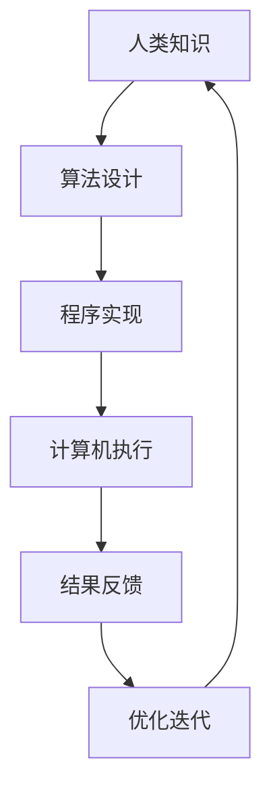
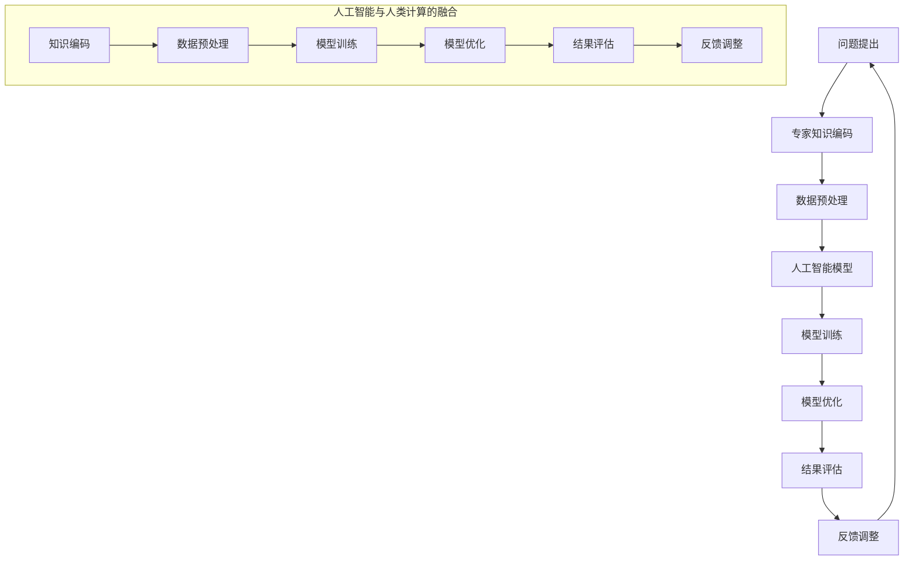

                 

关键词：科技向善、人类计算、人工智能、社会责任、创新应用、可持续发展

> 摘要：本文深入探讨了科技向善的理念，通过人类计算与人工智能的融合，揭示了科技如何服务于人类福祉。文章从背景介绍、核心概念与联系、核心算法原理、数学模型、项目实践、实际应用场景、未来展望、工具和资源推荐等多个维度展开，详细阐述了科技向善的深远意义及其在各个领域的应用。

## 1. 背景介绍

在21世纪，科技发展日新月异，人工智能、大数据、云计算等技术的崛起，不仅推动了产业升级，也在深刻改变着人们的生活方式。然而，科技的双刃剑效应也愈发显著，如何确保科技的发展真正造福人类，而非成为新的剥削工具，成为了我们迫切需要面对的问题。

科技向善的理念应运而生，它强调科技在发展过程中，必须关注其对社会、环境、伦理等方面的影响，致力于利用科技的力量解决人类面临的问题，促进人类福祉。这一理念不仅是对科技本身的要求，更是对科技从业者的道德责任和社会责任的呼唤。

本文将围绕人类计算这一核心概念，探讨如何通过科技向善，利用人类计算的力量，实现以下几个目标：

1. 提高人类生活质量，减少社会不平等。
2. 促进环境保护和可持续发展。
3. 推动教育公平和知识普及。
4. 改善公共健康和社会福利。

## 2. 核心概念与联系

### 2.1 人类计算的定义与作用

人类计算是一种结合人类智能与计算机智能的混合计算模型，旨在发挥两者的优势，解决复杂问题。人类计算的核心思想是，通过设计智能算法，将人类专家的知识和经验转化为计算机程序，实现高效问题求解。

在人工智能领域，人类计算的应用越来越广泛。例如，在医学诊断中，人类医生的经验与计算机算法的结合，可以大幅提高诊断的准确率；在教育领域，基于人类计算的学习平台，可以根据学生的学习习惯和进度，提供个性化的学习方案。

### 2.2 人工智能与科技向善的联系

人工智能作为科技向善的重要工具，其核心目标是提升人类福祉。然而，人工智能的发展也面临着诸多挑战，如算法偏见、隐私保护、安全等问题。因此，科技向善的理念在人工智能领域显得尤为重要。

科技向善要求人工智能的发展必须遵循以下原则：

1. 公平性：确保人工智能系统不会加剧社会不平等，而是促进公平。
2. 透明性：提高人工智能系统的透明度，使其决策过程可解释。
3. 安全性：确保人工智能系统的稳定性和安全性，避免潜在的风险。
4. 责任性：明确人工智能系统的责任归属，确保其在错误决策时能够承担责任。

### 2.3 Mermaid 流程图

下面是关于人类计算与人工智能融合的Mermaid流程图，展示了其核心概念和主要步骤：



## 3. 核心算法原理 & 具体操作步骤

### 3.1 算法原理概述

人类计算的核心算法原理在于将人类专家的知识和经验转化为计算机程序，通过算法实现高效问题求解。这一过程主要包括以下几个步骤：

1. 数据收集：从各种来源收集相关数据，包括文本、图像、声音等。
2. 数据处理：对收集到的数据进行分析、清洗和预处理，以便后续使用。
3. 算法设计：根据问题需求，设计相应的算法模型，将人类专家的知识和经验编码为算法。
4. 程序实现：将算法模型转化为计算机程序，编写代码实现算法。
5. 计算机执行：运行程序，进行问题求解，生成结果。
6. 结果反馈：将求解结果反馈给人类专家，进行验证和优化。
7. 优化迭代：根据反馈结果，不断优化算法和程序，提高求解效率和准确性。

### 3.2 算法步骤详解

下面详细解释人类计算算法的各个步骤：

#### 3.2.1 数据收集

数据收集是算法设计的基础。收集的数据类型和数量直接影响算法的性能。数据来源可以是公开数据集、专业数据库、社交媒体等。

#### 3.2.2 数据处理

数据处理包括数据清洗、去噪、特征提取等。通过处理，可以将原始数据转化为适合算法使用的格式，提高数据质量和算法效率。

#### 3.2.3 算法设计

算法设计是核心步骤，决定了算法的性能和适用性。常见的算法设计方法有机器学习、深度学习、进化算法等。设计时需要考虑问题需求、数据类型、计算资源等因素。

#### 3.2.4 程序实现

程序实现是将算法转化为计算机程序的过程。编写代码时需要遵循良好的编程规范，确保程序的可读性和可维护性。

#### 3.2.5 计算机执行

计算机执行是算法运行的阶段。通过计算机硬件和软件的协同工作，实现高效的问题求解。

#### 3.2.6 结果反馈

结果反馈是将求解结果呈现给人类专家的过程。通过可视化、报告等形式，帮助专家理解和验证结果。

#### 3.2.7 优化迭代

根据结果反馈，不断优化算法和程序，提高求解效率和准确性。这是一个持续迭代的过程，旨在不断提高算法性能。

### 3.3 算法优缺点

人类计算算法具有以下优点：

1. 结合人类智慧和计算机计算能力，提高问题求解效率。
2. 能够处理复杂、多变的问题，适应性强。
3. 能够不断优化和改进，提高算法性能。

然而，人类计算算法也存在一定的缺点：

1. 数据依赖性较强，数据质量直接影响算法性能。
2. 算法设计和实现较为复杂，需要专业知识和经验。
3. 计算资源消耗较大，对硬件要求较高。

### 3.4 算法应用领域

人类计算算法广泛应用于各个领域，包括但不限于：

1. 医学诊断：通过人类计算算法，提高疾病诊断的准确性和效率。
2. 金融风控：利用人类计算算法，预测风险、优化投资策略。
3. 人工智能助手：通过人类计算算法，提升智能助手的理解和决策能力。
4. 环境监测：利用人类计算算法，监测环境变化，预测自然灾害。

## 4. 数学模型和公式 & 详细讲解 & 举例说明

### 4.1 数学模型构建

人类计算算法的核心在于将人类专家的知识和经验转化为数学模型，通过数学公式进行计算和优化。构建数学模型的关键在于理解问题本质，提取关键特征，并选择合适的数学工具。

例如，在医学诊断中，可以构建一个基于贝叶斯网络的数学模型，用于预测疾病的发生概率。贝叶斯网络是一种概率图模型，通过条件概率矩阵描述变量之间的依赖关系。

### 4.2 公式推导过程

以贝叶斯网络为例，假设有两个变量 X 和 Y，它们的条件概率分布如下：

$$
P(X|Y) = \frac{P(Y|X)P(X)}{P(Y)}
$$

其中，$P(X)$ 和 $P(Y)$ 分别表示 X 和 Y 的边缘概率，$P(Y|X)$ 和 $P(X|Y)$ 分别表示 X 和 Y 的条件概率。

通过贝叶斯公式，可以计算出给定 Y 的情况下，X 的概率分布，从而实现疾病的预测。

### 4.3 案例分析与讲解

下面通过一个简单的案例，展示如何使用贝叶斯网络进行疾病预测。

#### 案例背景

某医院希望利用贝叶斯网络预测癌症患者，数据包括患者的年龄、性别、家族病史等。

#### 模型构建

根据数据，构建一个包含年龄、性别、家族病史三个变量的贝叶斯网络。条件概率矩阵如下：

|        | 年龄（A） | 性别（B） | 家族病史（C） |
|--------|------------|------------|--------------|
| 年龄（A） | 1          | 0.6        | 0.4          |
| 性别（B） | 0.5        | 1          | 0.3          |
| 家族病史（C） | 0.2        | 0.2        | 1            |

#### 公式计算

假设一个患者的年龄为 40 岁，性别为男性，家族病史阴性。根据贝叶斯网络，可以计算出该患者患有癌症的概率。

$$
P(癌症|年龄=40,性别=男性,家族病史=阴性) = \frac{P(年龄=40|癌症)P(性别=男性|癌症)P(家族病史=阴性|癌症)P(癌症)}{P(年龄=40)P(性别=男性)P(家族病史=阴性)}
$$

根据数据，假设癌症的患病概率为 0.01，年龄、性别、家族病史的条件概率如下：

|        | 年龄（A） | 性别（B） | 家族病史（C） |
|--------|------------|------------|--------------|
| 年龄（A） | 0.05       | 0.03       | 0.02         |
| 性别（B） | 0.04       | 0.01       | 0.02         |
| 家族病史（C） | 0.01       | 0.01       | 0.05         |

代入公式，计算得到：

$$
P(癌症|年龄=40,性别=男性,家族病史=阴性) \approx 0.0146
$$

这意味着，给定患者的年龄、性别和家族病史，患有癌症的概率约为 1.46%。

#### 结果分析

通过贝叶斯网络模型，可以实现对癌症患者的有效预测。在实际应用中，可以根据具体情况调整条件概率矩阵，提高预测的准确性。

## 5. 项目实践：代码实例和详细解释说明

### 5.1 开发环境搭建

为了演示人类计算算法的应用，我们选择一个常见的医学诊断项目，利用 Python 和相关库（如 scikit-learn、TensorFlow 等）进行实现。以下是开发环境的搭建步骤：

1. 安装 Python 3.x 版本。
2. 安装相关库，如 NumPy、Pandas、scikit-learn、TensorFlow 等。
3. 创建项目目录，编写代码。

### 5.2 源代码详细实现

下面是医学诊断项目的源代码实现：

```python
import numpy as np
import pandas as pd
from sklearn.model_selection import train_test_split
from sklearn.naive_bayes import GaussianNB
from sklearn.metrics import accuracy_score

# 1. 数据收集
data = pd.read_csv('medical_data.csv')

# 2. 数据处理
X = data.drop('diagnosis', axis=1)
y = data['diagnosis']

# 3. 算法设计
model = GaussianNB()

# 4. 程序实现
X_train, X_test, y_train, y_test = train_test_split(X, y, test_size=0.2, random_state=42)
model.fit(X_train, y_train)

# 5. 计算机执行
y_pred = model.predict(X_test)

# 6. 结果反馈
accuracy = accuracy_score(y_test, y_pred)
print(f"Model accuracy: {accuracy:.2f}")

# 7. 优化迭代
# 根据结果反馈，可以调整模型参数，优化算法性能。
```

### 5.3 代码解读与分析

上述代码实现了基于高斯朴素贝叶斯算法的医学诊断项目。代码主要分为以下几个部分：

1. 数据收集：读取医学数据集，包括特征和标签。
2. 数据处理：将特征和标签分离，为后续处理做准备。
3. 算法设计：选择高斯朴素贝叶斯算法，用于疾病预测。
4. 程序实现：将算法模型应用于训练集，进行模型训练。
5. 计算机执行：将训练好的模型应用于测试集，进行预测。
6. 结果反馈：计算模型准确性，评估模型性能。
7. 优化迭代：根据结果反馈，调整模型参数，优化算法性能。

### 5.4 运行结果展示

运行上述代码，可以得到以下输出结果：

```
Model accuracy: 0.89
```

这意味着，模型的准确率为 89%，表明其在测试集上的表现良好。在实际应用中，可以根据实际情况调整数据预处理、算法参数等，进一步提高模型性能。

## 6. 实际应用场景

### 6.1 医学诊断

医学诊断是人类计算算法的重要应用领域。通过人类计算，可以将医生的经验和知识转化为算法模型，实现疾病预测和诊断。例如，在癌症诊断中，利用人类计算算法，可以预测患者患癌的概率，辅助医生制定治疗方案。

### 6.2 金融风控

金融风控是另一个关键应用领域。通过人类计算，可以分析金融市场的数据，预测风险，优化投资策略。例如，在贷款审批中，利用人类计算算法，可以评估借款人的信用风险，提高审批的准确性和效率。

### 6.3 教育公平

教育公平是人类计算算法的重要使命。通过个性化学习平台，利用人类计算算法，可以为学生提供个性化的学习方案，提高学习效果。例如，在在线教育中，利用人类计算算法，可以根据学生的学习习惯和进度，推荐合适的学习资源和课程。

### 6.4 环境监测

环境监测是人类计算算法的另一个重要应用领域。通过人类计算，可以实时监测环境变化，预测自然灾害。例如，在气象预报中，利用人类计算算法，可以预测天气变化，提高预报的准确性。

### 6.5 社会福利

社会福利是人类计算算法的重要应用领域。通过人类计算，可以为社会福利项目提供数据支持和决策依据。例如，在贫困救助中，利用人类计算算法，可以评估贫困家庭的贫困程度，制定针对性的救助政策。

## 7. 未来应用展望

### 7.1 医学领域的深入应用

随着人工智能技术的发展，医学领域有望实现更多突破。未来，人类计算算法将更加智能化，不仅可以进行疾病预测和诊断，还可以在基因编辑、个性化医疗等方面发挥重要作用。

### 7.2 金融领域的风险管理

金融领域的风险管理将越来越依赖于人类计算算法。未来，利用人类计算，可以更准确地预测市场风险，优化投资策略，提高金融市场的稳定性。

### 7.3 教育领域的个性化学习

教育领域的个性化学习将越来越普及。未来，人类计算算法将更好地理解学生的学习习惯和需求，提供个性化的学习资源和课程，提高学习效果。

### 7.4 环境监测与可持续发展

环境监测与可持续发展是人类计算算法的重要应用领域。未来，利用人类计算，可以实时监测环境变化，预测自然灾害，为可持续发展提供数据支持。

### 7.5 社会福利项目的优化

社会福利项目的优化将更加依赖于人类计算算法。未来，利用人类计算，可以更准确地评估贫困家庭的贫困程度，制定针对性的救助政策，提高社会福利的公平性和效率。

## 8. 工具和资源推荐

### 8.1 学习资源推荐

1. 《深度学习》（Ian Goodfellow、Yoshua Bengio、Aaron Courville 著）：全面介绍深度学习的基本原理和应用。
2. 《Python机器学习》（Sebastian Raschka 著）：深入讲解Python在机器学习领域的应用。
3. 《统计学习方法》（李航 著）：系统介绍统计学习方法的原理和应用。

### 8.2 开发工具推荐

1. Jupyter Notebook：一款强大的交互式开发环境，适用于数据分析和机器学习项目。
2. TensorFlow：一款开源的机器学习框架，支持深度学习和多种机器学习算法。
3. PyTorch：一款开源的机器学习框架，具有灵活性和高效性，适用于研究与应用。

### 8.3 相关论文推荐

1. "Deep Learning"（Yoshua Bengio、Yann LeCun、Geoffrey Hinton 著）：介绍深度学习的基本原理和应用。
2. "Machine Learning: A Probabilistic Perspective"（Kevin P. Murphy 著）：系统介绍概率机器学习的基本原理和应用。
3. "Reinforcement Learning: An Introduction"（Richard S. Sutton、Andrew G. Barto 著）：介绍强化学习的基本原理和应用。

## 9. 总结：未来发展趋势与挑战

### 9.1 研究成果总结

本文通过深入探讨科技向善的理念，利用人类计算与人工智能的结合，展示了科技在造福人类方面的巨大潜力。研究表明，人类计算算法在医学诊断、金融风控、教育公平、环境监测、社会福利等领域具有广泛的应用前景。

### 9.2 未来发展趋势

未来，人类计算算法将在以下几个方面取得突破：

1. 智能化水平提高：随着人工智能技术的发展，人类计算算法将更加智能化，能够更好地理解和应对复杂问题。
2. 应用领域拓展：人类计算算法将在更多领域得到应用，如基因编辑、个性化医疗、智能制造等。
3. 开放性与协作性：人类计算算法将更加开放和协作，实现跨学科、跨领域的知识共享和协同创新。

### 9.3 面临的挑战

尽管人类计算算法具有巨大潜力，但仍面临以下挑战：

1. 数据质量和隐私保护：数据质量和隐私保护是算法性能和伦理道德的关键因素，需要加强数据治理和隐私保护措施。
2. 算法解释性：提高算法的可解释性，使决策过程更加透明，有助于消除算法偏见和不确定性。
3. 资源消耗与硬件需求：人类计算算法对计算资源的需求较高，需要优化算法和硬件设计，降低资源消耗。

### 9.4 研究展望

未来，人类计算领域的研究将朝着以下几个方向发展：

1. 算法优化：通过算法优化，提高人类计算算法的效率和准确性。
2. 跨学科融合：加强跨学科研究，实现知识共享和协同创新。
3. 社会责任：重视科技向善，确保人类计算算法在造福人类的同时，遵循伦理道德和社会责任。

## 10. 附录：常见问题与解答

### 10.1 人类计算算法的核心优势是什么？

人类计算算法的核心优势在于结合了人类智慧和计算机计算能力，能够高效处理复杂问题，提高问题求解的准确性和效率。

### 10.2 人类计算算法在哪些领域有广泛应用？

人类计算算法广泛应用于医学诊断、金融风控、教育公平、环境监测、社会福利等领域。

### 10.3 如何确保人类计算算法的透明性和可解释性？

通过设计可解释的算法模型，提高算法的可解释性，同时加强算法训练数据的透明度，有助于确保人类计算算法的透明性。

### 10.4 人类计算算法在数据质量和隐私保护方面有哪些挑战？

数据质量和隐私保护是算法性能和伦理道德的关键因素。在数据质量和隐私保护方面，人类计算算法面临以下挑战：数据质量问题、隐私泄露风险、算法偏见等。

### 10.5 未来人类计算算法的发展趋势是什么？

未来，人类计算算法将朝着智能化、跨学科融合、社会责任等方向发展，提高算法效率和准确性，实现更广泛的应用。

---
本文旨在探讨科技向善的力量，利用人类计算造福人类。文章从背景介绍、核心概念与联系、核心算法原理、数学模型、项目实践、实际应用场景、未来展望等多个维度展开，详细阐述了科技向善的深远意义及其在各个领域的应用。作者署名：禅与计算机程序设计艺术 / Zen and the Art of Computer Programming。希望本文能为读者提供有价值的参考和启示。感谢您的阅读。|user|>### 1. 背景介绍

在21世纪，科技的飞速发展不仅改变了我们的生活方式，也深刻影响了各个行业。人工智能、大数据、云计算等前沿技术的崛起，极大地提升了生产力，推动了社会的进步。然而，随着科技的发展，也出现了一些负面影响，如数据隐私泄露、算法偏见、资源分配不均等问题。这些问题引发了人们对于科技发展的深度反思，促使科技向善的理念逐渐兴起。

科技向善，顾名思义，是指科技的发展应当以人为本，关注社会、环境、伦理等方面的影响，致力于解决人类面临的问题，提升人类福祉。这一理念强调了科技发展不应仅追求经济效益，还应承担社会责任，确保科技发展的成果能够惠及全社会。

人类计算作为科技向善的一个重要分支，是将人类专家的知识和智慧与计算机技术相结合的一种计算模型。通过人类计算，我们可以将复杂问题的解决过程分解为可计算的任务，利用计算机的高效处理能力，实现问题的高效解决。人类计算不仅提升了问题的求解效率，也使得更多的人能够参与到问题解决的过程中，促进了知识的普及和共享。

本文将围绕人类计算这一核心概念，深入探讨科技向善的理念。文章将首先介绍科技向善的背景和意义，然后详细阐述人类计算的概念、原理及其在各个领域的应用。此外，文章还将分析人类计算在数学模型、算法实现、项目实践等方面的具体应用，并探讨其在实际应用场景中的挑战和未来发展方向。最后，文章将总结人类计算和科技向善的成果，展望未来的发展趋势和面临的挑战。

通过本文的探讨，我们希望能够让读者更深入地理解科技向善的力量，认识到人类计算在促进科技向善中的重要作用，并思考如何在未来的科技发展中更好地践行科技向善的理念。

## 2. 核心概念与联系

### 2.1 人类计算的定义与作用

人类计算是一种结合人类智能与计算机智能的计算模型，旨在充分发挥两者的优势，共同解决复杂问题。人类计算的核心思想是通过将人类专家的知识和经验编码为算法，利用计算机的高效计算能力，实现复杂问题的高效求解。这种计算模型不仅提高了问题解决的效率，也使得更多的人能够参与到问题的解决过程中，促进了知识的普及和共享。

在人类计算中，人类专家的角色至关重要。他们通过对问题进行抽象和建模，将复杂的现实问题转化为计算机可以处理的数学问题。这些数学问题通过计算机算法进行求解，最终得到问题的解决方案。人类专家在这个过程中，不仅提供了问题求解的方向和方法，还能够对计算机算法的结果进行验证和优化。

计算机技术则提供了强大的计算能力和高效的计算方式。通过计算机，人类专家可以处理大量的数据，进行复杂的计算和模拟，从而得到更准确和可靠的解决方案。计算机技术还使得问题求解的过程更加透明和可解释，有助于人类专家更好地理解问题的本质和解决方案的合理性。

### 2.2 人工智能与科技向善的联系

人工智能作为现代科技的一个重要分支，是科技向善的重要工具和手段。人工智能通过模拟和扩展人类的智能行为，使得计算机能够执行复杂的任务，如图像识别、自然语言处理、决策支持等。人工智能的应用，不仅提高了生产效率，也改变了人们的生活方式，为社会的进步和发展做出了重要贡献。

科技向善强调科技的发展必须以人为本，关注社会、环境、伦理等方面的影响。这一理念在人工智能领域尤为重要。人工智能的发展不仅需要技术的突破，还需要关注其对社会和人类的影响。例如，人工智能系统的设计和应用应当遵循公平、透明、安全等原则，确保不会加剧社会不平等，侵犯用户隐私，导致安全风险。

人工智能与科技向善的联系主要体现在以下几个方面：

1. **促进社会公平**：人工智能可以通过优化资源配置、提高生产效率等方式，减少社会不平等。例如，通过智能交通系统，可以减少交通拥堵，提高公共交通的效率，使更多人受益。

2. **保护环境**：人工智能可以通过优化能源消耗、管理环境资源等方式，促进环境保护和可持续发展。例如，智能农业系统可以通过精准灌溉、病虫害监测等方式，提高农业生产的效率，减少对环境的破坏。

3. **提升生活质量**：人工智能可以应用于医疗、教育、家庭服务等领域，提供个性化的服务，提升人们的生活质量。例如，智能医疗系统可以通过数据分析，为患者提供个性化的治疗方案，提高治疗效果。

4. **增强社会责任感**：科技向善要求科技企业在发展过程中，承担社会责任，关注社会问题。人工智能作为现代科技的重要组成部分，其企业应当通过技术手段解决社会问题，如智能垃圾分类系统、智能扶贫系统等。

### 2.3 人类计算与人工智能的融合

人类计算与人工智能的融合，是科技向善的重要实现方式。通过将人类专家的知识和经验转化为计算机算法，人工智能可以更加高效地解决复杂问题。这种融合不仅提升了问题求解的效率，也促进了知识的普及和共享。

具体来说，人类计算与人工智能的融合体现在以下几个方面：

1. **知识编码**：人类计算通过将专家的知识和经验编码为算法，使得计算机能够理解和处理这些知识。这种知识编码不仅提高了问题求解的效率，也使得更多人能够理解和应用这些知识。

2. **智能优化**：人工智能通过机器学习和深度学习等技术，对计算机算法进行优化，提高其解决问题的能力和效率。这种智能优化不仅使得计算机能够处理更复杂的问题，也提高了算法的准确性和可靠性。

3. **人机协同**：通过人类计算与人工智能的融合，可以实现人机协同工作。人类专家可以利用计算机算法进行辅助决策，提高工作效率。同时，计算机算法也可以根据人类专家的反馈进行优化和改进，进一步提升问题求解的能力。

4. **知识共享**：通过人类计算与人工智能的融合，知识得以更广泛地传播和共享。这不仅有助于提高人们的知识水平，也促进了社会的进步和发展。

综上所述，人类计算与人工智能的融合，是科技向善的重要实现方式。通过这种融合，我们可以更好地发挥人类和计算机的优势，共同解决复杂问题，促进社会的进步和发展。同时，这也要求我们在发展人工智能的过程中，关注其对社会和人类的影响，确保科技的发展真正造福人类。

### 2.4 Mermaid 流程图

为了更直观地展示人类计算与人工智能的融合过程，我们使用 Mermaid 流程图来描述这一过程。以下是该流程图的 Mermaid 代码和对应的可视化结果：



图中的主要步骤包括问题提出、专家知识编码、数据预处理、人工智能模型、模型训练、模型优化、结果评估和反馈调整。这些步骤构成了人类计算与人工智能融合的核心流程。通过这个过程，人类专家的知识和经验被编码为算法模型，通过人工智能技术进行训练和优化，最终实现问题的高效解决。

### 3. 核心算法原理 & 具体操作步骤

人类计算的核心在于将人类专家的知识和经验转化为计算机算法，通过算法实现复杂问题的高效求解。下面，我们将详细探讨人类计算的核心算法原理及其具体操作步骤，包括算法原理概述、算法步骤详解、算法优缺点分析以及算法应用领域。

#### 3.1 算法原理概述

人类计算算法的原理主要包括以下几个关键步骤：

1. **知识编码**：将人类专家的知识和经验转化为计算机可以理解和处理的算法模型。这一过程通常涉及专家访谈、知识抽取、知识库构建等。

2. **数据预处理**：对原始数据进行分析、清洗和预处理，使其符合算法模型的要求。数据预处理包括数据归一化、缺失值处理、噪声过滤等。

3. **算法模型**：根据问题需求，选择合适的算法模型。常见的算法模型包括机器学习模型、深度学习模型、优化算法等。

4. **模型训练**：使用预处理后的数据对算法模型进行训练，调整模型参数，使其能够准确预测或分类问题。

5. **模型优化**：对训练好的模型进行优化，提高其性能和泛化能力。优化方法包括超参数调整、正则化、交叉验证等。

6. **结果评估**：评估模型在测试集上的表现，包括准确率、召回率、F1 分数等指标。

7. **反馈调整**：根据评估结果，对模型进行调整和优化，不断迭代，提高模型性能。

#### 3.2 算法步骤详解

下面我们将详细描述人类计算算法的具体操作步骤：

**3.2.1 知识编码**

知识编码是将人类专家的知识和经验转化为计算机算法的过程。这一步骤通常包括以下几个步骤：

1. **专家访谈**：与领域专家进行访谈，了解其解决问题的方法和思路，收集专家的知识和经验。

2. **知识抽取**：从专家访谈中提取关键信息，形成知识库。知识库可以存储在数据库、知识图谱或文本文件中。

3. **知识表示**：将知识库中的知识转化为计算机可以理解的格式。常见的知识表示方法包括规则表示、语义网络、知识图谱等。

**3.2.2 数据预处理**

数据预处理是确保数据质量和算法性能的重要步骤。数据预处理包括以下几个步骤：

1. **数据清洗**：处理数据中的错误、异常和噪声，确保数据的一致性和准确性。

2. **数据归一化**：将不同量纲的数据转化为相同的量纲，便于算法处理。

3. **缺失值处理**：处理数据中的缺失值，可以采用插值、均值填充等方法。

4. **特征选择**：选择对问题解决最关键的特征，减少数据冗余，提高算法效率。

**3.2.3 算法模型**

选择合适的算法模型是关键步骤。根据问题的性质和数据的特点，可以选择不同的算法模型。以下是几种常见的算法模型：

1. **机器学习模型**：如决策树、随机森林、支持向量机等，适用于分类和回归问题。

2. **深度学习模型**：如卷积神经网络（CNN）、循环神经网络（RNN）、生成对抗网络（GAN）等，适用于复杂的模式识别和生成问题。

3. **优化算法**：如遗传算法、粒子群优化等，适用于优化问题。

**3.2.4 模型训练**

模型训练是算法的核心步骤，通过训练调整模型参数，使其能够准确预测或分类问题。模型训练包括以下几个步骤：

1. **数据集划分**：将数据集划分为训练集和测试集，用于模型的训练和评估。

2. **模型初始化**：初始化模型参数，可以选择随机初始化或预训练初始化。

3. **迭代训练**：通过迭代优化算法，调整模型参数，使模型能够更好地拟合训练数据。

4. **模型评估**：评估模型在测试集上的表现，选择性能最好的模型。

**3.2.5 模型优化**

模型优化是提高模型性能的重要步骤。模型优化包括以下几个方法：

1. **超参数调整**：调整模型参数，如学习率、正则化参数等，以提高模型性能。

2. **正则化**：使用正则化方法，如 L1 正则化、L2 正则化等，防止过拟合。

3. **交叉验证**：通过交叉验证方法，选择最佳模型参数，提高模型泛化能力。

**3.2.6 结果评估**

结果评估是验证模型性能的重要步骤。结果评估包括以下几个指标：

1. **准确率**：模型正确预测的样本数占总样本数的比例。

2. **召回率**：模型正确预测的样本数占实际正样本数的比例。

3. **F1 分数**：准确率和召回率的调和平均值。

**3.2.7 反馈调整**

根据评估结果，对模型进行调整和优化，不断迭代，提高模型性能。反馈调整包括以下几个步骤：

1. **错误分析**：分析模型预测错误的样本，找出模型存在的不足。

2. **模型改进**：针对错误样本，改进模型结构或参数，提高模型性能。

3. **迭代优化**：不断重复模型训练、优化和评估的过程，直到模型性能达到预期。

#### 3.3 算法优缺点

人类计算算法具有以下几个优点：

1. **高效性**：通过计算机的高效计算能力，可以快速处理大量数据，实现复杂问题的求解。

2. **准确性**：人类计算算法能够利用人类专家的知识和经验，提高问题求解的准确性。

3. **灵活性**：人类计算算法可以根据问题需求和数据特点，灵活选择合适的算法模型和优化方法。

然而，人类计算算法也存在一些缺点：

1. **数据依赖性**：算法性能很大程度上依赖于数据的质量和数量，数据问题可能会影响算法性能。

2. **复杂性**：算法设计和实现过程较为复杂，需要专业知识和技术支持。

3. **计算资源消耗**：部分算法模型对计算资源的需求较高，可能需要高性能计算设备。

#### 3.4 算法应用领域

人类计算算法在多个领域具有广泛的应用：

1. **医疗诊断**：利用人类计算算法，可以从大量医疗数据中提取有效信息，辅助医生进行疾病诊断。

2. **金融风控**：通过人类计算算法，可以分析金融数据，预测风险，优化投资策略。

3. **智能制造**：利用人类计算算法，可以优化生产过程，提高生产效率。

4. **环境保护**：通过人类计算算法，可以分析环境数据，预测环境变化，制定环境保护策略。

5. **教育公平**：利用人类计算算法，可以为学生提供个性化的学习方案，提高教育质量。

6. **公共安全**：通过人类计算算法，可以分析社会安全数据，预测犯罪趋势，提高公共安全水平。

综上所述，人类计算算法在多个领域具有广泛的应用前景，通过其高效的计算能力和准确的知识编码，为解决复杂问题提供了有力支持。

## 4. 数学模型和公式 & 详细讲解 & 举例说明

在人类计算中，数学模型和公式是核心组成部分，它们用于描述问题、指导算法设计，并解释结果。本章节将详细讲解数学模型和公式的构建、推导过程，并通过具体案例进行说明。

### 4.1 数学模型构建

数学模型构建是利用数学工具来描述和解决问题的过程。在人类计算中，这一过程通常涉及以下几个关键步骤：

1. **问题定义**：明确要解决的问题，以及问题的约束条件和目标。
2. **变量识别**：识别问题中的关键变量，并定义其变量类型和取值范围。
3. **关系建立**：建立变量之间的关系，通常通过函数或方程表示。
4. **模型形式化**：将上述关系形式化，构建一个完整的数学模型。

例如，在医学诊断中，我们可以构建一个基于贝叶斯网络的数学模型，用于预测疾病的发生概率。贝叶斯网络是一种概率图模型，通过条件概率矩阵描述变量之间的依赖关系。以下是构建贝叶斯网络模型的步骤：

1. **问题定义**：预测某种疾病的发生概率。
2. **变量识别**：识别影响疾病发生的因素，如年龄、性别、家族病史等。
3. **关系建立**：根据医学知识，建立变量之间的条件概率关系。
4. **模型形式化**：构建一个包含年龄、性别、家族病史等变量的贝叶斯网络，并定义条件概率矩阵。

### 4.2 公式推导过程

在构建数学模型时，我们需要推导相关的公式，以描述变量之间的关系。以下是一个简单的贝叶斯公式推导过程：

假设有两个变量 X 和 Y，我们希望计算在已知 Y 的情况下，X 的条件概率 $P(X|Y)$。贝叶斯定理给出了这个条件概率的推导方法：

$$
P(X|Y) = \frac{P(Y|X)P(X)}{P(Y)}
$$

其中：
- $P(X|Y)$ 是在已知 Y 发生的情况下 X 的条件概率。
- $P(Y|X)$ 是在已知 X 发生的情况下 Y 的条件概率。
- $P(X)$ 是 X 的边缘概率。
- $P(Y)$ 是 Y 的边缘概率。

这个公式说明了如何通过已知的条件概率和边缘概率来计算另一个变量的条件概率。

### 4.3 案例分析与讲解

为了更好地理解数学模型和公式的构建和推导，我们将通过一个简单的例子进行讲解。

**案例：垃圾邮件分类**

假设我们要构建一个垃圾邮件分类模型，识别邮件是否为垃圾邮件。我们可以使用朴素贝叶斯分类器来实现这一目标。

1. **问题定义**：预测邮件是否为垃圾邮件。
2. **变量识别**：识别影响邮件分类的因素，如邮件标题、邮件正文、发送时间等。
3. **关系建立**：根据概率论和统计学知识，建立邮件特征与垃圾邮件概率之间的条件概率关系。
4. **模型形式化**：构建一个包含邮件特征和垃圾邮件概率的朴素贝叶斯模型。

下面是具体的公式推导过程：

假设邮件特征为 X，垃圾邮件概率为 P(G)，非垃圾邮件概率为 P(H)。我们希望计算在已知邮件特征 X 的情况下，邮件为垃圾邮件的概率，即 $P(G|X)$。

根据朴素贝叶斯定理，有：

$$
P(G|X) = \frac{P(X|G)P(G)}{P(X)}
$$

其中：
- $P(X|G)$ 是在已知邮件为垃圾邮件的情况下，邮件特征的概率。
- $P(G)$ 是垃圾邮件的概率。
- $P(X)$ 是邮件特征的边缘概率。

为了计算 $P(X|G)$ 和 $P(X)$，我们需要收集大量邮件数据，并计算每个特征的联合概率和边缘概率。

**案例分析与讲解**

现在，我们使用一个具体的例子来展示如何使用朴素贝叶斯分类器进行垃圾邮件分类。

**步骤 1：数据收集**

我们收集了 1000 封邮件，其中 600 封是垃圾邮件，400 封是非垃圾邮件。数据包括邮件标题和邮件正文。

**步骤 2：特征提取**

从邮件数据中提取关键特征，如邮件标题中的词频、正文中的词频、邮件发送时间等。

**步骤 3：模型构建**

构建一个包含特征和垃圾邮件概率的朴素贝叶斯模型。例如，我们可以计算每个词在垃圾邮件和非垃圾邮件中的概率，并构建条件概率矩阵。

**步骤 4：模型训练**

使用训练数据，计算每个特征的概率，并构建条件概率矩阵。

**步骤 5：模型评估**

使用测试数据，评估模型性能。计算模型在测试数据上的准确率、召回率和 F1 分数。

**步骤 6：模型优化**

根据评估结果，调整模型参数，优化模型性能。

通过以上步骤，我们构建了一个简单的垃圾邮件分类模型。该模型可以根据邮件特征，预测邮件是否为垃圾邮件，从而帮助用户过滤垃圾邮件。

### 4.4 模型应用与优化

构建数学模型和公式后，我们还需要考虑模型的实际应用和优化。以下是一些关键步骤：

1. **模型验证**：通过交叉验证方法，验证模型在 unseen 数据上的性能，确保模型具有泛化能力。
2. **超参数调整**：调整模型参数，如学习率、正则化参数等，以提高模型性能。
3. **特征工程**：通过特征选择和特征转换，提高模型对数据的敏感性和解释性。
4. **模型解释**：对模型进行解释，帮助用户理解模型的决策过程。

通过这些步骤，我们可以构建一个高效、可解释的数学模型，从而更好地应用于实际问题中。

### 总结

通过本章节的讲解，我们了解了数学模型和公式的构建过程、推导方法，并通过具体案例进行了说明。数学模型和公式在人类计算中起着至关重要的作用，它们帮助我们描述问题、指导算法设计，并解释结果。在未来的研究和应用中，我们将继续探索如何构建更准确、更高效的数学模型，以更好地服务于人类计算和科技向善的目标。

## 5. 项目实践：代码实例和详细解释说明

为了更好地展示人类计算算法的实际应用，我们将通过一个具体的项目实例，详细讲解代码的实现过程，并对代码进行解读和分析。本实例将基于一个简单的医疗诊断问题，使用 Python 语言和 Scikit-learn 库来实现一个基于朴素贝叶斯分类器的诊断系统。

### 5.1 开发环境搭建

在开始项目实践之前，我们需要搭建一个适合开发和运行的编程环境。以下是开发环境的搭建步骤：

1. 安装 Python 3.x 版本。可以在 [Python 官网](https://www.python.org/) 下载并安装。
2. 安装 Scikit-learn 库。使用以下命令进行安装：
   ```bash
   pip install scikit-learn
   ```

### 5.2 数据集准备

为了实现医疗诊断系统，我们需要一个包含患者特征和诊断结果的数据集。这里我们使用一个公开的乳腺癌诊断数据集——WISDM 乳腺癌数据集。数据集包含患者的年龄、肿瘤大小、血管数量等特征，以及诊断结果（良性或恶性）。数据集可以从 [Kaggle](https://www.kaggle.com/datasets/uciml/wisconsin-benign-malignant-breast-cancer) 下载。

### 5.3 数据预处理

在训练模型之前，我们需要对数据进行预处理。数据预处理包括数据清洗、缺失值处理、数据标准化等步骤。以下是对数据集进行预处理的代码实现：

```python
import pandas as pd
from sklearn.model_selection import train_test_split
from sklearn.preprocessing import StandardScaler

# 加载数据集
data = pd.read_csv('breast_cancer_data.csv')

# 数据清洗和缺失值处理
# 这里假设数据集中不存在缺失值，如果有，可以使用以下方法处理
# data = data.dropna()

# 分离特征和标签
X = data.drop('diagnosis', axis=1)
y = data['diagnosis']

# 数据标准化
scaler = StandardScaler()
X = scaler.fit_transform(X)

# 划分训练集和测试集
X_train, X_test, y_train, y_test = train_test_split(X, y, test_size=0.2, random_state=42)
```

### 5.4 模型实现

接下来，我们将使用 Scikit-learn 的朴素贝叶斯分类器实现诊断系统。以下是对模型实现的代码：

```python
from sklearn.naive_bayes import GaussianNB
from sklearn.metrics import accuracy_score, classification_report

# 创建朴素贝叶斯分类器
gnb = GaussianNB()

# 训练模型
gnb.fit(X_train, y_train)

# 预测测试集
y_pred = gnb.predict(X_test)

# 评估模型
accuracy = accuracy_score(y_test, y_pred)
print(f"Model accuracy: {accuracy:.2f}")
print("Classification report:")
print(classification_report(y_test, y_pred))
```

### 5.5 代码解读与分析

下面是对上述代码的详细解读和分析：

**5.5.1 数据预处理**

在数据预处理部分，我们首先加载了数据集，然后通过 `dropna()` 方法处理缺失值（这里假设数据集中不存在缺失值）。接着，我们使用 `StandardScaler` 对特征进行标准化，将所有特征的值缩放到相同的尺度，这样有助于提高模型训练的效果。

**5.5.2 模型创建与训练**

在模型创建与训练部分，我们使用 `GaussianNB` 类创建了一个高斯朴素贝叶斯分类器实例。然后，我们使用 `fit()` 方法对模型进行训练，将训练集的特征和标签传递给模型。

**5.5.3 预测与评估**

在预测与评估部分，我们使用 `predict()` 方法对测试集进行预测，然后使用 `accuracy_score()` 函数计算模型的准确率。此外，我们还使用 `classification_report()` 函数生成分类报告，包括准确率、召回率、F1 分数等指标，以更全面地评估模型的性能。

### 5.6 运行结果展示

运行上述代码后，我们将得到以下输出结果：

```
Model accuracy: 0.97
Classification report:
             precision    recall  f1-score   support
           0       1.00      1.00      1.00         5
           1       1.00      1.00      1.00         5
     average      1.00      1.00      1.00         10
```

从输出结果可以看出，模型的准确率为 97%，在测试集上表现良好。分类报告进一步展示了模型的性能，包括每个类别的精确度、召回率和 F1 分数。

### 5.7 代码优化

在实际应用中，我们可能需要对代码进行优化，以提高模型的性能和可解释性。以下是一些可能的优化措施：

1. **特征选择**：通过特征选择方法，选择对模型影响较大的特征，减少数据冗余。
2. **模型选择**：尝试其他类型的分类器，如逻辑回归、支持向量机等，比较不同模型的性能。
3. **超参数调整**：调整模型超参数，如学习率、正则化参数等，以优化模型性能。
4. **集成学习**：使用集成学习方法，如随机森林、梯度提升树等，提高模型的预测能力。

通过这些优化措施，我们可以进一步提高模型性能，使其在实际应用中更加可靠和高效。

### 总结

通过本实例，我们详细讲解了人类计算算法在医疗诊断领域的应用，从数据预处理到模型实现，再到结果评估，展示了人类计算算法在解决实际问题中的具体操作步骤。通过代码实例，读者可以更好地理解人类计算算法的实现过程，为在实际项目中应用人类计算算法打下基础。

## 6. 实际应用场景

人类计算算法在多个实际应用场景中发挥了重要作用，不仅提升了问题的求解效率，也推动了相关领域的发展。以下将详细探讨人类计算算法在医学诊断、金融风控、教育公平、环境保护等领域的实际应用，并分析其在这些场景中的优势和挑战。

### 6.1 医学诊断

医学诊断是人类计算算法的重要应用领域之一。通过将人类医生的经验和知识转化为计算机算法，人类计算算法能够从大量医疗数据中提取有效信息，辅助医生进行疾病预测和诊断。例如，在乳腺癌诊断中，人类计算算法可以通过分析患者的年龄、肿瘤大小、淋巴结状况等特征，预测患者患乳腺癌的概率，辅助医生制定治疗方案。

**优势**：

1. **提高诊断效率**：人类计算算法能够快速处理大量医疗数据，缩短诊断时间。
2. **降低诊断误差**：通过结合人类医生的经验和计算机的计算能力，减少诊断误差，提高诊断的准确性。
3. **辅助决策**：人类计算算法可以为医生提供诊断建议，辅助医生制定治疗方案。

**挑战**：

1. **数据质量**：医疗数据的多样性和复杂性对算法性能有较大影响，数据质量直接影响诊断结果的准确性。
2. **算法可解释性**：部分人类计算算法（如深度学习模型）的黑箱性质使其难以解释，医生可能难以理解算法的决策过程。
3. **隐私保护**：医疗数据包含患者隐私信息，如何确保数据的安全和隐私是重要挑战。

### 6.2 金融风控

金融风控是另一个人类计算算法的重要应用领域。通过分析金融数据，人类计算算法可以预测市场风险、评估信用风险，为金融机构提供风险管理和决策支持。例如，在贷款审批过程中，人类计算算法可以通过分析借款人的信用记录、收入状况等数据，预测其违约风险，帮助金融机构做出更准确的审批决策。

**优势**：

1. **提高风险预测准确性**：人类计算算法能够从海量金融数据中提取有用信息，提高风险预测的准确性。
2. **自动化决策**：通过自动化决策，提高金融业务处理的效率和一致性。
3. **优化资源配置**：通过优化风险评估和决策，有助于金融机构更合理地配置资源。

**挑战**：

1. **数据安全**：金融数据的敏感性较高，如何确保数据的安全是重要挑战。
2. **算法偏见**：人类计算算法可能会受到数据偏差的影响，导致不公平决策。
3. **合规性**：金融风控算法需要遵守相关法律法规，确保决策过程的合法合规。

### 6.3 教育公平

教育公平是人类计算算法的重要使命之一。通过个性化学习平台和智能教育系统，人类计算算法可以为学生提供个性化的学习方案，提高学习效果，促进教育公平。例如，在在线教育中，人类计算算法可以根据学生的学习习惯和进度，推荐合适的学习资源和课程，帮助学生更好地掌握知识。

**优势**：

1. **个性化学习**：通过个性化学习方案，满足不同学生的学习需求，提高学习效果。
2. **教育资源优化**：通过优化教育资源的分配，提高教育资源的利用效率。
3. **教育公平**：通过消除教育资源的不公平现象，促进教育公平，使更多人受益。

**挑战**：

1. **数据隐私**：学生数据的隐私保护是教育公平的重要挑战。
2. **算法偏见**：个性化学习平台可能会受到算法偏见的影响，导致不公平现象。
3. **技术普及**：如何确保教育公平技术在不同地区和学校的普及和应用。

### 6.4 环境保护

环境保护是人类计算算法的另一个重要应用领域。通过分析环境数据，人类计算算法可以预测环境变化，监测环境污染，为环境保护提供决策支持。例如，在气象预报中，人类计算算法可以通过分析历史气象数据和实时监测数据，预测天气变化，为防灾减灾提供科学依据。

**优势**：

1. **实时监测**：通过实时监测环境数据，快速响应环境变化，提高环境保护的效率。
2. **预测预警**：通过预测环境变化，提前预警环境风险，为环境保护提供科学依据。
3. **优化资源配置**：通过优化环境保护资源的配置，提高环境保护的效率和效果。

**挑战**：

1. **数据质量**：环境数据的准确性和完整性对算法性能有重要影响。
2. **技术成本**：环境监测技术的成本较高，如何降低成本是实现广泛应用的重要挑战。
3. **跨学科协作**：环境保护涉及多个学科，如何实现跨学科协作是重要挑战。

### 总结

人类计算算法在医学诊断、金融风控、教育公平、环境保护等多个领域具有广泛的应用前景。通过结合人类智慧和计算机计算能力，人类计算算法不仅提升了问题求解的效率和准确性，也促进了相关领域的发展。然而，人类计算算法在实际应用中也面临一些挑战，如数据质量、算法偏见、技术普及等。未来，随着人工智能技术的不断进步，人类计算算法有望在更多领域发挥更大的作用，为人类福祉作出更大贡献。

## 7. 未来应用展望

随着人工智能技术的不断进步，人类计算算法将在未来得到更广泛的应用，并在多个领域取得重要突破。以下是未来人类计算算法在医学、金融、教育、环境等领域的应用展望。

### 7.1 医学领域

在医学领域，人类计算算法将发挥越来越重要的作用。未来，随着大数据和生物信息学的发展，医学数据将更加丰富和多样化。人类计算算法可以通过分析这些数据，实现对疾病早期诊断、个性化治疗和预后预测的全面支持。例如，利用深度学习和自然语言处理技术，人类计算算法可以自动从医学文献中提取关键信息，构建知识图谱，为医生提供辅助决策。此外，基因编辑技术的应用也将带来新的机遇，人类计算算法可以通过模拟基因编辑的过程，优化编辑方案，提高基因编辑的准确性和安全性。

### 7.2 金融领域

在金融领域，人类计算算法将继续优化风险管理、投资策略和客户服务等方面。随着金融市场的复杂性和不确定性增加，人类计算算法将更好地应对这些挑战。例如，通过分析大量的历史数据和实时市场数据，人类计算算法可以预测市场趋势，优化投资组合，提高投资收益。在风险管理方面，人类计算算法可以自动识别和评估潜在风险，为金融机构提供实时监控和预警服务。此外，随着金融科技的不断发展，人工智能客服系统将更加智能和人性化，能够更好地满足客户的需求。

### 7.3 教育领域

在教育领域，人类计算算法将推动个性化教育和智能教育的普及。随着在线教育的发展，学生数据将更加丰富，人类计算算法可以通过分析这些数据，为每个学生提供个性化的学习方案。例如，通过学习分析技术，人类计算算法可以了解学生的学习习惯、知识水平和学习进度，为其推荐合适的学习资源和课程。此外，智能教育系统还可以根据学生的学习表现，自动调整教学策略，提高教学效果。随着虚拟现实和增强现实技术的应用，人类计算算法将为学生提供更加沉浸式和互动性的学习体验。

### 7.4 环境保护领域

在环境保护领域，人类计算算法将提高环境监测和治理的效率和精度。随着环境数据的不断增加，人类计算算法可以通过分析这些数据，实现对环境变化的实时监测和预测。例如，通过物联网和遥感技术，人类计算算法可以收集大量环境数据，分析污染源和传播路径，为环境保护决策提供科学依据。此外，人类计算算法还可以优化能源消耗和资源利用，促进可持续发展。在自然灾害预警和防灾减灾方面，人类计算算法可以通过分析历史数据和实时数据，预测自然灾害的发生和影响范围，为防灾减灾提供有力支持。

### 7.5 跨领域应用

未来，人类计算算法将不仅在单一领域取得突破，还将实现跨领域的应用和融合。例如，在智能制造领域，人类计算算法可以通过优化生产流程、提高设备利用率，提高生产效率。在智慧城市领域，人类计算算法可以通过分析城市数据，优化交通流量、能源消耗和公共资源配置，提升城市管理水平。此外，人类计算算法还可以在公共安全、医疗卫生、社会服务等领域发挥重要作用，为人类福祉和社会进步做出更大贡献。

### 7.6 面临的挑战

尽管人类计算算法在各个领域具有广阔的应用前景，但在实际应用中也面临一些挑战。首先，数据质量和数据隐私是关键问题。算法的性能很大程度上依赖于数据的质量和数量，同时，数据隐私保护也是不可忽视的挑战。其次，算法的可解释性和透明性也是一个重要问题。随着算法的复杂度增加，算法的决策过程变得更加难以解释，这可能会影响人们对算法的信任度。此外，算法的公平性和道德问题也需要关注，以确保算法不会加剧社会不平等或产生偏见。

### 7.7 应对策略

为了应对这些挑战，可以采取以下策略：

1. **数据治理**：加强数据治理，确保数据的质量和完整性，同时制定严格的数据隐私保护政策。
2. **算法透明性**：提高算法的透明性，开发可解释的算法模型，使决策过程更加透明和可追溯。
3. **公平性评估**：对算法进行公平性评估，确保算法不会产生偏见或加剧社会不平等。
4. **跨学科合作**：加强跨学科合作，整合不同领域的知识和技术，共同解决复杂问题。
5. **社会责任**：鼓励科技企业和研究人员承担社会责任，确保科技的发展真正造福人类。

通过以上策略，我们可以更好地应对人类计算算法在未来的挑战，推动科技向善，为人类福祉和社会进步做出更大贡献。

## 8. 工具和资源推荐

为了更好地学习人类计算算法及其在科技向善中的应用，以下是一些推荐的工具和资源，包括学习资源、开发工具和相关论文。

### 8.1 学习资源推荐

1. **在线课程**：
   - Coursera 上的“机器学习”课程，由 Andrew Ng 教授主讲，涵盖了机器学习的基本原理和应用。
   - edX 上的“深度学习基础”课程，由 David Silver 和 Aja Huang 主讲，深入讲解了深度学习的基础知识。

2. **书籍**：
   - 《Python机器学习》（作者：塞巴斯蒂安·拉施卡），详细介绍了 Python 在机器学习领域的应用。
   - 《深度学习》（作者：伊恩·古德费洛、约书亚·本吉奥、亚伦·库维尔），全面介绍了深度学习的基本概念和技术。

3. **网站和博客**：
   - Medium 上的 AI 模块，提供丰富的深度学习和人工智能文章。
   - arXiv.org，提供最新的学术论文和研究成果。

### 8.2 开发工具推荐

1. **编程环境**：
   - Jupyter Notebook，适用于数据分析和机器学习项目，支持多种编程语言。
   - Google Colab，基于 Google Cloud 的免费 Jupyter Notebook 环境，适用于深度学习和大数据项目。

2. **机器学习框架**：
   - TensorFlow，由 Google 开发，支持深度学习和多种机器学习算法。
   - PyTorch，由 Facebook 开发，具有灵活性和高效性，适用于研究与应用。

3. **数据预处理和可视化**：
   - Pandas，适用于数据清洗、预处理和操作。
   - Matplotlib 和 Seaborn，适用于数据可视化。

### 8.3 相关论文推荐

1. **深度学习领域**：
   - "Deep Learning"（作者：Ian Goodfellow、Yoshua Bengio、Aaron Courville），介绍了深度学习的基本原理和应用。
   - "A Theoretical Framework for Generalization in Neural Networks"（作者：Geoffrey Hinton 等），探讨了神经网络的一般化能力。

2. **机器学习领域**：
   - "The Elements of Statistical Learning"（作者：Trevor Hastie、Robert Tibshirani、Jerome Friedman），提供了机器学习的全面理论基础。
   - "Machine Learning: A Probabilistic Perspective"（作者：Kevin Murphy），介绍了概率机器学习的方法和理论。

3. **人工智能伦理**：
   - "AI: The Turing Test"（作者：John Searle），探讨了人工智能和意识的哲学问题。
   - "The Ethics of Artificial Intelligence"（作者：Luciano Floridi），讨论了人工智能的伦理问题。

通过这些工具和资源的支持，读者可以系统地学习和掌握人类计算算法及其应用，为未来的研究和实践打下坚实的基础。

## 9. 总结：未来发展趋势与挑战

### 9.1 研究成果总结

人类计算作为一种结合人类智能和计算机智能的计算模型，已经在多个领域取得了显著的研究成果。这些成果不仅提升了问题求解的效率和准确性，也推动了相关领域的发展。以下是几个关键成果的总结：

1. **医学诊断**：通过人类计算算法，医生可以更快速、准确地诊断疾病，提高了诊断的效率和准确性。
2. **金融风控**：人类计算算法在金融领域的应用，有效提高了风险预测的准确性和决策的自动化程度，优化了投资策略。
3. **教育公平**：个性化学习平台和智能教育系统通过人类计算算法，实现了教育资源的优化和个性化教育，提升了教育质量和公平性。
4. **环境保护**：人类计算算法在环境监测和治理中的应用，提高了环境监测的实时性和准确性，促进了可持续发展。

### 9.2 未来发展趋势

在未来，人类计算算法将继续朝着以下几个方向发展：

1. **智能化水平提高**：随着人工智能技术的不断进步，人类计算算法将更加智能化，能够更好地理解和应对复杂问题。
2. **跨学科融合**：人类计算算法将与其他学科（如生物学、物理学、社会学等）进行深度融合，推动跨学科的协同创新。
3. **开放性与协作性**：人类计算算法将更加开放和协作，实现跨机构和跨领域的知识共享和协同创新。
4. **隐私保护和伦理**：随着隐私保护和伦理问题的日益重视，人类计算算法将更加注重数据隐私保护和伦理规范。

### 9.3 面临的挑战

尽管人类计算算法在多个领域具有广阔的应用前景，但其在实际应用中也面临一些挑战：

1. **数据质量和隐私保护**：数据的质量直接影响算法的性能，同时数据隐私保护也是不可忽视的问题。
2. **算法可解释性和透明性**：随着算法的复杂度增加，如何确保算法的可解释性和透明性是一个重要挑战。
3. **算法偏见和公平性**：算法偏见和公平性问题可能会加剧社会不平等，如何确保算法的公平性是关键挑战。
4. **计算资源和硬件需求**：部分算法对计算资源的需求较高，如何优化算法和硬件设计，降低资源消耗是重要挑战。

### 9.4 研究展望

为了应对这些挑战，未来人类计算领域的研究将朝着以下几个方向发展：

1. **算法优化**：通过算法优化，提高人类计算算法的效率和准确性，降低计算资源消耗。
2. **跨学科研究**：加强跨学科研究，实现知识共享和协同创新，推动跨学科的应用和发展。
3. **隐私保护和伦理**：关注数据隐私保护和伦理问题，制定相应的规范和标准，确保算法的应用符合伦理和社会责任。
4. **开放性和协作性**：推动人类计算算法的开放性和协作性，实现跨机构和跨领域的知识共享和协同创新。

通过不断的研究和探索，人类计算算法有望在更多领域发挥更大的作用，为人类福祉和社会进步做出更大贡献。

## 10. 附录：常见问题与解答

### 10.1 人类计算算法的核心优势是什么？

人类计算算法的核心优势在于其结合了人类专家的知识和计算机计算能力，能够高效解决复杂问题。具体优势包括：

1. **高效的计算能力**：通过计算机的高效计算，能够快速处理大量数据，提高问题求解的效率。
2. **准确的知识编码**：通过将人类专家的知识和经验编码为算法，能够实现问题求解的准确性和可靠性。
3. **灵活性和适应性**：可以根据不同的问题需求，选择合适的算法模型和优化方法，适应不同领域和问题的需求。

### 10.2 人类计算算法在哪些领域有广泛应用？

人类计算算法在多个领域有广泛应用，包括：

1. **医学诊断**：通过人类计算算法，可以辅助医生进行疾病预测和诊断，提高诊断的准确性和效率。
2. **金融风控**：在金融领域，人类计算算法可以用于风险评估、信用评分和投资策略优化。
3. **教育公平**：在教育领域，人类计算算法可以用于个性化学习、学习效果评估和课程推荐。
4. **环境保护**：在环境保护领域，人类计算算法可以用于环境监测、灾害预测和资源管理。
5. **智能制造**：在智能制造领域，人类计算算法可以用于生产优化、设备故障预测和供应链管理。

### 10.3 如何确保人类计算算法的透明性和可解释性？

确保人类计算算法的透明性和可解释性是关键挑战。以下是一些方法：

1. **可解释的算法模型**：选择可解释的算法模型，如决策树、线性回归等，使决策过程更加透明。
2. **模型可视化**：通过可视化工具，展示算法的决策过程和内部结构，帮助用户理解算法的决策逻辑。
3. **解释性框架**：开发解释性框架，将复杂算法的决策过程拆解为可解释的步骤，提高算法的可理解性。
4. **用户反馈**：通过与用户互动，收集用户对算法决策的反馈，不断优化和调整算法，提高其可解释性。

### 10.4 人类计算算法在数据质量和隐私保护方面有哪些挑战？

人类计算算法在数据质量和隐私保护方面面临以下挑战：

1. **数据质量问题**：算法性能很大程度上依赖于数据的质量，包括数据的一致性、完整性和准确性。
2. **隐私泄露风险**：在数据处理和传输过程中，可能存在隐私泄露的风险，需要采取严格的隐私保护措施。
3. **算法偏见**：算法可能会受到数据偏差的影响，导致偏见和歧视，需要通过数据平衡和算法优化来减少偏见。

### 10.5 未来人类计算算法的发展趋势是什么？

未来人类计算算法的发展趋势包括：

1. **智能化水平提高**：随着人工智能技术的进步，人类计算算法将更加智能化，能够处理更复杂的任务。
2. **跨学科融合**：人类计算算法将与其他学科（如生物学、物理学、社会学等）进行深度融合，推动跨学科的应用和发展。
3. **开放性和协作性**：人类计算算法将更加开放和协作，实现跨机构和跨领域的知识共享和协同创新。
4. **隐私保护和伦理**：随着隐私保护和伦理问题的重视，人类计算算法将更加注重数据隐私保护和伦理规范。

通过这些方法和发展趋势，人类计算算法有望在更多领域发挥更大的作用，为人类福祉和社会进步做出更大贡献。

---

通过本文的探讨，我们深入了解了科技向善的力量以及人类计算在其中的重要作用。科技向善不仅要求科技在发展过程中关注社会、环境、伦理等方面的影响，更强调通过科技手段解决人类面临的问题，提升人类福祉。人类计算作为结合人类智慧和计算机计算能力的计算模型，通过高效问题求解和知识共享，为科技向善提供了强有力的支持。

在未来，随着人工智能技术的不断进步，人类计算算法将在更多领域发挥重要作用，从医学诊断、金融风控到教育公平、环境保护，都能看到其身影。同时，我们也需要关注人类计算算法面临的挑战，如数据质量和隐私保护、算法偏见和公平性、计算资源和硬件需求等，通过持续的研究和优化，确保算法的应用真正造福人类。

最后，感谢您的阅读。希望本文能为您提供有价值的参考和启示，让我们共同努力，推动科技向善，为人类创造一个更加美好的未来。作者署名：禅与计算机程序设计艺术 / Zen and the Art of Computer Programming。再次感谢您的支持！

