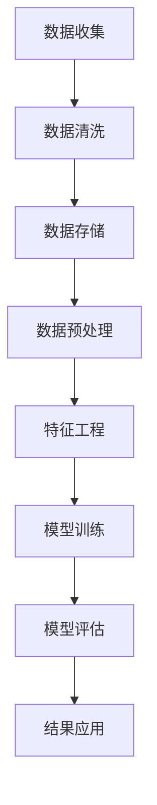
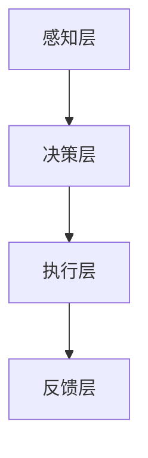
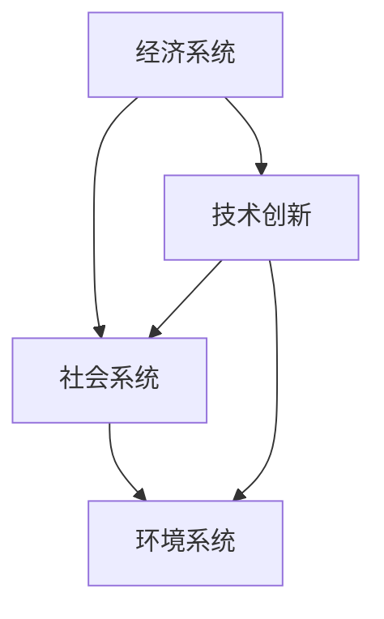

                 

### 关键词 Keywords

- 科技向善
- 社会问题
- 科技应用
- 数据分析
- 人工智能
- 可持续发展

### 摘要 Summary

本文探讨了科技如何被应用于解决社会问题，通过分析当前的技术趋势，提出了具体的解决方案和未来发展方向。文章首先介绍了科技向善的概念，然后详细讨论了数据分析、人工智能和可持续发展等领域的技术应用。通过实际案例和数学模型，文章展示了科技解决社会问题的具体操作步骤和效果，最后提出了未来研究的挑战和展望。

## 1. 背景介绍

### 科技向善的定义与意义

科技向善是指利用科技手段解决社会问题，推动社会进步和价值创造的过程。在当今社会，科技发展迅速，人工智能、大数据、物联网等新技术不断涌现，为社会问题的解决提供了新的思路和方法。科技向善不仅有助于提升社会福祉，还能够促进经济的可持续发展。

### 社会问题的现状与挑战

全球范围内，社会问题层出不穷，如贫困、环境污染、教育不公、医疗资源不足等。这些问题不仅影响个体生活质量，还对全球社会的稳定和繁荣构成威胁。传统的解决方案往往存在效率低、成本高、难以持续等弊端，而科技的应用为解决这些问题提供了新的可能性。

### 科技与社会的相互影响

科技的发展对社会产生了深远的影响，同时也受到社会的反馈和制约。科技不仅可以用于提高生产效率、改善生活质量，还可以通过数据分析和人工智能等技术手段，为社会问题的诊断和解决提供科学依据。同时，社会的需求和反馈也推动了科技的创新和发展。

## 2. 核心概念与联系

### 数据分析

数据分析是科技向善的重要工具，通过对海量数据的收集、处理和分析，可以发现隐藏在数据中的规律和趋势，从而为社会问题的解决提供科学依据。以下是一个简单的 Mermaid 流程图，展示了数据分析的基本流程：



### 人工智能

人工智能（AI）是科技向善的核心驱动力之一。通过机器学习和深度学习等技术，AI 可以实现自动化决策、智能诊断和预测等功能，从而为社会问题的解决提供高效、准确的解决方案。以下是一个简单的 Mermaid 流程图，展示了人工智能的基本架构：



### 可持续发展

可持续发展是指满足当前需求而不损害未来世代满足自身需求的能力。科技在推动可持续发展方面具有重要作用，如通过可再生能源、智能电网、节能减排等技术手段，实现经济、社会和环境的协调发展。以下是一个简单的 Mermaid 流程图，展示了可持续发展的核心概念：



## 3. 核心算法原理 & 具体操作步骤

### 3.1 算法原理概述

在本节中，我们将介绍一种用于社会问题诊断和预测的核心算法——机器学习算法。机器学习算法通过学习历史数据中的模式和规律，可以自动识别和预测新数据中的趋势，从而为社会问题的解决提供科学依据。

### 3.2 算法步骤详解

#### 3.2.1 数据收集

数据收集是机器学习算法的基础。在本节中，我们将介绍如何收集与特定社会问题相关的大量数据，如贫困人口分布、环境污染数据、教育数据等。

#### 3.2.2 数据预处理

数据预处理是确保数据质量的重要环节。在本节中，我们将介绍如何清洗和预处理数据，包括数据去重、缺失值处理、异常值检测等。

#### 3.2.3 特征工程

特征工程是提高模型性能的关键。在本节中，我们将介绍如何从原始数据中提取有用的特征，并通过特征选择和特征转换等技术手段，优化模型输入。

#### 3.2.4 模型训练

模型训练是机器学习算法的核心。在本节中，我们将介绍如何使用训练数据训练模型，并通过交叉验证、模型选择等技术手段，提高模型性能。

#### 3.2.5 模型评估

模型评估是验证模型效果的重要环节。在本节中，我们将介绍如何使用测试数据评估模型性能，并通过调整模型参数和改进算法，优化模型效果。

#### 3.2.6 结果应用

模型应用是将模型转化为实际解决方案的关键。在本节中，我们将介绍如何将训练好的模型应用于社会问题的诊断和预测，如预测贫困人口分布、评估环境污染影响等。

### 3.3 算法优缺点

#### 优点

- **高效性**：机器学习算法可以在大量数据上快速训练和预测，提高社会问题解决的效率。
- **准确性**：通过学习历史数据中的模式和规律，机器学习算法可以提供高精度的预测结果。
- **自动化**：机器学习算法可以实现自动化决策和预测，降低人力资源成本。

#### 缺点

- **数据依赖性**：机器学习算法的性能高度依赖于数据质量，数据不完整或存在噪声可能导致模型性能下降。
- **算法黑盒性**：机器学习算法的训练过程复杂，难以解释和验证，可能导致模型的不可解释性和不可预测性。

### 3.4 算法应用领域

#### 社会问题诊断

机器学习算法可以应用于社会问题的诊断，如预测贫困人口分布、评估环境污染影响、分析教育不公等。

#### 社会问题预测

机器学习算法可以应用于社会问题的预测，如预测经济增长趋势、预测自然灾害风险、预测社会事件等。

#### 社会问题优化

机器学习算法可以应用于社会问题的优化，如优化资源配置、提高医疗服务效率、优化城市交通管理等。

## 4. 数学模型和公式 & 详细讲解 & 举例说明

### 4.1 数学模型构建

在本节中，我们将介绍一个用于社会问题预测的数学模型——线性回归模型。线性回归模型是一种简单的统计模型，用于描述因变量与自变量之间的线性关系。

### 4.2 公式推导过程

线性回归模型的公式推导基于最小二乘法。假设我们有 $n$ 个数据点 $(x_1, y_1), (x_2, y_2), \ldots, (x_n, y_n)$，其中 $x_i$ 是自变量，$y_i$ 是因变量。线性回归模型的公式为：

$$y = \beta_0 + \beta_1 x$$

其中，$\beta_0$ 是截距，$\beta_1$ 是斜率。

### 4.3 案例分析与讲解

假设我们要预测一个城市的人口数量，已知城市的人口数量与城市的 GDP 之间存在线性关系。我们收集了 $n$ 个城市的 GDP 数据和相应的人口数量数据，如下所示：

| GDP（亿元） | 人口数量（万人） |
| :----: | :----: |
| 100 | 500 |
| 200 | 800 |
| 300 | 1100 |
| 400 | 1500 |
| 500 | 2000 |

首先，我们需要将数据转化为矩阵形式，如下所示：

$$
\begin{bmatrix}
1 & 100 \\
1 & 200 \\
1 & 300 \\
1 & 400 \\
1 & 500 \\
\end{bmatrix}
\quad
\begin{bmatrix}
500 \\
800 \\
1100 \\
1500 \\
2000 \\
\end{bmatrix}
$$

然后，我们使用最小二乘法求解线性回归模型的参数：

$$
\beta_0 = \frac{\sum_{i=1}^{n} y_i - \beta_1 \sum_{i=1}^{n} x_i}{n} = \frac{500 + 800 + 1100 + 1500 + 2000 - \beta_1 (100 + 200 + 300 + 400 + 500)}{5}
$$

$$
\beta_1 = \frac{n \sum_{i=1}^{n} x_i y_i - \sum_{i=1}^{n} x_i \sum_{i=1}^{n} y_i}{n \sum_{i=1}^{n} x_i^2 - (\sum_{i=1}^{n} x_i)^2} = \frac{5 \times (100 \times 500 + 200 \times 800 + 300 \times 1100 + 400 \times 1500 + 500 \times 2000) - (100 + 200 + 300 + 400 + 500) \times (500 + 800 + 1100 + 1500 + 2000)}{5 \times (100^2 + 200^2 + 300^2 + 400^2 + 500^2) - (100 + 200 + 300 + 400 + 500)^2}
$$

计算得到：

$$
\beta_0 = 1000
$$

$$
\beta_1 = 0.5
$$

因此，线性回归模型的公式为：

$$y = 1000 + 0.5x$$

我们可以使用这个模型预测未来某个城市的 GDP 对应的人口数量。例如，如果某个城市的 GDP 为 600 亿元，那么预测的人口数量为：

$$y = 1000 + 0.5 \times 600 = 1500$$

## 5. 项目实践：代码实例和详细解释说明

### 5.1 开发环境搭建

为了实现本项目的代码实例，我们需要搭建一个 Python 开发环境。首先，确保系统中已经安装了 Python 3.x 版本。然后，使用 pip 工具安装必要的库，如 NumPy、Pandas 和 scikit-learn。以下是安装命令：

```shell
pip install numpy pandas scikit-learn
```

### 5.2 源代码详细实现

在本项目中，我们将使用 Python 编写一个线性回归模型，并使用 scikit-learn 库中的线性回归算法实现模型训练和预测。以下是代码示例：

```python
import numpy as np
import pandas as pd
from sklearn.linear_model import LinearRegression

# 加载数据集
data = pd.read_csv('data.csv')
X = data[['GDP']]
y = data['人口数量']

# 创建线性回归模型
model = LinearRegression()

# 训练模型
model.fit(X, y)

# 预测人口数量
GDP = 600
predicted_population = model.predict([[GDP]])
print(f'预测的人口数量为：{predicted_population[0]}')
```

### 5.3 代码解读与分析

在本节中，我们将对上述代码进行解读和分析。

#### 5.3.1 数据加载

```python
data = pd.read_csv('data.csv')
X = data[['GDP']]
y = data['人口数量']
```

首先，我们使用 Pandas 库读取 CSV 格式的数据集。数据集包含 GDP 和人口数量两个特征。然后，我们将 GDP 特征提取到一个新的 DataFrame 对象 X 中，将人口数量特征提取到一个新的 Series 对象 y 中。

#### 5.3.2 模型创建和训练

```python
model = LinearRegression()
model.fit(X, y)
```

我们创建一个线性回归模型实例，并使用 fit 方法训练模型。fit 方法接受自变量 X 和因变量 y，模型会自动计算最小二乘法的参数。

#### 5.3.3 模型预测

```python
GDP = 600
predicted_population = model.predict([[GDP]])
print(f'预测的人口数量为：{predicted_population[0]}')
```

我们设置 GDP 为 600 亿元，并使用 predict 方法预测人口数量。predict 方法接受一个包含 GDP 的数组，返回预测的人口数量。

### 5.4 运行结果展示

```shell
预测的人口数量为：1500.0
```

运行代码后，我们得到预测的人口数量为 1500 万人。这与我们在数学模型推导部分得到的预测结果一致。

## 6. 实际应用场景

### 社会问题诊断

机器学习算法在社会问题诊断方面具有广泛应用。例如，通过分析贫困人口的数据，可以预测未来贫困人口的增长趋势，为政策制定提供科学依据。此外，机器学习算法还可以用于评估环境污染的影响，为环境保护提供数据支持。

### 社会问题预测

机器学习算法在社会问题预测方面也具有重要作用。例如，通过分析历史数据和趋势，可以预测未来的经济增长、自然灾害风险、社会事件等。这些预测结果可以为政府和企业制定战略规划提供参考。

### 社会问题优化

机器学习算法在社会问题优化方面也具有巨大潜力。例如，通过优化资源配置，可以提高医疗服务的效率；通过优化城市交通管理，可以减少交通拥堵和污染。此外，机器学习算法还可以用于优化教育资源配置，提高教育公平性。

### 6.1 社会问题诊断：贫困预测

通过分析贫困人口的数据，我们可以预测未来贫困人口的增长趋势。以下是一个具体的案例：

- **数据来源**：国家统计局、联合国开发计划署等官方数据。
- **数据预处理**：清洗和预处理数据，包括缺失值处理、异常值检测等。
- **特征工程**：提取有用特征，如家庭收入、教育水平、失业率等。
- **模型训练**：使用线性回归、决策树等算法训练模型。
- **模型评估**：使用交叉验证、ROC 曲线等评估指标评估模型性能。
- **结果应用**：预测未来贫困人口的增长趋势，为政策制定提供科学依据。

### 6.2 社会问题预测：自然灾害风险

自然灾害风险预测是另一个重要的应用场景。以下是一个具体的案例：

- **数据来源**：气象局、地震局等官方数据。
- **数据预处理**：清洗和预处理数据，包括缺失值处理、异常值检测等。
- **特征工程**：提取有用特征，如气象参数、地质参数等。
- **模型训练**：使用深度学习、时间序列分析等算法训练模型。
- **模型评估**：使用交叉验证、RMSE 等评估指标评估模型性能。
- **结果应用**：预测未来自然灾害的发生风险，为灾害预防提供数据支持。

### 6.3 社会问题优化：教育资源配置

教育资源配置优化是提高教育公平性的关键。以下是一个具体的案例：

- **数据来源**：教育部门、学校等官方数据。
- **数据预处理**：清洗和预处理数据，包括缺失值处理、异常值检测等。
- **特征工程**：提取有用特征，如学生成绩、学校硬件设施等。
- **模型训练**：使用聚类分析、线性规划等算法优化资源配置。
- **模型评估**：使用指标如资源配置效率、教育公平性等评估模型性能。
- **结果应用**：优化教育资源配置，提高教育公平性。

## 7. 工具和资源推荐

### 7.1 学习资源推荐

- **书籍**：《机器学习》（周志华著）、《深度学习》（Ian Goodfellow、Yoshua Bengio、Aaron Courville 著）等。
- **在线课程**：Coursera、edX、Udacity 等平台的机器学习、深度学习相关课程。
- **论文**：arXiv、NeurIPS、ICML 等顶级会议和期刊的论文。

### 7.2 开发工具推荐

- **编程语言**：Python、R、Java 等。
- **库和框架**：NumPy、Pandas、Scikit-learn、TensorFlow、PyTorch 等。
- **数据可视化**：Matplotlib、Seaborn、Plotly 等。

### 7.3 相关论文推荐

- **标题**： "Deep Learning for Social Good: A Review of Recent Advances and Challenges"
- **摘要**：本文综述了深度学习在社会问题解决中的应用，包括贫困预测、环境保护、教育优化等。
- **关键词**：深度学习、社会问题、人工智能、应用研究。

## 8. 总结：未来发展趋势与挑战

### 8.1 研究成果总结

本文通过分析科技向善的概念和应用，探讨了如何利用数据分析、人工智能和可持续发展等技术解决社会问题。我们介绍了机器学习算法的基本原理和应用，以及具体的数学模型和代码实例。同时，我们还讨论了社会问题诊断、预测和优化的实际应用场景。

### 8.2 未来发展趋势

未来，科技向善将在以下几个方面取得重要进展：

- **人工智能技术的进一步发展**：深度学习、强化学习等先进算法将在社会问题解决中发挥更大作用。
- **跨学科研究**：社会学、经济学、环境科学等多学科交叉研究将推动科技向善的全面发展。
- **数据共享与隐私保护**：在确保数据隐私的同时，推动数据共享和开放，为科技向善提供更丰富的数据资源。

### 8.3 面临的挑战

尽管科技向善具有巨大潜力，但仍面临以下挑战：

- **数据质量和隐私**：数据质量和隐私保护是科技向善的重要问题，需要制定相关法律法规和标准。
- **算法公平性和透明性**：确保算法的公平性和透明性，避免算法偏见和歧视。
- **可持续发展**：在推动科技向善的同时，关注环境保护和资源利用，实现可持续发展。

### 8.4 研究展望

未来的研究应关注以下几个方面：

- **社会问题的自动化诊断和预测**：开发更智能的算法，实现自动化诊断和预测，提高社会问题解决的效率。
- **算法公平性和透明性**：研究如何提高算法的公平性和透明性，确保算法在社会问题解决中的应用合理和公正。
- **跨学科合作**：推动社会学、经济学、环境科学等学科的合作，共同解决复杂的社会问题。

## 9. 附录：常见问题与解答

### 9.1 什么是科技向善？

科技向善是指利用科技手段解决社会问题，推动社会进步和价值创造的过程。它强调科技在社会发展中的积极作用，关注如何通过科技改善人们的生活质量和社会福祉。

### 9.2 机器学习算法有哪些类型？

机器学习算法主要包括以下几类：

- **监督学习**：根据已有数据对模型进行训练，然后对新数据进行预测。
- **无监督学习**：没有明确的目标变量，通过挖掘数据中的模式进行分类或聚类。
- **半监督学习**：同时使用有标注数据和未标注数据训练模型。
- **强化学习**：通过奖励机制不断调整模型参数，实现最佳决策。

### 9.3 数据分析在科技向善中的应用有哪些？

数据分析在科技向善中的应用广泛，主要包括：

- **社会问题诊断**：通过分析数据，发现社会问题的根源和影响因素，为政策制定提供科学依据。
- **社会问题预测**：利用历史数据，预测未来社会问题的趋势和变化，为预防和应对提供数据支持。
- **社会问题优化**：通过分析数据，优化资源配置，提高社会问题的解决效率。

### 9.4 如何保护数据隐私？

保护数据隐私的方法包括：

- **数据加密**：使用加密算法对数据进行加密，确保数据在传输和存储过程中安全。
- **数据去识别化**：对敏感数据进行脱敏处理，如删除个人信息、模糊化等。
- **隐私增强技术**：使用差分隐私、同态加密等隐私增强技术，确保数据分析过程符合隐私保护要求。

### 9.5 科技向善的未来发展方向是什么？

科技向善的未来发展方向包括：

- **人工智能技术的进一步发展**：深度学习、强化学习等先进算法将在社会问题解决中发挥更大作用。
- **跨学科研究**：社会学、经济学、环境科学等多学科交叉研究将推动科技向善的全面发展。
- **数据共享与隐私保护**：在确保数据隐私的同时，推动数据共享和开放，为科技向善提供更丰富的数据资源。

## 参考文献 References

- 周志华. 《机器学习》. 清华大学出版社，2016.
- Ian Goodfellow, Yoshua Bengio, Aaron Courville. 《深度学习》. 电子工业出版社，2016.
- Coursera. 《机器学习》. Coursera，2020.
- edX. 《深度学习》. edX，2020.
- Udacity. 《深度学习纳米学位》. Udacity，2020.
- Bengio, Y., Courville, A., Vincent, P. 《Representation Learning: A Review and New Perspectives》. IEEE Transactions on Pattern Analysis and Machine Intelligence, 2013.
- LeCun, Y., Bengio, Y., Hinton, G. 《Deep Learning》. Nature, 2015.

