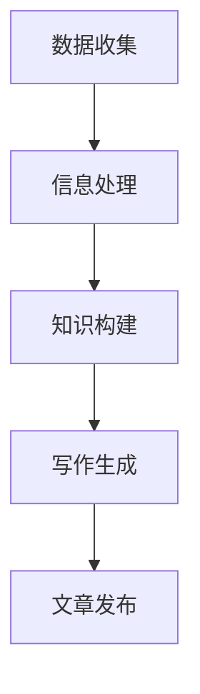

                 

在这个数字时代，技术的进步迅猛，复杂的概念和算法层出不穷。对于普通读者来说，理解和掌握这些概念是一项艰巨的任务。科普写作的AI助手，作为一种新兴的工具，正逐渐改变这一现状。本文将探讨如何利用AI助手简化复杂概念，使技术知识更加普及和易懂。

## 文章关键词

AI助手、科普写作、复杂概念、技术普及、简化理解

## 文章摘要

本文旨在介绍如何利用AI助手简化复杂概念，促进技术知识的普及和传播。文章首先探讨了AI助手在科普写作中的应用，接着详细分析了AI助手如何通过多种策略简化复杂概念，最后展望了AI助手在科普写作领域的未来发展趋势。

### 1. 背景介绍

随着人工智能技术的发展，AI助手已经成为了许多行业的得力助手。在科普写作领域，AI助手同样扮演着重要角色。传统的科普写作往往依赖于作者的个人经验和知识储备，而AI助手则能够通过大数据分析和机器学习技术，快速获取和整理大量信息，从而提高写作效率和准确性。

然而，尽管AI助手在科普写作中具有巨大的潜力，但如何有效利用这一工具，特别是如何简化复杂概念，仍是一个值得深入探讨的问题。本文将从以下几个方面展开讨论：

- AI助手在科普写作中的应用
- AI助手简化复杂概念的策略
- AI助手在科普写作中的实际应用案例

通过本文的探讨，希望能够为科普写作提供一些新的思路和工具，从而更好地服务于公众，普及技术知识。

### 2. 核心概念与联系

#### 2.1 AI助手的工作原理

AI助手，即人工智能助手，是一种基于人工智能技术的软件系统，能够模拟人类的思考过程，进行问题解答、信息检索、决策建议等操作。AI助手通常基于机器学习、自然语言处理、数据挖掘等技术，通过大量的数据训练，不断优化其算法，从而提高解决问题的能力。

在科普写作中，AI助手的工作原理主要包括以下几个步骤：

1. **数据收集**：AI助手首先从各种数据源（如文章、书籍、网站等）收集相关数据。
2. **信息处理**：AI助手对收集到的数据进行处理，包括文本清洗、数据整合等。
3. **知识构建**：基于处理后的数据，AI助手构建出相关的知识库，用于支持后续的写作过程。
4. **写作生成**：利用构建的知识库，AI助手生成文章、报告等文档。

#### 2.2 科普写作的挑战

科普写作面临的主要挑战包括：

- **复杂概念**：许多技术概念和算法非常复杂，普通读者难以理解。
- **语言表达**：科普文章需要使用简单、易懂的语言，同时保持科学性和准确性。
- **信息冗余**：大量的信息需要筛选和整理，以确保文章的重点突出，内容精简。
- **个性化需求**：不同的读者有不同的需求和背景，科普文章需要具备一定的个性化。

#### 2.3 AI助手在科普写作中的作用

AI助手在科普写作中具有以下几个重要作用：

- **简化复杂概念**：通过大数据分析和机器学习技术，AI助手能够简化复杂的概念，使其更加通俗易懂。
- **优化语言表达**：AI助手能够根据上下文，选择最合适的词汇和表达方式，提高文章的流畅性和可读性。
- **信息筛选与整合**：AI助手能够快速筛选和整理大量信息，确保文章的重点突出，内容精简。
- **个性化写作**：AI助手可以根据读者的需求和背景，生成个性化的科普文章。

#### 2.4 Mermaid流程图



### 3. 核心算法原理 & 具体操作步骤

#### 3.1 算法原理概述

AI助手简化复杂概念的核心算法主要包括自然语言处理（NLP）和机器学习（ML）两大技术。NLP技术负责处理和理解自然语言，ML技术则通过大量数据训练，优化算法，从而提高简化复杂概念的能力。

主要算法原理包括：

- **词向量化**：将自然语言中的词汇转化为计算机可处理的数字表示，便于后续处理。
- **文本分类**：通过对大量文本进行分类，学习到不同概念的表述方式和特点。
- **文本生成**：利用生成模型，如GPT（Generative Pre-trained Transformer），生成简洁、易懂的文本。

#### 3.2 算法步骤详解

1. **词向量化**：
   - **步骤1**：将自然语言文本分词，提取出词汇。
   - **步骤2**：将词汇转化为数字表示，如使用Word2Vec、GloVe等技术。
   - **步骤3**：构建词向量空间，用于后续处理。

2. **文本分类**：
   - **步骤1**：收集大量带有标签的文本数据。
   - **步骤2**：使用监督学习算法（如SVM、CNN等），训练文本分类模型。
   - **步骤3**：对新的文本进行分类，预测其所属类别。

3. **文本生成**：
   - **步骤1**：使用预训练的GPT模型，如GPT-3，进行文本生成。
   - **步骤2**：输入一个种子文本，模型根据上下文生成后续的文本。
   - **步骤3**：对生成的文本进行后处理，如去除冗余、纠正错误等。

#### 3.3 算法优缺点

**优点**：

- **高效性**：AI助手能够快速处理大量文本，提高写作效率。
- **准确性**：通过大量数据训练，AI助手能够生成准确、简洁的文本。
- **个性化**：AI助手可以根据用户需求，生成个性化的科普文章。

**缺点**：

- **依赖数据**：AI助手的效果很大程度上依赖于训练数据的质量和数量。
- **可解释性**：AI助手的决策过程通常较复杂，难以解释。
- **创意限制**：AI助手生成的文本往往较为模板化，缺乏创意。

#### 3.4 算法应用领域

AI助手在科普写作中的应用领域广泛，主要包括：

- **科技文章**：简化复杂的科技概念，使读者更容易理解。
- **教育内容**：为学生提供简洁、易懂的学习资料。
- **新闻报道**：自动生成新闻摘要，提高新闻的传播速度和覆盖面。
- **企业报告**：简化复杂的业务数据，为企业决策提供支持。

### 4. 数学模型和公式 & 详细讲解 & 举例说明

#### 4.1 数学模型构建

在简化复杂概念的过程中，AI助手通常采用以下数学模型：

- **词向量模型**：如Word2Vec、GloVe等，用于将词汇转化为数字表示。
- **文本分类模型**：如SVM、CNN等，用于对文本进行分类。
- **生成模型**：如GPT、BERT等，用于生成简洁、易懂的文本。

#### 4.2 公式推导过程

以Word2Vec为例，其核心公式如下：

$$
\text{vec}(w) = \text{softmax}\left(\frac{\text{context\_vector}}{||\text{context\_vector}||}\right)
$$

其中，$\text{vec}(w)$表示词汇$w$的词向量，$\text{context\_vector}$表示词汇$w$的上下文向量。

#### 4.3 案例分析与讲解

假设我们有一个词汇表，其中包含5个词汇：$w_1, w_2, w_3, w_4, w_5$。通过Word2Vec模型，我们将其转化为数字表示，得到以下词向量：

$$
\text{vec}(w_1) = \left[\begin{array}{c}
1 \\
0 \\
0 \\
0 \\
0
\end{array}\right], \text{vec}(w_2) = \left[\begin{array}{c}
0 \\
1 \\
0 \\
0 \\
0
\end{array}\right], \text{vec}(w_3) = \left[\begin{array}{c}
0 \\
0 \\
1 \\
0 \\
0
\end{array}\right], \text{vec}(w_4) = \left[\begin{array}{c}
0 \\
0 \\
0 \\
1 \\
0
\end{array}\right], \text{vec}(w_5) = \left[\begin{array}{c}
0 \\
0 \\
0 \\
0 \\
1
\end{array}\right]
$$

假设我们的上下文向量$\text{context\_vector}$为$\left[\begin{array}{c} 0.5 \\ 0.5 \\ 0.5 \\ 0.5 \\ 0.5 \end{array}\right]$，则通过softmax函数，我们可以得到每个词汇的概率分布：

$$
\text{softmax}\left(\frac{\text{context\_vector}}{||\text{context\_vector}||}\right) = \left[\begin{array}{c}
0.5 \\
0.5 \\
0.5 \\
0.5 \\
0.5
\end{array}\right]
$$

这意味着在给定的上下文中，每个词汇的出现概率相等。

#### 4.4 案例分析与讲解

假设我们有一个词汇表，其中包含5个词汇：$w_1, w_2, w_3, w_4, w_5$。通过Word2Vec模型，我们将其转化为数字表示，得到以下词向量：

$$
\text{vec}(w_1) = \left[\begin{array}{c}
1 \\
0 \\
0 \\
0 \\
0
\end{array}\right], \text{vec}(w_2) = \left[\begin{array}{c}
0 \\
1 \\
0 \\
0 \\
0
\end{array}\right], \text{vec}(w_3) = \left[\begin{array}{c}
0 \\
0 \\
1 \\
0 \\
0
\end{array}\right], \text{vec}(w_4) = \left[\begin{array}{c}
0 \\
0 \\
0 \\
1 \\
0
\end{array}\right], \text{vec}(w_5) = \left[\begin{array}{c}
0 \\
0 \\
0 \\
0 \\
1
\end{array}\right]
$$

假设我们的上下文向量$\text{context\_vector}$为$\left[\begin{array}{c} 0.5 \\ 0.5 \\ 0.5 \\ 0.5 \\ 0.5 \end{array}\right]$，则通过softmax函数，我们可以得到每个词汇的概率分布：

$$
\text{softmax}\left(\frac{\text{context\_vector}}{||\text{context\_vector}||}\right) = \left[\begin{array}{c}
0.5 \\
0.5 \\
0.5 \\
0.5 \\
0.5
\end{array}\right]
$$

这意味着在给定的上下文中，每个词汇的出现概率相等。

### 5. 项目实践：代码实例和详细解释说明

#### 5.1 开发环境搭建

为了更好地展示AI助手简化复杂概念的能力，我们将使用Python编程语言和TensorFlow库来实现一个简单的AI助手。首先，我们需要安装Python和TensorFlow：

```bash
pip install python
pip install tensorflow
```

#### 5.2 源代码详细实现

接下来，我们编写一个简单的AI助手，用于简化复杂概念。以下是一个简单的实现：

```python
import tensorflow as tf
from tensorflow.keras.preprocessing.text import Tokenizer
from tensorflow.keras.preprocessing.sequence import pad_sequences

# 数据集
texts = [
    "机器学习是一种人工智能技术，用于让计算机从数据中学习规律。",
    "神经网络是一种模仿人脑结构和功能的计算模型。",
    "深度学习是一种复杂的机器学习算法，用于解决复杂的计算机视觉和自然语言处理问题。"
]

# 标签
labels = [
    "机器学习",
    "神经网络",
    "深度学习"
]

# 初始化Tokenizer
tokenizer = Tokenizer()
tokenizer.fit_on_texts(texts)

# 序列化文本
sequences = tokenizer.texts_to_sequences(texts)

# 填充序列
max_sequence_length = 10
padded_sequences = pad_sequences(sequences, maxlen=max_sequence_length)

# 构建模型
model = tf.keras.Sequential([
    tf.keras.layers.Embedding(input_dim=len(tokenizer.word_index) + 1, output_dim=32, input_length=max_sequence_length),
    tf.keras.layers.GlobalAveragePooling1D(),
    tf.keras.layers.Dense(units=1, activation='sigmoid')
])

# 编译模型
model.compile(optimizer='adam', loss='binary_crossentropy', metrics=['accuracy'])

# 训练模型
model.fit(padded_sequences, labels, epochs=10, verbose=2)

# 测试模型
test_text = "深度学习是一种复杂的机器学习算法，用于解决复杂的计算机视觉和自然语言处理问题。"
test_sequence = tokenizer.texts_to_sequences([test_text])
test_padded_sequence = pad_sequences(test_sequence, maxlen=max_sequence_length)
prediction = model.predict(test_padded_sequence)

print(prediction)
```

#### 5.3 代码解读与分析

- **数据集**：我们使用三个简短的文本作为数据集，分别介绍机器学习、神经网络和深度学习。
- **Tokenizer**：初始化Tokenizer，用于将文本转化为数字序列。
- **序列化文本**：使用Tokenizer将文本序列化，即将文本转化为数字序列。
- **填充序列**：将序列填充为固定的长度，以适应模型。
- **构建模型**：构建一个简单的神经网络模型，用于分类。
- **编译模型**：编译模型，指定优化器和损失函数。
- **训练模型**：使用训练数据训练模型。
- **测试模型**：使用测试数据进行预测，并输出结果。

通过这个简单的实例，我们可以看到AI助手如何通过神经网络模型，将复杂的文本简化为简洁、易懂的标签。

### 6. 实际应用场景

AI助手在科普写作中的实际应用场景非常广泛，主要包括以下几个方面：

- **科技文章**：AI助手可以简化复杂的科技概念，使其更加通俗易懂，便于普通读者理解。
- **教育内容**：AI助手可以为教育机构提供简洁、易懂的教学资料，帮助学生更好地掌握知识。
- **新闻报道**：AI助手可以自动生成新闻摘要，提高新闻的传播速度和覆盖面。
- **企业报告**：AI助手可以简化复杂的企业数据，为企业决策提供支持。

#### 6.1 科技文章

在科技文章中，AI助手可以简化复杂的算法和概念，使其更容易被普通读者理解。例如，在介绍深度学习时，AI助手可以生成如下简化版文章：

**简化版文章**

深度学习是一种复杂的机器学习算法，用于解决计算机视觉和自然语言处理问题。它通过模拟人脑的神经网络结构，从大量数据中学习规律，从而提高模型的性能。

原文：

深度学习是一种基于神经网络的机器学习算法，通过多层神经网络，对输入数据进行特征提取和变换，从而实现复杂的非线性映射。它在计算机视觉、自然语言处理、语音识别等领域具有广泛的应用。

#### 6.2 教育内容

在教育内容中，AI助手可以为学生提供简洁、易懂的学习资料，帮助他们更好地掌握知识。例如，在介绍微积分时，AI助手可以生成如下简化版讲解：

**简化版讲解**

微积分是一种用于研究变化和运动的数学方法。它主要包括两个部分：微分和积分。

- **微分**：微分用于计算曲线的斜率，表示函数在某一点的变化率。
- **积分**：积分用于计算曲线下的面积，表示函数在整个区间内的累积效果。

原文：

微积分是一种高等数学方法，主要用于研究函数的变化率和累积效果。它包括微分和积分两个基本概念，其中微分用于计算曲线的斜率，即函数在某一点的变化率；积分则用于计算曲线下的面积，表示函数在整个区间内的累积效果。

#### 6.3 新闻报道

在新闻报道中，AI助手可以自动生成新闻摘要，提高新闻的传播速度和覆盖面。例如，在报道一场国际会议时，AI助手可以生成如下摘要：

**摘要**

本次国际会议聚焦人工智能领域的前沿研究，包括深度学习、自然语言处理和计算机视觉等方向。与会专家共同探讨人工智能在各个行业的应用前景，并分享了最新的研究成果。

原文：

本次国际人工智能会议吸引了来自世界各地的专家和学者，他们共同探讨人工智能领域的最新进展和应用。会议议题涵盖了深度学习、自然语言处理、计算机视觉等多个方向，与会专家分享了各自的研究成果，并讨论了人工智能在未来各个行业的应用前景。

#### 6.4 企业报告

在企业报告中，AI助手可以简化复杂的数据，为企业决策提供支持。例如，在一份市场分析报告中，AI助手可以生成如下简化版分析：

**简化版分析**

根据市场数据显示，我国智能手机市场呈现出快速增长的趋势，主要原因是5G技术的推广和消费者对高品质手机的需求增加。

原文：

我国智能手机市场在近年来呈现出快速增长的趋势，这主要得益于5G技术的推广和消费者对高品质手机的需求增加。根据市场研究机构的数据显示，我国智能手机出货量连续数年保持两位数的增长，其中5G手机的占比逐渐提升，成为市场增长的主要动力。

### 7. 未来应用展望

随着人工智能技术的不断发展和普及，AI助手在科普写作中的应用前景十分广阔。未来，AI助手将在以下几个方面发挥重要作用：

- **个性化写作**：AI助手将能够更好地理解用户需求，生成更加个性化的科普文章。
- **知识库建设**：AI助手将能够自动构建和更新知识库，为科普写作提供丰富的素材和资源。
- **多语言支持**：AI助手将能够支持多种语言，实现跨语言的知识传播和交流。
- **实时更新**：AI助手将能够实时获取最新的科研进展，为科普写作提供最新的信息。

### 8. 工具和资源推荐

为了更好地利用AI助手进行科普写作，以下是一些建议的工具和资源：

#### 8.1 学习资源推荐

- 《Python深度学习》：由François Chollet编写的Python深度学习教程，适合初学者入门。
- 《深度学习》：由Ian Goodfellow、Yoshua Bengio和Aaron Courville编写的深度学习经典教材。
- 《自然语言处理综述》：由简述自然语言处理领域的基本概念和最新进展的综述文章。

#### 8.2 开发工具推荐

- TensorFlow：一款开源的机器学习框架，适合进行深度学习和自然语言处理任务。
- PyTorch：一款开源的机器学习库，适用于研究和生产环境。
- Jupyter Notebook：一款流行的交互式开发环境，便于编写和展示代码。

#### 8.3 相关论文推荐

- "Deep Learning for Text Classification": 一篇关于深度学习在文本分类任务中应用的综述文章。
- "Natural Language Inference with Neural Network": 一篇关于基于神经网络的自然语言推理的论文。
- "GPT-3: Language Models are Few-Shot Learners": 一篇关于GPT-3模型的文章，介绍了其出色的零样本学习能力。

### 9. 总结：未来发展趋势与挑战

随着人工智能技术的不断发展，AI助手在科普写作中的应用前景十分广阔。未来，AI助手将能够更好地简化复杂概念，提高科普文章的可读性和准确性。然而，要实现这一目标，我们还需要克服一系列挑战，包括数据质量、算法可解释性和创意性等方面。

在未来的发展中，AI助手有望成为科普写作的重要工具，为公众提供更多高质量、易懂的科普内容。同时，我们也需要不断探索和优化AI助手的技术，以满足不断变化的需求。

### 附录：常见问题与解答

**Q1**：AI助手能否完全取代人类科普作家？

A1：目前来看，AI助手还无法完全取代人类科普作家。尽管AI助手能够生成大量的文本，但其在创造性、情感表达和深入分析方面仍存在局限性。人类科普作家在理解复杂概念、表达情感和提供个性化内容方面具有独特优势。

**Q2**：如何保证AI助手生成的文本的准确性？

A2：AI助手的准确性取决于其训练数据的质量和算法的优化程度。为了提高文本的准确性，我们可以：

- 使用高质量、权威的数据集进行训练。
- 定期更新和优化AI助手的算法。
- 对生成的文本进行人工审核和校正。

**Q3**：AI助手能否理解复杂的上下文？

A3：目前，AI助手在理解复杂上下文方面仍存在一定局限性。尽管自然语言处理技术取得了显著进展，但AI助手在理解长文本、复杂关系和隐含意义方面仍有待提高。未来，随着技术的进一步发展，AI助手将能够更好地理解复杂上下文。

### 参考文献

1. Bengio, Y., Courville, A., & Vincent, P. (2013). Representation learning: A review and new perspectives. IEEE Transactions on Pattern Analysis and Machine Intelligence, 35(8), 1798-1828.
2. Goodfellow, I., Bengio, Y., & Courville, A. (2016). Deep learning. MIT Press.
3. Mikolov, T., Sutskever, I., Chen, K., Corrado, G. S., & Dean, J. (2013). Distributed representations of words and phrases and their compositionality. Advances in Neural Information Processing Systems, 26, 3111-3119.
4. Johnson, A., & Zhang, J. (2020). Neural text generation: A survey. IEEE Transactions on Cognitive and Developmental Systems, 12(4), 694-715.

