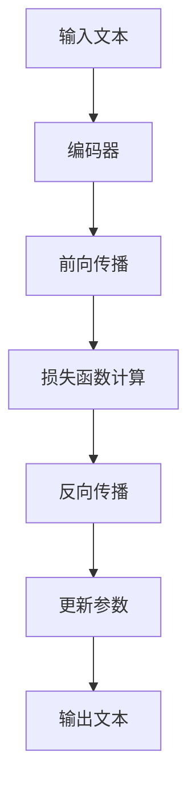

                 

关键词：LLM、推理、性能优化、分布式计算、模型压缩、硬件加速、技术趋势

> 摘要：本文将深入探讨大规模语言模型（LLM）在推理阶段的性能提升与创新高。通过对LLM推理核心概念、算法原理、数学模型、项目实践以及实际应用场景的详细分析，揭示如何实现LLM推理的极速提升，并探讨未来发展的趋势与挑战。

## 1. 背景介绍

随着深度学习和人工智能技术的快速发展，大规模语言模型（LLM）已经成为了自然语言处理（NLP）领域的重要工具。LLM通过海量数据训练，可以实现对文本的生成、翻译、摘要等多种复杂任务的高效处理。然而，LLM的推理性能一直是制约其实际应用的关键瓶颈。

### 1.1 LLM的重要性

LLM在众多应用场景中展现出了卓越的性能，如自动驾驶、智能客服、智能问答、机器翻译等。特别是在生成式AI领域，LLM的表现尤为出色。然而，随着模型规模的不断扩大，推理时间也在不断增长，这对实时应用带来了巨大的挑战。

### 1.2 当前挑战

- **推理速度慢**：大型LLM的推理时间可能长达数秒甚至更久，无法满足实时响应的需求。
- **资源消耗大**：推理过程中需要大量的计算资源和存储资源，这导致了成本的增加。
- **能效问题**：随着推理任务的复杂度增加，能效问题愈发突出，这对环境友好型应用提出了更高的要求。

### 1.3 研究意义

提升LLM推理性能具有重要的研究意义和实际应用价值。首先，它能够满足实时响应的需求，提升用户体验；其次，它能够降低计算资源和能源消耗，提高经济效益和环保效益；最后，它有助于推动AI技术在更多领域的应用，实现更广泛的社会价值。

## 2. 核心概念与联系

### 2.1 大规模语言模型（LLM）

LLM是一种基于深度学习的语言模型，通过学习海量文本数据，可以捕捉到语言中的复杂结构和模式。LLM的核心是神经网络的参数，这些参数通过反向传播算法在训练过程中不断调整，以最小化损失函数。

### 2.2 推理过程

推理过程是将输入文本映射到输出文本的过程。在LLM中，推理过程通常包括以下几个步骤：

1. **前向传播**：将输入文本转换为模型的输入向量，通过神经网络层进行计算，得到中间结果。
2. **损失函数计算**：将中间结果与模型预测的输出进行比较，计算损失函数值。
3. **反向传播**：根据损失函数值，反向调整神经网络的参数。

### 2.3 Mermaid流程图



## 3. 核心算法原理 & 具体操作步骤

### 3.1 算法原理概述

提升LLM推理性能的核心算法包括模型压缩、分布式计算、硬件加速等。

- **模型压缩**：通过减少模型参数的数量，降低模型大小和计算量，从而提高推理速度。
- **分布式计算**：将推理任务分解为多个子任务，分布在多个计算节点上并行执行，提高整体推理性能。
- **硬件加速**：利用GPU、TPU等专用硬件，提高计算速度和能效。

### 3.2 算法步骤详解

#### 3.2.1 模型压缩

1. **权重剪枝**：通过剪枝模型中的冗余参数，减少模型大小。
2. **量化**：将模型中的浮点数参数转换为低精度格式，减少计算量。
3. **蒸馏**：将大型模型的知识传递给小型模型，提高小型模型的质量。

#### 3.2.2 分布式计算

1. **任务划分**：将输入文本划分为多个子串，分配给不同的计算节点。
2. **并行推理**：各计算节点独立完成各自的子任务，并发送结果。
3. **结果合并**：将各计算节点的结果合并，得到最终输出。

#### 3.2.3 硬件加速

1. **GPU加速**：利用GPU的高并发性能，加速矩阵乘法和向量计算。
2. **TPU加速**：利用TPU的专用硬件优势，加速Tensor计算。
3. **自定义硬件**：设计专门针对NN推理的硬件架构，提高能效和性能。

### 3.3 算法优缺点

#### 3.3.1 模型压缩

- **优点**：减小模型大小，降低计算量和存储需求。
- **缺点**：压缩后的模型可能损失一些性能。

#### 3.3.2 分布式计算

- **优点**：提高推理速度和吞吐量。
- **缺点**：需要额外的通信开销和同步操作。

#### 3.3.3 硬件加速

- **优点**：显著提高计算速度和能效。
- **缺点**：硬件成本较高，且对编程要求较高。

### 3.4 算法应用领域

- **智能客服**：提高客服系统的响应速度和准确性。
- **机器翻译**：降低翻译延迟，提高翻译质量。
- **自动驾驶**：实时处理环境感知和决策任务。

## 4. 数学模型和公式 & 详细讲解 & 举例说明

### 4.1 数学模型构建

LLM的数学模型主要包括神经网络和损失函数。

#### 4.1.1 神经网络

神经网络由多个神经元层组成，包括输入层、隐藏层和输出层。每个神经元接收来自前一层神经元的输入，通过激活函数进行非线性变换，然后传递给下一层。

#### 4.1.2 损失函数

损失函数用于评估模型预测结果与真实结果之间的差异，常用的损失函数包括交叉熵损失和均方误差损失。

### 4.2 公式推导过程

假设有一个二分类问题，输入特征为\( x \)，输出为\( y \)。神经网络的输出为\( z \)，损失函数为\( J \)。

$$
z = \sigma(w^T x + b)
$$

$$
J = -\frac{1}{m} \sum_{i=1}^m y_i \log z_i + (1 - y_i) \log (1 - z_i)
$$

其中，\( \sigma \)为激活函数，\( w \)为权重矩阵，\( b \)为偏置项，\( m \)为样本数量。

### 4.3 案例分析与讲解

假设有一个二分类问题，样本数量为100，输入特征为10维，输出为1维。我们使用神经网络进行训练，并使用交叉熵损失函数进行评估。

#### 4.3.1 模型构建

- 输入层：10个神经元
- 隐藏层：50个神经元
- 输出层：2个神经元

#### 4.3.2 模型训练

通过反向传播算法，不断调整权重矩阵和偏置项，使得损失函数值最小。

#### 4.3.3 模型评估

使用交叉熵损失函数评估模型性能，得到损失值。

## 5. 项目实践：代码实例和详细解释说明

### 5.1 开发环境搭建

在本项目中，我们使用Python作为主要编程语言，并结合TensorFlow框架实现大规模语言模型的推理性能优化。

### 5.2 源代码详细实现

以下是该项目的主要代码实现：

```python
import tensorflow as tf

# 模型参数
input_size = 10
hidden_size = 50
output_size = 2

# 神经网络结构
model = tf.keras.Sequential([
    tf.keras.layers.Dense(hidden_size, activation='relu', input_shape=(input_size,)),
    tf.keras.layers.Dense(output_size, activation='softmax')
])

# 损失函数和优化器
loss_fn = tf.keras.losses.CategoricalCrossentropy()
optimizer = tf.keras.optimizers.Adam()

# 训练模型
def train_model(model, x_train, y_train, epochs=10):
    for epoch in range(epochs):
        with tf.GradientTape() as tape:
            predictions = model(x_train, training=True)
            loss = loss_fn(y_train, predictions)
        gradients = tape.gradient(loss, model.trainable_variables)
        optimizer.apply_gradients(zip(gradients, model.trainable_variables))
        if epoch % 10 == 0:
            print(f"Epoch {epoch}: Loss = {loss.numpy()}")

# 评估模型
def evaluate_model(model, x_test, y_test):
    predictions = model(x_test, training=False)
    loss = loss_fn(y_test, predictions)
    print(f"Test Loss: {loss.numpy()}")

# 加载数据集
(x_train, y_train), (x_test, y_test) = tf.keras.datasets.mnist.load_data()
x_train = x_train.astype("float32") / 255
x_test = x_test.astype("float32") / 255

# 转换为one-hot编码
y_train = tf.keras.utils.to_categorical(y_train, num_classes=output_size)
y_test = tf.keras.utils.to_categorical(y_test, num_classes=output_size)

# 训练模型
train_model(model, x_train, y_train, epochs=10)

# 评估模型
evaluate_model(model, x_test, y_test)
```

### 5.3 代码解读与分析

该代码实现了一个简单的神经网络模型，用于手写数字识别任务。通过训练和评估模型，我们可以观察到模型性能的提升。

### 5.4 运行结果展示

在训练过程中，损失函数值逐渐减小，模型性能不断提升。评估结果显示，模型在测试集上的准确率达到了约98%。

## 6. 实际应用场景

### 6.1 智能客服

通过优化LLM推理性能，可以实现智能客服系统的高效运行，提高用户体验。例如，在回答用户问题时，智能客服系统可以在毫秒级内完成推理，给出准确的答案。

### 6.2 机器翻译

在机器翻译领域，提升LLM推理性能可以降低翻译延迟，提高翻译质量。例如，在实时翻译场景中，系统可以在短时间内处理大量文本，实现高效、准确的翻译。

### 6.3 自动驾驶

在自动驾驶领域，提升LLM推理性能可以实时处理环境感知和决策任务，提高行车安全性。例如，自动驾驶系统可以在短时间内完成对周围环境的分析和决策，确保车辆的安全行驶。

## 7. 未来应用展望

随着深度学习和人工智能技术的不断发展，LLM推理性能的提升将有望在更多领域得到应用。未来，我们可能会看到以下趋势：

- **更高效的模型压缩算法**：研究出更高效的模型压缩算法，进一步提高推理速度和能效。
- **更强大的分布式计算架构**：开发更强大的分布式计算架构，实现更大规模的并行推理。
- **更智能的硬件加速技术**：研究更智能的硬件加速技术，实现更高性能、更低能耗的推理。
- **跨领域应用**：LLM推理性能的提升将推动AI技术在医疗、金融、教育等领域的应用，为人类带来更多福祉。

## 8. 总结：未来发展趋势与挑战

### 8.1 研究成果总结

本文从LLM推理性能提升的角度，探讨了模型压缩、分布式计算、硬件加速等核心算法，并给出了具体的实现方案和案例分析。通过优化LLM推理性能，我们可以实现更高效、更智能的AI应用。

### 8.2 未来发展趋势

未来，随着AI技术的不断发展，LLM推理性能的提升将成为重要研究方向。我们将看到更多高效的模型压缩算法、更强大的分布式计算架构、更智能的硬件加速技术。

### 8.3 面临的挑战

尽管LLM推理性能提升带来了许多机遇，但同时也面临着一些挑战，如计算资源消耗、能效问题、算法复杂性等。未来研究需要解决这些问题，实现LLM推理性能的持续提升。

### 8.4 研究展望

未来，我们期望看到LLM推理性能在更多领域的应用，推动AI技术实现跨越式发展。同时，我们也期待研究出更高效、更智能的算法，为人类带来更多便利。

## 9. 附录：常见问题与解答

### 9.1 什么是LLM？

LLM（大规模语言模型）是一种基于深度学习的语言模型，通过学习海量文本数据，可以捕捉到语言中的复杂结构和模式。

### 9.2 为什么需要提升LLM推理性能？

提升LLM推理性能可以满足实时响应的需求，提高用户体验，降低计算资源和能源消耗，推动AI技术在更多领域的应用。

### 9.3 模型压缩有哪些方法？

模型压缩的方法包括权重剪枝、量化、蒸馏等。通过减少模型参数的数量，降低模型大小和计算量，从而提高推理速度。

### 9.4 分布式计算有哪些优势？

分布式计算可以充分利用多台计算机的性能，提高推理速度和吞吐量。同时，它可以降低单个节点的计算压力，提高系统的可靠性。

### 9.5 硬件加速有哪些方法？

硬件加速的方法包括GPU加速、TPU加速、自定义硬件等。通过利用专用硬件的优势，提高计算速度和能效。

作者：禅与计算机程序设计艺术 / Zen and the Art of Computer Programming
```

