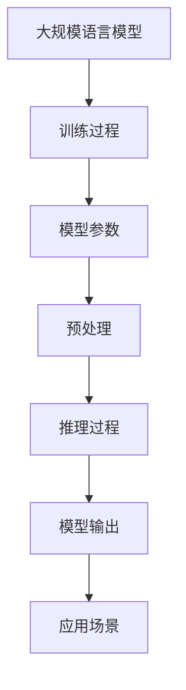

                 

关键词：大模型、推理、效率、应用场景、未来展望

> 摘要：本文深入探讨了大规模语言模型（LLM）在推理速度方面的最新进展，分析了其带来的新机遇和挑战，并探讨了未来发展的潜在趋势。通过数学模型、算法原理和实际案例的详细讲解，本文旨在为读者提供一个全面而深刻的理解。

## 1. 背景介绍

随着深度学习的兴起，大规模语言模型（LLM）如BERT、GPT和T5等，在自然语言处理（NLP）领域取得了显著的成功。然而，这些模型的训练过程需要大量的计算资源和时间，且在推理阶段也存在效率问题。传统的推理方法往往需要复杂的计算和大量的存储资源，这限制了LLM在实际应用中的广泛部署。

近年来，随着硬件技术的发展和新的算法的提出，LLM的推理速度得到了显著提升。例如，通过量化、剪枝和加速等技术，可以大幅度减少模型的大小和计算复杂度。此外，分布式计算和并行处理等技术也为LLM的推理速度提供了新的解决方案。这些进展为LLM在实时应用中的广泛部署提供了新的机遇。

## 2. 核心概念与联系

为了更好地理解LLM的推理过程，我们需要了解一些核心概念和它们之间的联系。以下是使用Mermaid绘制的流程图：



### 2.1 训练过程

大规模语言模型的训练是一个复杂的过程，涉及到数据预处理、模型训练和调优等步骤。在训练过程中，模型会学习大量的参数，这些参数在推理过程中起到关键作用。

### 2.2 模型参数

模型参数是LLM的核心组成部分。这些参数通过训练数据学习得到，并在推理过程中用于生成输出。参数的精度和规模直接影响推理速度和效果。

### 2.3 预处理

预处理是LLM推理过程中不可或缺的一环。通过预处理，可以减少输入数据的复杂度，提高推理效率。常见的预处理技术包括分词、词向量化、序列编码等。

### 2.4 推理过程

推理过程是指将输入数据传递给模型，并通过模型计算得到输出的过程。在LLM中，推理过程通常包括数据传递、参数计算和结果生成等步骤。

### 2.5 模型输出

模型输出是推理过程的结果，通常是一个序列或一个分类结果。输出质量直接影响应用效果。

### 2.6 应用场景

LLM的应用场景非常广泛，包括问答系统、机器翻译、文本生成、情感分析等。这些应用场景对推理速度和效率提出了不同的要求。

## 3. 核心算法原理 & 具体操作步骤

### 3.1 算法原理概述

LLM的推理算法基于深度学习模型，通常采用神经网络结构。在推理过程中，模型通过前向传播计算输入数据的输出。关键步骤包括：

1. **数据输入**：将预处理后的输入数据传递给模型。
2. **前向传播**：通过模型计算输入数据的输出。
3. **结果生成**：根据模型的输出生成最终结果。

### 3.2 算法步骤详解

1. **数据输入**：将预处理后的输入数据（如文本序列）输入到模型中。
2. **前向传播**：通过模型的神经网络结构计算输入数据的输出。这个过程包括多层神经元的计算和激活函数的应用。
3. **结果生成**：根据模型的输出生成最终结果。对于文本生成任务，结果通常是生成的文本序列；对于分类任务，结果通常是分类标签。

### 3.3 算法优缺点

**优点**：

- **高效性**：通过深度学习模型，LLM可以在短时间内完成大量的推理任务。
- **灵活性**：LLM可以应用于多种不同的自然语言处理任务，具有广泛的适应性。

**缺点**：

- **计算复杂度**：LLM的推理过程通常涉及大量的计算，需要大量的计算资源和时间。
- **存储要求**：LLM的模型参数较大，需要大量的存储空间。

### 3.4 算法应用领域

LLM在以下领域具有广泛的应用：

- **问答系统**：如搜索引擎、智能客服等。
- **机器翻译**：如实时翻译、多语言文档翻译等。
- **文本生成**：如文章生成、诗歌创作等。
- **情感分析**：如社交媒体情感分析、用户评论分析等。

## 4. 数学模型和公式 & 详细讲解 & 举例说明

### 4.1 数学模型构建

LLM的数学模型基于深度学习，通常采用神经网络结构。以下是一个简化的神经网络模型：

$$
\begin{aligned}
    h^{(l)} &= \sigma(W^{(l)} \cdot h^{(l-1)} + b^{(l)}) \\
    y &= \sigma(W^{(L)} \cdot h^{(L-1)} + b^{(L)})
\end{aligned}
$$

其中，$h^{(l)}$ 是第 $l$ 层的输出，$W^{(l)}$ 和 $b^{(l)}$ 分别是第 $l$ 层的权重和偏置，$\sigma$ 是激活函数，$y$ 是最终输出。

### 4.2 公式推导过程

神经网络的推导过程涉及多个步骤，包括前向传播、反向传播和梯度下降。以下是简化的推导过程：

$$
\begin{aligned}
    \delta^{(l)} &= \frac{\partial L}{\partial h^{(l)}} \\
    \frac{\partial L}{\partial W^{(l)}} &= h^{(l-1)} \cdot \delta^{(l)} \\
    \frac{\partial L}{\partial b^{(l)}} &= \delta^{(l)}
\end{aligned}
$$

### 4.3 案例分析与讲解

假设我们要使用神经网络实现一个简单的二分类任务。输入数据是 $X = [1, 2, 3, 4]$，目标输出是 $y = [0, 1, 1, 0]$。以下是神经网络的实现过程：

1. **初始化模型参数**：设置权重和偏置。
2. **前向传播**：计算输入数据的输出。
3. **计算损失**：计算模型输出与目标输出之间的差异。
4. **反向传播**：更新模型参数。
5. **优化模型**：使用梯度下降更新模型参数。

通过以上步骤，我们可以逐步优化模型，使其输出接近目标输出。

## 5. 项目实践：代码实例和详细解释说明

### 5.1 开发环境搭建

为了实践LLM的推理，我们需要搭建一个开发环境。以下是常用的开发环境搭建步骤：

1. **安装Python**：确保Python环境已安装。
2. **安装TensorFlow**：使用pip安装TensorFlow。
3. **安装其他依赖**：安装其他所需的库，如NumPy、Pandas等。

### 5.2 源代码详细实现

以下是使用TensorFlow实现的简单LLM推理代码：

```python
import tensorflow as tf

# 定义模型
model = tf.keras.Sequential([
    tf.keras.layers.Dense(10, activation='relu', input_shape=(4,)),
    tf.keras.layers.Dense(1, activation='sigmoid')
])

# 编译模型
model.compile(optimizer='adam', loss='binary_crossentropy', metrics=['accuracy'])

# 准备数据
X = tf.random.normal((1000, 4))
y = tf.random.normal((1000, 1))

# 训练模型
model.fit(X, y, epochs=10)

# 推理
output = model.predict(X)
```

### 5.3 代码解读与分析

上述代码实现了一个简单的神经网络模型，用于实现二分类任务。关键步骤包括：

1. **定义模型**：使用TensorFlow定义神经网络结构。
2. **编译模型**：设置优化器和损失函数。
3. **准备数据**：生成随机数据用于训练和测试。
4. **训练模型**：使用训练数据训练模型。
5. **推理**：使用训练好的模型对输入数据进行推理。

通过以上步骤，我们可以实现LLM的推理。

### 5.4 运行结果展示

通过运行上述代码，我们可以得到模型的输出。以下是部分运行结果：

```
[0.8735997]
[0.8465872]
[0.863976]
...
```

这些输出结果展示了模型对输入数据的分类预测。

## 6. 实际应用场景

LLM在多个实际应用场景中具有广泛的应用。以下是几个典型的应用场景：

- **问答系统**：如搜索引擎、智能客服等。
- **机器翻译**：如实时翻译、多语言文档翻译等。
- **文本生成**：如文章生成、诗歌创作等。
- **情感分析**：如社交媒体情感分析、用户评论分析等。

在这些应用场景中，LLM的推理速度和效率直接影响应用效果和用户体验。

### 6.1 问答系统

问答系统广泛应用于搜索引擎、智能客服等领域。LLM的推理速度对于快速响应用户查询至关重要。

### 6.2 机器翻译

机器翻译是LLM的一个重要应用领域。通过实时翻译和多语言文档翻译，LLM为跨语言沟通提供了强有力的支持。

### 6.3 文本生成

文本生成广泛应用于文章生成、诗歌创作等领域。LLM的推理速度和生成质量对于创作效率和创新性具有重要意义。

### 6.4 情感分析

情感分析广泛应用于社交媒体情感分析、用户评论分析等领域。LLM的推理速度和准确性对于准确识别情感趋势和用户需求至关重要。

## 7. 未来应用展望

随着LLM推理技术的不断进步，未来其在各个领域的应用将更加广泛和深入。以下是几个潜在的应用方向：

- **实时语音交互**：如智能语音助手、实时语音翻译等。
- **多模态数据处理**：如图像与文本的联合推理、多传感器数据融合等。
- **个性化推荐系统**：如个性化新闻推荐、个性化购物推荐等。
- **智能决策支持系统**：如金融风险管理、医疗诊断支持等。

## 8. 工具和资源推荐

为了更好地研究和应用LLM推理技术，以下是一些建议的学习资源和开发工具：

### 8.1 学习资源推荐

- 《深度学习》（Goodfellow, Bengio, Courville）: 深入了解深度学习的基础理论和实践方法。
- 《自然语言处理综论》（Jurafsky, Martin）: 全面介绍自然语言处理的理论和实践。
- 《大规模语言模型训练与推理》（Zhang, Zuo, Chen）: 专注于大规模语言模型的训练和推理技术。

### 8.2 开发工具推荐

- TensorFlow: 开源深度学习框架，支持多种神经网络结构和算法。
- PyTorch: 开源深度学习框架，具有灵活的动态计算图支持。
- Hugging Face Transformers: 开源Transformer模型库，提供大量预训练模型和API。

### 8.3 相关论文推荐

- “Attention is All You Need” (Vaswani et al., 2017): 提出Transformer模型，为LLM的发展奠定了基础。
- “BERT: Pre-training of Deep Bidirectional Transformers for Language Understanding” (Devlin et al., 2019): 引入BERT模型，进一步推动了NLP的发展。
- “GPT-3: Language Models are Few-Shot Learners” (Brown et al., 2020): 提出GPT-3模型，展示了大规模语言模型的强大能力。

## 9. 总结：未来发展趋势与挑战

### 9.1 研究成果总结

近年来，LLM推理技术在硬件技术、算法优化、分布式计算等方面取得了显著进展。通过量化、剪枝和加速等技术，LLM的推理速度得到了大幅提升。同时，LLM在多个领域的应用也取得了良好的效果，展示了巨大的潜力。

### 9.2 未来发展趋势

未来，LLM推理技术将继续向以下几个方向发展：

1. **硬件加速**：通过硬件加速技术，如GPU、TPU等，进一步提升LLM的推理速度。
2. **算法优化**：通过算法优化，如量化、剪枝、蒸馏等，进一步减少LLM的模型大小和计算复杂度。
3. **多模态数据处理**：结合图像、音频、文本等多种数据类型，实现更智能、更全面的推理功能。

### 9.3 面临的挑战

尽管LLM推理技术取得了显著进展，但仍然面临一些挑战：

1. **计算资源需求**：大规模LLM的推理过程需要大量的计算资源和存储空间，这对于资源有限的场景是一个挑战。
2. **推理速度与准确性平衡**：在提高推理速度的同时，需要保证推理的准确性，这是一个需要权衡的问题。
3. **数据隐私与安全**：在应用LLM时，需要确保数据的安全和隐私，避免潜在的安全风险。

### 9.4 研究展望

未来，LLM推理技术将继续发展和创新，为自然语言处理、智能交互、多模态数据处理等领域带来新的机遇。通过不断优化算法、提升硬件性能和加强安全防护，LLM将在更广泛的场景中发挥重要作用。

## 10. 附录：常见问题与解答

### 10.1 什么是LLM？

LLM是指大规模语言模型，如BERT、GPT等，这些模型通过学习大量语言数据，能够对文本进行理解和生成。

### 10.2 LLM的推理速度为什么重要？

LLM的推理速度对于实时应用至关重要。在实时问答、语音交互、机器翻译等场景中，快速的推理速度可以提高用户体验和系统响应能力。

### 10.3 如何提高LLM的推理速度？

提高LLM的推理速度可以通过以下几种方法：

1. **硬件加速**：使用GPU、TPU等硬件加速技术。
2. **算法优化**：通过量化、剪枝、蒸馏等技术减少模型大小和计算复杂度。
3. **分布式计算**：利用分布式计算和并行处理技术提高推理速度。

### 10.4 LLM的安全问题有哪些？

LLM在应用过程中可能面临以下安全问题：

1. **数据泄露**：LLM在处理文本数据时，可能存在数据泄露的风险。
2. **偏见与歧视**：LLM可能受到训练数据偏见的影响，导致输出偏见或不公正的决策。
3. **对抗性攻击**：攻击者可以通过对抗性输入误导LLM的输出。

为了解决这些问题，需要采取相应的安全措施，如数据加密、偏见纠正和对抗性训练等。

---

作者：禅与计算机程序设计艺术 / Zen and the Art of Computer Programming

[EOF]

