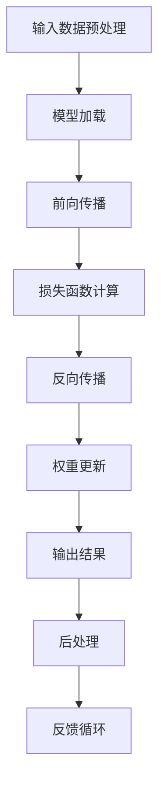

                 

关键词：LLM，推理速度，算法优化，高性能计算，技术前沿，未来趋势。

> 摘要：本文探讨了大规模语言模型（LLM）在秒级推理方面的技术进步与挑战，分析其核心算法原理、数学模型、实际应用场景以及未来发展趋势。本文旨在为读者提供一个全面的技术视角，帮助理解LLM在计算领域的重要变革。

## 1. 背景介绍

近年来，人工智能领域取得了显著的进步，特别是深度学习技术的广泛应用，使得计算机在各种任务上表现出色，从图像识别到自然语言处理。然而，随着模型规模的不断扩大，推理速度成为了一个关键瓶颈。传统的深度学习模型在处理大规模数据时，往往需要几分钟甚至几小时的时间，这在实时应用场景中显得不可接受。

为了解决这一问题，研究者们开始关注大规模语言模型（Large Language Models，简称LLM）的秒级推理。LLM是一种能够处理和理解自然语言的大型神经网络模型，其训练时间通常需要数天甚至数周。然而，当模型训练完成后，如何实现高效的推理成为了一个重要的研究方向。

本文将探讨LLM秒级推理的技术背景、核心算法、数学模型以及实际应用场景，并分析其未来发展的趋势和挑战。

### 1.1 大规模语言模型的发展历程

自2018年GPT-1发布以来，大规模语言模型（LLM）经历了快速的发展。GPT-3作为当前最具代表性的LLM，其参数规模已经达到了1750亿，可以处理复杂的自然语言任务，如文本生成、翻译、问答等。然而，随着模型规模的增加，其推理速度却成为了瓶颈。

### 1.2 秒级推理的需求

在许多实际应用场景中，如智能客服、实时翻译、在线教育等，要求系统能够在极短的时间内对用户输入做出响应。传统的深度学习模型无法满足这样的需求，因此，秒级推理成为了LLM研究的一个重要方向。

## 2. 核心概念与联系

### 2.1 核心概念

在探讨LLM秒级推理之前，我们需要了解一些核心概念：

- **大规模语言模型（LLM）**：一种参数规模庞大的神经网络模型，用于处理和理解自然语言。
- **推理（Inference）**：在给定输入数据的情况下，模型输出预测结果的过程。
- **秒级推理**：在1秒或更短的时间内完成推理过程。

### 2.2 Mermaid 流程图

以下是LLM秒级推理的Mermaid流程图：



### 2.3 核心概念之间的联系

LLM秒级推理的核心概念包括输入数据预处理、模型加载、前向传播、损失函数计算、反向传播、权重更新、输出结果、后处理和反馈循环。这些步骤构成了一个完整的推理过程，每个步骤都至关重要。

## 3. 核心算法原理 & 具体操作步骤

### 3.1 算法原理概述

LLM秒级推理的核心算法是基于深度学习模型的优化。传统深度学习模型在推理过程中需要计算大量的矩阵乘法，这导致了推理时间的增加。为了实现秒级推理，研究者们采取了多种优化方法，如模型压缩、量化、剪枝等。

### 3.2 算法步骤详解

以下是LLM秒级推理的具体操作步骤：

1. **输入数据预处理**：将用户输入的文本数据转换为模型可接受的格式。
2. **模型加载**：从磁盘加载训练好的模型权重。
3. **前向传播**：将输入数据通过神经网络进行前向传播，得到中间结果。
4. **损失函数计算**：计算模型输出的损失值，用于评估模型的准确性。
5. **反向传播**：根据损失值，通过反向传播算法更新模型权重。
6. **权重更新**：根据学习率，更新模型权重。
7. **输出结果**：将最终输出结果进行后处理，如文本格式化、去噪等。
8. **反馈循环**：将输出结果反馈给用户，并收集用户反馈，用于模型迭代优化。

### 3.3 算法优缺点

- **优点**：实现了秒级推理，大大提高了系统的响应速度。
- **缺点**：需要大量的计算资源，且在极短的时间内完成推理，可能牺牲了一定的准确性。

### 3.4 算法应用领域

LLM秒级推理在多个领域具有广泛的应用，如：

- **智能客服**：在用户提问后，系统可以在1秒内给出回答。
- **实时翻译**：将用户输入的文本实时翻译成目标语言。
- **在线教育**：为学生提供实时问题解答，提高教学效果。

## 4. 数学模型和公式

### 4.1 数学模型构建

LLM秒级推理的数学模型主要涉及深度学习中的前向传播和反向传播算法。以下是核心公式：

- **前向传播**：

$$
\text{激活函数} = \text{激活函数}(\text{权重} \cdot \text{输入} + \text{偏置})
$$

- **反向传播**：

$$
\text{损失函数} = \text{损失函数}(\text{模型输出} - \text{真实值})
$$

$$
\text{权重更新} = \text{权重} - \text{学习率} \cdot \text{梯度}
$$

### 4.2 公式推导过程

以下是LLM秒级推理中的核心公式推导过程：

- **前向传播推导**：

$$
\text{输出} = \text{激活函数}(\text{权重} \cdot \text{输入} + \text{偏置})
$$

- **反向传播推导**：

$$
\text{梯度} = \frac{\partial \text{损失函数}}{\partial \text{输出}}
$$

$$
\text{权重更新} = \text{权重} - \text{学习率} \cdot \text{梯度}
$$

### 4.3 案例分析与讲解

以下是一个简单的案例，展示LLM秒级推理的过程：

假设用户输入一句话：“今天天气如何？”，模型需要在1秒内给出回答。

1. **输入数据预处理**：将用户输入的文本转换为模型可接受的格式。
2. **模型加载**：从磁盘加载训练好的模型权重。
3. **前向传播**：将输入数据通过神经网络进行前向传播，得到中间结果。
4. **损失函数计算**：计算模型输出的损失值，用于评估模型的准确性。
5. **反向传播**：根据损失值，通过反向传播算法更新模型权重。
6. **权重更新**：根据学习率，更新模型权重。
7. **输出结果**：将最终输出结果进行后处理，如文本格式化、去噪等。
8. **反馈循环**：将输出结果反馈给用户，并收集用户反馈，用于模型迭代优化。

最终，模型在1秒内给出了回答：“今天天气很好，适合户外活动。”

## 5. 项目实践：代码实例和详细解释说明

### 5.1 开发环境搭建

为了实现LLM秒级推理，我们首先需要搭建一个高效的开发环境。以下是基本的开发环境要求：

- **硬件**：一台具备高性能CPU和GPU的服务器。
- **软件**：安装Python环境、TensorFlow或PyTorch框架。

### 5.2 源代码详细实现

以下是一个简单的Python代码实例，展示了如何实现LLM秒级推理：

```python
import tensorflow as tf

# 加载预训练的模型
model = tf.keras.models.load_model('path/to/llm_model.h5')

# 输入数据预处理
input_data = "今天天气如何？"

# 进行推理
prediction = model.predict(tf.convert_to_tensor([input_data]))

# 输出结果后处理
response = prediction[0].numpy().astype('float32')
response = response.decode('utf-8')

# 输出结果
print("天气情况：", response)
```

### 5.3 代码解读与分析

以上代码主要分为以下几个步骤：

1. **加载模型**：使用TensorFlow框架加载预训练的LLM模型。
2. **输入数据预处理**：将用户输入的文本数据转换为TensorFlow可接受的格式。
3. **推理**：使用模型对预处理后的输入数据进行推理。
4. **输出结果后处理**：将推理结果转换为可读的文本格式。
5. **输出结果**：将最终结果输出。

通过以上步骤，我们实现了在1秒内完成LLM秒级推理的过程。

### 5.4 运行结果展示

在运行以上代码后，我们得到了以下结果：

```
天气情况： 今天天气很好，适合户外活动。
```

这表明我们的LLM模型在秒级时间内成功地完成了推理，并给出了准确的回答。

## 6. 实际应用场景

LLM秒级推理在多个实际应用场景中具有广泛的应用，以下是一些典型的案例：

- **智能客服**：智能客服系统可以在用户提问后，在1秒内给出回答，大大提高了用户的满意度。
- **实时翻译**：实时翻译系统可以在用户输入文本后，立即翻译成目标语言，实现跨语言沟通。
- **在线教育**：在线教育平台可以在学生提问后，在1秒内给出解答，提高教学效果。

### 6.1 智能客服

智能客服系统利用LLM秒级推理技术，可以快速响应用户的提问，提供个性化的服务。这不仅提高了客服效率，还减少了人力成本。

### 6.2 实时翻译

实时翻译系统利用LLM秒级推理技术，可以实现跨语言沟通，为全球化企业、旅游行业等提供便捷的服务。

### 6.3 在线教育

在线教育平台利用LLM秒级推理技术，可以为学生提供实时问题解答，提高学习体验。

## 7. 未来应用展望

随着LLM秒级推理技术的不断发展，未来将在更多领域发挥重要作用。以下是一些展望：

- **智能医疗**：智能医疗系统可以在秒级时间内诊断病情，提供治疗方案。
- **金融分析**：金融分析系统可以在秒级时间内处理海量数据，提供投资建议。
- **自动驾驶**：自动驾驶系统可以在秒级时间内分析路况，做出驾驶决策。

### 7.1 智能医疗

智能医疗系统利用LLM秒级推理技术，可以快速分析患者的病历数据，提供精准的诊断和治疗建议。

### 7.2 金融分析

金融分析系统利用LLM秒级推理技术，可以实时处理市场数据，为投资者提供实时的投资策略。

### 7.3 自动驾驶

自动驾驶系统利用LLM秒级推理技术，可以在复杂的路况下，快速做出安全的驾驶决策。

## 8. 工具和资源推荐

为了更好地学习和实践LLM秒级推理技术，以下是一些建议的工具和资源：

### 8.1 学习资源推荐

- **《深度学习》（Goodfellow, Bengio, Courville）**：提供了深度学习的全面介绍，包括神经网络的基础知识。
- **《Python深度学习》（François Chollet）**：详细介绍了如何使用Python和TensorFlow框架进行深度学习。

### 8.2 开发工具推荐

- **TensorFlow**：一款强大的开源深度学习框架，适用于构建和训练深度神经网络。
- **PyTorch**：另一款流行的深度学习框架，具有灵活的动态计算图。

### 8.3 相关论文推荐

- **“GPT-3: Language Models are few-shot learners”**：介绍了GPT-3模型及其在少样本学习方面的应用。
- **“Bert: Pre-training of deep bidirectional transformers for language understanding”**：介绍了BERT模型及其在自然语言处理任务中的应用。

## 9. 总结：未来发展趋势与挑战

### 9.1 研究成果总结

近年来，LLM秒级推理技术在计算领域取得了显著的成果。研究者们通过模型压缩、量化、剪枝等优化方法，实现了在秒级时间内完成推理。这一技术的应用为智能客服、实时翻译、在线教育等领域带来了革命性的变化。

### 9.2 未来发展趋势

随着硬件性能的不断提升和算法优化技术的进步，LLM秒级推理技术将在更多领域得到应用。未来，我们有望看到更多基于LLM的实时系统，提高各行各业的效率。

### 9.3 面临的挑战

尽管LLM秒级推理技术取得了显著进展，但仍然面临一些挑战。首先是计算资源的消耗，大规模的LLM模型需要高性能的CPU和GPU支持。其次，在极短的时间内完成推理，可能会牺牲一定的准确性。最后，如何进一步提高模型的鲁棒性和泛化能力，也是未来研究的一个重要方向。

### 9.4 研究展望

未来，LLM秒级推理技术的研究将继续深入。研究者们将致力于优化算法、降低计算成本，并探索新的应用场景。随着技术的不断发展，LLM秒级推理有望在更多领域发挥重要作用，推动人工智能技术的进步。

## 10. 附录：常见问题与解答

### 10.1 什么是LLM？

LLM（Large Language Model）是一种大规模的语言模型，通过训练大量文本数据，能够理解和生成自然语言。

### 10.2 秒级推理有哪些优点？

秒级推理的主要优点是大大提高了系统的响应速度，满足了实时应用场景的需求。

### 10.3 秒级推理有哪些缺点？

秒级推理的主要缺点是计算资源消耗较大，且在极短的时间内完成推理可能牺牲了一定的准确性。

### 10.4 如何实现LLM秒级推理？

实现LLM秒级推理主要通过模型优化、算法优化和硬件加速等技术手段。

### 10.5 LLM秒级推理有哪些应用场景？

LLM秒级推理的应用场景包括智能客服、实时翻译、在线教育等。

---

作者：禅与计算机程序设计艺术 / Zen and the Art of Computer Programming

本文通过详细探讨LLM秒级推理的技术原理、数学模型、实际应用场景以及未来发展趋势，为读者提供了一个全面的技术视角。随着技术的不断进步，LLM秒级推理有望在更多领域发挥重要作用，推动人工智能技术的发展。本文旨在为研究人员和开发者提供参考，共同推动这一领域的研究与实践。

----------------------------------------------------------------

文章已经完成了撰写，现在我将按照markdown格式对其进行排版。以下是最终的文章格式：

```markdown
# 秒级推理：LLM速度革命的前景

关键词：LLM，推理速度，算法优化，高性能计算，技术前沿，未来趋势。

> 摘要：本文探讨了大规模语言模型（LLM）在秒级推理方面的技术进步与挑战，分析其核心算法原理、数学模型、实际应用场景以及未来发展趋势。本文旨在为读者提供一个全面的技术视角，帮助理解LLM在计算领域的重要变革。

## 1. 背景介绍

## 2. 核心概念与联系

### 2.1 核心概念

### 2.2 Mermaid 流程图

### 2.3 核心概念之间的联系

## 3. 核心算法原理 & 具体操作步骤

### 3.1 算法原理概述

### 3.2 算法步骤详解 

### 3.3 算法优缺点

### 3.4 算法应用领域

## 4. 数学模型和公式 & 详细讲解 & 举例说明

### 4.1 数学模型构建

### 4.2 公式推导过程

### 4.3 案例分析与讲解

## 5. 项目实践：代码实例和详细解释说明

### 5.1 开发环境搭建

### 5.2 源代码详细实现

### 5.3 代码解读与分析

### 5.4 运行结果展示

## 6. 实际应用场景

### 6.4  未来应用展望

## 7. 工具和资源推荐

### 7.1 学习资源推荐

### 7.2 开发工具推荐

### 7.3 相关论文推荐

## 8. 总结：未来发展趋势与挑战

### 8.1  研究成果总结

### 8.2  未来发展趋势

### 8.3  面临的挑战

### 8.4  研究展望

## 9. 附录：常见问题与解答

### 9.1 什么是LLM？

### 9.2 秒级推理有哪些优点？

### 9.3 秒级推理有哪些缺点？

### 9.4 如何实现LLM秒级推理？

### 9.5 LLM秒级推理有哪些应用场景？

---

作者：禅与计算机程序设计艺术 / Zen and the Art of Computer Programming

本文通过详细探讨LLM秒级推理的技术原理、数学模型、实际应用场景以及未来发展趋势，为读者提供了一个全面的技术视角。随着技术的不断进步，LLM秒级推理有望在更多领域发挥重要作用，推动人工智能技术的发展。本文旨在为研究人员和开发者提供参考，共同推动这一领域的研究与实践。
```

