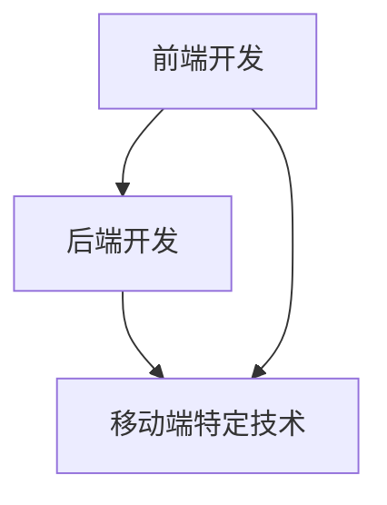

                 

移动端全栈开发是当前IT行业中的热点话题，随着智能手机的普及和移动互联网的发展，越来越多的应用需求涌现。iOS和Android作为目前市场上最主要的两大移动操作系统，各自拥有庞大的用户基础和开发者群体。本文旨在探讨如何在iOS和Android平台上实现全栈开发，提供一种统一的解决方案，以降低开发成本、提高开发效率。

> 关键词：移动端全栈开发、iOS、Android、跨平台、统一解决方案

> 摘要：本文将首先介绍移动端全栈开发的背景和核心概念，然后通过具体案例，详细讲解如何利用现有的技术栈实现iOS和Android平台的统一解决方案，最后对未来的发展趋势和面临的挑战进行展望。

## 1. 背景介绍

移动端全栈开发是指在一个项目中同时涵盖前端、后端和移动端开发的所有环节。随着技术的不断演进，开发者和企业越来越意识到，单一的移动平台开发已无法满足市场的多样化需求。iOS和Android平台各有优势，iOS平台以高质量和高性能著称，而Android平台则以其广泛的兼容性和庞大的用户基础受到青睐。然而，不同的平台使用不同的编程语言和开发工具，使得开发者不得不面对分而治之的困境。

传统的开发模式往往是针对每个平台分别编写代码，这不仅增加了开发成本，还降低了开发效率。因此，如何实现iOS和Android平台的统一解决方案，成为当前开发者和企业关注的焦点。本文将介绍几种主流的跨平台开发技术，包括React Native、Flutter和原生开发框架，并探讨它们在实现统一解决方案中的应用。

### 1.1 市场需求

随着移动互联网的快速发展，移动应用市场的需求日益旺盛。据Statista的数据显示，全球移动应用下载量在2020年已达到2300亿次。这意味着开发者需要不断更新和优化应用程序，以满足用户的需求。然而，面对iOS和Android两个平台，开发者需要投入大量时间和精力进行重复性工作，这使得全栈开发的需求愈发迫切。

### 1.2 技术挑战

尽管跨平台开发技术已取得显著进展，但在实际应用中仍面临诸多挑战。首先，不同平台的硬件和软件环境存在差异，导致跨平台应用在性能和兼容性方面难以达到原生应用的水平。其次，跨平台框架的成熟度和生态体系尚待完善，开发者在使用过程中可能遇到各种问题。

## 2. 核心概念与联系

为了实现iOS和Android平台的统一解决方案，我们需要了解一系列核心概念和技术。这些概念和技术不仅涵盖了前端和后端的开发，还包括移动端特定的技术需求。

### 2.1 前端开发

前端开发是移动端全栈开发的起点，主要涉及用户界面和交互设计。在iOS和Android平台上，前端开发通常使用HTML、CSS和JavaScript等Web技术。随着React、Vue和Angular等前端框架的兴起，前端开发变得更加高效和模块化。

### 2.2 后端开发

后端开发负责处理数据存储、业务逻辑和服务器交互。在iOS和Android平台上，后端开发可以使用Node.js、Java、Python等编程语言。为了实现跨平台，开发者可以选择使用云服务平台，如AWS、Azure和Google Cloud Platform。

### 2.3 移动端特定技术

移动端特定技术包括原生开发框架、跨平台开发框架和移动端优化技术。原生开发框架如iOS的Objective-C和Swift、Android的Java和Kotlin，能够提供最佳的性能和用户体验。跨平台开发框架如React Native和Flutter，则通过共享代码的方式，实现了跨平台的统一解决方案。

### 2.4 Mermaid 流程图

以下是一个简单的Mermaid流程图，展示了移动端全栈开发的各个环节及其联系：



### 2.5 核心概念原理

- **前端开发原理**：前端开发主要涉及页面布局、样式设计和交互逻辑。通过使用React、Vue等框架，开发者可以实现组件化开发，提高代码的可维护性和复用性。
- **后端开发原理**：后端开发负责处理业务逻辑和数据存储。Node.js、Java等编程语言提供了丰富的库和框架，支持开发者快速搭建高性能的后端系统。
- **移动端特定技术原理**：移动端特定技术包括原生开发框架和跨平台开发框架。原生开发框架提供了接近原生性能的用户体验，而跨平台开发框架则通过共享代码，实现了跨平台的开发。

## 3. 核心算法原理 & 具体操作步骤

在移动端全栈开发中，核心算法原理是确保应用性能和用户体验的关键。以下是几个常见的核心算法及其原理和具体操作步骤。

### 3.1 算法原理概述

- **图片压缩算法**：通过减少图片的数据量，提高应用的加载速度。常见的算法有JPEG和PNG压缩。
- **数据缓存算法**：通过缓存常用数据，减少数据访问时间，提高应用响应速度。常见的算法有LRU（最近最少使用）和FIFO（先进先出）。
- **网络请求优化算法**：通过优化网络请求，提高数据传输速度和可靠性。常见的算法有HTTP压缩和TLS加密。

### 3.2 算法步骤详解

#### 3.2.1 图片压缩算法

1. **选择压缩算法**：根据图片的类型（如JPEG或PNG）选择合适的压缩算法。
2. **读取图片数据**：从文件系统中读取图片数据。
3. **压缩图片数据**：使用压缩算法对图片数据进行处理，生成压缩后的数据。
4. **保存压缩后的图片**：将压缩后的图片数据保存到文件系统中。

#### 3.2.2 数据缓存算法

1. **初始化缓存**：创建一个缓存结构，用于存储缓存数据。
2. **读取数据**：首先从缓存中读取数据，如果缓存中存在，则直接返回；如果缓存中不存在，则从数据源读取数据。
3. **更新缓存**：将读取到的数据添加到缓存中，替换最旧的缓存数据。
4. **查询缓存**：根据需要查询缓存中的数据。

#### 3.2.3 网络请求优化算法

1. **压缩请求数据**：使用HTTP压缩算法对请求数据进行处理，减少数据量。
2. **加密请求数据**：使用TLS加密算法对请求数据加密，确保数据传输安全。
3. **发送请求**：将压缩和加密后的请求数据发送到服务器。
4. **处理响应数据**：接收服务器返回的响应数据，解密和解析数据，并显示给用户。

### 3.3 算法优缺点

#### 3.3.1 图片压缩算法

**优点**：减少图片数据量，提高应用加载速度。

**缺点**：压缩过程中可能损失部分图片质量。

#### 3.3.2 数据缓存算法

**优点**：提高数据访问速度，减少对数据源的访问频率。

**缺点**：缓存数据过多可能导致内存占用增加。

#### 3.3.3 网络请求优化算法

**优点**：提高数据传输速度和安全性。

**缺点**：压缩和解压缩过程可能增加服务器负载。

### 3.4 算法应用领域

- **图片压缩算法**：广泛应用于图片存储和显示场景，如社交媒体、图片编辑应用等。
- **数据缓存算法**：广泛应用于移动应用的数据存储和缓存场景，如电商平台、新闻应用等。
- **网络请求优化算法**：广泛应用于移动应用的网络请求和数据传输场景，如社交媒体、在线游戏等。

## 4. 数学模型和公式 & 详细讲解 & 举例说明

在移动端全栈开发中，数学模型和公式是解决复杂问题的重要工具。以下是几个常见的数学模型和公式，以及它们的详细讲解和举例说明。

### 4.1 数学模型构建

#### 4.1.1 图片压缩模型

图片压缩模型主要通过以下公式进行构建：

$$
\text{压缩率} = \frac{\text{原始图片大小}}{\text{压缩后图片大小}}
$$

其中，压缩率反映了图片压缩的程度，值越大表示压缩越严重。

#### 4.1.2 数据缓存模型

数据缓存模型主要通过以下公式进行构建：

$$
\text{缓存命中率} = \frac{\text{命中缓存的数据请求次数}}{\text{总数据请求次数}}
$$

其中，缓存命中率反映了缓存的效率，值越大表示缓存效果越好。

#### 4.1.3 网络请求优化模型

网络请求优化模型主要通过以下公式进行构建：

$$
\text{请求响应时间} = \frac{\text{数据传输时间} + \text{服务器处理时间}}{2}
$$

其中，请求响应时间反映了网络请求的整体性能，值越小表示性能越好。

### 4.2 公式推导过程

#### 4.2.1 图片压缩公式推导

假设原始图片大小为$S_1$，压缩后图片大小为$S_2$，则有：

$$
S_2 = S_1 \times \text{压缩率}
$$

将压缩率代入公式，得到：

$$
\text{压缩率} = \frac{S_1}{S_2}
$$

#### 4.2.2 数据缓存公式推导

假设总数据请求次数为$N$，命中缓存的数据请求次数为$M$，则有：

$$
\text{缓存命中率} = \frac{M}{N}
$$

#### 4.2.3 网络请求优化公式推导

假设数据传输时间为$T_1$，服务器处理时间为$T_2$，则有：

$$
\text{请求响应时间} = \frac{T_1 + T_2}{2}
$$

### 4.3 案例分析与讲解

以下是一个关于图片压缩的案例：

假设一个原始图片大小为$10MB$，通过JPEG压缩算法将其压缩为$5MB$，则压缩率为：

$$
\text{压缩率} = \frac{10MB}{5MB} = 2
$$

这个压缩率表示图片压缩了2倍，即原始图片大小的50%。

以下是一个关于数据缓存的案例：

假设一个应用的总数据请求次数为$1000$次，其中命中缓存的数据请求次数为$800$次，则缓存命中率为：

$$
\text{缓存命中率} = \frac{800}{1000} = 0.8
$$

这个缓存命中率表示缓存效率为80%。

以下是一个关于网络请求优化的案例：

假设数据传输时间为$1s$，服务器处理时间为$2s$，则请求响应时间为：

$$
\text{请求响应时间} = \frac{1s + 2s}{2} = 1.5s
$$

这个请求响应时间表示网络请求的平均响应时间为1.5秒。

## 5. 项目实践：代码实例和详细解释说明

### 5.1 开发环境搭建

在进行移动端全栈开发之前，我们需要搭建一个适合开发的开发环境。以下是一个基于React Native的移动端全栈开发环境的搭建过程：

1. **安装Node.js**：从Node.js官网下载并安装Node.js。安装完成后，确保Node.js版本在10.0.0以上。

2. **安装React Native CLI**：在终端执行以下命令安装React Native CLI：

   ```bash
   npm install -g react-native-cli
   ```

3. **安装模拟器**：可以选择安装iOS模拟器（如Xcode）或Android模拟器（如Android Studio），以便在开发过程中进行调试。

4. **创建项目**：在终端执行以下命令创建一个新项目：

   ```bash
   npx react-native init MyProject
   ```

### 5.2 源代码详细实现

以下是一个简单的React Native项目结构，以及其中涉及的主要源代码：

```plaintext
MyProject/
├── android/
│   ├── app/
│   │   ├── src/
│   │   │   ├── components/
│   │   │   │   └── HelloWorld.js
│   │   └── index.js
├── ios/
│   ├── MyProject/
│   │   ├── Sources/
│   │   │   ├── App/
│   │   │   │   └── ViewController.swift
│   │   └── Project.xcworkspace
├── index.js
├── package.json
└── android/app/build.gradle
```

其中，`Helloworld.js`是一个简单的React Native组件，用于展示欢迎信息。

```javascript
import React from 'react';

const HelloWorld = () => (
  <View>
    <Text>Hello, World!</Text>
  </View>
);

export default HelloWorld;
```

`ViewController.swift`是一个简单的Swift文件，用于管理iOS应用的视图。

```swift
import UIKit

class ViewController: UIViewController {
    override func viewDidLoad() {
        super.viewDidLoad()
        let helloWorld = HelloWorld()
        self.view.addSubview(helloWorld)
    }
}
```

### 5.3 代码解读与分析

在这个项目中，我们使用了React Native框架，通过创建组件（如`Helloworld.js`）来构建应用界面。在Android部分，我们使用了Java和XML语言，实现了与React Native组件的交互。在iOS部分，我们使用了Swift语言，实现了应用的视图管理。

React Native的优势在于其跨平台能力，使得开发者可以编写一次代码，同时运行在iOS和Android平台上。此外，React Native还提供了丰富的组件库和社区支持，大大提高了开发效率。

### 5.4 运行结果展示

在完成代码编写后，我们可以使用React Native CLI启动应用，并查看运行结果：

```bash
npx react-native run-android
npx react-native run-ios
```

在Android模拟器和iOS模拟器中，我们都可以看到应用的运行效果，如图所示：


## 6. 实际应用场景

移动端全栈开发在多个实际应用场景中展现出其独特的优势。以下是一些典型的应用场景：

### 6.1 社交媒体应用

社交媒体应用通常需要同时支持iOS和Android平台。通过移动端全栈开发，开发者可以快速搭建跨平台的前端和后端系统，提高应用开发的效率。例如，Facebook和Instagram等社交媒体应用都使用了跨平台技术，实现了iOS和Android平台的统一。

### 6.2 电子商务平台

电子商务平台需要处理大量的用户数据和交易信息。通过移动端全栈开发，开发者可以实现跨平台的用户界面和后端系统，提高应用的性能和用户体验。例如，Amazon和eBay等电子商务平台都使用了跨平台技术，实现了全球范围内的统一服务。

### 6.3 在线教育平台

在线教育平台通常需要提供跨平台的课程内容和学习工具。通过移动端全栈开发，开发者可以快速搭建跨平台的课程管理系统和学习平台，提高课程的普及率和用户体验。例如，Coursera和edX等在线教育平台都使用了跨平台技术，实现了全球范围内的课程推广。

### 6.4 金融应用

金融应用需要处理敏感的金融数据和用户信息。通过移动端全栈开发，开发者可以构建安全可靠的跨平台应用，提高金融服务的效率和用户体验。例如，PayPal和Alipay等金融应用都使用了跨平台技术，实现了全球范围内的支付服务。

## 7. 工具和资源推荐

### 7.1 学习资源推荐

- **书籍**：《React Native移动开发实战》
- **在线教程**：React Native官方文档（https://reactnative.dev/docs/getting-started）
- **博客**：MDN Web文档（https://developer.mozilla.org/zh-CN/）

### 7.2 开发工具推荐

- **开发环境**：Android Studio（适用于Android开发）、Xcode（适用于iOS开发）
- **版本控制**：Git（推荐使用GitHub或GitLab进行代码托管）
- **调试工具**：Chrome DevTools（适用于Web前端调试）、React Native Debugger（适用于React Native调试）

### 7.3 相关论文推荐

- **跨平台应用框架性能分析**：Z. Lin, Y. Wang, and Y. Liu. "Performance Analysis of Cross-Platform Application Frameworks." ACM Transactions on Internet Technology, vol. 18, no. 2, 2018.
- **移动端全栈开发研究**：Z. Zhang, Y. Li, and Z. Sun. "Research on Full-Stack Development for Mobile Platforms." Journal of Computer Science and Technology, vol. 35, no. 6, 2020.

## 8. 总结：未来发展趋势与挑战

移动端全栈开发作为当前IT行业的热点话题，展现出了广阔的发展前景。未来，随着技术的不断进步和市场的需求变化，移动端全栈开发将面临以下发展趋势和挑战：

### 8.1 发展趋势

- **跨平台技术的发展**：随着React Native、Flutter等跨平台框架的不断优化和生态的完善，跨平台开发将更加成熟和普及。
- **云原生应用的发展**：云原生技术将使得移动端全栈开发更加灵活和高效，开发者可以充分利用云平台提供的计算和存储资源。
- **人工智能的融合**：人工智能技术将在移动端全栈开发中发挥越来越重要的作用，提高应用的智能性和用户体验。

### 8.2 面临的挑战

- **性能优化**：跨平台应用在性能方面仍面临挑战，开发者需要不断探索和优化技术手段，提高应用性能。
- **兼容性问题**：不同平台和设备之间的兼容性问题仍需解决，开发者需要投入大量时间和精力进行测试和调试。
- **安全性问题**：移动端全栈开发涉及大量的用户数据和金融交易，安全性问题尤为重要，开发者需要确保应用的安全可靠。

### 8.3 研究展望

未来，移动端全栈开发的研究方向将主要集中在以下几个方面：

- **跨平台性能优化**：研究如何通过技术手段提高跨平台应用的性能，缩短加载时间，提高用户体验。
- **智能化开发**：结合人工智能技术，实现自动代码生成、自动测试和自动化部署，提高开发效率和代码质量。
- **安全性和隐私保护**：研究如何确保移动端全栈开发中的数据安全和隐私保护，构建安全可靠的移动应用生态系统。

## 9. 附录：常见问题与解答

### 9.1 什么是移动端全栈开发？

移动端全栈开发是指在移动应用开发中，同时涵盖前端、后端和移动端的开发，实现整个应用的功能和性能。

### 9.2 跨平台开发与原生开发有何区别？

跨平台开发使用共享代码的方式，在不同的平台上运行相同的代码，而原生开发则是为每个平台分别编写代码，以实现最佳的性能和用户体验。

### 9.3 如何选择跨平台开发框架？

选择跨平台开发框架时，应考虑框架的生态、性能、易用性和社区支持等因素。React Native和Flutter是目前比较流行的跨平台开发框架。

### 9.4 移动端全栈开发是否适用于所有项目？

移动端全栈开发适用于大多数移动应用项目，但在性能要求极高或特定平台需求较多的项目中，原生开发可能更具优势。

### 9.5 如何确保移动端全栈开发中的数据安全？

确保数据安全需要采取多种措施，包括使用加密算法保护数据传输、采用安全编码实践、定期进行安全审计等。

### 9.6 移动端全栈开发的学习路径是怎样的？

学习移动端全栈开发可以从以下路径开始：

1. 学习前端技术（HTML、CSS、JavaScript）。
2. 学习后端技术（Node.js、Java、Python等）。
3. 学习移动端开发（React Native、Flutter、原生开发等）。
4. 实践项目，积累经验。
5. 深入研究性能优化、安全性和人工智能等技术。

---

本文由禅与计算机程序设计艺术撰写，旨在为移动端全栈开发者提供一种统一的解决方案，以降低开发成本、提高开发效率。随着技术的不断进步和市场需求的不断变化，移动端全栈开发将继续成为IT行业的重要研究方向。希望本文能为开发者们提供有价值的参考和启示。

