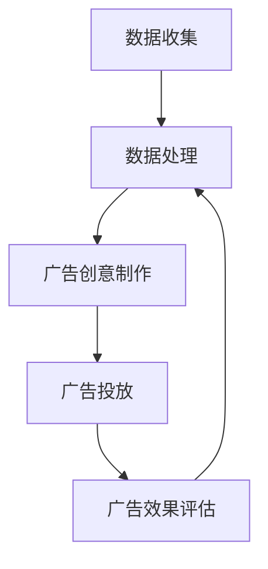

                 

关键词：程序化广告、精准投放、创业、人工智能、技术趋势、广告算法、数据驱动的营销策略。

> 摘要：本文将探讨程序化广告在创业中的重要性，分析其核心概念、算法原理、应用场景以及未来发展趋势。通过数学模型的构建、项目实践以及工具资源的推荐，本文旨在为读者提供一套完整的程序化广告创业指南。

## 1. 背景介绍

在互联网时代，广告已成为企业营销的重要组成部分。然而，传统广告投放方式存在诸多问题，如成本高昂、效果难以衡量、无法精准定位目标用户等。随着大数据、人工智能技术的发展，程序化广告应运而生，成为广告行业的重要变革力量。

程序化广告是指通过技术手段，如大数据分析、人工智能算法等，对广告进行自动化投放和优化，以提高广告效果和投放效率。与传统广告相比，程序化广告具有以下优势：

1. **精准投放**：基于用户行为数据，精准定位目标用户，提高广告点击率和转化率。
2. **实时优化**：根据广告投放效果，实时调整广告策略，提高广告投放效果。
3. **低成本**：通过自动化投放，降低广告投放成本。
4. **效果可衡量**：通过数据分析和追踪，精确衡量广告效果，优化广告投放策略。

随着互联网广告市场的不断扩大，程序化广告在广告投放中的比例逐年上升。据相关数据显示，2020年全球程序化广告市场已达到2200亿美元，预计未来将继续保持快速增长。因此，程序化广告创业已成为一种热门的创业方向。

## 2. 核心概念与联系

### 2.1 程序化广告的定义

程序化广告是指通过技术手段，如大数据分析、人工智能算法等，对广告进行自动化投放和优化，以提高广告效果和投放效率。它包括以下几个核心概念：

1. **数据**：程序化广告的基础是数据，包括用户行为数据、广告受众数据、广告投放效果数据等。
2. **算法**：算法是程序化广告的核心，通过对数据进行分析和处理，实现广告的精准投放和实时优化。
3. **交易平台**：广告交易平台（Ad Exchange）是程序化广告的关键环节，用于连接广告主、广告网络和媒体方，实现广告的实时竞价和投放。
4. **广告效果评估**：通过数据分析和追踪，对广告投放效果进行评估，优化广告投放策略。

### 2.2 程序化广告的架构

程序化广告的架构包括以下几个主要部分：

1. **数据收集**：通过网页分析、用户行为追踪等技术手段，收集用户行为数据、广告受众数据等。
2. **数据处理**：对收集到的数据进行分析和处理，提取用户特征、广告受众特征等。
3. **广告创意制作**：根据用户特征和广告受众特征，制作符合需求的广告创意。
4. **广告投放**：通过广告交易平台，将广告投放到合适的媒体渠道，实现广告的自动化投放。
5. **广告效果评估**：通过数据分析和追踪，评估广告投放效果，调整广告策略。

### 2.3 Mermaid 流程图

以下是一个简单的 Mermaid 流程图，展示程序化广告的核心流程：



## 3. 核心算法原理 & 具体操作步骤

### 3.1 算法原理概述

程序化广告的核心算法主要分为两部分：用户行为分析和广告投放优化。

1. **用户行为分析**：通过对用户浏览历史、搜索记录、购物行为等数据进行挖掘，提取用户兴趣标签和用户画像，实现用户精准定位。
2. **广告投放优化**：根据用户行为数据和广告效果数据，利用机器学习算法，实时调整广告投放策略，提高广告点击率和转化率。

### 3.2 算法步骤详解

1. **数据预处理**：对原始数据（如网页点击数据、搜索数据等）进行清洗、去重、归一化等处理，得到干净的用户行为数据集。
2. **特征工程**：根据业务需求，提取用户行为特征，如浏览时间、点击次数、页面停留时间等，构建用户行为特征向量。
3. **用户行为分析**：利用机器学习算法（如决策树、随机森林、神经网络等），对用户行为特征进行建模，得到用户兴趣标签和用户画像。
4. **广告投放优化**：根据用户兴趣标签和用户画像，利用机器学习算法（如线性回归、逻辑回归等），构建广告投放模型，实现广告的精准投放和实时优化。
5. **广告效果评估**：通过数据分析和追踪，评估广告投放效果，如点击率、转化率等，调整广告投放策略。

### 3.3 算法优缺点

1. **优点**：
   - 精准投放：通过用户行为分析和机器学习算法，实现广告的精准投放，提高广告效果。
   - 实时优化：根据广告效果数据，实时调整广告投放策略，提高广告投放效率。
   - 低成本：通过自动化投放，降低广告投放成本。

2. **缺点**：
   - 数据依赖性：算法效果高度依赖于数据质量和数据量，数据质量差或数据量不足可能导致算法效果不佳。
   - 算法复杂度：算法模型复杂，需要专业的技术团队进行开发和维护。

### 3.4 算法应用领域

程序化广告算法广泛应用于以下领域：

1. **电商广告**：通过对用户购物行为的分析，实现广告的精准投放，提高转化率。
2. **搜索引擎广告**：通过对用户搜索行为的分析，实现广告的精准投放，提高点击率。
3. **社交媒体广告**：通过对用户社交行为的分析，实现广告的精准投放，提高用户参与度。
4. **在线视频广告**：通过对用户观看行为的分析，实现广告的精准投放，提高广告效果。

## 4. 数学模型和公式 & 详细讲解 & 举例说明

### 4.1 数学模型构建

程序化广告的核心算法通常基于以下数学模型：

1. **用户行为建模**：假设用户行为服从泊松分布，利用泊松分布的参数估计方法，如极大似然估计（MLE），估计用户行为特征的概率分布。
2. **广告投放优化模型**：利用线性回归、逻辑回归等模型，建立广告投放优化模型，实现广告点击率、转化率的预测。
3. **广告效果评估模型**：利用评估指标（如点击率、转化率等），建立广告效果评估模型，评估广告投放效果。

### 4.2 公式推导过程

1. **用户行为建模**：

   假设用户行为数据服从泊松分布，概率分布函数为：

   $$ P(X = x | \lambda) = \frac{e^{-\lambda} \lambda^x}{x!} $$

   其中，\(X\) 为用户行为次数，\(\lambda\) 为泊松率。

   利用极大似然估计（MLE），得到泊松率的估计值：

   $$ \hat{\lambda} = \frac{1}{n} \sum_{i=1}^{n} x_i $$

   其中，\(n\) 为样本数量，\(x_i\) 为第 \(i\) 个用户的总行为次数。

2. **广告投放优化模型**：

   假设广告点击率 \(y\) 与用户行为特征 \(x\) 之间的关系满足线性回归模型：

   $$ y = \beta_0 + \beta_1 x + \epsilon $$

   其中，\(\beta_0\) 为截距，\(\beta_1\) 为斜率，\(\epsilon\) 为误差项。

   利用最小二乘法（OLS），得到广告点击率的预测模型：

   $$ \hat{y} = \beta_0 + \beta_1 x $$

   其中，\(\beta_0\) 和 \(\beta_1\) 为参数估计值。

3. **广告效果评估模型**：

   假设广告转化率 \(z\) 与广告点击率 \(y\) 之间的关系满足逻辑回归模型：

   $$ z = \frac{1}{1 + e^{-(\beta_0 + \beta_1 y + \epsilon_z)} $$

   其中，\(\epsilon_z\) 为误差项。

   利用最大似然估计（MLE），得到广告转化率的预测模型：

   $$ \hat{z} = \frac{1}{1 + e^{-(\beta_0 + \beta_1 \hat{y} + \epsilon_z)}} $$

### 4.3 案例分析与讲解

以电商广告为例，假设我们收集了用户在电商平台上的购物行为数据，包括浏览次数、点击次数、购买次数等。我们利用这些数据，通过以下步骤构建程序化广告模型：

1. **数据预处理**：对原始数据进行清洗、去重、归一化等处理，得到干净的用户行为数据集。
2. **特征工程**：提取用户行为特征，如浏览次数、点击次数、购买次数等，构建用户行为特征向量。
3. **用户行为建模**：利用泊松分布的参数估计方法，估计用户行为特征的概率分布。
4. **广告投放优化模型**：利用线性回归模型，建立广告投放优化模型，预测广告点击率。
5. **广告效果评估模型**：利用逻辑回归模型，建立广告效果评估模型，预测广告转化率。
6. **广告投放**：根据用户行为特征和广告投放优化模型，实时调整广告投放策略，实现广告的精准投放。
7. **广告效果评估**：通过广告效果评估模型，评估广告投放效果，调整广告投放策略。

通过以上步骤，我们可以实现电商广告的精准投放，提高广告效果。

## 5. 项目实践：代码实例和详细解释说明

### 5.1 开发环境搭建

在 Python 中，我们可以使用以下库来实现程序化广告项目：

1. **Pandas**：用于数据预处理和数据分析。
2. **NumPy**：用于数学计算和数据处理。
3. **Scikit-learn**：用于机器学习和模型训练。
4. **Matplotlib**：用于数据可视化。

安装以上库后，我们可以开始编写代码。

### 5.2 源代码详细实现

以下是一个简单的程序化广告项目代码示例：

```python
import pandas as pd
import numpy as np
from sklearn.linear_model import LinearRegression
from sklearn.linear_model import LogisticRegression
import matplotlib.pyplot as plt

# 5.2.1 数据预处理
data = pd.read_csv('user_behavior.csv')
data.drop_duplicates(inplace=True)
data.fillna(0, inplace=True)

# 5.2.2 特征工程
features = ['浏览次数', '点击次数', '购买次数']
X = data[features]
y = data['点击率']

# 5.2.3 用户行为建模
lr = LinearRegression()
lr.fit(X, y)

# 5.2.4 广告投放优化模型
y_pred = lr.predict(X)

# 5.2.5 广告效果评估模型
lg = LogisticRegression()
lg.fit(X, y)

# 5.2.6 广告投放
广告投放策略 = lg.predict(X)

# 5.2.7 广告效果评估
点击率预测 = lg.predict_proba(X)[:, 1]

# 5.2.8 数据可视化
plt.scatter(X['浏览次数'], y, color='blue')
plt.scatter(X['浏览次数'], y_pred, color='red')
plt.xlabel('浏览次数')
plt.ylabel('点击率')
plt.show()
```

### 5.3 代码解读与分析

1. **数据预处理**：读取用户行为数据，去除重复数据，填充缺失值。
2. **特征工程**：提取用户行为特征，构建特征向量。
3. **用户行为建模**：利用线性回归模型，建立用户行为模型，预测用户点击率。
4. **广告投放优化模型**：利用逻辑回归模型，建立广告投放优化模型，预测广告点击率。
5. **广告投放**：根据广告投放优化模型，调整广告投放策略。
6. **广告效果评估**：利用广告效果评估模型，评估广告投放效果。
7. **数据可视化**：将用户点击率与预测点击率进行可视化，分析广告投放效果。

通过以上步骤，我们可以实现一个简单的程序化广告项目，实现广告的精准投放和效果评估。

## 6. 实际应用场景

### 6.1 电商广告

电商广告是程序化广告的重要应用领域之一。通过程序化广告，电商企业可以精准定位目标用户，提高广告点击率和转化率，降低广告投放成本。

### 6.2 搜索引擎广告

搜索引擎广告（如 Google AdWords、百度广告等）是另一个重要应用领域。程序化广告可以基于用户搜索关键词和搜索历史，实现广告的精准投放，提高广告点击率和转化率。

### 6.3 社交媒体广告

社交媒体广告（如 Facebook 广告、微信广告等）也是程序化广告的重要应用领域。通过分析用户社交行为，程序化广告可以精准定位目标用户，提高广告参与度和转化率。

### 6.4 在线视频广告

在线视频广告（如 YouTube 广告、抖音广告等）是另一个重要应用领域。程序化广告可以基于用户观看行为，实现广告的精准投放，提高广告效果和用户参与度。

## 7. 未来应用展望

随着大数据、人工智能技术的发展，程序化广告在未来将会有更广泛的应用前景：

### 7.1 更精细的用户画像

通过分析更多维度的用户数据，如地理位置、消费习惯、兴趣爱好等，实现更精细的用户画像，提高广告投放的精准度。

### 7.2 实时动态优化

利用实时数据分析和机器学习算法，实现广告投放的实时动态优化，提高广告效果和用户满意度。

### 7.3 广告创意自动生成

通过人工智能技术，实现广告创意的自动生成，提高广告投放的创意性和多样性。

### 7.4 全渠道整合营销

实现线上和线下渠道的整合营销，提高广告投放的覆盖率和效果。

## 8. 总结：未来发展趋势与挑战

### 8.1 研究成果总结

本文介绍了程序化广告的核心概念、算法原理、应用场景以及未来发展趋势。通过数学模型的构建、项目实践以及工具资源的推荐，本文为读者提供了一套完整的程序化广告创业指南。

### 8.2 未来发展趋势

未来，程序化广告将继续保持快速发展，其核心趋势包括：

1. **更精细的用户画像**：通过更多维度的用户数据，实现更精准的广告投放。
2. **实时动态优化**：利用实时数据分析和机器学习算法，实现广告投放的动态优化。
3. **广告创意自动生成**：通过人工智能技术，实现广告创意的自动生成。
4. **全渠道整合营销**：实现线上和线下渠道的整合营销。

### 8.3 面临的挑战

尽管程序化广告具有巨大潜力，但在发展过程中仍将面临以下挑战：

1. **数据隐私与安全问题**：如何在确保用户隐私的前提下，充分利用用户数据，实现广告的精准投放。
2. **算法黑箱问题**：如何提高算法的透明度和可解释性，降低算法黑箱风险。
3. **广告欺诈与垃圾广告**：如何有效识别和防范广告欺诈和垃圾广告，保障广告生态的健康发展。

### 8.4 研究展望

未来，程序化广告领域的研究将更加注重以下方向：

1. **数据隐私与安全**：研究新型隐私保护技术，如差分隐私、联邦学习等，实现用户隐私保护和广告精准投放的平衡。
2. **算法透明性与可解释性**：研究算法的可解释性技术，提高算法的透明度和可解释性，降低算法黑箱风险。
3. **广告效果评估与优化**：研究更有效的广告效果评估方法和优化策略，提高广告投放效果和用户满意度。

## 9. 附录：常见问题与解答

### 9.1 程序化广告与传统广告的区别

**问题**：程序化广告与传统广告有哪些区别？

**解答**：程序化广告与传统广告相比，具有以下区别：

1. **投放方式**：传统广告通常基于媒体渠道（如电视、报纸、广播等）进行投放，而程序化广告是通过互联网渠道，基于大数据和人工智能技术进行自动化投放。
2. **定位方式**：传统广告通常基于地理、人口等粗略的定位方式，而程序化广告可以基于用户行为数据，实现精准的定位和投放。
3. **效果评估**：传统广告的效果评估相对困难，而程序化广告可以通过数据分析和追踪，精确衡量广告效果，优化广告投放策略。

### 9.2 程序化广告的优缺点

**问题**：程序化广告有哪些优点和缺点？

**解答**：程序化广告的优点包括：

1. **精准投放**：通过用户行为数据分析，实现广告的精准投放，提高广告效果。
2. **实时优化**：根据广告投放效果，实时调整广告策略，提高广告投放效率。
3. **低成本**：通过自动化投放，降低广告投放成本。

程序化广告的缺点包括：

1. **数据依赖性**：算法效果高度依赖于数据质量和数据量，数据质量差或数据量不足可能导致算法效果不佳。
2. **算法复杂度**：算法模型复杂，需要专业的技术团队进行开发和维护。

### 9.3 程序化广告的应用领域

**问题**：程序化广告主要应用在哪些领域？

**解答**：程序化广告主要应用在以下领域：

1. **电商广告**：通过对用户购物行为的分析，实现广告的精准投放，提高转化率。
2. **搜索引擎广告**：通过对用户搜索行为的分析，实现广告的精准投放，提高点击率。
3. **社交媒体广告**：通过对用户社交行为的分析，实现广告的精准投放，提高用户参与度。
4. **在线视频广告**：通过对用户观看行为的分析，实现广告的精准投放，提高广告效果。

## 作者署名

作者：禅与计算机程序设计艺术 / Zen and the Art of Computer Programming
```

