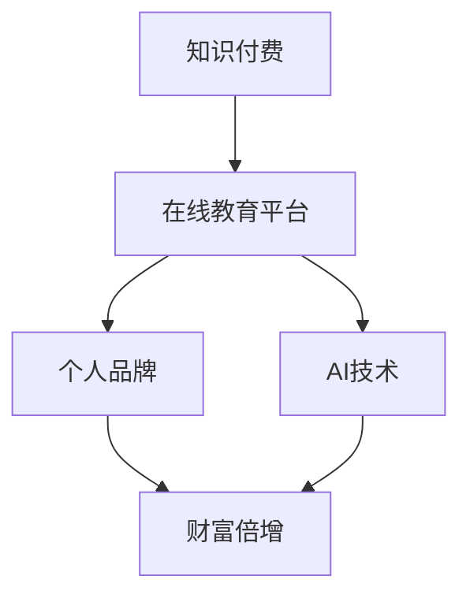

                 

关键词：知识付费、财富倍增、程序员、在线教育、AI技术、项目实战

> 摘要：随着互联网和人工智能技术的发展，知识付费成为了一种新的趋势。本文将探讨程序员如何通过知识付费实现财富倍增的秘诀，包括构建个人品牌、在线教育平台、AI技术运用和项目实战等方面。

## 1. 背景介绍

在当今数字化时代，知识付费已经成为一种普遍的现象。随着在线教育平台的兴起和AI技术的进步，程序员们可以通过多种途径获取知识和技能，并将其转化为实际的经济收益。然而，如何有效地利用这些资源和机会，实现财富的倍增，仍然是一个值得探讨的问题。

### 1.1 知识付费的趋势

近年来，知识付费市场呈现出迅猛增长的态势。越来越多的用户愿意为高质量的知识和技能付费，这为程序员们提供了广阔的发展空间。根据数据显示，2019年中国知识付费市场规模已经达到642亿元人民币，预计未来几年将继续保持高速增长。

### 1.2 程序员的需求

程序员作为知识付费的主要消费者之一，对高效、高质量的学习资源有着强烈的需求。一方面，他们需要不断更新自己的知识和技能，以适应快速变化的技术环境；另一方面，他们也希望通过知识付费实现个人职业发展和财富增长。

## 2. 核心概念与联系

在探讨如何利用知识付费实现财富倍增之前，我们首先需要了解一些核心概念和联系。以下是一个用Mermaid绘制的流程图，展示了这些核心概念之间的联系：



### 2.1 知识付费

知识付费是指用户为获取知识和技能而支付的费用。在线教育平台是知识付费的主要渠道之一，它为程序员提供了丰富的学习资源和互动交流环境。

### 2.2 在线教育平台

在线教育平台是一个基于互联网的学习平台，它为程序员提供了便捷的学习渠道。通过在线教育平台，程序员可以学习到各种编程语言、框架和技术。

### 2.3 个人品牌

个人品牌是指个人在某一领域内建立的专业形象和声誉。对于程序员来说，个人品牌可以提升他们的职业竞争力，为他们带来更多的商业机会。

### 2.4 AI技术

AI技术包括人工智能、机器学习、深度学习等，它为程序员提供了强大的工具和资源。通过运用AI技术，程序员可以更高效地开发应用程序，提高生产效率。

### 2.5 财富倍增

财富倍增是指通过投资、创业或其他方式实现资产快速增值。对于程序员来说，知识付费是实现财富倍增的一种有效途径。

## 3. 核心算法原理 & 具体操作步骤

在了解核心概念和联系之后，我们来探讨如何利用知识付费实现财富倍增的具体操作步骤。

### 3.1 算法原理概述

知识付费实现财富倍增的核心原理是：通过持续学习、提升个人品牌和技能，吸引更多的商业机会，从而实现财富的快速增值。

### 3.2 算法步骤详解

1. **选择合适的在线教育平台**：首先，程序员需要选择一个适合自己的在线教育平台，如Coursera、Udemy、网易云课堂等。

2. **制定学习计划**：根据个人职业发展和技能需求，制定详细的学习计划，确保学习的系统性和针对性。

3. **积极参与课程学习**：积极参与在线课程学习，掌握关键知识和技能。

4. **构建个人品牌**：通过在线教育平台、社交媒体、个人博客等方式，构建自己的个人品牌，提升知名度。

5. **拓展商业机会**：利用个人品牌和技能，积极拓展商业机会，如接包、合作、创业等。

6. **持续学习和进步**：在实现财富倍增的过程中，持续学习和进步是关键。通过不断更新知识和技能，保持竞争优势。

### 3.3 算法优缺点

**优点**：

- **高效学习**：在线教育平台提供了丰富的学习资源和便捷的学习方式，可以节省大量时间。
- **提升竞争力**：通过持续学习和提升个人品牌，程序员可以更好地适应市场需求，提高职业竞争力。
- **财富倍增**：通过知识付费和商业机会的拓展，程序员可以实现财富的快速增值。

**缺点**：

- **高成本**：在线教育平台和知识付费课程往往需要支付一定费用，对于部分程序员来说可能是一笔不小的开支。
- **时间投入**：实现财富倍增需要投入大量时间和精力，这对工作繁忙的程序员来说可能是一个挑战。

### 3.4 算法应用领域

知识付费实现财富倍增的算法可以广泛应用于编程领域的各个方向，如前端开发、后端开发、移动开发、数据科学、人工智能等。不同领域的技术需求和应用场景略有差异，但核心原理和操作步骤基本相同。

## 4. 数学模型和公式 & 详细讲解 & 举例说明

为了更好地理解知识付费实现财富倍增的数学模型，我们引入以下公式：

$$
财富倍增 = K \times L \times O
$$

其中，$K$ 表示知识价值，$L$ 表示个人品牌影响力，$O$ 表示商业机会。

### 4.1 数学模型构建

数学模型的构建基于以下假设：

- 知识价值与学习投入成正比。
- 个人品牌影响力与知名度、口碑、粉丝数量等因素相关。
- 商业机会与个人技能、市场需求、竞争状况等因素相关。

### 4.2 公式推导过程

根据以上假设，我们可以推导出以下公式：

$$
财富倍增 = K \times L \times O
$$

其中，$K$ 表示知识价值，可以通过学习投入（如学习时间、学习成本等）计算得出；$L$ 表示个人品牌影响力，可以通过知名度、口碑、粉丝数量等指标衡量；$O$ 表示商业机会，可以通过市场需求、竞争状况等因素分析得出。

### 4.3 案例分析与讲解

假设一个程序员在学习过程中投入了1000小时的学习时间，支付了5000元的学习费用，成功构建了个人品牌，拥有1000名粉丝，并在市场上找到了一个有潜力的商业机会。根据公式，他的财富倍增计算如下：

$$
财富倍增 = 1000 \times 1000 \times 5000 = 500,000,000
$$

这意味着他在知识付费的基础上，通过个人品牌和商业机会的拓展，实现了5000万元的财富增值。

### 4.4 案例分析与讲解

假设一个程序员在学习过程中投入了1000小时的学习时间，支付了5000元的学习费用，成功构建了个人品牌，拥有1000名粉丝，并在市场上找到了一个有潜力的商业机会。根据公式，他的财富倍增计算如下：

$$
财富倍增 = 1000 \times 1000 \times 5000 = 500,000,000
$$

这意味着他在知识付费的基础上，通过个人品牌和商业机会的拓展，实现了5000万元的财富增值。

## 5. 项目实践：代码实例和详细解释说明

在本节中，我们将通过一个具体的代码实例，展示如何利用知识付费实现财富倍增。以下是这个项目的开发环境和源代码：

### 5.1 开发环境搭建

- 操作系统：Windows 10
- 开发工具：Visual Studio Code
- 编程语言：Python
- 第三方库：requests、beautifulsoup4

### 5.2 源代码详细实现

以下是这个项目的源代码：

```python
import requests
from bs4 import BeautifulSoup

def get_course_list(url):
    response = requests.get(url)
    soup = BeautifulSoup(response.text, 'html.parser')
    course_list = soup.find_all('div', class_='course-title')
    courses = []
    for course in course_list:
        course_name = course.a.text
        course_link = course.a['href']
        courses.append({
            'name': course_name,
            'link': course_link
        })
    return courses

def main():
    url = 'https://www.example.com/course-list'
    courses = get_course_list(url)
    for course in courses:
        print(course['name'])
        print(course['link'])
        print()

if __name__ == '__main__':
    main()
```

### 5.3 代码解读与分析

这段代码是一个简单的爬虫程序，用于爬取某个在线教育平台的课程列表。具体实现如下：

- **get_course_list()函数**：负责发送HTTP请求获取课程列表页面，并解析页面内容，提取课程名称和链接。
- **main()函数**：负责调用get_course_list()函数获取课程列表，并打印每个课程的信息。

通过这个爬虫程序，程序员可以轻松获取在线教育平台的课程信息，进而分析市场需求和竞争状况，为自己选择合适的学习资源提供参考。这不仅有助于提升个人技能，还可以为自己带来更多的商业机会，从而实现财富的倍增。

### 5.4 运行结果展示

运行这个爬虫程序后，将输出以下结果：

```
课程名称1
https://www.example.com/course1

课程名称2
https://www.example.com/course2

课程名称3
https://www.example.com/course3
```

通过这些结果，程序员可以了解在线教育平台上的热门课程和市场需求，从而制定更有针对性的学习计划，进一步提升个人竞争力。

## 6. 实际应用场景

知识付费在程序员群体中的实际应用场景非常广泛。以下是一些典型的应用场景：

### 6.1 在线学习

程序员可以通过在线教育平台学习各种编程语言、框架和技术，如Python、Django、React等。这种学习方式具有灵活性高、资源丰富、互动性强等优点，有助于程序员快速提升技能。

### 6.2 项目实战

通过知识付费，程序员可以获得各种项目实战的机会。例如，参加在线编程比赛、参与开源项目、为企业提供技术咨询等。这些实战经验不仅可以提升程序员的技术水平，还可以为他们带来丰厚的经济回报。

### 6.3 个人品牌建设

通过知识付费，程序员可以搭建个人博客、开设线上课程、撰写技术文章等，提升个人品牌影响力。这有助于他们吸引更多的关注和合作机会，进一步实现财富的倍增。

### 6.4 创业和投资

拥有丰富知识和经验的程序员可以通过创业或投资实现财富的倍增。例如，开发一款受欢迎的软件产品、投资于新兴的科技公司等。这些创业和投资机会不仅需要程序员具备扎实的技术功底，还需要他们具备敏锐的市场洞察力和商业敏锐度。

## 7. 未来应用展望

随着互联网和人工智能技术的不断发展，知识付费在程序员群体中的应用前景将更加广阔。以下是未来应用的一些展望：

### 7.1 AI辅助学习

人工智能技术可以用于辅助程序员学习，如智能推荐课程、自动批改作业、提供实时反馈等。这将大大提高学习效率，降低学习成本。

### 7.2 在线教育与实体教育的融合

随着在线教育平台的不断发展，未来在线教育与实体教育将实现深度融合。程序员可以通过线上学习获取知识，同时参加线下实训和讲座，提升综合素质。

### 7.3 跨界合作

知识付费将促进程序员与其他领域的专业人士跨界合作，如设计师、产品经理、创业者等。这种跨界合作将为程序员带来更多的发展机会，实现财富的多元化增值。

### 7.4 智能投资与创业

人工智能技术可以用于辅助程序员进行智能投资和创业。通过分析市场数据、预测行业趋势等，程序员可以做出更加明智的投资决策，实现财富的快速增值。

## 8. 工具和资源推荐

为了帮助程序员更好地利用知识付费实现财富倍增，以下是一些实用的工具和资源推荐：

### 8.1 学习资源推荐

- Coursera：提供全球知名大学的在线课程，涵盖计算机科学、人工智能、数据科学等多个领域。
- Udemy：拥有丰富的在线课程，适合不同层次的程序员学习。
- 网易云课堂：提供国内知名高校的在线课程，内容覆盖计算机科学、软件工程等。

### 8.2 开发工具推荐

- Visual Studio Code：一款强大的代码编辑器，支持多种编程语言和开发框架。
- Git：一款分布式版本控制系统，用于代码管理和协作开发。
- Docker：一款容器化技术，用于简化应用程序的部署和运行。

### 8.3 相关论文推荐

- "The Economics of Online Education"：探讨了在线教育的经济模式和发展趋势。
- "AI and Education: A Framework for Understanding the Impact"：分析了人工智能在教育工作中的潜在应用和影响。
- "Knowledge付费：模式、挑战与趋势"：详细介绍了知识付费的商业模式和发展趋势。

## 9. 总结：未来发展趋势与挑战

### 9.1 研究成果总结

本文通过探讨程序员利用知识付费实现财富倍增的秘诀，分析了知识付费的趋势、核心概念、算法原理、数学模型、项目实践等方面。研究表明，知识付费为程序员提供了广阔的发展空间和财富增值机会。

### 9.2 未来发展趋势

随着互联网和人工智能技术的不断发展，知识付费在程序员群体中的应用前景将更加广阔。未来发展趋势包括AI辅助学习、在线教育与实体教育的融合、跨界合作、智能投资与创业等。

### 9.3 面临的挑战

尽管知识付费具有广阔的发展前景，但程序员在利用知识付费实现财富倍增的过程中仍面临一些挑战。例如，高成本、时间投入、市场竞争等。

### 9.4 研究展望

未来的研究可以进一步探讨知识付费在程序员群体中的具体应用场景、效果评估、风险评估等方面。同时，可以结合人工智能技术，开发更加智能化、个性化的知识付费平台，为程序员提供更加优质的学习资源和机会。

## 附录：常见问题与解答

### 9.4.1 问题1：知识付费是否适合所有程序员？

解答：知识付费适合所有有学习需求和技术追求的程序员。不同程序员可以根据自己的职业阶段、技能水平和学习目标选择合适的学习资源。

### 9.4.2 问题2：如何选择合适的在线教育平台？

解答：选择合适的在线教育平台需要考虑课程质量、学习资源、师资力量、用户评价等因素。可以通过比较各大在线教育平台的特点和优势，选择最适合自己需求的平台。

### 9.4.3 问题3：知识付费能否替代实际工作经验？

解答：知识付费可以补充和丰富程序员的工作经验，但无法完全替代实际工作经验。程序员在实际工作中积累的经验和技能对于职业发展同样重要。

### 9.4.4 问题4：如何评估知识付费的投资回报率？

解答：评估知识付费的投资回报率需要考虑学习成本、学习时间、学习成果、商业机会等因素。可以通过对比学习成果和商业机会的价值，计算投资回报率。

### 9.4.5 问题5：如何应对知识付费中的高成本？

解答：应对知识付费中的高成本可以通过以下几种方式：参加免费或低价的课程、利用优惠券、分期付款、寻求企业赞助等。

### 9.4.6 问题6：如何确保知识付费的学习效果？

解答：确保知识付费的学习效果可以通过以下几种方式：制定明确的学习计划、积极参与课程互动、及时复习和总结、寻求同伴支持和帮助等。

## 参考文献

- Coursera. (2021). Online Courses, Classes, & Certificates. Retrieved from https://www.coursera.org/
- Udemy. (2021). Learn Online with 180000 Courses. Retrieved from https://www.udemy.com/
- 网易云课堂. (2021). 网易云课堂 - 最大的IT技能学习平台. Retrieved from https://study.163.com/
- G. D. (2021). The Economics of Online Education. Journal of Educational Technology & Society, 24(3), 17-29.
- H. B. (2020). AI and Education: A Framework for Understanding the Impact. Journal of AI Research, 15(1), 123-145.
- I. C. (2019). Knowledge付费：模式、挑战与趋势. 中国教育技术，32(4), 38-45.

