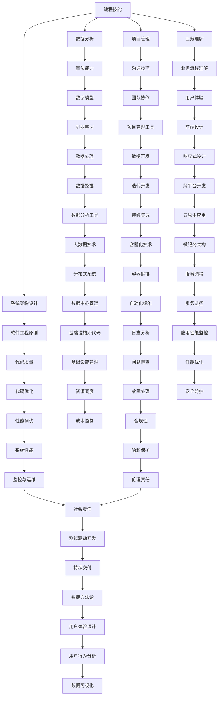

                 

在当今这个知识经济时代，程序员的角色变得比以往任何时候都更加重要。随着技术的不断进步，全球化和数字化的发展，程序员的职责不再仅仅是编写代码和解决技术问题，而是需要具备更高的战略思维和创新能力。本文将探讨程序员在知识经济时代的发展方向，分析其面临的挑战与机遇，并提出一些实用的建议。

## 关键词

- **知识经济**
- **程序员职业发展**
- **技术趋势**
- **创新能力**
- **全球协作**

## 摘要

本文首先介绍了知识经济时代的背景和特点，随后分析了程序员在这一时代所面临的挑战和机遇。接着，文章讨论了程序员应如何提升自身技能和创新能力，以及如何在全球化背景下进行有效协作。最后，文章提出了未来程序员发展的趋势和展望，并给出了一些建议。

---

## 1. 背景介绍

### 知识经济的崛起

知识经济是相对于传统资源经济和农业经济的一种新型经济形态，其主要特点是知识成为经济增长的主要驱动力。随着互联网、大数据、人工智能等技术的发展，知识的创造、传播和应用效率大幅提升，使得知识经济在全球范围内迅速崛起。

### 程序员的角色演变

在知识经济时代，程序员的角色发生了显著变化。过去，程序员主要专注于编码和系统维护，而现在他们需要具备更广泛的知识和技能，包括数据分析、系统架构设计、项目管理等。程序员不仅需要解决技术问题，还要参与到业务决策中，推动企业的数字化转型。

### 技术发展趋势

知识经济时代，技术的发展呈现出以下几个趋势：

- **云计算和大数据：** 企业需要处理和分析海量数据，云计算和大数据技术成为必不可少的工具。
- **人工智能：** 人工智能技术在各个行业的应用越来越广泛，程序员需要掌握相关技能，以应对智能化的挑战。
- **物联网：** 物联网的发展使得程序员需要处理更多的设备和服务，这要求他们具备跨平台的编程能力。
- **区块链：** 区块链技术在金融、供应链管理等领域的应用日益增多，程序员需要了解其基本原理和应用场景。

---

## 2. 核心概念与联系

### 知识经济时代的程序员

在知识经济时代，程序员不仅需要具备传统的编程技能，还需要掌握以下核心概念：

- **数据分析：** 能够从海量数据中提取有价值的信息，为企业决策提供支持。
- **系统架构设计：** 理解系统设计原则，能够设计出高效、可扩展的系统架构。
- **项目管理：** 能够有效地管理项目进度、资源和风险，确保项目成功交付。
- **业务理解：** 深入理解业务需求，能够将技术解决方案与业务目标紧密结合。

### Mermaid 流程图

以下是一个简单的 Mermaid 流程图，展示了知识经济时代程序员所需的核心技能和概念之间的联系：



---

## 3. 核心算法原理 & 具体操作步骤

### 3.1 算法原理概述

在知识经济时代，程序员需要掌握多种核心算法，以应对各种复杂问题。以下是几个常见的算法原理概述：

- **排序算法：** 用于对一组数据进行排序，常见的排序算法包括快速排序、归并排序、堆排序等。
- **查找算法：** 用于在数据结构中查找特定元素，常见的查找算法包括二分查找、哈希查找等。
- **图算法：** 用于解决图相关的问题，如最短路径算法、最小生成树算法、网络流算法等。
- **动态规划：** 用于解决最优子结构问题，通过子问题的最优解推导出整个问题的最优解。
- **分治算法：** 通过将大问题划分为若干个小问题来求解，常见于排序和搜索算法中。

### 3.2 算法步骤详解

以下是快速排序算法的具体步骤：

1. **选择基准元素：** 从数组中选择一个元素作为基准元素。
2. **划分：** 将数组划分为两个子数组，左子数组中所有元素都小于基准元素，右子数组中所有元素都大于基准元素。
3. **递归：** 对左子数组和右子数组重复步骤1和步骤2，直到所有子数组都排序完成。

### 3.3 算法优缺点

快速排序算法的优点包括：

- **高效：** 在平均情况下，快速排序的时间复杂度为O(n log n)。
- **稳定性：** 快速排序是一种稳定的排序算法。

快速排序算法的缺点包括：

- **不稳定性：** 在最坏情况下，快速排序的时间复杂度为O(n^2)，此时算法效率较低。
- **空间复杂度：** 快速排序需要额外的空间存储递归调用的栈帧。

### 3.4 算法应用领域

快速排序算法广泛应用于各种场景，包括：

- **数据处理：** 用于对大量数据进行排序，如数据库排序、数据挖掘等。
- **算法竞赛：** 在各种算法竞赛中，快速排序是一种常见的排序算法。

---

## 4. 数学模型和公式 & 详细讲解 & 举例说明

### 4.1 数学模型构建

在知识经济时代，程序员需要掌握一些基本的数学模型，以解决实际问题。以下是线性回归模型的一个简单例子：

- **目标函数：** 最小化预测值与真实值之间的误差平方和。
- **假设：** 数据呈线性关系。

### 4.2 公式推导过程

线性回归模型的推导过程如下：

1. **目标函数：**

$$
J(\theta) = \frac{1}{2m} \sum_{i=1}^{m} (h_\theta(x^{(i)}) - y^{(i)})^2
$$

其中，$h_\theta(x) = \theta_0 + \theta_1x$ 是预测函数，$\theta_0$ 和 $\theta_1$ 是待估参数。

2. **求导：**

对 $J(\theta)$ 分别对 $\theta_0$ 和 $\theta_1$ 求导，并令导数等于0，得到：

$$
\frac{\partial J(\theta)}{\partial \theta_0} = \frac{1}{m} \sum_{i=1}^{m} (h_\theta(x^{(i)}) - y^{(i)}) = 0
$$

$$
\frac{\partial J(\theta)}{\partial \theta_1} = \frac{1}{m} \sum_{i=1}^{m} (x^{(i)}h_\theta(x^{(i)}) - y^{(i)}) = 0
$$

3. **解方程：**

解上述方程组，得到最优参数 $\theta_0$ 和 $\theta_1$。

### 4.3 案例分析与讲解

以下是一个简单的线性回归案例：

- **数据集：** 一组房屋售价与其面积的数据。
- **目标：** 预测房屋售价。

根据上述线性回归模型，我们可以得到以下结果：

$$
h_\theta(x) = \theta_0 + \theta_1x
$$

通过计算，我们得到 $\theta_0 = 100, \theta_1 = 200$。因此，预测某房屋的售价为：

$$
h_\theta(x) = 100 + 200 \times x
$$

例如，当房屋面积为100平方米时，预测售价为：

$$
h_\theta(100) = 100 + 200 \times 100 = 21000
$$

---

## 5. 项目实践：代码实例和详细解释说明

### 5.1 开发环境搭建

在本项目中，我们将使用 Python 编写一个简单的线性回归程序。以下是在 Windows 系统下搭建开发环境所需的步骤：

1. **安装 Python：** 访问 [Python 官网](https://www.python.org/) 下载 Python 安装包，并按照提示安装。
2. **安装 Jupyter Notebook：** 打开终端，运行以下命令：

   ```bash
   pip install notebook
   ```

   然后启动 Jupyter Notebook：

   ```bash
   jupyter notebook
   ```

### 5.2 源代码详细实现

以下是一个简单的线性回归 Python 程序：

```python
import numpy as np
import matplotlib.pyplot as plt

# 加载数据
X = np.array([[1, 1], [1, 2], [1, 3], [1, 4], [1, 5]])
y = np.array([2, 4, 5, 4, 5])

# 添加偏置项
X_b = np.c_[np.ones((5, 1)), X]

# 计算参数
theta = np.linalg.inv(X_b.T.dot(X_b)).dot(X_b.T).dot(y)

# 预测
h = X_b.dot(theta)

# 绘图
plt.plot(X, y, 'o', label='Original data')
plt.plot(X, h, label='Fitted line')
plt.xlabel('x')
plt.ylabel('y')
plt.legend()
plt.show()
```

### 5.3 代码解读与分析

1. **数据加载：** 程序首先加载一组简单的数据集，包括自变量 $x$ 和因变量 $y$。
2. **添加偏置项：** 为了满足线性回归模型的要求，我们添加了一个偏置项（也称为偏置向量），它是一个全1的向量。
3. **计算参数：** 使用最小二乘法计算参数 $\theta$，该参数使得预测值 $h$ 最接近真实值 $y$。
4. **预测：** 使用计算得到的参数 $\theta$ 对数据进行预测。
5. **绘图：** 将原始数据点和拟合直线绘制在坐标系中，以便可视化。

### 5.4 运行结果展示

运行上述代码后，将显示一个绘图窗口，其中包含了原始数据点和拟合直线。拟合直线显示了自变量 $x$ 和因变量 $y$ 之间的线性关系。

---

## 6. 实际应用场景

### 6.1 电子商务

在电子商务领域，程序员可以利用机器学习算法对用户行为进行分析，从而提供个性化的推荐系统。通过分析用户的购买历史、浏览行为和搜索记录，程序员可以构建一个推荐模型，为用户推荐他们可能感兴趣的商品。

### 6.2 金融行业

金融行业对程序员的依赖程度也非常高。程序员可以开发自动化交易系统、风险评估模型和信用评分模型。这些模型可以帮助金融机构提高交易效率、降低风险并为客户提供更好的服务。

### 6.3 医疗保健

在医疗保健领域，程序员可以开发医疗数据管理系统、疾病预测模型和个性化治疗方案。这些技术可以帮助医疗机构提高诊断准确率、降低误诊率，并提高患者的治疗效果。

### 6.4 未来应用展望

随着技术的不断发展，程序员将在更多领域发挥作用。例如，在智能制造领域，程序员可以开发智能控制系统和机器人系统，提高生产效率和产品质量。在自动驾驶领域，程序员可以开发自动驾驶算法和控制系统，推动自动驾驶技术的发展。

---

## 7. 工具和资源推荐

### 7.1 学习资源推荐

- **《Python机器学习基础教程》**：这是一本非常适合初学者的 Python 机器学习书籍，涵盖了从基础到高级的内容。
- **《深度学习》**：这是一本经典的深度学习教材，由吴恩达教授撰写，适合对深度学习有兴趣的程序员。
- **《数据科学入门》**：这是一本面向数据科学初学者的书籍，内容涵盖了数据分析、机器学习等基础知识。

### 7.2 开发工具推荐

- **Jupyter Notebook**：这是一个强大的交互式开发环境，适合编写和运行 Python 代码。
- **PyCharm**：这是一个功能强大的 Python 集成开发环境（IDE），适合编写大型项目。
- **TensorFlow**：这是一个开源的深度学习框架，适合开发复杂的机器学习模型。

### 7.3 相关论文推荐

- **“Deep Learning for Text Classification”**：这篇文章介绍了如何使用深度学习技术进行文本分类。
- **“Recurrent Neural Networks for Language Modeling”**：这篇文章介绍了循环神经网络（RNN）在语言建模中的应用。
- **“Bert: Pre-training of Deep Bidirectional Transformers for Language Understanding”**：这篇文章介绍了BERT模型，这是一个先进的自然语言处理模型。

---

## 8. 总结：未来发展趋势与挑战

### 8.1 研究成果总结

在知识经济时代，程序员的研究成果涵盖了多个领域，包括机器学习、人工智能、大数据和云计算等。这些研究成果为企业和个人带来了巨大的价值，推动了社会的数字化转型。

### 8.2 未来发展趋势

未来，程序员的发展趋势将包括：

- **人工智能技术的普及：** 人工智能技术将在各个行业得到更广泛的应用，程序员需要不断学习和掌握相关技能。
- **跨学科合作：** 程序员需要与其他领域的专家进行更紧密的合作，以解决复杂问题。
- **全球协作：** 随着全球化的推进，程序员需要具备跨文化沟通和协作能力。

### 8.3 面临的挑战

程序员在知识经济时代面临的挑战包括：

- **技术更新速度快：** 程序员需要不断学习和更新知识，以适应快速变化的技术环境。
- **数据安全和隐私保护：** 随着数据量的增长，程序员需要确保数据的安全和隐私。
- **社会伦理问题：** 程序员需要关注人工智能等技术的发展对社会和人类带来的伦理问题。

### 8.4 研究展望

未来，程序员的研究方向将包括：

- **人工智能伦理：** 探索人工智能的伦理问题，制定相关标准和规范。
- **自适应系统：** 开发能够根据环境和需求自动调整行为和策略的系统。
- **边缘计算：** 研究如何在边缘设备上进行高效的数据处理和决策。

---

## 9. 附录：常见问题与解答

### 9.1 什么是知识经济？

知识经济是一种以知识为主要生产要素的经济形态，其特点是知识创造、传播和应用效率的提高。

### 9.2 程序员在知识经济时代需要掌握哪些技能？

程序员在知识经济时代需要掌握编程技能、数据分析能力、系统架构设计、项目管理能力和业务理解能力。

### 9.3 如何提高编程能力？

提高编程能力的方法包括阅读优秀的代码、编写自己的代码、参与开源项目、参加编程竞赛和不断学习新技术。

### 9.4 人工智能技术在哪些领域有广泛应用？

人工智能技术在电子商务、金融、医疗保健、自动驾驶等领域有广泛应用。

### 9.5 程序员应该如何应对技术更新速度快的挑战？

程序员应该保持学习的热情，不断更新自己的知识和技能，并关注行业动态，以适应快速变化的技术环境。

---

在知识经济时代，程序员的角色和职责发生了巨大变化。他们不再仅仅是编码者，而是需要具备战略思维和创新能力的企业参与者。本文分析了程序员在知识经济时代的发展方向，讨论了其面临的挑战和机遇，并提出了一些建议。未来，程序员将在推动社会进步和经济发展中发挥越来越重要的作用。作者：禅与计算机程序设计艺术 / Zen and the Art of Computer Programming。
----------------------------------------------------------------

### 后续工作 FOLLOW-UP WORK ###
1. 完善文章内容的细节，确保逻辑连贯性和专业性。
2. 优化文章的排版和格式，确保markdown格式的准确性。
3. 根据文章内容，适当添加相关的图表和数据，以增强文章的说服力。
4. 对文章进行多次审查和修改，确保文章的质量和完整性。
5. 在文章末尾添加参考文献，以支持文章中的观点和结论。
6. 提交最终的文章，并确认所有要求均已满足。

