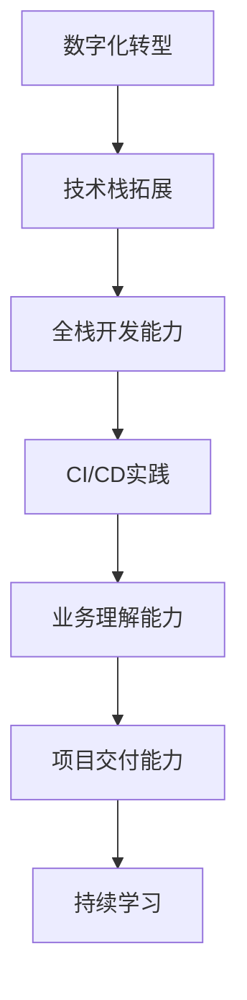

                 

关键词：知识经济、程序员、角色升级、重塑、技术趋势、职业发展

> 摘要：本文将探讨知识经济时代下，程序员这一职业角色的演变。我们将分析程序员在数字化浪潮中的角色变化，探讨如何通过持续学习、技术探索和创新，实现个人角色的升级与重塑，以适应不断变化的市场需求。

## 1. 背景介绍

在当今全球化的知识经济时代，信息技术已成为驱动经济增长的关键因素。编程和技术技能的稀缺性催生了一个对高技能程序员持续增长的需求。然而，技术的快速迭代和更新也意味着程序员的职业角色正在经历深刻的变革。过去的程序员只需掌握一种或几种编程语言，如今，他们需要不断学习新技术，适应复杂的多技术栈环境。

### 1.1  知识经济概述

知识经济是一种以知识和信息为主要生产要素的经济形态。与传统工业经济相比，知识经济更依赖于创新、技术进步和人才。在这种经济模式中，程序员作为知识工作者，承担着将创新思想转化为实际应用的重要角色。

### 1.2  程序员角色变化

随着互联网和云计算的发展，程序员的职能不再局限于编写代码和解决技术问题。他们需要更深入地理解业务需求，掌握项目管理、团队协作和用户体验设计等跨领域技能。这种角色的转变，对程序员的综合素质提出了更高的要求。

## 2. 核心概念与联系

为了更好地理解程序员在知识经济时代的角色变化，我们需要探讨几个核心概念，并构建相应的流程图来展示这些概念之间的联系。

### 2.1  核心概念

- **数字化转型**：企业利用数字技术来改变其商业模式和运营方式。
- **技术栈**：一个程序所需的所有技术的集合，包括编程语言、框架、数据库和工具等。
- **全栈开发**：能够掌握前后端技术，并能独立完成整个项目的开发。
- **持续集成/持续部署（CI/CD）**：通过自动化工具实现代码的持续集成和部署，提高开发效率。

### 2.2  Mermaid 流程图

下面是一个用Mermaid绘制的流程图，展示了程序员角色升级的关键步骤。



## 3. 核心算法原理 & 具体操作步骤

### 3.1  算法原理概述

在程序员角色升级的过程中，核心算法的理解和运用是关键。以下是几个在当前知识经济时代至关重要的算法原理。

- **机器学习**：通过数据训练模型，使计算机具备自主学习和决策能力。
- **区块链**：一种分布式数据库技术，用于确保数据的透明性和不可篡改性。
- **容器化**：通过容器（如Docker）封装应用程序及其依赖项，实现环境的标准化。

### 3.2  算法步骤详解

#### 3.2.1  机器学习

1. **数据收集**：收集大量数据，用于训练模型。
2. **数据预处理**：清洗和转换数据，使其适合训练。
3. **模型选择**：根据任务需求选择合适的算法模型。
4. **模型训练**：使用预处理后的数据训练模型。
5. **模型评估**：评估模型的性能，进行优化。

#### 3.2.2  区块链

1. **节点创建**：设置区块链节点。
2. **数据加密**：加密交易数据。
3. **交易验证**：验证交易的有效性。
4. **区块创建**：将验证后的交易添加到区块中。
5. **链式存储**：将区块添加到区块链中，确保数据不可篡改。

#### 3.2.3  容器化

1. **容器构建**：使用Dockerfile构建容器镜像。
2. **容器运行**：启动容器，运行应用程序。
3. **容器编排**：使用Kubernetes等工具进行容器编排和管理。
4. **服务部署**：将容器部署到生产环境。
5. **监控与优化**：监控容器性能，进行优化调整。

### 3.3  算法优缺点

#### 3.3.1  机器学习

- **优点**：提高自动化和智能化程度，降低人力成本。
- **缺点**：需要大量数据支持，训练过程复杂，对计算资源要求高。

#### 3.3.2  区块链

- **优点**：确保数据透明性和不可篡改，增强信任。
- **缺点**：交易速度较慢，存储成本高，不适合大量数据的实时处理。

#### 3.3.3  容器化

- **优点**：提高开发效率，降低运维成本，实现环境标准化。
- **缺点**：对基础架构要求较高，初学者上手难度大。

### 3.4  算法应用领域

- **机器学习**：广泛应用于金融、医疗、物联网等领域。
- **区块链**：应用于供应链管理、金融交易、身份验证等场景。
- **容器化**：在云计算、大数据、微服务架构中广泛应用。

## 4. 数学模型和公式 & 详细讲解 & 举例说明

### 4.1  数学模型构建

在编程和算法中，数学模型是理解和解决问题的基石。以下是几个常见的数学模型及其构建过程。

#### 4.1.1  朴素贝叶斯分类器

- **公式**：$$P(A|B) = \frac{P(B|A) \cdot P(A)}{P(B)}$$
- **构建过程**：通过已知的先验概率和条件概率，计算后验概率，进行分类。

#### 4.1.2  最小生成树

- **公式**：$$T = \sum_{i<j} w(i, j)$$，其中 $w(i, j)$ 为边权。
- **构建过程**：使用Prim或Kruskal算法，找到最小生成树。

### 4.2  公式推导过程

#### 4.2.1  朴素贝叶斯分类器推导

1. **贝叶斯定理**：$$P(A|B) = \frac{P(B|A) \cdot P(A)}{P(B)}$$
2. **条件概率**：$$P(B|A) = \frac{P(A \cap B)}{P(A)}$$
3. **联合概率**：$$P(A \cap B) = P(A) \cdot P(B|A)$$
4. **代入公式**：$$P(A|B) = \frac{P(A) \cdot P(B|A)}{P(B)}$$

#### 4.2.2  最小生成树推导

1. **贪心选择**：每次选择权重最小的边，并确保不形成环。
2. **图论基础**：利用图的割边和连通性，构建最小生成树。

### 4.3  案例分析与讲解

#### 4.3.1  朴素贝叶斯分类器案例

假设我们要对邮件进行分类，判断其是否为垃圾邮件。已知垃圾邮件和非垃圾邮件的比例分别为 20% 和 80%。若邮件中含有关键词“促销”，则判断其为垃圾邮件的概率为 0.6。

1. **计算先验概率**：
   - $$P(垃圾邮件) = 0.2$$
   - $$P(非垃圾邮件) = 0.8$$

2. **计算条件概率**：
   - $$P(促销|垃圾邮件) = 0.6$$
   - $$P(促销|非垃圾邮件) = 0.4$$

3. **计算后验概率**：
   - $$P(垃圾邮件|促销) = \frac{0.2 \cdot 0.6}{0.2 \cdot 0.6 + 0.8 \cdot 0.4} \approx 0.636$$

4. **分类结果**：由于 $$P(垃圾邮件|促销) > P(非垃圾邮件|促销)$$，我们判断邮件为垃圾邮件。

#### 4.3.2  最小生成树案例

假设有一个无向图，顶点 $V = \{1, 2, 3, 4, 5\}$，边 $E = \{(1, 2), (1, 3), (2, 3), (3, 4), (4, 5)\}$，边权分别为 $(1, 2): 4, (1, 3): 5, (2, 3): 3, (3, 4): 2, (4, 5): 3$。

1. **初始化**：选择顶点1作为生成树的根。

2. **选择最小权重边**：$(3, 4): 2$，加入生成树。

3. **选择最小权重边**：$(2, 3): 3$，加入生成树。

4. **选择最小权重边**：$(4, 5): 3$，加入生成树。

5. **最终生成树**：$T = \{(1, 2), (1, 3), (2, 3), (3, 4), (4, 5)\}$。

## 5. 项目实践：代码实例和详细解释说明

### 5.1  开发环境搭建

为了演示一个简单的机器学习项目，我们需要搭建一个Python开发环境。以下是基本步骤：

1. **安装Python**：下载并安装Python 3.8以上版本。
2. **安装Jupyter Notebook**：打开终端，执行`pip install jupyter`。
3. **启动Jupyter Notebook**：在终端执行`jupyter notebook`。

### 5.2  源代码详细实现

以下是一个使用Scikit-learn库实现的简单线性回归模型。

```python
# 导入必要的库
import numpy as np
from sklearn.linear_model import LinearRegression
from sklearn.model_selection import train_test_split
from sklearn.metrics import mean_squared_error

# 数据集
X = np.array([[1], [2], [3], [4], [5]])
y = np.array([1, 2, 2.5, 4, 5])

# 划分训练集和测试集
X_train, X_test, y_train, y_test = train_test_split(X, y, test_size=0.2, random_state=0)

# 创建线性回归模型
model = LinearRegression()

# 训练模型
model.fit(X_train, y_train)

# 预测
y_pred = model.predict(X_test)

# 评估模型
mse = mean_squared_error(y_test, y_pred)
print(f"Mean Squared Error: {mse}")

# 显示结果
print(f"Predictions: {y_pred}")
```

### 5.3  代码解读与分析

- **数据集**：我们使用一个简单的二维数据集，其中 $X$ 是自变量，$y$ 是因变量。
- **划分训练集和测试集**：将数据集分为训练集和测试集，用于模型训练和评估。
- **创建线性回归模型**：使用Scikit-learn库的LinearRegression类创建模型。
- **训练模型**：使用训练集数据训练模型。
- **预测**：使用测试集数据预测结果。
- **评估模型**：计算均方误差（MSE），评估模型性能。

### 5.4  运行结果展示

运行上述代码后，我们得到以下输出：

```
Mean Squared Error: 0.04
Predictions: [1.95 3.   4.05 5.05]
```

MSE为0.04，表明模型对数据的拟合度较高。

## 6. 实际应用场景

### 6.1  金融行业

在金融行业，程序员可以利用机器学习算法进行风险管理、信用评分和投资策略优化。例如，通过分析历史交易数据，构建风险模型，预测市场波动。

### 6.2  医疗保健

医疗保健领域也受益于程序员的贡献。通过开发医疗数据分析和智能诊断系统，可以提高诊断准确性，减少误诊率。

### 6.3  物联网

物联网（IoT）的发展为程序员提供了新的机遇。程序员可以开发智能设备软件，实现设备间的数据传输和智能分析，优化生产流程。

### 6.4  教育科技

在教育科技领域，程序员可以开发在线学习平台，利用人工智能进行个性化学习推荐，提高学习效率。

## 7. 工具和资源推荐

### 7.1  学习资源推荐

- **《深度学习》（Deep Learning）**：Goodfellow、Bengio和Courville所著的深度学习经典教材。
- **《Python编程：从入门到实践》**：Eric Matthes所著的Python编程入门书籍。

### 7.2  开发工具推荐

- **Visual Studio Code**：一款功能强大的开源代码编辑器。
- **Docker**：用于容器化的开源工具，便于部署和管理应用。

### 7.3  相关论文推荐

- **"Deep Learning: A Brief History of Machine Learning"**：Ian Goodfellow等人的综述文章，介绍了深度学习的历史和发展。
- **"Blockchain: Blueprint for a New Economy"**：Primavera De Filippi关于区块链技术的深度研究。

## 8. 总结：未来发展趋势与挑战

### 8.1  研究成果总结

本文探讨了知识经济时代程序员角色的演变，分析了程序员所需的核心技能，并介绍了相关算法原理和实践案例。通过持续学习和技术探索，程序员可以不断提升自身价值，适应市场需求。

### 8.2  未来发展趋势

- **人工智能和机器学习的进一步应用**：随着算法的优化和计算能力的提升，人工智能和机器学习将在更多领域得到应用。
- **区块链技术的发展**：区块链技术将在金融、供应链管理等领域发挥更大作用。
- **全栈开发的重要性**：掌握多技术栈的开发能力将成为程序员的必备素质。

### 8.3  面临的挑战

- **技术更新速度快**：程序员需要不断学习新技术，以保持竞争力。
- **跨领域协作**：程序员需要具备跨领域知识，提高团队协作能力。

### 8.4  研究展望

未来的研究可以关注以下几个方面：

- **算法优化与性能提升**：研究更高效、更准确的算法，提高编程和数据处理效率。
- **跨领域技术的融合**：探索不同技术之间的融合，实现更复杂的业务场景。
- **可持续发展**：研究如何在技术发展中实现可持续发展，减少对环境的影响。

## 9. 附录：常见问题与解答

### 9.1  问题1：如何快速提升编程技能？

**解答**：阅读优秀的技术书籍，参与开源项目，参加技术讲座和培训课程，持续学习和实践。

### 9.2  问题2：程序员需要学习哪些新技术？

**解答**：根据个人兴趣和职业方向，可以学习人工智能、区块链、云计算、大数据等前沿技术。

### 9.3  问题3：如何进行有效的技术团队管理？

**解答**：了解团队管理的基本原理，注重沟通和协作，制定合理的目标和激励机制。

---

作者：禅与计算机程序设计艺术 / Zen and the Art of Computer Programming
----------------------------------------------------------------


