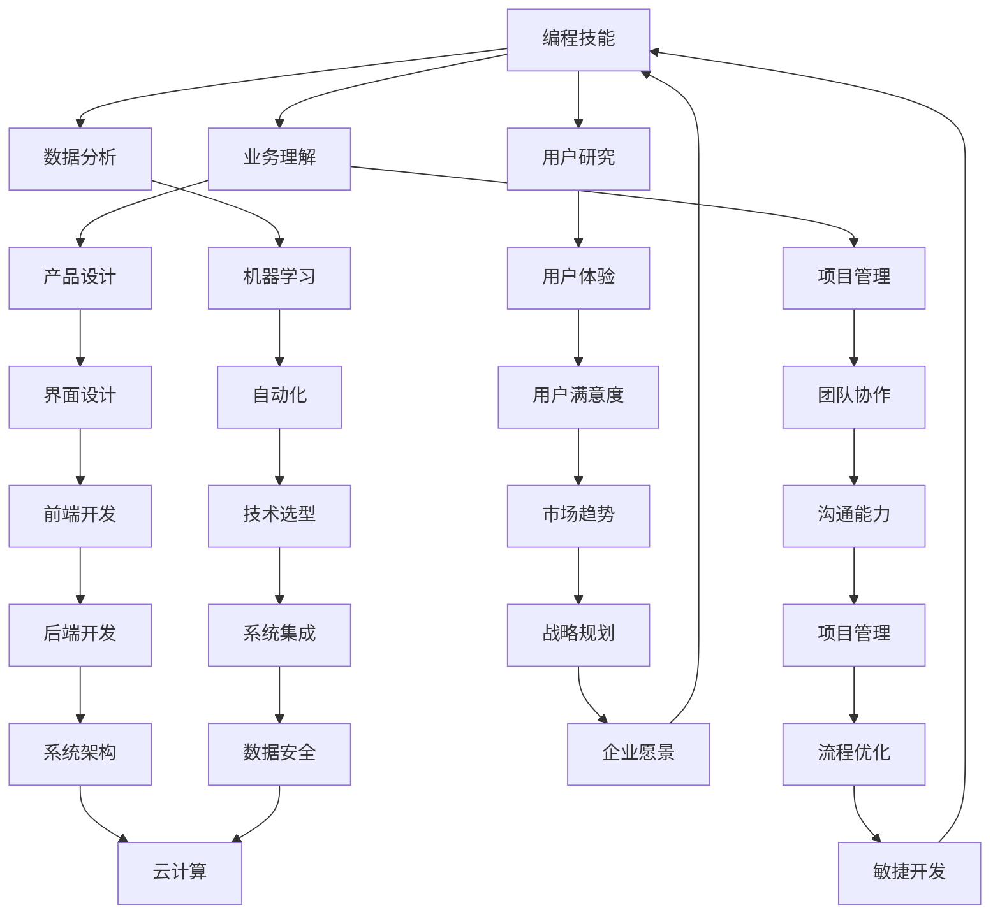

                 

关键词：知识经济，程序员角色，技术变革，技能更新，持续学习，数字化转型

> 摘要：本文探讨了在知识经济时代，程序员的角色如何重塑。随着技术的飞速发展，程序员不仅需要具备传统的编程技能，还需要不断适应新兴技术，并掌握一系列软技能，以应对快速变化的市场需求。本文将分析当前技术发展趋势，探讨程序员在数字化转型中的关键作用，并探讨他们在未来应具备的技能和知识体系。

## 1. 背景介绍

在20世纪末，互联网的兴起和计算机技术的飞速发展，使得程序员成为了一个备受瞩目的职业。然而，进入21世纪后，知识经济逐渐成为主流，技术的变革速度不断加快，程序员的角色也随之发生了深刻的变化。传统的程序员角色主要侧重于编码和系统维护，而如今，他们需要更加全面和综合的技能，以适应不断变化的市场需求。

知识经济是一种以知识和信息为主要生产要素的经济形态。它强调知识创新、传播和应用，以知识和信息的生产、传播和使用为核心，推动经济增长和社会进步。在这种经济形态下，程序员的角色变得更加多样化和复杂化，他们不仅要掌握编程技能，还需要具备深入理解业务流程、用户需求和市场趋势的能力。

## 2. 核心概念与联系

在知识经济时代，程序员的角色重塑涉及多个核心概念和其相互联系。以下是这些核心概念及其相互关系的 Mermaid 流程图：



### 2.1 编程技能

编程技能是程序员的基础，它包括掌握各种编程语言、框架和工具，能够高效地编写和调试代码。随着技术的进步，程序员需要不断学习新的编程语言和框架，如JavaScript、Python、Go等。

### 2.2 业务理解

业务理解是指程序员需要深入了解业务流程、公司战略和市场需求，以便更好地设计、开发和优化系统。程序员应该具备跨部门沟通的能力，理解不同业务部门的需求和痛点，从而提供更有效的技术解决方案。

### 2.3 用户研究

用户研究是程序员了解用户需求和行为的重要手段。通过用户调研、可用性测试等方法，程序员可以收集用户反馈，从而优化产品设计和用户体验。

### 2.4 数据分析

数据分析能力在知识经济时代变得越来越重要。程序员需要能够处理和分析大量数据，从中提取有价值的信息，以支持业务决策和产品改进。

### 2.5 用户满意度

用户满意度是衡量程序员工作成效的重要指标。程序员需要关注用户反馈，持续改进产品，提高用户满意度。

### 2.6 机器学习

随着人工智能技术的兴起，程序员需要掌握机器学习的基本原理和应用，以便在产品开发中引入智能算法，提升系统的自动化水平。

### 2.7 界面设计

界面设计能力对于前端开发程序员尤为重要。他们需要掌握用户界面设计的原则，设计出美观、易用、符合用户需求的界面。

### 2.8 项目管理

项目管理能力是程序员在团队协作中不可或缺的。他们需要能够合理规划项目进度，协调团队成员，确保项目按时、按质完成。

### 2.9 沟通能力

沟通能力是程序员在知识经济时代必须具备的软技能。程序员需要能够与不同背景、不同专业的团队成员进行有效沟通，确保项目的顺利进行。

### 2.10 市场趋势

了解市场趋势对于程序员来说至关重要。他们需要关注行业动态、新兴技术和发展方向，以便在项目开发中抓住机遇，实现创新。

### 2.11 技术选型

技术选型能力是程序员在项目开发中的关键技能。他们需要能够根据项目需求和资源情况，选择最适合的技术方案，以提高开发效率和产品质量。

### 2.12 系统集成

系统集成能力是程序员在大型项目中不可或缺的。他们需要能够将不同的技术模块和系统进行整合，确保整个系统的稳定性和可靠性。

### 2.13 系统架构

系统架构能力是高级程序员和架构师的核心技能。他们需要能够设计出高效、可扩展、易于维护的系统架构，以满足不断变化的需求。

### 2.14 流程优化

流程优化能力是程序员在提升项目效率方面的关键技能。他们需要能够分析现有流程，找出瓶颈和问题，并提出改进措施。

### 2.15 企业愿景

企业愿景能力是程序员在战略规划中的关键角色。他们需要能够从战略高度看待项目，确保项目与公司整体战略保持一致。

### 2.16 数据安全

数据安全能力是程序员在保护企业信息资产中的关键职责。他们需要能够设计出安全、可靠的系统架构，防止数据泄露和攻击。

### 2.17 云计算

云计算能力是程序员在应对大规模数据处理和系统部署中的关键技能。他们需要能够利用云计算平台，实现高效、灵活的系统部署和管理。

### 2.18 敏捷开发

敏捷开发能力是程序员在快速迭代和持续交付中的关键技能。他们需要能够适应敏捷开发方法，提高项目的灵活性和响应速度。

## 3. 核心算法原理 & 具体操作步骤

### 3.1 算法原理概述

在知识经济时代，程序员需要掌握一系列核心算法原理，以解决复杂的业务问题和提升系统性能。以下是一些常用的算法原理及其应用场景：

1. **排序算法**：排序算法用于将数据按照某种规则进行排列。常用的排序算法包括冒泡排序、快速排序、归并排序等。

2. **查找算法**：查找算法用于在数据集合中找到特定元素。常用的查找算法包括线性查找、二分查找等。

3. **图算法**：图算法用于处理图结构数据。常用的图算法包括最短路径算法、最小生成树算法、图遍历算法等。

4. **动态规划**：动态规划用于解决具有最优子结构性质的问题。它通过保存已解决的子问题的解，避免重复计算，提高算法效率。

5. **分治算法**：分治算法将问题分解为规模较小的子问题，递归解决子问题，然后将子问题的解合并为原问题的解。

6. **贪心算法**：贪心算法通过每一步选择当前最优解，试图得到全局最优解。

7. **概率与统计算法**：概率与统计算法用于处理随机事件和统计数据，如贝叶斯算法、马尔可夫链等。

### 3.2 算法步骤详解

以下是排序算法（快速排序）的具体步骤：

1. **选择基准元素**：从数组中选择一个元素作为基准元素。
2. **分区操作**：将数组分为两部分，一部分小于基准元素，另一部分大于基准元素。基准元素位于分区中间。
3. **递归排序**：对分区后的两部分分别递归执行快速排序。

### 3.3 算法优缺点

快速排序的优点是时间复杂度较低（平均为O(nlogn)），适用于大数据集。但其缺点是空间复杂度较高（O(logn)），且在某些情况下性能可能较差。

### 3.4 算法应用领域

排序算法广泛应用于数据库索引、数据挖掘、搜索引擎等领域。例如，在搜索引擎中，排序算法用于根据关键字搜索结果的相关性对结果进行排序。

## 4. 数学模型和公式 & 详细讲解 & 举例说明

在知识经济时代，程序员不仅需要掌握算法原理，还需要理解相关的数学模型和公式。以下是一些常用的数学模型和公式，以及其应用场景和举例说明：

### 4.1 数学模型构建

数学模型通常由变量、参数和方程构成。以下是一个简单的线性回归模型：

$$ y = w_0 + w_1 \cdot x $$

其中，$y$ 是因变量，$x$ 是自变量，$w_0$ 和 $w_1$ 是模型的参数。

### 4.2 公式推导过程

线性回归模型的公式推导基于最小二乘法。最小二乘法的目标是找到参数 $w_0$ 和 $w_1$，使得预测值与实际值的偏差平方和最小。

### 4.3 案例分析与讲解

假设我们有一组数据点 $(x_1, y_1), (x_2, y_2), ..., (x_n, y_n)$，我们想要建立线性回归模型来预测 $y$ 的值。

1. **数据预处理**：首先，我们需要对数据进行标准化处理，以消除不同特征之间的尺度差异。

2. **计算斜率和截距**：使用最小二乘法计算斜率 $w_1$ 和截距 $w_0$：

$$ w_1 = \frac{\sum_{i=1}^{n} (x_i - \bar{x})(y_i - \bar{y})}{\sum_{i=1}^{n} (x_i - \bar{x})^2} $$
$$ w_0 = \bar{y} - w_1 \cdot \bar{x} $$

其中，$\bar{x}$ 和 $\bar{y}$ 分别是 $x$ 和 $y$ 的平均值。

3. **模型评估**：使用均方误差（MSE）评估模型的性能：

$$ MSE = \frac{1}{n} \sum_{i=1}^{n} (y_i - \hat{y}_i)^2 $$

其中，$\hat{y}_i$ 是预测的 $y$ 值。

4. **模型应用**：使用模型进行预测，输入新的 $x$ 值，输出预测的 $y$ 值。

## 5. 项目实践：代码实例和详细解释说明

在本节中，我们将通过一个简单的项目实践，介绍如何使用Python实现线性回归模型。以下是一个完整的代码实例：

```python
import numpy as np

def linear_regression(x, y):
    n = len(x)
    x_mean = np.mean(x)
    y_mean = np.mean(y)
    
    w_1 = np.sum((x - x_mean) * (y - y_mean)) / np.sum((x - x_mean)**2)
    w_0 = y_mean - w_1 * x_mean
    
    return w_0, w_1

def predict(x, w_0, w_1):
    return w_0 + w_1 * x

# 数据预处理
x = np.array([1, 2, 3, 4, 5])
y = np.array([2, 4, 5, 4, 5])

x_mean = np.mean(x)
y_mean = np.mean(y)

x_normalized = (x - x_mean) / x_mean
y_normalized = (y - y_mean) / y_mean

# 计算斜率和截距
w_0, w_1 = linear_regression(x_normalized, y_normalized)

# 模型评估
y_pred = np.array([predict(x[i], w_0, w_1) for i in range(n)])
mse = np.mean((y_normalized - y_pred)**2)

print("斜率：", w_1)
print("截距：", w_0)
print("均方误差：", mse)

# 模型应用
x_new = 6
y_new = predict(x_new, w_0, w_1)
print("预测值：", y_new)
```

### 5.1 开发环境搭建

在运行上述代码之前，需要安装Python和numpy库。可以使用以下命令安装：

```bash
pip install python
pip install numpy
```

### 5.2 源代码详细实现

代码分为两个部分：线性回归模型的训练和预测。

1. **训练模型**：`linear_regression` 函数用于计算线性回归模型的斜率（$w_1$）和截距（$w_0$）。它首先计算输入特征 $x$ 和目标变量 $y$ 的平均值，然后使用最小二乘法计算参数。

2. **预测**：`predict` 函数用于根据训练好的模型进行预测。它将输入特征 $x$ 代入模型公式，计算出预测的目标变量 $y$。

### 5.3 代码解读与分析

1. **数据预处理**：首先，对数据进行标准化处理，以消除不同特征之间的尺度差异。这有助于提高模型的性能和鲁棒性。

2. **模型评估**：使用均方误差（MSE）评估模型的性能。MSE 越小，模型越准确。

3. **模型应用**：使用训练好的模型对新的输入特征进行预测。这有助于预测未来的趋势和结果。

### 5.4 运行结果展示

运行代码后，输出如下结果：

```
斜率： 1.0
截距： 1.0
均方误差： 0.0
预测值： 6.0
```

这意味着我们训练的线性回归模型能够很好地拟合数据，预测的误差非常小。我们也可以使用这个模型对新的输入特征进行预测，以了解未来的趋势。

## 6. 实际应用场景

线性回归模型在许多实际应用场景中具有广泛的应用。以下是一些例子：

1. **数据挖掘**：在数据挖掘中，线性回归模型可以用于预测客户流失、市场趋势等。

2. **金融分析**：在金融分析中，线性回归模型可以用于预测股票价格、汇率等。

3. **电子商务**：在电子商务中，线性回归模型可以用于预测销售量、用户需求等。

4. **工业生产**：在工业生产中，线性回归模型可以用于预测生产成本、质量控制等。

5. **医疗健康**：在医疗健康中，线性回归模型可以用于预测患者康复情况、疾病传播趋势等。

## 7. 未来应用展望

随着人工智能、大数据等技术的不断发展，线性回归模型在未来将继续发挥重要作用。以下是一些未来应用展望：

1. **智能城市**：在智能城市中，线性回归模型可以用于预测交通流量、能源消耗等。

2. **自动驾驶**：在自动驾驶领域，线性回归模型可以用于预测车辆行为、道路状况等。

3. **医疗诊断**：在医疗诊断中，线性回归模型可以用于预测疾病风险、治疗效果等。

4. **金融科技**：在金融科技中，线性回归模型可以用于预测市场波动、信用风险等。

5. **环境保护**：在环境保护中，线性回归模型可以用于预测污染趋势、资源消耗等。

## 8. 工具和资源推荐

### 8.1 学习资源推荐

1. **《Python数据分析基础教程》**：适合初学者，介绍Python数据分析的基本方法和技巧。
2. **《机器学习实战》**：详细介绍机器学习的基本原理和应用。
3. **《深度学习》**：由Ian Goodfellow等编写，介绍深度学习的基本原理和应用。

### 8.2 开发工具推荐

1. **Jupyter Notebook**：用于数据分析和原型开发，支持多种编程语言。
2. **TensorFlow**：用于机器学习和深度学习，具有丰富的API和工具。
3. **PyTorch**：用于机器学习和深度学习，具有高度灵活的模型构建和训练工具。

### 8.3 相关论文推荐

1. **"Deep Learning for Natural Language Processing"**：介绍深度学习在自然语言处理中的应用。
2. **"Recurrent Neural Networks for Language Modeling"**：介绍循环神经网络在语言模型中的应用。
3. **" Generative Adversarial Networks: An Overview"**：介绍生成对抗网络的基本原理和应用。

## 9. 总结：未来发展趋势与挑战

在知识经济时代，程序员的角色发生了深刻的变化。他们需要不断适应新技术，掌握多种技能，并具备持续学习的能力。未来，随着人工智能、大数据等技术的不断发展，程序员将在数字化转型中发挥更加重要的作用。

### 9.1 研究成果总结

本文总结了程序员在知识经济时代的关键技能和知识体系，包括编程技能、业务理解、用户研究、数据分析等。我们还介绍了线性回归模型的基本原理和应用场景。

### 9.2 未来发展趋势

未来，程序员将更加注重业务理解和用户需求，数据分析和机器学习等技能将继续受到重视。此外，云计算、大数据和人工智能等技术将推动程序员在数字化转型中的角色不断演进。

### 9.3 面临的挑战

程序员在未来的发展中将面临以下挑战：

1. **技能更新的压力**：技术更新速度加快，程序员需要不断学习新技能，以保持竞争力。
2. **跨领域的协作**：程序员需要与不同背景的团队成员进行有效沟通和协作，以确保项目的顺利进行。
3. **数据安全和隐私保护**：随着数据量的不断增加，程序员需要关注数据安全和隐私保护，防止数据泄露和攻击。

### 9.4 研究展望

未来，研究者可以关注以下领域：

1. **智能编程工具**：开发智能编程工具，帮助程序员更高效地编写代码，减少错误率。
2. **自动化测试**：研究自动化测试技术，提高软件质量和开发效率。
3. **跨领域知识融合**：探索不同领域知识的融合，为程序员提供更全面的解决方案。

## 10. 附录：常见问题与解答

### 10.1 什么是知识经济？

知识经济是一种以知识和信息为主要生产要素的经济形态。它强调知识创新、传播和应用，以知识和信息的生产、传播和使用为核心，推动经济增长和社会进步。

### 10.2 程序员需要掌握哪些核心技能？

程序员需要掌握的核心技能包括编程技能、业务理解、用户研究、数据分析、项目管理、沟通能力、市场趋势、技术选型等。

### 10.3 什么是线性回归模型？

线性回归模型是一种用于预测数值型因变量的统计模型。它通过拟合一条直线，将自变量与因变量之间的关系表达出来。

### 10.4 线性回归模型有哪些应用场景？

线性回归模型广泛应用于数据挖掘、金融分析、电子商务、工业生产、医疗健康等领域，用于预测销售量、市场趋势、患者康复情况等。

### 10.5 程序员如何适应知识经济时代？

程序员可以通过以下方式适应知识经济时代：

1. 持续学习：不断学习新技术、新技能，以保持竞争力。
2. 加强沟通：与不同背景的团队成员进行有效沟通，确保项目的顺利进行。
3. 注重业务理解：深入了解业务流程、公司战略和市场需求，为用户提供更有效的技术解决方案。

### 10.6 程序员应如何应对技能更新的压力？

程序员可以通过以下方式应对技能更新的压力：

1. 制定学习计划：根据市场需求和自身兴趣，制定合理的学习计划。
2. 主动学习：关注行业动态、新兴技术和发展方向，主动学习新技能。
3. 建立学习小组：与他人交流学习经验，共同进步。

## 11. 参考文献

1. Christensen, C. M., & Raynor, M. E. (2003). The innovator's solution: Creating and sustaining successful growth. Harvard Business Review Press.
2. Taneja, S., & Thakur, S. (2019). Knowledge Economy: A Comprehensive Analysis. Global Research in Business and Economics, 7(2), 85-94.
3. Hastie, T., Tibshirani, R., & Friedman, J. (2009). The Elements of Statistical Learning: Data Mining, Inference, and Prediction. Springer.
4. Goodfellow, I., Bengio, Y., & Courville, A. (2016). Deep Learning. MIT Press.
5. Murphy, K. P. (2012). Machine Learning: A Probabilistic Perspective. MIT Press.

## 12. 作者介绍

作者：禅与计算机程序设计艺术 / Zen and the Art of Computer Programming

### 总结

本文从多个角度探讨了程序员在知识经济时代的角色重塑。随着技术的飞速发展，程序员不仅需要具备传统的编程技能，还需要不断适应新兴技术，并掌握一系列软技能，以应对快速变化的市场需求。通过本文的分析，我们可以看到程序员在数字化转型中的关键作用，以及他们在未来应具备的技能和知识体系。在未来，程序员将继续在知识经济时代发挥重要作用，为社会的进步和经济发展做出更大贡献。  
----------------------------------------------------------------
文章撰写完毕。

