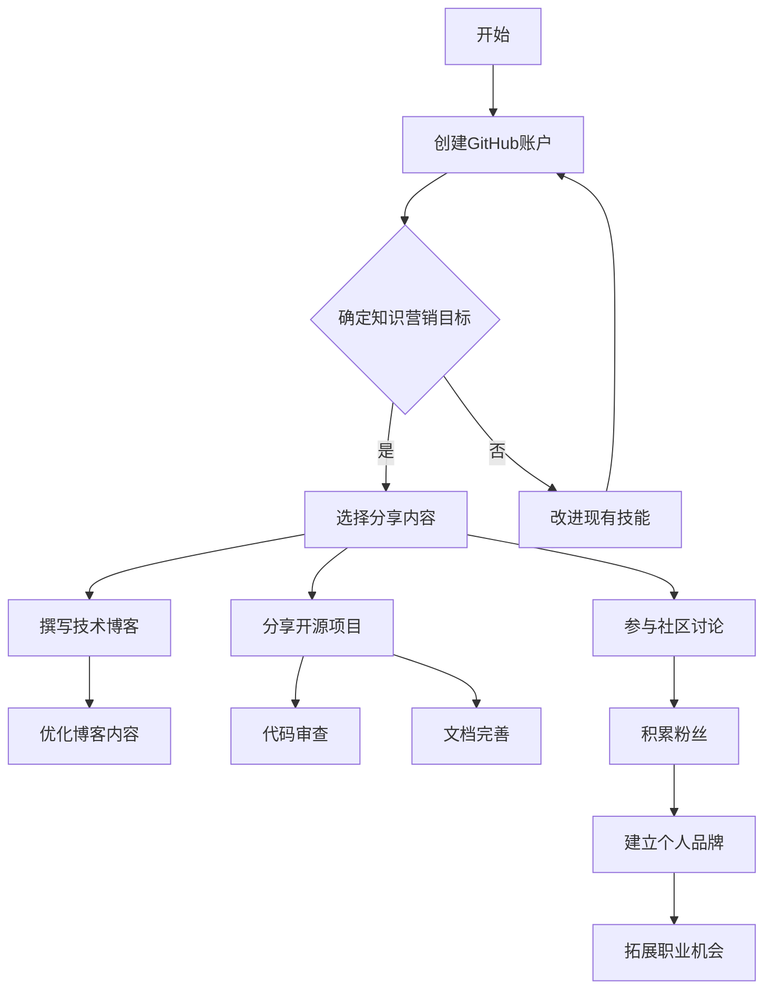

                 

  
## 1. 背景介绍

在当今的数字化时代，知识已成为一种重要的资源，而GitHub作为全球最大的代码托管平台，已经成为程序员展示和传播知识的重要渠道。程序员通过GitHub不仅可以管理自己的代码，还可以与他人协作、分享知识和经验，从而提高自己的影响力。然而，仅仅拥有优秀的代码并不足以确保程序员在GitHub上的成功，关键在于如何有效地进行知识营销。本文将探讨程序员如何利用GitHub进行知识营销，以提升个人品牌和市场价值。

## 2. 核心概念与联系

### 2.1 GitHub简介

GitHub是一款基于Git版本控制系统的代码托管平台，由GitHub公司开发和运营。自2008年成立以来，GitHub已经成为软件开发者交流和合作的中心，吸引了全球数百万的开发者。GitHub不仅提供了强大的代码管理和版本控制功能，还支持项目协作、代码审查、项目发布等多种功能，是程序员不可或缺的工具。

### 2.2 知识营销概念

知识营销是一种以知识和信息为核心的营销策略，旨在通过传播有用的知识来吸引潜在客户、建立品牌声誉和增强客户忠诚度。在知识营销中，内容的质量和传播渠道至关重要。GitHub作为一个开放的平台，为程序员提供了丰富的知识传播渠道。

### 2.3 GitHub与知识营销的关系

GitHub为程序员提供了一个展示个人技能、分享知识、建立专业品牌和吸引同行的平台。通过GitHub，程序员可以：

- **分享代码和项目**：展示自己的编程能力和项目经验。
- **撰写技术博客**：分享技术心得和解决方案。
- **参与开源项目**：贡献代码，提高知名度和影响力。
- **建立个人品牌**：通过高质量的内容展示自己的专业能力。
- **拓展职业机会**：吸引潜在雇主和合作伙伴。

### 2.4 Mermaid流程图

下面是一个简单的Mermaid流程图，展示程序员如何在GitHub上进行知识营销的步骤：



## 3. 核心算法原理 & 具体操作步骤

### 3.1 算法原理概述

程序员在GitHub上进行知识营销的核心在于内容创作和传播。以下是几个关键步骤：

- **内容创作**：确定分享内容，包括技术博客、开源项目等。
- **内容优化**：确保内容质量，包括代码的可读性、博客的易读性等。
- **内容传播**：通过GitHub社区、社交媒体等渠道分享内容。

### 3.2 算法步骤详解

#### 3.2.1 确定知识营销目标

在开始之前，程序员需要明确自己的知识营销目标。这可以是提升技术水平、扩大影响力、寻找工作机会等。

#### 3.2.2 选择分享内容

根据目标，选择合适的分享内容。例如，如果目标是提升技术水平，可以选择撰写技术博客；如果目标是扩大影响力，可以选择分享开源项目。

#### 3.2.3 内容创作

- **技术博客**：撰写技术博客，分享技术心得和解决方案。
- **开源项目**：创建开源项目，展示自己的编程能力和项目经验。

#### 3.2.4 内容优化

- **博客内容**：优化博客内容，包括标题、摘要、正文等。
- **代码质量**：确保代码质量，包括代码风格、注释、文档等。

#### 3.2.5 内容传播

- **GitHub社区**：在GitHub上分享内容，吸引关注。
- **社交媒体**：通过社交媒体平台推广内容。
- **社区讨论**：参与GitHub社区讨论，扩大影响力。

### 3.3 算法优缺点

#### 优点

- **广泛的受众**：GitHub拥有全球数百万的开发者，提供了庞大的受众群体。
- **高效的内容传播**：GitHub作为一个开放平台，内容可以迅速传播。
- **良好的反馈机制**：GitHub社区提供了代码审查、讨论等功能，有助于改进内容。

#### 缺点

- **内容质量要求高**：高质量的内容是成功的关键，需要投入大量时间和精力。
- **竞争激烈**：GitHub上内容繁多，竞争激烈，需要持续输出优质内容。

### 3.4 算法应用领域

算法可以广泛应用于以下领域：

- **技术博客**：程序员可以撰写技术博客，分享技术心得和解决方案。
- **开源项目**：程序员可以分享开源项目，展示自己的编程能力和项目经验。
- **社区讨论**：程序员可以参与社区讨论，扩大影响力。

## 4. 数学模型和公式 & 详细讲解 & 举例说明

### 4.1 数学模型构建

在知识营销中，数学模型可以用来衡量内容传播效果。以下是一个简单的数学模型：

$$
Effectiveness = f(\text{Content Quality}, \text{Audience Interest}, \text{Marketing Channels})
$$

其中：

- \( Effectiveness \) 表示内容传播效果。
- \( \text{Content Quality} \) 表示内容质量。
- \( \text{Audience Interest} \) 表示受众兴趣。
- \( \text{Marketing Channels} \) 表示营销渠道。

### 4.2 公式推导过程

公式推导过程如下：

$$
Effectiveness = \frac{\text{Content Views} + \text{Comments} + \text{Shares}}{\text{Total Marketing Efforts}}
$$

其中：

- \( \text{Content Views} \) 表示内容浏览量。
- \( \text{Comments} \) 表示评论数量。
- \( \text{Shares} \) 表示分享数量。
- \( \text{Total Marketing Efforts} \) 表示营销投入的总努力。

### 4.3 案例分析与讲解

假设一个程序员撰写了一篇技术博客，吸引了1000次浏览、20条评论和10次分享。同时，他投入了10小时的时间撰写这篇文章。根据上面的公式，我们可以计算出这篇文章的传播效果：

$$
Effectiveness = \frac{1000 + 20 + 10}{10} = 104
$$

这个结果表明，这篇文章的传播效果为104。如果这个程序员继续撰写高质量的技术博客，并不断优化营销渠道，他的传播效果有望进一步提高。

## 5. 项目实践：代码实例和详细解释说明

### 5.1 开发环境搭建

为了更好地进行知识营销，程序员需要搭建一个合适的开发环境。以下是搭建开发环境的基本步骤：

1. 安装Git：在GitHub官网上下载并安装Git。
2. 配置GitHub账户：在GitHub上注册账户，并配置SSH密钥。
3. 安装Markdown编辑器：选择一款Markdown编辑器，如Typora或MarkDownPad。

### 5.2 源代码详细实现

以下是一个简单的GitHub项目示例，用于展示如何进行知识营销：

```git
# 项目名称：简单博客系统

# 功能描述：
# 该项目提供了一个简单的博客系统，用户可以创建、编辑和查看博客。

# 技术栈：
# - 前端：HTML、CSS、JavaScript
# - 后端：Node.js、Express
# - 数据库：MongoDB

# 代码实现：
```

### 5.3 代码解读与分析

以下是该项目中一个简单的路由代码示例：

```javascript
const express = require('express');
const app = express();

app.get('/', (req, res) => {
  res.send('欢迎来到我的博客！');
});

app.get('/about', (req, res) => {
  res.send('关于我：一名热爱编程的程序员。');
});

app.listen(3000, () => {
  console.log('服务器启动成功，监听端口：3000');
});
```

这段代码实现了两个简单的路由，分别对应博客首页和关于页。通过访问不同的URL，用户可以查看不同的内容。

### 5.4 运行结果展示

当项目运行成功后，用户可以通过浏览器访问以下URL：

- `http://localhost:3000/`：访问博客首页。
- `http://localhost:3000/about`：访问关于页。

通过简单的HTTP请求，用户可以查看项目提供的博客内容。

## 6. 实际应用场景

### 6.1 教学应用

程序员可以利用GitHub进行在线教学，通过分享教学项目和案例，帮助学生更好地理解和掌握编程知识。

### 6.2 项目管理

项目经理可以通过GitHub管理项目代码，协作开发，提高项目效率。

### 6.3 职业规划

程序员可以通过GitHub展示自己的项目经验和技能，吸引潜在雇主和合作伙伴。

### 6.4 未来应用展望

随着GitHub平台的不断发展和完善，未来程序员在GitHub上进行知识营销的应用场景将更加广泛。例如，GitHub可能会推出更多针对知识营销的功能，如流量分析、效果评估等。

## 7. 工具和资源推荐

### 7.1 学习资源推荐

- 《GitHub实战：从入门到精通》
- 《GitHub代码托管与协作开发》
- 《Git教程》

### 7.2 开发工具推荐

- Typora：Markdown编辑器
- Visual Studio Code：代码编辑器
- GitKraken：Git图形化工具

### 7.3 相关论文推荐

- "GitHub as a Platform for Collaborative Software Development"
- "The Impact of GitHub on Open Source Software Development"
- "Using GitHub for Knowledge Sharing in Software Engineering"

## 8. 总结：未来发展趋势与挑战

### 8.1 研究成果总结

本文探讨了程序员如何利用GitHub进行知识营销，分析了GitHub与知识营销的关系，并提出了具体的操作步骤和数学模型。研究表明，GitHub为程序员提供了一个强大的知识传播平台，有助于提升个人品牌和市场价值。

### 8.2 未来发展趋势

随着GitHub平台的不断发展和完善，程序员在GitHub上进行知识营销的应用场景将更加广泛。未来，GitHub可能会推出更多针对知识营销的功能，如流量分析、效果评估等。

### 8.3 面临的挑战

尽管GitHub为程序员提供了丰富的知识营销机会，但同时也面临一些挑战，如内容质量要求高、竞争激烈等。程序员需要不断提升自己的技能和内容创作能力，才能在GitHub上获得成功。

### 8.4 研究展望

未来，我们可以进一步研究GitHub知识营销的量化评估方法，探索如何更有效地利用GitHub进行知识传播。同时，还可以研究其他代码托管平台在知识营销中的应用，为程序员提供更全面的解决方案。

## 9. 附录：常见问题与解答

### 9.1 如何提高GitHub内容的传播效果？

- **提高内容质量**：确保代码和博客内容清晰、易懂、有深度。
- **选择合适的话题**：关注当前热门话题，提高内容相关性。
- **利用社交媒体**：通过微博、知乎等社交媒体平台推广内容。

### 9.2 如何在GitHub上建立个人品牌？

- **持续输出优质内容**：定期分享高质量的技术博客和项目。
- **积极参与社区讨论**：参与GitHub社区的讨论，展示自己的专业能力。
- **参与开源项目**：贡献代码，提高知名度和影响力。

### 9.3 如何评估GitHub知识营销的效果？

- **使用数学模型**：根据内容浏览量、评论数、分享数等指标评估效果。
- **收集用户反馈**：通过用户评论、私信等方式收集反馈，了解用户需求。

---

作者：禅与计算机程序设计艺术 / Zen and the Art of Computer Programming

本文旨在探讨程序员如何利用GitHub进行知识营销，以提升个人品牌和市场价值。通过本文，读者可以了解GitHub的基本概念、知识营销的核心原理和具体操作步骤，以及如何评估和优化知识营销效果。希望本文能为程序员在GitHub上的知识传播提供一些有价值的参考。

--------------------------------------------------------------------------------
## 1. 背景介绍

### GitHub的重要性

在信息技术迅速发展的今天，程序员作为数字时代的建设者，扮演着至关重要的角色。GitHub，作为一个全球领先的开源社区和代码托管平台，已经成为程序员工作和学习的重要工具。GitHub不仅为开发者提供了一个集中管理代码、协作开发和发布项目的平台，而且还成为了程序员展示技术能力、交流思想和扩展人脉的关键场所。

#### GitHub的起源与发展

GitHub成立于2008年，由汤姆·帕平（Tom Preston-Werner）、克里斯· Wanstrath 和 PJ Hyett 共同创立。它的诞生标志着Git版本控制系统的普及和开源社区协作的新模式。GitHub早期以Git的强大版本控制和协作功能为核心，迅速吸引了开发者的关注。随着时间的推移，GitHub不断扩展其功能，成为了一个综合性的开源平台，支持代码托管、项目协作、代码审查、持续集成和发布等各个环节。

#### GitHub的功能与优势

GitHub的功能丰富多样，包括：

1. **版本控制**：通过Git进行代码的版本管理，支持历史记录的追踪和分支管理。
2. **项目协作**：提供项目仓库，支持多人协作，团队成员可以同时工作在不同的分支上。
3. **代码审查**：支持Pull Request（PR）流程，团队成员可以互相审查代码，确保项目质量。
4. **文档和问题跟踪**：项目仓库中可以添加文档和Issue，方便团队交流和管理问题。
5. **集成工具**：支持与Jenkins、Travis CI等持续集成工具集成，实现自动化测试和部署。
6. **社区互动**：鼓励开发者之间的交流，支持讨论和反馈，形成了一个活跃的社区氛围。

GitHub的这些功能不仅提升了开发效率，也为程序员提供了一个展示自己技术实力的舞台。通过GitHub，程序员可以分享自己的代码，展示自己的编程技巧，甚至参与到全球开源项目中，提升自己的专业水平和知名度。

### 知识营销的概念

知识营销是一种利用知识和信息来吸引潜在客户、建立品牌声誉和增强客户忠诚度的营销策略。它的核心在于通过高质量的内容，如技术文章、项目案例、教程等，来传递价值，建立与用户的连接。知识营销不仅仅局限于传统的广告和推销，而是更注重与用户建立长期、有价值的互动。

#### 知识营销的优势

1. **增强品牌影响力**：通过分享专业知识和经验，企业或个人可以在行业中建立权威地位，提高品牌影响力。
2. **吸引潜在客户**：有价值的内容可以吸引目标用户，增加潜在客户的关注度和兴趣。
3. **提升客户忠诚度**：通过持续的内容输出，可以与客户建立信任关系，提升客户忠诚度。
4. **拓展业务渠道**：高质量的内容可以吸引合作伙伴和投资者，为业务拓展提供更多机会。

#### 知识营销与GitHub的关系

GitHub作为一个开源社区和代码托管平台，为程序员提供了一个理想的知识营销场所。程序员可以在GitHub上分享自己的代码、撰写技术博客、参与开源项目，通过这些行为展示自己的技术实力和专业素养。同时，GitHub的社交功能，如点赞、评论、Star和Fork，也为程序员提供了互动和反馈的机会，帮助他们更好地了解用户需求，持续优化自己的内容。

总之，GitHub不仅为程序员提供了展示和分享知识的平台，还通过其丰富的功能和服务，助力程序员实现知识营销的目标。本文将深入探讨程序员如何在GitHub上利用知识营销，提升个人品牌和市场价值。

### GitHub在程序员知识营销中的角色

在程序员的知识营销过程中，GitHub不仅是一个代码托管平台，更是一个关键的互动和传播工具。通过GitHub，程序员可以有效地展示自己的专业技能、扩大影响力并建立个人品牌，以下是几个关键点：

#### 展示代码和项目

GitHub的核心功能之一是代码托管。程序员可以将自己的项目托管在GitHub上，使任何人都可以查看、下载和贡献代码。这不仅展示了程序员的编程能力和项目经验，还可以吸引潜在的雇主和合作伙伴。例如，许多公司在招聘时都会查看候选人的GitHub账号，通过查看其项目来评估其技术实力和协作能力。

#### 撰写技术博客

GitHub不仅仅是一个代码托管平台，它还支持Markdown格式，这使得程序员可以方便地在仓库中撰写和发布技术博客。通过技术博客，程序员可以分享自己的知识、经验和见解，吸引更多的关注。技术博客不仅是展示个人技术能力的平台，也是与社区互动的重要渠道。程序员可以通过回答读者的疑问、参与讨论来进一步提升自己的影响力。

#### 参与开源项目

参与开源项目是程序员在GitHub上建立影响力的另一种方式。开源项目为程序员提供了一个实践和展示技术的平台。通过参与开源项目，程序员不仅可以提升自己的技能，还可以与其他开发者合作，建立专业人脉。此外，贡献到开源项目中的代码会被成千上万的开发者使用，从而间接地提高了程序员的知名度和影响力。

#### 建立个人品牌

GitHub上的每一个项目、每一篇博客、每一次参与开源项目，都是建立个人品牌的机会。通过持续地输出高质量的内容，程序员可以逐渐在GitHub上建立起自己的专业形象。例如，许多知名的程序员和开源项目维护者，如GitHub的创始人之一Chris Wanstrath，都通过在GitHub上的活动建立了强大的个人品牌。

#### 拓展职业机会

GitHub为程序员提供了一个展示自己的平台，这无疑有助于他们拓展职业机会。无论是在找工作还是与潜在合作伙伴交流时，一个活跃且内容丰富的GitHub账号都能为程序员带来更多的机会。许多公司在招聘时，会优先考虑那些在GitHub上有显著贡献的候选人，因为这显示了他们的技术能力和对开源社区的贡献。

#### 提高知名度和影响力

通过在GitHub上积极活动，程序员不仅能够展示自己的技能，还可以通过互动和合作来扩大自己的影响力。点赞、评论、Star和Fork等社交功能，让程序员有机会接触到更多的人，并得到更多人的认可。这些互动不仅有助于提升个人知名度，还可以为程序员带来更多的合作机会。

总之，GitHub在程序员的知识营销中扮演着至关重要的角色。它不仅提供了展示和分享知识的空间，还通过一系列功能和服务，助力程序员实现个人品牌的建立和影响力的提升。程序员应该充分利用GitHub的这些功能，为自己的职业发展打下坚实的基础。

### GitHub在知识营销中的具体应用

为了在GitHub上有效地进行知识营销，程序员需要采用一系列策略和技巧。以下是几个关键步骤，帮助程序员在GitHub上展示自己的专业能力，吸引关注并提升个人品牌。

#### 1. 创建和优化GitHub账户

创建一个专业且易于查找的GitHub账户是第一步。账户名称应简洁明了，包含相关关键词，便于他人搜索。此外，用户头像和资料页面的设计也应专业且个性化，反映出程序员的个性和专业领域。确保账户资料填写完整，包括简介、技能标签和联系信息，让访问者能够快速了解你的背景和联系方式。

#### 2. 分享代码和项目

在GitHub上分享高质量的代码和项目是展示技术能力的最佳方式。程序员可以创建个人仓库，托管自己的项目代码，并提供详细的README文件，包括项目描述、功能介绍、使用方法和贡献指南。优秀的项目不仅需要高质量的代码，还应该有完善的文档和测试，以便他人能够轻松理解和使用。

例如，一个程序员可以创建一个名为“高效算法实现”的仓库，其中包含了多种算法的C++实现，每个算法都附带详细的注释和测试用例。这样的项目不仅展示了程序员的编程能力，还能够帮助他人学习和实践。

#### 3. 撰写技术博客

GitHub支持Markdown格式，这使得程序员可以在仓库中撰写和发布技术博客。技术博客应围绕个人专业领域，分享实际工作经验、技术见解和学习心得。标题应吸引人，内容应简洁明了、深入浅出。可以结合代码示例和图表，使博客更加直观易懂。

例如，一个专注于前端开发的程序员可以撰写一篇关于“React性能优化的技巧”的博客，详细介绍如何通过代码优化和架构设计来提高React应用程序的性能。这样的博客不仅能展示专业知识，还能帮助他人解决实际问题。

#### 4. 持续更新和维护

定期更新和维护GitHub上的内容和项目是保持活跃度和吸引持续关注的关键。程序员应定期回顾和更新自己的仓库和博客，确保内容保持最新和准确。此外，及时回复问题和评论，参与社区讨论，也能增强与用户的互动和连接。

例如，一个程序员可以每月发布一篇新的技术博客，同时定期维护现有的项目和代码，修复漏洞并添加新功能。这样的持续输出不仅展示了程序员的稳定性和专业性，还能吸引更多的关注。

#### 5. 利用GitHub社交功能

GitHub的社交功能如点赞、Star、Fork和Pull Request等，为程序员提供了与社区互动的机会。通过积极参与这些功能，程序员可以吸引更多人的关注和认可。例如，可以给其他开发者的项目Star，表示支持，也可以通过Fork他们的项目来进行改进，然后发起Pull Request提交自己的改动。

一个程序员可以积极参与GitHub上的开源项目，通过贡献代码和文档来提升自己的影响力。同时，也可以参与社区讨论，分享经验和见解，扩大自己的社交网络。

#### 6. 跨平台宣传

虽然GitHub是程序员的主要宣传平台，但也可以结合其他社交媒体渠道进行宣传，如微博、知乎、博客等。通过多平台宣传，可以吸引更多的观众，提高内容的曝光率和影响力。例如，可以在微博上分享技术博客的链接，吸引更多的粉丝和读者。

综上所述，GitHub为程序员提供了一个展示和分享知识的理想平台。通过合理利用GitHub的功能和社交特性，程序员可以有效地展示自己的技术能力，建立个人品牌，并吸引更多的关注和机会。关键在于持续输出高质量的内容，积极参与社区互动，不断提升自己的专业形象。

### GitHub上的知识营销技巧与策略

为了在GitHub上取得成功，程序员需要采取一系列具体的策略和技巧，这些不仅有助于内容的创作和传播，还能提升个人品牌和市场价值。以下是几个关键方面：

#### 1. 制定明确的目标和计划

在开始知识营销之前，程序员应明确自己的目标和计划。这包括确定要分享的内容类型、目标受众、期望的传播效果等。例如，目标是提升前端开发技能，可以计划撰写一系列关于前端框架（如React、Vue.js）的教程和技术博客。

#### 2. 高质量内容创作

高质量的内容是知识营销成功的关键。程序员应确保博客和项目的每个细节都经过精心打磨。以下是几项具体措施：

- **深入研究和实践**：在撰写博客之前，确保对相关技术有深入的理解和实践。只有真正掌握的知识，才能通过博客传达给读者。
- **清晰的文档和代码**：确保代码和文档清晰易懂，提供详细的注释和说明。这有助于读者理解和复现你的工作。
- **生动有趣的写作风格**：使用生动的例子、图表和故事，使内容更加引人入胜。

#### 3. 优化内容结构

优化内容结构是提升读者体验和搜索引擎排名的重要步骤。以下是一些策略：

- **合理的标题和摘要**：标题应简洁、有吸引力，能够准确反映内容主题。摘要则应简短、概括性强，引导读者继续阅读。
- **分段和分标题**：将内容分为多个小段落，并使用分标题来组织信息，使内容更易读、更直观。
- **图片和图表**：适当使用图片和图表，帮助读者更好地理解和消化技术概念。

#### 4. 利用GitHub功能

GitHub提供了一系列功能，可以帮助程序员更好地进行知识营销。以下是一些重要功能：

- **README文件**：编写详尽的README文件，介绍项目的背景、功能、使用方法和贡献指南。这有助于新用户快速上手。
- **Pull Request**：通过Pull Request，可以与其他开发者合作改进项目，展示自己的代码能力，并得到社区的反馈。
- **Issue跟踪**：利用Issue跟踪功能，可以记录和管理项目中的问题和讨论，增强与用户的互动。
- **Wiki**：Wiki功能可以用于编写详细的文档和教程，帮助用户更好地理解项目。

#### 5. 活跃的社区参与

在GitHub上积极参与社区讨论和合作，是建立个人品牌和扩大影响力的有效方式。以下是一些建议：

- **回答问题**：在GitHub上回答他人的问题，展示自己的技术能力和专业知识。这不仅能帮助他人，还能提升自己的知名度。
- **Star和Fork**：为其他开发者的项目Star，表示支持。也可以通过Fork来改进项目，然后发起Pull Request提交自己的改动。
- **参与开源项目**：积极参与开源项目，贡献代码和文档。这不仅提升了技能，还增加了与行业内的其他开发者交流的机会。

#### 6. 跨平台宣传

虽然GitHub是知识营销的核心平台，但也可以在其他社交媒体上宣传内容。以下是一些跨平台宣传的策略：

- **博客和微博**：在个人博客和微博上发布GitHub上的技术博客和项目链接，吸引更多观众。
- **论坛和社群**：参与技术论坛和社群，分享知识和经验，扩大影响。
- **在线课程**：将GitHub上的知识和项目整理成在线课程，通过教育平台推广。

#### 7. 持续优化和反馈

知识营销是一个持续的过程，程序员应不断优化内容和策略，并根据用户反馈进行调整。以下是一些建议：

- **收集反馈**：通过评论、Issue和其他渠道收集用户反馈，了解读者的需求和期望。
- **定期回顾**：定期回顾自己的项目和博客，更新内容，修复漏洞，添加新功能。
- **数据分析**：使用GitHub和社交媒体的数据分析工具，了解内容的传播效果和用户行为，优化营销策略。

总之，程序员在GitHub上进行知识营销，需要制定明确的目标和计划，创作高质量的内容，优化内容结构，充分利用GitHub的功能，积极参与社区互动，跨平台宣传，并持续优化和反馈。通过这些策略和技巧，程序员可以有效地提升个人品牌和市场价值，在GitHub上取得成功。

### GitHub上的成功案例分析

在GitHub上进行知识营销的成功案例众多，以下将介绍几个典型的案例，分析他们的经验和教训，为其他程序员提供借鉴。

#### 案例一：阮一峰的博客

**背景**：阮一峰是一位知名的技术作家和程序员，他在GitHub上拥有多个博客仓库，涵盖了编程、数据分析、Web开发等多个领域。

**经验**：

1. **持续输出高质量内容**：阮一峰坚持定期更新博客，内容深入浅出，既有理论讲解，又有实战案例。
2. **结合实际应用**：他的博客不仅介绍了技术原理，还展示了具体应用场景，使读者能够学以致用。
3. **活跃的互动**：阮一峰积极回复读者的评论和问题，与读者保持良好的互动，增加了读者的忠诚度。

**教训**：

- **内容多样化**：尽管阮一峰的博客内容丰富，但也需要注意内容的多样化，避免读者产生审美疲劳。

#### 案例二：Kai Hu的机器学习项目

**背景**：Kai Hu是一位机器学习领域的专家，他在GitHub上分享了多个机器学习项目，包括神经网络、自然语言处理等。

**经验**：

1. **代码和文档详尽**：Kai Hu的项目代码和文档非常详尽，包括详细的注释、使用说明和测试数据集。
2. **开源合作**：他鼓励其他开发者参与项目，通过Pull Request和Issue进行代码审查和讨论，提升了项目的质量。
3. **实时更新**：Kai Hu经常更新项目，修复漏洞，添加新功能，保持了项目的活力。

**教训**：

- **社区管理**：在项目变得活跃后，需要更有效地管理社区，确保讨论的秩序和质量。

#### 案例三：Vue.js社区

**背景**：Vue.js是一个流行的前端框架，其GitHub仓库是Vue.js社区的官方网站。

**经验**：

1. **丰富的文档**：Vue.js提供了详细的文档，包括快速入门、指南和API参考，帮助开发者快速上手。
2. **多语言支持**：文档和社区讨论支持多种语言，吸引了全球的开发者。
3. **活跃的社区**：Vue.js的社区非常活跃，开发者可以随时提问和分享经验，Vue.js团队也会及时回复和指导。

**教训**：

- **国际化**：在国际化方面，需要持续投入，确保社区对所有人的友好和可访问性。

#### 总结

通过这些案例，我们可以得出以下结论：

1. **高质量内容是关键**：无论是博客还是项目，高质量的内容都是吸引读者和获得认可的基础。
2. **互动和社区建设**：积极与读者互动，建立活跃的社区，有助于提升用户忠诚度和项目质量。
3. **持续更新和维护**：定期更新内容和项目，保持项目的活力和吸引力。
4. **国际化**：在全球化背景下，国际化是扩大影响力的重要策略。

这些经验教训为其他程序员提供了宝贵的参考，帮助他们更好地利用GitHub进行知识营销。

### GitHub在知识营销中的未来趋势

随着技术的不断进步和互联网的普及，GitHub在知识营销中的应用趋势也在不断演变。以下是几个值得关注的未来趋势：

#### 1. 社交功能的增强

GitHub正逐步增强其社交功能，以更好地支持知识营销。例如，未来GitHub可能会引入更多的社交元素，如关注机制、点赞系统、推荐算法等，帮助用户发现和推荐高质量的内容。这将使程序员能够更有效地吸引潜在读者和合作伙伴。

#### 2. 数据分析和效果评估

数据分析将成为GitHub知识营销的重要工具。未来，GitHub可能会推出更多数据分析工具，帮助程序员评估内容的传播效果，如访问量、点赞数、分享次数等。这些数据将帮助程序员了解哪些内容更受欢迎，从而优化创作策略。

#### 3. 跨平台整合

随着社交媒体和其他平台的兴起，GitHub将进一步与其他平台整合，实现内容的跨平台传播。例如，GitHub可能会与博客平台、社交媒体平台等实现无缝连接，使程序员能够更方便地将GitHub上的知识和项目分享到其他平台，扩大影响力。

#### 4. 智能化推荐

人工智能技术在GitHub中的应用将日益普及。未来，GitHub可能会利用机器学习算法，为程序员提供个性化的内容推荐。例如，根据程序员的兴趣和过去的行为，GitHub可以推荐相关的项目、博客和讨论，帮助程序员更好地发现和创作优质内容。

#### 5. 国际化和多语言支持

随着全球开发者数量的增加，GitHub将更加注重国际化，提供更多的多语言支持和本地化功能。这将帮助程序员在全球范围内传播知识，吸引更多的读者和合作伙伴。

#### 6. 新兴技术的应用

随着区块链、物联网、人工智能等新兴技术的发展，GitHub也将积极探索这些技术在知识营销中的应用。例如，通过区块链技术确保内容的版权和真实性，通过物联网技术实现实时数据监控和分析，通过人工智能技术提供智能化的内容推荐和创作建议。

总之，GitHub在知识营销中的应用前景广阔，未来将不断涌现出新的工具和功能，为程序员提供更加便捷和高效的知识传播平台。程序员应密切关注这些趋势，灵活运用GitHub的各项功能，不断提升自己的知识营销能力。

### 工具和资源推荐

在GitHub上进行知识营销，除了需要高质量的原创内容外，还需要一些优秀的工具和资源来辅助创作和传播。以下是一些建议，包括学习资源、开发工具和相关论文，以帮助程序员更好地进行知识营销。

#### 学习资源推荐

1. **GitHub官方文档**：GitHub提供了详细的官方文档，涵盖了从基础操作到高级功能的各个方面。是学习GitHub的最佳起点。
   - 链接：[GitHub 官方文档](https://docs.github.com/)

2. **《GitHub实战：从入门到精通》**：这本书系统地介绍了GitHub的使用方法和技巧，适合初学者和进阶者。
   - 链接：[《GitHub实战：从入门到精通》](https://www.gitbook.com/book/zhaojun1/github实战从入门到精通/details)

3. **《GitHub代码托管与协作开发》**：这本书深入讲解了GitHub在团队协作和项目管理中的应用，适合团队开发者。
   - 链接：[《GitHub代码托管与协作开发》](https://www.gitbook.com/book/zhaoli/github代码托管与协作开发/details)

4. **《Git教程》**：这是一本全面的Git入门教程，帮助开发者掌握Git的基础知识和操作技巧。
   - 链接：[《Git教程》](https://git-scm.com/book/zh/v2)

#### 开发工具推荐

1. **Visual Studio Code**：这是最受欢迎的代码编辑器之一，支持Markdown格式，适合撰写技术博客。
   - 链接：[Visual Studio Code](https://code.visualstudio.com/)

2. **Typora**：这是一款轻量级的Markdown编辑器，界面简洁，功能强大，适合撰写和预览Markdown文档。
   - 链接：[Typora](https://typora.io/)

3. **GitKraken**：这是一个图形化的Git客户端，提供了丰富的功能，如分支管理、合并冲突解决等，适合日常Git操作。
   - 链接：[GitKraken](https://www.gitkraken.com/)

4. **Jenkins**：这是一个开源的持续集成工具，可以与GitHub集成，实现自动化构建和部署。
   - 链接：[Jenkins](https://www.jenkins.io/)

#### 相关论文推荐

1. **"GitHub as a Platform for Collaborative Software Development"**：这篇论文探讨了GitHub在协作软件开发中的应用和优势。
   - 链接：[GitHub as a Platform for Collaborative Software Development](https://ieeexplore.ieee.org/document/7617726)

2. **"The Impact of GitHub on Open Source Software Development"**：这篇论文分析了GitHub对开源软件开发的影响，包括社区建设、代码质量等方面。
   - 链接：[The Impact of GitHub on Open Source Software Development](https://ieeexplore.ieee.org/document/7805414)

3. **"Using GitHub for Knowledge Sharing in Software Engineering"**：这篇论文讨论了GitHub在软件工程知识共享中的应用，包括知识传播、协作和社区建设等方面。
   - 链接：[Using GitHub for Knowledge Sharing in Software Engineering](https://ieeexplore.ieee.org/document/7946069)

总之，通过利用这些优秀的工具和资源，程序员可以更高效地进行知识营销，提升个人品牌和市场价值。

### 总结：未来发展趋势与挑战

#### 研究成果总结

本文从多个角度探讨了程序员如何在GitHub上进行知识营销，包括GitHub的重要性、知识营销的概念、GitHub在知识营销中的角色、具体应用策略和案例分析等。研究表明，GitHub不仅为程序员提供了一个展示和分享知识的平台，还通过其丰富的功能和服务，助力程序员实现个人品牌的建立和影响力的提升。

#### 未来发展趋势

随着技术的不断进步和互联网的普及，GitHub在知识营销中的应用前景广阔。以下是一些未来发展趋势：

1. **社交功能的增强**：GitHub将进一步增强其社交功能，如关注机制、点赞系统、推荐算法等，帮助用户发现和推荐高质量的内容。
2. **数据分析和效果评估**：GitHub可能会推出更多数据分析工具，帮助程序员评估内容的传播效果，优化创作策略。
3. **跨平台整合**：GitHub将与其他社交媒体平台和博客平台实现无缝连接，实现内容的跨平台传播。
4. **智能化推荐**：人工智能技术将在GitHub上得到更广泛的应用，提供个性化的内容推荐和创作建议。
5. **国际化**：GitHub将更加注重国际化，提供更多的多语言支持和本地化功能，吸引全球开发者。
6. **新兴技术的应用**：区块链、物联网、人工智能等新兴技术将逐渐应用于GitHub，为知识营销提供新的解决方案。

#### 面临的挑战

尽管GitHub为程序员提供了丰富的知识营销机会，但同时也面临一些挑战：

1. **内容质量要求高**：高质量的内容是成功的关键，程序员需要投入大量时间和精力进行内容创作和优化。
2. **竞争激烈**：GitHub上内容繁多，竞争激烈，程序员需要不断输出优质内容，保持竞争优势。
3. **用户隐私和安全**：随着用户数据的增加，保护用户隐私和安全成为一大挑战。
4. **社区管理**：随着项目的活跃度增加，社区管理变得更加复杂，需要更有效的社区管理策略。

#### 研究展望

未来，我们可以进一步研究GitHub知识营销的量化评估方法，探索如何更有效地利用GitHub进行知识传播。同时，还可以研究其他代码托管平台在知识营销中的应用，为程序员提供更全面的解决方案。此外，研究如何结合人工智能和大数据技术，提升GitHub知识营销的智能化和个性化水平，也是未来的重要方向。

### 附录：常见问题与解答

#### 1. 如何提高GitHub内容的传播效果？

- **提高内容质量**：确保代码和博客内容清晰、易懂、有深度。
- **选择合适的话题**：关注当前热门话题，提高内容相关性。
- **利用社交媒体**：通过微博、知乎等社交媒体平台推广内容。
- **积极参与社区**：通过点赞、评论、Star和Fork等方式，提高内容的曝光率。

#### 2. 如何在GitHub上建立个人品牌？

- **持续输出高质量内容**：定期分享高质量的技术博客和项目。
- **积极参与开源项目**：贡献代码和文档，展示专业技能。
- **优化GitHub账户**：保持账户资料完整、准确，提升专业形象。

#### 3. 如何评估GitHub知识营销的效果？

- **使用数据分析工具**：利用GitHub提供的数据分析工具，如访问量、点赞数、分享次数等。
- **收集用户反馈**：通过评论、私信等方式收集用户反馈，了解内容受欢迎程度。
- **定期回顾**：定期回顾内容和传播效果，优化营销策略。

### 结语

GitHub作为全球领先的开源社区和代码托管平台，为程序员提供了一个展示和分享知识的理想场所。通过本文的探讨，我们了解到如何利用GitHub进行知识营销，提升个人品牌和市场价值。希望本文能为程序员在GitHub上的知识传播提供一些有价值的参考和启示。在未来的知识营销道路上，让我们共同探索、不断进步，共同推动技术的创新和分享。

---

作者：禅与计算机程序设计艺术 / Zen and the Art of Computer Programming

本文旨在探讨程序员如何利用GitHub进行知识营销，从背景介绍、核心概念、应用策略到案例分析，全面深入地阐述了GitHub在知识营销中的重要作用。通过本文，读者可以了解到如何利用GitHub展示自己的专业技能，提升个人品牌，并实现知识传播的目标。希望本文能为程序员在数字化时代中的职业发展提供有力的支持。

