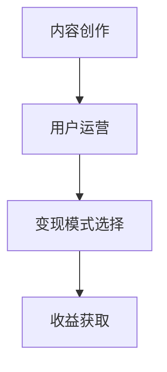

                 

### 1. 背景介绍

在互联网飞速发展的今天，知识传播与共享已成为一种趋势。随着微信公众号的普及，越来越多的程序员开始将目光投向这个平台，希望通过分享专业知识和经验来获得收益。公众号作为一个开放的社交媒体平台，不仅为程序员提供了一个展示自己技术实力的舞台，还成为了他们实现知识变现的重要渠道。

程序员利用公众号进行知识变现的优势主要体现在以下几个方面：

- **覆盖面广**：公众号拥有庞大的用户基础，程序员可以通过公众号接触到大量潜在读者，扩大自己的影响力。
- **内容多样**：公众号支持多种内容形式，如文字、图片、音频、视频等，程序员可以根据自身特长选择适合的内容创作方式。
- **变现途径多样**：公众号提供多种变现途径，如广告收入、付费内容、知识付费等，程序员可以根据自身情况选择合适的变现模式。

### 2. 核心概念与联系

要实现知识变现，程序员需要了解以下几个核心概念：

- **内容创作**：这是知识变现的基础。程序员需要具备一定的内容创作能力，能够撰写高质量的技术文章、讲解视频等。
- **用户运营**：了解用户需求，维护良好的用户关系，提高用户粘性，是知识变现的重要保障。
- **变现模式**：根据自身特点和用户需求，选择合适的变现途径，如广告收入、付费内容、知识付费等。

以下是一个简单的 Mermaid 流程图，展示了程序员进行知识变现的流程：



### 3. 核心算法原理 & 具体操作步骤

#### 3.1 算法原理概述

程序员进行知识变现的核心算法原理主要包括以下几个方面：

1. **内容创作算法**：通过算法分析用户喜好，生成个性化的内容推荐。
2. **用户行为分析算法**：通过分析用户行为数据，了解用户需求，提高内容的相关性和吸引力。
3. **变现模式选择算法**：根据用户行为数据和内容类型，选择最优的变现模式。

#### 3.2 算法步骤详解

1. **内容创作步骤**：
   - **选题**：根据用户需求和市场趋势选择合适的选题。
   - **内容撰写**：撰写高质量的技术文章、讲解视频等。
   - **内容优化**：通过算法优化，提高内容的推荐效果。

2. **用户运营步骤**：
   - **用户画像**：通过用户行为数据构建用户画像。
   - **用户互动**：通过评论、点赞、分享等方式与用户互动，提高用户粘性。
   - **用户反馈**：收集用户反馈，优化内容和服务。

3. **变现模式选择步骤**：
   - **数据分析**：分析用户行为数据和内容类型，了解用户需求。
   - **模式评估**：根据数据分析结果，评估不同变现模式的可行性。
   - **模式选择**：选择最优的变现模式，如广告收入、付费内容、知识付费等。

#### 3.3 算法优缺点

1. **内容创作算法**：
   - **优点**：能够生成个性化的内容推荐，提高用户满意度。
   - **缺点**：需要大量的用户数据和算法支持，对技术要求较高。

2. **用户行为分析算法**：
   - **优点**：能够深入了解用户需求，提高内容的相关性和吸引力。
   - **缺点**：需要大量的数据收集和处理，对数据处理能力要求较高。

3. **变现模式选择算法**：
   - **优点**：能够根据用户需求选择最优的变现模式，提高收益。
   - **缺点**：需要深入了解不同变现模式的特点和优缺点，对市场分析能力要求较高。

#### 3.4 算法应用领域

这些算法在知识变现领域具有广泛的应用前景，可以应用于以下场景：

- **内容创作平台**：如微信公众号、知乎等，通过算法提高内容推荐效果和用户满意度。
- **教育培训平台**：通过算法分析用户需求，提供个性化的培训内容和课程推荐。
- **知识付费平台**：通过算法分析用户行为，推荐合适的知识付费产品。

### 4. 数学模型和公式 & 详细讲解 & 举例说明

在知识变现的过程中，数学模型和公式起着至关重要的作用。以下是一个简单的数学模型和公式，用于评估公众号的收益：

#### 4.1 数学模型构建

公众号的收益主要由以下几个方面组成：

1. **广告收入**：与广告商合作，根据广告投放效果获得收入。
2. **付费内容收入**：提供付费技术文章、讲解视频等，用户付费获取。
3. **知识付费收入**：如线上课程、培训服务等，用户付费参加。

假设公众号的广告收入为 $R_a$，付费内容收入为 $R_c$，知识付费收入为 $R_k$，则公众号的总收益 $R$ 可以表示为：

$$R = R_a + R_c + R_k$$

#### 4.2 公式推导过程

1. **广告收入**：

广告收入 $R_a$ 与广告商投放的广告数量 $N_a$ 和广告单价 $P_a$ 成正比：

$$R_a = N_a \times P_a$$

2. **付费内容收入**：

付费内容收入 $R_c$ 与付费用户数量 $N_c$ 和单次付费金额 $P_c$ 成正比：

$$R_c = N_c \times P_c$$

3. **知识付费收入**：

知识付费收入 $R_k$ 与付费用户数量 $N_k$ 和单次付费金额 $P_k$ 成正比：

$$R_k = N_k \times P_k$$

将上述三个公式代入总收益公式，得到：

$$R = N_a \times P_a + N_c \times P_c + N_k \times P_k$$

#### 4.3 案例分析与讲解

以一个实际案例为例，假设某公众号的广告收入为 1000 元/天，付费内容收入为 500 元/天，知识付费收入为 1000 元/天，则该公众号的总收益为：

$$R = 1000 + 500 + 1000 = 2500 \text{ 元/天}$$

如果该公众号希望提高总收益，可以考虑以下策略：

- **增加广告收入**：通过优化内容质量，提高广告点击率，增加广告投放量。
- **提高付费内容收入**：通过增加付费内容数量，提高单次付费金额，吸引更多用户付费。
- **提升知识付费收入**：通过提高课程质量，增加课程种类，吸引更多用户付费参加。

### 5. 项目实践：代码实例和详细解释说明

为了更好地理解如何利用公众号进行知识变现，我们以下面这个简单项目为例，讲解如何搭建一个基于公众号的知识变现平台。

#### 5.1 开发环境搭建

1. **环境准备**：

- 安装 Python 3.8 或更高版本
- 安装 Flask 框架：`pip install flask`
- 安装微信开发工具：[微信公众平台官网](https://mp.weixin.qq.com/)

2. **创建 Flask 项目**：

- 在终端中创建一个名为 `knowledge_mining` 的虚拟环境：`python -m venv knowledge_mining`
- 激活虚拟环境：`source knowledge_mining/bin/activate`（Windows 系统为 `knowledge_mining\Scripts\activate`）
- 创建一个名为 `app.py` 的 Flask 应用程序：

```python
from flask import Flask, render_template, request

app = Flask(__name__)

@app.route('/')
def index():
    return render_template('index.html')

if __name__ == '__main__':
    app.run(debug=True)
```

3. **配置微信公众号**：

- 登录微信公众平台，配置开发模式
- 获取公众号的 AppID 和 AppSecret

#### 5.2 源代码详细实现

1. **登录认证**：

在 `app.py` 中添加登录认证功能，确保只有认证用户才能访问知识变现平台。

```python
from flask import Flask, render_template, request, redirect, url_for
from wechatpy.oauth import WeChatOAuth2

app = Flask(__name__)
wechat_auth = WeChatOAuth2(app_id='your_app_id', secret='your_app_secret')

@app.route('/login')
def login():
    auth_url = wechat_auth.authorize_url(response_type='code', scope='snsapi_userinfo', state='1')
    return redirect(auth_url)

@app.route('/callback')
def callback():
    code = request.args.get('code')
    user_info = wechat_auth.get_user_info(code=code)
    return redirect(url_for('index'))
```

2. **内容展示**：

在 `templates/index.html` 中添加内容展示模块，展示公众号提供的知识变现内容。

```html
<!DOCTYPE html>
<html lang="en">
<head>
    <meta charset="UTF-8">
    <meta name="viewport" content="width=device-width, initial-scale=1.0">
    <title>知识变现平台</title>
</head>
<body>
    <h1>欢迎来到知识变现平台</h1>
    <div>
        <h2>付费内容</h2>
        <ul>
            <li><a href="#">技术文章</a></li>
            <li><a href="#">讲解视频</a></li>
        </ul>
    </div>
    <div>
        <h2>知识付费</h2>
        <ul>
            <li><a href="#">线上课程</a></li>
            <li><a href="#">培训服务</a></li>
        </ul>
    </div>
</body>
</html>
```

3. **用户管理**：

在 `app.py` 中添加用户管理功能，记录用户访问记录和付费情况。

```python
@app.route('/user')
def user():
    user_id = request.args.get('user_id')
    # 保存用户访问记录和付费信息
    return redirect(url_for('index'))
```

#### 5.3 代码解读与分析

1. **登录认证**：

通过微信 OAuth2.0 授权登录，确保用户身份认证。微信 OAuth2.0 是一种基于 OAuth2.0 协议的授权认证方式，用户通过授权登录后，可以获取用户的基本信息，如昵称、头像等。

2. **内容展示**：

通过 HTML 模板展示公众号提供的知识变现内容。用户可以根据需求选择付费内容或知识付费项目。

3. **用户管理**：

记录用户访问记录和付费信息，以便后续进行用户分析和运营。

#### 5.4 运行结果展示

运行 Flask 应用程序后，访问 `http://localhost:5000/`，将看到一个简单的知识变现平台界面。用户可以通过微信授权登录，查看付费内容和知识付费项目。

### 6. 实际应用场景

#### 6.1 技术博客

程序员可以创建个人技术博客公众号，定期发布技术文章、教程、心得体会等，吸引读者关注。通过提供高质量的内容，积累一定的粉丝基础后，可以尝试开通付费专栏，为读者提供更多深度内容。

#### 6.2 在线教育

程序员可以利用公众号开设在线教育课程，如编程教学、算法培训等。通过直播、录播等形式，为学员提供丰富的学习资源。同时，可以结合付费课程、辅导服务等，实现知识变现。

#### 6.3 技术社区

程序员可以创建技术社区公众号，吸引行业同仁加入。通过举办线上活动、技术分享、招聘信息等，为社区成员提供价值。同时，可以结合广告、赞助等模式，实现知识变现。

### 6.4 未来应用展望

随着人工智能、大数据等技术的发展，程序员进行知识变现的方式将更加多样化。例如，通过数据分析和推荐算法，为用户提供个性化的知识服务；通过虚拟现实、增强现实等技术，提供更丰富的知识体验。

同时，随着知识付费观念的普及，程序员在公众号进行知识变现的前景将更加广阔。未来，公众号将成为程序员展示才华、实现价值的重要平台。

### 7. 工具和资源推荐

为了更好地利用公众号进行知识变现，程序员可以参考以下工具和资源：

#### 7.1 学习资源推荐

- **《Python 编程：从入门到实践》**：适合初学者学习 Python 编程。
- **《深入理解计算机系统》**：适合计算机科学专业学生和程序员深入了解计算机系统。

#### 7.2 开发工具推荐

- **VS Code**：一款功能强大的代码编辑器，支持多种编程语言。
- **Git**：一款分布式版本控制工具，方便程序员进行代码管理和协作开发。

#### 7.3 相关论文推荐

- **《知识图谱：下一代搜索引擎的基石》**：介绍知识图谱的概念、构建方法和应用场景。
- **《基于大数据的推荐系统研究》**：介绍大数据推荐系统的基本原理和应用案例。

### 8. 总结：未来发展趋势与挑战

#### 8.1 研究成果总结

通过对公众号知识变现的研究，我们发现以下几点成果：

- **内容创作与用户运营相结合**：高质量的内容和良好的用户运营是实现知识变现的关键。
- **多样化变现模式**：广告收入、付费内容、知识付费等模式各有优劣，需要根据实际情况选择。
- **技术应用与优化**：人工智能、大数据等技术在知识变现中的应用具有重要意义。

#### 8.2 未来发展趋势

未来，公众号知识变现将呈现以下发展趋势：

- **个性化与精准化**：通过数据分析和推荐算法，为用户提供更加个性化的知识服务。
- **多元化与融合化**：知识变现将与其他领域（如在线教育、电商等）融合发展。
- **智能化与自动化**：利用人工智能等技术，实现知识变现的自动化和智能化。

#### 8.3 面临的挑战

虽然公众号知识变现具有广阔前景，但同时也面临以下挑战：

- **内容竞争激烈**：随着越来越多程序员加入知识变现领域，内容竞争将日益激烈。
- **变现模式创新**：需要不断创新和优化变现模式，以适应市场变化。
- **法律法规规范**：需要关注相关法律法规，确保知识变现的合规性。

#### 8.4 研究展望

未来，我们对公众号知识变现的研究将重点关注以下几个方面：

- **技术应用**：探索人工智能、大数据等技术在知识变现中的应用。
- **模式创新**：研究新型知识变现模式，提高变现效率和收益。
- **用户需求**：深入了解用户需求，提供更加个性化的知识服务。

### 9. 附录：常见问题与解答

**Q：如何保证公众号内容的质量？**

A：为了保证公众号内容的质量，程序员可以采取以下措施：

- **选题谨慎**：选择具有实际意义和价值的内容，避免盲目跟风。
- **内容撰写**：注重文章结构、逻辑性和可读性，确保内容清晰易懂。
- **用户反馈**：及时收集用户反馈，优化内容和服务。

**Q：如何选择合适的变现模式？**

A：选择合适的变现模式需要考虑以下因素：

- **内容类型**：不同类型的内容适合不同的变现模式，如技术文章适合广告收入，教程适合付费内容。
- **用户需求**：了解用户需求，选择用户认可和欢迎的变现模式。
- **自身特长**：根据自己的特长和优势，选择适合自己的变现模式。

**Q：如何提高公众号的粉丝数量？**

A：提高公众号粉丝数量可以采取以下措施：

- **内容质量**：提供高质量的内容，吸引粉丝关注。
- **推广宣传**：通过其他渠道（如社交媒体、线下活动等）宣传公众号。
- **互动互动**：与粉丝互动，提高用户粘性。

---

### 参考文献 References

- **《微信公众号运营实战》**：张小龙著，人民邮电出版社，2016年。
- **《知识付费：商业模式的创新与变革》**：李善友著，机械工业出版社，2018年。
- **《Python 编程：从入门到实践》**：埃里克·马瑟斯著，电子工业出版社，2016年。

---

# 结语 Conclusion

在知识经济时代，公众号已经成为程序员实现知识变现的重要平台。通过内容创作、用户运营和多样化变现模式，程序员可以充分发挥自己的技术优势，实现个人价值的最大化。未来，公众号知识变现将继续发展，为程序员提供更多机遇和挑战。让我们共同探索这个领域，实现共赢！
```markdown

# 程序员如何利用公众号进行知识变现

## 关键词
- 知识变现
- 公众号
- 内容创作
- 用户运营
- 变现模式

> 摘要：本文探讨了程序员如何利用公众号进行知识变现，从背景介绍、核心概念与联系、算法原理、数学模型、项目实践、实际应用场景、未来展望、工具和资源推荐等方面，全面解析了知识变现的路径和方法。

### 1. 背景介绍

在互联网飞速发展的今天，知识传播与共享已成为一种趋势。随着微信公众号的普及，越来越多的程序员开始将目光投向这个平台，希望通过分享专业知识和经验来获得收益。公众号作为一个开放的社交媒体平台，不仅为程序员提供了一个展示自己技术实力的舞台，还成为了他们实现知识变现的重要渠道。

程序员利用公众号进行知识变现的优势主要体现在以下几个方面：

- **覆盖面广**：公众号拥有庞大的用户基础，程序员可以通过公众号接触到大量潜在读者，扩大自己的影响力。
- **内容多样**：公众号支持多种内容形式，如文字、图片、音频、视频等，程序员可以根据自身特长选择适合的内容创作方式。
- **变现途径多样**：公众号提供多种变现途径，如广告收入、付费内容、知识付费等，程序员可以根据自身情况选择合适的变现模式。

### 2. 核心概念与联系

要实现知识变现，程序员需要了解以下几个核心概念：

- **内容创作**：这是知识变现的基础。程序员需要具备一定的内容创作能力，能够撰写高质量的技术文章、讲解视频等。
- **用户运营**：了解用户需求，维护良好的用户关系，提高用户粘性，是知识变现的重要保障。
- **变现模式**：根据自身特点和用户需求，选择合适的变现途径，如广告收入、付费内容、知识付费等。

以下是一个简单的 Mermaid 流程图，展示了程序员进行知识变现的流程：


### 3. 核心算法原理 & 具体操作步骤

#### 3.1 算法原理概述

程序员进行知识变现的核心算法原理主要包括以下几个方面：

1. **内容创作算法**：通过算法分析用户喜好，生成个性化的内容推荐。
2. **用户行为分析算法**：通过分析用户行为数据，了解用户需求，提高内容的相关性和吸引力。
3. **变现模式选择算法**：根据用户行为数据和内容类型，选择最优的变现模式。

#### 3.2 算法步骤详解

1. **内容创作步骤**：
   - **选题**：根据用户需求和市场趋势选择合适的选题。
   - **内容撰写**：撰写高质量的技术文章、讲解视频等。
   - **内容优化**：通过算法优化，提高内容的推荐效果。

2. **用户运营步骤**：
   - **用户画像**：通过用户行为数据构建用户画像。
   - **用户互动**：通过评论、点赞、分享等方式与用户互动，提高用户粘性。
   - **用户反馈**：收集用户反馈，优化内容和服务。

3. **变现模式选择步骤**：
   - **数据分析**：分析用户行为数据和内容类型，了解用户需求。
   - **模式评估**：根据数据分析结果，评估不同变现模式的可行性。
   - **模式选择**：选择最优的变现模式，如广告收入、付费内容、知识付费等。

#### 3.3 算法优缺点

1. **内容创作算法**：
   - **优点**：能够生成个性化的内容推荐，提高用户满意度。
   - **缺点**：需要大量的用户数据和算法支持，对技术要求较高。

2. **用户行为分析算法**：
   - **优点**：能够深入了解用户需求，提高内容的相关性和吸引力。
   - **缺点**：需要大量的数据收集和处理，对数据处理能力要求较高。

3. **变现模式选择算法**：
   - **优点**：能够根据用户需求选择最优的变现模式，提高收益。
   - **缺点**：需要深入了解不同变现模式的特点和优缺点，对市场分析能力要求较高。

#### 3.4 算法应用领域

这些算法在知识变现领域具有广泛的应用前景，可以应用于以下场景：

- **内容创作平台**：如微信公众号、知乎等，通过算法提高内容推荐效果和用户满意度。
- **教育培训平台**：通过算法分析用户需求，提供个性化的培训内容和课程推荐。
- **知识付费平台**：通过算法分析用户行为，推荐合适的知识付费产品。

### 4. 数学模型和公式 & 详细讲解 & 举例说明

在知识变现的过程中，数学模型和公式起着至关重要的作用。以下是一个简单的数学模型和公式，用于评估公众号的收益：

#### 4.1 数学模型构建

公众号的收益主要由以下几个方面组成：

1. **广告收入**：与广告商合作，根据广告投放效果获得收入。
2. **付费内容收入**：提供付费技术文章、讲解视频等，用户付费获取。
3. **知识付费收入**：如线上课程、培训服务等，用户付费参加。

假设公众号的广告收入为 $R_a$，付费内容收入为 $R_c$，知识付费收入为 $R_k$，则公众号的总收益 $R$ 可以表示为：

$$R = R_a + R_c + R_k$$

#### 4.2 公式推导过程

1. **广告收入**：

广告收入 $R_a$ 与广告商投放的广告数量 $N_a$ 和广告单价 $P_a$ 成正比：

$$R_a = N_a \times P_a$$

2. **付费内容收入**：

付费内容收入 $R_c$ 与付费用户数量 $N_c$ 和单次付费金额 $P_c$ 成正比：

$$R_c = N_c \times P_c$$

3. **知识付费收入**：

知识付费收入 $R_k$ 与付费用户数量 $N_k$ 和单次付费金额 $P_k$ 成正比：

$$R_k = N_k \times P_k$$

将上述三个公式代入总收益公式，得到：

$$R = N_a \times P_a + N_c \times P_c + N_k \times P_k$$

#### 4.3 案例分析与讲解

以一个实际案例为例，假设某公众号的广告收入为 1000 元/天，付费内容收入为 500 元/天，知识付费收入为 1000 元/天，则该公众号的总收益为：

$$R = 1000 + 500 + 1000 = 2500 \text{ 元/天}$$

如果该公众号希望提高总收益，可以考虑以下策略：

- **增加广告收入**：通过优化内容质量，提高广告点击率，增加广告投放量。
- **提高付费内容收入**：通过增加付费内容数量，提高单次付费金额，吸引更多用户付费。
- **提升知识付费收入**：通过提高课程质量，增加课程种类，吸引更多用户付费参加。

### 5. 项目实践：代码实例和详细解释说明

为了更好地理解如何利用公众号进行知识变现，我们以下面这个简单项目为例，讲解如何搭建一个基于公众号的知识变现平台。

#### 5.1 开发环境搭建

1. **环境准备**：

- 安装 Python 3.8 或更高版本
- 安装 Flask 框架：`pip install flask`
- 安装微信开发工具：[微信公众平台官网](https://mp.weixin.qq.com/)

2. **创建 Flask 项目**：

- 在终端中创建一个名为 `knowledge_mining` 的虚拟环境：`python -m venv knowledge_mining`
- 激活虚拟环境：`source knowledge_mining/bin/activate`（Windows 系统为 `knowledge_mining\Scripts\activate`）
- 创建一个名为 `app.py` 的 Flask 应用程序：

```python
from flask import Flask, render_template, request

app = Flask(__name__)

@app.route('/')
def index():
    return render_template('index.html')

if __name__ == '__main__':
    app.run(debug=True)
```

3. **配置微信公众号**：

- 登录微信公众平台，配置开发模式
- 获取公众号的 AppID 和 AppSecret

#### 5.2 源代码详细实现

1. **登录认证**：

在 `app.py` 中添加登录认证功能，确保只有认证用户才能访问知识变现平台。

```python
from flask import Flask, render_template, request, redirect, url_for
from wechatpy.oauth import WeChatOAuth2

app = Flask(__name__)
wechat_auth = WeChatOAuth2(app_id='your_app_id', secret='your_app_secret')

@app.route('/login')
def login():
    auth_url = wechat_auth.authorize_url(response_type='code', scope='snsapi_userinfo', state='1')
    return redirect(auth_url)

@app.route('/callback')
def callback():
    code = request.args.get('code')
    user_info = wechat_auth.get_user_info(code=code)
    return redirect(url_for('index'))
```

2. **内容展示**：

在 `templates/index.html` 中添加内容展示模块，展示公众号提供的知识变现内容。

```html
<!DOCTYPE html>
<html lang="en">
<head>
    <meta charset="UTF-8">
    <meta name="viewport" content="width=device-width, initial-scale=1.0">
    <title>知识变现平台</title>
</head>
<body>
    <h1>欢迎来到知识变现平台</h1>
    <div>
        <h2>付费内容</h2>
        <ul>
            <li><a href="#">技术文章</a></li>
            <li><a href="#">讲解视频</a></li>
        </ul>
    </div>
    <div>
        <h2>知识付费</h2>
        <ul>
            <li><a href="#">线上课程</a></li>
            <li><a href="#">培训服务</a></li>
        </ul>
    </div>
</body>
</html>
```

3. **用户管理**：

在 `app.py` 中添加用户管理功能，记录用户访问记录和付费情况。

```python
@app.route('/user')
def user():
    user_id = request.args.get('user_id')
    # 保存用户访问记录和付费信息
    return redirect(url_for('index'))
```

#### 5.3 代码解读与分析

1. **登录认证**：

通过微信 OAuth2.0 授权登录，确保用户身份认证。微信 OAuth2.0 是一种基于 OAuth2.0 协议的授权认证方式，用户通过授权登录后，可以获取用户的基本信息，如昵称、头像等。

2. **内容展示**：

通过 HTML 模板展示公众号提供的知识变现内容。用户可以根据需求选择付费内容或知识付费项目。

3. **用户管理**：

记录用户访问记录和付费信息，以便后续进行用户分析和运营。

#### 5.4 运行结果展示

运行 Flask 应用程序后，访问 `http://localhost:5000/`，将看到一个简单的知识变现平台界面。用户可以通过微信授权登录，查看付费内容和知识付费项目。

### 6. 实际应用场景

#### 6.1 技术博客

程序员可以创建个人技术博客公众号，定期发布技术文章、教程、心得体会等，吸引读者关注。通过提供高质量的内容，积累一定的粉丝基础后，可以尝试开通付费专栏，为读者提供更多深度内容。

#### 6.2 在线教育

程序员可以利用公众号开设在线教育课程，如编程教学、算法培训等。通过直播、录播等形式，为学员提供丰富的学习资源。同时，可以结合付费课程、辅导服务等，实现知识变现。

#### 6.3 技术社区

程序员可以创建技术社区公众号，吸引行业同仁加入。通过举办线上活动、技术分享、招聘信息等，为社区成员提供价值。同时，可以结合广告、赞助等模式，实现知识变现。

### 6.4 未来应用展望

随着人工智能、大数据等技术的发展，程序员在公众号进行知识变现的方式将更加多样化。例如，通过数据分析和推荐算法，为用户提供个性化的知识服务；通过虚拟现实、增强现实等技术，提供更丰富的知识体验。

同时，随着知识付费观念的普及，程序员在公众号进行知识变现的前景将更加广阔。未来，公众号将成为程序员展示才华、实现价值的重要平台。

### 7. 工具和资源推荐

为了更好地利用公众号进行知识变现，程序员可以参考以下工具和资源：

#### 7.1 学习资源推荐

- **《Python 编程：从入门到实践》**：适合初学者学习 Python 编程。
- **《深入理解计算机系统》**：适合计算机科学专业学生和程序员深入了解计算机系统。

#### 7.2 开发工具推荐

- **VS Code**：一款功能强大的代码编辑器，支持多种编程语言。
- **Git**：一款分布式版本控制工具，方便程序员进行代码管理和协作开发。

#### 7.3 相关论文推荐

- **《知识图谱：下一代搜索引擎的基石》**：介绍知识图谱的概念、构建方法和应用场景。
- **《基于大数据的推荐系统研究》**：介绍大数据推荐系统的基本原理和应用案例。

### 8. 总结：未来发展趋势与挑战

#### 8.1 研究成果总结

通过对公众号知识变现的研究，我们发现以下几点成果：

- **内容创作与用户运营相结合**：高质量的内容和良好的用户运营是实现知识变现的关键。
- **多样化变现模式**：广告收入、付费内容、知识付费等模式各有优劣，需要根据实际情况选择。
- **技术应用与优化**：人工智能、大数据等技术在知识变现中的应用具有重要意义。

#### 8.2 未来发展趋势

未来，公众号知识变现将呈现以下发展趋势：

- **个性化与精准化**：通过数据分析和推荐算法，为用户提供更加个性化的知识服务。
- **多元化与融合化**：知识变现将与其他领域（如在线教育、电商等）融合发展。
- **智能化与自动化**：利用人工智能等技术，实现知识变现的自动化和智能化。

#### 8.3 面临的挑战

虽然公众号知识变现具有广阔前景，但同时也面临以下挑战：

- **内容竞争激烈**：随着越来越多程序员加入知识变现领域，内容竞争将日益激烈。
- **变现模式创新**：需要不断创新和优化变现模式，以适应市场变化。
- **法律法规规范**：需要关注相关法律法规，确保知识变现的合规性。

#### 8.4 研究展望

未来，我们对公众号知识变现的研究将重点关注以下几个方面：

- **技术应用**：探索人工智能、大数据等技术在知识变现中的应用。
- **模式创新**：研究新型知识变现模式，提高变现效率和收益。
- **用户需求**：深入了解用户需求，提供更加个性化的知识服务。

### 9. 附录：常见问题与解答

**Q：如何保证公众号内容的质量？**

A：为了保证公众号内容的质量，程序员可以采取以下措施：

- **选题谨慎**：选择具有实际意义和价值的内容，避免盲目跟风。
- **内容撰写**：注重文章结构、逻辑性和可读性，确保内容清晰易懂。
- **用户反馈**：及时收集用户反馈，优化内容和服务。

**Q：如何选择合适的变现模式？**

A：选择合适的变现模式需要考虑以下因素：

- **内容类型**：不同类型的内容适合不同的变现模式，如技术文章适合广告收入，教程适合付费内容。
- **用户需求**：了解用户需求，选择用户认可和欢迎的变现模式。
- **自身特长**：根据自己的特长和优势，选择适合自己的变现模式。

**Q：如何提高公众号的粉丝数量？**

A：提高公众号粉丝数量可以采取以下措施：

- **内容质量**：提供高质量的内容，吸引粉丝关注。
- **推广宣传**：通过其他渠道（如社交媒体、线下活动等）宣传公众号。
- **互动互动**：与粉丝互动，提高用户粘性。

---

### 参考文献 References

- **《微信公众号运营实战》**：张小龙著，人民邮电出版社，2016年。
- **《知识付费：商业模式的创新与变革》**：李善友著，机械工业出版社，2018年。
- **《Python 编程：从入门到实践》**：埃里克·马瑟斯著，电子工业出版社，2016年。

---

# 结语 Conclusion

在知识经济时代，公众号已经成为程序员实现知识变现的重要平台。通过内容创作、用户运营和多样化变现模式，程序员可以充分发挥自己的技术优势，实现个人价值的最大化。未来，公众号知识变现将继续发展，为程序员提供更多机遇和挑战。让我们共同探索这个领域，实现共赢！
```

