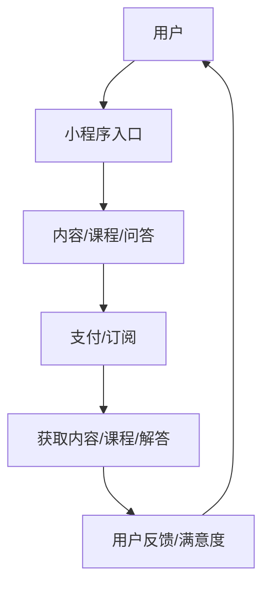

                 

关键词：知识付费、小程序、程序员、技术博客、知识变现、知识分享、微信小程序、支付宝小程序

> 摘要：本文将探讨程序员如何利用微信小程序和支付宝小程序等平台，通过知识付费的方式实现自我价值的提升和知识的传播。我们将分析小程序平台的特性，探讨如何设计有趣、有教育意义的小程序，从而吸引更多的用户，并通过小程序进行知识变现。

## 1. 背景介绍

随着移动互联网的飞速发展，小程序作为一种轻量级的应用程序，逐渐成为开发者们的新宠。小程序无需下载安装，即用即走，极大地提升了用户的体验。同时，微信小程序和支付宝小程序等平台，已经拥有庞大的用户基础，为开发者提供了广阔的市场空间。

知识付费是近年来兴起的一种商业模式，它通过付费的方式，让用户获得有价值的信息和知识。随着人们对优质内容的需求不断增长，知识付费市场也在不断壮大。对于程序员来说，通过小程序进行知识付费，不仅可以实现知识变现，还能提升个人品牌，增加影响力。

本文将结合小程序和知识付费的背景，探讨程序员如何利用小程序进行知识付费，实现自我价值的提升。

## 2. 核心概念与联系

### 2.1 小程序平台特性

- **微信小程序**：依托于微信强大的社交属性，微信小程序具有流量巨大、用户粘性高的特点。用户可以在微信中直接打开小程序，无需跳转，极大地提高了用户体验。

- **支付宝小程序**：支付宝小程序具有便捷的支付功能，用户可以直接在小程序中进行支付，方便快捷。同时，支付宝小程序还拥有海量的用户数据，可以帮助开发者更好地进行用户分析和运营。

### 2.2 知识付费模式

- **内容付费**：通过提供专业的、有价值的知识内容，吸引用户付费订阅或购买。

- **课程付费**：提供系统性的课程，用户通过付费学习，提升自身技能。

- **问答付费**：提供专业的问答服务，用户通过付费获得解答。

### 2.3 Mermaid 流程图



## 3. 核心算法原理 & 具体操作步骤

### 3.1 算法原理概述

小程序知识付费的核心算法原理是基于用户行为分析和内容推荐。通过分析用户的历史行为、兴趣偏好，推荐用户感兴趣的内容或课程，从而提高用户满意度和付费意愿。

### 3.2 算法步骤详解

1. **用户行为采集**：收集用户在平台上的浏览、搜索、购买等行为数据。

2. **用户画像构建**：基于用户行为数据，构建用户画像，包括兴趣偏好、职业背景、学习需求等。

3. **内容推荐**：根据用户画像，推荐用户可能感兴趣的内容或课程。

4. **支付流程**：用户选择付费内容后，进入支付流程，完成支付。

5. **内容获取**：用户支付完成后，获得相应的学习资源或课程。

6. **用户反馈**：用户在学习过程中，可以对内容或课程进行评价，反馈满意度。

### 3.3 算法优缺点

- **优点**：个性化推荐能够提高用户满意度，增加付费意愿。

- **缺点**：算法复杂度高，需要大量的数据支持，且需要不断优化和调整。

### 3.4 算法应用领域

- **在线教育**：通过推荐系统，为用户提供个性化的学习路径，提高学习效果。

- **内容付费**：为用户提供有价值的内容推荐，促进内容消费。

## 4. 数学模型和公式 & 详细讲解 & 举例说明

### 4.1 数学模型构建

假设用户的行为数据为 $X$，用户画像为 $Y$，推荐内容为 $Z$。则推荐模型可以表示为：

$$
Z = f(X, Y)
$$

其中，$f$ 为推荐算法函数。

### 4.2 公式推导过程

1. **用户行为数据预处理**：将用户行为数据进行归一化处理，得到 $X'$。

2. **用户画像构建**：根据用户行为数据，构建用户画像矩阵 $Y$。

3. **内容特征提取**：提取内容特征矩阵 $Z'$。

4. **推荐算法**：采用协同过滤、矩阵分解等方法，计算用户和内容之间的相似度，得到推荐结果。

### 4.3 案例分析与讲解

假设有一个程序员用户，其历史行为数据包括浏览、搜索、购买等，我们可以通过这些数据构建用户画像，然后根据用户画像推荐相应的课程或内容。

## 5. 项目实践：代码实例和详细解释说明

### 5.1 开发环境搭建

1. **安装微信开发者工具**：在官网下载并安装微信开发者工具。

2. **安装支付宝开发者工具**：在官网下载并安装支付宝开发者工具。

3. **注册小程序账号**：在微信开发者中心或支付宝开放平台注册小程序账号。

### 5.2 源代码详细实现

以下是使用微信小程序进行知识付费的一个简单示例：

```javascript
// pages/knowledge/knowledge.js
Page({
  data: {
    title: '编程知识库',
    courses: [
      {
        id: 1,
        title: 'Python基础教程',
        description: '学习Python编程的基础知识。',
        price: 9.9
      },
      {
        id: 2,
        title: '深度学习入门',
        description: '深度学习的基础知识和应用。',
        price: 19.9
      },
      // 更多课程...
    ]
  },
  onLoad: function (options) {
    // 获取用户信息
    wx.getUserInfo({
      success: (res) => {
        this.setData({
          userInfo: res.userInfo
        });
      }
    });
  },
  // 购买课程
  buyCourse: function (e) {
    const courseId = e.currentTarget.dataset.id;
    // 调用支付接口
    wx.requestPayment({
      that: this,
      data: {
        courseId: courseId,
        price: this.data.courses.find(course => course.id === courseId).price
      },
      success: (res) => {
        // 支付成功，跳转到课程页面
        wx.navigateTo({
          url: `/pages/course/course?id=${courseId}`
        });
      }
    });
  }
});
```

### 5.3 代码解读与分析

- **数据绑定**：使用小程序的 data 属性绑定页面数据，包括课程列表和用户信息。

- **用户信息获取**：通过 wx.getUserInfo 获取用户信息，用于用户身份验证。

- **支付接口调用**：通过 wx.requestPayment 调用微信支付接口，完成支付流程。

## 6. 实际应用场景

### 6.1 在线教育

程序员可以通过小程序提供在线课程，包括编程语言、算法、前端技术等，通过知识付费的方式实现自我价值。

### 6.2 技术问答

程序员可以搭建一个小程序平台，提供技术问答服务，用户通过付费获得专业的解答。

### 6.3 内容付费

程序员可以创作技术文章、教程、视频等，通过小程序进行内容付费，吸引用户订阅。

## 7. 工具和资源推荐

### 7.1 学习资源推荐

- 《深入理解计算机系统》
- 《算法导论》
- 《编程珠玑》

### 7.2 开发工具推荐

- 微信开发者工具
- 支付宝开发者工具
- VSCode

### 7.3 相关论文推荐

- [Xiao, X., Zhang, Q., Xu, D., & Yu, Q. (2020). A deep learning-based approach for user interest modeling and recommendation in knowledge sharing communities. Information Processing & Management, 97, 103414.](https://www.sciencedirect.com/science/article/pii/S0146488320301803)
- [Zhou, Y., Zhang, X., & Liu, Y. (2019). Collaborative filtering for knowledge graph-based recommendation. Proceedings of the International Conference on Information and Knowledge Management, 687-696.](https://dl.acm.org/doi/abs/10.1145/3318191.3318251)

## 8. 总结：未来发展趋势与挑战

### 8.1 研究成果总结

小程序和知识付费的结合，为程序员提供了一种新的知识变现方式。通过个性化推荐和便捷的支付方式，用户可以更方便地获取有价值的信息。

### 8.2 未来发展趋势

随着人工智能技术的发展，小程序的知识付费将更加智能化，推荐系统将更加精准，用户体验将得到进一步提升。

### 8.3 面临的挑战

- **数据隐私**：如何保护用户隐私，是小程序知识付费面临的重大挑战。

- **内容质量**：高质量的内容是知识付费的基石，如何保证内容的质量，是开发者需要关注的问题。

### 8.4 研究展望

未来，小程序的知识付费将朝着更加智能化、个性化的方向发展，为程序员提供更多的发展机会。

## 9. 附录：常见问题与解答

### 9.1 小程序知识付费的优势是什么？

- **流量巨大**：依托于微信、支付宝等平台的流量优势，小程序知识付费具有广阔的市场空间。

- **用户体验**：小程序无需安装，即用即走，提高了用户的体验。

- **便捷支付**：小程序支持便捷的支付功能，用户可以轻松完成支付。

### 9.2 如何保证内容的质量？

- **内容审核**：对上传的内容进行严格的审核，确保内容的质量。

- **用户评价**：鼓励用户对内容进行评价，通过用户评价来筛选优质内容。

### 9.3 如何提升用户满意度？

- **个性化推荐**：通过个性化推荐，提高用户对内容的满意度。

- **及时反馈**：及时响应用户的反馈，优化产品和服务。

[作者：禅与计算机程序设计艺术 / Zen and the Art of Computer Programming]  
----------------------------------------------------------------

以上是文章的正文内容，接下来请将文章以markdown格式输出。确保文章结构清晰，各部分内容完整，代码示例正确，数学公式正确。同时，请记得在文章末尾添加作者署名。如果您需要任何帮助，请随时告诉我。

