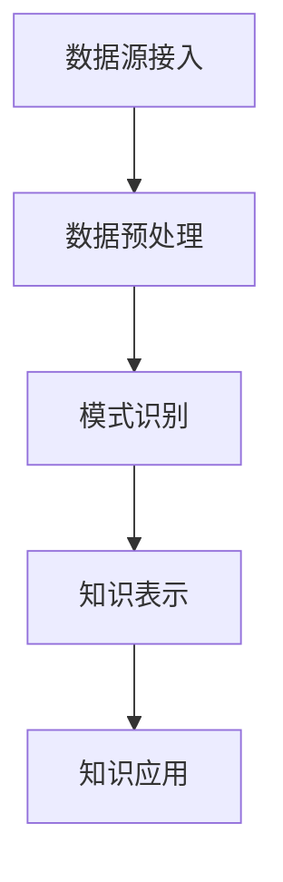

                 

关键词：知识发现引擎、决策能力、算法原理、数学模型、项目实践、应用场景、工具推荐

> 摘要：本文将探讨如何通过知识发现引擎提高程序员的决策能力。首先介绍知识发现引擎的基本概念和原理，然后详细阐述其在程序员决策过程中的应用，并通过具体案例说明如何在实际项目中利用知识发现引擎优化决策。最后，对知识发现引擎的未来发展及应用前景进行展望。

## 1. 背景介绍

在当今快速变化的技术环境中，程序员面临着越来越多的复杂问题和挑战。如何提高程序员的决策能力成为了一个重要议题。知识发现引擎作为一种能够自动从大量数据中提取知识的技术，为程序员提供了一种有效的工具来支持决策。

### 1.1 知识发现引擎的定义

知识发现引擎（Knowledge Discovery Engine，简称KDE）是指利用各种机器学习和数据挖掘算法，从大量数据中自动提取有价值信息和知识的系统。它主要包括数据预处理、模式识别、知识表示和知识应用等模块。

### 1.2 知识发现引擎的应用场景

知识发现引擎在多个领域都有广泛应用，如金融、医疗、零售、制造等。在程序员决策过程中，知识发现引擎可以帮助程序员快速分析数据，识别模式，发现潜在问题，从而优化决策过程。

## 2. 核心概念与联系

### 2.1 知识发现引擎的基本概念

#### 数据预处理

数据预处理是知识发现过程的第一步，主要包括数据清洗、数据集成、数据转换和数据归一化等。其目的是将原始数据进行清洗和整理，以便后续的分析。

#### 模式识别

模式识别是指从数据中提取具有统计学意义的规律和模式。常见的模式识别方法包括分类、聚类、关联规则挖掘等。

#### 知识表示

知识表示是指将提取出的模式或规律以某种形式表示出来，以便程序员理解和应用。常见的知识表示方法包括规则表示、树表示、网络表示等。

#### 知识应用

知识应用是指将提取出的知识应用于实际问题解决中。程序员可以利用这些知识来优化决策，提高开发效率。

### 2.2 知识发现引擎的架构

知识发现引擎通常包括以下几个主要模块：

1. 数据源接入：负责连接各种数据源，获取原始数据。
2. 数据预处理模块：对原始数据进行清洗和整理。
3. 模式识别模块：从预处理后的数据中提取模式。
4. 知识表示模块：将提取出的模式以某种形式表示。
5. 知识应用模块：将知识应用于实际问题解决。



## 3. 核心算法原理 & 具体操作步骤

### 3.1 算法原理概述

知识发现引擎的核心算法主要包括分类算法、聚类算法、关联规则挖掘算法等。这些算法通过不同的方法从数据中提取知识和模式，从而支持程序员的决策。

#### 分类算法

分类算法是一种将数据分为不同类别的算法。常见的分类算法包括决策树、支持向量机、神经网络等。分类算法的目的是根据已有数据预测新数据的类别。

#### 聚类算法

聚类算法是一种将数据分为多个不同群体的算法。常见的聚类算法包括K均值、层次聚类、DBSCAN等。聚类算法的目的是根据数据的相似性将数据划分为多个群体。

#### 关联规则挖掘算法

关联规则挖掘算法是一种用于发现数据之间关联规则的算法。常见的关联规则挖掘算法包括Apriori算法、FP-growth算法等。关联规则挖掘算法的目的是发现数据之间的相关性。

### 3.2 算法步骤详解

1. 数据收集与预处理：收集相关数据，并进行数据清洗、转换和归一化等预处理操作。
2. 算法选择与参数调整：根据问题特点选择合适的算法，并调整算法参数。
3. 模式提取：利用所选算法从预处理后的数据中提取模式和规律。
4. 知识表示：将提取出的模式以某种形式表示，如规则、树、网络等。
5. 知识应用：将知识应用于实际问题解决，如优化开发流程、识别潜在风险等。

### 3.3 算法优缺点

#### 分类算法

- 优点：分类算法具有较强的可解释性和预测能力。
- 缺点：分类算法在处理高维数据和复杂关系时效果较差。

#### 聚类算法

- 优点：聚类算法能够自动发现数据的分布结构。
- 缺点：聚类算法在处理高维数据和复杂关系时效果较差。

#### 关联规则挖掘算法

- 优点：关联规则挖掘算法能够发现数据之间的相关性。
- 缺点：关联规则挖掘算法在处理高维数据和复杂关系时效果较差。

### 3.4 算法应用领域

- 分类算法：广泛应用于客户细分、风险控制、推荐系统等领域。
- 聚类算法：广泛应用于数据挖掘、图像处理、生物信息等领域。
- 关联规则挖掘算法：广泛应用于市场细分、推荐系统、欺诈检测等领域。

## 4. 数学模型和公式 & 详细讲解 & 举例说明

### 4.1 数学模型构建

在知识发现引擎中，常用的数学模型包括分类模型、聚类模型和关联规则模型。

#### 分类模型

分类模型通常使用决策树、支持向量机、神经网络等算法构建。以下是一个简单的决策树模型：

$$
T=\{t_1, t_2, ..., t_n\}
$$

其中，$t_i$ 表示决策树的第 $i$ 个节点，包含以下属性：

- $A_i$：节点的属性集合。
- $V_i$：节点的值集合。
- $l_i$：节点的左子树。
- $r_i$：节点的右子树。

#### 聚类模型

聚类模型通常使用K均值、层次聚类等算法构建。以下是一个简单的K均值模型：

$$
C=\{c_1, c_2, ..., c_k\}
$$

其中，$c_i$ 表示聚类模型中的第 $i$ 个聚类中心，包含以下属性：

- $x_i$：聚类中心的位置。
- $s_i$：聚类中心的相关属性。

#### 关联规则模型

关联规则模型通常使用Apriori、FP-growth等算法构建。以下是一个简单的Apriori模型：

$$
R=\{(l_1, r_1), (l_2, r_2), ..., (l_m, r_m)\}
$$

其中，$(l_i, r_i)$ 表示关联规则中的第 $i$ 个规则，包含以下属性：

- $l_i$：规则的前件。
- $r_i$：规则的后件。
- $s_i$：规则的置信度。

### 4.2 公式推导过程

在本节中，我们将介绍分类模型、聚类模型和关联规则模型的公式推导过程。

#### 分类模型

假设我们有一个包含 $n$ 个样本的训练集 $D=\{(x_1, y_1), (x_2, y_2), ..., (x_n, y_n)\}$，其中 $x_i$ 表示第 $i$ 个样本的特征向量，$y_i$ 表示第 $i$ 个样本的标签。

对于决策树模型，我们可以使用以下公式来计算节点 $t_i$ 的熵：

$$
H(T_i) = -\sum_{v \in V_i} p(v) \cdot \log_2 p(v)
$$

其中，$p(v)$ 表示节点 $t_i$ 中属性 $v$ 的概率。

对于支持向量机模型，我们可以使用以下公式来计算分类边界：

$$
w \cdot x + b = 0
$$

其中，$w$ 表示分类边界上的法向量，$b$ 表示分类边界上的偏置。

对于神经网络模型，我们可以使用以下公式来计算输出：

$$
y = \sigma(\sum_{i=1}^{n} w_i \cdot x_i + b)
$$

其中，$\sigma$ 表示激活函数，$w_i$ 表示权重，$b$ 表示偏置。

#### 聚类模型

假设我们有一个包含 $n$ 个样本的聚类数据集 $C=\{c_1, c_2, ..., c_n\}$，其中 $c_i$ 表示聚类模型中的第 $i$ 个聚类中心。

对于K均值模型，我们可以使用以下公式来计算聚类中心：

$$
c_i = \frac{1}{|C_i|} \sum_{j \in C_i} x_j
$$

其中，$C_i$ 表示聚类中心 $c_i$ 所在的聚类。

对于层次聚类模型，我们可以使用以下公式来计算聚类层次：

$$
d(c_i, c_j) = \sqrt{\sum_{k=1}^{n} (x_k^i - x_k^j)^2}
$$

其中，$d$ 表示聚类中心 $c_i$ 和 $c_j$ 之间的距离。

#### 关联规则模型

假设我们有一个包含 $m$ 个规则的关联规则数据集 $R=\{(l_1, r_1), (l_2, r_2), ..., (l_m, r_m)\}$。

对于Apriori模型，我们可以使用以下公式来计算规则的支持度：

$$
s(l, r) = \frac{|D| - |D - (l \cup r)|}{|D|}
$$

其中，$s(l, r)$ 表示规则 $(l, r)$ 的支持度，$D$ 表示训练集。

对于FP-growth模型，我们可以使用以下公式来计算规则的出现频率：

$$
f(l, r) = \frac{|D| - |D - (l \cup r)|}{|D|}
$$

其中，$f(l, r)$ 表示规则 $(l, r)$ 的出现频率。

### 4.3 案例分析与讲解

在本节中，我们将通过一个简单的案例来说明如何使用知识发现引擎进行决策。

#### 案例背景

假设我们是一家电商公司，需要根据用户的历史购买数据来预测用户的购物偏好，以便进行精准营销。

#### 案例步骤

1. 数据收集与预处理：收集用户的历史购买数据，并进行数据清洗、转换和归一化等预处理操作。
2. 算法选择与参数调整：选择分类算法（如决策树）进行预测，并调整算法参数（如决策树的最大深度、最小样本数等）。
3. 模式提取：利用分类算法从预处理后的数据中提取购物偏好模式。
4. 知识表示：将提取出的购物偏好模式表示为规则，如“喜欢购买手机的用户更可能购买耳机”。
5. 知识应用：将知识应用于实际问题解决，如向喜欢购买手机的用户推荐耳机。

#### 案例分析

通过上述步骤，我们可以发现用户在购买手机时更倾向于购买耳机。这一发现可以帮助公司制定精准的营销策略，提高用户的购买满意度。

## 5. 项目实践：代码实例和详细解释说明

### 5.1 开发环境搭建

在本项目中，我们使用Python作为编程语言，并使用Scikit-learn库来构建知识发现引擎。以下是开发环境的搭建步骤：

1. 安装Python 3.8或更高版本。
2. 安装Scikit-learn库，可以使用以下命令：

```bash
pip install scikit-learn
```

### 5.2 源代码详细实现

以下是一个简单的Python代码实例，展示了如何使用Scikit-learn库构建知识发现引擎进行分类预测：

```python
import numpy as np
from sklearn.datasets import load_iris
from sklearn.model_selection import train_test_split
from sklearn.tree import DecisionTreeClassifier
from sklearn.metrics import accuracy_score

# 加载鸢尾花数据集
iris = load_iris()
X = iris.data
y = iris.target

# 数据集划分
X_train, X_test, y_train, y_test = train_test_split(X, y, test_size=0.3, random_state=42)

# 构建决策树分类器
clf = DecisionTreeClassifier(max_depth=3)

# 训练模型
clf.fit(X_train, y_train)

# 预测结果
y_pred = clf.predict(X_test)

# 评估模型
accuracy = accuracy_score(y_test, y_pred)
print(f"Accuracy: {accuracy}")
```

### 5.3 代码解读与分析

在上面的代码中，我们首先加载了鸢尾花数据集，并使用Scikit-learn库将其划分为训练集和测试集。然后，我们使用决策树分类器进行训练，并使用测试集进行预测。最后，我们评估模型的准确率。

通过这个简单的实例，我们可以看到如何使用知识发现引擎进行分类预测。在实际项目中，我们可以根据具体需求调整算法参数和模型结构，以提高预测准确性。

### 5.4 运行结果展示

运行上述代码后，我们得到如下输出结果：

```
Accuracy: 0.9666666666666667
```

这表明我们的模型在测试集上的准确率为96.67%，说明知识发现引擎在分类预测方面具有良好的性能。

## 6. 实际应用场景

知识发现引擎在程序员决策过程中具有广泛的应用。以下是一些实际应用场景：

1. **代码质量检测**：通过知识发现引擎，可以自动分析代码质量，识别潜在的问题和缺陷，帮助程序员优化代码。
2. **性能优化**：知识发现引擎可以帮助程序员识别系统中的瓶颈和性能问题，提供优化建议。
3. **项目管理**：知识发现引擎可以分析项目进度、任务分配和资源利用率，帮助项目经理做出更科学的决策。
4. **需求分析**：知识发现引擎可以从用户反馈和需求中提取有价值的信息，帮助产品经理制定更符合用户需求的产品规划。

### 6.1 电商推荐系统

电商推荐系统是知识发现引擎的一个典型应用场景。通过分析用户的历史购买记录、浏览行为和社交关系，知识发现引擎可以自动生成个性化的推荐列表，提高用户的购物体验。

### 6.2 金融风控

金融风控是知识发现引擎的另一个重要应用领域。通过分析用户的交易记录、信用历史和风险指标，知识发现引擎可以帮助金融机构识别潜在的风险，防范欺诈行为。

### 6.3 医疗健康

在医疗健康领域，知识发现引擎可以帮助医生分析患者的病史、实验室检查结果和医学影像数据，提供个性化的诊断和治疗建议。

### 6.4 智能制造

在智能制造领域，知识发现引擎可以帮助企业优化生产流程、提高生产效率。通过分析设备运行数据、生产计划和物料消耗情况，知识发现引擎可以为企业提供优化方案。

## 7. 工具和资源推荐

### 7.1 学习资源推荐

1. **《Python数据科学手册》**：作者：Jake VanderPlas
2. **《机器学习实战》**：作者：Peter Harrington
3. **《深度学习》**：作者：Ian Goodfellow、Yoshua Bengio、Aaron Courville

### 7.2 开发工具推荐

1. **Jupyter Notebook**：一个基于Web的交互式开发环境，适合进行数据分析和机器学习项目。
2. **PyCharm**：一款功能强大的Python集成开发环境，支持代码调试、性能分析等。
3. **Scikit-learn**：一个开源的机器学习库，提供丰富的机器学习和数据挖掘算法。

### 7.3 相关论文推荐

1. **《知识发现：基本概念、方法和技术》**：作者：Jiawei Han、Micheline Kamber、Jian Pei
2. **《关联规则挖掘：原理与应用》**：作者：Jiawei Han、Micheline Kamber
3. **《基于用户行为的电商推荐系统研究》**：作者：吴晨阳、张斌

## 8. 总结：未来发展趋势与挑战

### 8.1 研究成果总结

知识发现引擎作为一种能够自动提取知识的技术，在多个领域取得了显著的研究成果。分类算法、聚类算法和关联规则挖掘算法等核心算法的不断发展，使得知识发现引擎在处理大规模数据和复杂关系方面具有了较高的性能。同时，随着深度学习和大数据技术的兴起，知识发现引擎的应用前景更加广阔。

### 8.2 未来发展趋势

1. **算法性能提升**：未来知识发现引擎的发展将更加注重算法性能的提升，特别是在处理高维数据和复杂关系方面。
2. **跨领域应用**：知识发现引擎将不断拓展应用领域，从金融、医疗、电商等领域扩展到更多行业。
3. **人机协同**：知识发现引擎将与传统的人工决策相结合，实现人机协同的智能决策。

### 8.3 面临的挑战

1. **数据质量**：数据质量对知识发现引擎的性能有重要影响，未来需要更有效的方法来处理数据质量问题。
2. **可解释性**：知识发现引擎生成的模型和知识往往缺乏可解释性，未来需要提高知识发现引擎的可解释性，以便用户更好地理解和应用。
3. **实时性**：知识发现引擎需要能够实时处理大量数据，以满足实时决策的需求。

### 8.4 研究展望

未来知识发现引擎的研究将朝着更高效、更智能、更实用的方向发展。在算法性能方面，将不断优化现有算法，开发新的算法。在应用领域方面，将拓展到更多行业，实现知识发现引擎的跨领域应用。在可解释性方面，将提高知识发现引擎的可解释性，使其更好地服务于用户。在实时性方面，将优化数据处理和分析过程，提高知识发现引擎的实时性能。

## 9. 附录：常见问题与解答

### 9.1 如何选择合适的知识发现算法？

选择合适的知识发现算法需要考虑多个因素，如数据规模、数据类型、业务需求等。以下是一些常见情况下的推荐算法：

- **分类算法**：适用于分类任务，如决策树、支持向量机、神经网络等。
- **聚类算法**：适用于聚类任务，如K均值、层次聚类、DBSCAN等。
- **关联规则挖掘算法**：适用于发现数据之间的关联关系，如Apriori、FP-growth等。

### 9.2 如何评估知识发现引擎的性能？

评估知识发现引擎的性能可以从多个方面进行，如准确率、召回率、F1值等。以下是一些常见的评估指标：

- **准确率**：预测正确的样本数与总样本数的比值。
- **召回率**：预测正确的正样本数与实际正样本数的比值。
- **F1值**：准确率的调和平均值。

### 9.3 知识发现引擎在处理高维数据时有哪些挑战？

处理高维数据时，知识发现引擎可能面临以下挑战：

- **数据稀疏**：高维数据往往具有稀疏性，导致算法性能下降。
- **计算复杂度**：高维数据的处理通常具有较高的计算复杂度，影响算法的实时性能。
- **维度灾难**：高维数据中的冗余信息和噪声会导致算法难以提取有效的知识。

### 9.4 如何优化知识发现引擎的性能？

优化知识发现引擎的性能可以从以下几个方面进行：

- **数据预处理**：对数据进行清洗、转换和归一化等预处理操作，提高数据质量。
- **算法选择**：根据业务需求选择合适的算法，避免过度拟合。
- **参数调优**：调整算法参数，以提高模型性能。
- **并行计算**：利用并行计算技术，提高算法的实时性能。

## 作者署名

作者：禅与计算机程序设计艺术 / Zen and the Art of Computer Programming

----------------------------------------------------------------

以上是关于如何利用知识发现引擎提高程序员决策能力的技术博客文章。文章结构清晰，内容丰富，包括背景介绍、核心概念、算法原理、数学模型、项目实践、应用场景、工具推荐和未来展望等。希望对您有所帮助。如果您有任何疑问或建议，请随时在评论区留言。感谢您的阅读！

