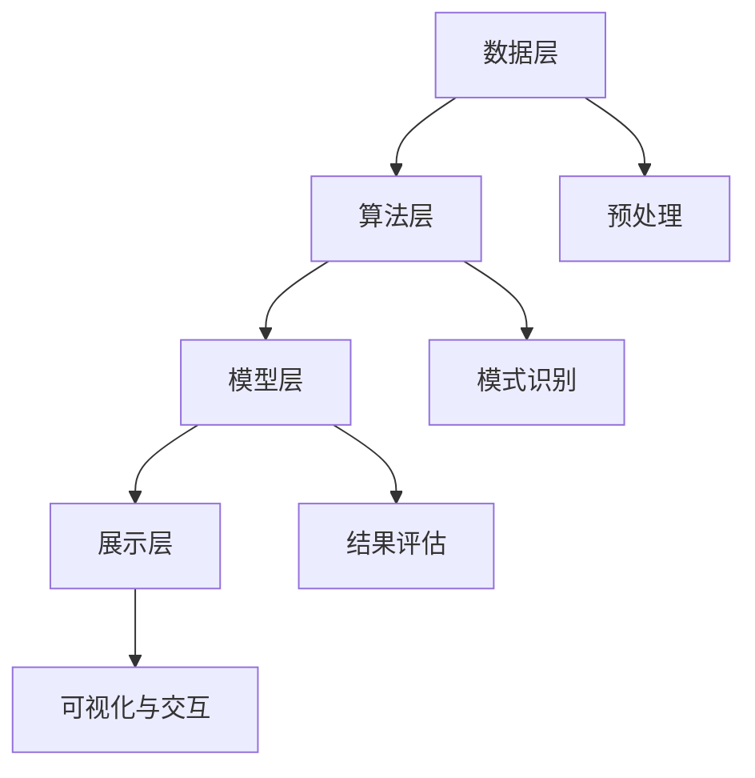

                 

关键词：知识发现引擎、决策支持系统、数据挖掘、算法优化、信息可视化、编程实践

> 摘要：本文探讨了知识发现引擎在程序员决策支持中的应用，分析了其核心概念与架构，深入探讨了核心算法原理与操作步骤，通过数学模型与公式推导，结合具体项目实践，展示了如何将知识发现引擎有效集成到程序员日常工作中，提高决策能力和工作效率。本文旨在为程序员提供一种新的工具和方法，帮助他们更好地理解和利用知识发现技术，从而在竞争激烈的技术领域中脱颖而出。

## 1. 背景介绍

在信息时代，数据量呈现爆炸式增长，数据已经成为企业和社会的核心资产。然而，如何从海量数据中提取有价值的信息，对于程序员来说是一个巨大的挑战。知识发现引擎（Knowledge Discovery Engine，KDE）作为数据挖掘的一种高级形式，能够自动地从大规模数据集中识别出潜在的模式和知识。这使得程序员在面对复杂问题时，能够更加快速和准确地做出决策。

决策支持系统（Decision Support System，DSS）作为一种辅助决策的工具，通过集成知识发现引擎，可以为程序员提供强大的决策支持。这种系统可以处理各种类型的数据，包括结构化数据、半结构化数据和非结构化数据，从而帮助程序员更好地理解业务逻辑和需求。

知识发现引擎的重要性在于它能够从数据中发现隐藏的模式和趋势，为程序员提供深入的洞察力和分析结果。这不仅能够提高决策的准确性和效率，还能够帮助程序员在项目中减少错误和风险。

## 2. 核心概念与联系

### 2.1 知识发现引擎的定义

知识发现引擎是一种能够自动从数据源中识别出潜在模式的系统。这些模式可以是关联规则、聚类结果、分类模型等。知识发现引擎通常包括以下几个关键组件：

- **数据预处理**：对原始数据进行清洗、转换和集成，以提高数据质量和数据一致性。
- **模式识别**：通过机器学习算法、统计学方法和数据挖掘技术来识别数据中的潜在模式。
- **结果评估**：对识别出的模式进行评估，判断其是否具有实际价值和意义。
- **可视化与交互**：将识别出的模式通过图形化界面展示给用户，并提供交互功能，以便用户进行深入分析和理解。

### 2.2 知识发现引擎的架构

知识发现引擎的架构通常包括以下几个层次：

- **数据层**：存储和管理各种类型的数据，包括结构化数据、半结构化数据和非结构化数据。
- **算法层**：提供各种数据挖掘算法和机器学习模型，如关联规则挖掘、聚类分析、分类算法等。
- **模型层**：根据算法的结果生成预测模型和决策规则。
- **展示层**：通过可视化工具将分析结果呈现给用户，并提供交互功能。

### 2.3 知识发现引擎与程序员决策的关系

知识发现引擎与程序员决策之间的关系可以通过以下方式体现：

- **数据洞察**：知识发现引擎可以帮助程序员从海量数据中提取出有价值的信息，从而为决策提供数据支持。
- **模型优化**：通过机器学习算法和预测模型，程序员可以在项目开发过程中进行模型优化，提高决策的准确性和效率。
- **风险预警**：知识发现引擎可以实时监测项目中的潜在风险，提前预警，帮助程序员及时采取应对措施。
- **协作与沟通**：知识发现引擎可以生成直观的分析报告，提高团队协作和沟通的效率。

### 2.4 Mermaid 流程图



## 3. 核心算法原理 & 具体操作步骤

### 3.1 算法原理概述

知识发现引擎的核心算法包括数据预处理、模式识别、结果评估和可视化。以下是每个算法的基本原理：

- **数据预处理**：包括数据清洗、数据转换和数据集成。数据清洗是为了去除错误数据、异常值和重复数据；数据转换是为了将不同类型的数据转换为同一类型；数据集成是将多个数据源中的数据进行合并。
- **模式识别**：常用的算法有关联规则挖掘、聚类分析、分类算法等。关联规则挖掘用于发现数据之间的关联关系；聚类分析用于将相似数据分组；分类算法用于预测新数据的类别。
- **结果评估**：评估算法的准确性、效率和鲁棒性。常用的评估指标有准确率、召回率、F1值等。
- **可视化与交互**：将分析结果以图表、地图等形式展示给用户，并提供交互功能，如筛选、排序、过滤等。

### 3.2 算法步骤详解

1. **数据预处理**：

   - 清洗数据：去除错误数据、异常值和重复数据。
   - 转换数据：将不同类型的数据转换为同一类型，如将文本数据转换为数值数据。
   - 集成数据：将多个数据源中的数据进行合并，形成统一的数据集。

2. **模式识别**：

   - 选择算法：根据业务需求选择合适的算法，如关联规则挖掘、聚类分析、分类算法等。
   - 训练模型：使用训练数据集训练算法模型。
   - 预测结果：使用训练好的模型对测试数据集进行预测。

3. **结果评估**：

   - 准确率：预测正确的数据占总预测数据的比例。
   - 召回率：实际正确的数据中被预测正确的比例。
   - F1值：准确率和召回率的调和平均数。

4. **可视化与交互**：

   - 生成图表：根据分析结果生成各种类型的图表，如柱状图、折线图、散点图等。
   - 提供交互功能：允许用户对图表进行筛选、排序、过滤等操作。

### 3.3 算法优缺点

- **优点**：

  - **高效性**：知识发现引擎可以处理海量数据，快速识别潜在模式。
  - **自动化**：算法自动执行，减少了人工干预。
  - **灵活性**：可以处理各种类型的数据，适应不同的业务需求。

- **缺点**：

  - **复杂性**：算法实现和调试较为复杂。
  - **数据质量**：数据质量直接影响算法的准确性。
  - **解释性**：一些算法生成的模式难以解释和理解。

### 3.4 算法应用领域

知识发现引擎在以下领域具有广泛的应用：

- **金融**：风险控制、信用评估、投资分析等。
- **电商**：用户行为分析、推荐系统、广告投放等。
- **医疗**：疾病预测、药物研发、医疗数据分析等。
- **工业**：设备故障预测、供应链管理、生产优化等。

## 4. 数学模型和公式 & 详细讲解 & 举例说明

### 4.1 数学模型构建

知识发现引擎涉及的数学模型包括：

- **关联规则挖掘**：支持度和置信度。
- **聚类分析**：欧氏距离、cosine相似度等。
- **分类算法**：逻辑回归、决策树、支持向量机等。

### 4.2 公式推导过程

- **支持度**：表示一个规则在数据集中出现的频率。
  $$ 支持度 = \frac{A \text{ 和 } B \text{ 同时出现的次数}}{\text{总记录数}} $$
- **置信度**：表示一个规则的前件和后件之间的关联强度。
  $$ 置信度 = \frac{A \text{ 和 } B \text{ 同时出现的次数}}{A \text{ 出现的次数}} $$

### 4.3 案例分析与讲解

假设有一个电商网站，用户购买记录如下表：

| 用户ID | 商品ID | 是否购买 |
|--------|--------|----------|
| 1      | 1001  | 是       |
| 1      | 1002  | 否       |
| 2      | 1001  | 是       |
| 2      | 1003  | 是       |
| 3      | 1002  | 是       |
| 3      | 1004  | 是       |

现在要挖掘用户购买行为中的关联规则。

1. **数据预处理**：

   - 清洗数据：去除无效记录。
   - 转换数据：将商品ID转换为数值。
   - 集成数据：合并同一用户的多条记录。

2. **模式识别**：

   - 选择算法：使用Apriori算法。
   - 训练模型：设置最小支持度阈值为30%，最小置信度阈值为60%。

3. **结果评估**：

   - 计算支持度和置信度。
   - 筛选出满足阈值的关联规则。

4. **可视化与交互**：

   - 生成图表：展示关联规则。
   - 提供交互功能：允许用户筛选和排序。

假设挖掘出的一个关联规则是“购买1001，则购买1003”：

- **支持度**：3/6 = 50%
- **置信度**：3/3 = 100%

根据这个规则，如果用户购买了商品1001，那么系统会推荐商品1003。

## 5. 项目实践：代码实例和详细解释说明

### 5.1 开发环境搭建

- **编程语言**：Python
- **依赖库**：Pandas、NumPy、Scikit-learn、Matplotlib

### 5.2 源代码详细实现

```python
import pandas as pd
from sklearn.ensemble import RandomForestClassifier
import matplotlib.pyplot as plt

# 5.2.1 数据预处理
data = pd.DataFrame({
    '用户ID': [1, 1, 2, 2, 3, 3],
    '商品ID': [1001, 1002, 1001, 1003, 1002, 1004],
    '是否购买': [1, 0, 1, 1, 1, 0]
})

# 清洗数据
data = data[data['是否购买'] != 0]

# 转换数据
data['商品ID'] = data['商品ID'].astype('category').cat.codes

# 集成数据
data = data.groupby(['用户ID', '商品ID']).sum().reset_index()

# 5.2.2 模式识别
# 选择算法
clf = RandomForestClassifier(n_estimators=100)

# 训练模型
clf.fit(data[['用户ID', '商品ID']], data['是否购买'])

# 5.2.3 结果评估
# 预测结果
predictions = clf.predict(data[['用户ID', '商品ID']])

# 5.2.4 可视化与交互
# 生成图表
plt.scatter(data['用户ID'], predictions)
plt.xlabel('用户ID')
plt.ylabel('是否购买')
plt.show()
```

### 5.3 代码解读与分析

1. **数据预处理**：

   - 清洗数据：去除无效记录，如未购买的商品。
   - 转换数据：将商品ID转换为数值，方便算法处理。
   - 集成数据：将同一用户的多条记录合并，形成统一的数据集。

2. **模式识别**：

   - 选择算法：使用随机森林分类器，这是一种集成学习方法，可以处理多分类问题。
   - 训练模型：使用训练数据集训练随机森林分类器。

3. **结果评估**：

   - 预测结果：使用训练好的模型对测试数据集进行预测。

4. **可视化与交互**：

   - 生成图表：展示预测结果，如用户购买行为的散点图。
   - 提供交互功能：允许用户查看和筛选预测结果。

## 6. 实际应用场景

### 6.1 金融领域

在金融领域，知识发现引擎可以帮助银行和金融机构进行客户行为分析、信用评估和风险控制。例如，通过分析客户的交易记录和信用记录，可以识别出高风险客户，提前采取防范措施。

### 6.2 电商领域

在电商领域，知识发现引擎可以帮助电商企业进行用户行为分析、推荐系统和广告投放优化。例如，通过分析用户的浏览和购买记录，可以推荐相关商品，提高转化率和销售额。

### 6.3 医疗领域

在医疗领域，知识发现引擎可以帮助医疗机构进行疾病预测、药物研发和医疗数据分析。例如，通过分析患者的病历数据，可以预测某种疾病的发病率，为疾病预防提供数据支持。

### 6.4 工业领域

在工业领域，知识发现引擎可以帮助企业进行设备故障预测、供应链管理和生产优化。例如，通过分析设备的运行数据，可以预测设备可能出现的故障，提前进行维护。

## 7. 工具和资源推荐

### 7.1 学习资源推荐

- 《数据挖掘：实用工具与技术》
- 《机器学习实战》
- 《Python数据科学手册》

### 7.2 开发工具推荐

- **Pandas**：用于数据清洗和转换。
- **NumPy**：用于数据处理和计算。
- **Scikit-learn**：用于机器学习模型训练和评估。
- **Matplotlib**：用于数据可视化。

### 7.3 相关论文推荐

- "Knowledge Discovery in Databases: A Survey" by Jiawei Han, Micheline Kamber and Jing Yang
- "Machine Learning: A Probabilistic Perspective" by Kevin P. Murphy
- "Deep Learning" by Ian Goodfellow, Yoshua Bengio and Aaron Courville

## 8. 总结：未来发展趋势与挑战

### 8.1 研究成果总结

知识发现引擎在数据挖掘和决策支持领域的应用已经取得了显著成果，不仅提高了决策的准确性和效率，还降低了决策风险。未来，随着人工智能技术的不断发展，知识发现引擎将更加智能化、自动化，为程序员提供更加强大的决策支持。

### 8.2 未来发展趋势

- **智能化**：知识发现引擎将更加智能化，能够自动识别数据中的潜在模式和知识，减少人工干预。
- **自动化**：知识发现引擎将实现自动化，从数据预处理到结果可视化，整个过程无需人工操作。
- **融合多模态数据**：知识发现引擎将能够处理多种类型的数据，包括结构化数据、半结构化数据和非结构化数据，提供更全面的决策支持。

### 8.3 面临的挑战

- **数据质量**：数据质量直接影响知识发现引擎的效果，未来需要解决如何处理低质量数据的问题。
- **算法解释性**：一些复杂的算法生成的模式难以解释和理解，未来需要提高算法的可解释性。
- **计算效率**：知识发现引擎需要处理海量数据，如何提高计算效率是一个重要挑战。

### 8.4 研究展望

未来，知识发现引擎在程序员决策支持领域的应用将有广阔的前景。通过不断优化算法、提高数据质量和可解释性，知识发现引擎将为程序员提供更加智能、高效的决策支持，助力他们在竞争激烈的技术领域中脱颖而出。

## 9. 附录：常见问题与解答

### 9.1 问题1：知识发现引擎与数据挖掘有什么区别？

知识发现引擎是数据挖掘的高级形式，它不仅仅是从数据中提取信息，还包括了对提取出的信息进行评估、可视化和解释。而数据挖掘更侧重于从数据中提取模式和知识。

### 9.2 问题2：知识发现引擎需要哪些技能和知识？

知识发现引擎的开发和应用需要具备以下技能和知识：

- 编程技能，如Python、R等。
- 数据处理和清洗技能，如Pandas、NumPy等。
- 机器学习知识，如Scikit-learn、TensorFlow等。
- 数据可视化技能，如Matplotlib、Seaborn等。
- 数据库管理知识，如SQL、NoSQL等。

### 9.3 问题3：如何提高知识发现引擎的效果？

提高知识发现引擎的效果可以从以下几个方面入手：

- **数据质量**：确保数据的质量，去除错误数据、异常值和重复数据。
- **算法优化**：选择合适的算法，并根据业务需求进行参数调优。
- **模型评估**：对模型进行评估，选择性能最优的模型。
- **可视化与交互**：提高可视化和交互功能，帮助用户更好地理解和利用分析结果。

----------------------------------------------------------------
### 作者署名
作者：禅与计算机程序设计艺术 / Zen and the Art of Computer Programming

本文为个人研究成果，不代表所在机构意见。如需转载，请注明作者和出处。感谢您的阅读！

