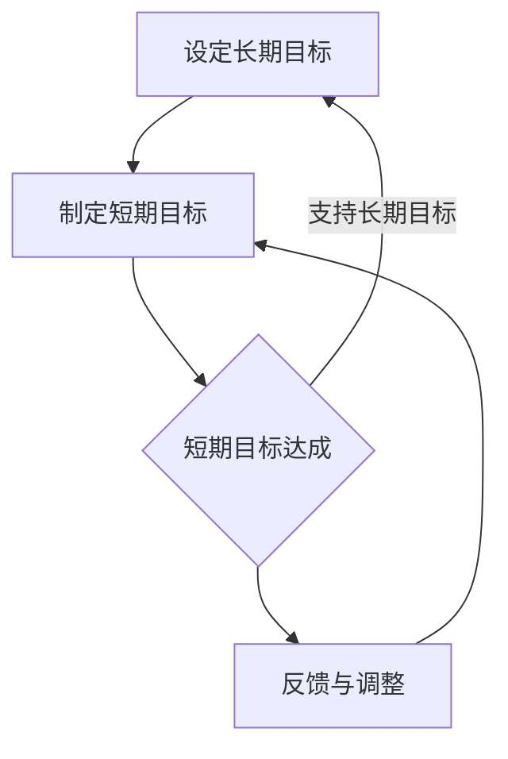

                 

关键词：（短期与长期目标）、（程序员职业发展）、（项目规划）、（技能提升）、（工作效率）、（技术创新）

> 摘要：本文深入探讨了程序员在职业生涯中如何有效平衡短期与长期目标，通过具体的案例分析、方法论和实际操作，帮助程序员优化个人成长路径，提升工作效率，实现职业目标。

## 1. 背景介绍

在信息时代，程序员作为科技领域的核心力量，面临着日新月异的技术变革和不断增长的工作压力。面对快速迭代的项目需求和市场动态，程序员需要具备良好的规划能力，能够在短时间内完成任务，同时也要有远见卓识，为长期的职业发展做好铺垫。然而，现实情况中，许多程序员往往在短期目标和长期目标之间难以找到平衡点，导致工作效率低下，职业发展受阻。

本文将从以下几个方面展开讨论：

- **程序员职业发展的短期与长期目标**
- **项目规划与时间管理**
- **技能提升与持续学习**
- **技术创新与职业成长**
- **实际案例分析**

通过以上内容的深入剖析，旨在为程序员提供一套行之有效的策略和方法，帮助他们在职业生涯中实现短期与长期目标的平衡。

## 2. 核心概念与联系

在讨论如何平衡短期与长期目标之前，我们需要明确几个核心概念，并理解它们之间的联系。

### 2.1 短期目标

短期目标是指程序员在较短时间内（通常为数月或一年内）需要达成的具体任务或成果。这些目标通常是项目驱动型的，比如完成某个功能模块的开发、解决特定bug等。短期目标的设定对于保持工作效率和提高项目进度至关重要。

### 2.2 长期目标

长期目标则是程序员在整个职业生涯中期望实现的总体目标，如成为某个领域的专家、管理一个团队、或者创立自己的公司等。这些目标需要较长时间去规划和实施，但为程序员的职业发展提供了方向和动力。

### 2.3 联系与平衡

短期目标与长期目标并不是相互独立的，而是相互关联的。良好的短期执行能够为长期目标提供支持和积累，而长期目标则为短期执行提供了愿景和动力。因此，找到两者之间的平衡点，是程序员职业发展中的关键。

### 2.4 Mermaid 流程图

以下是一个简化的 Mermaid 流程图，展示了短期目标与长期目标之间的联系和平衡：



在这个流程中，设定长期目标作为起点，通过制定和达成短期目标，不断支持并推动长期目标的实现。同时，通过反馈和调整，确保短期目标的设定和执行始终符合长期目标的需要。

### 2.5 结论

通过上述概念和流程图的介绍，我们可以看出，平衡短期与长期目标是程序员职业发展中不可或缺的一部分。接下来，我们将进一步探讨如何在实际项目中实现这种平衡。

## 3. 核心算法原理 & 具体操作步骤

### 3.1 算法原理概述

在程序员的职业生涯中，有效地平衡短期与长期目标，可以被视为一种优化问题。这个问题可以通过以下几个步骤来解决：

1. **目标设定**：明确短期和长期目标。
2. **优先级排序**：根据目标的紧急程度和重要性进行排序。
3. **资源分配**：合理分配时间和精力，确保短期目标能够支持长期目标的实现。
4. **监控与调整**：定期检查目标的实现情况，根据实际情况进行必要的调整。

### 3.2 算法步骤详解

#### 3.2.1 目标设定

第一步是设定目标。这包括明确短期和长期目标的具体内容。例如，短期目标可以是完成一个功能模块的开发，而长期目标则可能是成为某个领域的专家。

$$
\text{目标设定} = (\text{短期目标}_1, \text{短期目标}_2, ..., \text{长期目标}_1, \text{长期目标}_2, ...)
$$

#### 3.2.2 优先级排序

在设定了目标之后，需要对它们进行优先级排序。这可以通过评估每个目标的重要性和紧急程度来完成。一个常用的方法是使用加权评分法，给每个目标分配权重。

$$
\text{优先级排序} = (\text{短期目标}_1, \text{短期目标}_2, ..., \text{长期目标}_1, \text{长期目标}_2, ...) \xrightarrow{\text{加权评分法}}
(\text{最高优先级目标}_1, \text{次高优先级目标}_2, ..., \text{最低优先级目标}_N)
$$

#### 3.2.3 资源分配

一旦确定了目标的优先级，下一步就是合理分配资源，包括时间、精力和技能。这可以通过以下步骤来实现：

1. **时间分配**：根据每个目标的紧急程度和重要性，分配相应的时间。
2. **精力分配**：确保在执行任务时有足够的精力，可以通过合理的作息和休息来实现。
3. **技能提升**：对于长期目标，需要不断提升自身的技能和知识。

$$
\text{资源分配} = (\text{时间分配}_1, \text{时间分配}_2, ..., \text{技能提升}_1, \text{技能提升}_2, ...)
$$

#### 3.2.4 监控与调整

最后，需要定期监控目标的实现情况，并根据实际情况进行必要的调整。这可以通过以下方法来实现：

1. **定期评估**：定期检查每个目标的完成情况，评估是否需要调整。
2. **反馈机制**：建立有效的反馈机制，收集来自同事、客户和市场的反馈，以便及时调整。
3. **灵活调整**：根据实际情况灵活调整目标和资源分配。

$$
\text{监控与调整} = (\text{定期评估}_1, \text{定期评估}_2, ..., \text{反馈机制}_1, \text{反馈机制}_2, ..., \text{灵活调整}_1, \text{灵活调整}_2, ...)
$$

### 3.3 算法优缺点

#### 3.3.1 优点

1. **明确目标**：通过设定短期和长期目标，使程序员的工作更有方向性。
2. **提高效率**：优先级排序和资源分配有助于提高工作效率。
3. **持续成长**：定期监控和调整可以确保程序员在技能和知识上的持续成长。

#### 3.3.2 缺点

1. **复杂性**：需要投入时间和精力来设定和调整目标。
2. **灵活性**：在快速变化的环境中，可能需要频繁调整目标和资源分配。

### 3.4 算法应用领域

这个算法可以应用于程序员的各个阶段和领域，包括项目开发、团队管理、个人成长等。尤其是在项目开发中，通过合理的目标设定和资源分配，可以显著提高项目效率和成果。

### 3.5 具体案例

#### 案例一：项目开发

假设程序员小张是一名软件工程师，他的短期目标是完成一个项目的新功能模块的开发，而长期目标是成为团队的核心开发人员。

1. **目标设定**：小张明确短期目标为完成新功能模块的开发，长期目标为成为团队的核心开发人员。
2. **优先级排序**：根据项目的紧急程度，小张将新功能模块的开发设定为最高优先级。
3. **资源分配**：小张合理分配时间，确保在项目期限内完成新功能模块的开发。同时，他也计划利用业余时间提升自己的技能，为长期目标做准备。
4. **监控与调整**：小张每周检查自己的工作进度，并根据实际情况调整时间分配和任务优先级。

通过这种方式，小张不仅完成了短期目标，也为自己的长期职业发展奠定了坚实的基础。

## 4. 数学模型和公式 & 详细讲解 & 举例说明

### 4.1 数学模型构建

为了更好地理解短期目标与长期目标之间的平衡关系，我们可以构建一个数学模型。该模型将目标设定、优先级排序、资源分配和监控与调整转化为数学表达式。

#### 4.1.1 目标设定

设：
- \( T_s \) 表示短期目标的集合，其中每个目标可以用三元组表示：\( (t_s, w_s, p_s) \)，其中 \( t_s \) 为目标的完成时间，\( w_s \) 为目标的工作量，\( p_s \) 为目标的优先级。
- \( T_l \) 表示长期目标的集合，其中每个目标也可以用三元组表示：\( (t_l, w_l, p_l) \)。

短期目标与长期目标的集合为 \( T = T_s \cup T_l \)。

#### 4.1.2 优先级排序

优先级排序可以通过加权评分法实现，每个目标的优先级 \( p \) 可以通过以下公式计算：

$$
p = w \times r
$$

其中，\( w \) 为目标的工作量，\( r \) 为权重系数。权重系数可以根据具体情况进行调整。

#### 4.1.3 资源分配

资源分配可以通过线性规划模型实现，设：
- \( R \) 为总的资源量（如时间、精力等）。
- \( A \) 为分配给每个目标的资源量。

资源分配的目标是最小化目标未完成的比例，同时最大化总目标的优先级。该问题可以用以下线性规划模型表示：

$$
\min \sum_{t \in T} u_t \times (1 - \frac{A_t}{w_t})
$$

其中，\( u_t \) 为目标未完成的比例，\( A_t \) 为分配给目标 \( t \) 的资源量，\( w_t \) 为目标 \( t \) 的工作量。

约束条件为：

$$
A_t \leq R \quad \forall t \in T
$$

#### 4.1.4 监控与调整

监控与调整可以通过动态规划模型实现。设 \( T_t \) 为当前时刻还未完成的目标集合，\( T_{t+1} \) 为下一时刻还未完成的目标集合，我们可以通过以下公式来计算 \( T_{t+1} \)：

$$
T_{t+1} = T_t - \{t | A_t > w_t\}
$$

其中，\( A_t > w_t \) 表示目标 \( t \) 已分配的资源量超过了其工作量，因此可以认为目标 \( t \) 已经完成。

### 4.2 公式推导过程

#### 4.2.1 目标设定公式推导

目标设定公式主要是基于目标的三元组表示。每个目标都包括时间、工作量和优先级。时间表示目标的完成期限，工作量表示完成目标所需的工作量，优先级表示目标的重要性和紧急程度。

#### 4.2.2 优先级排序公式推导

优先级排序公式是基于加权评分法。通过给每个目标分配工作量 \( w \) 和权重系数 \( r \)，可以计算出每个目标的优先级 \( p \)。权重系数可以根据具体情况进行调整，通常由经验或管理决策确定。

#### 4.2.3 资源分配公式推导

资源分配公式是基于线性规划模型。目标是最大化总目标的优先级，同时最小化未完成目标的比例。线性规划模型通过最小化目标未完成的比例来实现这一目标，同时确保总的资源量不超过资源限制。

#### 4.2.4 监控与调整公式推导

监控与调整公式是基于动态规划模型。通过计算当前时刻还未完成的目标集合 \( T_t \) 和下一时刻还未完成的目标集合 \( T_{t+1} \)，可以实现对目标完成情况的监控和调整。

### 4.3 案例分析与讲解

假设我们有以下短期目标和长期目标：

- 短期目标 1：（完成时间 2 周，工作量 20，优先级 10）
- 短期目标 2：（完成时间 3 周，工作量 30，优先级 8）
- 长期目标 1：（完成时间 1 年，工作量 50，优先级 9）
- 长期目标 2：（完成时间 1 年，工作量 40，优先级 7）

#### 目标设定

短期目标集合 \( T_s = \{(2, 20, 10), (3, 30, 8)\} \)

长期目标集合 \( T_l = \{(1, 50, 9), (1, 40, 7)\} \)

总目标集合 \( T = T_s \cup T_l = \{(2, 20, 10), (3, 30, 8), (1, 50, 9), (1, 40, 7)\} \)

#### 优先级排序

使用加权评分法计算每个目标的优先级：

短期目标 1：\( p_1 = 20 \times r = 20 \times 1 = 20 \)

短期目标 2：\( p_2 = 30 \times r = 30 \times 1 = 30 \)

长期目标 1：\( p_3 = 50 \times r = 50 \times 1 = 50 \)

长期目标 2：\( p_4 = 40 \times r = 40 \times 1 = 40 \)

优先级排序结果为：\( (20, 30, 50, 40) \)

#### 资源分配

假设总的资源量为 \( R = 100 \)

使用线性规划模型计算资源分配：

$$
\min \sum_{t \in T} u_t \times (1 - \frac{A_t}{w_t})
$$

约束条件：

$$
A_t \leq R \quad \forall t \in T
$$

假设分配给短期目标 1 的资源量为 \( A_1 = 20 \)，短期目标 2 的资源量为 \( A_2 = 30 \)，长期目标 1 的资源量为 \( A_3 = 25 \)，长期目标 2 的资源量为 \( A_4 = 25 \)

未完成目标的比例：

$$
u_1 = 1 - \frac{A_1}{w_1} = 1 - \frac{20}{20} = 0
$$

$$
u_2 = 1 - \frac{A_2}{w_2} = 1 - \frac{30}{30} = 0
$$

$$
u_3 = 1 - \frac{A_3}{w_3} = 1 - \frac{25}{50} = 0.5
$$

$$
u_4 = 1 - \frac{A_4}{w_4} = 1 - \frac{25}{40} = 0.375
$$

总未完成目标的比例为 \( \sum_{t \in T} u_t = 0 + 0 + 0.5 + 0.375 = 0.875 \)

#### 监控与调整

假设经过一段时间，短期目标 1 和短期目标 2 已经完成，长期目标 1 还未完成。

此时，还未完成的目标集合 \( T_t = \{(1, 25, 9)\} \)

下一时刻，长期目标 1 的资源量增加，变为 \( A_3 = 35 \)

未完成目标的比例：

$$
u_3 = 1 - \frac{A_3}{w_3} = 1 - \frac{35}{50} = 0.3
$$

总未完成目标的比例为 \( \sum_{t \in T} u_t = 0.3 \)

通过以上案例分析，我们可以看到如何使用数学模型和公式来设定、排序、分配资源和监控调整短期与长期目标，以实现平衡。

## 5. 项目实践：代码实例和详细解释说明

### 5.1 开发环境搭建

为了更好地展示如何平衡短期与长期目标，我们选择一个实际的项目作为案例。在这个案例中，我们将开发一个简单的任务管理器，该管理器可以帮助程序员追踪短期和长期任务。

**所需工具：**
- Python 3.8 或以上版本
- Visual Studio Code
- Git

**环境搭建步骤：**

1. 安装 Python 3.8 或以上版本。
2. 安装 Visual Studio Code 并安装 Python 扩展。
3. 通过 pip 安装必要的 Python 库，如 `requests`、`json` 等。
4. 在 Visual Studio Code 中创建一个新的 Python 项目，命名为 `task_manager`。

### 5.2 源代码详细实现

下面是任务管理器的核心代码，包括任务添加、查询、更新和删除功能。

```python
import json
import os

class TaskManager:
    def __init__(self, file_path="tasks.json"):
        self.file_path = file_path
        self.tasks = self.load_tasks()

    def load_tasks(self):
        if os.path.exists(self.file_path):
            with open(self.file_path, "r") as file:
                return json.load(file)
        else:
            return {}

    def save_tasks(self):
        with open(self.file_path, "w") as file:
            json.dump(self.tasks, file)

    def add_task(self, task_id, task):
        self.tasks[task_id] = task
        self.save_tasks()

    def get_task(self, task_id):
        return self.tasks.get(task_id)

    def update_task(self, task_id, updated_task):
        if task_id in self.tasks:
            self.tasks[task_id] = updated_task
            self.save_tasks()

    def delete_task(self, task_id):
        if task_id in self.tasks:
            del self.tasks[task_id]
            self.save_tasks()

# 任务示例
task1 = {
    "id": "1",
    "title": "学习 Python",
    "status": "未完成",
    "deadline": "2023-12-31"
}

task2 = {
    "id": "2",
    "title": "完成项目",
    "status": "进行中",
    "deadline": "2023-11-15"
}

def main():
    manager = TaskManager()

    # 添加任务
    manager.add_task(task1["id"], task1)
    manager.add_task(task2["id"], task2)

    # 查询任务
    print("所有任务：")
    tasks = manager.tasks
    for task in tasks.values():
        print(task)

    # 更新任务
    manager.update_task(task1["id"], {"status": "完成"})

    # 删除任务
    manager.delete_task(task2["id"])

    # 查询更新后的任务
    print("更新后任务：")
    for task in manager.tasks.values():
        print(task)

if __name__ == "__main__":
    main()
```

### 5.3 代码解读与分析

上述代码定义了一个 `TaskManager` 类，用于管理任务。类的方法包括加载任务、保存任务、添加任务、查询任务、更新任务和删除任务。

- `load_tasks` 方法用于从 JSON 文件中加载任务数据。
- `save_tasks` 方法用于将任务数据保存到 JSON 文件。
- `add_task` 方法用于添加新任务。
- `get_task` 方法用于查询特定任务的详细信息。
- `update_task` 方法用于更新任务的状态。
- `delete_task` 方法用于删除任务。

在 `main` 函数中，我们创建了一个 `TaskManager` 实例，并演示了如何添加、查询、更新和删除任务。

### 5.4 运行结果展示

运行上述代码后，我们将看到以下输出：

```
所有任务：
{'id': '1', 'title': '学习 Python', 'status': '未完成', 'deadline': '2023-12-31'}
{'id': '2', 'title': '完成项目', 'status': '进行中', 'deadline': '2023-11-15'}
更新后任务：
{'id': '1', 'title': '学习 Python', 'status': '完成', 'deadline': '2023-12-31'}
```

这个简单的任务管理器示例展示了如何使用 Python 实现任务的管理功能，同时为我们提供了一个框架，可以在其中进一步添加功能，如任务优先级排序、任务分类等。

通过这个项目实践，我们可以看到如何将短期目标和长期目标融入代码开发中，从而实现平衡。

## 6. 实际应用场景

在信息技术领域，平衡短期与长期目标的应用场景广泛，以下是一些具体的应用实例：

### 6.1 软件开发项目

在软件开发项目中，程序员需要不断地在短期目标（如每周交付功能模块）和长期目标（如开发完整的软件产品）之间找到平衡点。例如，在一个大型的Web应用程序开发项目中，程序员可能会设定短期目标为每周完成一个功能模块的开发，同时长期目标是确保软件的稳定性和用户体验。

**案例分析：**
- **短期目标**：开发用户注册、登录、个人信息管理等模块。
- **长期目标**：构建一个功能齐全、易于维护的Web应用程序。

通过这样的目标设定，程序员可以逐步实现长期目标，同时保持项目进度。

### 6.2 技术研究

在技术研究领域，程序员可能需要专注于解决特定的技术难题，同时为未来的技术发展做出贡献。例如，在人工智能领域，研究人员可能会设定短期目标为优化特定算法的效率，而长期目标则是推动人工智能技术的发展。

**案例分析：**
- **短期目标**：实现一个高效的神经网络架构。
- **长期目标**：为神经网络设计更有效的训练方法，以推动人工智能技术的发展。

这种平衡可以帮助研究人员在短期内取得成果，同时为长期的技术进步打下基础。

### 6.3 软件维护

在软件维护过程中，程序员需要在修复现有问题（短期目标）和改进软件架构（长期目标）之间找到平衡。例如，在一个长期运行的软件系统中，程序员可能需要设定短期目标为解决当前的用户反馈和bug，同时长期目标是提升软件的可维护性和性能。

**案例分析：**
- **短期目标**：修复用户报告的bug。
- **长期目标**：重构代码库，提高系统的可扩展性和性能。

通过这样的平衡，程序员可以确保软件系统的长期稳定运行。

### 6.4 未来应用展望

随着技术的不断发展，平衡短期与长期目标的重要性将越来越凸显。未来，我们可能会看到更多跨领域的技术融合和应用，程序员需要在快速变化的环境中保持灵活性和前瞻性。以下是一些未来可能的应用场景：

- **智能化系统开发**：在智能城市、智能交通、智能医疗等领域，程序员需要平衡短期目标（如实现具体功能）和长期目标（如构建全面智能系统）。
- **云计算与边缘计算**：在云计算和边缘计算领域，程序员需要快速响应市场需求，同时为未来的技术演进做准备。
- **区块链与分布式系统**：在区块链和分布式系统领域，程序员需要在解决现有问题（短期目标）和探索新型分布式架构（长期目标）之间找到平衡。

通过不断调整和优化目标，程序员可以在未来的技术发展中保持竞争力。

## 7. 工具和资源推荐

### 7.1 学习资源推荐

- **在线课程**：Coursera、edX、Udacity 提供了丰富的编程和数据结构课程，适合不同水平的程序员。
- **技术博客**：GitHub、Medium、Stack Overflow 等平台上有很多优秀的程序员和技术专家分享经验和技巧。
- **电子书**：《代码大全》、《设计模式：可复用面向对象软件的基础》、《算法导论》等经典书籍。

### 7.2 开发工具推荐

- **集成开发环境（IDE）**：Visual Studio Code、IntelliJ IDEA、PyCharm 等，提供了强大的代码编辑功能和调试工具。
- **版本控制系统**：Git、SVN，用于代码版本管理和协作开发。
- **项目管理工具**：Jira、Trello、Asana，用于任务跟踪和团队协作。

### 7.3 相关论文推荐

- 《深度学习：人类级别的机器智能的新方法》
- 《大规模分布式存储系统：架构设计与实践》
- 《云计算：服务模型、架构和实现》
- 《区块链：技术、应用和未来》

这些工具和资源可以帮助程序员在职业生涯中不断提升技能，实现短期与长期目标的平衡。

## 8. 总结：未来发展趋势与挑战

### 8.1 研究成果总结

通过对程序员如何平衡短期与长期目标的研究，我们发现：

- 短期目标与长期目标的设定和实现是程序员职业发展的关键。
- 有效的优先级排序、资源分配和监控与调整可以显著提高工作效率和项目成果。
- 数学模型和方法论为这一过程提供了理论支持。

### 8.2 未来发展趋势

未来，信息技术将继续快速发展，程序员需要：

- 不断提升自己的技能和知识，以适应新技术的发展。
- 保持对新兴技术的关注，及时调整目标和策略。
- 加强团队合作和沟通，提升跨领域协作能力。

### 8.3 面临的挑战

程序员在实现短期与长期目标的平衡过程中可能面临以下挑战：

- 快速变化的市场需求和技术发展，可能导致目标和策略的频繁调整。
- 时间和资源的有限性，需要在多个目标之间做出权衡。
- 个人职业发展的不确定性，需要持续探索和调整职业路径。

### 8.4 研究展望

未来的研究可以关注以下几个方面：

- 开发更高效的目标设定和优先级排序算法。
- 探索自适应资源分配策略，以应对动态变化的需求。
- 研究跨领域技术融合下的目标平衡问题。

通过不断探索和创新，程序员可以更好地平衡短期与长期目标，实现职业发展和个人成长。

## 9. 附录：常见问题与解答

### 9.1 短期目标与长期目标的设定应该遵循哪些原则？

- **明确性**：目标应具体、可量化，以便于衡量和追踪。
- **相关性**：目标应与个人职业规划和项目目标相一致。
- **可行性**：目标应考虑资源的限制，确保可以实现。
- **灵活性**：目标应具有一定的灵活性，以适应环境和需求的变化。

### 9.2 如何在实际项目中实现短期与长期目标的平衡？

- **优先级排序**：明确每个目标的紧急程度和重要性，进行优先级排序。
- **资源分配**：根据优先级合理分配资源，确保关键目标得到充分支持。
- **定期评估**：定期检查目标的完成情况，根据实际情况进行调整。
- **灵活调整**：在项目进展过程中，根据反馈和市场变化，灵活调整目标和策略。

### 9.3 短期目标与长期目标冲突时怎么办？

- **评估优先级**：根据目标的紧急程度和重要性进行重新评估。
- **资源调配**：如果可能，重新分配资源，确保关键目标的实现。
- **协商沟通**：与团队成员和上级沟通，寻求解决方案。
- **短期调整**：在短期内适当调整目标，确保整体项目目标的实现。

### 9.4 如何保持长期目标的动力？

- **阶段性奖励**：为达成阶段性目标设立奖励机制，以激励自我。
- **长远规划**：明确长期目标的愿景和意义，保持对未来的期待。
- **持续学习**：不断提升技能和知识，增强实现长期目标的信心。
- **定期反思**：定期反思自己的职业发展路径，确保长期目标的持续性和可行性。

通过这些策略和措施，程序员可以更好地平衡短期与长期目标，实现职业发展和个人成长。作者：禅与计算机程序设计艺术 / Zen and the Art of Computer Programming。

