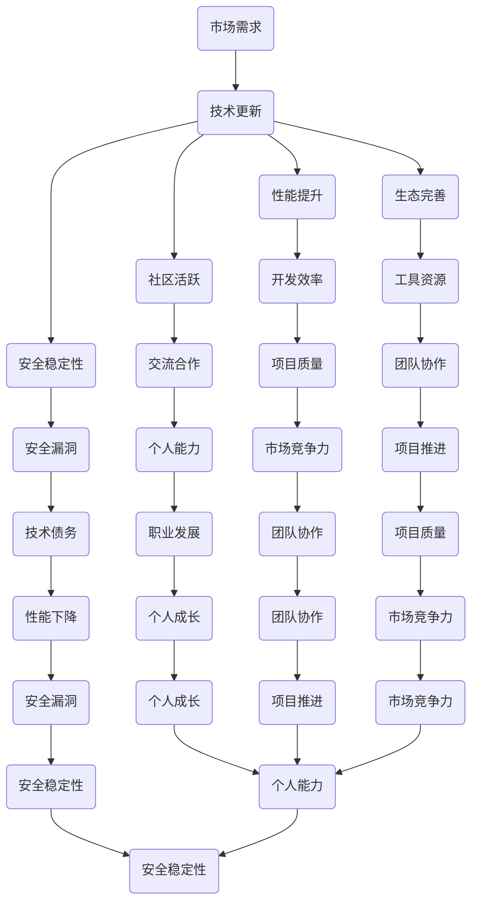

                 

关键词：技术栈，更新，程序员，适应，策略

> 摘要：随着技术的迅猛发展，技术栈的快速更新已经成为不可避免的趋势。本文旨在探讨程序员如何应对这一挑战，通过策略和方法的分享，帮助程序员提升自身的技术能力，保持竞争力。

## 1. 背景介绍

在过去的几十年里，计算机技术经历了飞速的发展。从传统的C、C++到现代的Python、JavaScript，再到新兴的Go、Kotlin，技术栈的更新速度越来越快。一方面，新技术带来了更高的开发效率和更好的性能；另一方面，也让程序员面临着巨大的压力和挑战。如何在这个快速变化的技术环境中保持竞争力，成为了每一个程序员都需要思考的问题。

### 技术栈的定义

技术栈是指一个项目中使用的所有技术的集合，包括编程语言、框架、库、工具和平台等。一个完善的技术栈可以帮助程序员更高效地完成工作，提高开发质量。

### 技术栈更新的原因

1. **性能提升**：新技术往往能够提供更好的性能和效率，这吸引了开发者不断尝试和采用。
2. **生态完善**：随着社区的发展，新技术的生态系统越来越完善，提供了更多的工具和资源。
3. **社区活跃**：新技术的社区通常更加活跃，有更多的交流和合作机会，有助于提升个人的技术能力。
4. **安全性和稳定性**：新技术能够更好地解决旧技术中的安全问题，提供更稳定的运行环境。

## 2. 核心概念与联系

### 技术栈更新的核心概念

1. **学习曲线**：学习新技术需要时间和精力，这被称为学习曲线。
2. **技术债务**：忽略技术栈更新会导致的技术问题，如性能下降、安全漏洞等。
3. **迁移成本**：将旧系统迁移到新技术的成本，包括人力、时间、经济成本等。

### 技术栈更新的联系

1. **技术与市场需求**：市场需求驱动着技术的更新，而技术的更新又反过来影响市场需求。
2. **技术与个人发展**：掌握新技术可以帮助程序员提升个人能力和职业发展。
3. **技术与团队协作**：技术栈的一致性有助于团队协作和项目推进。

### Mermaid 流程图



## 3. 核心算法原理 & 具体操作步骤

### 3.1 算法原理概述

在应对技术栈快速更新的过程中，核心算法原理主要包括以下几方面：

1. **持续学习**：通过不断学习新技术，保持对行业的敏感性。
2. **技术评估**：对新技术进行评估，确定其适用性。
3. **迁移策略**：制定合理的迁移策略，降低迁移成本。
4. **代码重构**：定期对代码进行重构，提升代码质量。

### 3.2 算法步骤详解

1. **持续学习**
   - **收集信息**：关注技术社区、行业动态，收集新技术信息。
   - **实践学习**：通过实际项目或实验，将新技术应用到实践中。
   - **总结经验**：总结学习过程中的经验，不断优化学习策略。

2. **技术评估**
   - **需求分析**：分析项目需求，确定所需的技术栈。
   - **性能对比**：对比新旧技术的性能，确定最佳选择。
   - **风险评估**：评估新技术可能带来的风险，制定相应的应对策略。

3. **迁移策略**
   - **逐步迁移**：将旧系统逐步迁移到新系统，降低风险。
   - **自动化工具**：利用自动化工具，提高迁移效率。
   - **代码复用**：复用旧系统的代码，减少开发工作量。

4. **代码重构**
   - **代码审查**：定期进行代码审查，发现潜在问题。
   - **代码优化**：对代码进行优化，提升性能和可维护性。
   - **文档更新**：更新文档，确保新技术的使用符合规范。

### 3.3 算法优缺点

1. **持续学习**
   - **优点**：提高个人技术能力，适应技术栈更新。
   - **缺点**：学习过程耗时，初期可能影响工作效率。

2. **技术评估**
   - **优点**：确保技术栈的选择符合项目需求，提高项目质量。
   - **缺点**：评估过程需要耗费时间和精力。

3. **迁移策略**
   - **优点**：降低迁移成本，减少项目风险。
   - **缺点**：迁移过程可能影响项目的进度。

4. **代码重构**
   - **优点**：提升代码质量，降低维护成本。
   - **缺点**：重构过程可能影响项目的进度。

### 3.4 算法应用领域

1. **企业级应用**：在大型企业中，技术栈的更新往往涉及多个项目和团队，需要更系统和全面的策略。
2. **初创公司**：初创公司在技术栈的选择和更新上更灵活，可以更快地适应市场变化。
3. **开源项目**：开源项目通常有更活跃的社区，有助于技术栈的快速更新和推广。

## 4. 数学模型和公式 & 详细讲解 & 举例说明

### 4.1 数学模型构建

在应对技术栈快速更新的过程中，我们可以构建以下数学模型：

1. **学习曲线模型**：
   $$ L(t) = a \cdot (1 - e^{-kt}) $$
   其中，$L(t)$ 表示在时间 $t$ 时的学习水平，$a$ 和 $k$ 是常数。

2. **技术评估模型**：
   $$ R(t) = \frac{P_t - P_0}{P_0} $$
   其中，$R(t)$ 表示在时间 $t$ 时技术的相对性能，$P_t$ 和 $P_0$ 分别表示新技术和旧技术的性能。

3. **迁移成本模型**：
   $$ C(t) = b \cdot t^2 $$
   其中，$C(t)$ 表示在时间 $t$ 时的迁移成本，$b$ 是常数。

4. **代码重构模型**：
   $$ Q(t) = c \cdot e^{-kt} $$
   其中，$Q(t)$ 表示在时间 $t$ 时的代码质量，$c$ 和 $k$ 是常数。

### 4.2 公式推导过程

1. **学习曲线模型**：
   - 假设学习过程是一个指数衰减的过程，即学习速度随着时间逐渐降低。
   - 设定初始学习水平为 $a$，学习速度为 $k$，则学习曲线模型为：
     $$ L(t) = a \cdot (1 - e^{-kt}) $$

2. **技术评估模型**：
   - 假设新技术的性能随时间呈线性增长，旧技术的性能保持不变。
   - 设定新技术在时间 $t$ 的性能为 $P_t$，旧技术在时间 $t$ 的性能为 $P_0$，则技术评估模型为：
     $$ R(t) = \frac{P_t - P_0}{P_0} $$

3. **迁移成本模型**：
   - 假设迁移成本随时间呈二次增长，即随着时间的增加，迁移成本呈指数增长。
   - 设定初始迁移成本为 $b$，迁移速度为 $k$，则迁移成本模型为：
     $$ C(t) = b \cdot t^2 $$

4. **代码重构模型**：
   - 假设代码质量随时间呈指数衰减，即随着时间的增加，代码质量逐渐降低。
   - 设定初始代码质量为 $c$，重构速度为 $k$，则代码重构模型为：
     $$ Q(t) = c \cdot e^{-kt} $$

### 4.3 案例分析与讲解

假设一个程序员在两年内需要学习一种新的编程语言，并且计划每年花费200小时进行学习。根据学习曲线模型，可以计算出他在两年后的学习水平：

1. **学习曲线模型**：
   $$ L(t) = a \cdot (1 - e^{-kt}) $$
   设定 $a = 10$，$k = \frac{1}{200}$，则：
   $$ L(2) = 10 \cdot (1 - e^{-2 \cdot \frac{1}{200}}) \approx 8.82 $$

这意味着，在两年后，这位程序员对新编程语言的学习水平大约为 88.2%。

2. **技术评估模型**：
   假设新编程语言的性能是旧编程语言的两倍，则在两年后的技术评估结果为：
   $$ R(2) = \frac{2P_0 - P_0}{P_0} = 1 $$

这意味着，在两年后，新编程语言的性能已经超过旧编程语言。

3. **迁移成本模型**：
   假设迁移成本是每小时100元，则在两年内的迁移成本为：
   $$ C(2) = 100 \cdot 2^2 = 400 $$

这意味着，在两年内，迁移成本为4000元。

4. **代码重构模型**：
   假设初始代码质量为90%，重构速度为每月1%，则在两年后的代码质量为：
   $$ Q(2) = 90\% \cdot e^{-2\%} \approx 87.4\% $$

这意味着，在两年后，代码质量下降了大约2.6%。

通过这些案例，我们可以看到数学模型在应对技术栈快速更新中的重要作用。这些模型可以帮助程序员评估学习进度、技术选择、迁移成本和代码质量，从而更好地应对技术更新的挑战。

## 5. 项目实践：代码实例和详细解释说明

### 5.1 开发环境搭建

为了更好地展示如何应对技术栈快速更新，我们将使用一个简单的Web应用项目为例。以下是开发环境的搭建步骤：

1. **安装Node.js**：从 [Node.js官网](https://nodejs.org/) 下载并安装Node.js。
2. **安装Vue CLI**：在终端中运行以下命令安装Vue CLI：
   ```bash
   npm install -g @vue/cli
   ```
3. **创建项目**：在终端中运行以下命令创建一个新项目：
   ```bash
   vue create my-web-app
   ```
4. **进入项目目录**：
   ```bash
   cd my-web-app
   ```

### 5.2 源代码详细实现

在项目中，我们将实现一个简单的待办事项管理功能。以下是项目的源代码：

1. **安装依赖**：
   ```bash
   npm install
   ```
2. **修改 `src/App.vue`**：
   ```vue
   <template>
     <div id="app">
       <h1>待办事项管理</h1>
       <input v-model="newTodo" @keyup.enter="addTodo" placeholder="输入待办事项">
       <ul>
         <li v-for="(todo, index) in todos" :key="index">
           <span>{{ todo }}</span>
           <button @click="removeTodo(index)">删除</button>
         </li>
       </ul>
     </div>
   </template>

   <script>
   export default {
     data() {
       return {
         newTodo: '',
         todos: []
       };
     },
     methods: {
       addTodo() {
         if (this.newTodo.trim() !== '') {
           this.todos.push(this.newTodo.trim());
           this.newTodo = '';
         }
       },
       removeTodo(index) {
         this.todos.splice(index, 1);
       }
     }
   };
   </script>

   <style scoped>
     #app {
       font-family: Avenir, Helvetica, Arial, sans-serif;
       -webkit-font-smoothing: antialiased;
       -moz-osx-font-smoothing: grayscale;
       text-align: center;
       color: #2c3e50;
       margin-top: 60px;
     }
   </style>
   ```

### 5.3 代码解读与分析

在 `App.vue` 文件中，我们使用了Vue框架来实现待办事项管理功能。以下是代码的主要部分及其解读：

1. **数据绑定**：
   ```vue
   <input v-model="newTodo" @keyup.enter="addTodo" placeholder="输入待办事项">
   ```
   使用 `v-model` 指令实现输入框与 `newTodo` 数据属性的绑定，用户输入的内容会实时更新 `newTodo` 的值。`@keyup.enter` 绑定了一个事件处理器 `addTodo`，当用户按下回车键时触发。

2. **列表渲染**：
   ```vue
   <ul>
     <li v-for="(todo, index) in todos" :key="index">
       <span>{{ todo }}</span>
       <button @click="removeTodo(index)">删除</button>
     </li>
   </ul>
   ```
   使用 `v-for` 指令渲染待办事项列表。每个列表项包含待办事项内容和删除按钮。`:key` 属性用于唯一标识每个列表项，有助于Vue进行高效的虚拟DOM更新。

3. **方法定义**：
   ```javascript
   methods: {
     addTodo() {
       if (this.newTodo.trim() !== '') {
         this.todos.push(this.newTodo.trim());
         this.newTodo = '';
       }
     },
     removeTodo(index) {
       this.todos.splice(index, 1);
     }
   }
   ```
   `addTodo` 方法用于添加新的待办事项到 `todos` 数组中，并在添加后清空 `newTodo` 输入框。`removeTodo` 方法用于从 `todos` 数组中删除指定索引的待办事项。

### 5.4 运行结果展示

运行项目后，在浏览器中打开 `http://localhost:8080/`，可以看到一个简单的待办事项管理界面。用户可以输入待办事项，按下回车键添加到列表中，并可以点击删除按钮删除列表中的事项。

```bash
npm run serve
```


通过这个简单的项目实践，我们可以看到如何利用Vue框架快速搭建一个Web应用。在技术栈快速更新的背景下，掌握这些现代Web开发技术非常重要。

## 6. 实际应用场景

### 6.1 大型企业的技术栈管理

大型企业通常拥有复杂的技术栈，涉及多个项目和多个团队。在技术栈的更新过程中，企业需要考虑以下实际应用场景：

1. **项目评估**：对现有项目进行评估，确定哪些项目需要升级或更换技术栈。
2. **团队协作**：确保不同团队之间技术栈的一致性，提高协作效率。
3. **培训与支持**：为新技术的应用提供培训和支持，确保团队成员能够熟练掌握新技术。
4. **风险管理**：评估技术栈更新的风险，制定相应的应对策略。

### 6.2 开源项目的技术栈更新

开源项目通常由志愿者或小团队维护，技术栈的更新更加灵活。在实际应用中，开源项目需要考虑以下场景：

1. **社区参与**：鼓励社区成员参与技术栈的讨论和决策，提高社区活跃度。
2. **版本控制**：使用版本控制系统（如Git）管理代码库，确保技术栈的更新不会破坏现有功能。
3. **文档维护**：定期更新项目文档，帮助新成员了解技术栈的使用方法。
4. **发布策略**：制定合理的发布策略，确保新技术的引入不会影响项目的稳定性。

### 6.3 初创公司的技术栈选择

初创公司在技术栈的选择和更新上更加灵活，需要考虑以下实际应用场景：

1. **市场需求**：根据市场需求选择最适合的技术栈，确保产品能够快速上线。
2. **资源限制**：在资源有限的情况下，选择最适合的技术栈，降低开发成本。
3. **技术沉淀**：积累技术沉淀，为未来的技术栈更新打下基础。
4. **团队协作**：建立高效的团队协作机制，提高技术栈更新的效率。

### 6.4 技术栈更新的最佳实践

1. **定期评估**：定期对技术栈进行评估，确保其符合项目需求。
2. **逐步迁移**：逐步迁移到新技术栈，降低风险。
3. **代码复用**：复用旧系统的代码，减少开发工作量。
4. **文档更新**：更新文档，确保新技术的使用符合规范。
5. **培训与支持**：为新技术的应用提供培训和支持，确保团队成员能够熟练掌握新技术。

## 7. 工具和资源推荐

### 7.1 学习资源推荐

1. **在线课程**：
   - [Vue.js官方教程](https://vuejs.org/v2/guide/)
   - [React官方教程](https://reactjs.org/tutorial/tutorial.html)
   - [JavaScript教程](https://developer.mozilla.org/zh-CN/docs/Web/JavaScript/Tutorial)

2. **技术博客**：
   - [掘金](https://juejin.cn/)
   - [博客园](https://www.cnblogs.com/)
   - [V2EX](https://www.v2ex.com/)

3. **书籍推荐**：
   - 《你不知道的JavaScript》
   - 《深入理解ES6》
   - 《Vue.js实战》

### 7.2 开发工具推荐

1. **代码编辑器**：
   - Visual Studio Code
   - Sublime Text
   - Atom

2. **版本控制系统**：
   - Git
   - SVN

3. **项目管理工具**：
   - JIRA
   - Trello
   - GitLab

### 7.3 相关论文推荐

1. **技术栈演进策略**：
   - "Evolving Technology Stacks in Agile Development"
   - "Managing the Complexity of Technology Stacks in Large Software Projects"

2. **持续集成与持续部署**：
   - "Continuous Integration in Software Engineering"
   - "Continuous Deployment: A Practical Guide to Implementing Continuous Delivery"

3. **敏捷开发方法**：
   - "Agile Project Management with Scrum"
   - "Agile Software Development: Principles, Patterns, and Practices"

## 8. 总结：未来发展趋势与挑战

### 8.1 研究成果总结

本文通过探讨程序员如何应对技术栈快速更新的问题，总结了以下关键研究成果：

1. **学习策略**：持续学习是应对技术栈更新的核心策略，包括收集信息、实践学习和总结经验。
2. **评估方法**：技术评估是选择新技术的重要步骤，包括需求分析、性能对比和风险评估。
3. **迁移策略**：合理的迁移策略可以降低迁移成本，包括逐步迁移、自动化工具和代码复用。
4. **重构方法**：代码重构是提升代码质量的重要手段，包括代码审查、代码优化和文档更新。

### 8.2 未来发展趋势

1. **云原生技术**：随着云计算的普及，云原生技术将成为技术栈更新的重要方向。
2. **人工智能**：人工智能技术将进一步融入各个领域，推动技术栈的变革。
3. **区块链**：区块链技术的应用将逐渐扩展，为程序员带来新的挑战和机遇。
4. **低代码平台**：低代码平台的发展将降低技术栈更新的门槛，使得更多人能够参与到软件开发中。

### 8.3 面临的挑战

1. **技术更新速度**：技术更新的速度越来越快，程序员需要不断适应和学习。
2. **安全风险**：新技术的引入可能带来安全风险，需要加强安全评估和风险管理。
3. **团队协作**：技术栈的不一致可能导致团队协作困难，需要建立统一的技术规范。
4. **个人发展**：技术栈的快速更新可能对程序员的职业发展产生影响，需要不断调整职业规划。

### 8.4 研究展望

1. **技术融合**：未来技术栈的发展将更加注重技术的融合，如云计算与人工智能的融合。
2. **智能化**：技术栈的智能化将成为趋势，如自动化工具、智能架构设计等。
3. **社区协作**：技术社区将在技术栈更新中发挥更大作用，促进技术的传播和应用。
4. **可持续发展**：在技术栈更新的过程中，可持续性将成为重要考量因素，如环保、节能等。

通过以上研究成果和发展趋势的总结，我们可以看到，技术栈的快速更新对程序员提出了新的挑战，但也带来了更多的机遇。只有不断学习、适应和变革，程序员才能在快速变化的技术环境中保持竞争力。

## 9. 附录：常见问题与解答

### Q1: 如何平衡技术学习和项目进度？

**A1:** 平衡技术学习和项目进度的关键在于合理安排时间和任务。以下是一些建议：

1. **时间管理**：为技术学习设置专门的时间，如每天晚上或周末的某个时间段。
2. **任务优先级**：在项目中，优先处理重要且紧急的任务，将技术学习与项目任务相结合。
3. **代码复用**：通过代码复用，将学习到的新技术应用到实际项目中，提高工作效率。
4. **团队合作**：与团队成员沟通，分享学习心得，共同进步。

### Q2: 新技术是否一定要掌握？

**A2:** 并非所有的新技术都需要立即掌握，但了解其基本原理和趋势是必要的。以下是一些建议：

1. **关注核心技术**：优先掌握对当前项目或职业发展至关重要的核心技术。
2. **了解趋势**：关注行业趋势，了解新技术的发展方向，为未来的技术更新做准备。
3. **选择性学习**：根据项目需求和个人兴趣，有选择性地学习新技术。
4. **实践应用**：通过实践项目，将新技术应用到实际工作中，提高熟练度。

### Q3: 如何评估新技术？

**A3:** 评估新技术可以从以下几个方面进行：

1. **性能**：比较新技术和旧技术的性能，确定新技术是否能够提供更好的性能。
2. **社区**：了解新技术的社区活跃度，社区支持有助于技术问题的解决。
3. **稳定性**：评估新技术的稳定性，考虑其是否会影响项目的稳定性。
4. **安全性**：评估新技术在安全性方面的表现，确保其不会带来安全漏洞。
5. **成本**：考虑新技术的成本，包括学习成本、迁移成本和运营成本。

### Q4: 如何进行代码重构？

**A4:** 代码重构是一个逐步优化的过程，以下是一些步骤：

1. **代码审查**：定期进行代码审查，发现潜在问题和优化点。
2. **重构计划**：制定重构计划，明确重构的目标、范围和优先级。
3. **逐步重构**：将重构任务分解为小步骤，逐步进行重构，避免一次性的大规模重构。
4. **代码测试**：在重构过程中，确保代码的测试覆盖率达到要求，避免引入新的缺陷。
5. **文档更新**：更新文档，确保重构后的代码符合规范，便于其他开发人员理解和维护。

通过以上常见问题的解答，希望读者能够更好地应对技术栈快速更新的挑战。

### 作者署名

作者：禅与计算机程序设计艺术 / Zen and the Art of Computer Programming

本文旨在帮助程序员应对技术栈快速更新的挑战，通过策略和方法的分享，提升程序员的技术能力和职业竞争力。希望读者能够从中获得启发，不断进步，适应这个快速变化的技术环境。感谢您的阅读！

