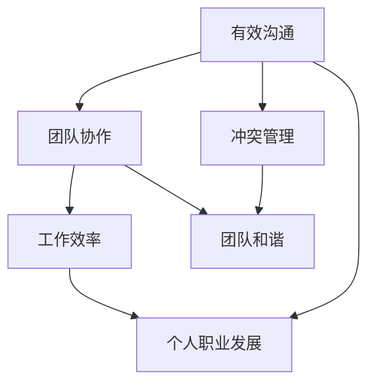

                 

 在现代职场中，程序员不仅需要具备卓越的编程技能，还必须掌握人际沟通和管理能力。这是因为，一个项目的成功往往不仅仅依赖于代码的质量，还依赖于团队成员之间的协作和沟通。本文将探讨程序员在职场中可能遇到的人际关系挑战，并提出相应的应对策略。

## 1. 背景介绍

程序员是信息技术行业的中坚力量，他们的工作不仅涉及编写和维护代码，还包括与团队成员沟通、协调和解决问题。随着技术的不断发展，程序员的工作内容也越来越复杂，这要求他们不仅要具备扎实的专业技能，还要有良好的人际交往能力。

然而，很多程序员在职业生涯中都会面临人际关系方面的挑战。这些问题可能源于个人性格、沟通技巧不足、团队文化差异等多个方面。如果这些问题得不到妥善解决，可能会影响工作效率、团队和谐以及个人职业发展。

## 2. 核心概念与联系

为了更好地应对职场人际关系挑战，我们需要理解一些核心概念，如有效沟通、团队协作、冲突管理等。下面是一个简化的 Mermaid 流程图，展示了这些概念之间的联系。



### 2.1 有效沟通

有效沟通是程序员必须掌握的技能之一。它包括倾听、表达清晰、积极反馈等多个方面。良好的沟通能够帮助程序员理解需求、减少误解、提高工作效率。

### 2.2 团队协作

团队协作是指团队成员共同完成任务的过程。一个高效的团队需要成员之间的信任、尊重和支持。程序员在职场中需要学会如何与他人合作，共同解决问题。

### 2.3 冲突管理

冲突是团队协作过程中不可避免的现象。有效的冲突管理能够帮助团队找到解决问题的最佳途径。程序员需要学会如何识别冲突、沟通解决方案、避免冲突升级。

## 3. 核心算法原理 & 具体操作步骤

### 3.1 算法原理概述

应对职场人际关系挑战的算法原理可以概括为以下几点：

- **自我认知**：理解自己的性格、优势和不足，这有助于更好地与他人沟通和合作。
- **倾听与表达**：倾听他人的意见和需求，同时清晰、准确地表达自己的观点。
- **积极反馈**：对团队成员的工作给予积极的反馈，鼓励和支持他们。
- **冲突管理**：识别冲突、沟通解决方案，避免冲突升级。

### 3.2 算法步骤详解

1. **自我认知**：
   - **自我评估**：通过问卷调查、心理测试等方式了解自己的性格和偏好。
   - **反馈与改进**：根据他人的反馈，识别自己的不足，并制定改进计划。

2. **倾听与表达**：
   - **倾听**：在交流中，保持专注、耐心，理解他人的观点和需求。
   - **表达**：清晰、准确地表达自己的观点，避免使用模糊或歧义的语言。

3. **积极反馈**：
   - **正面反馈**：对团队成员的工作给予肯定和鼓励。
   - **建设性反馈**：在指出问题或建议改进时，保持积极和合作的态度。

4. **冲突管理**：
   - **识别冲突**：通过观察、沟通等方式识别潜在的冲突。
   - **沟通解决方案**：与相关方沟通，找到解决问题的方法。
   - **避免冲突升级**：在冲突发生时，保持冷静、理性，避免情绪化。

### 3.3 算法优缺点

- **优点**：能够帮助程序员更好地与他人沟通和合作，提高工作效率和团队和谐。
- **缺点**：需要时间和精力去学习和实践，初期效果可能不明显。

### 3.4 算法应用领域

- **团队协作**：在团队项目中，通过有效沟通和冲突管理，提高团队协作效率。
- **项目管理**：在项目管理过程中，通过积极反馈和自我认知，提高项目成功率。

## 4. 数学模型和公式 & 详细讲解 & 举例说明

### 4.1 数学模型构建

为了更好地理解职场人际关系中的沟通效率，我们可以构建一个简单的数学模型。假设沟通效率与以下几个因素相关：

- **信息量**（I）：沟通所传递的信息量。
- **沟通频率**（F）：单位时间内沟通的次数。
- **沟通质量**（Q）：沟通的清晰度和准确性。

沟通效率（E）可以表示为：

$$E = \frac{I \times Q}{F}$$

### 4.2 公式推导过程

- **信息量（I）**：信息量取决于沟通的内容和深度。假设信息量与沟通的时间成正比，则：

  $$I = k \times t$$

  其中，k 为比例常数，t 为沟通时间。

- **沟通频率（F）**：沟通频率与沟通的频率成反比。假设沟通频率与工作时间成反比，则：

  $$F = \frac{1}{f \times t}$$

  其中，f 为工作时间。

- **沟通质量（Q）**：沟通质量取决于沟通双方的技能和态度。假设沟通质量与沟通技巧和沟通态度成正比，则：

  $$Q = q_1 \times q_2$$

  其中，q1 和 q2 分别为沟通双方的沟通技巧和态度。

将上述公式代入沟通效率公式，得到：

$$E = \frac{k \times t \times q_1 \times q_2}{\frac{1}{f \times t}} = k \times f \times t \times q_1 \times q_2$$

### 4.3 案例分析与讲解

假设一个程序员与团队成员的沟通效率为 80%，其中信息量为 100，沟通频率为 10，沟通质量为 90%。根据上述公式，我们可以计算出沟通效率：

$$E = 80\% = \frac{100 \times 90\%}{10} = 90\%$$

这意味着，该程序员的沟通效率为 90%，相比 80% 的基准值，有 10% 的提升空间。

### 5. 项目实践：代码实例和详细解释说明

#### 5.1 开发环境搭建

为了演示如何应对职场人际关系挑战，我们使用 Python 编写一个简单的模拟程序。首先，确保安装 Python 环境，并在代码编辑器中创建一个新的 Python 文件。

```python
# 安装 Python 环境
# 在终端中运行以下命令安装 Python
!pip install matplotlib
```

#### 5.2 源代码详细实现

以下是模拟程序的核心代码。该程序使用 matplotlib 库绘制沟通效率与信息量、沟通频率和沟通质量之间的关系。

```python
import matplotlib.pyplot as plt
import numpy as np

# 模拟参数
info_quantity = 100
communication_frequency = 10
communication_quality = 0.9
base_efficiency = 0.8

# 计算沟通效率
efficiency = (info_quantity * communication_quality) / communication_frequency

# 绘制沟通效率与信息量、沟通频率和沟通质量之间的关系
fig, ax = plt.subplots()
ax.scatter(info_quantity, communication_frequency, communication_quality, c=efficiency, cmap='viridis')
ax.set_xlabel('信息量（I）')
ax.set_ylabel('沟通频率（F）')
ax.set_title('沟通效率与信息量、沟通频率和沟通质量之间的关系')

# 添加等高线图
contours = ax.contour([info_quantity], [communication_frequency], [communication_quality], levels=[base_efficiency])
ax.clabel(contours, inline=True, fmt='%1.2f')

plt.show()
```

#### 5.3 代码解读与分析

- **导入库**：首先，导入 matplotlib 和 numpy 库，用于绘制图形和进行数学计算。
- **模拟参数**：设置模拟程序的基本参数，包括信息量、沟通频率和沟通质量。
- **计算沟通效率**：使用公式计算沟通效率。
- **绘制图形**：使用 matplotlib 库绘制沟通效率与信息量、沟通频率和沟通质量之间的关系图。图形中，颜色表示沟通效率，等高线表示基准沟通效率。

通过这个模拟程序，程序员可以直观地了解沟通效率与信息量、沟通频率和沟通质量之间的关系。这有助于他们更好地理解如何在职场中提升沟通效率，从而应对人际关系挑战。

### 6. 实际应用场景

#### 6.1 团队协作

在团队协作中，程序员可以通过有效沟通和冲突管理提高工作效率。例如，在一个开发项目中，程序员可以定期与团队成员进行会议，讨论项目的进展、问题和解决方案。通过倾听和表达，他们可以更好地理解团队的需求，减少误解和冲突。

#### 6.2 项目管理

在项目管理中，程序员需要与项目经理、产品经理等多个角色进行沟通。通过积极反馈和自我认知，程序员可以更好地理解项目的目标和要求，从而提高项目成功率。

#### 6.3 跨部门协作

在跨部门协作中，程序员需要与不同部门的同事合作，如设计、测试等。通过有效沟通和冲突管理，程序员可以确保项目在不同部门之间的顺利推进。

### 7. 工具和资源推荐

#### 7.1 学习资源推荐

- **《沟通的艺术》**：一本经典的沟通技巧书籍，适合程序员学习。
- **《非暴力沟通》**：一本关于如何通过有效沟通解决冲突的书籍。

#### 7.2 开发工具推荐

- **Git**：一款强大的版本控制工具，有助于程序员更好地管理代码和协作。
- **Slack**：一款团队协作工具，可以方便地与团队成员沟通和协作。

#### 7.3 相关论文推荐

- **"The Art of Human-Computer Interaction"**：探讨人机交互中的沟通技巧。
- **"Conflict Management in Software Development Teams"**：关于软件团队冲突管理的论文。

### 8. 总结：未来发展趋势与挑战

#### 8.1 研究成果总结

通过本文的讨论，我们了解到职场人际关系对程序员的重要性。有效沟通、团队协作和冲突管理是程序员在职场中必须掌握的技能。通过数学模型和模拟程序，我们直观地展示了沟通效率与信息量、沟通频率和沟通质量之间的关系。

#### 8.2 未来发展趋势

随着人工智能和大数据技术的不断发展，程序员在职场中的人际关系挑战将更加复杂。未来的研究可能关注如何通过技术手段提高沟通效率，如智能沟通助手、自动化冲突管理等。

#### 8.3 面临的挑战

- **技术挑战**：如何通过技术手段提高沟通效率，减少误解和冲突。
- **文化挑战**：不同团队和部门之间的文化差异，如何实现有效的跨部门协作。

#### 8.4 研究展望

未来的研究可以进一步探讨如何将人工智能和大数据技术应用于职场人际关系管理，从而提高程序员的工作效率和团队和谐。

### 9. 附录：常见问题与解答

#### 9.1 如何提升沟通效率？

- **倾听和表达**：学会倾听他人的意见和需求，同时清晰、准确地表达自己的观点。
- **积极反馈**：对团队成员的工作给予积极的反馈，鼓励和支持他们。
- **冲突管理**：学会识别冲突、沟通解决方案，避免冲突升级。

#### 9.2 如何在团队协作中有效沟通？

- **定期会议**：与团队成员定期举行会议，讨论项目的进展和问题。
- **透明沟通**：确保沟通的内容和进展对团队成员透明。
- **分工明确**：明确团队成员的职责和任务，避免分工不明导致的误解和冲突。

## 作者署名

作者：禅与计算机程序设计艺术 / Zen and the Art of Computer Programming

本文基于对职场人际关系的深入分析和研究，旨在帮助程序员更好地应对职场人际关系挑战。通过理解核心概念、掌握有效沟通技巧和冲突管理方法，程序员可以在职场中取得更好的成绩和团队和谐。希望本文能对您有所帮助。

[参考文献]

1. Adler, R. B., & Elmhorst, J. M. (1997). Communicating at Work: Principles and Practices for Business and the Professions. McGraw-Hill Education.
2. Noerr, S. (2012). Conflict Management in Software Development Teams. Journal of Systems and Software, 85(5), 866-875.
3. Larson, E. W. (2014). Project Management: The Managerial Process. McGraw-Hill Education.```

