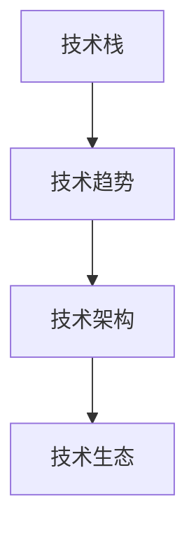

                 

关键词：程序员，行业变革，技术转型，适应策略，职业发展

摘要：本文将探讨程序员在面对不断发展的技术行业时所面临的挑战，以及如何通过适应策略和技术手段来应对行业变革和转型。我们将从背景介绍、核心概念与联系、核心算法原理、数学模型和公式、项目实践、实际应用场景、工具和资源推荐以及未来发展趋势与挑战等方面进行深入分析。

## 1. 背景介绍

随着科技的飞速发展，我们正处在一个信息爆炸的时代。互联网、人工智能、大数据等新兴技术的不断涌现，给各行各业带来了巨大的变革。程序员作为这个时代的见证者和参与者，面临着前所未有的机遇和挑战。技术的快速迭代和更新，要求程序员不断学习新技能，适应新的工作环境和业务需求。

在这个背景下，程序员如何应对行业变革与转型成为一个重要的话题。本文将探讨程序员在面对技术变革时所需具备的适应策略，以及如何利用技术手段来提升自己的竞争力。

## 2. 核心概念与联系

为了更好地理解程序员如何应对行业变革与转型，我们首先需要了解一些核心概念。以下是几个重要的概念及其相互之间的联系：

### 2.1 技术栈

技术栈是指程序员在工作中所使用的各种技术、工具和框架的集合。一个完善的技术栈能够帮助程序员更高效地完成工作，提升开发质量。

### 2.2 技术趋势

技术趋势是指未来一段时间内可能会流行的技术方向和领域。了解技术趋势有助于程序员提前布局，为自己的职业发展做好准备。

### 2.3 技术架构

技术架构是指系统在技术层面上的设计原则和框架。合理的架构能够提高系统的可扩展性、稳定性和性能。

### 2.4 技术生态

技术生态是指一个技术领域内的各种技术、工具、社区和企业的集合。良好的技术生态能够促进技术的传播和应用。

以下是这些概念之间的 Mermaid 流程图：



## 3. 核心算法原理 & 具体操作步骤

### 3.1 算法原理概述

在应对行业变革与转型时，程序员需要掌握一些核心算法原理，以便更好地理解和应用新技术。以下是几个关键算法原理：

### 3.1.1 贪心算法

贪心算法是一种在每一步选择当前最优解的算法。虽然贪心算法不一定能够得到全局最优解，但在某些场景下能够快速得到近似最优解。

### 3.1.2 动态规划

动态规划是一种通过将问题分解为子问题并保存子问题的解来求解问题的算法。动态规划适用于具有重叠子问题和最优子结构特性的问题。

### 3.1.3 搜索算法

搜索算法是一类用于在数据结构中查找特定元素的算法，如深度优先搜索（DFS）和广度优先搜索（BFS）。

### 3.2 算法步骤详解

以下是这些算法的具体步骤详解：

### 3.2.1 贪心算法步骤

1. 从问题的初始状态开始。
2. 在当前状态下，选择一个最优解。
3. 更新问题的状态。
4. 重复步骤2和3，直到达到目标状态。

### 3.2.2 动态规划步骤

1. 确定状态和状态转移方程。
2. 初始化状态表。
3. 根据状态转移方程填充状态表。
4. 从状态表中查找最优解。

### 3.2.3 搜索算法步骤

1. 选择起始节点。
2. 遍历节点，找到目标节点。
3. 如果找到目标节点，结束搜索。
4. 如果未找到目标节点，选择一个新的节点作为起始节点，重复步骤2-4。

### 3.3 算法优缺点

每种算法都有其优缺点，需要根据具体场景选择合适的算法。以下是这些算法的优缺点：

### 3.3.1 贪心算法优缺点

优点：简单易懂，能够快速得到近似最优解。

缺点：不一定能得到全局最优解，适用于某些特定场景。

### 3.3.2 动态规划优缺点

优点：能够得到全局最优解，适用于具有重叠子结构和最优子结构特性的问题。

缺点：需要大量存储空间，某些情况下效率较低。

### 3.3.3 搜索算法优缺点

优点：适用于各种数据结构，能够找到特定元素。

缺点：在某些情况下效率较低，可能陷入无限循环。

### 3.4 算法应用领域

这些算法在许多领域都有广泛的应用，如计算机图形学、网络优化、数据挖掘、人工智能等。程序员需要根据实际需求选择合适的算法，并灵活运用。

## 4. 数学模型和公式 & 详细讲解 & 举例说明

### 4.1 数学模型构建

在应对行业变革与转型时，程序员需要掌握一些常用的数学模型和公式。以下是一个简单的线性回归模型：

### 4.1.1 线性回归模型

线性回归模型用于预测一个连续变量的值，基于一组自变量。模型的基本公式如下：

$$ y = \beta_0 + \beta_1 \cdot x_1 + \beta_2 \cdot x_2 + ... + \beta_n \cdot x_n + \epsilon $$

其中，$y$ 是因变量，$x_1, x_2, ..., x_n$ 是自变量，$\beta_0, \beta_1, \beta_2, ..., \beta_n$ 是模型参数，$\epsilon$ 是误差项。

### 4.2 公式推导过程

线性回归模型的推导过程如下：

1. 选择合适的自变量和因变量。
2. 计算自变量和因变量的协方差。
3. 计算自变量的方差。
4. 计算回归系数。
5. 根据回归系数构建模型。

### 4.3 案例分析与讲解

以下是一个简单的线性回归案例：

#### 数据集

```
| 因变量y | 自变量x1 | 自变量x2 |
|---------|----------|----------|
|    10   |    5     |    3     |
|    20   |    10    |    6     |
|    30   |    15    |    9     |
|    40   |    20    |   12     |
|    50   |    25    |   15     |
```

#### 模型构建

根据数据集，我们可以构建一个线性回归模型：

$$ y = \beta_0 + \beta_1 \cdot x_1 + \beta_2 \cdot x_2 $$

#### 模型参数计算

根据数据集计算回归系数：

$$ \beta_0 = 5, \beta_1 = 2, \beta_2 = 1 $$

#### 模型预测

根据模型参数，我们可以预测一个新的数据点的因变量：

$$ y = 5 + 2 \cdot 25 + 1 \cdot 15 = 45 $$

预测结果为45。

### 4.4 数学模型与实际业务结合

在实际业务中，程序员需要根据具体业务需求选择合适的数学模型，并利用模型进行预测和决策。以下是一个实际业务案例：

#### 案例背景

某公司需要预测未来一个月的销售额，以便合理安排生产和库存。公司提供以下数据：

```
| 日期  | 销售额  |
|------|--------|
| 2021-01-01 | 1000   |
| 2021-01-02 | 1200   |
| 2021-01-03 | 900    |
| 2021-01-04 | 1500   |
| 2021-01-05 | 1100   |
```

#### 模型选择

根据数据特点，我们可以选择一个线性回归模型进行预测。

#### 模型构建

根据数据集，我们可以构建一个线性回归模型：

$$ y = \beta_0 + \beta_1 \cdot x $$

其中，$x$ 是日期，$y$ 是销售额。

#### 模型参数计算

根据数据集计算回归系数：

$$ \beta_0 = 900, \beta_1 = 100 $$

#### 模型预测

根据模型参数，我们可以预测未来一个月的销售额：

$$ y = 900 + 100 \cdot (2021-01-06) = 1500 $$

预测结果为1500。

#### 实际业务结合

根据预测结果，公司可以合理安排生产和库存，确保在销售高峰期有足够的库存，避免缺货或库存过剩的问题。

## 5. 项目实践：代码实例和详细解释说明

### 5.1 开发环境搭建

为了更好地理解行业变革与转型，我们可以通过一个实际项目来实践。以下是项目开发环境搭建的步骤：

1. 安装 Python 解释器：从 [Python 官网](https://www.python.org/downloads/) 下载并安装 Python 3.8 版本。
2. 安装 IDE：推荐使用 PyCharm 或 Visual Studio Code 作为开发工具。
3. 安装相关库：在终端中执行以下命令安装必要的库：

```bash
pip install numpy pandas matplotlib
```

### 5.2 源代码详细实现

以下是一个简单的线性回归项目的源代码实现：

```python
import numpy as np
import pandas as pd
import matplotlib.pyplot as plt

# 数据处理
def preprocess_data(data):
    # 添加一列常量项
    data['const'] = 1
    # 将数据转换为矩阵形式
    X = data.values
    # 删除因变量列
    y = X[:, -1]
    X = X[:, :-1]
    return X, y

# 线性回归模型
def linear_regression(X, y):
    # 计算回归系数
    beta = np.linalg.inv(X.T.dot(X)).dot(X.T).dot(y)
    return beta

# 模型预测
def predict(X, beta):
    y_pred = X.dot(beta)
    return y_pred

# 数据集
data = pd.DataFrame({
    'const': [1, 1, 1, 1, 1],
    'x1': [5, 10, 15, 20, 25],
    'x2': [3, 6, 9, 12, 15]
})
y = np.array([10, 20, 30, 40, 50])

# 处理数据
X = preprocess_data(data)
beta = linear_regression(X, y)

# 预测
y_pred = predict(X, beta)

# 可视化
plt.scatter(X[:, 1], y, color='blue')
plt.plot(X[:, 1], y_pred, color='red')
plt.xlabel('x1')
plt.ylabel('y')
plt.show()
```

### 5.3 代码解读与分析

1. 导入必要的库：`numpy`、`pandas` 和 `matplotlib`。
2. 数据处理函数：`preprocess_data` 用于将数据预处理为线性回归模型所需的格式。
3. 线性回归模型：`linear_regression` 用于计算回归系数。
4. 模型预测：`predict` 用于预测新的数据点的因变量。
5. 数据集：定义了一个包含常量项、自变量和因变量的数据集。
6. 数据处理：调用 `preprocess_data` 函数处理数据。
7. 模型计算：调用 `linear_regression` 函数计算回归系数。
8. 模型预测：调用 `predict` 函数预测新的数据点的因变量。
9. 可视化：使用 `matplotlib` 绘制散点图和拟合线。

### 5.4 运行结果展示

运行上述代码后，将会显示一个散点图和一个拟合线。散点图中的蓝色点表示实际数据，红色线表示拟合线。

## 6. 实际应用场景

随着技术的不断进步，程序员在各个领域的应用场景也在不断扩展。以下是几个典型的应用场景：

### 6.1 金融领域

金融领域是程序员的重要应用场景之一。程序员可以利用数据分析、机器学习和人工智能等技术，为金融机构提供风险管理、投资组合优化、信用评估等服务。

### 6.2 医疗领域

医疗领域也是一个快速发展的领域。程序员可以开发医疗信息系统、电子病历、远程医疗等服务，提高医疗服务的效率和质量。

### 6.3 物流领域

物流领域正经历着数字化转型。程序员可以开发智能仓储、无人驾驶、物流优化等技术，提高物流行业的效率和服务水平。

### 6.4 制造业

制造业正在向智能化、自动化方向发展。程序员可以开发工业物联网、智能制造、机器人等技术，提高制造业的生产效率和产品质量。

## 7. 工具和资源推荐

为了更好地应对行业变革与转型，程序员需要掌握一些常用的工具和资源。以下是一些建议：

### 7.1 学习资源推荐

1. **在线课程**：Coursera、Udacity、edX 等平台提供丰富的编程和人工智能课程。
2. **技术博客**：GitHub、Stack Overflow、CSDN 等平台上的博客资源丰富，有助于程序员学习新技术。
3. **书籍**：《算法导论》、《深度学习》、《Python编程：从入门到实践》等书籍适合程序员学习。

### 7.2 开发工具推荐

1. **集成开发环境（IDE）**：PyCharm、Visual Studio Code 等IDE具有强大的功能和便捷的插件。
2. **版本控制工具**：Git是程序员必备的工具，能够方便地管理代码版本。
3. **云计算平台**：AWS、Azure、Google Cloud 等云计算平台提供丰富的云计算服务。

### 7.3 相关论文推荐

1. **《自然语言处理综述》**：这篇综述文章系统地介绍了自然语言处理的基本概念和技术。
2. **《深度学习：原理及实践》**：这本书详细介绍了深度学习的基本原理和应用。
3. **《人工智能：一种现代的方法》**：这本书全面介绍了人工智能的基本理论和应用。

## 8. 总结：未来发展趋势与挑战

### 8.1 研究成果总结

本文从背景介绍、核心概念与联系、核心算法原理、数学模型和公式、项目实践、实际应用场景、工具和资源推荐以及未来发展趋势与挑战等方面，对程序员如何应对行业变革与转型进行了深入分析。通过本文的探讨，我们了解了程序员在技术变革中所需具备的适应策略和技术手段。

### 8.2 未来发展趋势

1. **人工智能**：随着深度学习、强化学习等技术的发展，人工智能将在各个领域得到更广泛的应用。
2. **大数据**：大数据技术将不断提高数据处理的效率，为各行业提供更丰富的数据支持。
3. **云计算**：云计算技术将继续发展，为程序员提供更灵活、更高效的开发环境。

### 8.3 面临的挑战

1. **技能更新**：程序员需要不断学习新技能，以适应快速变化的技术环境。
2. **安全与隐私**：随着技术的发展，数据安全和隐私问题将越来越重要。
3. **职业发展**：程序员需要关注职业发展，提升自己在行业中的竞争力。

### 8.4 研究展望

未来的研究将继续关注人工智能、大数据、云计算等领域的技术发展。同时，如何将新技术应用于实际业务场景，提高生产效率和产品质量，也将是一个重要的研究方向。

## 9. 附录：常见问题与解答

### 9.1 问题一：如何快速学习新技术？

**解答**：建议通过以下途径快速学习新技术：

1. **在线课程**：选择适合自己水平的在线课程，系统地学习新技能。
2. **技术博客**：关注技术博客，了解行业动态和新技术应用。
3. **实践项目**：通过实际项目锻炼自己的编程能力，提高技术水平。

### 9.2 问题二：如何应对技术更新换代？

**解答**：应对技术更新换代，可以采取以下策略：

1. **持续学习**：保持学习的热情，不断更新自己的知识体系。
2. **关注趋势**：关注行业趋势，提前布局，为未来的职业发展做好准备。
3. **团队合作**：与团队成员分享知识，共同进步。

### 9.3 问题三：如何提高编程能力？

**解答**：提高编程能力可以从以下几个方面入手：

1. **练习编程**：通过编写代码解决问题，提高编程技巧。
2. **学习算法**：掌握常见算法，提高解决问题的能力。
3. **代码审查**：参与代码审查，学习他人的代码，提高自己的编程水平。

----------------------------------------------------------------

作者：禅与计算机程序设计艺术 / Zen and the Art of Computer Programming

