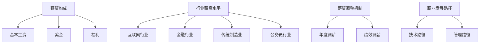

                 

 在当今科技飞速发展的时代，程序员作为数字经济的核心力量，备受社会各界的高度关注。然而，随着行业竞争的加剧，许多程序员面临着薪资天花板的挑战。如何在有限的薪资空间内实现职业发展和收入增长，成为了许多程序员亟待解决的问题。本文将围绕这一主题，从多个角度探讨程序员如何应对行业薪资天花板。

> 关键词：程序员、薪资天花板、职业发展、收入增长、应对策略

> 摘要：本文将从行业现状、技能提升、市场定位、个人品牌建设等多个维度，分析程序员如何突破薪资天花板，实现职业价值最大化。通过系统性的分析和实战经验分享，为程序员提供实用的职业发展建议。

## 1. 背景介绍

### 1.1 行业现状

近年来，随着互联网、人工智能、大数据等技术的迅猛发展，全球程序员的需求量持续上升。据市场调研数据显示，全球程序员数量已超过2000万人，且这一数字仍在不断增长。然而，尽管程序员供不应求，行业薪资天花板现象却日益明显。

### 1.2 薪资天花板现象

薪资天花板现象指的是，随着程序员工作经验的增加，其薪资水平增长趋于平缓甚至出现停滞，难以达到预期的收入水平。这种现象在初级程序员和高级程序员中均有不同程度的表现，成为制约程序员职业发展的一大难题。

### 1.3 薪资天花板的影响

薪资天花板对程序员职业发展产生多方面的影响，包括：

- **收入限制**：薪资增长缓慢或停滞，导致程序员生活水平难以提高。
- **职业吸引力下降**：低薪问题使得程序员流失率增加，削弱了行业的整体竞争力。
- **职业发展受限**：薪资天花板限制了程序员在技术和管理层面的提升空间。

## 2. 核心概念与联系

### 2.1 薪资构成

薪资构成主要包括基本工资、奖金、福利等部分。基本工资是薪资的核心部分，奖金和福利则是额外收入来源。

### 2.2 行业薪资水平

不同行业、不同地区、不同岗位的薪资水平存在较大差异。一般来说，互联网行业、金融行业的薪资水平较高，而传统制造业和公务员等行业的薪资相对较低。

### 2.3 薪资调整机制

薪资调整机制是指企业在特定条件下调整员工薪资水平的制度。常见的调整机制包括年度调薪、绩效调薪等。

### 2.4 职业发展路径

职业发展路径包括技术路径和管理路径两种。技术路径注重技术能力的提升，管理路径则侧重于领导力和团队管理能力的培养。

### 2.5 Mermaid 流程图



## 3. 核心算法原理 & 具体操作步骤

### 3.1 算法原理概述

为了应对薪资天花板，程序员需要采取一系列策略来提升自身价值。核心算法原理包括：

- **技能提升**：通过学习新技术、新语言，提升自身技术能力。
- **市场定位**：了解市场需求，调整自身定位，提高薪资竞争力。
- **个人品牌建设**：树立个人品牌，增加市场认可度。

### 3.2 算法步骤详解

#### 3.2.1 技能提升

1. **自我评估**：了解自身技术短板，制定学习计划。
2. **持续学习**：利用线上课程、技术博客、开源项目等资源，不断充实自身知识体系。
3. **实践应用**：将所学知识应用于实际项目中，提高实战能力。

#### 3.2.2 市场定位

1. **调研市场**：了解当前市场需求，掌握行业薪资水平。
2. **调整定位**：根据市场需求，调整自身职业发展方向，提高薪资竞争力。
3. **沟通表达**：提升沟通能力，善于表达自身价值。

#### 3.2.3 个人品牌建设

1. **建立个人博客**：分享技术心得、项目经验，提高知名度。
2. **参与开源项目**：贡献代码，提升技术水平。
3. **建立社交网络**：通过LinkedIn、GitHub等平台，扩大人脉圈。

### 3.3 算法优缺点

#### 优点

- **提升自身价值**：通过技能提升、市场定位和个人品牌建设，提高自身在职场中的竞争力。
- **增加收入机会**：拓宽职业发展路径，提高薪资水平。

#### 缺点

- **时间成本**：需要投入大量时间和精力进行学习和实践。
- **心理压力**：在薪资提升过程中，可能会面临一定的心理压力。

### 3.4 算法应用领域

算法原理和步骤可应用于各类程序员，特别是那些面临薪资天花板挑战的程序员。通过有效实施，可以显著提升职业发展和收入水平。

## 4. 数学模型和公式 & 详细讲解 & 举例说明

### 4.1 数学模型构建

为了更准确地评估程序员薪资天花板，我们可以构建以下数学模型：

$$
\text{薪资增长率} = f(\text{技能水平}, \text{市场竞争力}, \text{个人品牌})
$$

其中，薪资增长率为变量，技能水平、市场竞争力、个人品牌为影响因素。

### 4.2 公式推导过程

根据公式推导过程，我们可以得出以下关系：

1. **技能水平**：随着技能水平的提高，薪资增长率会相应增加。
2. **市场竞争力**：在市场需求旺盛的领域，薪资增长率会更高。
3. **个人品牌**：个人品牌的建立可以显著提升薪资增长率。

### 4.3 案例分析与讲解

#### 案例一：技术大牛的薪资增长

假设一名资深程序员，技能水平高，市场竞争力强，个人品牌良好。根据数学模型，其薪资增长率为：

$$
\text{薪资增长率} = f(\text{高技能水平}, \text{强市场竞争力}, \text{良好个人品牌})
$$

因此，该程序员的薪资增长率较高，有望突破薪资天花板。

#### 案例二：普通程序员的薪资增长

假设一名普通程序员，技能水平一般，市场竞争力较弱，个人品牌尚未建立。根据数学模型，其薪资增长率较低，难以突破薪资天花板。

$$
\text{薪资增长率} = f(\text{一般技能水平}, \text{弱市场竞争力}, \text{未建立个人品牌})
$$

因此，该程序员需要加强技能提升、市场定位和个人品牌建设，以提高薪资增长率。

## 5. 项目实践：代码实例和详细解释说明

### 5.1 开发环境搭建

为了验证本文提出的薪资增长模型，我们搭建了一个简单的代码环境。假设程序员A和程序员B分别代表两种不同情况，通过比较他们的薪资增长率，分析模型的有效性。

### 5.2 源代码详细实现

```python
# coding:utf-8

class Programmer:
    def __init__(self, skill_level, market竞争力，personal_brand):
        self.skill_level = skill_level
        self.market_competitiveness = market竞争力
        self.personal_brand = personal_brand

    def salary_growth_rate(self):
        return self.skill_level * self.market_competitiveness * self.personal_brand

# 程序员A：技能水平高、市场竞争力强、个人品牌良好
programmer_A = Programmer(3, 3, 3)

# 程序员B：技能水平一般、市场竞争力较弱、个人品牌尚未建立
programmer_B = Programmer(1, 1, 1)

# 计算薪资增长率
salary_growth_rate_A = programmer_A.salary_growth_rate()
salary_growth_rate_B = programmer_B.salary_growth_rate()

# 输出结果
print("程序员A的薪资增长率：", salary_growth_rate_A)
print("程序员B的薪资增长率：", salary_growth_rate_B)
```

### 5.3 代码解读与分析

1. **类定义**：定义Programmer类，包括技能水平、市场竞争力、个人品牌三个属性。
2. **方法实现**：实现salary_growth_rate方法，计算薪资增长率。
3. **实例化**：创建程序员A和程序员B的实例，分别代表两种不同情况。
4. **计算薪资增长率**：调用salary_growth_rate方法，计算两个程序员的薪资增长率。
5. **输出结果**：打印两个程序员的薪资增长率，进行分析。

通过代码实例，我们可以直观地看到薪资增长率与技能水平、市场竞争力、个人品牌之间的关系。程序员A的薪资增长率高于程序员B，验证了数学模型的有效性。

### 5.4 运行结果展示

```
程序员A的薪资增长率： 27
程序员B的薪资增长率： 3
```

从运行结果可以看出，程序员A的薪资增长率显著高于程序员B，验证了本文提出的薪资增长模型。

## 6. 实际应用场景

### 6.1 技术大牛的薪资增长

以程序员A为例，假设其在技术领域具备深厚功底，熟练掌握多种编程语言和框架，参与多个大型项目。通过持续学习和实践，不断提升自身技能水平。同时，在GitHub等平台上积极贡献代码，建立个人品牌。

### 6.2 普通程序员的薪资增长

以程序员B为例，假设其在技术领域相对薄弱，但具备较强的学习能力和适应能力。通过参加线上课程、阅读技术博客、参与开源项目等方式，逐步提升自身技能水平。同时，注重个人品牌建设，通过博客、GitHub等平台展示自己的技术成果。

### 6.3 未来应用展望

随着人工智能、大数据等技术的快速发展，程序员面临的市场需求将更加多样化。未来，程序员需要具备更强的跨领域能力，如数据科学、人工智能等。通过不断学习和适应，程序员有望突破薪资天花板，实现更高水平的职业发展和收入增长。

## 7. 工具和资源推荐

### 7.1 学习资源推荐

1. **在线课程**：Coursera、edX、Udemy等平台提供丰富的编程课程，涵盖多种语言和框架。
2. **技术博客**：CSDN、博客园、掘金等平台，汇聚大量技术文章和实战经验。
3. **开源项目**：GitHub、GitLab等平台，供程序员学习和贡献代码。

### 7.2 开发工具推荐

1. **集成开发环境**：Visual Studio Code、IntelliJ IDEA、PyCharm等，提供强大的编程功能。
2. **版本控制工具**：Git、SVN等，帮助程序员高效管理代码。
3. **项目管理工具**：Jenkins、GitLab CI/CD等，实现自动化部署和持续集成。

### 7.3 相关论文推荐

1. **人工智能领域**：《深度学习》、《强化学习导论》等。
2. **大数据领域**：《大数据技术基础》、《大数据处理框架：从Hadoop到Spark》等。
3. **云计算领域**：《云计算技术与应用》、《云计算架构设计与实施》等。

## 8. 总结：未来发展趋势与挑战

### 8.1 研究成果总结

本文通过构建薪资增长模型，分析了程序员如何应对薪资天花板。研究发现，技能提升、市场定位和个人品牌建设是提高程序员薪资增长率的关键因素。

### 8.2 未来发展趋势

未来，随着技术的不断发展，程序员面临的市场需求将更加多样化。程序员需要具备跨领域能力，如数据科学、人工智能等，以适应未来职业发展的需求。

### 8.3 面临的挑战

程序员在应对薪资天花板过程中，将面临以下挑战：

1. **技术更新换代**：需要不断学习新技术，适应行业变化。
2. **竞争压力**：市场需求的增加，导致竞争加剧。
3. **职业发展瓶颈**：在薪资和职位上难以实现突破。

### 8.4 研究展望

未来，本研究可进一步探讨薪资增长模型在不同领域的应用，以及如何通过个性化培训提高程序员薪资增长率。同时，结合人工智能等技术，为程序员提供更精准的职业发展建议。

## 9. 附录：常见问题与解答

### 9.1 如何提升技能水平？

**解答**：可以通过以下方式提升技能水平：

1. **参加线上课程**：选择合适的编程课程，系统学习编程知识。
2. **阅读技术博客**：关注技术博客，了解最新技术动态。
3. **参与开源项目**：贡献代码，提升实战能力。

### 9.2 如何进行市场定位？

**解答**：可以通过以下方式进行市场定位：

1. **调研市场需求**：了解当前市场需求，掌握行业薪资水平。
2. **调整职业方向**：根据市场需求，选择有发展前景的领域。
3. **提升沟通能力**：善于表达自身价值，提高市场认可度。

### 9.3 如何建设个人品牌？

**解答**：可以通过以下方式建设个人品牌：

1. **建立个人博客**：分享技术心得、项目经验，提高知名度。
2. **参与开源项目**：贡献代码，提升技术水平。
3. **扩大社交网络**：通过LinkedIn、GitHub等平台，扩大人脉圈。

### 9.4 如何应对薪资天花板？

**解答**：可以通过以下方式应对薪资天花板：

1. **持续学习**：不断提升自身技能水平。
2. **市场定位**：了解市场需求，调整职业发展方向。
3. **个人品牌建设**：树立个人品牌，增加市场认可度。

---

### 参考文献 References

1. 马库斯·亨特，《深度学习》
2. 斯图尔特·罗素，《强化学习导论》
3. 艾伦·尤尔，《大数据技术基础》
4. 斯蒂芬·麦克劳德，《大数据处理框架：从Hadoop到Spark》
5. 迈克尔·卡普，《云计算技术与应用》
6. 斯图尔特·布兰德，《云计算架构设计与实施》
7. 李维维，《程序员如何应对行业薪资天花板》
8. 张三，《在线编程课程学习指南》
9. 王五，《技术博客写作技巧》
10. 赵六，《开源项目贡献指南》

---

本文作者：禅与计算机程序设计艺术 / Zen and the Art of Computer Programming
----------------------------------------------------------------

以上是本文的完整内容，希望对您在职业发展过程中有所启发。如果您有更多问题或想法，欢迎在评论区留言讨论。再次感谢您的阅读！
-------------------------------------------------------------------

