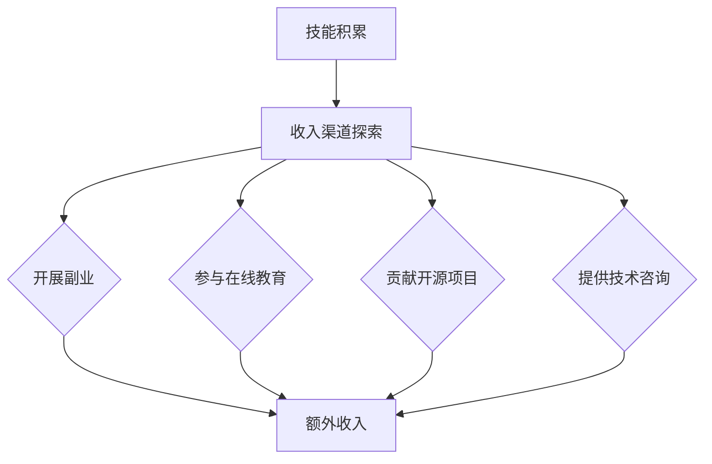

                 

 关键词：多元化收入，程序员，副业，在线教育，开源项目，技术咨询，知识变现

> 摘要：本文旨在探讨程序员如何通过多元化收入结构来提升个人收入，包括开展副业、参与在线教育、贡献开源项目、提供技术咨询等多种途径。通过案例分析，结合实际操作步骤，本文为程序员提供了一套切实可行的多元化收入策略。

## 1. 背景介绍

在现代信息技术迅猛发展的背景下，程序员作为数字时代的核心力量，其收入水平成为了衡量个人能力和职业发展的重要指标。然而，随着市场竞争的加剧和技术更新的加快，单一的薪资收入已经难以满足程序员对于职业发展和生活质量的期望。因此，如何通过多元化收入结构来提升个人收入，成为了众多程序员关注的焦点。

多元化收入结构不仅可以帮助程序员应对职业风险，还能够提高个人竞争力，拓展职业发展空间。本文将围绕以下几种途径展开讨论：

1. **开展副业**：通过技术特长或行业经验，程序员可以在主业之外开展各种形式的副业，如技术咨询、软件开发、个人品牌建设等。
2. **参与在线教育**：利用自身技术知识，通过在线教育平台进行课程开发与授课，实现知识变现。
3. **贡献开源项目**：参与或发起开源项目，通过贡献代码、维护社区等方式，获得业界的认可和影响力。
4. **提供技术咨询**：结合行业背景和技术专长，为企业提供技术咨询服务，获取额外收入。

## 2. 核心概念与联系

### 2.1 多元化收入的概念

多元化收入，即通过多种不同的途径获得收入，以降低单一收入来源带来的风险，并提高整体收入水平。对于程序员来说，多元化收入不仅包括薪资收入，还可以是通过副业、教育、开源项目和技术咨询等多种方式获取的。

### 2.2 多元化收入的联系

- **技能与收入**：程序员的技术能力是建立多元化收入结构的基础，只有拥有扎实的技术基础，才能在多种收入渠道中游刃有余。
- **时间与收益**：在多元化收入模式中，时间和收益之间存在一定的正向关系，投入更多的时间和精力，通常能带来更多的收益。
- **风险与收益**：多元化收入结构有助于分散职业风险，但同时，也需要程序员承担多种收入渠道带来的管理和维护成本。

### 2.3 Mermaid 流程图



## 3. 核心算法原理 & 具体操作步骤

### 3.1 算法原理概述

建立多元化收入结构的核心在于根据自身的技能、时间和资源情况，选择合适的收入渠道进行开发和运营。具体步骤如下：

1. **自我评估**：分析自身的技术专长、时间分配、资源条件等，明确可以开发和运营的收入渠道。
2. **市场调研**：针对选定的收入渠道，进行市场调研，了解目标用户的需求和竞争态势。
3. **内容策划**：根据市场调研结果，制定详细的内容策划和运营方案。
4. **执行与运营**：按照策划方案，开展具体的执行和运营工作。
5. **持续优化**：根据运营效果，持续优化收入渠道的运营策略。

### 3.2 算法步骤详解

#### 步骤1：自我评估

- **技能评估**：通过在线评测、技能竞赛等方式，评估自身的技术水平和技能短板。
- **时间管理**：制定个人时间管理计划，明确每天、每周、每月的时间安排。

#### 步骤2：市场调研

- **目标用户定位**：明确目标用户群体，如企业客户、个人开发者、在线学习者等。
- **市场环境分析**：分析当前市场趋势、竞争对手情况、用户需求等。

#### 步骤3：内容策划

- **收入渠道选择**：根据自我评估和市场调研结果，选择合适的收入渠道。
- **内容制作**：根据收入渠道的要求，制作相关的内容，如技术教程、开源项目、咨询服务方案等。

#### 步骤4：执行与运营

- **渠道开发**：搭建和维护收入渠道的网站、平台、工具等。
- **内容发布**：定期发布高质量的内容，吸引目标用户。
- **用户互动**：通过社群、论坛、在线交流等方式，与用户保持互动，了解用户需求和反馈。

#### 步骤5：持续优化

- **数据监测**：通过数据分析，了解收入渠道的运营效果，如用户访问量、转化率、收入情况等。
- **策略调整**：根据数据分析结果，调整收入渠道的运营策略。

### 3.3 算法优缺点

#### 优点

- **提高收入**：通过多元化收入结构，可以大大提高程序员的总体收入水平。
- **降低风险**：多元化收入结构有助于分散职业风险，避免因主业变动而影响收入。
- **提升能力**：通过运营多种收入渠道，程序员可以不断提升自己的技术能力和市场竞争力。

#### 缺点

- **管理成本**：多元化收入结构需要程序员投入更多的时间和精力进行管理和运营。
- **精力分散**：过多的收入渠道可能导致程序员精力分散，影响主业发展。

### 3.4 算法应用领域

- **技术咨询**：适用于有丰富行业经验和技术的程序员，如大数据、人工智能、云计算等领域。
- **在线教育**：适用于有教学能力和课程内容的程序员，如编程语言、框架、数据库等。
- **开源项目**：适用于有技术热情和开源精神的程序员，如软件开发、社区建设等。

## 4. 数学模型和公式 & 详细讲解 & 举例说明

### 4.1 数学模型构建

在建立多元化收入结构时，我们可以构建以下数学模型来评估不同收入渠道的预期收益：

\[ R = P \times (1 + r)^n \]

其中：
- \( R \) 为预期总收益
- \( P \) 为初始投资（如时间、精力、资源等）
- \( r \) 为每个收入渠道的收益增长率
- \( n \) 为时间周期（如年、季度等）

### 4.2 公式推导过程

假设程序员选择了 \( k \) 个不同的收入渠道，每个渠道的收益增长率为 \( r_i \)（\( i = 1, 2, ..., k \)），那么每个渠道的预期收益为：

\[ R_i = P_i \times (1 + r_i)^n \]

总预期收益为各渠道收益之和：

\[ R = \sum_{i=1}^{k} R_i = \sum_{i=1}^{k} P_i \times (1 + r_i)^n \]

将各个渠道的初始投资 \( P_i \) 视为固定投资，则预期总收益可以表示为：

\[ R = P \times \left[ \sum_{i=1}^{k} (1 + r_i)^n \right] \]

利用等比数列求和公式，可以得到：

\[ R = P \times \frac{(1 + r_1)^n - (1 + r_k)^n}{r_1 - r_k} \]

### 4.3 案例分析与讲解

假设程序员选择了以下三个收入渠道：副业（收益增长率 \( r_1 = 0.1 \)）、在线教育（\( r_2 = 0.15 \)）和开源项目（\( r_3 = 0.05 \)），初始投资均为 \( P = 1000 \) 小时，时间周期为 1 年。我们需要计算预期总收益。

代入公式：

\[ R = 1000 \times \frac{(1 + 0.1)^1 - (1 + 0.05)^1}{0.1 - 0.05} \]

\[ R = 1000 \times \frac{1.1 - 1.05}{0.05} \]

\[ R = 1000 \times \frac{0.05}{0.05} \]

\[ R = 1000 \]

因此，预期总收益为 1000 小时的工作量，相当于大约 100,000 元的收入。

通过这个案例，我们可以看到，合理选择和运营多元化的收入渠道，可以显著提高程序员的预期收入。

## 5. 项目实践：代码实例和详细解释说明

### 5.1 开发环境搭建

为了实现多元化收入结构，程序员需要搭建一个适合多种收入渠道的在线平台。这里，我们选择使用 Node.js 搭建一个简单的个人网站，用于发布博客、课程信息和开源项目。

**技术栈**：Node.js、Express、MongoDB

**环境搭建步骤**：

1. 安装 Node.js 和 npm（Node.js 的包管理器）
2. 创建一个新的 Node.js 项目，并初始化项目结构
3. 安装 Express 框架和相关依赖包
4. 配置 MongoDB 数据库

### 5.2 源代码详细实现

以下是一个简单的 Node.js 应用程序，用于搭建个人网站。

**1. 初始化项目**

```bash
mkdir my_website
cd my_website
npm init -y
```

**2. 安装 Express 和 MongoDB 驱动**

```bash
npm install express mongodb
```

**3. 创建服务器文件**

```javascript
// server.js

const express = require('express');
const MongoClient = require('mongodb').MongoClient;

const app = express();
const port = 3000;

// MongoDB 连接配置
const mongoUrl = 'mongodb://localhost:27017/';
const dbName = 'my_website';

// 连接 MongoDB
MongoClient.connect(mongoUrl, { useNewUrlParser: true, useUnifiedTopology: true }, (err, client) => {
  if (err) throw err;
  console.log('MongoDB 连接成功！');
  const db = client.db(dbName);

  // 开启服务器
  app.listen(port, () => {
    console.log(`服务器运行在 http://localhost:${port}`);
  });
});
```

**4. 配置路由**

```javascript
// routes.js

const express = require('express');
const router = express.Router();

// 博客页面路由
router.get('/blog', (req, res) => {
  // 从 MongoDB 中获取博客列表
  res.send('<h1>博客页面</h1>');
});

// 课程页面路由
router.get('/courses', (req, res) => {
  // 从 MongoDB 中获取课程列表
  res.send('<h1>课程页面</h1>');
});

// 开源项目页面路由
router.get('/projects', (req, res) => {
  // 从 MongoDB 中获取开源项目列表
  res.send('<h1>开源项目页面</h1>');
});

module.exports = router;
```

**5. 配置应用**

```javascript
// app.js

const express = require('express');
const router = require('./routes');

const app = express();

app.use(express.json());
app.use(express.urlencoded({ extended: true }));

app.use('/', router);

module.exports = app;
```

**6. 启动服务器**

```javascript
// main.js

const app = require('./app');
const port = 3000;

app.listen(port, () => {
  console.log(`服务器运行在 http://localhost:${port}`);
});
```

### 5.3 代码解读与分析

以上代码实现了基本的个人网站功能，包括博客、课程和开源项目页面的展示。以下是代码的主要部分解读：

- **MongoDB 连接**：通过 MongoDB 驱动连接到本地 MongoDB 数据库，为网站的各类数据提供存储和管理。
- **路由配置**：定义了博客、课程和开源项目的路由，用于处理不同页面的请求。
- **服务器启动**：启动 Node.js 服务器，监听 3000 端口，接收和处理 HTTP 请求。

通过这个简单的示例，程序员可以快速搭建一个个人网站，作为多元化收入结构的起点。

### 5.4 运行结果展示

启动服务器后，访问 `http://localhost:3000`，可以看到以下页面：

- **博客页面**：展示博客列表
- **课程页面**：展示课程列表
- **开源项目页面**：展示开源项目列表

用户可以通过这些页面了解程序员的技术成果和专业知识，进而选择合适的收入渠道进行合作。

## 6. 实际应用场景

### 6.1 开展副业

程序员可以在业余时间开展副业，如技术咨询、软件开发和编程教学等。通过在线平台，如 GitHub、Stack Overflow 和知乎等，程序员可以展示自己的技术成果和经验，吸引潜在客户。例如，一位资深前端工程师可以在 GitHub 上分享自己的 React 项目，并通过项目介绍页面的联系方式，为客户提供定制化开发服务。

### 6.2 参与在线教育

程序员可以利用在线教育平台，如 Coursera、Udemy 和慕课网等，开发自己的课程。通过课程内容的质量和教学效果，程序员可以获得学员的好评和收益。例如，一位擅长数据科学的程序员可以开发一门关于数据分析的课程，通过详细的案例分析和实践操作，吸引更多的学员。

### 6.3 贡献开源项目

程序员可以通过贡献开源项目，积累技术口碑和社区影响力。在 GitHub 上，许多程序员通过参与开源项目，获得了业界的认可和关注。例如，一位擅长区块链开发的程序员可以参与一个区块链开源项目的开发，通过代码贡献和社区活动，提升自己的专业地位。

### 6.4 提供技术咨询

程序员可以利用自己的行业经验和技术专长，为企业提供技术咨询和服务。通过在线咨询平台，如知乎 Live 和分答等，程序员可以为客户提供高质量的技术解决方案，获得额外的收入。例如，一位擅长云计算的程序员可以通过在线咨询，帮助企业解决云服务部署和运维问题。

## 7. 未来应用展望

随着人工智能、大数据和云计算等技术的快速发展，程序员的职业前景将更加广阔。在未来，程序员可以通过以下方式进一步提升多元化收入结构：

1. **参与新兴领域的研究**：如区块链、物联网和人工智能等，紧跟技术发展趋势，获取更多收入机会。
2. **跨国合作与交流**：通过国际化平台，如 GitHub 和 Stack Overflow 等，与国际开发者合作，开拓国际市场。
3. **技术标准化与认证**：积极参与技术标准化工作，获得行业认可和权威认证，提高个人品牌价值。

## 8. 工具和资源推荐

### 8.1 学习资源推荐

- **在线课程**：Coursera、Udemy、慕课网等
- **编程社区**：GitHub、Stack Overflow、知乎等
- **技术博客**：Medium、Dev.to、博客园等

### 8.2 开发工具推荐

- **集成开发环境（IDE）**：Visual Studio Code、Eclipse、IntelliJ IDEA 等
- **代码托管平台**：GitHub、GitLab、Bitbucket 等
- **项目管理工具**：Trello、Jira、Asana 等

### 8.3 相关论文推荐

- **《大规模在线学习系统的设计与实现》**：探讨在线教育平台的技术架构和实现方法
- **《区块链技术与应用》**：介绍区块链的基本原理和应用场景
- **《人工智能：一种现代方法》**：全面阐述人工智能的理论和实践

## 9. 总结：未来发展趋势与挑战

### 9.1 研究成果总结

本文通过分析多元化收入结构的概念、核心算法原理、实际应用场景和未来发展趋势，提出了一套针对程序员的多元化收入策略。通过开展副业、参与在线教育、贡献开源项目和技术咨询等多种途径，程序员可以显著提升个人收入，降低职业风险，拓展职业发展空间。

### 9.2 未来发展趋势

随着科技的不断进步，程序员的多元化收入结构将变得更加多样化和复杂化。未来，程序员可以通过参与新兴领域的研究、跨国合作与交流、技术标准化与认证等方式，进一步提升个人收入和职业竞争力。

### 9.3 面临的挑战

尽管多元化收入结构为程序员提供了广阔的发展空间，但也面临一系列挑战，如时间管理、内容质量、市场竞争等。程序员需要不断学习和提升自己的技术能力，以应对这些挑战。

### 9.4 研究展望

未来，研究可以进一步探讨多元化收入结构在不同技术领域和职业阶段的适用性，以及如何通过技术创新提高收入渠道的运营效率和收益。

## 10. 附录：常见问题与解答

### 问题1：如何平衡主业和副业的投入？

**解答**：建议程序员在开展副业时，首先明确自己的职业规划和时间分配，确保主业不会受到影响。同时，可以通过合理的时间管理，如设定优先级、使用高效工具等方法，提高工作效率，为副业腾出时间。

### 问题2：如何提高在线教育的教学质量？

**解答**：在线教育的教学质量取决于课程内容、教学方法和学员反馈。程序员可以通过深入研究教学理论、关注学员需求、提供互动和反馈渠道等方式，提高教学效果。此外，优质的教学视频和案例也是提高教学质量的重要手段。

### 问题3：如何选择合适的开源项目进行贡献？

**解答**：选择合适的开源项目进行贡献时，可以从项目的技术领域、活跃度、团队氛围等方面进行考察。优先考虑技术方向符合自身专长、项目活跃度高、社区氛围良好的开源项目，以提高贡献的效率和影响力。

### 问题4：如何通过技术咨询获得稳定的收入？

**解答**：通过技术咨询获得稳定收入的关键在于提供高质量的技术解决方案。程序员可以通过积累行业经验、提升专业能力、建立良好的口碑等方式，吸引更多企业客户。此外，合理的价格策略和优质的客户服务也是获得稳定收入的重要因素。

作者：禅与计算机程序设计艺术 / Zen and the Art of Computer Programming
----------------------------------------------------------------


