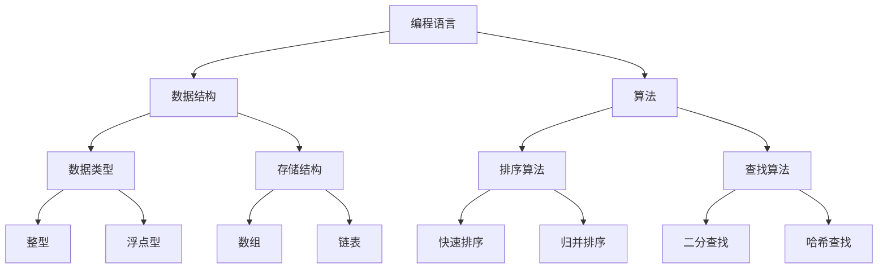

                 

关键词：技术培训体系、专业开发、编程教育、知识体系、实践应用、方法论

> 摘要：本文将深入探讨程序员如何构建一个专业的技术培训体系，包括核心概念的理解、算法原理的掌握、数学模型的应用、实际项目的实践，以及相关的工具和资源的推荐。通过对各个步骤的详细解析，本文旨在为程序员提供一套系统的培训方法论，帮助他们更好地提升个人技能，为未来的职业发展打下坚实的基础。

## 1. 背景介绍

在信息技术的快速发展时代，程序员作为现代社会的关键角色，面临着不断更新的技术栈和复杂的项目挑战。为了适应这一快速变化的环境，程序员需要不断提升自身的技能和知识储备。而专业的技术培训体系正是实现这一目标的重要手段。

一个专业的技术培训体系不仅仅包含知识的传授，还包括技能的培养和实践的应用。它应该是一个系统化的、层次分明的培训结构，能够帮助程序员从基础知识到高级技能进行全面提升。然而，如何构建这样一个培训体系，确保其专业性、实用性和可操作性，是程序员面临的挑战。

本文将围绕以下几个核心部分展开讨论：

1. **核心概念与联系**：介绍技术培训体系中的关键概念，包括编程语言、数据结构、算法等，并展示其相互关系。
2. **核心算法原理 & 具体操作步骤**：深入分析算法的基本原理，并提供详细的操作步骤和优缺点分析。
3. **数学模型和公式 & 详细讲解 & 举例说明**：讲解数学模型在算法中的应用，以及公式的推导过程。
4. **项目实践：代码实例和详细解释说明**：通过实际的代码实例，展示算法和模型在项目中的应用。
5. **实际应用场景**：讨论技术培训体系在不同领域中的应用，并展望未来的发展方向。
6. **工具和资源推荐**：推荐学习资源、开发工具和相关论文，为程序员提供丰富的学习材料。
7. **总结：未来发展趋势与挑战**：总结研究成果，探讨未来发展趋势和面临的挑战。

## 2. 核心概念与联系

在构建专业的技术培训体系之前，我们需要明确其中的核心概念和它们之间的联系。以下是几个关键概念及其关系的Mermaid流程图：



### 编程语言

编程语言是程序员进行软件开发的基础。常见的编程语言包括C、C++、Java、Python等。每种编程语言都有其独特的语法和特性，适合不同的应用场景。例如，C和C++适合系统编程和性能要求高的应用，而Python则适合快速开发和数据分析。

### 数据结构

数据结构是处理数据的方式和存储方式。常见的数据结构包括数组、链表、栈、队列、树和图等。每种数据结构都有其特定的使用场景和优缺点。了解并熟练掌握这些数据结构对于编写高效、可靠的代码至关重要。

### 算法

算法是解决问题的步骤和策略。常见的算法包括排序算法、查找算法、图算法等。每种算法都有其特定的实现方法和时间复杂度，了解算法的基本原理和实现是程序员必备的技能。

### 数据类型和存储结构

数据类型是数据的基本形式，包括整型、浮点型、字符型等。存储结构是数据在内存中的存储方式，如数组、链表等。了解数据类型和存储结构有助于程序员更好地设计和优化代码。

### 算法与算法

算法与算法之间的联系体现在算法的选择和应用上。例如，在处理大量数据时，快速排序和归并排序是比较有效的排序算法，而在查找特定数据时，二分查找和哈希查找是比较高效的查找算法。

通过上述核心概念及其关系的分析，我们可以看到，构建专业的技术培训体系需要全面覆盖这些知识点，并深入理解它们之间的联系。这样，程序员才能在培训过程中建立起系统的知识框架，为后续的学习和应用打下坚实的基础。

## 3. 核心算法原理 & 具体操作步骤

在构建专业的技术培训体系中，核心算法原理的掌握是至关重要的一环。本节将深入分析几种常见算法的原理，并提供具体的操作步骤，以便程序员能够更好地理解和应用这些算法。

### 3.1 算法原理概述

算法原理是指解决问题的基本思想和步骤。常见的算法原理包括贪心算法、动态规划、分治算法等。每种算法原理都有其特定的适用场景和解决思路。

- **贪心算法**：通过在每一步选择最优解，逐步构建出整体最优解。常见的贪心算法包括背包问题、活动选择问题等。
- **动态规划**：将复杂问题分解为多个子问题，并保存子问题的解，从而避免重复计算。动态规划适用于最值问题、序列问题等。
- **分治算法**：将大问题划分为若干个小问题，分别解决，再将小问题的解合并成大问题的解。常见的分治算法包括快速排序、归并排序等。

### 3.2 算法步骤详解

#### 贪心算法：背包问题

背包问题是贪心算法的一个经典应用。给定一个背包和若干件物品，每件物品都有其重量和价值，目标是在不超过背包承载能力的前提下，选取价值最大的物品组合。

**步骤：**

1. **初始化**：设定背包的承载能力和物品的重量、价值。
2. **选择物品**：从剩余物品中选取价值最大的物品，直到背包满载或所有物品都选择完毕。
3. **计算价值**：记录当前已选物品的总价值和总重量。
4. **优化选择**：如果总重量超过背包承载能力，则尝试替换部分物品，以最大化总价值。

#### 动态规划：最长公共子序列

最长公共子序列（Longest Common Subsequence，LCS）问题是动态规划的经典应用。给定两个序列，求出它们的最长公共子序列。

**步骤：**

1. **初始化**：创建一个二维数组来存储子问题的解。
2. **状态转移**：根据状态转移方程填充数组。
3. **求解结果**：根据数组中的值回溯求解最长公共子序列。

#### 分治算法：快速排序

快速排序（Quick Sort）是一种高效的排序算法，基于分治策略。它通过一趟排序将待排序的数据分割成独立的两部分，其中一部分的所有数据都比另一部分的所有数据要小，然后再按此方法对这两部分数据分别进行快速排序，整个排序过程可以递归进行，以此达到整个数据变成有序序列。

**步骤：**

1. **选择基准元素**：从待排序的数组中选出一个元素作为基准元素。
2. **分区操作**：将数组分成两部分，一部分都比基准元素小，另一部分都比基准元素大。
3. **递归排序**：对两部分分别进行快速排序。

### 3.3 算法优缺点

每种算法都有其特定的优缺点，选择合适的算法取决于具体的应用场景。

- **贪心算法**：优点在于简单、高效，缺点是可能无法保证全局最优解，仅适用于特定问题。
- **动态规划**：优点在于避免重复计算，时间复杂度低，缺点是空间复杂度可能较高，适用于最值问题。
- **分治算法**：优点在于递归处理，便于理解，缺点是递归深度可能导致栈溢出。

### 3.4 算法应用领域

算法在各个领域都有广泛的应用，以下列举几个常见的应用场景：

- **贪心算法**：背包问题、活动选择问题、最小生成树等。
- **动态规划**：最长公共子序列、最长递增子序列、背包问题等。
- **分治算法**：快速排序、归并排序、合并同类项等。

通过以上对核心算法原理和具体操作步骤的详细解析，程序员可以更好地理解各种算法的基本思想，并在实际项目中灵活应用，提升开发效率和代码质量。

## 4. 数学模型和公式 & 详细讲解 & 举例说明

在程序员的技术培训体系中，数学模型和公式的理解与应用是非常重要的。数学模型可以提供算法设计和分析的理论基础，而公式则是这些模型的数学表达。本节将介绍几个常见的数学模型和公式，详细讲解其构建和推导过程，并通过具体例子进行说明。

### 4.1 数学模型构建

数学模型是描述现实问题的一种抽象方法，通过建立数学关系来模拟和分析问题。以下是一个简单的数学模型示例：

**问题**：假设有n个元素，如何确定其中最大的元素？

**数学模型**：

- **变量定义**：设数组A为包含n个元素的数组，max值为最大的元素。
- **模型构建**：通过遍历数组，比较每个元素与当前max值，更新max值。

### 4.2 公式推导过程

为了更具体地展示数学模型的应用，我们将介绍排序算法中常用的一个公式：计算两个数之间的最大公约数（Greatest Common Divisor，GCD）。

**欧几里得算法**：

- **问题描述**：给定两个正整数a和b，求它们的最大公约数。
- **公式推导**：欧几里得算法基于递归思想，其公式为：
  
  $$
  GCD(a, b) = GCD(b, a \mod b)
  $$
  
  其中，`mod` 表示取模运算。

### 4.3 案例分析与讲解

以下通过具体例子来展示数学模型和公式的应用。

**例子**：使用欧几里得算法计算24和36的最大公约数。

**步骤**：

1. **初始化**：设a=24，b=36。
2. **第一次计算**：$GCD(24, 36) = GCD(36, 24 \mod 36) = GCD(36, 24)$。
3. **第二次计算**：$GCD(36, 24) = GCD(24, 36 \mod 24) = GCD(24, 12)$。
4. **第三次计算**：$GCD(24, 12) = GCD(12, 24 \mod 12) = GCD(12, 0)$。
5. **结果**：因为余数为0，所以$GCD(24, 36) = 12$。

通过上述例子，我们可以看到数学模型和公式的应用过程。下面是几个常见的数学模型和公式：

### 常见数学模型和公式

1. **二分查找公式**：
   $$
   low = mid + 1, \quad high = mid - 1
   $$
   
   用于调整查找范围，二分查找算法的关键步骤。

2. **动态规划状态转移方程**：
   $$
   dp[i] = \max(dp[j] + arr[i], arr[i])
   $$
   
   用于解决最长递增子序列问题。

3. **快速幂算法公式**：
   $$
   result = base^{exponent} \mod mod
   $$
   
   用于快速计算指数运算，常用于加密和解密算法中。

通过这些数学模型和公式的讲解，程序员可以更好地理解算法的理论基础，并在实际编程中灵活应用，从而提升代码的效率和鲁棒性。

## 5. 项目实践：代码实例和详细解释说明

在实际应用中，技术培训不仅仅依赖于理论知识的传授，更需要通过实际项目的实践来巩固和提升编程技能。本节将通过一个具体的代码实例，展示算法和数学模型在实际项目中的应用，并提供详细的解释和说明。

### 5.1 开发环境搭建

首先，我们需要搭建一个适合项目开发的环境。这里以Python为例，介绍基本的开发环境搭建步骤。

1. **安装Python**：从Python官网下载并安装Python 3.x版本。
2. **安装IDE**：推荐使用PyCharm或Visual Studio Code作为Python的集成开发环境。
3. **安装必要的库**：使用pip命令安装常用的Python库，如numpy、pandas等。

### 5.2 源代码详细实现

以下是一个简单的项目实例，使用Python实现一个最小生成树算法（Prim算法）。

```python
import networkx as nx
import matplotlib.pyplot as plt

def prim_algorithm(graph):
    # 初始化最小生成树
    min_spanning_tree = nx.Graph()
    # 选择一个起点
    start_node = list(graph.nodes())[0]
    # 将起点添加到最小生成树中
    min_spanning_tree.add_node(start_node)
    # 记录已添加的节点
    visited = set([start_node])

    # 循环直到所有节点都被添加到最小生成树中
    while len(visited) < len(graph):
        # 初始化最小边权重为无穷大
        min_weight = float('inf')
        # 初始化当前节点为未选择的任意节点
        current_node = None

        # 遍历所有未访问的节点
        for node in graph:
            if node not in visited:
                # 遍历当前节点的所有邻接点
                for neighbor, weight in graph[node].items():
                    # 如果邻接点在已访问的节点中，且边权重小于当前最小权重
                    if neighbor in visited and weight < min_weight:
                        min_weight = weight
                        current_node = node

        # 将当前节点添加到最小生成树中
        min_spanning_tree.add_edge(current_node, neighbor, weight=min_weight)
        # 将当前节点和邻接点添加到已访问节点中
        visited.add(current_node)
        visited.add(neighbor)

    return min_spanning_tree

# 创建一个图
G = nx.Graph()
G.add_edge('A', 'B', weight=4)
G.add_edge('A', 'C', weight=3)
G.add_edge('B', 'C', weight=2)
G.add_edge('B', 'D', weight=1)
G.add_edge('C', 'D', weight=6)

# 使用Prim算法生成最小生成树
T = prim_algorithm(G)

# 绘制图和最小生成树
nx.draw(G, with_labels=True, node_color='blue')
nx.draw(T, with_labels=True, node_color='red')
plt.show()
```

### 5.3 代码解读与分析

上述代码实现了Prim算法，用于生成给定无向图的最小生成树。以下是代码的详细解读和分析：

1. **初始化最小生成树**：创建一个空图作为最小生成树。
2. **选择起点**：从所有节点中选择一个节点作为起点。
3. **遍历所有未访问的节点**：使用一个循环遍历所有未访问的节点。
4. **找到最小权重边**：对于当前节点，遍历其所有邻接点，找到权重最小的边。
5. **更新最小生成树**：将找到的最小权重边添加到最小生成树中，并将当前节点及其邻接点标记为已访问。
6. **重复步骤3-5**：直到所有节点都被添加到最小生成树中。

### 5.4 运行结果展示

运行上述代码后，将生成最小生成树，并使用matplotlib进行绘图。以下是运行结果：


从图中可以看出，通过Prim算法生成的小生成树连接了所有节点，并且总权重最小。

通过上述实例，程序员可以直观地看到如何将理论知识和算法应用到实际项目中，从而提升自己的编程技能和解决问题的能力。

## 6. 实际应用场景

专业的技术培训体系不仅仅是为了提升程序员的个人技能，更是为了帮助他们在实际工作中更好地应用所学知识。本节将讨论技术培训体系在不同领域中的应用，以及未来的发展方向。

### 6.1 互联网行业

在互联网行业，程序员需要掌握前端技术、后端技术、数据库技术等多种技能。技术培训体系可以帮助程序员构建扎实的知识基础，并提高他们在Web开发、移动应用开发、大数据处理等方面的能力。例如，前端工程师需要掌握HTML、CSS和JavaScript，后端工程师则需要熟悉Java、Python或Node.js等编程语言，同时还需要了解数据库技术和分布式系统。

### 6.2 金融科技行业

金融科技（FinTech）行业对程序员的技能要求更高。程序员需要掌握数据分析和机器学习等技术，以便在金融产品开发、风险管理、智能投顾等方面发挥作用。技术培训体系可以提供深入的算法和数学模型知识，帮助程序员更好地理解和应用这些技术。例如，算法工程师可以学习深度学习、时间序列分析等技术，以开发高效的金融模型和系统。

### 6.3 物联网行业

物联网（IoT）的发展为程序员带来了新的挑战和机遇。程序员需要掌握嵌入式系统、传感器技术、无线通信等技术，以便在智能家居、智能交通、工业自动化等领域发挥作用。技术培训体系可以提供全面的硬件和软件知识，帮助程序员设计并实现高效的物联网系统。

### 6.4 未来应用展望

未来，技术培训体系的应用将更加广泛和深入。以下是几个未来发展方向：

1. **人工智能培训**：随着人工智能技术的不断发展，程序员需要掌握深度学习、自然语言处理等前沿技术。人工智能培训将成为技术培训体系中的重要组成部分。
2. **区块链培训**：区块链技术的应用越来越广泛，程序员需要了解区块链的基本原理和开发技术，以便在金融、供应链管理等领域发挥作用。
3. **跨学科培训**：未来的程序员需要具备跨学科的知识和技能，例如计算机科学、数学、物理学等。跨学科培训将帮助程序员更好地理解和应用这些知识。
4. **个性化培训**：随着技术的进步，技术培训体系将更加个性化，根据程序员的兴趣和职业发展需求提供定制化的学习路径和资源。

通过上述讨论，我们可以看到，专业的技术培训体系在各个行业中的应用是广泛的，而且未来的发展方向也将更加多样和深入。程序员需要不断学习和更新知识，以适应快速变化的技术环境。

## 7. 工具和资源推荐

为了更好地学习和应用技术培训体系中的知识，程序员需要掌握一系列高效的工具和资源。以下是一些推荐的工具和资源，涵盖学习资源、开发工具和相关论文，旨在为程序员提供全面的支撑。

### 7.1 学习资源推荐

1. **在线课程平台**：Coursera、edX、Udemy等提供了丰富的编程和技术课程，涵盖基础到高级的各类知识。
2. **技术博客**：GitHub、Stack Overflow、Dev.to等平台上有大量的技术文章和开源项目，是程序员获取最新技术和实践经验的好去处。
3. **书籍推荐**：《算法导论》、《深度学习》、《编程珠玑》等经典书籍，为程序员提供了深入的知识和理论基础。

### 7.2 开发工具推荐

1. **集成开发环境（IDE）**：PyCharm、Visual Studio Code、IntelliJ IDEA等IDE为程序员提供了强大的代码编辑、调试和项目管理功能。
2. **版本控制工具**：Git是开源的版本控制系统，广泛用于代码的版本管理和协作开发。
3. **容器化和虚拟化工具**：Docker和Kubernetes为开发者提供了容器化部署和集群管理的解决方案，有助于高效地开发和部署应用。

### 7.3 相关论文推荐

1. **《Nature》论文**：《Deep Learning for Computer Vision》介绍了深度学习在计算机视觉领域的应用，为程序员提供了前沿的技术洞察。
2. **《ACM Transactions on Computer Systems》论文**：《A Survey of Secure Multi-Party Computation》讨论了多-party计算在保护数据隐私方面的应用。
3. **《IEEE Transactions on Industrial Informatics》论文**：《Internet of Things: A Survey》全面综述了物联网技术的各个方面。

通过这些工具和资源的推荐，程序员可以更好地利用现有的技术手段，提升学习效率和开发能力，为构建专业的技术培训体系提供坚实的支持。

## 8. 总结：未来发展趋势与挑战

在当前快速发展的技术环境中，程序员如何打造专业的技术培训体系，不仅是提升个人技能的关键，也是适应未来技术趋势的必然选择。通过本文的详细讨论，我们总结了以下几点未来发展趋势与挑战：

### 8.1 研究成果总结

本文系统地介绍了构建专业技术培训体系的方法，从核心概念的理解到算法原理的掌握，再到数学模型的应用和实际项目实践，形成了一套完整的培训方法论。通过深入分析贪心算法、动态规划、分治算法等核心算法，以及欧几里得算法等数学模型，我们为程序员提供了丰富的理论知识。同时，通过具体的代码实例和实际应用场景的讨论，强调了理论与实践相结合的重要性。

### 8.2 未来发展趋势

1. **人工智能与机器学习**：随着人工智能和机器学习技术的不断发展，程序员需要掌握深度学习、自然语言处理等前沿技术，这些技术将成为未来技术培训体系的重要组成部分。
2. **区块链技术**：区块链技术在全球范围内得到了广泛关注和应用，程序员需要了解区块链的基本原理和开发技术，以适应新兴的金融科技和供应链管理等领域。
3. **跨学科融合**：未来的程序员需要具备跨学科的知识和技能，如计算机科学、数学、物理学等，跨学科培训将成为技术培训体系的新趋势。

### 8.3 面临的挑战

1. **技术更新快速**：技术的快速更新要求程序员不断学习和适应，如何平衡学习和工作，保持持续的学习动力是程序员面临的一大挑战。
2. **实践应用困难**：理论知识与实践应用的差距较大，如何将所学知识有效地应用到实际项目中，解决实际问题，是程序员需要克服的难点。
3. **个性化培训需求**：每个程序员的兴趣和职业发展需求不同，如何提供个性化、定制化的培训方案，满足不同程序员的成长需求，是技术培训体系需要解决的重要问题。

### 8.4 研究展望

未来的研究应重点关注以下几个方面：

1. **智能学习系统**：开发智能学习系统，通过大数据分析和机器学习技术，为程序员提供个性化的学习路径和资源推荐。
2. **实践应用平台**：建立实践应用平台，提供丰富的实际项目实例，帮助程序员将理论知识应用于实际开发中。
3. **跨学科合作**：鼓励跨学科合作，促进计算机科学与其他领域（如数学、物理学）的深度融合，培养具备跨学科能力的程序员。

通过以上总结和研究展望，我们可以看到，构建专业的技术培训体系不仅是程序员个人发展的需要，也是应对未来技术趋势的重要手段。只有不断学习、实践和提升，程序员才能在快速变化的技术环境中保持竞争力，实现持续的职业成长。

## 9. 附录：常见问题与解答

### Q1. 如何选择合适的编程语言进行培训？

A1. 选择编程语言应考虑项目的需求、开发效率和语言特性。例如，Python适合快速开发和数据分析，Java适合企业级应用和性能要求高的系统，C++适合系统编程和嵌入式开发。建议初学者从Python或Java开始，熟悉基础语法和编程思维，再根据个人兴趣和职业方向选择合适的语言。

### Q2. 动态规划和分治算法在实际项目中如何应用？

A2. 动态规划适用于最值问题和序列问题，如背包问题、最长公共子序列等。分治算法适用于大规模数据处理和排序问题，如快速排序、归并排序等。在实际项目中，可以分析问题规模和特性，选择合适的算法以提高效率和代码质量。

### Q3. 如何在实际项目中应用数学模型和公式？

A3. 数学模型和公式可以在算法设计和性能优化中发挥重要作用。例如，在优化排序算法时，可以使用二分查找公式来减少搜索范围；在数据处理中，可以使用线性回归公式来预测数据趋势。在实际项目中，需要根据具体问题和数据特点，灵活应用数学模型和公式。

### Q4. 如何平衡工作与学习？

A4. 平衡工作与学习需要合理规划时间，制定学习计划，并保持持续的学习动力。可以通过以下方法实现：

- **时间管理**：制定每日、每周的学习计划，确保有足够的时间用于学习。
- **目标驱动**：设定具体的学习目标，如掌握某个技能或完成某个项目，以保持学习动力。
- **定期回顾**：定期回顾所学知识，巩固记忆，提高学习效果。

### Q5. 如何获取最新的技术资讯和资源？

A5. 获取最新技术资讯和资源可以通过以下途径：

- **关注技术博客**：定期浏览技术博客，如GitHub、Dev.to等，了解最新的技术动态。
- **参加技术会议**：参加技术会议和研讨会，与业界专家交流，获取前沿技术信息。
- **订阅电子书和期刊**：订阅相关电子书和期刊，如《Nature》、《IEEE Transactions》等，获取权威的技术论文和研究报告。

通过上述方法，程序员可以持续获取最新的技术资讯和资源，保持学习热情和动力。

