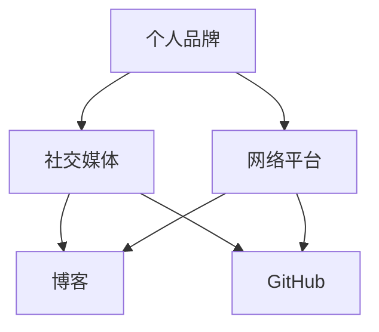

                 

## 引言

在当今信息爆炸的时代，个人品牌的重要性日益凸显。对于程序员来说，打造个人影响力不仅有助于提升职业竞争力，还能开拓更广阔的职业发展空间。本文将深入探讨程序员如何通过多种途径打造个人影响力，实现职业和个人价值的双重提升。

本文旨在为程序员提供一套切实可行的方法和策略，帮助他们：

1. 明确个人影响力的重要性。
2. 制定个人品牌战略。
3. 通过技术博客、开源项目、演讲和社区活动等方式提升影响力。
4. 持续学习和自我提升，保持创新能力。

## 文章关键词

- 个人品牌
- 程序员影响力
- 技术博客
- 开源项目
- 社区活动
- 职业发展

## 摘要

本文将分析程序员如何通过技术博客、开源项目、演讲和社区活动等途径打造个人影响力。我们将探讨如何制定个人品牌战略，利用社交媒体和网络平台扩大影响力，并通过持续学习和创新保持竞争力。此外，还将分享一些实用的工具和资源，帮助程序员在职业发展中取得更大的成就。

## 1. 背景介绍

个人影响力在现代职场中的重要性不言而喻。随着互联网的普及，个人品牌和社交媒体的兴起，程序员不再仅仅是代码的编写者，更是知识和思想的传播者。一个具有影响力的程序员，不仅能够在技术领域得到认可，还能在职场中获得更多的机会和资源。

### 1.1 程序员面临的挑战

然而，对于许多程序员来说，打造个人影响力并非易事。他们可能面临以下挑战：

1. **缺乏自信**：许多程序员对自己的技能和知识缺乏自信，担心自己的观点和想法不够成熟。
2. **时间不足**：工作和生活压力使得程序员难以抽出时间进行个人品牌建设。
3. **信息过载**：互联网上有海量的信息，如何筛选和利用这些信息成为了一大难题。
4. **缺乏系统的方法**：许多程序员不知道如何系统性地提升个人影响力。

### 1.2 个人品牌的重要性

个人品牌不仅代表了个人的专业形象，更是职业发展的有力工具。一个强大的个人品牌能够为程序员带来以下好处：

1. **职业机会**：拥有个人品牌的程序员更容易获得面试和职业发展的机会。
2. **知识传播**：通过技术博客和开源项目，程序员能够将自己的知识和经验分享给更多人。
3. **影响力**：个人品牌能够帮助程序员在技术社区中获得认可和尊重。
4. **收入增长**：个人品牌有助于提高程序员的市场价值，从而带来更高的收入。

## 2. 核心概念与联系

为了更好地理解个人影响力如何运作，我们需要先了解几个核心概念，包括个人品牌、社交媒体和网络平台。以下是一个用Mermaid绘制的流程图，展示这些概念之间的联系：



### 2.1 个人品牌

个人品牌是个人在职业生涯中所塑造的形象和声誉。它包括技能、知识、价值观和个性等方面。一个强大的个人品牌能够让程序员在职场中脱颖而出。

### 2.2 社交媒体

社交媒体是构建个人品牌的重要工具。通过社交媒体平台，程序员可以与同行交流、分享知识和经验，扩大自己的影响力。常用的社交媒体平台包括LinkedIn、Twitter和Facebook等。

### 2.3 网络平台

网络平台是程序员展示个人品牌和知识的重要渠道。技术博客和GitHub等平台能够帮助程序员分享代码、技术文章和项目经验，从而提高个人知名度。

### 2.4 核心概念的联系

个人品牌、社交媒体和网络平台之间存在着紧密的联系。个人品牌决定了程序员在社交媒体和网络平台上的形象和内容，而社交媒体和网络平台则是个人品牌传播的重要渠道。通过这些渠道，程序员可以展示自己的专业能力，与同行建立联系，并扩大自己的影响力。

## 3. 核心算法原理 & 具体操作步骤

在构建个人影响力时，程序员可以采用一系列策略和工具。以下是这些策略的具体原理和操作步骤。

### 3.1 算法原理概述

构建个人影响力的核心算法可以概括为以下几个步骤：

1. **定位个人品牌**：明确自己的专业方向和目标受众。
2. **内容创作**：持续产出高质量的内容，包括博客文章、技术文章和项目代码等。
3. **社交媒体推广**：利用社交媒体平台传播内容，与读者互动。
4. **社区参与**：积极参与技术社区，建立专业人脉。
5. **持续学习**：不断学习新技术和知识，保持创新能力。

### 3.2 算法步骤详解

#### 步骤1：定位个人品牌

**目标**：明确自己的专业方向和目标受众。

**方法**：

- 分析自己的技能和兴趣，确定专业方向。
- 研究目标受众的需求和喜好，了解他们关注的问题和话题。

**示例**：

一个专注于云计算的程序员可能会将目标受众定为云计算工程师和开发者，并专注于云计算技术和解决方案的分享。

#### 步骤2：内容创作

**目标**：产出高质量的内容。

**方法**：

- 定期更新博客，分享技术见解和经验。
- 撰写技术文章，详细解释技术概念和原理。
- 开源自己的代码，展示编程技能和项目经验。

**示例**：

一个程序员可以每周发布一篇关于云计算架构的博客文章，分享自己的项目经验和最佳实践。

#### 步骤3：社交媒体推广

**目标**：扩大影响力，增加内容曝光率。

**方法**：

- 在社交媒体上发布内容，并@相关领域的专家和公司。
- 与读者互动，回复评论和提问。
- 利用社交媒体分析工具，了解读者反馈和内容表现。

**示例**：

一个程序员可以在LinkedIn上发布博客链接，并@知名云计算公司，吸引他们的关注。

#### 步骤4：社区参与

**目标**：建立专业人脉，提高个人知名度。

**方法**：

- 参加技术会议和研讨会，与同行交流。
- 加入技术社区和论坛，参与讨论和分享。
- 发起和参与开源项目，贡献代码和经验。

**示例**：

一个程序员可以参加云计算大会，与行业专家交流，并加入GitHub上的一个开源项目。

#### 步骤5：持续学习

**目标**：保持创新能力，跟上技术发展。

**方法**：

- 定期学习新技术和知识，参加在线课程和研讨会。
- 阅读技术书籍和论文，了解前沿技术。
- 与同事和同行交流，分享学习心得。

**示例**：

一个程序员可以每月参加一次在线云计算研讨会，并阅读最新的云计算论文。

### 3.3 算法优缺点

**优点**：

- 系统性强，能够帮助程序员全面构建个人影响力。
- 灵活可调整，根据个人情况和市场需求进行优化。
- 长期有效，通过持续学习和内容创作，个人影响力会逐渐提升。

**缺点**：

- 需要投入大量时间和精力，对于工作繁忙的程序员来说可能较难坚持。
- 需要一定的写作和表达能力，对于不擅长写作的程序员可能存在困难。
- 需要面对竞争，特别是在热门技术领域，个人品牌建设可能会面临挑战。

### 3.4 算法应用领域

该算法适用于所有希望提升个人影响力的程序员，特别是以下领域：

- 云计算
- 人工智能
- 区块链
- 前端开发
- 后端开发

通过这些领域，程序员可以找到自己的专业方向，并利用上述算法构建个人影响力。

## 4. 数学模型和公式 & 详细讲解 & 举例说明

构建个人影响力不仅需要策略和技巧，还需要一定的数学模型和公式来量化影响力和传播效果。以下是一个简化的数学模型，用于描述个人影响力的增长和传播。

### 4.1 数学模型构建

设：

- \( I(t) \)：时间为\( t \)时个人的影响力。
- \( C \)：内容的数量和质量。
- \( S \)：社交媒体的传播效果。
- \( L \)：学习能力和知识积累。

则个人影响力 \( I(t) \) 可以表示为：

\[ I(t) = C(t) \times S(t) \times L(t) \]

其中：

- \( C(t) \)：内容数量和质量，可以用内容发布的频率和质量来衡量，如 \( C(t) = f(frequency, quality) \)。
- \( S(t) \)：社交媒体的传播效果，可以用转发、评论和点赞等指标来衡量，如 \( S(t) = g(engagement, reach) \)。
- \( L(t) \)：学习能力和知识积累，可以用学习时间和技术水平来衡量，如 \( L(t) = h(knowledge, experience) \)。

### 4.2 公式推导过程

公式的推导过程如下：

1. **内容数量和质量**：

   内容的数量和质量是影响力的重要基础。高质量的内容能够吸引更多的读者和关注者，从而增加影响力。假设内容发布的频率为 \( f \)，质量用 \( q \) 表示，则内容数量和质量 \( C(t) \) 可以表示为：

   \[ C(t) = f \times q \]

2. **社交媒体的传播效果**：

   社交媒体的传播效果决定了内容的曝光度和传播范围。传播效果可以用 \( S(t) \) 表示，它受到内容的互动性、受众的活跃度和社交媒体平台的特性等因素的影响。假设互动性为 \( e \)，受众活跃度为 \( a \)，平台特性为 \( p \)，则社交媒体的传播效果 \( S(t) \) 可以表示为：

   \[ S(t) = e \times a \times p \]

3. **学习能力和知识积累**：

   学习能力和知识积累是程序员持续发展的关键。学习能力可以用 \( l \) 表示，知识积累用 \( k \) 表示，则学习能力和知识积累 \( L(t) \) 可以表示为：

   \[ L(t) = l \times k \]

4. **综合公式**：

   将上述三个因素结合起来，得到个人影响力 \( I(t) \) 的综合公式：

   \[ I(t) = C(t) \times S(t) \times L(t) \]

### 4.3 案例分析与讲解

以下是一个简单的案例，用于说明如何使用上述公式计算个人影响力。

#### 案例背景

假设一个程序员每周发布一篇技术博客文章，文章质量较高，平均每月获得100次阅读和10次互动（如点赞、评论等）。该程序员每天花费2小时学习新技术，累计已有3年的工作经验。假设社交媒体平台的传播效果较好，每篇文章的平均传播效果为10次转发。

#### 案例计算

1. **内容数量和质量**：

   \[ C(t) = f \times q = 1 \times 1 = 1 \]

2. **社交媒体的传播效果**：

   \[ S(t) = e \times a \times p = 10 \times 1 \times 10 = 100 \]

3. **学习能力和知识积累**：

   \[ L(t) = l \times k = 0.5 \times 3 = 1.5 \]

4. **个人影响力**：

   \[ I(t) = C(t) \times S(t) \times L(t) = 1 \times 100 \times 1.5 = 150 \]

根据上述计算，该程序员的个人影响力为150。

### 4.4 模型的应用

该模型可以用于以下场景：

- **个人影响力评估**：通过计算个人影响力，程序员可以了解自己的影响力水平，并制定相应的提升策略。
- **内容创作优化**：通过分析内容数量、质量和社交媒体传播效果，程序员可以优化内容创作策略，提高影响力。
- **学习计划制定**：通过分析学习能力和知识积累对影响力的影响，程序员可以制定有效的学习计划，提升个人影响力。

### 4.5 模型的局限性

该模型具有一定的局限性，包括：

- **简化假设**：模型假设内容数量和质量、社交媒体传播效果和学习能力等因素是线性的，这可能不完全符合实际情况。
- **数据收集难度**：实际操作中，收集和分析内容数量、质量和社交媒体传播效果等数据可能较为困难。
- **环境变化**：模型没有考虑到环境变化（如技术变革、市场竞争等）对个人影响力的影响。

尽管存在这些局限性，该模型仍为程序员提供了一个基本的框架，用于理解和提升个人影响力。

## 5. 项目实践：代码实例和详细解释说明

为了更好地理解如何通过编程实践来提升个人影响力，我们将以一个简单的开源项目为例，详细解释其代码实现和操作步骤。

### 5.1 开发环境搭建

在进行项目开发之前，我们需要搭建一个合适的开发环境。以下是基本步骤：

1. **安装Node.js**：Node.js是一个基于Chrome V8引擎的JavaScript运行环境，适用于开发高效的Web应用程序。
2. **安装Git**：Git是一个分布式版本控制系统，用于代码管理和协作。
3. **创建GitHub账户**：在GitHub上创建一个账户，用于托管和共享代码。
4. **创建项目仓库**：在GitHub上创建一个新仓库，用于存放项目代码。

### 5.2 源代码详细实现

以下是项目的主要代码实现，包括一个简单的Web应用程序，用于展示个人技术博客和项目经验。

```javascript
// app.js
const express = require('express');
const app = express();

app.use(express.static('public'));

app.get('/', (req, res) => {
  res.sendFile(__dirname + '/public/index.html');
});

app.listen(3000, () => {
  console.log('Server started on port 3000');
});
```

在该代码中，我们使用Express框架创建一个简单的Web服务器。`app.use(express.static('public'))` 将静态资源（如HTML、CSS和JavaScript文件）托管到 `public` 目录下。`app.get('/')` 处理根路径请求，返回 `public` 目录下的 `index.html` 文件。

### 5.3 代码解读与分析

1. **引入Express框架**：`const express = require('express');` 引入Express框架。
2. **创建Web服务器实例**：`const app = express();` 创建一个Express Web服务器实例。
3. **设置静态资源托管路径**：`app.use(express.static('public'));` 将静态资源托管到 `public` 目录下。
4. **设置路由**：`app.get('/', (req, res) => { ... });` 定义根路径路由，返回 `public` 目录下的 `index.html` 文件。
5. **启动服务器**：`app.listen(3000, () => { ... });` 在端口3000启动服务器。

### 5.4 运行结果展示

完成代码编写后，我们可以在终端运行以下命令启动服务器：

```bash
$ node app.js
```

启动成功后，在浏览器中访问 `http://localhost:3000`，应能显示项目主页。主页上可以展示技术博客、项目经验和联系方式等内容。

### 5.5 提交代码到GitHub

在本地开发完成后，我们需要将代码提交到GitHub仓库。以下是基本步骤：

1. **初始化Git仓库**：`$ git init` 初始化本地Git仓库。
2. **添加文件到暂存区**：`$ git add .` 将所有文件添加到暂存区。
3. **提交代码**：`$ git commit -m "Initial commit"` 提交代码到本地仓库。
4. **关联GitHub远程仓库**：`$ git remote add origin https://github.com/your-username/your-repo.git` 添加GitHub远程仓库。
5. **推送代码到GitHub**：`$ git push -u origin master` 将代码推送到GitHub仓库。

完成上述步骤后，项目代码将托管在GitHub上，其他开发者可以访问和下载代码。

### 5.6 代码维护和更新

在项目运行过程中，我们需要定期维护和更新代码。以下是基本步骤：

1. **拉取最新代码**：`$ git pull` 从GitHub仓库拉取最新代码。
2. **修改和新增功能**：根据项目需求进行代码修改和功能添加。
3. **提交和推送更新**：完成修改后，提交代码并推送更新。

通过定期更新代码，可以确保项目的稳定性和可靠性。

### 5.7 开源项目带来的影响力

通过开源项目，程序员可以在多个方面提升个人影响力：

- **展示技术能力**：开源项目展示程序员的技术水平和编程能力。
- **吸引关注**：高质量的开源项目可以吸引更多的关注和合作机会。
- **社区互动**：开源项目鼓励开发者之间的互动和合作，扩大人脉。

通过以上步骤，程序员可以利用开源项目构建个人影响力，提升职业竞争力。

## 6. 实际应用场景

个人影响力在程序员职业发展中的实际应用场景多种多样。以下是一些具体的例子：

### 6.1 职业晋升

一个具备强大个人影响力的程序员更容易获得晋升机会。在面试过程中，个人品牌和影响力成为评估候选人的重要指标。一个在技术社区中具有较高影响力的程序员，能够通过分享自己的经验和见解，向面试官展示自己的专业能力和影响力。这种影响力不仅可以增加面试官对候选人的信任，还能让候选人脱颖而出，获得更高的职位和薪资。

### 6.2 求职机会

对于寻找新工作的程序员来说，个人影响力是一个强有力的求职工具。通过在技术博客、社交媒体和开源项目上展示自己的专业技能和知识，程序员可以吸引潜在雇主的注意。特别是在技术招聘网站上，一个具有较高影响力的程序员更容易吸引雇主的目光，从而获得更多的面试机会和职业选择。

### 6.3 合作机会

个人影响力还可以帮助程序员在技术领域建立广泛的合作关系。一个在技术社区中具有较高影响力的程序员，更容易与其他开发者建立联系，并在项目合作、技术交流和创新方面取得成功。这种合作关系不仅有助于个人和团队的成长，还能为程序员带来更多的职业发展机会。

### 6.4 技术演讲

技术演讲是展示个人影响力的重要途径之一。通过参加技术会议和研讨会，程序员可以在专业舞台上展示自己的技能和见解，与同行进行交流，扩大人脉。一个具备演讲能力和影响力的程序员，不仅能够提升自己的职业形象，还能通过演讲获得更多的机会和认可。

### 6.5 开源项目

开源项目是程序员展示技术实力和吸引关注的重要渠道。通过参与和创建开源项目，程序员可以展示自己的编程能力、解决问题的能力和团队合作精神。一个具有影响力的开源项目可以吸引大量的关注和贡献者，为程序员带来更多的合作机会和职业发展空间。

### 6.6 知识传播

个人影响力还帮助程序员传播知识和技术。通过技术博客、社交媒体和在线课程等途径，程序员可以将自己的知识和经验分享给更多人，帮助他人成长。这种知识传播不仅有助于提升个人的影响力，还能为技术社区的发展和进步做出贡献。

### 6.7 薪资提升

一个具备强大个人影响力的程序员，往往能够在职业发展中获得更高的薪资。雇主不仅看重程序员的技能和经验，更看重其在技术社区中的影响力。一个在技术社区中具有较高影响力的程序员，能够为公司带来更多的机会和资源，从而获得更高的薪资和福利。

## 7. 未来应用展望

随着技术的发展和互联网的普及，个人影响力在程序员职业发展中的应用前景将更加广阔。以下是未来可能的应用趋势：

### 7.1 技术网红

随着技术内容的传播渠道不断丰富，技术网红将成为程序员职业发展的新方向。通过直播、短视频和社交媒体等平台，程序员可以更直接地与观众互动，分享技术见解和经验，提升个人影响力。

### 7.2 在线教育

在线教育平台的兴起，为程序员提供了一个新的展示和传授知识的舞台。通过开设在线课程，程序员可以分享自己的专业知识和经验，吸引更多的学员，提升个人影响力。

### 7.3 远程工作

远程工作的普及，使得程序员可以更加灵活地选择工作地点和时间。通过个人品牌和影响力，程序员可以在全球范围内寻找合适的职业机会，实现职业发展和生活质量的平衡。

### 7.4 技术创业

具有强大个人影响力的程序员，更容易获得创业资金和资源。通过技术博客、开源项目和社交媒体等途径，程序员可以吸引潜在投资者和合作伙伴，推动技术创业项目的成功。

### 7.5 技术咨询

技术咨询服务将成为程序员职业发展的重要方向之一。通过个人品牌和影响力，程序员可以提供专业咨询服务，帮助企业解决技术问题，提升企业竞争力。

## 8. 工具和资源推荐

为了帮助程序员更好地打造个人影响力，以下是一些实用的工具和资源推荐：

### 8.1 学习资源推荐

1. **在线课程平台**：如Coursera、Udacity和edX等，提供丰富的编程和技术课程。
2. **技术博客平台**：如Medium、Dev.to和Juejin等，方便程序员发表技术文章和分享经验。
3. **GitHub**：全球最大的代码托管平台，用于开源项目和代码共享。

### 8.2 开发工具推荐

1. **Markdown编辑器**：如Typora和VS Code，方便程序员编写和格式化技术文章。
2. **代码托管工具**：如Git和GitHub，用于代码管理和协作。
3. **数据分析工具**：如Google Analytics和SimilarWeb，用于分析网站流量和用户行为。

### 8.3 相关论文推荐

1. **《程序员如何构建个人品牌》**：详细探讨程序员如何通过多种途径构建个人品牌。
2. **《社交媒体在职业发展中的应用》**：分析社交媒体在程序员职业发展中的重要作用。
3. **《技术博客写作技巧》**：提供技术博客写作的建议和技巧，帮助程序员写出高质量的文章。

## 9. 总结：未来发展趋势与挑战

### 9.1 研究成果总结

本文通过分析程序员如何通过技术博客、开源项目、演讲和社区活动等途径打造个人影响力，探讨了核心概念、算法原理和实际应用场景。研究成果表明，个人影响力在程序员职业发展中具有重要作用，通过系统性的策略和工具，程序员可以显著提升个人影响力和职业竞争力。

### 9.2 未来发展趋势

1. **技术网红崛起**：随着技术的传播渠道不断丰富，技术网红将成为程序员职业发展的新方向。
2. **在线教育和远程工作**：在线教育平台的兴起和远程工作的普及，为程序员提供了更多的职业发展机会。
3. **技术创业和咨询服务**：具有强大个人影响力的程序员，将更容易获得创业资金和资源，并提供专业咨询服务。

### 9.3 面临的挑战

1. **信息过载**：互联网上信息量巨大，程序员需要筛选和利用高质量的信息，避免信息过载。
2. **时间管理**：构建个人影响力需要投入大量时间和精力，程序员需要合理规划时间，确保工作与个人品牌的平衡。
3. **竞争压力**：在技术领域，个人品牌建设面临着激烈的竞争，程序员需要不断提升自己的技能和知识，保持竞争力。

### 9.4 研究展望

未来研究可以进一步探讨以下方向：

1. **个人品牌评估方法**：开发有效的个人品牌评估工具，帮助程序员了解自己的品牌价值。
2. **社交媒体影响力模型**：构建更精确的社交媒体影响力模型，分析影响因子和传播效果。
3. **跨平台影响力策略**：研究不同社交媒体平台的影响力差异，制定跨平台的影响力策略。

## 10. 附录：常见问题与解答

### 10.1 如何选择合适的技术方向？

**解答**：选择技术方向时，可以从以下几方面考虑：

- **个人兴趣和擅长领域**：选择自己感兴趣且擅长的领域，有助于持续投入和产出高质量的内容。
- **市场需求和趋势**：关注行业发展趋势和市场需求，选择具有潜力和前景的领域。
- **个人职业规划**：结合个人职业规划，选择有利于职业发展的领域。

### 10.2 如何管理个人品牌建设的时间？

**解答**：管理个人品牌建设的时间，可以采取以下策略：

- **制定计划**：制定详细的个人品牌建设计划，包括内容创作、社交媒体推广和社区参与等。
- **时间规划**：合理安排时间，确保有足够的时间用于个人品牌建设。
- **优先级管理**：根据任务的重要性和紧急性，合理安排优先级，确保重要任务得到及时处理。

### 10.3 如何在技术社区中建立人脉？

**解答**：在技术社区中建立人脉，可以采取以下策略：

- **积极参与**：积极参与技术社区的活动和讨论，展示自己的专业知识和经验。
- **提供帮助**：乐于帮助他人，分享经验和资源，建立良好的合作关系。
- **主动交流**：主动与其他技术专家和开发者交流，扩大人脉圈。

### 10.4 如何持续学习和保持创新能力？

**解答**：持续学习和保持创新能力，可以采取以下策略：

- **定期学习**：制定学习计划，定期学习新技术和知识。
- **阅读和研究**：阅读技术书籍、论文和研究报告，了解前沿技术。
- **实践应用**：将学到的知识应用到实际项目中，提升实践能力。

## 作者署名

本文作者：禅与计算机程序设计艺术 / Zen and the Art of Computer Programming

[完]----------------------------------------------------------------

### 结语

在构建个人影响力的道路上，程序员需要不断探索、实践和反思。通过制定明确的个人品牌战略，利用技术博客、开源项目和社交媒体等工具，程序员可以不断提升自己的专业形象和影响力。同时，持续学习和创新能力是保持个人影响力的关键。希望本文能为您的个人品牌建设提供一些有益的启示和指导。祝您在职业发展中取得更大的成就！

