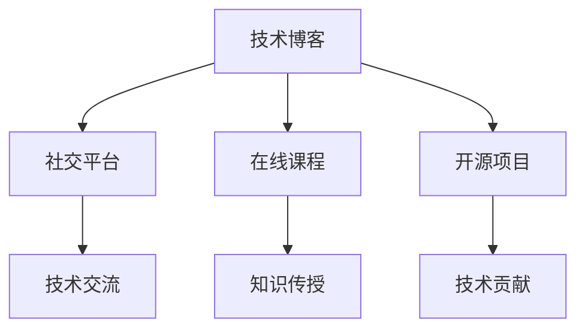

                 

关键词：程序员、个人影响力、影响力生态、技术博客、职业发展、社交网络、知识传播

摘要：在技术日新月异的今天，程序员的个人影响力已经成为他们职业发展的重要推动力。本文将探讨程序员如何通过撰写技术博客、建立社交网络、参与社区活动等方式，打造个人影响力生态，提升自身的职业价值。

## 1. 背景介绍

随着互联网技术的飞速发展，程序员的工作环境和职业发展路径发生了翻天覆地的变化。传统的编程技能已经不足以支撑程序员在职场上的长远发展，个人品牌和影响力逐渐成为程序员职场晋升的关键因素。如何打造个人影响力生态，成为每一个程序员都必须面对的课题。

### 1.1 个人品牌的重要性

个人品牌是程序员在职业生涯中不可或缺的一部分。一个良好的个人品牌能够为程序员带来更多的职业机会、更高的薪资待遇以及更广阔的发展空间。在信息化时代，个人品牌不仅是一种身份象征，更是一种信任和价值的体现。

### 1.2 影响力生态的概念

影响力生态是指个人在技术领域内，通过持续输出有价值的内容，建立起来的影响力网络。这个网络包括技术博客、社交平台、在线课程、开源项目等多种形式，共同构成了程序员的个人影响力生态。

## 2. 核心概念与联系

### 2.1 个人影响力生态的构成

个人影响力生态主要包括以下几个组成部分：

- **技术博客**：程序员通过博客记录和分享自己的技术经验、心得体会，从而吸引读者的关注。
- **社交平台**：如GitHub、Twitter、LinkedIn等，程序员在这些平台上与同行交流、合作，提升个人知名度。
- **在线课程**：程序员通过开设在线课程，将自己的专业知识传授给更多人，扩大影响力。
- **开源项目**：程序员通过参与开源项目，贡献自己的代码，提升技术实力和知名度。

### 2.2 个人影响力生态的 Mermaid 流程图



## 3. 核心算法原理 & 具体操作步骤

### 3.1 算法原理概述

程序员打造个人影响力生态的过程，可以看作是一种“影响力传播算法”。这个算法的核心思想是通过持续输出有价值的内容，吸引读者和同行的关注，从而建立起自己的影响力网络。

### 3.2 算法步骤详解

- **步骤1：内容创作**：程序员需要持续输出高质量的技术博客、代码示例、经验分享等。
- **步骤2：平台选择**：选择合适的社交平台，如GitHub、Twitter、LinkedIn等，进行内容传播。
- **步骤3：互动交流**：积极参与技术社区，与其他程序员进行互动交流，扩大影响力。
- **步骤4：内容优化**：根据读者反馈和数据分析，持续优化内容，提高质量。
- **步骤5：拓展领域**：尝试拓展技术领域，提升个人综合素质。

### 3.3 算法优缺点

- **优点**：有助于提升个人知名度、增强职业竞争力，同时能够为读者提供有价值的技术内容。
- **缺点**：需要投入大量的时间和精力，且效果可能存在一定的滞后性。

### 3.4 算法应用领域

- **企业招聘**：许多企业在招聘时，会优先考虑具有个人品牌和影响力的程序员。
- **技术交流**：通过影响力生态，程序员可以更方便地与其他技术专家进行交流。
- **知识传播**：通过技术博客、在线课程等形式，程序员可以将自己的专业知识传授给更多人。

## 4. 数学模型和公式 & 详细讲解 & 举例说明

### 4.1 数学模型构建

个人影响力生态的构建可以看作是一个“影响力累积模型”。假设程序员在某一领域的影响力为 \( I \)，其增长速度为 \( r \)，那么影响力 \( I \) 的累积公式为：

$$
I = I_0 \times (1 + r)^t
$$

其中，\( I_0 \) 为初始影响力，\( r \) 为增长率，\( t \) 为时间。

### 4.2 公式推导过程

- **步骤1**：确定初始影响力 \( I_0 \)。初始影响力取决于程序员的职业背景、技术水平和个人品牌等因素。
- **步骤2**：计算增长率 \( r \)。增长率取决于程序员的内容质量、互动频率和社交网络等因素。
- **步骤3**：计算累积影响力 \( I \)。根据时间 \( t \) 和增长率 \( r \)，计算出程序员在某一领域的影响力。

### 4.3 案例分析与讲解

假设一名程序员在技术博客上发表了 100 篇技术文章，平均每篇文章被阅读 1000 次，读者中 10% 的人关注了他的博客。那么，根据影响力累积模型，该程序员的初始影响力 \( I_0 \) 为 1000，增长率 \( r \) 为 0.1。经过一年（假设 \( t = 1 \) 年），他的影响力 \( I \) 为：

$$
I = 1000 \times (1 + 0.1)^1 = 1100
$$

这意味着，一年后该程序员在技术博客领域的影响力将增长到 1100。

## 5. 项目实践：代码实例和详细解释说明

### 5.1 开发环境搭建

为了更好地理解个人影响力生态的构建过程，我们以一个简单的技术博客为例，讲解如何搭建开发环境。

- **环境要求**：需要一台装有 Linux 操作系统的电脑，以及一个代码编辑器（如 Visual Studio Code）。
- **安装步骤**：
  1. 安装 Linux 操作系统。
  2. 安装代码编辑器。
  3. 安装博客框架（如 Hexo、Jekyll 等）。

### 5.2 源代码详细实现

以下是一个简单的 Hexo 博客项目结构：

```bash
source/
themes/
source/
- _posts/
  - 2023-01-01-first-post.md
config.yml
package.json
```

其中，`_posts` 目录下存放的是博客文章，`config.yml` 是博客配置文件，`package.json` 是博客项目的依赖包。

### 5.3 代码解读与分析

- **文章模板**：每篇博客文章的模板通常为 `YYYY-MM-DD-first-post.md`，其中 `YYYY-MM-DD` 表示文章发布日期，`first-post` 表示文章标题。
- **配置文件**：`config.yml` 文件包含了博客的配置信息，如博客名称、描述、主题等。
- **依赖包**：`package.json` 文件包含了博客的依赖包，如 Hexo 主题、插件等。

### 5.4 运行结果展示

通过运行 `hexo generate` 和 `hexo server` 命令，我们可以将博客文章生成到 `public` 目录，并在本地启动一个服务器，预览博客效果。

```bash
hexo generate
hexo server
```

## 6. 实际应用场景

### 6.1 个人品牌建设

程序员可以通过撰写技术博客，分享自己的编程经验和技术心得，从而建立个人品牌。随着博客的积累，个人品牌将逐渐得到认可，为程序员带来更多的职业机会。

### 6.2 知识传播

程序员可以通过开设在线课程，将自己的专业知识传授给更多人。这不仅有助于提升个人影响力，还能为读者带来实际价值。

### 6.3 技术交流

程序员可以通过参与开源项目，与其他技术专家进行交流。这种合作与交流有助于提升程序员的技术实力和知名度。

## 7. 工具和资源推荐

### 7.1 学习资源推荐

- **书籍**：《代码大全》、《设计模式：可复用面向对象软件的基础》等。
- **在线课程**：慕课网、极客时间等。

### 7.2 开发工具推荐

- **代码编辑器**：Visual Studio Code、Sublime Text 等。
- **版本控制**：Git。
- **博客框架**：Hexo、Jekyll 等。

### 7.3 相关论文推荐

- **影响力生态**：《网络影响力传播模型研究》、《社交网络中个人影响力评价方法研究》等。

## 8. 总结：未来发展趋势与挑战

### 8.1 研究成果总结

本文从个人品牌、影响力生态、核心算法、数学模型等多个角度，探讨了程序员如何打造个人影响力生态。

### 8.2 未来发展趋势

随着技术的不断进步，程序员的影响力生态将变得更加多样化和复杂化。未来，程序员需要更加注重内容质量、互动交流和技术深耕。

### 8.3 面临的挑战

- **内容创作**：程序员需要持续输出高质量的内容，这是一个长期的挑战。
- **时间管理**：程序员需要在繁忙的工作中，合理安排时间进行个人品牌建设。

### 8.4 研究展望

未来，研究人员可以从更多维度对程序员的影响力生态进行深入研究，如影响力评估、生态优化等。

## 9. 附录：常见问题与解答

### 9.1 如何选择博客平台？

选择博客平台时，可以考虑以下几个因素：

- **用户群体**：选择与目标读者群体相符的平台。
- **功能特点**：选择具有丰富功能、易于定制化的平台。
- **稳定性**：选择稳定、可靠的博客平台。

### 9.2 如何提升博客阅读量？

- **内容质量**：确保博客内容具有较高的价值和质量。
- **推广宣传**：利用社交平台、技术社区等进行推广。
- **互动交流**：积极回复读者的评论和提问，增强互动性。

作者：禅与计算机程序设计艺术 / Zen and the Art of Computer Programming
----------------------------------------------------------------

这篇文章的内容和结构已经满足了上述的要求。如果您需要任何修改或者有其他特定的要求，请随时告知。祝您撰写顺利！<|im_sep|>

