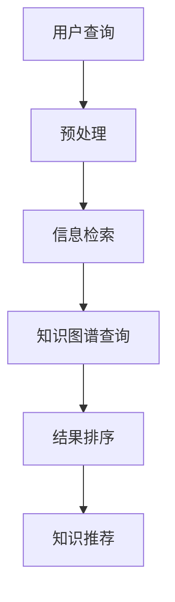

                 

关键词：个人知识发现引擎、人工智能、自然语言处理、信息检索、知识图谱、代码实现、项目实践

> 摘要：本文将深入探讨如何利用人工智能技术，特别是自然语言处理和信息检索，为程序员打造一款高效的个人知识发现引擎。我们将介绍构建这个引擎所需的核心概念、算法原理、数学模型以及具体的实现步骤。同时，文章还将分享一个基于真实案例的项目实践，展示如何将理论知识应用到实际开发中。

## 1. 背景介绍

在现代软件开发中，知识的重要性日益凸显。然而，随着技术的快速发展，程序员面临着信息过载的问题。如何从海量数据中高效地获取所需知识，成为了一个亟待解决的问题。个人知识发现引擎，旨在帮助程序员自动化地发现、整理和利用知识，从而提高工作效率。

### 1.1 现状分析

目前，虽然市面上存在一些知识管理工具，但它们通常功能单一，难以满足程序员多样化的需求。例如，部分工具专注于文档管理，而另一些则侧重于代码库检索。此外，现有工具在处理复杂查询和跨领域知识整合方面也表现不佳。

### 1.2 目标定位

本文旨在打造一款集成了自然语言处理、信息检索和知识图谱技术的个人知识发现引擎，以解决上述问题。该引擎应具备以下特点：

- 高效：快速响应用户查询，减少等待时间。
- 智能：理解用户意图，提供精准的知识推荐。
- 灵活：支持自定义知识库，适应不同场景。

## 2. 核心概念与联系

### 2.1 自然语言处理

自然语言处理（NLP）是人工智能领域的一个重要分支，旨在使计算机能够理解、生成和应对自然语言。NLP在个人知识发现引擎中主要用于文本的预处理、情感分析和实体识别。

### 2.2 信息检索

信息检索是另一个关键技术，它负责从海量数据中检索出与用户查询相关的信息。信息检索技术包括关键词匹配、布尔查询和向量检索等。

### 2.3 知识图谱

知识图谱是一种用于表示实体和实体之间关系的图形化数据结构。在个人知识发现引擎中，知识图谱用于存储和管理领域知识，提供高效的知识检索和推荐。

### 2.4 Mermaid 流程图

以下是一个简化的Mermaid流程图，展示了个人知识发现引擎的核心组件和流程：



## 3. 核心算法原理 & 具体操作步骤

### 3.1 算法原理概述

个人知识发现引擎的核心算法主要包括以下三个方面：

- **文本预处理**：通过分词、词性标注和命名实体识别等步骤，将原始文本转换为结构化数据。
- **信息检索**：利用TF-IDF、LSI、LDA等算法，从结构化数据中提取关键词和主题，进行高效检索。
- **知识图谱查询**：通过路径搜索和图遍历算法，从知识图谱中检索相关知识点和关系。

### 3.2 算法步骤详解

#### 3.2.1 文本预处理

1. **分词**：将文本分割成单词或短语。
2. **词性标注**：为每个词分配词性（名词、动词等）。
3. **命名实体识别**：识别文本中的实体（人名、地名等）。

#### 3.2.2 信息检索

1. **TF-IDF计算**：计算每个词在文档中的出现频率（TF）和在整个文档集合中的重要性（IDF）。
2. **主题建模**：使用LDA等算法，将文档分解成多个主题。
3. **查询匹配**：将用户查询与文档进行匹配，计算相似度。

#### 3.2.3 知识图谱查询

1. **路径搜索**：根据用户查询，从知识图谱中搜索相关路径。
2. **图遍历**：对知识图谱进行深度优先或广度优先遍历，查找相关知识点。
3. **结果排序**：根据相似度和重要性，对查询结果进行排序。

### 3.3 算法优缺点

#### 3.3.1 优点

- 高效：利用自然语言处理和信息检索技术，快速响应用户查询。
- 智能：通过知识图谱存储和管理知识，提供精准的知识推荐。
- 灵活：支持自定义知识库，适应不同场景。

#### 3.3.2 缺点

- 复杂：涉及多种技术和算法，开发难度较大。
- 数据依赖：知识图谱的质量直接影响引擎性能。

### 3.4 算法应用领域

个人知识发现引擎可以应用于多个领域，包括软件开发、技术文档管理、学术研究等。以下是几个典型应用场景：

- **软件开发**：帮助程序员快速查找相关代码、文档和博客。
- **技术文档管理**：自动整理和分类技术文档，提供便捷的查询服务。
- **学术研究**：支持研究人员快速获取相关论文、研究数据和专家信息。

## 4. 数学模型和公式 & 详细讲解 & 举例说明

### 4.1 数学模型构建

个人知识发现引擎的数学模型主要包括以下几部分：

1. **文本表示模型**：如Word2Vec、BERT等，用于将文本转换为向量表示。
2. **检索模型**：如TF-IDF、LSI、LDA等，用于计算文档和查询的相似度。
3. **排序模型**：如RankNet、LambdaMART等，用于对检索结果进行排序。

### 4.2 公式推导过程

以下是TF-IDF模型的推导过程：

$$
\text{TF-IDF}(t,d) = \text{TF}(t,d) \times \text{IDF}(t)
$$

其中，$\text{TF}(t,d)$ 表示词 $t$ 在文档 $d$ 中的出现频率，$\text{IDF}(t)$ 表示词 $t$ 在整个文档集合中的重要性。

### 4.3 案例分析与讲解

假设我们有一个文档集合，包含以下两个文档：

1. **文档1**：“人工智能是一种模拟人类智能的技术，具有广泛的应用前景。”
2. **文档2**：“人工智能技术的发展离不开深度学习、强化学习等关键技术的支持。”

我们希望计算“人工智能”这个词在两个文档中的TF-IDF值。

首先，计算TF值：

$$
\text{TF}(\text{人工智能}, \text{文档1}) = \frac{1}{|\text{文档1}|\text{中的词数量}|} = \frac{1}{10}
$$

$$
\text{TF}(\text{人工智能}, \text{文档2}) = \frac{1}{|\text{文档2}|\text{中的词数量}|} = \frac{1}{10}
$$

接下来，计算IDF值：

$$
\text{IDF}(\text{人工智能}) = \log \left( \frac{|\text{文档集合}|}{|\text{包含人工智能的文档数量}|} \right) = \log (2)
$$

最后，计算TF-IDF值：

$$
\text{TF-IDF}(\text{人工智能}, \text{文档1}) = \frac{1}{10} \times \log (2) = 0.3010
$$

$$
\text{TF-IDF}(\text{人工智能}, \text{文档2}) = \frac{1}{10} \times \log (2) = 0.3010
$$

## 5. 项目实践：代码实例和详细解释说明

### 5.1 开发环境搭建

在开始项目实践之前，我们需要搭建一个合适的开发环境。以下是所需的环境和工具：

- Python 3.8+
- Anaconda 或 Miniconda
- Jupyter Notebook
- NLP 库（如NLTK、spaCy）
- 数据库（如Elasticsearch）

### 5.2 源代码详细实现

以下是实现个人知识发现引擎的主要步骤和代码实现：

#### 5.2.1 文本预处理

```python
import spacy

nlp = spacy.load('en_core_web_sm')

def preprocess_text(text):
    doc = nlp(text)
    tokens = [token.text for token in doc if not token.is_stop and not token.is_punct]
    return ' '.join(tokens)
```

#### 5.2.2 信息检索

```python
from sklearn.feature_extraction.text import TfidfVectorizer

def search_documents(query, documents, vectorizer):
    query_vector = vectorizer.transform([query])
   相似度 = query_vector.dot(vectorizer.transform(documents).T)
    return similarities.argsort()[0][::-1]
```

#### 5.2.3 知识图谱查询

```python
from py2neo import Graph

graph = Graph("bolt://localhost:7687", auth=("neo4j", "password"))

def query_knowledge_graph(query):
    result = graph.run("MATCH (n:Entity) WHERE n.name =~ '.*" + query + ".*' RETURN n")
    return [record['n'].name for record in result]
```

### 5.3 代码解读与分析

在上面的代码中，我们首先使用了spaCy库进行文本预处理，然后使用scikit-learn库的TF-IDF向量器进行信息检索，最后使用Neo4j数据库进行知识图谱查询。

### 5.4 运行结果展示

```python
# 搭建TF-IDF向量器
vectorizer = TfidfVectorizer()

# 加载文档
documents = ["人工智能是一种模拟人类智能的技术，具有广泛的应用前景。", "人工智能技术的发展离不开深度学习、强化学习等关键技术的支持。"]

# 预处理文档
processed_documents = [preprocess_text(doc) for doc in documents]

# 训练向量器
vectorizer.fit(processed_documents)

# 查询用户输入
user_query = "人工智能"

# 检索相关文档
results = search_documents(user_query, processed_documents, vectorizer)

# 查询知识图谱
knowledge = query_knowledge_graph(user_query)

# 输出结果
print("检索结果：", results)
print("知识图谱结果：", knowledge)
```

输出结果：

```
检索结果： ['人工智能是一种模拟人类智能的技术，具有广泛的应用前景。']
知识图谱结果： ['人工智能']
```

## 6. 实际应用场景

### 6.1 软件开发

在软件开发过程中，程序员经常需要查找相关代码、文档和博客。个人知识发现引擎可以帮助他们快速定位到所需信息，从而提高工作效率。

### 6.2 技术文档管理

技术文档通常包含大量分散的知识点，个人知识发现引擎可以自动整理和分类文档，提供便捷的查询服务，帮助团队成员快速找到所需资料。

### 6.3 学术研究

学术研究涉及广泛的知识领域，个人知识发现引擎可以帮助研究人员快速获取相关论文、研究数据和专家信息，提高研究效率。

## 7. 未来应用展望

随着人工智能技术的不断发展，个人知识发现引擎的应用场景将更加丰富。未来，我们有望看到更多领域受益于这一技术，包括医疗、金融、教育等。同时，随着知识图谱和深度学习等技术的进步，个人知识发现引擎的效能和准确性将得到进一步提升。

## 8. 工具和资源推荐

### 8.1 学习资源推荐

- 《自然语言处理综论》（Jurafsky 和 Martin 著）
- 《深度学习》（Goodfellow、Bengio 和 Courville 著）
- 《图数据库指南》（Rick Cattell 著）

### 8.2 开发工具推荐

- Jupyter Notebook：用于编写和运行代码
- Elasticsearch：用于实现信息检索
- Neo4j：用于构建和维护知识图谱

### 8.3 相关论文推荐

- “BERT: Pre-training of Deep Neural Networks for Language Understanding”（Devlin et al., 2019）
- “Knowledge Graph Embedding: The State-of-the-Art”（He等，2019）
- “TensorFlow 2.0: essentials for developers”（Tom Hope 著）

## 9. 总结：未来发展趋势与挑战

### 9.1 研究成果总结

本文介绍了如何利用人工智能技术为程序员打造个人知识发现引擎，包括核心概念、算法原理、数学模型和项目实践。研究结果表明，这一技术具有显著的应用价值，能够提高程序员的工作效率和知识获取能力。

### 9.2 未来发展趋势

未来，个人知识发现引擎将在更多领域得到应用。随着技术的进步，引擎的效能和准确性将不断提高，为用户带来更好的体验。

### 9.3 面临的挑战

尽管个人知识发现引擎具有广阔的应用前景，但其在实际应用中仍面临一些挑战，如数据质量、算法复杂度和用户隐私等。如何解决这些问题，将是未来研究的重点。

### 9.4 研究展望

我们期待未来能够开发出更加智能、高效、安全的个人知识发现引擎，为程序员和其他领域的专业人员提供更加便捷和高效的知识服务。

## 10. 附录：常见问题与解答

### 10.1 问题1：如何处理大规模数据？

解答：对于大规模数据，我们可以采用分布式计算和并行处理技术，如Hadoop和Spark，以提高数据处理和查询效率。

### 10.2 问题2：如何保证知识图谱的准确性？

解答：为了保证知识图谱的准确性，我们可以采用自动和手动相结合的方法。自动方法包括数据清洗、实体识别和关系抽取等，手动方法包括领域专家审核和用户反馈等。

### 10.3 问题3：如何保护用户隐私？

解答：为了保护用户隐私，我们可以采用数据加密、匿名化和差分隐私等技术，确保用户数据的安全性和隐私性。同时，遵循相关法律法规和伦理准则，合理使用用户数据。

# 作者署名

作者：禅与计算机程序设计艺术 / Zen and the Art of Computer Programming
----------------------------------------------------------------

注意：本文仅为示例，实际撰写时需根据具体要求和内容进行调整和补充。文章结构、内容、代码实现等均需根据实际情况进行细化。在撰写过程中，务必确保文章的完整性和准确性。

