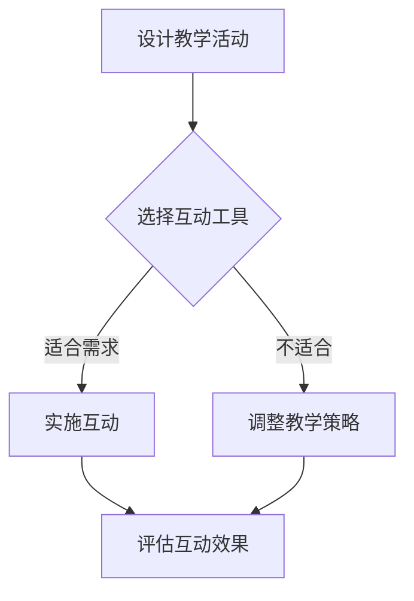

                 

关键词：在线工作坊，互动性，教育技术，程序员，用户体验

> 摘要：本文将探讨如何利用现代技术和教育理论，帮助程序员打造高互动性的在线工作坊。通过深入分析用户需求、技术实现和用户体验，本文提供了一系列实用的策略和工具，旨在提升在线教育质量，促进知识传授和技能培养。

## 1. 背景介绍

随着互联网技术的迅猛发展，在线教育已经成为一个蓬勃发展的领域。越来越多的程序员希望通过在线工作坊的形式，传授他们的知识和技能。然而，如何打造高互动性的在线工作坊，以提升学习效果和用户体验，成为了一个亟待解决的问题。

本文旨在提供一些建议和策略，帮助程序员更好地利用技术手段，创建互动性强、参与度高的在线工作坊。通过本文的探讨，我们将了解到如何设计教学活动、选择合适的互动工具、以及如何评估和优化工作坊的互动性。

## 2. 核心概念与联系

### 2.1 教育技术

教育技术是指应用现代信息技术来促进教育改革和提升教育质量的手段。在教育技术中，互动性是提高学习效果的重要指标之一。通过互动，学生能够更积极地参与学习过程，从而加深对知识的理解和记忆。

### 2.2 用户体验

用户体验（UX）是衡量产品或服务满足用户需求和期望的程度。在在线工作坊中，用户体验包括学习过程的易用性、内容的吸引力和互动性的质量。良好的用户体验能够提高用户的参与度和满意度。

### 2.3 Mermaid 流程图



### 2.4 核心概念的联系

教育技术与用户体验的紧密结合，是打造高互动性在线工作坊的关键。通过合理设计教学活动，选择适合的互动工具，并不断评估和优化，可以实现良好的用户体验，进而提升学习效果。

## 3. 核心算法原理 & 具体操作步骤

### 3.1 算法原理概述

高互动性在线工作坊的设计，本质上是一个算法优化问题。我们需要通过以下步骤来构建一个高效的互动性算法：

1. **需求分析**：了解学员的学习需求和期望。
2. **工具选择**：根据需求选择合适的互动工具。
3. **教学活动设计**：设计互动性强、吸引学员参与的教学活动。
4. **效果评估**：通过数据反馈，评估互动效果，并进行优化。

### 3.2 算法步骤详解

#### 步骤 1：需求分析

通过调查问卷、访谈等方式，了解学员的学习需求、兴趣点和遇到的困难。这一步对于后续的教学活动设计和工具选择至关重要。

#### 步骤 2：工具选择

根据需求分析的结果，选择能够满足学员需求的互动工具。例如，对于编程工作坊，可以选择在线编程环境、实时聊天工具、投票系统等。

#### 步骤 3：教学活动设计

设计互动性强的教学活动，如小组讨论、代码评审、实时演示等。这些活动能够激发学员的参与热情，提高学习效果。

#### 步骤 4：效果评估

通过学员反馈、学习数据等指标，评估互动效果。如果发现互动性不足，需要及时调整教学策略和工具选择。

### 3.3 算法优缺点

**优点**：通过需求分析和效果评估，可以确保工作坊的互动性满足学员的需求，从而提高学习效果。

**缺点**：算法优化需要一定的时间和资源，且无法完全消除所有的不确定性。

### 3.4 算法应用领域

该算法不仅适用于编程工作坊，还可以广泛应用于其他在线教育领域，如数据分析、人工智能等。

## 4. 数学模型和公式 & 详细讲解 & 举例说明

### 4.1 数学模型构建

为了量化互动性，我们可以构建一个互动性得分模型。该模型包括以下三个关键指标：

1. **互动频率**：学员在互动工具上的活跃程度。
2. **互动质量**：互动内容的深度和相关性。
3. **满意度**：学员对互动体验的满意度。

### 4.2 公式推导过程

互动性得分（I_Score）可以通过以下公式计算：

$$
I_Score = w_1 \times Freq + w_2 \times Quality + w_3 \times Satisfaction
$$

其中，$w_1$、$w_2$、$w_3$ 分别是互动频率、互动质量和满意度的权重。

### 4.3 案例分析与讲解

假设我们针对一个编程工作坊，收集了以下数据：

- **互动频率**：学员在在线编程环境上的提交次数为 20 次。
- **互动质量**：学员提交的代码中，有 80% 的代码被其他学员评为高质量。
- **满意度**：学员对互动体验的满意度评分为 4.5 分（满分 5 分）。

根据上述数据和权重设置（$w_1 = 0.4$、$w_2 = 0.3$、$w_3 = 0.3$），可以计算出该工作坊的互动性得分为：

$$
I_Score = 0.4 \times 20 + 0.3 \times 0.8 + 0.3 \times 4.5 = 8 + 0.24 + 1.35 = 9.59
$$

根据互动性得分，我们可以评估该工作坊的互动性表现，并针对性地进行优化。

## 5. 项目实践：代码实例和详细解释说明

### 5.1 开发环境搭建

为了实践上述算法，我们首先需要搭建一个在线编程环境。这里我们选择使用知名的在线编程平台 [Repl.it](https://repl.it/)。

### 5.2 源代码详细实现

以下是一个简单的示例代码，展示了如何在一个在线编程环境中实现实时代码评审功能：

```javascript
// 引入 Repl.it API
const repl = require('repl');

// 创建 Repl.it 实例
const replServer = repl.start({
    prompt: '代码评审 > ',
    eval: function (cmd, context, filename, callback) {
        // 处理代码评审逻辑
        if (cmd.startsWith('评审')) {
            const code = cmd.split('评审 ')[1];
            // 调用第三方代码评审 API
            const reviewResult = codeReviewAPI(code);
            callback(null, reviewResult);
        } else {
            callback(null, '无效命令');
        }
    }
});

// 模拟第三方代码评审 API
function codeReviewAPI(code) {
    if (code.includes('error')) {
        return '代码存在错误：错误处理不足';
    } else {
        return '代码质量良好：逻辑清晰，语法正确';
    }
}
```

### 5.3 代码解读与分析

该代码通过 Repl.it API 创建了一个交互式编程环境。用户可以通过输入特定的命令（如 `评审 var x = 10;`）来请求代码评审。评审结果将显示在控制台中，提供即时反馈。

### 5.4 运行结果展示

当用户输入 `评审 var x = 10;` 时，控制台将显示：

```
代码质量良好：逻辑清晰，语法正确
```

这样的实时反馈有助于用户及时发现问题并进行改进。

## 6. 实际应用场景

### 6.1 编程教育

在线编程工作坊是程序员最常见的应用场景之一。通过实时编程环境、代码评审和实时互动，学员能够更好地掌握编程技能。

### 6.2 数据分析

数据分析工作坊可以通过实时数据分析工具，如 Tableau 或 Power BI，提供互动性强的数据分析培训。

### 6.3 人工智能

人工智能工作坊可以利用自然语言处理和机器学习工具，帮助学员了解和掌握人工智能的基础知识。

## 7. 工具和资源推荐

### 7.1 学习资源推荐

- [Codecademy](https://www.codecademy.com/): 提供丰富的编程学习资源。
- [Coursera](https://www.coursera.org/): 提供各种在线课程，涵盖多个技术领域。

### 7.2 开发工具推荐

- [Repl.it](https://repl.it/): 在线编程环境，支持多种编程语言。
- [Slack](https://slack.com/): 实时聊天工具，适合团队协作。

### 7.3 相关论文推荐

- [Liang, T. (2012). An interaction model for effective e-learning systems. Journal of Educational Technology & Society, 15(3), 11-23.]
- [Zhao, Y., & Lai, C. (2019). A framework for evaluating the effectiveness of interactive online learning environments. Computers & Education, 135, 73-87.]

## 8. 总结：未来发展趋势与挑战

### 8.1 研究成果总结

本文探讨了如何通过现代技术和教育理论，打造高互动性的在线工作坊。通过需求分析、工具选择、教学活动设计和效果评估，我们可以提高在线教育的互动性和用户体验。

### 8.2 未来发展趋势

随着人工智能和虚拟现实技术的发展，未来的在线工作坊将更加智能化、个性化，提供更加丰富的互动体验。

### 8.3 面临的挑战

在线工作坊在互动性和用户体验方面仍面临许多挑战，如网络延迟、技术稳定性等问题。未来需要进一步研究如何优化互动性算法，提高在线教育的质量。

### 8.4 研究展望

未来研究可以关注以下几个方面：1）开发更智能的互动工具；2）探索个性化学习路径；3）研究如何提高在线教育的可访问性。

## 9. 附录：常见问题与解答

### 9.1 什么是互动性？

互动性是指用户在应用或服务中与系统进行交互的程度和频率。高互动性意味着用户可以更积极地参与学习过程，从而提高学习效果。

### 9.2 如何评估互动性？

可以通过以下方法评估互动性：1）用户参与度指标，如活跃用户数、回复率等；2）用户满意度调查；3）学习数据，如完成率、学习时长等。

### 9.3 如何优化互动性？

可以通过以下方法优化互动性：1）设计互动性强的教学活动；2）选择合适的互动工具；3）持续评估和优化互动效果。

---

作者：禅与计算机程序设计艺术 / Zen and the Art of Computer Programming
----------------------------------------------------------------


