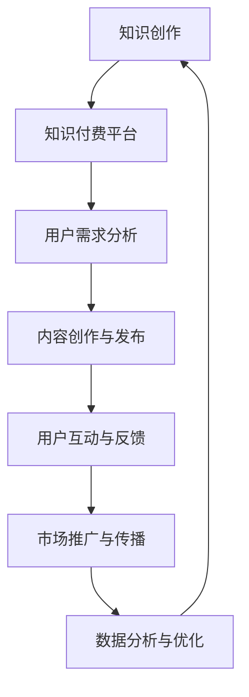

                 

  
## 1. 背景介绍

在互联网时代，知识的传播方式发生了巨大的变化。传统上，知识传播依赖于权威机构和教育资源，但随着互联网技术的发展，程序员们逐渐掌握了知识传播的工具，知识付费市场也随之兴起。知识付费是指用户为获取特定知识内容而支付的费用，这一市场涵盖了在线课程、电子书、博客文章、视频教程等多种形式。

随着知识付费市场的不断扩大，程序员们也开始意识到其潜力。一方面，程序员拥有丰富的技术知识和实践经验，可以制作高质量的知识内容；另一方面，他们也能够通过知识付费获得额外的收入。然而，如何构建一个能够持续吸引并留住用户的平台，实现知识付费的长尾效应，成为许多程序员面临的重要问题。

本文将探讨程序员如何利用技术手段和策略，构建知识付费的长尾效应。我们将从多个方面入手，包括内容创作、平台搭建、用户互动和市场推广等，力求为程序员提供一套全面、实用的解决方案。

## 2. 核心概念与联系

### 2.1 知识付费

知识付费是指用户为获取特定知识内容而支付的费用。这一概念的核心在于“付费”，即知识内容不是免费提供的，用户需要通过支付一定金额才能获得。这种模式改变了知识传播的旧有方式，使得知识的创造者能够通过自己的知识劳动获得报酬，从而激励更多人参与到知识创作中来。

### 2.2 长尾效应

长尾效应（Long Tail Phenomenon）是指在一项业务或市场中，少数热门产品或内容占据大部分市场份额，而大量非热门产品或内容则共同构成了剩余的市场份额。与传统市场中的“二八定律”不同，长尾效应强调的是那些被忽视的、小众的市场需求，通过互联网和数字化技术的支持，这些非热门产品或内容也可以获得显著的商业价值。

### 2.3 知识付费与长尾效应的联系

知识付费与长尾效应有着密切的联系。一方面，知识付费市场为程序员提供了一个平台，使得他们可以针对不同的用户需求，创作多样化的知识内容。这种多样性正是长尾效应的体现，它能够满足不同用户群体的需求，从而扩大市场范围。另一方面，长尾效应也为知识付费市场提供了新的增长点，程序员可以通过不断丰富自己的知识内容，吸引更多用户，实现平台的持续增长。

### 2.4 Mermaid 流程图

以下是一个描述知识付费与长尾效应之间关系的 Mermaid 流程图：



### 2.5 Mermaid 流程图节点说明

- A[知识创作]：程序员通过自身的技术知识和实践经验，创作高质量的知识内容。
- B[知识付费平台]：程序员将自己的知识内容发布到知识付费平台，供用户付费获取。
- C[用户需求分析]：平台通过数据分析，了解用户的需求和偏好，为程序员提供创作方向。
- D[内容创作与发布]：程序员根据用户需求，创作和发布知识内容。
- E[用户互动与反馈]：用户通过评论、评分等方式，对知识内容进行反馈，帮助平台和程序员不断优化内容。
- F[市场推广与传播]：平台通过多种渠道，推广和传播知识内容，吸引更多用户。
- G[数据分析与优化]：平台通过数据分析，了解用户行为和内容表现，对平台和内容进行优化。

## 3. 核心算法原理 & 具体操作步骤

### 3.1 算法原理概述

构建知识付费的长尾效应，关键在于如何利用数据分析技术，挖掘用户需求，优化内容创作和推广策略。核心算法原理可以概括为以下几个步骤：

1. **用户需求分析**：通过数据采集和分析，了解用户的兴趣、需求和偏好。
2. **内容创作与推荐**：根据用户需求，创作和推荐个性化的知识内容。
3. **用户互动与反馈**：收集用户对知识内容的反馈，优化内容质量和用户体验。
4. **市场推广与传播**：利用大数据和人工智能技术，精准定位目标用户，提高内容传播效果。
5. **数据分析与优化**：持续监控用户行为和内容表现，不断调整和优化平台策略。

### 3.2 算法步骤详解

#### 3.2.1 用户需求分析

用户需求分析是构建知识付费长尾效应的第一步。具体操作步骤如下：

1. **数据采集**：通过网站访问日志、用户行为数据、社交媒体互动数据等，收集用户的基本信息和行为数据。
2. **数据预处理**：对采集到的数据进行分析和清洗，去除重复和无用信息，提取有用的特征。
3. **需求建模**：利用机器学习算法，构建用户需求模型，预测用户的兴趣和偏好。

#### 3.2.2 内容创作与推荐

根据用户需求分析结果，程序员可以进行内容创作和推荐。具体操作步骤如下：

1. **内容创作**：根据用户需求，创作高质量的个性化知识内容。
2. **内容推荐**：利用推荐算法，将用户感兴趣的知识内容推荐给他们。
3. **内容优化**：根据用户反馈，对内容进行不断优化，提高用户满意度。

#### 3.2.3 用户互动与反馈

用户互动与反馈是构建知识付费长尾效应的重要环节。具体操作步骤如下：

1. **用户评论与评分**：收集用户对知识内容的评论和评分，作为内容优化的重要依据。
2. **社区互动**：建立用户社区，鼓励用户分享经验和观点，增强用户黏性。
3. **反馈机制**：建立反馈机制，及时响应用户需求，提高用户满意度。

#### 3.2.4 市场推广与传播

市场推广与传播是扩大知识付费市场的重要手段。具体操作步骤如下：

1. **精准营销**：利用大数据技术，分析用户行为和偏好，制定个性化的营销策略。
2. **多渠道传播**：通过社交媒体、搜索引擎、合作伙伴等多种渠道，推广知识内容。
3. **品牌建设**：打造独特的品牌形象，提高品牌知名度和美誉度。

#### 3.2.5 数据分析与优化

数据分析与优化是持续构建知识付费长尾效应的关键。具体操作步骤如下：

1. **数据监控**：实时监控用户行为和内容表现，发现潜在问题。
2. **效果分析**：分析不同策略的效果，优化平台运营和内容创作策略。
3. **持续迭代**：根据分析结果，不断调整和优化平台和内容，提高用户满意度。

### 3.3 算法优缺点

#### 3.3.1 优点

1. **个性化推荐**：根据用户需求，推荐个性化的知识内容，提高用户满意度。
2. **持续优化**：通过数据分析，不断优化内容创作和推广策略，提高市场竞争力。
3. **降低营销成本**：精准营销和多渠道传播，降低营销成本，提高投资回报率。

#### 3.3.2 缺点

1. **数据隐私风险**：用户数据的收集和分析可能导致数据隐私泄露。
2. **内容质量风险**：依赖数据分析可能导致内容质量参差不齐。
3. **算法偏见**：算法可能存在偏见，导致推荐结果不公。

### 3.4 算法应用领域

算法在知识付费领域有着广泛的应用。除了本文提到的用户需求分析、内容创作与推荐、用户互动与反馈、市场推广与传播、数据分析与优化等步骤外，算法还可以应用于以下领域：

1. **智能客服**：利用自然语言处理和机器学习技术，提供智能化的客户服务。
2. **广告投放**：根据用户兴趣和行为，精准投放广告，提高广告效果。
3. **风险管理**：通过数据分析和预测，降低平台运营风险。

## 4. 数学模型和公式 & 详细讲解 & 举例说明

### 4.1 数学模型构建

在知识付费的长尾效应构建中，数学模型发挥着关键作用。以下是一个简单的数学模型，用于预测用户购买概率：

$$
P(buy) = \sigma(\theta_0 + \theta_1 \cdot feature_1 + \theta_2 \cdot feature_2 + \ldots + \theta_n \cdot feature_n)
$$

其中，$P(buy)$ 表示用户购买概率，$\sigma$ 表示 sigmoid 函数，$\theta_0, \theta_1, \theta_2, \ldots, \theta_n$ 是模型的参数，$feature_1, feature_2, \ldots, feature_n$ 是用户的特征向量。

### 4.2 公式推导过程

公式的推导过程如下：

1. **特征提取**：首先，从用户数据中提取特征向量，如浏览历史、购买记录、评论等。
2. **特征加权**：将特征向量与对应的权重相乘，得到加权特征向量。
3. **线性组合**：将加权特征向量进行线性组合，得到预测结果。
4. **激活函数**：使用 sigmoid 函数对预测结果进行激活，将其映射到 (0,1) 范围内，得到用户购买概率。

### 4.3 案例分析与讲解

假设我们有一个用户，其特征向量如下：

$$
feature_1 = 1, \quad feature_2 = 0.5, \quad feature_3 = 0.8, \quad feature_4 = 0.3
$$

模型参数如下：

$$
\theta_0 = 0.1, \quad \theta_1 = 0.2, \quad \theta_2 = 0.3, \quad \theta_3 = 0.4, \quad \theta_4 = 0.5
$$

将这些值代入公式，得到：

$$
P(buy) = \sigma(0.1 + 0.2 \cdot 1 + 0.3 \cdot 0.5 + 0.4 \cdot 0.8 + 0.5 \cdot 0.3) = \sigma(0.1 + 0.2 + 0.15 + 0.32 + 0.15) = \sigma(0.92) \approx 0.732
$$

这意味着该用户购买知识内容的概率约为 73.2%。通过这样的模型，程序员可以更好地预测用户购买行为，从而优化内容创作和推广策略。

## 5. 项目实践：代码实例和详细解释说明

### 5.1 开发环境搭建

在开始编写代码之前，我们需要搭建一个适合知识付费平台开发的环境。以下是一个简单的环境搭建步骤：

1. **安装 Python**：Python 是我们本次项目的主要编程语言，请确保已安装 Python 3.x 版本。
2. **安装 Pandas**：Pandas 是一个用于数据分析和操作的库，请使用以下命令安装：

   ```shell
   pip install pandas
   ```

3. **安装 Scikit-learn**：Scikit-learn 是一个用于机器学习的库，请使用以下命令安装：

   ```shell
   pip install scikit-learn
   ```

4. **安装 Matplotlib**：Matplotlib 是一个用于数据可视化的库，请使用以下命令安装：

   ```shell
   pip install matplotlib
   ```

### 5.2 源代码详细实现

以下是一个简单的 Python 脚本，用于实现上述数学模型：

```python
import pandas as pd
from sklearn.model_selection import train_test_split
from sklearn.linear_model import LogisticRegression
import matplotlib.pyplot as plt

# 加载数据
data = pd.read_csv('user_data.csv')

# 特征提取
features = data[['feature_1', 'feature_2', 'feature_3', 'feature_4']]
labels = data['label']

# 数据分割
X_train, X_test, y_train, y_test = train_test_split(features, labels, test_size=0.2, random_state=42)

# 模型训练
model = LogisticRegression()
model.fit(X_train, y_train)

# 模型预测
predictions = model.predict(X_test)

# 模型评估
accuracy = model.score(X_test, y_test)
print(f'模型准确率：{accuracy:.2f}')

# 可视化
plt.scatter(X_test['feature_1'], X_test['feature_2'], c=predictions, cmap='viridis')
plt.xlabel('特征 1')
plt.ylabel('特征 2')
plt.title('预测结果')
plt.colorbar(label='购买概率')
plt.show()
```

### 5.3 代码解读与分析

1. **加载数据**：首先，我们使用 Pandas 读取用户数据，并将其存储在 DataFrame 对象中。
2. **特征提取**：从 DataFrame 中提取特征和标签，分别存储在 features 和 labels 变量中。
3. **数据分割**：使用 Scikit-learn 的 train_test_split 函数，将数据分为训练集和测试集。
4. **模型训练**：创建 LogisticRegression 模型，并使用训练集进行训练。
5. **模型预测**：使用训练好的模型，对测试集进行预测。
6. **模型评估**：计算模型在测试集上的准确率，并打印输出。
7. **可视化**：使用 Matplotlib 绘制预测结果的散点图，展示特征之间的关系。

### 5.4 运行结果展示

运行上述代码，我们将得到一个散点图，展示特征 1 和特征 2 的关系，以及对应的购买概率。通过这个图表，我们可以直观地了解特征对购买概率的影响。

## 6. 实际应用场景

### 6.1 教育培训

知识付费平台在教育培训领域有着广泛的应用。程序员可以创作各类技术教程，如编程语言、数据库、人工智能等，吸引不同层次的用户。通过数据分析，平台可以推荐用户感兴趣的课程，提高用户满意度和转化率。

### 6.2 企业培训

企业培训是另一个重要的应用场景。程序员可以为企业提供定制化的培训课程，如软件开发、项目管理等。通过精准营销和个性化推荐，平台可以帮助企业快速提升员工技能，提高工作效率。

### 6.3 自媒体

自媒体领域也逐渐兴起知识付费模式。程序员可以创作技术博客、教程，通过付费内容吸引粉丝，实现商业化运营。平台可以通过用户互动和数据分析，优化内容质量和推广策略，提高粉丝黏性和付费转化率。

### 6.4 未来应用展望

随着人工智能和大数据技术的发展，知识付费平台的应用场景将更加广泛。未来，程序员可以探索更多创新的应用模式，如虚拟现实（VR）培训、人工智能辅助教学等，为用户提供更丰富、更高质量的知识内容。

## 7. 工具和资源推荐

### 7.1 学习资源推荐

1. **《Python 数据科学手册》**：一本全面介绍 Python 数据科学实践的入门书籍。
2. **《机器学习实战》**：一本深入浅出的机器学习实战指南，适合初学者和进阶者。
3. **Kaggle**：一个提供数据集和竞赛的平台，适合练习和提升数据分析和机器学习技能。

### 7.2 开发工具推荐

1. **Jupyter Notebook**：一个强大的交互式计算环境，适合数据分析和机器学习实验。
2. **PyCharm**：一款功能丰富的 Python 编程 IDE，适合开发大型项目和进行调试。

### 7.3 相关论文推荐

1. **“Long Tail Phenomenon in E-Commerce”**：一篇关于长尾效应在电子商务领域应用的经典论文。
2. **“User Modeling and User-Adapted Interaction”**：一篇关于用户建模和自适应交互的论文，对知识付费平台的设计有重要参考价值。

## 8. 总结：未来发展趋势与挑战

### 8.1 研究成果总结

本文系统地探讨了程序员如何构建知识付费的长尾效应。通过用户需求分析、内容创作与推荐、用户互动与反馈、市场推广与传播和数据分析与优化等步骤，程序员可以充分利用技术和策略，实现知识付费平台的持续增长。

### 8.2 未来发展趋势

随着人工智能和大数据技术的不断发展，知识付费市场将迎来新的机遇。未来，知识付费平台将更加注重个性化推荐、用户体验和社区互动，实现更高水平的用户满意度和转化率。

### 8.3 面临的挑战

尽管前景广阔，但知识付费市场也面临诸多挑战。数据隐私保护、内容质量控制和算法偏见等问题亟待解决。此外，市场竞争日益激烈，程序员需要不断创新，提升自身竞争力。

### 8.4 研究展望

未来，知识付费领域的研究将继续深入，探索更多创新的应用模式和解决方案。程序员应关注最新技术趋势，不断学习和实践，为用户提供更优质的知识内容和服务。

## 9. 附录：常见问题与解答

### 9.1 如何保证内容质量？

- 建立严格的审核机制，确保知识内容的专业性和准确性。
- 鼓励用户参与内容评价，对优质内容进行推荐和奖励。
- 定期组织内容创作培训，提升创作者的专业素养。

### 9.2 如何避免算法偏见？

- 多样化数据集，确保算法训练过程中涵盖不同群体。
- 定期评估和调整算法参数，消除潜在偏见。
- 建立透明公正的算法决策过程，接受用户和社会监督。

### 9.3 如何提高用户满意度？

- 关注用户需求，提供个性化的知识推荐。
- 优化用户体验，提升平台的易用性和互动性。
- 建立完善的用户反馈机制，及时响应用户需求和问题。

## 作者署名

本文由禅与计算机程序设计艺术 / Zen and the Art of Computer Programming 撰写。如果您有任何问题或建议，欢迎在评论区留言，我们将尽快回复。

----------------------------------------------------------------

请注意，本文中的代码实例、公式和流程图仅为说明目的，实际应用时可能需要根据具体情况进行调整。同时，本文内容仅供参考，不构成具体操作建议。在实际操作过程中，请务必遵守相关法律法规和道德规范。

