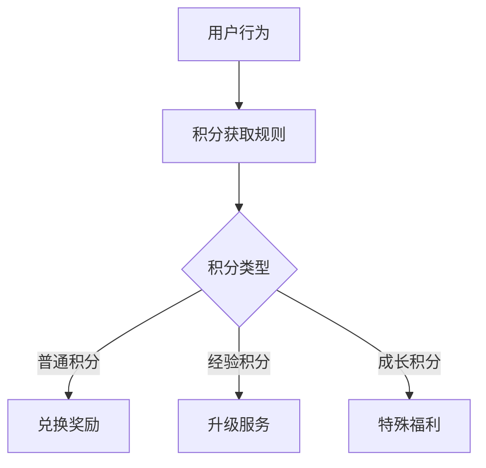

                 

关键词：知识付费、积分体系、设计、程序员、用户体验、算法、实践

> 摘要：本文将深入探讨程序员在设计知识付费的积分体系时的关键问题，包括核心概念、算法原理、实践案例以及未来展望。文章旨在为开发者提供一整套完整的设计方案，帮助他们在实际项目中构建高效、公平且吸引人的积分体系。

## 1. 背景介绍

知识付费作为一种新型的商业模式，已经在互联网领域迅速兴起。通过付费获取知识或服务，用户能够获得更加精准、高质量的内容，而知识提供者则能够通过这种方式实现变现。在这个过程中，积分体系成为了一种有效的激励机制，它能够增强用户的参与度，提升用户体验，同时为知识提供者带来更多收益。

程序员在知识付费平台的开发中扮演着关键角色。他们需要设计出既能够激励用户积极参与，又能够维护系统公平性的积分体系。这不仅仅是技术上的挑战，更是对用户体验和商业策略的深刻理解。因此，本文将从多个角度探讨如何设计一个高效的知识付费积分体系。

## 2. 核心概念与联系

在设计积分体系之前，我们需要明确几个核心概念：

### 2.1 积分体系的定义

积分体系是一种用于激励用户的虚拟奖励系统，通过赋予用户积分来鼓励他们完成特定的任务或行为。这些积分可以用于兑换礼品、享受折扣或升级服务等。

### 2.2 积分类型

积分可以有多种类型，例如普通积分、经验积分、成长积分等。每种积分都有其特定的用途和计算方式。

### 2.3 积分规则

积分规则定义了用户如何获得积分以及积分如何消耗。这些规则需要清晰、明确，以便用户理解并遵循。

### 2.4 用户行为

用户行为是积分体系的基础。程序员需要分析用户的日常行为模式，以便设计出合理的积分规则。

### 2.5 Mermaid 流程图

下面是一个简单的 Mermaid 流程图，展示了积分体系的核心概念和它们之间的联系。



## 3. 核心算法原理 & 具体操作步骤

### 3.1 算法原理概述

积分体系的算法原理主要涉及以下几个方面：

- **积分计算**：根据用户行为，系统自动计算积分。
- **积分转换**：将积分转换为具体的奖励或服务。
- **积分消耗**：用户在享受奖励或服务时，积分会被消耗。

### 3.2 算法步骤详解

1. **积分获取**：用户完成特定行为（如阅读、评论、分享等）后，系统根据预设规则计算积分并赋予用户。
2. **积分转换**：用户可以查看自己的积分余额，并通过系统提供的兑换选项将积分转换为具体的奖励。
3. **积分消耗**：用户在享受奖励或服务时，积分会被扣除。

### 3.3 算法优缺点

- **优点**：积分体系能够有效激励用户参与，提高用户粘性。
- **缺点**：如果积分计算规则过于复杂，用户可能难以理解，从而降低参与度。

### 3.4 算法应用领域

积分体系广泛应用于各种知识付费平台，如在线教育、职业培训、内容分享等。

## 4. 数学模型和公式 & 详细讲解 & 举例说明

### 4.1 数学模型构建

积分体系的数学模型主要包括以下几个方面：

- **积分获取函数**：\( I = f(B, R, T) \)，其中 \( I \) 表示积分，\( B \) 表示用户行为，\( R \) 表示行为规则，\( T \) 表示时间。
- **积分转换函数**：\( C = g(I, P) \)，其中 \( C \) 表示可兑换的物品或服务，\( P \) 表示积分价格。
- **积分消耗函数**：\( D = h(I, X) \)，其中 \( X \) 表示用户消耗积分的行为。

### 4.2 公式推导过程

1. **积分获取函数**：积分获取函数可以通过分析用户行为模式和行为规则来推导。
2. **积分转换函数**：积分转换函数需要考虑积分的价值和兑换物品或服务的价格。
3. **积分消耗函数**：积分消耗函数需要根据用户的行为模式来设计。

### 4.3 案例分析与讲解

假设有一个知识付费平台，用户可以通过阅读文章、发表评论和分享文章来获得积分。积分获取函数可以定义为：

$$
I = \begin{cases} 
10 & \text{if user reads an article} \\
5 & \text{if user writes a comment} \\
3 & \text{if user shares an article} 
\end{cases}
$$

积分转换函数可以设定为：

$$
C = \frac{I}{100} \text{（假设每100积分可以兑换1元人民币）}
$$

积分消耗函数可以设定为：

$$
D = \begin{cases} 
I & \text{if user purchases a course} \\
\frac{I}{2} & \text{if user subscribes to a premium service} 
\end{cases}
$$

## 5. 项目实践：代码实例和详细解释说明

### 5.1 开发环境搭建

为了实现积分体系，我们选择使用 Python 编写代码，利用 Flask 框架构建后端服务。

### 5.2 源代码详细实现

下面是一个简单的积分体系实现的示例代码：

```python
from flask import Flask, request, jsonify

app = Flask(__name__)

# 用户行为积分规则
behaviors = {
    'read': 10,
    'comment': 5,
    'share': 3
}

# 积分转换规则
conversion_rate = 100

@app.route('/get_points', methods=['POST'])
def get_points():
    data = request.get_json()
    behavior = data.get('behavior')
    points = behaviors.get(behavior, 0)
    return jsonify({'points': points})

@app.route('/convert_points', methods=['POST'])
def convert_points():
    data = request.get_json()
    points = data.get('points')
    currency = int(points / conversion_rate)
    return jsonify({'currency': currency})

@app.route('/spend_points', methods=['POST'])
def spend_points():
    data = request.get_json()
    points = data.get('points')
    if points > 0:
        return jsonify({'message': 'Points spent successfully!'})
    else:
        return jsonify({'message': 'Insufficient points.'})

if __name__ == '__main__':
    app.run(debug=True)
```

### 5.3 代码解读与分析

- `behaviors` 字典定义了用户的不同行为及其对应的积分。
- `conversion_rate` 变量定义了积分转换为货币的比例。
- `get_points` 函数接收用户行为，返回相应的积分。
- `convert_points` 函数接收积分数量，返回相应的货币金额。
- `spend_points` 函数接收积分数量，检查是否足够，并返回相应的消息。

### 5.4 运行结果展示

通过 POST 请求发送到相应路由，可以获取积分、兑换货币金额或消耗积分。

## 6. 实际应用场景

积分体系在实际应用中可以应用于多种场景，例如：

- **在线教育**：用户通过学习课程、完成作业获得积分。
- **内容平台**：用户通过发布内容、获得点赞获得积分。
- **社交网络**：用户通过互动（评论、分享等）获得积分。

## 7. 工具和资源推荐

### 7.1 学习资源推荐

- 《设计奖励机制：从入门到实践》
- 《用户增长：从零到一》

### 7.2 开发工具推荐

- Flask：Python Web 开发框架
- Flask-SQLAlchemy：ORM 模块

### 7.3 相关论文推荐

- 《积分体系设计研究》
- 《基于积分体系的社会化学习系统构建与应用》

## 8. 总结：未来发展趋势与挑战

### 8.1 研究成果总结

本文从多个角度探讨了知识付费积分体系的设计，包括核心概念、算法原理、实践案例以及未来展望。

### 8.2 未来发展趋势

随着人工智能和大数据技术的发展，积分体系将更加智能化，能够更精准地满足用户需求。

### 8.3 面临的挑战

设计公平、合理的积分体系仍然是一个挑战，特别是在大规模用户场景中。

### 8.4 研究展望

未来的研究可以关注如何将机器学习与积分体系结合，以提高积分体系的智能化程度。

## 9. 附录：常见问题与解答

### 9.1 如何设计公平的积分体系？

公平的积分体系需要考虑以下几个方面：

- **积分获取规则**：确保积分获取规则简单明确，不易被滥用。
- **积分消耗规则**：确保积分消耗规则清晰，用户能够明确理解。
- **积分监控**：定期监控积分系统的运行情况，及时发现问题并进行调整。

### 9.2 积分体系对用户体验有何影响？

良好的积分体系能够提高用户的参与度和满意度，从而提升用户体验。反之，过于复杂的积分规则可能会降低用户的参与度。

----------------------------------------------------------------

本文由"禅与计算机程序设计艺术 / Zen and the Art of Computer Programming"撰写。希望本文能够为程序员在设计知识付费积分体系时提供有价值的参考。在未来的实践中，不断优化和调整积分体系，以适应不断变化的市场需求。

