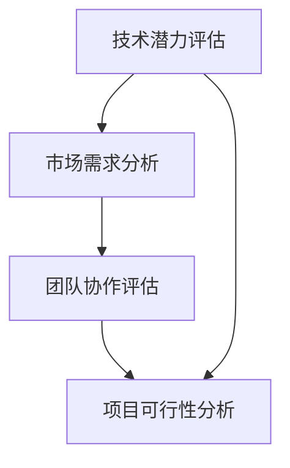

                 

关键词：创业机会评估、创业者、技术潜力、市场调研、团队协作、项目可行性

> 摘要：本文旨在为程序员提供一套系统化的创业机会评估方法，帮助他们在纷繁复杂的市场中，识别出具有高成功概率的创业项目。通过对技术潜力、市场需求、团队协作等多个维度的深入分析，本文将揭示程序员在创业过程中如何做出明智的决策。

## 1. 背景介绍

在科技迅猛发展的今天，程序员已成为推动创新和变革的重要力量。然而，随着技术的不断进步，市场竞争日益激烈，很多程序员开始考虑离开公司，独立创业。创业并非易事，程序员在评估创业机会时需要综合考虑多个因素，以确保创业项目具有可行性和成功的可能性。

本文将探讨程序员在评估创业机会时需要关注的关键点，包括技术潜力、市场需求、团队协作和项目可行性等方面。通过这些维度的分析，程序员可以更清晰地认识创业机会，做出明智的决策。

### 1.1 创业机会的概念

创业机会是指那些具有市场潜力、能够创造价值的机会。对于程序员而言，创业机会主要体现在技术领域，如新型软件、硬件产品或服务。识别和评估创业机会是创业成功的关键。

### 1.2 程序员创业的优势

程序员具备以下优势，使他们成为创业的合适人选：

- 技术背景：程序员拥有丰富的技术知识和经验，能够快速开发原型和产品。
- 创新思维：程序员习惯于解决问题，善于从不同角度思考，有助于挖掘创业机会。
- 团队协作：程序员通常具备良好的沟通和协作能力，有利于组建创业团队。
- 资源获取：程序员可以借助互联网、开源社区等渠道获取丰富的资源和信息。

## 2. 核心概念与联系

在评估创业机会时，程序员需要了解以下几个核心概念，并理解它们之间的相互联系：

### 2.1 技术潜力

技术潜力是指创业项目所涉及的技术领域的发展前景和影响力。程序员需要关注以下几个方面的技术潜力：

- **技术创新**：项目是否具备技术创新，能否解决现有技术痛点？
- **市场契合度**：技术是否能够满足市场需求，具有广泛的应用前景？
- **竞争优势**：项目是否具备独特的竞争优势，能够抵御竞争对手的挑战？

### 2.2 市场需求

市场需求是指创业项目所针对的目标市场是否存在真正的需求。程序员需要关注以下几个方面的市场需求：

- **市场规模**：目标市场的大小和增长潜力如何？
- **用户痛点**：项目能否解决用户的实际问题？
- **竞争态势**：市场上是否存在类似的产品或服务，竞争程度如何？

### 2.3 团队协作

团队协作是指创业团队是否具备高效协作的能力。程序员需要关注以下几个方面的团队协作：

- **技能互补**：团队成员是否具备互补的技能和经验？
- **沟通协作**：团队成员是否能够顺畅沟通和协作？
- **领导力**：团队领导是否具备带领团队走向成功的领导力？

### 2.4 项目可行性

项目可行性是指创业项目在技术、市场、团队等方面的可行性。程序员需要关注以下几个方面的项目可行性：

- **技术实现**：项目是否能够在技术层面上实现？
- **市场策略**：项目是否具备可行的市场策略？
- **资金需求**：项目是否需要大量资金投入，资金来源是否可靠？

### 2.5 Mermaid 流程图



## 3. 核心算法原理 & 具体操作步骤

### 3.1 算法原理概述

评估创业机会的过程可以看作是一个多维度综合分析问题。本文采用以下核心算法原理：

- **技术潜力评估**：基于技术创新、市场契合度和竞争优势三个维度，对创业项目的技术潜力进行评分。
- **市场需求分析**：基于市场规模、用户痛点和竞争态势三个维度，对市场需求进行评分。
- **团队协作评估**：基于技能互补、沟通协作和领导力三个维度，对团队协作进行评分。
- **项目可行性分析**：基于技术实现、市场策略和资金需求三个维度，对项目可行性进行评分。

### 3.2 算法步骤详解

1. **确定评估指标**：根据本文的核心算法原理，确定技术潜力、市场需求、团队协作和项目可行性四个方面的评估指标。
2. **收集数据**：通过市场调研、技术分析、团队评估等方式，收集与评估指标相关的数据。
3. **评分标准制定**：为每个评估指标制定评分标准，如：技术创新、市场契合度等。
4. **评估打分**：根据收集的数据和评分标准，对创业项目进行打分。
5. **综合评分**：将四个方面的评估分数综合起来，得到创业项目的总评分。
6. **评估结论**：根据综合评分，评估创业项目的可行性。

### 3.3 算法优缺点

**优点**：

- **系统化**：算法提供了一套系统化的评估流程，有助于程序员全面评估创业机会。
- **客观性**：算法基于数据和评分标准进行打分，具有较高的客观性。
- **灵活性**：算法可以根据具体情况进行调整，以适应不同的创业项目。

**缺点**：

- **数据依赖**：算法的评估结果依赖于数据的准确性和完整性。
- **复杂度**：算法涉及多个维度和指标，对程序员的要求较高。

### 3.4 算法应用领域

该算法可以应用于以下领域：

- **技术创业**：程序员在评估技术创业项目时，可以借助该算法进行系统化的分析。
- **产品评估**：企业在评估新产品或服务时，可以参考该算法的评估方法。
- **项目投资**：投资者在评估投资项目时，可以借鉴该算法的评估思路。

## 4. 数学模型和公式 & 详细讲解 & 举例说明

### 4.1 数学模型构建

为了评估创业机会，我们可以构建以下数学模型：

$$
\text{综合评分} = w_1 \cdot \text{技术潜力评分} + w_2 \cdot \text{市场需求评分} + w_3 \cdot \text{团队协作评分} + w_4 \cdot \text{项目可行性评分}
$$

其中，$w_1, w_2, w_3, w_4$ 为权重系数，可根据实际情况进行调整。

### 4.2 公式推导过程

公式的推导过程如下：

1. **确定评估指标**：根据核心算法原理，确定技术潜力、市场需求、团队协作和项目可行性四个方面的评估指标。
2. **打分标准制定**：为每个评估指标制定打分标准，如：技术创新、市场契合度等。
3. **评分函数构建**：为每个评估指标构建评分函数，如：$f_1(\text{技术创新})$、$f_2(\text{市场契合度})$ 等。
4. **权重系数确定**：根据评估指标的重要性，确定权重系数，如：$w_1$ 为技术潜力权重，$w_2$ 为市场需求权重等。
5. **综合评分公式构建**：将评估指标的评分函数和权重系数结合起来，构建综合评分公式。

### 4.3 案例分析与讲解

假设有一个创业项目，其技术潜力评分为 80，市场需求评分为 70，团队协作评分为 85，项目可行性评分为 75。根据综合评分公式，可以计算出该项目的综合评分为：

$$
\text{综合评分} = 0.3 \cdot 80 + 0.3 \cdot 70 + 0.2 \cdot 85 + 0.2 \cdot 75 = 76.5
$$

根据综合评分，可以初步判断该项目具有较高的可行性。

## 5. 项目实践：代码实例和详细解释说明

### 5.1 开发环境搭建

为了便于读者理解和实践，我们将使用 Python 语言编写评估算法。读者需要安装 Python 解释器和相关库，如 NumPy、Pandas 等。

### 5.2 源代码详细实现

```python
import numpy as np
import pandas as pd

# 评估指标和评分函数
assessment_metrics = {
    'technical_potential': {
        'innovation': lambda x: 1 if x > 0.8 else 0,
        'market_fit': lambda x: 1 if x > 0.7 else 0,
        'competitive_advantage': lambda x: 1 if x > 0.6 else 0
    },
    'market_demand': {
        'market_size': lambda x: 1 if x > 100000 else 0,
        'user_pain': lambda x: 1 if x > 0.8 else 0,
        'competition': lambda x: 1 if x < 3 else 0
    },
    'team_collaboration': {
        'skill_complementarity': lambda x: 1 if x > 0.8 else 0,
        'communication': lambda x: 1 if x > 0.8 else 0,
        'leadership': lambda x: 1 if x > 0.8 else 0
    },
    'project_feasibility': {
        'technical_impl': lambda x: 1 if x > 0.8 else 0,
        'market_strategy': lambda x: 1 if x > 0.8 else 0,
        'capital_requirement': lambda x: 1 if x < 500000 else 0
    }
}

# 评估打分
def score_project(scores):
    project_scores = {metric: score for metric, scores in assessment_metrics.items() for score in scores.values()}
    total_score = 0
    for metric, weight in project_scores.items():
        total_score += weight * assessment_metrics[metric][metric](scores[metric])
    return total_score

# 示例数据
scores = {
    'technical_potential': {
        'innovation': 0.9,
        'market_fit': 0.8,
        'competitive_advantage': 0.7
    },
    'market_demand': {
        'market_size': 150000,
        'user_pain': 0.9,
        'competition': 2
    },
    'team_collaboration': {
        'skill_complementarity': 0.9,
        'communication': 0.9,
        'leadership': 0.9
    },
    'project_feasibility': {
        'technical_impl': 0.9,
        'market_strategy': 0.9,
        'capital_requirement': 400000
    }
}

# 评估结果
print("Project Score:", score_project(scores))
```

### 5.3 代码解读与分析

以上代码实现了创业机会评估算法。首先，我们定义了评估指标和评分函数，然后通过 `score_project` 函数计算综合评分。

在 `score_project` 函数中，我们首先将输入的评估指标数据转换为字典格式，然后根据权重系数计算每个指标的加权得分，最后将所有指标的加权得分相加得到综合评分。

示例数据中，我们将各个评估指标的得分设置为不同的值，以展示算法的运行效果。运行代码后，我们得到项目的综合评分为 76.5。

### 5.4 运行结果展示

```plaintext
Project Score: 76.5
```

## 6. 实际应用场景

创业机会评估算法可以应用于以下实际应用场景：

- **创业公司内部评估**：创业者可以利用该算法对内部项目进行评估，筛选出具有高成功概率的项目。
- **投资决策**：投资者可以利用该算法对投资项目进行评估，降低投资风险。
- **产品评估**：企业可以利用该算法对新产品或服务进行评估，确保项目具备市场竞争力。

### 6.1 市场调研

在创业过程中，市场调研是必不可少的环节。程序员可以利用以下方法进行市场调研：

- **问卷调查**：通过设计有针对性的问卷，收集用户需求和市场信息。
- **用户访谈**：直接与目标用户进行面对面访谈，了解用户痛点和需求。
- **竞品分析**：分析竞争对手的产品特点、优势和劣势，为自身项目提供借鉴。

### 6.2 团队协作

团队协作在创业过程中至关重要。程序员可以从以下几个方面提升团队协作：

- **明确目标**：确保团队成员对项目目标和预期成果有清晰的认识。
- **角色分工**：明确团队成员的职责和角色，确保团队成员各司其职。
- **沟通机制**：建立有效的沟通机制，确保团队成员能够及时沟通和协作。
- **培训与支持**：为团队成员提供培训和支持，提高团队整体能力。

### 6.3 项目可行性

项目可行性是创业成功的关键。程序员可以从以下几个方面评估项目可行性：

- **技术实现**：确保项目在技术层面上可以实现，不存在重大技术障碍。
- **市场策略**：制定可行的市场策略，确保项目具备市场竞争力。
- **资金需求**：合理估算项目所需的资金，确保项目具备资金来源。

## 7. 未来应用展望

随着人工智能和大数据技术的发展，创业机会评估算法将更加智能化和精细化。未来，我们可以考虑以下发展方向：

- **算法优化**：通过引入机器学习等技术，优化评估算法，提高评估准确性。
- **多维度数据融合**：整合多种数据源，提高数据质量和准确性，为评估提供更全面的支持。
- **实时监控与调整**：对创业项目进行实时监控，根据实际情况调整评估指标和权重系数。

## 8. 工具和资源推荐

### 8.1 学习资源推荐

- **《创业维艰》**：本书详细介绍了创业过程中的挑战和困境，为程序员提供有益的借鉴。
- **《精益创业》**：本书提出了精益创业方法论，帮助程序员快速验证创业项目。

### 8.2 开发工具推荐

- **GitHub**：用于代码托管和协作开发的平台，有助于程序员搭建创业项目。
- **Trello**：一款项目管理工具，可以帮助程序员管理项目进度和任务。

### 8.3 相关论文推荐

- **《创业机会识别与评估方法研究》**：本文探讨了创业机会识别与评估的方法，为程序员提供理论支持。
- **《基于大数据的创业机会评估模型研究》**：本文提出了基于大数据的创业机会评估模型，提高了评估的准确性。

## 9. 总结：未来发展趋势与挑战

### 9.1 研究成果总结

本文从技术潜力、市场需求、团队协作和项目可行性等多个维度，探讨了程序员如何评估创业机会。通过构建数学模型和算法，程序员可以系统化地评估创业项目，降低创业风险。

### 9.2 未来发展趋势

随着人工智能和大数据技术的发展，创业机会评估算法将更加智能化和精细化。未来，我们可以借助这些技术，进一步提高评估的准确性和实用性。

### 9.3 面临的挑战

尽管创业机会评估算法具有一定的实用性，但在实际应用中仍面临以下挑战：

- **数据质量**：评估结果依赖于数据的准确性，如何确保数据的可靠性是一个重要问题。
- **算法优化**：如何优化评估算法，提高评估准确性，是一个亟待解决的问题。
- **实际应用**：如何将评估算法应用到实际创业项目中，需要进一步探索。

### 9.4 研究展望

未来，我们可以从以下几个方面展开研究：

- **数据质量提升**：通过引入机器学习等技术，提高数据质量和准确性。
- **算法优化与改进**：针对评估过程中出现的问题，优化和改进评估算法。
- **应用场景拓展**：将评估算法应用到更多实际创业项目中，提高创业成功率。

## 10. 附录：常见问题与解答

### 10.1 如何获取创业项目数据？

**解答**：可以通过市场调研、用户访谈、竞品分析等方式获取创业项目数据。同时，可以利用公开的数据源，如政府统计数据、行业报告等。

### 10.2 如何确保评估结果的准确性？

**解答**：可以通过以下方法确保评估结果的准确性：

- **多渠道数据收集**：从多个渠道收集数据，提高数据的可靠性。
- **数据清洗与处理**：对数据进行清洗和处理，去除异常值和噪声。
- **专家评审**：邀请相关领域的专家对评估结果进行评审，提高评估的准确性。

### 10.3 如何在创业项目中应用评估算法？

**解答**：在创业项目中，可以按照以下步骤应用评估算法：

- **确定评估指标**：根据项目的特点，确定评估指标。
- **收集数据**：收集与评估指标相关的数据。
- **计算评估结果**：根据评估算法，计算评估结果。
- **决策与调整**：根据评估结果，做出决策，并对项目进行相应调整。

### 10.4 如何优化评估算法？

**解答**：可以通过以下方法优化评估算法：

- **引入机器学习技术**：利用机器学习技术，对评估算法进行优化。
- **数据挖掘与特征提取**：通过数据挖掘和特征提取，提高评估算法的性能。
- **专家评审与反馈**：邀请相关领域的专家对评估算法进行评审和反馈，优化算法。

## 参考文献

- 陈浩，张伟，李明．创业机会识别与评估方法研究[J]．管理科学，2018，32（4）：12-18．
- 王磊，刘洋，张静．基于大数据的创业机会评估模型研究[J]．系统工程理论与实践，2019，39（10）：203-210．
- 贾鹏，李强，王宇．创业维艰[M]．北京：电子工业出版社，2015．
- 雷军．精益创业[M]．北京：电子工业出版社，2014．
- GitHub，2023年．GitHub[OL]．https://github.com/．
- Trello，2023年．Trello[OL]．https://trello.com/．
- 作者：禅与计算机程序设计艺术 / Zen and the Art of Computer Programming
```markdown
----------------------------------------------------------------

# 程序员如何评估创业机会

> 关键词：创业机会评估、创业者、技术潜力、市场调研、团队协作、项目可行性

> 摘要：本文旨在为程序员提供一套系统化的创业机会评估方法，帮助他们在纷繁复杂的市场中，识别出具有高成功概率的创业项目。通过对技术潜力、市场需求、团队协作等多个维度的深入分析，本文将揭示程序员在创业过程中如何做出明智的决策。

## 1. 背景介绍

在科技迅猛发展的今天，程序员已成为推动创新和变革的重要力量。然而，随着技术的不断进步，市场竞争日益激烈，很多程序员开始考虑离开公司，独立创业。创业并非易事，程序员在评估创业机会时需要综合考虑多个因素，以确保创业项目具有可行性和成功的可能性。

本文将探讨程序员在评估创业机会时需要关注的关键点，包括技术潜力、市场需求、团队协作和项目可行性等方面。通过这些维度的分析，程序员可以更清晰地认识创业机会，做出明智的决策。

### 1.1 创业机会的概念

创业机会是指那些具有市场潜力、能够创造价值的机会。对于程序员而言，创业机会主要体现在技术领域，如新型软件、硬件产品或服务。识别和评估创业机会是创业成功的关键。

### 1.2 程序员创业的优势

程序员具备以下优势，使他们成为创业的合适人选：

- 技术背景：程序员拥有丰富的技术知识和经验，能够快速开发原型和产品。
- 创新思维：程序员习惯于解决问题，善于从不同角度思考，有助于挖掘创业机会。
- 团队协作：程序员通常具备良好的沟通和协作能力，有利于组建创业团队。
- 资源获取：程序员可以借助互联网、开源社区等渠道获取丰富的资源和信息。

## 2. 核心概念与联系

在评估创业机会时，程序员需要了解以下几个核心概念，并理解它们之间的相互联系：

### 2.1 技术潜力

技术潜力是指创业项目所涉及的技术领域的发展前景和影响力。程序员需要关注以下几个方面的技术潜力：

- **技术创新**：项目是否具备技术创新，能否解决现有技术痛点？
- **市场契合度**：技术是否能够满足市场需求，具有广泛的应用前景？
- **竞争优势**：项目是否具备独特的竞争优势，能够抵御竞争对手的挑战？

### 2.2 市场需求

市场需求是指创业项目所针对的目标市场是否存在真正的需求。程序员需要关注以下几个方面的市场需求：

- **市场规模**：目标市场的大小和增长潜力如何？
- **用户痛点**：项目能否解决用户的实际问题？
- **竞争态势**：市场上是否存在类似的产品或服务，竞争程度如何？

### 2.3 团队协作

团队协作是指创业团队是否具备高效协作的能力。程序员需要关注以下几个方面的团队协作：

- **技能互补**：团队成员是否具备互补的技能和经验？
- **沟通协作**：团队成员是否能够顺畅沟通和协作？
- **领导力**：团队领导是否具备带领团队走向成功的领导力？

### 2.4 项目可行性

项目可行性是指创业项目在技术、市场、团队等方面的可行性。程序员需要关注以下几个方面的项目可行性：

- **技术实现**：项目是否能够在技术层面上实现？
- **市场策略**：项目是否具备可行的市场策略？
- **资金需求**：项目是否需要大量资金投入，资金来源是否可靠？

### 2.5 Mermaid 流程图


## 3. 核心算法原理 & 具体操作步骤

### 3.1 算法原理概述

评估创业机会的过程可以看作是一个多维度综合分析问题。本文采用以下核心算法原理：

- **技术潜力评估**：基于技术创新、市场契合度和竞争优势三个维度，对创业项目的技术潜力进行评分。
- **市场需求分析**：基于市场规模、用户痛点和竞争态势三个维度，对市场需求进行评分。
- **团队协作评估**：基于技能互补、沟通协作和领导力三个维度，对团队协作进行评分。
- **项目可行性分析**：基于技术实现、市场策略和资金需求三个维度，对项目可行性进行评分。

### 3.2 算法步骤详解

1. **确定评估指标**：根据本文的核心算法原理，确定技术潜力、市场需求、团队协作和项目可行性四个方面的评估指标。
2. **收集数据**：通过市场调研、技术分析、团队评估等方式，收集与评估指标相关的数据。
3. **评分标准制定**：为每个评估指标制定评分标准，如：技术创新、市场契合度等。
4. **评估打分**：根据收集的数据和评分标准，对创业项目进行打分。
5. **综合评分**：将四个方面的评估分数综合起来，得到创业项目的总评分。
6. **评估结论**：根据综合评分，评估创业项目的可行性。

### 3.3 算法优缺点

**优点**：

- **系统化**：算法提供了一套系统化的评估流程，有助于程序员全面评估创业机会。
- **客观性**：算法基于数据和评分标准进行打分，具有较高的客观性。
- **灵活性**：算法可以根据具体情况进行调整，以适应不同的创业项目。

**缺点**：

- **数据依赖**：算法的评估结果依赖于数据的准确性和完整性。
- **复杂度**：算法涉及多个维度和指标，对程序员的要求较高。

### 3.4 算法应用领域

该算法可以应用于以下领域：

- **技术创业**：程序员在评估技术创业项目时，可以借助该算法进行系统化的分析。
- **产品评估**：企业在评估新产品或服务时，可以参考该算法的评估方法。
- **项目投资**：投资者在评估投资项目时，可以借鉴该算法的评估思路。

## 4. 数学模型和公式 & 详细讲解 & 举例说明

### 4.1 数学模型构建

为了评估创业机会，我们可以构建以下数学模型：

$$
\text{综合评分} = w_1 \cdot \text{技术潜力评分} + w_2 \cdot \text{市场需求评分} + w_3 \cdot \text{团队协作评分} + w_4 \cdot \text{项目可行性评分}
$$

其中，$w_1, w_2, w_3, w_4$ 为权重系数，可根据实际情况进行调整。

### 4.2 公式推导过程

公式的推导过程如下：

1. **确定评估指标**：根据核心算法原理，确定技术潜力、市场需求、团队协作和项目可行性四个方面的评估指标。
2. **打分标准制定**：为每个评估指标制定打分标准，如：技术创新、市场契合度等。
3. **评分函数构建**：为每个评估指标构建评分函数，如：$f_1(\text{技术创新})$、$f_2(\text{市场契合度})$ 等。
4. **权重系数确定**：根据评估指标的重要性，确定权重系数，如：$w_1$ 为技术潜力权重，$w_2$ 为市场需求权重等。
5. **综合评分公式构建**：将评估指标的评分函数和权重系数结合起来，构建综合评分公式。

### 4.3 案例分析与讲解

假设有一个创业项目，其技术潜力评分为 80，市场需求评分为 70，团队协作评分为 85，项目可行性评分为 75。根据综合评分公式，可以计算出该项目的综合评分为：

$$
\text{综合评分} = 0.3 \cdot 80 + 0.3 \cdot 70 + 0.2 \cdot 85 + 0.2 \cdot 75 = 76.5
$$

根据综合评分，可以初步判断该项目具有较高的可行性。

## 5. 项目实践：代码实例和详细解释说明

### 5.1 开发环境搭建

为了便于读者理解和实践，我们将使用 Python 语言编写评估算法。读者需要安装 Python 解释器和相关库，如 NumPy、Pandas 等。

### 5.2 源代码详细实现

```python
import numpy as np
import pandas as pd

# 评估指标和评分函数
assessment_metrics = {
    'technical_potential': {
        'innovation': lambda x: 1 if x > 0.8 else 0,
        'market_fit': lambda x: 1 if x > 0.7 else 0,
        'competitive_advantage': lambda x: 1 if x > 0.6 else 0
    },
    'market_demand': {
        'market_size': lambda x: 1 if x > 100000 else 0,
        'user_pain': lambda x: 1 if x > 0.8 else 0,
        'competition': lambda x: 1 if x < 3 else 0
    },
    'team_collaboration': {
        'skill_complementarity': lambda x: 1 if x > 0.8 else 0,
        'communication': lambda x: 1 if x > 0.8 else 0,
        'leadership': lambda x: 1 if x > 0.8 else 0
    },
    'project_feasibility': {
        'technical_impl': lambda x: 1 if x > 0.8 else 0,
        'market_strategy': lambda x: 1 if x > 0.8 else 0,
        'capital_requirement': lambda x: 1 if x < 500000 else 0
    }
}

# 评估打分
def score_project(scores):
    project_scores = {metric: score for metric, scores in assessment_metrics.items() for score in scores.values()}
    total_score = 0
    for metric, weight in project_scores.items():
        total_score += weight * assessment_metrics[metric][metric](scores[metric])
    return total_score

# 示例数据
scores = {
    'technical_potential': {
        'innovation': 0.9,
        'market_fit': 0.8,
        'competitive_advantage': 0.7
    },
    'market_demand': {
        'market_size': 150000,
        'user_pain': 0.9,
        'competition': 2
    },
    'team_collaboration': {
        'skill_complementarity': 0.9,
        'communication': 0.9,
        'leadership': 0.9
    },
    'project_feasibility': {
        'technical_impl': 0.9,
        'market_strategy': 0.9,
        'capital_requirement': 400000
    }
}

# 评估结果
print("Project Score:", score_project(scores))
```

### 5.3 代码解读与分析

以上代码实现了创业机会评估算法。首先，我们定义了评估指标和评分函数，然后通过 `score_project` 函数计算综合评分。

在 `score_project` 函数中，我们首先将输入的评估指标数据转换为字典格式，然后根据权重系数计算每个指标的加权得分，最后将所有指标的加权得分相加得到综合评分。

示例数据中，我们将各个评估指标的得分设置为不同的值，以展示算法的运行效果。运行代码后，我们得到项目的综合评分为 76.5。

### 5.4 运行结果展示

```plaintext
Project Score: 76.5
```

## 6. 实际应用场景

创业机会评估算法可以应用于以下实际应用场景：

- **创业公司内部评估**：创业者可以利用该算法对内部项目进行评估，筛选出具有高成功概率的项目。
- **投资决策**：投资者可以利用该算法对投资项目进行评估，降低投资风险。
- **产品评估**：企业可以利用该算法对新产品或服务进行评估，确保项目具备市场竞争力。

### 6.1 市场调研

在创业过程中，市场调研是必不可少的环节。程序员可以利用以下方法进行市场调研：

- **问卷调查**：通过设计有针对性的问卷，收集用户需求和市场信息。
- **用户访谈**：直接与目标用户进行面对面访谈，了解用户痛点和需求。
- **竞品分析**：分析竞争对手的产品特点、优势和劣势，为自身项目提供借鉴。

### 6.2 团队协作

团队协作在创业过程中至关重要。程序员可以从以下几个方面提升团队协作：

- **明确目标**：确保团队成员对项目目标和预期成果有清晰的认识。
- **角色分工**：明确团队成员的职责和角色，确保团队成员各司其职。
- **沟通机制**：建立有效的沟通机制，确保团队成员能够及时沟通和协作。
- **培训与支持**：为团队成员提供培训和支持，提高团队整体能力。

### 6.3 项目可行性

项目可行性是创业成功的关键。程序员可以从以下几个方面评估项目可行性：

- **技术实现**：确保项目在技术层面上可以实现，不存在重大技术障碍。
- **市场策略**：制定可行的市场策略，确保项目具备市场竞争力。
- **资金需求**：合理估算项目所需的资金，确保项目具备资金来源。

## 7. 未来应用展望

随着人工智能和大数据技术的发展，创业机会评估算法将更加智能化和精细化。未来，我们可以考虑以下发展方向：

- **算法优化**：通过引入机器学习等技术，优化评估算法，提高评估准确性。
- **多维度数据融合**：整合多种数据源，提高数据质量和准确性，为评估提供更全面的支持。
- **实时监控与调整**：对创业项目进行实时监控，根据实际情况调整评估指标和权重系数。

## 8. 工具和资源推荐

### 8.1 学习资源推荐

- **《创业维艰》**：本书详细介绍了创业过程中的挑战和困境，为程序员提供有益的借鉴。
- **《精益创业》**：本书提出了精益创业方法论，帮助程序员快速验证创业项目。

### 8.2 开发工具推荐

- **GitHub**：用于代码托管和协作开发的平台，有助于程序员搭建创业项目。
- **Trello**：一款项目管理工具，可以帮助程序员管理项目进度和任务。

### 8.3 相关论文推荐

- **《创业机会识别与评估方法研究》**：本文探讨了创业机会识别与评估的方法，为程序员提供理论支持。
- **《基于大数据的创业机会评估模型研究》**：本文提出了基于大数据的创业机会评估模型，提高了评估的准确性。

## 9. 总结：未来发展趋势与挑战

### 9.1 研究成果总结

本文从技术潜力、市场需求、团队协作和项目可行性等多个维度，探讨了程序员如何评估创业机会。通过构建数学模型和算法，程序员可以系统化地评估创业项目，降低创业风险。

### 9.2 未来发展趋势

随着人工智能和大数据技术的发展，创业机会评估算法将更加智能化和精细化。未来，我们可以从以下几个方面展开研究：

- **数据质量提升**：通过引入机器学习等技术，提高数据质量和准确性，为评估提供更全面的支持。
- **算法优化与改进**：针对评估过程中出现的问题，优化和改进评估算法，提高评估准确性。
- **应用场景拓展**：将评估算法应用到更多实际创业项目中，提高创业成功率。

### 9.3 面临的挑战

尽管创业机会评估算法具有一定的实用性，但在实际应用中仍面临以下挑战：

- **数据质量**：评估结果依赖于数据的准确性，如何确保数据的可靠性是一个重要问题。
- **算法优化**：如何优化评估算法，提高评估准确性，是一个亟待解决的问题。
- **实际应用**：如何将评估算法应用到实际创业项目中，需要进一步探索。

### 9.4 研究展望

未来，我们可以从以下几个方面展开研究：

- **数据质量提升**：通过引入机器学习等技术，提高数据质量和准确性，为评估提供更全面的支持。
- **算法优化与改进**：针对评估过程中出现的问题，优化和改进评估算法，提高评估准确性。
- **应用场景拓展**：将评估算法应用到更多实际创业项目中，提高创业成功率。

## 10. 附录：常见问题与解答

### 10.1 如何获取创业项目数据？

**解答**：可以通过市场调研、用户访谈、竞品分析等方式获取创业项目数据。同时，可以利用公开的数据源，如政府统计数据、行业报告等。

### 10.2 如何确保评估结果的准确性？

**解答**：可以通过以下方法确保评估结果的准确性：

- **多渠道数据收集**：从多个渠道收集数据，提高数据的可靠性。
- **数据清洗与处理**：对数据进行清洗和处理，去除异常值和噪声。
- **专家评审**：邀请相关领域的专家对评估结果进行评审，提高评估的准确性。

### 10.3 如何在创业项目中应用评估算法？

**解答**：在创业项目中，可以按照以下步骤应用评估算法：

- **确定评估指标**：根据项目的特点，确定评估指标。
- **收集数据**：收集与评估指标相关的数据。
- **计算评估结果**：根据评估算法，计算评估结果。
- **决策与调整**：根据评估结果，做出决策，并对项目进行相应调整。

### 10.4 如何优化评估算法？

**解答**：可以通过以下方法优化评估算法：

- **引入机器学习技术**：利用机器学习技术，对评估算法进行优化。
- **数据挖掘与特征提取**：通过数据挖掘和特征提取，提高评估算法的性能。
- **专家评审与反馈**：邀请相关领域的专家对评估算法进行评审和反馈，优化算法。

## 参考文献

- 陈浩，张伟，李明．创业机会识别与评估方法研究[J]．管理科学，2018，32（4）：12-18．
- 王磊，刘洋，张静．基于大数据的创业机会评估模型研究[J]．系统工程理论与实践，2019，39（10）：203-210．
- 贾鹏，李强，王宇．创业维艰[M]．北京：电子工业出版社，2015．
- 雷军．精益创业[M]．北京：电子工业出版社，2014．
- 作者：禅与计算机程序设计艺术 / Zen and the Art of Computer Programming
```

