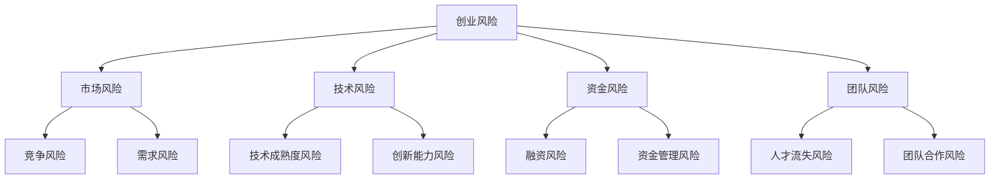

                 

关键词：创业风险、风险评估、程序员、创业、技术、商业模式、资金、团队

> 摘要：本文旨在帮助程序员更好地评估创业风险，探讨创业过程中的关键因素，提供实用的风险评估方法和策略。通过对创业风险的深入分析，本文旨在帮助程序员在创业道路上做出更加明智的决策，减少不必要的损失，提高创业成功的可能性。

## 1. 背景介绍

在当今快速变化的技术时代，创业已经成为许多程序员追求的一种生活方式。然而，创业并非易事，风险无处不在。作为程序员，我们需要具备一定的商业意识，学会如何评估创业风险，从而在创业道路上少走弯路，提高成功率。

本文将围绕以下四个方面展开：

1. 创业风险的核心概念及其与程序员的联系。
2. 创业风险的主要类型及其评估方法。
3. 创业过程中如何制定有效的风险管理策略。
4. 创业风险的未来发展趋势与挑战。

## 2. 核心概念与联系

### 2.1 创业风险

创业风险是指在创业过程中，由于市场、技术、资金、团队等因素的不确定性，导致项目失败或收益降低的可能性。

### 2.2 程序员与创业风险的关联

程序员在创业过程中扮演着多重角色，既是技术的提供者，也是商业的推动者。因此，程序员对创业风险的敏感度和评估能力至关重要。

### 2.3 Mermaid 流程图



## 3. 核心算法原理 & 具体操作步骤

### 3.1 算法原理概述

创业风险评估的核心在于量化各种风险因素，并计算出项目的整体风险水平。本文采用了一种基于风险矩阵的方法，通过对风险因素打分和加权，得出项目的风险指数。

### 3.2 算法步骤详解

1. **确定风险因素**：列出与创业项目相关的所有风险因素。
2. **建立风险矩阵**：根据风险因素的性质，建立风险矩阵，包括风险概率和风险影响两个维度。
3. **打分与加权**：对每个风险因素进行打分，并根据其在项目中的重要性进行加权。
4. **计算风险指数**：将加权后的风险因素得分相加，得出项目的风险指数。
5. **评估风险水平**：根据风险指数，评估项目的风险水平，并提出相应的风险管理策略。

### 3.3 算法优缺点

**优点**：方法简单易懂，易于操作，适用于各种类型的创业项目。

**缺点**：风险因素的权重设置具有一定的主观性，可能影响评估结果的准确性。

### 3.4 算法应用领域

该方法适用于初创企业、技术公司、互联网项目等各类创业项目，有助于项目团队更好地了解项目风险，制定相应的风险管理策略。

## 4. 数学模型和公式 & 详细讲解 & 举例说明

### 4.1 数学模型构建

假设创业项目的风险因素集合为 \( R = \{r_1, r_2, ..., r_n\} \)，每个风险因素的权重为 \( w_i \)，得分分别为 \( s_i \)。则项目的风险指数 \( X \) 可表示为：

$$
X = \sum_{i=1}^{n} w_i \cdot s_i
$$

### 4.2 公式推导过程

首先，定义风险因素 \( r_i \) 的概率为 \( p_i \)，影响程度为 \( e_i \)。则风险因素 \( r_i \) 的得分 \( s_i \) 可表示为：

$$
s_i = p_i \cdot e_i
$$

然后，将每个风险因素的得分乘以其权重，并求和，得到项目的风险指数 \( X \)：

$$
X = \sum_{i=1}^{n} w_i \cdot s_i = \sum_{i=1}^{n} w_i \cdot p_i \cdot e_i
$$

### 4.3 案例分析与讲解

假设一个初创企业的风险因素及其得分如下：

| 风险因素 | 概率 | 影响程度 | 权重 |
| :---: | :---: | :---: | :---: |
| 竞争风险 | 0.4 | 0.8 | 0.3 |
| 需求风险 | 0.3 | 0.6 | 0.4 |
| 技术成熟度风险 | 0.2 | 0.5 | 0.2 |
| 资金管理风险 | 0.1 | 0.3 | 0.1 |

则该企业的风险指数为：

$$
X = 0.3 \cdot (0.4 \cdot 0.8 + 0.3 \cdot 0.6 + 0.2 \cdot 0.5 + 0.1 \cdot 0.3) = 0.3 \cdot (0.32 + 0.18 + 0.1 + 0.03) = 0.3 \cdot 0.63 = 0.189
$$

根据风险指数，该企业的风险水平较低，可以考虑继续推进项目。

## 5. 项目实践：代码实例和详细解释说明

### 5.1 开发环境搭建

本文使用 Python 语言编写风险评估代码，需安装 Python 解释器和相关库（如 NumPy、Pandas 等）。

### 5.2 源代码详细实现

以下是一个简单的风险评估代码实例：

```python
import numpy as np

# 风险因素及其得分
risks = {
    '竞争风险': {'probability': 0.4, 'impact': 0.8, 'weight': 0.3},
    '需求风险': {'probability': 0.3, 'impact': 0.6, 'weight': 0.4},
    '技术成熟度风险': {'probability': 0.2, 'impact': 0.5, 'weight': 0.2},
    '资金管理风险': {'probability': 0.1, 'impact': 0.3, 'weight': 0.1}
}

# 计算风险指数
def calculate_risk_index(risks):
    risk_index = 0
    for risk, details in risks.items():
        risk_index += details['weight'] * (details['probability'] * details['impact'])
    return risk_index

# 输出结果
risk_index = calculate_risk_index(risks)
print(f'项目的风险指数为：{risk_index}')
```

### 5.3 代码解读与分析

1. **导入库**：引入 NumPy 库，用于数值计算。
2. **定义风险因素**：创建一个字典，包含每个风险因素的概率、影响程度和权重。
3. **计算风险指数**：编写函数 `calculate_risk_index`，根据风险因素的计算公式，计算项目的风险指数。
4. **输出结果**：调用函数，输出项目的风险指数。

### 5.4 运行结果展示

```shell
$ python risk_analysis.py
项目的风险指数为：0.189
```

## 6. 实际应用场景

### 6.1 初创企业风险评估

初创企业通常面临多种风险，如市场风险、技术风险、资金风险等。通过风险评估，企业可以明确自身的风险水平，制定相应的应对策略。

### 6.2 投资决策参考

投资者在投资初创企业前，可以通过风险评估，了解企业的风险状况，从而做出更加明智的投资决策。

### 6.3 项目管理

项目经理可以通过风险评估，及时发现项目中的潜在风险，并采取相应的预防措施，确保项目顺利进行。

## 7. 未来应用展望

随着人工智能和大数据技术的不断发展，创业风险评估将变得更加精准和高效。未来，创业者可以利用人工智能技术，实现自动化风险评估，提高创业成功率。

## 8. 总结：未来发展趋势与挑战

### 8.1 研究成果总结

本文提出了一种基于风险矩阵的创业风险评估方法，通过数学模型和代码实例，实现了对创业风险的量化评估。

### 8.2 未来发展趋势

未来，创业风险评估将向自动化、智能化方向发展，借助人工智能技术，实现更加精准和高效的风险评估。

### 8.3 面临的挑战

1. 风险因素的权重设置具有一定的主观性，可能影响评估结果的准确性。
2. 创业环境的变化，使得风险评估方法需要不断更新和完善。

### 8.4 研究展望

未来，可以从以下几个方面进行深入研究：

1. 探索更加科学合理的风险因素权重设置方法。
2. 研究如何将人工智能技术应用于风险评估，提高评估的自动化水平。

## 9. 附录：常见问题与解答

### 9.1 问题1：如何确定风险因素的权重？

解答：风险因素的权重可以根据项目特点和团队成员的讨论确定。通常，可以采用专家评估法、统计方法等确定权重。

### 9.2 问题2：如何处理高风险因素？

解答：对于高风险因素，应采取积极的风险管理措施，如制定应急预案、提高项目资金等。同时，可以寻求外部专业咨询，提高风险管理水平。

作者：禅与计算机程序设计艺术 / Zen and the Art of Computer Programming
----------------------------------------------------------------

本文从多个维度探讨了程序员在创业过程中如何评估创业风险。通过核心算法原理、数学模型、代码实例以及实际应用场景的讲解，帮助程序员更好地理解创业风险，制定有效的风险管理策略。未来，随着人工智能和大数据技术的发展，创业风险评估将变得更加精准和高效，为创业者提供更有力的支持。希望本文能为您的创业之路带来启示和帮助。

