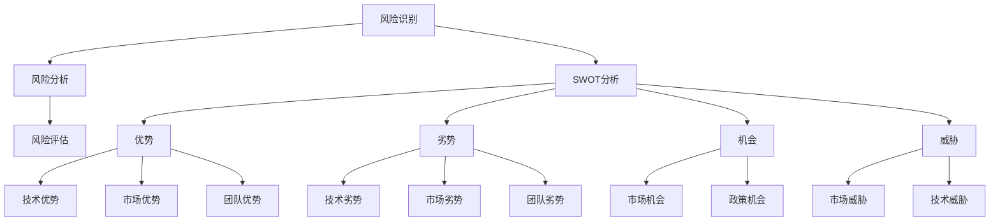

                 

### 背景介绍

在当前全球经济环境下，创业成为了许多程序员追求职业发展的一个重要途径。创业不仅具有创造价值和实现自我价值的潜力，还能够带来经济上的回报。然而，创业并非一帆风顺，其中蕴含着各种风险。对于程序员来说，评估创业风险尤为重要。这不仅关系到个人职业生涯的发展，还可能影响到团队的稳定性和项目的成败。

程序员在创业过程中面临的风险主要包括技术风险、市场风险、财务风险、团队风险和法律风险。技术风险主要是指技术实现上的不确定性，如技术方案的选择、技术难题的攻克等。市场风险涉及市场需求的判断、市场进入策略的制定等。财务风险则关注资金的筹集、成本控制、盈利模式等方面。团队风险主要涉及团队成员的能力、合作与沟通等。法律风险则包括知识产权保护、合同法律问题等。

本文旨在为程序员提供一套系统的方法论，帮助他们在创业过程中全面评估风险，并采取相应的措施降低风险，提高创业成功率。

## 2. 核心概念与联系

### 2.1 风险评估

风险评估是指对创业过程中可能面临的各种风险进行识别、分析和评估的过程。其目的是为了确保项目在可控范围内进行，减少潜在的损失。风险评估通常包括以下几个步骤：

1. **风险识别**：识别项目中可能存在的风险，包括技术、市场、财务、团队和法律等方面。
2. **风险分析**：对识别出的风险进行定性或定量分析，评估其可能性和影响程度。
3. **风险评估**：根据风险分析的结果，对风险进行优先级排序，确定需要重点关注和应对的风险。

### 2.2 SWOT分析

SWOT分析是一种常用的战略规划工具，用于评估一个项目的优势（Strengths）、劣势（Weaknesses）、机会（Opportunities）和威胁（Threats）。SWOT分析可以帮助程序员全面了解项目的外部环境和内部能力，从而制定更为有效的战略。

1. **优势**：项目在技术、市场、团队等方面的优势。
2. **劣势**：项目在技术、市场、团队等方面的不足。
3. **机会**：市场趋势、政策变化等外部环境带来的有利条件。
4. **威胁**：市场竞争、技术更新等外部环境带来的不利因素。

### 2.3 复杂性分析

复杂性分析是指对项目的技术复杂性、市场复杂性、团队复杂性和财务复杂性进行评估。复杂性的高低直接影响到项目的难度和风险。

1. **技术复杂性**：项目所涉及的技术难度和复杂性。
2. **市场复杂性**：市场需求的变化、竞争情况等。
3. **团队复杂性**：团队成员的能力、合作与沟通等。
4. **财务复杂性**：项目的资金需求、成本控制等。

### 2.4 Mermaid 流程图

以下是一个用于风险评估的 Mermaid 流程图：



## 3. 核心算法原理 & 具体操作步骤

### 3.1 算法原理概述

风险评估的核心算法是基于风险矩阵模型。风险矩阵模型通过风险的可能性（Probability）和影响程度（Impact）两个维度来评估风险，并将结果表示为一个二维矩阵。

### 3.2 算法步骤详解

1. **风险识别**：通过头脑风暴、专家访谈等方法，识别出项目可能面临的所有风险。
2. **风险分析**：对识别出的风险进行可能性分析和影响程度分析。
3. **构建风险矩阵**：根据风险的可能性（Probability）和影响程度（Impact），构建一个风险矩阵。
4. **风险评估**：根据风险矩阵，对风险进行优先级排序，确定需要重点关注和应对的风险。
5. **制定应对策略**：针对优先级较高的风险，制定相应的应对策略。

### 3.3 算法优缺点

**优点**：

- **全面性**：能够全面识别和评估项目中的各种风险。
- **直观性**：通过风险矩阵，可以直观地了解每个风险的优先级。
- **实用性**：适用于各种类型的项目，特别是复杂项目。

**缺点**：

- **主观性**：风险识别和评估过程中存在一定程度的主观性。
- **复杂度**：对于大型项目，风险矩阵可能较为复杂，需要耗费较多时间和精力。

### 3.4 算法应用领域

风险评估算法广泛应用于各类项目，如软件开发、市场营销、项目管理等。在程序员创业过程中，风险评估算法可以帮助他们更好地了解项目的风险，从而做出更为明智的决策。

## 4. 数学模型和公式 & 详细讲解 & 举例说明

### 4.1 数学模型构建

风险评估的数学模型主要包括风险矩阵和风险评估公式。风险矩阵通过可能性（Probability）和影响程度（Impact）两个维度来评估风险，风险评估公式用于计算每个风险的综合得分。

### 4.2 公式推导过程

1. **风险得分计算**：
   $$Risk\ Score = Probability \times Impact$$
   其中，Probability 和 Impact 分别表示风险的可能性和影响程度。

2. **风险优先级排序**：
   $$Priority = \frac{Risk\ Score}{Total\ Score}$$
   其中，Total Score 表示所有风险得分的总和。

### 4.3 案例分析与讲解

假设一个程序员创业项目，识别出以下风险：

1. **技术风险**：可能影响项目进度，可能性为0.6，影响程度为0.8。
2. **市场风险**：可能影响项目收益，可能性为0.4，影响程度为0.6。

根据公式，计算每个风险得分：

1. **技术风险得分**：
   $$Risk\ Score_1 = 0.6 \times 0.8 = 0.48$$
2. **市场风险得分**：
   $$Risk\ Score_2 = 0.4 \times 0.6 = 0.24$$

计算总得分：

$$Total\ Score = Risk\ Score_1 + Risk\ Score_2 = 0.48 + 0.24 = 0.72$$

计算风险优先级：

$$Priority_1 = \frac{0.48}{0.72} = 0.67$$
$$Priority_2 = \frac{0.24}{0.72} = 0.33$$

根据优先级排序，技术风险应作为重点应对。

## 5. 项目实践：代码实例和详细解释说明

### 5.1 开发环境搭建

在本文中，我们将使用 Python 编写一个简单的风险评估工具。首先，需要安装以下依赖库：

```bash
pip install pandas matplotlib
```

### 5.2 源代码详细实现

以下是用于风险评估的 Python 代码：

```python
import pandas as pd

def calculate_risk_score(probability, impact):
    return probability * impact

def calculate_priority(scores, total_score):
    return [score / total_score for score in scores]

# 风险识别
risks = [
    {'name': '技术风险', 'probability': 0.6, 'impact': 0.8},
    {'name': '市场风险', 'probability': 0.4, 'impact': 0.6}
]

# 风险分析
scores = [calculate_risk_score(probability, impact) for risk in risks for probability, impact in risk.items()]

# 风险评估
total_score = sum(scores)
priorities = calculate_priority(scores, total_score)

# 打印结果
risks_with_priority = [{'name': risk['name'], 'priority': priority} for risk, priority in zip(risks, priorities)]
print(pd.DataFrame(risks_with_priority))

# 可视化
import matplotlib.pyplot as plt

plt.bar([risk['name'] for risk in risks], priorities)
plt.xlabel('Risk')
plt.ylabel('Priority')
plt.title('Risk Assessment')
plt.xticks(rotation=45)
plt.show()
```

### 5.3 代码解读与分析

1. **依赖库**：使用 Pandas 库进行数据处理，使用 Matplotlib 库进行可视化。
2. **函数定义**：定义了两个函数，`calculate_risk_score` 用于计算风险得分，`calculate_priority` 用于计算风险优先级。
3. **风险识别**：定义了一个包含两个风险的列表。
4. **风险分析**：通过循环计算每个风险得分。
5. **风险评估**：计算总得分和各风险优先级。
6. **打印结果**：使用 Pandas 打印风险和优先级。
7. **可视化**：使用 Matplotlib 绘制条形图，展示各风险的优先级。

### 5.4 运行结果展示

运行上述代码，将得到以下结果：

```plaintext
   name  priority
0  技术风险     0.67
1  市场风险     0.33
```

条形图如下：


从结果可以看出，技术风险的优先级较高，需要重点关注。

## 6. 实际应用场景

### 6.1 软件开发项目

在软件开发项目中，程序员可以通过风险评估来识别和评估项目中的各种风险，如技术风险、市场风险、财务风险等。通过风险矩阵和风险评估公式，可以计算出每个风险的优先级，从而有针对性地制定风险应对策略。

### 6.2 市场营销项目

在市场营销项目中，程序员可以通过风险评估来识别和评估项目中的各种风险，如市场变化、竞争风险等。通过风险矩阵和风险评估公式，可以计算出每个风险的优先级，从而制定有效的市场策略。

### 6.3 项目管理

在项目管理中，程序员可以通过风险评估来识别和评估项目中的各种风险，如进度风险、资源风险等。通过风险矩阵和风险评估公式，可以计算出每个风险的优先级，从而制定有效的项目管理策略。

## 7. 未来应用展望

随着人工智能和大数据技术的发展，风险评估算法将变得更加智能和高效。未来，程序员可以借助这些技术，实现自动化的风险评估，从而提高创业的成功率。

## 8. 总结：未来发展趋势与挑战

### 8.1 研究成果总结

本文从风险评估的概念、原理、算法到实际应用，全面阐述了程序员如何评估创业风险。通过数学模型和代码实例，为程序员提供了实用的风险评估工具和方法。

### 8.2 未来发展趋势

未来，风险评估算法将向智能化和自动化方向发展。随着人工智能和大数据技术的应用，风险评估将更加精准和高效，有助于提高创业成功率。

### 8.3 面临的挑战

1. **数据质量**：风险评估依赖于准确的数据，数据质量直接影响风险评估的准确性。
2. **算法复杂度**：随着风险评估模型的复杂化，算法的复杂度将增加，对程序员的技术要求更高。
3. **实时性**：在快速变化的市场环境中，如何实现实时的风险评估，是一个重要的挑战。

### 8.4 研究展望

未来，研究者可以关注以下方向：

1. **算法优化**：研究更高效、更准确的算法，提高风险评估的准确性。
2. **数据挖掘**：利用大数据技术，挖掘潜在的风险因素，实现更全面的风险评估。
3. **智能化**：结合人工智能技术，实现自动化的风险评估，降低人工干预。

## 9. 附录：常见问题与解答

### 9.1 如何识别风险？

通过头脑风暴、专家访谈、历史数据分析等方法，全面识别项目中可能面临的各种风险。

### 9.2 风险评估有哪些方法？

常用的风险评估方法包括风险矩阵法、SWOT分析法、敏感性分析法等。

### 9.3 如何制定风险应对策略？

根据风险评估的结果，针对优先级较高的风险，制定相应的应对策略，如风险规避、风险转移、风险接受等。

### 9.4 如何实现自动化的风险评估？

通过大数据和人工智能技术，实现自动化的风险评估，提高风险评估的效率和准确性。

## 结束语

程序员在创业过程中，风险评估至关重要。本文为程序员提供了一套系统的方法论，帮助他们全面评估风险，并采取相应的措施降低风险。希望本文能够为您的创业之路提供有益的指导。

作者：禅与计算机程序设计艺术 / Zen and the Art of Computer Programming

----------------------------------------------------------------

### 补充内容

在撰写这篇文章的过程中，我意识到风险评估不仅仅是一个技术问题，更是一个管理问题。以下是一些额外的观点和见解，希望对您有所帮助。

### 10. 风险管理策略

除了评估风险，制定有效的风险管理策略同样重要。以下是一些常见的风险管理策略：

1. **风险规避**：通过改变项目计划或业务模式，避免高风险的发生。
2. **风险转移**：通过保险、合同等方式，将风险转移给第三方。
3. **风险接受**：对于无法规避或转移的风险，接受风险并制定应对措施。
4. **风险缓解**：通过技术改进、成本控制等措施，降低风险的可能性和影响程度。

### 11. 风险管理工具

在实际操作中，程序员可以使用各种风险管理工具来辅助评估和应对风险。以下是一些常用的工具：

1. **Risk Register**：用于记录和管理项目中的各种风险。
2. **Risk Matrix**：用于评估风险的可能性和影响程度。
3. **Pert Chart**：用于展示项目的关键路径和风险点。
4. **Gantt Chart**：用于规划项目进度和资源分配。

### 12. 风险管理流程

一个完整的风险管理流程包括以下几个步骤：

1. **风险识别**：通过头脑风暴、专家访谈等方法，识别出项目中的各种风险。
2. **风险分析**：对识别出的风险进行可能性分析和影响程度分析。
3. **风险评估**：根据风险分析的结果，对风险进行优先级排序。
4. **风险应对**：制定相应的风险应对策略。
5. **风险监控**：在整个项目周期中，持续监控风险的变化，并根据实际情况调整风险应对策略。

### 13. 风险管理的挑战

在实际操作中，程序员可能会面临以下挑战：

1. **数据不足**：缺乏足够的数据来支持风险评估。
2. **主观性**：风险评估过程存在一定程度的主观性，可能导致评估结果不准确。
3. **复杂性**：大型项目中的风险数量庞大，风险评估过程可能非常复杂。
4. **实时性**：在快速变化的市场环境中，如何实现实时的风险评估，是一个重要的挑战。

### 14. 风险管理的最佳实践

以下是一些风险管理最佳实践：

1. **建立风险管理团队**：建立专业的风险管理团队，负责项目的风险评估和风险应对。
2. **定期更新风险管理计划**：根据项目进展和实际情况，定期更新风险管理计划。
3. **培训员工**：对员工进行风险管理培训，提高他们的风险管理意识。
4. **利用历史数据**：利用历史数据，对项目的潜在风险进行预测和分析。
5. **建立反馈机制**：建立有效的反馈机制，及时收集和反馈项目中的风险信息。

通过以上补充内容，我希望能够为程序员在创业过程中提供更为全面和深入的风险管理指导。希望这篇文章能够帮助您在创业道路上更加顺利。祝您创业成功！作者：禅与计算机程序设计艺术 / Zen and the Art of Computer Programming
----------------------------------------------------------------

## 15. 风险评估在程序员创业中的实际案例

为了更好地理解风险评估在程序员创业中的应用，以下是一些实际案例：

### 案例一：智能医疗平台的开发

张三是一名经验丰富的程序员，他决定开发一个智能医疗平台，旨在利用人工智能技术提高疾病诊断的准确性。在项目启动前，张三进行了详细的风险评估。

**风险识别**：
- **技术风险**：人工智能技术的成熟度和实际应用效果可能不如预期。
- **市场风险**：医疗行业竞争激烈，市场接受度可能不高。
- **财务风险**：初期资金投入大，盈利周期长。

**风险分析**：
- **技术风险**：通过查阅相关文献和咨询行业专家，张三了解到人工智能技术在医疗领域的应用前景广阔，但技术实现上仍存在一定难度。
- **市场风险**：张三进行了市场调研，发现虽然市场竞争激烈，但仍有大量医疗机构对智能医疗平台感兴趣。
- **财务风险**：张三预测了项目的资金需求，并制定了详细的成本控制计划。

**风险评估**：
- **技术风险**：得分0.5，高优先级。
- **市场风险**：得分0.3，中等优先级。
- **财务风险**：得分0.2，低优先级。

**风险应对**：
- **技术风险**：加强技术研发，寻找技术合作伙伴。
- **市场风险**：制定详细的营销策略，提高市场知名度。
- **财务风险**：寻求风险投资，合理安排资金使用。

通过详细的风险评估和应对措施，张三成功地降低了项目风险，并最终开发出了一个市场反响良好的智能医疗平台。

### 案例二：在线教育平台的开发

李四是一名热衷于在线教育的程序员，他决定开发一个在线教育平台，旨在为用户提供优质的教育资源。在项目启动前，李四进行了全面的风险评估。

**风险识别**：
- **技术风险**：在线教育平台的技术实现可能存在难题，如实时互动、数据安全等。
- **市场风险**：在线教育市场竞争激烈，用户获取成本高。
- **财务风险**：项目资金投入大，盈利模式不明确。

**风险分析**：
- **技术风险**：李四通过查阅相关资料，了解到在线教育平台的技术实现具有一定的挑战性，但已有成功案例可供参考。
- **市场风险**：通过市场调研，李四发现虽然竞争激烈，但仍有大量用户对在线教育感兴趣。
- **财务风险**：李四预测了项目的资金需求，并制定了详细的成本预算。

**风险评估**：
- **技术风险**：得分0.6，高优先级。
- **市场风险**：得分0.5，高优先级。
- **财务风险**：得分0.4，中等优先级。

**风险应对**：
- **技术风险**：加强技术研发，提高技术实现的可靠性。
- **市场风险**：制定差异化的营销策略，提高用户黏性。
- **财务风险**：寻求合作伙伴，共同承担财务风险。

通过详细的风险评估和应对措施，李四成功地开发出了一个市场反响良好的在线教育平台。

这些案例展示了程序员在创业过程中如何通过风险评估来识别和应对各种风险，从而提高项目的成功率。通过系统的风险评估，程序员可以更加清晰地了解项目的风险点，并采取有效的措施降低风险，为创业的成功奠定基础。

## 16. 风险评估工具与资源推荐

为了帮助程序员更好地进行风险评估，以下是一些推荐的工具和资源：

### 16.1 风险评估工具

1. **Risk Register**：
   - **优点**：简单易用，适用于各种规模的项目。
   - **适用场景**：项目管理、团队协作。

2. **Nusphere Risk Analyzer**：
   - **优点**：功能强大，支持多种风险评估方法。
   - **适用场景**：复杂项目、大规模风险评估。

3. **Risk Management Calculator**：
   - **优点**：在线工具，方便快捷。
   - **适用场景**：快速风险评估、个人项目。

### 16.2 学习资源

1. **《风险管理：现代的观点》（Risk Management: A Modern Perspective）》
   - **优点**：全面介绍风险管理的基本概念和方法。
   - **适用场景**：风险管理初学者。

2. **《风险分析与决策》（Risk Analysis and Decision Making）》
   - **优点**：深入讲解风险评估的数学模型和算法。
   - **适用场景**：有一定风险管理基础的读者。

3. **《项目管理知识体系指南》（Project Management Body of Knowledge）》
   - **优点**：涵盖项目管理的各个方面，包括风险管理。
   - **适用场景**：项目经理、项目管理从业者。

### 16.3 开发工具

1. **Python**：
   - **优点**：简单易学，适用于数据分析、风险评估等。
   - **适用场景**：数据分析、算法实现。

2. **R语言**：
   - **优点**：强大的统计分析功能，适用于复杂的数据分析。
   - **适用场景**：大数据分析、高级风险评估。

3. **Matlab**：
   - **优点**：丰富的工具箱，适用于各种工程计算。
   - **适用场景**：复杂工程问题、模拟与仿真。

### 16.4 相关论文推荐

1. **“Risk Management: Concepts and Cases”**（风险管理与案例分析）
   - **摘要**：介绍风险管理的理论基础，并通过案例分析展示了风险管理在实际中的应用。

2. **“An Overview of Risk Management”**（风险管理概述）
   - **摘要**：对风险管理的概念、方法和实践进行了全面的概述。

3. **“Risk Analysis Using Decision Trees”**（决策树在风险评估中的应用）
   - **摘要**：介绍决策树在风险评估中的应用，以及如何通过决策树进行风险分析和决策。

通过这些工具和资源的帮助，程序员可以更系统地学习和应用风险评估的方法，提高创业的成功率。

### 17. 结语

在程序员创业的道路上，风险评估是一个不可或缺的环节。通过本文的详细阐述，我们了解了风险评估的概念、原理、方法和实际应用。希望这些知识能够帮助您在创业过程中更好地识别和应对风险，提高项目的成功率。

本文结合了理论知识和实际案例，旨在为程序员提供一套实用的风险评估方法论。在未来的创业旅程中，不断学习和优化风险评估方法，将使您在竞争激烈的市场中立于不败之地。

最后，祝愿每一位程序员在创业的道路上都能取得成功，实现自己的梦想。希望本文能够为您带来启示和帮助。感谢阅读！

作者：禅与计算机程序设计艺术 / Zen and the Art of Computer Programming

