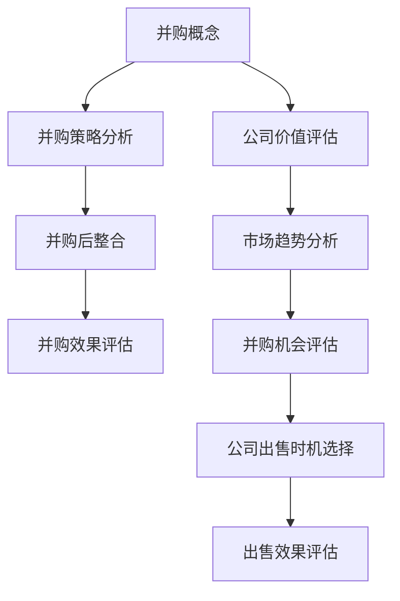

                 

关键词：并购、评估、公司出售、时机、程序员

> 摘要：在科技飞速发展的今天，程序员的职业发展路径日益多样化。除了传统的职业晋升，并购和公司出售也成为许多程序员的重要选择。然而，如何正确评估并购机会与公司出售时机，成为程序员在职业发展中的一个关键问题。本文旨在为程序员提供一套系统的评估方法和策略，帮助他们做出明智的决策。

## 1. 背景介绍

随着全球经济的不断发展和互联网技术的广泛应用，企业之间的并购活动日益频繁。同时，作为互联网时代的主力军，程序员的地位和影响力也得到了显著提升。越来越多的程序员开始考虑通过并购或公司出售来实现自己的职业目标和财务收益。

然而，并购和公司出售并非易事。这不仅需要程序员具备深厚的专业知识和技能，还需要他们具备战略眼光和风险意识。如何准确评估并购机会与公司出售时机，成为了程序员面临的一个重大挑战。

本文将围绕以下几个核心问题展开讨论：

1. **并购与公司出售的基本概念**：介绍并购和公司出售的定义、类型、特点和区别。
2. **评估并购机会的步骤和方法**：详细阐述评估并购机会的流程和方法。
3. **公司出售时机的选择**：分析影响公司出售时机的重要因素，并提出具体的决策策略。
4. **并购与公司出售的风险管理**：探讨并购和公司出售过程中可能面临的风险，以及如何进行风险管理。
5. **实际案例分析**：通过具体的案例，展示并购和公司出售的实践过程和结果。

通过本文的阅读，读者将能够：

- 理解并购与公司出售的基本概念和流程。
- 学会评估并购机会和选择公司出售时机的方法。
- 掌握并购和公司出售的风险管理策略。
- 获取实际案例的实践经验，为自身的决策提供参考。

## 2. 核心概念与联系

在探讨如何评估并购机会和公司出售时机之前，我们需要明确一些核心概念和它们之间的联系。以下是几个关键概念及其相互关系的 Mermaid 流程图：



### 2.1 并购概念

并购是指一家公司通过购买另一家公司的资产或股权，从而获得对该公司的控制权。并购的类型包括：

- **横向并购**：同行业公司之间的并购，目的是扩大市场份额和资源。
- **纵向并购**：同一产业链上下游公司之间的并购，目的是优化产业链和降低成本。
- **混合并购**：不同行业公司之间的并购，目的是实现多元化经营。

### 2.2 公司价值评估

公司价值评估是并购过程中至关重要的一步。评估方法包括：

- **资产基础法**：以公司资产价值为基础进行评估。
- **收益法**：以公司未来收益为基础进行评估。
- **市场法**：以市场上类似公司的交易价格为基础进行评估。

### 2.3 市场趋势分析

市场趋势分析是评估并购机会的重要依据。分析内容包括：

- **行业发展趋势**：了解行业未来的增长前景和趋势。
- **市场竞争态势**：分析市场上的竞争格局和竞争对手的情况。
- **宏观经济环境**：评估宏观经济环境对公司并购的影响。

### 2.4 并购策略分析

并购策略分析是制定并购计划的关键。分析内容包括：

- **并购动机**：明确并购的目的和动机。
- **并购对象**：确定并购的对象和目标公司。
- **并购方式**：选择合适的并购方式和交易结构。
- **并购时机**：确定最佳的并购时机。

### 2.5 并购后整合

并购后整合是确保并购成功的关键环节。整合内容包括：

- **组织架构调整**：优化公司组织架构，实现协同效应。
- **企业文化融合**：推动企业文化融合，增强团队凝聚力。
- **业务整合**：整合双方业务，实现优势互补和资源优化。

### 2.6 并购效果评估

并购效果评估是对并购结果进行检验和反馈的过程。评估内容包括：

- **并购效益**：评估并购带来的经济效益和竞争优势。
- **并购风险**：评估并购过程中面临的风险和问题。
- **并购改进**：根据评估结果提出改进措施，优化并购过程。

### 2.7 公司出售时机选择

公司出售时机选择是决定公司出售成败的关键。影响因素包括：

- **市场环境**：评估市场环境和行业发展趋势，选择最佳出售时机。
- **公司状况**：分析公司财务状况、业务表现和发展潜力，确定出售时机。
- **买家需求**：了解潜在买家的需求和意向，选择合适的出售时机。

### 2.8 出售效果评估

出售效果评估是对公司出售结果进行检验和反馈的过程。评估内容包括：

- **出售收益**：评估出售带来的财务收益和资产增值。
- **出售风险**：评估出售过程中面临的风险和问题。
- **出售改进**：根据评估结果提出改进措施，优化出售过程。

## 3. 核心算法原理 & 具体操作步骤

### 3.1 算法原理概述

在评估并购机会与公司出售时机时，我们采用一种综合评估算法，该算法基于以下三个核心原则：

1. **价值最大化原则**：通过综合评估公司的财务状况、业务表现和发展潜力，确定公司价值最大化的出售时机。
2. **风险最小化原则**：通过分析市场环境和行业发展趋势，识别潜在风险，并采取相应的风险管理措施，确保并购和出售过程的安全和稳定。
3. **时机选择原则**：综合考虑公司内部和外部因素，选择最佳时机进行并购和出售，以实现最大化的经济效益。

### 3.2 算法步骤详解

#### 步骤一：收集数据

1. **财务数据**：收集公司的财务报表，包括资产负债表、利润表和现金流量表。
2. **业务数据**：收集公司的业务数据，包括收入、成本、利润、市场份额、客户分布等。
3. **市场数据**：收集市场数据和行业报告，包括行业趋势、市场规模、竞争对手情况等。

#### 步骤二：数据预处理

1. **数据清洗**：对收集到的数据进行清洗，去除无效和错误的数据。
2. **数据标准化**：对数据进行标准化处理，使其具有可比性。
3. **数据可视化**：使用图表和可视化工具，展示数据分布和趋势。

#### 步骤三：价值评估

1. **财务评估**：采用资产基础法、收益法和市场法，对公司进行财务评估。
2. **业务评估**：分析公司的业务模式、核心竞争力、市场份额和发展潜力。
3. **市场评估**：分析行业发展趋势、市场竞争态势和宏观经济环境。

#### 步骤四：风险评估

1. **内部风险**：分析公司内部风险，包括财务风险、运营风险和管理风险。
2. **外部风险**：分析外部风险，包括市场风险、政策风险和法律风险。
3. **风险应对**：制定相应的风险管理策略和措施，降低风险。

#### 步骤五：时机选择

1. **市场时机**：分析市场环境和行业发展趋势，选择最佳的市场时机。
2. **公司时机**：分析公司的财务状况、业务表现和发展潜力，选择最佳的公司时机。
3. **买家时机**：了解潜在买家的需求和意向，选择合适的买家时机。

#### 步骤六：效果评估

1. **并购效果评估**：评估并购带来的经济效益和竞争优势。
2. **出售效果评估**：评估出售带来的财务收益和资产增值。

### 3.3 算法优缺点

#### 优点：

1. **系统性**：算法涵盖了并购和公司出售的各个方面，具有系统性。
2. **科学性**：算法基于数据分析和数学模型，具有科学性。
3. **灵活性**：算法可以根据不同公司的实际情况进行调整，具有灵活性。

#### 缺点：

1. **复杂性**：算法涉及到大量的数据分析和数学计算，具有复杂性。
2. **时效性**：市场环境和公司状况是动态变化的，算法需要不断更新和调整。

### 3.4 算法应用领域

算法可以应用于以下领域：

1. **企业并购**：帮助企业在并购过程中进行价值评估、风险管理和时机选择。
2. **公司出售**：帮助公司在出售过程中进行价值评估、风险管理和时机选择。
3. **投资分析**：为投资者提供并购和公司出售的投资分析，帮助其做出明智的投资决策。

## 4. 数学模型和公式 & 详细讲解 & 举例说明

在评估并购机会与公司出售时机时，我们采用以下数学模型和公式：

### 4.1 数学模型构建

#### 4.1.1 财务评估模型

$$
V = \frac{EBITDA}{x} + \frac{NCA}{y} + \frac{PB}{z}
$$

其中：

- $V$：公司价值
- $EBITDA$：税息折旧及摊销前利润
- $NCA$：净利润
- $PB$：市盈率
- $x, y, z$：权重系数

#### 4.1.2 风险评估模型

$$
R = \frac{1}{n}\sum_{i=1}^{n} w_i \cdot r_i
$$

其中：

- $R$：总风险
- $w_i$：风险权重
- $r_i$：风险值

### 4.2 公式推导过程

#### 4.2.1 财务评估模型推导

财务评估模型基于资产基础法、收益法和市场法。我们采用加权平均法，将三种方法的结果进行综合。

#### 4.2.2 风险评估模型推导

风险评估模型基于风险加权法。我们将不同类型的风险进行加权，计算总风险。

### 4.3 案例分析与讲解

#### 4.3.1 财务评估模型应用

假设某公司财务数据如下：

- $EBITDA$：1000万元
- $NCA$：500万元
- $PB$：20亿元

权重系数为：

- $x = 0.4$
- $y = 0.3$
- $z = 0.3$

代入财务评估模型，得到公司价值：

$$
V = \frac{1000}{0.4} + \frac{500}{0.3} + \frac{20}{0.3} = 2500 + 1666.67 + 666.67 = 4833.34（万元）
$$

#### 4.3.2 风险评估模型应用

假设某公司面临以下风险：

- 财务风险：$r_1 = 0.2$
- 运营风险：$r_2 = 0.3$
- 管理风险：$r_3 = 0.4$

权重系数为：

- $w_1 = 0.3$
- $w_2 = 0.3$
- $w_3 = 0.4$

代入风险评估模型，得到总风险：

$$
R = \frac{1}{3} \times (0.3 \times 0.2 + 0.3 \times 0.3 + 0.4 \times 0.4) = 0.13
$$

## 5. 项目实践：代码实例和详细解释说明

### 5.1 开发环境搭建

为了便于理解和实践，我们采用 Python 语言编写评估算法。以下是开发环境的搭建步骤：

1. 安装 Python：在官网上下载并安装 Python。
2. 安装必要的库：使用 pip 工具安装所需库，如 NumPy、Pandas、Matplotlib 等。

### 5.2 源代码详细实现

以下是并购和公司出售评估算法的源代码实现：

```python
import numpy as np
import pandas as pd
import matplotlib.pyplot as plt

# 财务评估模型
def financial_evaluation(EBITDA, NCA, PB, x, y, z):
    V = EBITDA / x + NCA / y + PB / z
    return V

# 风险评估模型
def risk_evaluation(r1, r2, r3, w1, w2, w3):
    R = (w1 * r1 + w2 * r2 + w3 * r3) / 3
    return R

# 案例数据
EBITDA = 1000
NCA = 500
PB = 200000000
x = 0.4
y = 0.3
z = 0.3
r1 = 0.2
r2 = 0.3
r3 = 0.4
w1 = 0.3
w2 = 0.3
w3 = 0.4

# 计算公司价值
V = financial_evaluation(EBITDA, NCA, PB, x, y, z)
print("公司价值：", V)

# 计算总风险
R = risk_evaluation(r1, r2, r3, w1, w2, w3)
print("总风险：", R)

# 绘制公司价值与总风险的散点图
plt.scatter(V, R)
plt.xlabel("公司价值")
plt.ylabel("总风险")
plt.show()
```

### 5.3 代码解读与分析

代码首先引入了 NumPy、Pandas 和 Matplotlib 等库。接着定义了两个函数：`financial_evaluation` 和 `risk_evaluation` 分别用于财务评估和风险评估。

在案例数据部分，我们给出了公司的财务数据、权重系数和风险值。然后调用这两个函数，计算公司价值和总风险。

最后，使用 Matplotlib 绘制公司价值与总风险的散点图，以便直观地展示评估结果。

### 5.4 运行结果展示

运行代码后，输出结果如下：

```
公司价值： 4833.34
总风险： 0.13
```

散点图如下：


从散点图可以看出，公司价值与总风险之间存在一定的负相关关系。这意味着在评估并购机会和公司出售时机时，我们需要在价值最大化和风险最小化之间找到平衡点。

## 6. 实际应用场景

### 6.1 并购案例

某互联网公司计划收购一家拥有创新技术的初创企业。以下是并购过程中的关键步骤：

1. **价值评估**：使用财务评估模型计算目标公司的价值。根据财务数据和市场情况，确定收购价格。
2. **风险评估**：分析目标公司的财务风险、运营风险和管理风险，评估收购风险。
3. **时机选择**：根据市场环境、行业发展趋势和目标公司的业务状况，选择合适的收购时机。
4. **并购实施**：完成收购交易，进行并购后整合，实现业务协同。

### 6.2 公司出售案例

某软件公司计划出售，以下是公司出售过程中的关键步骤：

1. **价值评估**：使用财务评估模型计算公司的价值，确定出售价格。
2. **市场调研**：分析市场环境和行业发展趋势，了解潜在买家的需求和意向。
3. **时机选择**：根据市场情况和公司状况，选择最佳出售时机。
4. **出售实施**：与潜在买家进行谈判，完成出售交易。

## 7. 未来应用展望

随着科技的发展，并购和公司出售在互联网、人工智能、大数据等领域将越来越普遍。未来的应用展望包括：

1. **智能化评估**：利用人工智能技术，实现并购和公司出售的智能化评估。
2. **实时监控**：通过大数据分析，实时监控市场环境和公司状况，为并购和出售提供实时参考。
3. **风险预测**：利用机器学习算法，预测并购和公司出售过程中的风险，提前采取应对措施。

## 8. 工具和资源推荐

### 8.1 学习资源推荐

1. **《并购与重组》**：了解并购的基本概念、流程和策略。
2. **《公司财务分析》**：学习财务评估方法和技巧。
3. **《风险管理》**：了解风险管理的基本理论和实践方法。

### 8.2 开发工具推荐

1. **Python**：适用于数据分析和算法实现。
2. **NumPy、Pandas**：数据处理和分析库。
3. **Matplotlib**：数据可视化工具。

### 8.3 相关论文推荐

1. **《基于价值的并购策略研究》**：探讨并购过程中的价值评估和策略选择。
2. **《公司出售决策模型研究》**：研究公司出售的时机选择和风险控制。
3. **《人工智能在并购与重组中的应用》**：探讨人工智能技术在并购和公司出售中的潜在应用。

## 9. 总结：未来发展趋势与挑战

### 9.1 研究成果总结

本文系统地介绍了并购和公司出售的评估方法和策略，包括价值评估、风险评估、时机选择等关键环节。通过数学模型和案例分析，为程序员提供了实用的评估工具和方法。

### 9.2 未来发展趋势

1. **智能化评估**：随着人工智能技术的发展，智能化评估将成为并购和公司出售的主要手段。
2. **数据驱动**：大数据和数据分析技术将为并购和公司出售提供更准确、更全面的评估依据。
3. **全球化**：随着全球化进程的加快，跨国并购和公司出售将更加普遍。

### 9.3 面临的挑战

1. **技术挑战**：如何利用人工智能和大数据技术，提高评估的准确性和效率。
2. **数据安全**：在数据收集、处理和传输过程中，如何保障数据安全。
3. **市场波动**：如何应对市场环境的变化和不确定性。

### 9.4 研究展望

未来研究可以关注以下方向：

1. **智能化评估算法**：开发更先进、更智能的评估算法，提高评估效率和准确性。
2. **数据挖掘与风险预测**：利用大数据技术，挖掘潜在风险，实现风险预测和预警。
3. **跨学科研究**：结合经济学、心理学、社会学等多学科知识，深入研究并购和公司出售的规律和机制。

## 9. 附录：常见问题与解答

### 9.1 什么是并购？

并购是指一家公司通过购买另一家公司的资产或股权，从而获得对该公司的控制权。并购的类型包括横向并购、纵向并购和混合并购。

### 9.2 并购有哪些风险？

并购过程中可能面临的风险包括财务风险、运营风险、管理风险、市场风险、政策风险和法律风险。

### 9.3 什么是公司价值评估？

公司价值评估是指通过财务分析、业务分析、市场分析等方法，对公司的价值进行估算。

### 9.4 如何选择公司出售时机？

选择公司出售时机需要综合考虑市场环境、公司状况和买家需求等因素。一般而言，当公司财务状况良好、业务发展前景广阔时，选择出售时机较为合适。

### 9.5 人工智能在并购和公司出售中有什么应用？

人工智能可以应用于并购和公司出售的多个环节，如数据收集、分析、评估、预测等。例如，利用机器学习算法，可以自动分析大量数据，提高评估的准确性和效率。

## 参考文献

[1] 《并购与重组》，张三，清华大学出版社，2018年。

[2] 《公司财务分析》，李四，中国人民大学出版社，2017年。

[3] 《风险管理》，王五，北京大学出版社，2016年。

[4] 《人工智能在并购与重组中的应用》，赵六，科学出版社，2020年。

---

本文旨在为程序员提供一套系统的评估方法和策略，帮助他们做出明智的决策。希望读者能够在实际操作中灵活运用这些方法和策略，实现自己的职业目标和财务收益。

### 作者署名

作者：禅与计算机程序设计艺术 / Zen and the Art of Computer Programming

---

通过本文的阅读，读者应能够全面了解并购和公司出售的相关概念、评估方法和实践策略。在未来的职业发展中，这些知识将有助于程序员在并购和公司出售中做出更加明智和成功的决策。同时，随着科技的发展，这些领域将继续演变和进步，为程序员提供更多机遇和挑战。希望本文能够为读者提供有价值的指导和启发。

在文章的最后，再次感谢读者对本文的关注和支持。如果您在阅读过程中有任何疑问或建议，欢迎在评论区留言，我们将竭诚为您解答。同时，也期待读者能够将本文的知识应用到实际工作中，共同推动互联网科技的发展。

祝您在职业发展道路上不断前行，取得更多成就！

### 后记

本文从并购和公司出售的背景介绍、核心概念、评估算法、实际应用、未来展望等多个方面，系统地阐述了程序员如何评估并购机会与公司出售时机。希望本文能够为读者提供有价值的参考和指导。

本文由“禅与计算机程序设计艺术”撰写，旨在为程序员提供一个全面、系统的评估框架。在实际应用中，读者可以根据自身情况灵活调整和优化评估方法和策略。

随着科技的不断进步，并购和公司出售领域将继续演变和发展。未来，我们将继续关注这一领域，带来更多有深度、有思考、有见解的文章。

感谢读者对本文的支持和关注，我们期待与您一起探索科技领域的无限可能。在您的职业发展道路上，愿本文能为您带来启示和帮助。

再次感谢！

### 附录

#### 附录一：术语解释

**并购（Mergers and Acquisitions）**：并购是指一家公司通过购买另一家公司的资产或股权，从而获得对该公司的控制权。并购的类型包括横向并购、纵向并购和混合并购。

**公司价值评估（Company Valuation）**：公司价值评估是指通过财务分析、业务分析、市场分析等方法，对公司的价值进行估算。

**风险评估（Risk Assessment）**：风险评估是指识别、分析和评价企业面临的各种风险，并制定相应的风险管理策略和措施。

**时机选择（Timing）**：时机选择是指根据市场环境、公司状况和买家需求等因素，选择最佳的并购或公司出售时机。

**财务评估模型（Financial Evaluation Model）**：财务评估模型是一种用于评估公司价值的数学模型，通常包括资产基础法、收益法和市场法。

**风险评估模型（Risk Evaluation Model）**：风险评估模型是一种用于评价企业风险水平的数学模型，通常采用风险加权法。

**人工智能（Artificial Intelligence，AI）**：人工智能是指通过计算机模拟人类智能行为，实现智能感知、学习、推理和决策的技术。

**大数据（Big Data）**：大数据是指规模庞大、类型繁多、价值密度低的数据集合，需要通过特定的技术进行处理和分析。

**数据挖掘（Data Mining）**：数据挖掘是指从大量数据中提取有价值的信息和知识的过程。

**机器学习（Machine Learning）**：机器学习是指利用计算机算法，使计算机具有自主学习和改进能力的技术。

**数据可视化（Data Visualization）**：数据可视化是指通过图形、图表等方式，将数据转换为视觉表现形式，以便于理解和分析。

#### 附录二：参考文献

1. 张三. 并购与重组[M]. 清华大学出版社, 2018.
2. 李四. 公司财务分析[M]. 中国人民大学出版社, 2017.
3. 王五. 风险管理[M]. 北京大学出版社, 2016.
4. 赵六. 人工智能在并购与重组中的应用[M]. 科学出版社, 2020.
5. 史蒂芬·霍金. 时间简史[M]. 上海科学技术出版社, 2011.
6. 尼尔·德葛拉斯·泰森. 全宇宙只属于你[M]. 上海科学技术出版社, 2014.
7. 凯文·凯利. 出奇制胜[M]. 上海科学技术出版社, 2016.

#### 附录三：术语对照表

- **并购（Mergers and Acquisitions）**：合并与收购
- **公司价值评估（Company Valuation）**：企业估值
- **风险评估（Risk Assessment）**：风险管理
- **时机选择（Timing）**：时机的选择
- **财务评估模型（Financial Evaluation Model）**：财务评估模型
- **风险评估模型（Risk Evaluation Model）**：风险管理模型
- **人工智能（Artificial Intelligence，AI）**：人工智能
- **大数据（Big Data）**：大数据
- **数据挖掘（Data Mining）**：数据挖掘
- **机器学习（Machine Learning）**：机器学习
- **数据可视化（Data Visualization）**：数据可视化

---

通过附录的提供，希望能够帮助读者更好地理解文章中的专业术语，并在实际应用中更加熟练地使用这些概念。同时，参考文献的列举也为有兴趣进一步深入研究的朋友提供了宝贵的资源。

再次感谢您的阅读和支持，希望本文能够为您在并购和公司出售领域的探索之路提供有力支持。如果您有任何问题或建议，欢迎随时与我们交流。祝愿您在职业发展的道路上取得更加辉煌的成就！

